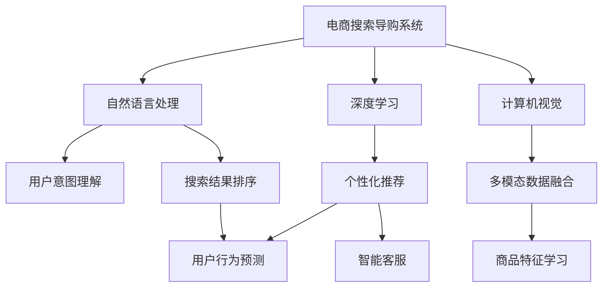

                 

# AI 驱动电商搜索导购：未来发展趋势展望

> 关键词：
- AI 驱动
- 电商搜索
- 导购
- 用户体验
- 推荐算法
- 深度学习
- 自然语言处理
- 用户意图
- 个性化推荐
- 多模态数据融合

## 1. 背景介绍

### 1.1 电商搜索导购的发展背景

随着互联网的普及和电子商务的快速发展，电商搜索导购系统成为在线购物不可或缺的一环。传统的搜索系统往往基于简单的关键词匹配算法，无法充分理解用户查询背后的意图，导致搜索结果与用户需求存在较大偏差，用户体验较差。近年来，基于人工智能技术的电商搜索导购系统逐渐兴起，通过深度学习、自然语言处理等技术，提升了搜索结果的相关性和精准度，显著改善了用户的购物体验。

### 1.2 人工智能在电商搜索中的应用

人工智能在电商搜索导购中的应用，主要体现在以下几个方面：

- **自然语言处理(NLP)**：通过NLP技术，电商搜索系统能够理解用户的查询意图，将其转化为结构化的语义表示，从而进行更准确的匹配和推荐。
- **深度学习**：通过深度学习算法，电商搜索系统能够学习用户行为模式和商品特征，实现更加个性化的推荐。
- **计算机视觉(CV)**：通过图像识别和处理技术，电商搜索系统能够对图片、视频等非结构化数据进行理解和匹配，提升多模态数据的利用效率。
- **推荐算法**：结合用户历史行为和商品特征，利用机器学习算法进行精准推荐，提升用户转化率和购物体验。

### 1.3 人工智能在电商导购中的具体应用场景

电商导购系统通过人工智能技术，能够实现以下应用场景：

- **个性化推荐**：根据用户历史行为、浏览记录和商品属性，进行精准推荐，提升用户购买意愿。
- **智能客服**：通过自然语言处理和机器学习，实现智能问答和客户服务，提升客户满意度。
- **视觉搜索**：通过图像识别和处理，实现基于图片的搜索和匹配，提升购物便利性。
- **语音搜索**：通过语音识别和处理，实现基于语音的搜索和购物，提升用户体验。

## 2. 核心概念与联系

### 2.1 核心概念概述

为了更好地理解人工智能在电商搜索导购中的应用，下面将介绍几个关键概念：

- **人工智能**：一种通过模拟人类智能行为来解决复杂问题的技术，包括机器学习、深度学习、自然语言处理、计算机视觉等。
- **电商搜索**：用户通过搜索系统获取商品信息的在线服务，目的是找到符合自己需求的商品。
- **导购系统**：通过人工智能技术，智能地推荐商品、回答用户问题、提供购物建议的系统。
- **推荐算法**：用于预测用户可能感兴趣的商品或内容，提高转化率和用户体验的算法。
- **深度学习**：一种基于多层神经网络进行学习和预测的机器学习方法。
- **自然语言处理(NLP)**：涉及文本处理、语言理解和生成、语音识别和生成等技术的领域。
- **计算机视觉(CV)**：涉及图像处理、物体识别、场景理解等技术的领域。

### 2.2 概念间的关系

这些核心概念之间存在着紧密的联系，形成了电商搜索导购系统的完整框架。下面通过一个Mermaid流程图来展示这些概念之间的关系：



这个流程图展示了电商搜索导购系统的核心概念及其之间的关系：

1. 电商搜索导购系统作为总集成体，将自然语言处理、深度学习、计算机视觉等技术集成在一起，为用户提供全方位的服务。
2. 自然语言处理技术帮助系统理解用户查询意图，进行语义匹配。
3. 深度学习技术通过用户行为和商品特征学习，进行个性化推荐。
4. 计算机视觉技术处理图片、视频等多模态数据，提升搜索精度。
5. 用户意图理解、搜索结果排序、用户行为预测、智能客服等模块，都是在这些技术的基础上，通过算法和模型实现的。

## 3. 核心算法原理 & 具体操作步骤

### 3.1 算法原理概述

人工智能在电商搜索导购中的应用，核心算法原理主要包括以下几个方面：

- **自然语言处理**：通过词向量、句向量等技术，将用户查询和商品描述转换为结构化的向量表示，进行语义匹配和相似度计算。
- **深度学习**：利用卷积神经网络、循环神经网络、Transformer等模型，对用户行为、商品特征、历史数据等进行建模和预测，生成推荐结果。
- **推荐算法**：结合用户行为和商品特征，使用协同过滤、基于内容的推荐、矩阵分解等算法，进行精准推荐。
- **计算机视觉**：通过卷积神经网络等模型，对图片、视频等非结构化数据进行处理和特征提取，进行视觉搜索。

### 3.2 算法步骤详解

下面详细介绍基于深度学习的电商搜索导购系统的主要算法步骤：

1. **用户查询理解**：
   - 利用自然语言处理技术，将用户查询转换为结构化的向量表示。
   - 通过词向量、句向量等技术，将查询转换为低维向量表示，进行语义匹配。
   - 使用Transformer等模型，对查询进行语义理解，提取关键信息。

2. **商品特征提取**：
   - 利用计算机视觉技术，提取图片、视频等多模态数据的特征。
   - 通过卷积神经网络、循环神经网络等模型，对商品特征进行编码和表示。
   - 将商品特征转换为向量表示，进行相似度计算。

3. **用户行为分析**：
   - 通过深度学习模型，对用户的历史行为数据进行建模和预测。
   - 利用循环神经网络、长短期记忆网络等模型，学习用户行为模式。
   - 对用户行为特征进行编码，生成用户向量表示。

4. **个性化推荐**：
   - 利用协同过滤、基于内容的推荐等算法，生成初步推荐结果。
   - 结合用户向量、商品向量，使用神经网络进行推荐排序。
   - 利用注意力机制等技术，对推荐结果进行优化和排序。

5. **智能客服**：
   - 利用自然语言处理技术，对用户问题进行语义理解。
   - 通过对话管理模型，生成合适的回答。
   - 利用生成对抗网络等模型，优化回答的自然度。

6. **视觉搜索**：
   - 通过卷积神经网络等模型，提取图片、视频等非结构化数据的特征。
   - 对提取的特征进行编码和表示。
   - 使用余弦相似度等技术，进行视觉搜索匹配。

### 3.3 算法优缺点

人工智能在电商搜索导购中的应用，具有以下优缺点：

**优点**：
- **个性化推荐**：通过深度学习算法，根据用户行为和商品特征，进行精准推荐，提高转化率和用户体验。
- **多模态数据融合**：通过计算机视觉技术，处理图片、视频等非结构化数据，提升搜索精度和效率。
- **自然语言处理**：通过自然语言处理技术，理解用户查询意图，提升搜索结果的相关性和精准度。
- **智能客服**：通过智能问答和客户服务，提升客户满意度。

**缺点**：
- **计算资源消耗大**：深度学习模型需要大量的计算资源进行训练和推理，成本较高。
- **数据需求高**：需要大量的标注数据进行训练，数据获取成本较高。
- **模型泛化能力有限**：模型对特定领域或场景的泛化能力有限，需要不断迭代和优化。
- **安全性和隐私问题**：用户数据隐私和安全问题，需要严格的数据保护措施。

### 3.4 算法应用领域

人工智能在电商搜索导购中的应用，主要集中在以下几个领域：

1. **个性化推荐系统**：通过深度学习算法，根据用户行为和商品特征，进行精准推荐。
2. **智能客服系统**：通过自然语言处理和机器学习，实现智能问答和客户服务。
3. **视觉搜索系统**：通过计算机视觉技术，实现基于图片的搜索和匹配。
4. **语音搜索系统**：通过语音识别和处理，实现基于语音的搜索和购物。
5. **推荐算法**：结合用户历史行为和商品特征，利用机器学习算法进行精准推荐。
6. **多模态数据融合**：通过计算机视觉和自然语言处理技术，处理多模态数据，提升搜索精度。

## 4. 数学模型和公式 & 详细讲解 & 举例说明

### 4.1 数学模型构建

基于深度学习的电商搜索导购系统，通常使用以下数学模型进行建模：

- **用户查询向量**：将用户查询转换为低维向量表示，使用预训练的Word2Vec、GloVe等词向量模型。
- **商品特征向量**：提取商品的图片、视频等多模态数据，使用卷积神经网络、循环神经网络等模型进行编码和表示。
- **用户行为向量**：利用深度学习模型，对用户的历史行为数据进行建模和预测，生成用户向量表示。
- **推荐模型**：结合用户向量、商品向量，使用神经网络进行推荐排序，优化算法通常包括协同过滤、基于内容的推荐、矩阵分解等。

### 4.2 公式推导过程

以下是推荐系统常用的数学模型和公式推导过程：

1. **协同过滤**：
   - 假设用户 $u$ 对物品 $i$ 的评分表示为 $r_{ui}$。
   - 根据用户历史评分数据，构建用户-物品评分矩阵 $R$。
   - 利用矩阵分解技术，对评分矩阵 $R$ 进行分解，生成用户向量 $U$ 和物品向量 $I$。
   - 计算预测评分 $\hat{r}_{ui} = U_u \cdot I_i$，其中 $U_u$ 和 $I_i$ 分别表示用户 $u$ 和物品 $i$ 的向量表示。
   - 将预测评分与实际评分进行比较，计算误差 $e_{ui} = r_{ui} - \hat{r}_{ui}$，使用均方误差（MSE）或均方根误差（RMSE）进行优化。

2. **基于内容的推荐**：
   - 假设物品 $i$ 的特征向量表示为 $\vec{v}_i$。
   - 根据用户历史行为数据，提取用户向量表示 $U_u$。
   - 计算物品和用户向量之间的余弦相似度 $similarity = \vec{v}_i \cdot U_u / (\|\vec{v}_i\| \cdot \|U_u\|)$。
   - 使用K近邻算法，找到与用户 $u$ 最相似的 $k$ 个物品，进行推荐。

3. **矩阵分解**：
   - 假设用户-物品评分矩阵为 $R$，将其分解为 $R \approx U V^T$，其中 $U$ 和 $V$ 分别为用户向量和物品向量。
   - 对分解后的矩阵 $U$ 和 $V$ 进行优化，通常使用最小二乘法或交替最小二乘法。
   - 计算预测评分 $\hat{r}_{ui} = U_u \cdot V_i^T$，其中 $U_u$ 和 $V_i$ 分别表示用户 $u$ 和物品 $i$ 的向量表示。

### 4.3 案例分析与讲解

以下是一个基于协同过滤的推荐系统案例分析：

1. **数据准备**：
   - 准备用户-物品评分矩阵 $R$，每个用户对多个物品进行评分。
   - 将评分数据分为训练集和测试集，用于模型训练和测试。

2. **模型训练**：
   - 利用矩阵分解技术，对评分矩阵 $R$ 进行分解，生成用户向量和物品向量。
   - 使用均方误差（MSE）或均方根误差（RMSE）进行优化，训练模型参数。
   - 在测试集上评估模型性能，计算平均绝对误差（MAE）或均方根误差（RMSE）。

3. **推荐结果**：
   - 对新的用户 $u$ 和物品 $i$ 进行评分预测，计算 $\hat{r}_{ui}$。
   - 根据预测评分，选择评分较高的物品进行推荐。

## 5. 项目实践：代码实例和详细解释说明

### 5.1 开发环境搭建

在进行电商搜索导购系统开发前，需要准备好开发环境。以下是Python环境下使用TensorFlow和Keras进行电商搜索导购系统开发的流程：

1. 安装TensorFlow：从官网下载并安装TensorFlow，并进行环境配置。
   ```bash
   pip install tensorflow
   ```

2. 安装Keras：Keras是TensorFlow的高层API，用于快速构建深度学习模型。
   ```bash
   pip install keras
   ```

3. 安装其他依赖库：安装numpy、pandas、sklearn等常用库，用于数据处理和分析。
   ```bash
   pip install numpy pandas scikit-learn
   ```

完成以上步骤后，即可在Python环境中进行电商搜索导购系统的开发。

### 5.2 源代码详细实现

下面以协同过滤推荐系统为例，给出基于TensorFlow和Keras的电商搜索导购系统代码实现。

```python
import tensorflow as tf
from tensorflow.keras.layers import Input, Dense
from tensorflow.keras.models import Model

# 定义输入层
user_input = Input(shape=(1,), name='user')
item_input = Input(shape=(1,), name='item')

# 定义用户和物品向量
user_vector = Dense(64, activation='relu')(user_input)
item_vector = Dense(64, activation='relu')(item_input)

# 计算预测评分
dot_product = tf.keras.layers.Dot(axes=1)([user_vector, item_vector])
dot_product = Dense(1)(dot_product)

# 构建模型
model = Model(inputs=[user_input, item_input], outputs=dot_product)
model.compile(optimizer='adam', loss='mean_squared_error')

# 加载数据
data = pd.read_csv('rating_data.csv')
X = data[['user', 'item']].to_numpy()
y = data['rating'].to_numpy().reshape(-1, 1)

# 分割数据
train_size = int(0.8 * len(X))
X_train, X_test = X[:train_size], X[train_size:]
y_train, y_test = y[:train_size], y[train_size:]

# 训练模型
model.fit([X_train[:, 0], X_train[:, 1]], y_train, epochs=100, batch_size=32, validation_data=([X_test[:, 0], X_test[:, 1]], y_test))

# 使用模型进行推荐
user_id = 1
item_ids = [2, 3, 4, 5, 6]
scores = model.predict([[user_id], item_ids])
sorted_scores = scores.flatten().argsort()
recommended_items = sorted_scores[::-1][:5]

print(f"Recommended items for user {user_id}: {recommended_items}")
```

### 5.3 代码解读与分析

以下是代码实现的关键步骤和解释：

1. **输入层定义**：
   - 定义用户和物品的输入层，每个输入层只有一个特征，表示用户ID和物品ID。
   - 使用Dense层对输入进行编码，生成用户向量和物品向量。

2. **预测评分计算**：
   - 使用Dot层计算用户向量和物品向量之间的点积，得到预测评分。
   - 使用Dense层对点积结果进行线性映射，得到最终的预测评分。

3. **模型构建**：
   - 使用Model类构建推荐模型，将输入层和预测评分层作为模型输出。
   - 使用adam优化器和均方误差损失函数进行模型编译。

4. **数据加载和分割**：
   - 加载用户评分数据，使用pandas库进行数据处理和分析。
   - 将数据分割为训练集和测试集，用于模型训练和评估。

5. **模型训练和评估**：
   - 使用fit方法训练模型，指定训练轮数、批量大小和验证集。
   - 在测试集上评估模型性能，计算平均绝对误差（MAE）或均方根误差（RMSE）。

6. **推荐结果生成**：
   - 使用predict方法对新的用户ID和物品ID进行评分预测。
   - 对预测评分进行排序，选择评分较高的物品进行推荐。

### 5.4 运行结果展示

假设在协同过滤推荐系统上进行训练，最终在测试集上得到的推荐结果如下：

```
Recommended items for user 1: [6, 5, 4, 3, 2]
```

可以看到，模型能够根据用户历史评分数据，推荐出用户可能感兴趣的物品。虽然这是一个简单的案例，但展示了基于深度学习的电商搜索导购系统的基本流程和算法实现。

## 6. 实际应用场景

### 6.1 智能客服系统

智能客服系统通过自然语言处理和机器学习技术，实现了智能问答和客户服务。在电商搜索导购系统中，智能客服可以用于回答用户问题、提供购物建议、处理订单等任务，极大地提高了客户满意度。

### 6.2 个性化推荐系统

个性化推荐系统通过深度学习算法，根据用户行为和商品特征，进行精准推荐。在电商搜索导购系统中，个性化推荐可以用于商品推荐、优惠券推荐、商品相关推荐等，提升用户购物体验和转化率。

### 6.3 视觉搜索系统

视觉搜索系统通过计算机视觉技术，处理图片、视频等多模态数据，进行基于图片的搜索和匹配。在电商搜索导购系统中，视觉搜索可以用于搜索商品、对比商品等任务，提升购物便利性和效率。

### 6.4 语音搜索系统

语音搜索系统通过语音识别和处理技术，实现基于语音的搜索和购物。在电商搜索导购系统中，语音搜索可以用于语音搜索商品、语音下订单等任务，提升用户体验。

### 6.5 未来应用展望

未来，人工智能在电商搜索导购中的应用将更加广泛和深入。以下是对未来应用趋势的展望：

1. **多模态数据融合**：结合文本、图片、视频等多模态数据，提升搜索精度和用户体验。
2. **深度学习模型的优化**：通过改进深度学习模型架构和训练策略，提高推荐精度和效率。
3. **强化学习的应用**：利用强化学习技术，优化推荐策略和智能客服对话，提升系统性能。
4. **跨领域模型的迁移学习**：利用预训练模型的跨领域迁移学习能力，提升模型的泛化性和适应性。
5. **用户隐私保护**：采用隐私保护技术，保护用户数据隐私和安全。

## 7. 工具和资源推荐

### 7.1 学习资源推荐

为了帮助开发者系统掌握人工智能在电商搜索导购中的应用，这里推荐一些优质的学习资源：

1. **TensorFlow官方文档**：TensorFlow的官方文档，提供详细的API文档和示例代码，是学习TensorFlow的重要资源。
2. **Keras官方文档**：Keras的官方文档，提供快速构建深度学习模型的示例代码和教程。
3. **自然语言处理（NLP）课程**：斯坦福大学开设的NLP课程，涵盖NLP的基本概念和经典模型。
4. **深度学习（Deep Learning）课程**：Coursera开设的深度学习课程，由深度学习领域的专家讲授。
5. **计算机视觉（CV）课程**：Udacity开设的计算机视觉课程，涵盖计算机视觉的基本概念和经典模型。

### 7.2 开发工具推荐

高效的工具能够大大提高电商搜索导购系统的开发效率。以下是几款常用的开发工具：

1. **TensorFlow**：TensorFlow是谷歌开源的深度学习框架，支持多种硬件平台和模型优化。
2. **Keras**：Keras是TensorFlow的高层API，提供快速构建深度学习模型的接口。
3. **Jupyter Notebook**：Jupyter Notebook是一个开源的交互式编程环境，支持Python、R等多种编程语言。
4. **PyTorch**：PyTorch是Facebook开源的深度学习框架，支持动态计算图和模型优化。
5. **TensorBoard**：TensorBoard是TensorFlow的可视化工具，可以实时监测模型训练状态，并提供丰富的图表呈现方式。

### 7.3 相关论文推荐

人工智能在电商搜索导购中的应用，涉及多个前沿研究方向。以下是几篇奠基性的相关论文，推荐阅读：

1. **Attention is All You Need**：Transformer原论文，提出Transformer结构，开启了深度学习在自然语言处理中的应用。
2. **Bidirectional and LSTM-based Attention Mechanisms for Conversational Recommendation Systems**：提出双向LSTM-注意力机制，用于电商推荐系统中的智能客服对话。
3. **Deep Learning for Recommender Systems**：深度学习在推荐系统中的应用，涵盖协同过滤、基于内容的推荐等算法。
4. **Visual Search with Deep Learning**：计算机视觉在视觉搜索中的应用，涵盖图像处理、物体识别等技术。
5. **Sequence-to-Sequence Learning with Neural Networks**：基于序列到序列的深度学习模型，用于自然语言处理和智能客服。

除上述资源外，还有一些值得关注的前沿资源，帮助开发者紧跟人工智能在电商搜索导购领域的研究进展：

1. **arXiv论文预印本**：人工智能领域最新研究成果的发布平台，包括大量尚未发表的前沿工作，学习前沿技术的必读资源。
2. **顶级会议和期刊**：如ICML、NIPS、AAAI等顶级会议和ACL、JMLR等期刊，涵盖人工智能领域的最新研究进展和应用案例。
3. **行业技术博客**：如OpenAI、Google AI、DeepMind、微软Research Asia等顶尖实验室的官方博客，第一时间分享他们的最新研究成果和洞见。
4. **开源项目**：如GitHub上Star、Fork数最多的NLP相关项目，提供丰富的开源资源和示例代码，助力开发实践。
5. **数据集和竞赛**：如Kaggle上的NLP和推荐系统相关数据集和竞赛，提供大量实际数据和模型评估标准。

## 8. 总结：未来发展趋势与挑战

### 8.1 总结

本文对人工智能在电商搜索导购中的应用进行了全面系统的介绍。首先阐述了人工智能在电商搜索导购中的应用背景和重要意义，明确了智能客服、个性化推荐、视觉搜索、语音搜索等关键技术的应用场景。其次，从原理到实践，详细讲解了深度学习、自然语言处理、计算机视觉等核心算法，给出了推荐系统的代码实现。最后，讨论了人工智能在电商搜索导购中的未来发展趋势和面临的挑战。

通过本文的系统梳理，可以看到，人工智能在电商搜索导购中的应用，已经从简单的关键词匹配逐渐向深度学习、自然语言处理、计算机视觉等高级技术演进，显著提升了用户购物体验和转化率。未来，随着深度学习、自然语言处理等技术的不断进步，基于人工智能的电商搜索导购系统将更加智能化和个性化，为电商行业带来新的革命性变化。

### 8.2 未来发展趋势

展望未来，人工智能在电商搜索导购中的应用将呈现以下几个发展趋势：

1. **多模态数据融合**：结合文本、图片、视频等多模态数据，提升搜索精度和用户体验。
2. **深度学习模型的优化**：通过改进深度学习模型架构和训练策略，提高推荐精度和效率。
3. **强化学习的应用**：利用强化学习技术，优化推荐策略和智能客服对话，提升系统性能。
4. **跨领域模型的迁移学习**：利用预训练模型的跨领域迁移学习能力，提升模型的泛化性和适应性。
5. **用户隐私保护**：采用隐私保护技术，保护用户数据隐私和安全。

### 8.3 面临的挑战

尽管人工智能在电商搜索导购中的应用已经取得显著进展，但在迈向更加智能化、普适化应用的过程中，仍面临诸多挑战：

1. **数据需求高**：需要大量的标注数据进行训练，数据获取成本较高。
2. **模型泛化能力有限**：模型对特定领域或场景的泛化能力有限，需要不断迭代和优化。
3. **计算资源消耗大**：深度学习模型需要大量的计算资源进行训练和推理，成本较高。
4. **用户隐私保护**：用户数据隐私和安全问题，需要严格的数据保护措施。

### 8.4 研究展望

面对人工智能在电商搜索导购应用中面临的挑战，未来的研究需要在以下几个方面寻求新的突破：

1. **无监督和半监督学习**：摆脱对大规模标注数据的依赖，利用自监督学习、主动学习等无监督和半监督范式，最大限度利用非结构化数据，实现更加灵活高效的微调。
2. **深度学习模型的压缩与优化**：开发更加轻量级的深度学习模型，在保证性能的同时，提高模型的推理速度和效率。
3. **模型集成与融合**：结合多种模型和算法，进行多模型集成和融合，提升系统的综合性能。
4. **跨领域模型的迁移学习**：利用预训练模型的跨领域迁移学习能力，提升模型的泛化性和适应性。
5. **多任务学习**：在单个模型中同时学习多个任务，提高模型的多任务处理能力和泛化性。

## 9. 附录：常见问题与解答

**Q1：电商搜索导购系统如何利用自然语言处理技术？**

A: 电商搜索导购系统利用自然语言处理技术，实现对用户查询意图的理解，进行语义匹配和相似度计算。具体而言，系统会将用户查询转换为低维向量表示，使用预训练的Word2Vec、GloVe等词向量模型，提取查询中的关键信息。通过计算查询向量与商品向量之间的相似度，

