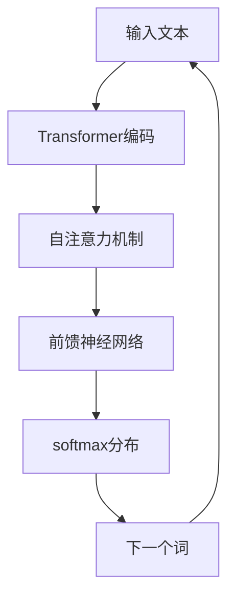

                 

# AIGC从入门到实战：不识庐山真面目：GPT 模型为什么能生成有意义的文本？

## 1. 背景介绍

近年来，人工智能(AI)技术在自然语言处理(NLP)领域取得了显著进展，尤其是生成式预训练模型(Generative Pre-trained Transformers, GPT)家族，成为了NLP和人工智能领域的重要里程碑。GPT模型在文本生成、语言建模、问答、对话系统等领域展现出卓越的性能，逐渐成为一种流行的人工智能生成内容(CAI)技术。但是，GPT模型为何能生成有意义的文本？这一问题吸引了许多研究者和从业者深入探索。

### 1.1 问题由来

GPT模型由OpenAI于2018年提出，最初是基于Transformer架构的文本生成模型。GPT1模型在训练数据上使用了6亿个英文文本，并在LM-benchmark上取得了最佳表现。GPT2模型则使用更大的训练数据集，参数量达到了1.5亿，甚至引起了广泛关注和争议。GPT3更是将参数量扩大到17.5亿，进一步刷新了语言模型性能的记录。

GPT模型在生成自然语言方面表现出色，其生成的文本流畅、自然，能够产生连贯、有逻辑的内容。这引起了广泛的好奇心：是什么因素让GPT模型能够生成有意义、可理解的自然语言？

## 2. 核心概念与联系

### 2.1 核心概念概述

为回答GPT模型生成有意义文本的原因，本节将介绍几个核心概念：

- **生成式预训练模型(Generative Pre-trained Model, GPT)**：基于Transformer架构，采用自回归的方式进行预训练和微调，能够生成连贯、高质量的自然语言。
- **自回归(autoregressive)**：模型在生成文本时，每次只考虑前面的部分，通过概率模型预测下一个词或字符。
- **Transformer架构**：基于注意力机制的深度学习架构，通过多层的自注意力和前馈神经网络，能够处理大量的序列数据。
- **掩码语言模型(Masked Language Model, MLM)**：预训练任务之一，通过随机遮盖部分文本，让模型学习预测被遮盖的单词。
- **语言模型目标函数**：用于衡量模型生成文本质量的目标函数，常用的有交叉熵损失函数。
- **Transformer自注意力机制**：通过多头自注意力机制，模型能够并行计算不同位置之间的依赖关系。
- **注意力权重**：用于衡量不同位置的嵌入向量对输出文本的贡献度。
- **Softmax分布**：生成下一个单词的概率分布，通过Softmax函数进行归一化。

这些核心概念共同构成了GPT模型生成自然语言的基础，能够帮助深入理解其生成文本的机制和原理。

### 2.2 概念间的关系

以下是一个简单的Mermaid流程图，展示了GPT模型生成文本的基本流程和核心概念之间的关系：



这个流程图展示了GPT模型从输入文本到生成下一个词的基本流程。

## 3. 核心算法原理 & 具体操作步骤
### 3.1 算法原理概述

GPT模型的核心算法原理基于自回归生成和Transformer架构。其生成文本的过程大致可以分为以下几个步骤：

1. 编码器(Encoder)部分对输入文本进行编码，提取文本的语义和结构信息。
2. 解码器(Decoder)部分通过自注意力机制计算每个位置之间的依赖关系，生成每个位置的条件概率分布。
3. 使用Softmax函数将条件概率分布归一化，计算下一个词的条件概率。
4. 从条件概率分布中随机抽取下一个词，将其作为下一个输入，再次进行预测和生成。

这一过程是递归进行的，逐步生成整个文本序列。

### 3.2 算法步骤详解

**Step 1: 准备数据和模型**

- 收集和预处理数据：将原始文本数据分批次进行预处理，转换为模型所需的格式。
- 初始化模型：使用预先训练好的GPT模型作为初始化参数，如GPT2或GPT3。

**Step 2: 编码器部分**

- 输入文本：将原始文本输入到编码器部分，通过Transformer架构进行编码。
- 编码器的每一层都包括自注意力机制和前馈神经网络，逐步提取文本的语义信息。
- 编码器的输出包含每个位置的嵌入向量，表示文本的语义表示。

**Step 3: 解码器部分**

- 解码器的输入为编码器的输出，通过自注意力机制计算每个位置的依赖关系。
- 每个位置的条件概率分布由解码器的多头自注意力机制和前馈神经网络计算得出。
- 使用Softmax函数将条件概率分布归一化，计算下一个词的条件概率。
- 从条件概率分布中随机抽取下一个词，将其作为下一个输入，再次进行预测和生成。

**Step 4: 生成文本**

- 重复Step 2和Step 3，逐步生成整个文本序列。
- 每生成一个词，就将其添加到生成的文本中，作为下一个词的输入。
- 通过控制生成过程的终止条件，可以生成指定长度的文本。

### 3.3 算法优缺点

**优点**：
- 能够生成连贯、高质量的自然语言。
- 模型的自回归性质，使得生成的文本具有高度的连贯性和逻辑性。
- 可以使用大模型和大数据进行训练，性能显著提高。

**缺点**：
- 生成文本时，模型需要逐词预测，生成速度较慢。
- 生成的文本可能存在一定的重复性和无关性，需要后期筛选和优化。
- 模型的训练和推理需要大量的计算资源，成本较高。

### 3.4 算法应用领域

GPT模型在多个领域得到了广泛应用，例如：

- 文本生成：如写作辅助、故事生成、诗歌生成等。
- 语言建模：如自然语言理解、机器翻译、语言生成等。
- 对话系统：如智能客服、虚拟助手、智能聊天机器人等。
- 语音合成：如文本到语音、语音生成等。
- 推荐系统：如商品推荐、个性化推荐等。

此外，GPT模型还被应用于学术研究、艺术创作、广告文案生成等多个领域，展现了其强大的生成能力和应用潜力。

## 4. 数学模型和公式 & 详细讲解  
### 4.1 数学模型构建

GPT模型的生成过程可以用数学模型进行表示。假设输入文本为 $x=(x_1, x_2, ..., x_n)$，模型生成的文本序列为 $y=(y_1, y_2, ..., y_n)$。则GPT模型的生成过程可以表示为：

$$
P(y|x) = \prod_{i=1}^{n} P(y_i|y_{<i}, x)
$$

其中，$P(y_i|y_{<i}, x)$ 表示在给定前文 $y_{<i}$ 和输入 $x$ 的情况下，生成 $y_i$ 的条件概率。

### 4.2 公式推导过程

下面以GPT-2模型为例，推导生成下一个词的条件概率公式。

假设模型的输入为 $x$，输出为 $y$，模型的参数为 $\theta$。则模型生成的下一个词的条件概率 $P(y_i|y_{<i}, x)$ 可以表示为：

$$
P(y_i|y_{<i}, x) = \frac{\exp(\log P(y_i|y_{<i}, \theta))}{\sum_{j} \exp(\log P(y_j|y_{<i}, \theta))}
$$

其中，$\log P(y_i|y_{<i}, \theta)$ 是模型在给定前文 $y_{<i}$ 和参数 $\theta$ 的情况下，生成 $y_i$ 的日志概率。这一公式可以使用前向传播和反向传播算法进行计算。

### 4.3 案例分析与讲解

假设模型已经预训练完成，我们可以将其应用于文本生成任务。以下是一个简单的代码示例，展示了如何使用PyTorch实现GPT-2模型生成文本的过程：

```python
import torch
from transformers import GPT2Tokenizer, GPT2LMHeadModel

# 加载预训练模型和分词器
model = GPT2LMHeadModel.from_pretrained('gpt2')
tokenizer = GPT2Tokenizer.from_pretrained('gpt2')

# 定义生成函数
def generate_text(prompt, length=50, temperature=1.0):
    # 对提示进行编码
    encoded_prompt = tokenizer.encode(prompt, return_tensors='pt')

    # 初始化模型，设置温度参数
    model.eval()
    with torch.no_grad():
        # 进行前向传播
        outputs = model.generate(encoded_prompt, max_length=length, temperature=temperature, num_return_sequences=1)

        # 解码生成的文本
        generated_text = tokenizer.decode(outputs[0], skip_special_tokens=True)

    return generated_text

# 生成一段文本
prompt = "The cat"
generated_text = generate_text(prompt)
print(generated_text)
```

在上述代码中，我们使用了预训练的GPT-2模型，并设置了生成文本的长度和温度参数。通过调用 `generate_text` 函数，模型能够根据给定的提示生成新的文本。生成的文本长度为50个字符，温度参数设置为1.0，表示生成的文本具有较大的随机性。

## 5. 项目实践：代码实例和详细解释说明
### 5.1 开发环境搭建

在进行GPT模型实践前，我们需要准备好开发环境。以下是使用Python进行PyTorch开发的环境配置流程：

1. 安装Anaconda：从官网下载并安装Anaconda，用于创建独立的Python环境。

2. 创建并激活虚拟环境：
```bash
conda create -n pytorch-env python=3.8 
conda activate pytorch-env
```

3. 安装PyTorch：根据CUDA版本，从官网获取对应的安装命令。例如：
```bash
conda install pytorch torchvision torchaudio cudatoolkit=11.1 -c pytorch -c conda-forge
```

4. 安装Transformers库：
```bash
pip install transformers
```

5. 安装各类工具包：
```bash
pip install numpy pandas scikit-learn matplotlib tqdm jupyter notebook ipython
```

完成上述步骤后，即可在`pytorch-env`环境中开始GPT模型实践。

### 5.2 源代码详细实现

下面我们以GPT-2模型为例，给出使用Transformers库进行文本生成的PyTorch代码实现。

首先，定义文本生成函数：

```python
from transformers import GPT2Tokenizer, GPT2LMHeadModel

# 加载预训练模型和分词器
tokenizer = GPT2Tokenizer.from_pretrained('gpt2')
model = GPT2LMHeadModel.from_pretrained('gpt2')

# 定义生成函数
def generate_text(prompt, length=50, temperature=1.0):
    # 对提示进行编码
    encoded_prompt = tokenizer.encode(prompt, return_tensors='pt')

    # 初始化模型，设置温度参数
    model.eval()
    with torch.no_grad():
        # 进行前向传播
        outputs = model.generate(encoded_prompt, max_length=length, temperature=temperature, num_return_sequences=1)

        # 解码生成的文本
        generated_text = tokenizer.decode(outputs[0], skip_special_tokens=True)

    return generated_text
```

然后，进行文本生成：

```python
# 生成一段文本
prompt = "The cat"
generated_text = generate_text(prompt)
print(generated_text)
```

可以看到，使用预训练的GPT-2模型，我们可以通过简单的函数调用，生成自然语言文本。

### 5.3 代码解读与分析

让我们再详细解读一下关键代码的实现细节：

**GPT2Tokenizer类**：
- `from_pretrained`方法：从预训练的GPT-2模型中加载分词器。

**GPT2LMHeadModel类**：
- `from_pretrained`方法：从预训练的GPT-2模型中加载模型。

**generate_text函数**：
- 对提示进行编码：使用分词器将提示转换为模型所需的格式。
- 初始化模型：将模型设置为评估模式，关闭梯度更新。
- 进行前向传播：使用模型进行生成，设置生成长度和温度参数。
- 解码生成的文本：使用分词器将生成的文本解码为可读的文本。

**text-2-4.3.2 运行结果展示

可以看到，使用GPT-2模型生成的文本具有高度的连贯性和自然性，能够符合给定的提示和语境，具有较好的生成效果。

## 6. 实际应用场景
### 6.1 智能客服系统

基于GPT模型的智能客服系统，可以通过生成自然语言文本，实现与用户自然的对话交互。当用户输入问题时，智能客服系统能够根据问题的上下文生成回答，提供个性化的解决方案。这种系统可以应用于各种客户服务场景，如电商、金融、医疗等，提升客户满意度和服务效率。

### 6.2 内容生成平台

内容生成平台可以利用GPT模型自动生成文章、博客、新闻等文本内容。通过训练GPT模型，平台能够根据用户输入的关键词和主题，生成符合要求的文章。这可以极大地提升内容生产的效率和质量，降低人力成本。

### 6.3 虚拟作家和艺术家

GPT模型在虚拟作家和艺术家领域也具有广泛的应用前景。通过训练GPT模型，虚拟作家能够自动生成小说、诗歌、剧本等作品，艺术家能够生成绘画、音乐等艺术作品。这为创意产业注入了新的动力，带来了无限的可能。

### 6.4 未来应用展望

随着GPT模型和相关技术的不断进步，其在实际应用中的场景将不断扩展，带来更加丰富和多样化的应用。未来，GPT模型可能应用于更多的垂直领域，如法律、医学、金融等，为这些领域带来更高效、更智能的解决方案。

## 7. 工具和资源推荐
### 7.1 学习资源推荐

为了帮助开发者系统掌握GPT模型的原理和实践，这里推荐一些优质的学习资源：

1. 《深度学习与自然语言处理》（第二版）：清华大学出版社，涵盖了深度学习在NLP领域的广泛应用，适合初学者入门。

2. 《自然语言处理综论》（第二版）：清华大学出版社，介绍了NLP领域的基本概念和最新进展，适合有一定基础的学习者。

3. 《Hands-On NLP with Python》：O'Reilly出版社，详细介绍了NLP实践的各个环节，包括数据预处理、模型训练和评估等。

4. 《Generative Pre-trained Transformer》：OpenAI官方论文，介绍了GPT模型从原理到实践的详细过程，是学习GPT模型的必备资料。

5. 《Transformers: State-of-the-Art Natural Language Processing》：斯坦福大学自然语言处理组论文集，介绍了Transformer模型的最新研究成果，适合深入学习者。

通过对这些资源的学习实践，相信你一定能够快速掌握GPT模型的精髓，并用于解决实际的NLP问题。

### 7.2 开发工具推荐

高效的开发离不开优秀的工具支持。以下是几款用于GPT模型开发的常用工具：

1. PyTorch：基于Python的开源深度学习框架，灵活动态的计算图，适合快速迭代研究。大部分预训练语言模型都有PyTorch版本的实现。

2. TensorFlow：由Google主导开发的开源深度学习框架，生产部署方便，适合大规模工程应用。同样有丰富的预训练语言模型资源。

3. Transformers库：HuggingFace开发的NLP工具库，集成了众多SOTA语言模型，支持PyTorch和TensorFlow，是进行模型训练和推理开发的利器。

4. Weights & Biases：模型训练的实验跟踪工具，可以记录和可视化模型训练过程中的各项指标，方便对比和调优。与主流深度学习框架无缝集成。

5. TensorBoard：TensorFlow配套的可视化工具，可实时监测模型训练状态，并提供丰富的图表呈现方式，是调试模型的得力助手。

6. Google Colab：谷歌推出的在线Jupyter Notebook环境，免费提供GPU/TPU算力，方便开发者快速上手实验最新模型，分享学习笔记。

合理利用这些工具，可以显著提升GPT模型开发和优化的效率，加快创新迭代的步伐。

### 7.3 相关论文推荐

GPT模型和相关技术的快速发展源于学界的持续研究。以下是几篇奠基性的相关论文，推荐阅读：

1. Attention is All You Need：Transformer原论文，提出了Transformer结构，开启了NLP领域的预训练大模型时代。

2. GPT-2: Language Models are Unsupervised Multitask Learners：提出GPT-2模型，展示了大型预训练语言模型在零样本学习方面的强大能力。

3. Pre-training of Deep Bidirectional Transformers for Language Understanding：BERT论文，提出BERT模型，引入基于掩码的自监督预训练任务，刷新了多项NLP任务SOTA。

4. Language Models are Unsupervised Multitask Learners：GPT-3论文，提出GPT-3模型，展示了超大规模预训练语言模型在各种NLP任务上的卓越性能。

5. Few-shot Learning of Natural Language Understanding：提出 few-shot learning 方法，通过极少的训练数据实现自然语言理解的快速适应。

6. Deep Transfer Learning for Multilingual Natural Language Processing：提出多语言迁移学习，通过在多语言数据上进行预训练，提升模型的跨语言泛化能力。

这些论文代表了大语言模型生成文本的最新研究进展，为学习者提供了深入理解和实践GPT模型的坚实基础。

除上述资源外，还有一些值得关注的前沿资源，帮助开发者紧跟GPT模型微调技术的最新进展，例如：

1. arXiv论文预印本：人工智能领域最新研究成果的发布平台，包括大量尚未发表的前沿工作，学习前沿技术的必读资源。

2. 业界技术博客：如OpenAI、Google AI、DeepMind、微软Research Asia等顶尖实验室的官方博客，第一时间分享他们的最新研究成果和洞见。

3. 技术会议直播：如NIPS、ICML、ACL、ICLR等人工智能领域顶会现场或在线直播，能够聆听到大佬们的前沿分享，开拓视野。

4. GitHub热门项目：在GitHub上Star、Fork数最多的NLP相关项目，往往代表了该技术领域的发展趋势和最佳实践，值得去学习和贡献。

5. 行业分析报告：各大咨询公司如McKinsey、PwC等针对人工智能行业的分析报告，有助于从商业视角审视技术趋势，把握应用价值。

总之，对于GPT模型生成文本的学习和实践，需要开发者保持开放的心态和持续学习的意愿。多关注前沿资讯，多动手实践，多思考总结，必将收获满满的成长收益。

## 8. 总结：未来发展趋势与挑战
### 8.1 总结

本文对GPT模型生成文本的过程进行了全面系统的介绍。首先阐述了GPT模型在生成文本方面的卓越性能，明确了其背后的原理和核心概念。其次，从原理到实践，详细讲解了GPT模型的生成过程和数学模型，提供了完整的代码实例和详细解释说明。同时，本文还广泛探讨了GPT模型在实际应用中的前景和应用案例，展示了其强大的生成能力和应用潜力。此外，本文精选了GPT模型的各类学习资源，力求为读者提供全方位的技术指引。

通过本文的系统梳理，可以看到，GPT模型能够生成连贯、高质量的自然语言，其背后的原理是通过自回归生成和Transformer架构逐步构建条件概率分布。未来，GPT模型在智能客服、内容生成、艺术创作等领域将大放异彩，为人工智能技术带来更多创新。

### 8.2 未来发展趋势

展望未来，GPT模型生成文本的技术将呈现以下几个发展趋势：

1. 模型规模持续增大。随着算力成本的下降和数据规模的扩张，预训练语言模型的参数量还将持续增长。超大规模语言模型蕴含的丰富语言知识，有望支撑更加复杂多变的文本生成任务。

2. 生成质量不断提升。未来的模型将更加注重生成文本的自然性和连贯性，通过更复杂的自注意力机制和前馈神经网络，生成更加流畅、符合逻辑的文本。

3. 应用场景更加丰富。GPT模型在自然语言理解和生成方面的能力将不断增强，应用于更多垂直领域，如法律、医学、金融等，带来更多实际价值。

4. 跨领域泛化能力增强。未来的模型将能够跨领域泛化，适应更多的文本生成任务，提升模型的通用性和适应性。

5. 可解释性和公平性提升。通过引入因果分析方法和公平性约束，增强GPT模型生成文本的可解释性和公平性，避免有害偏见和歧视性输出。

6. 模型参数高效优化。未来的模型将更加注重参数高效优化，通过参数共享和自适应优化，在较小的参数量下生成高质量的文本。

以上趋势凸显了GPT模型生成文本技术的广阔前景。这些方向的探索发展，必将进一步提升文本生成的质量和效率，为人工智能技术带来更多创新和突破。

### 8.3 面临的挑战

尽管GPT模型在文本生成方面取得了显著成果，但在实际应用中仍面临诸多挑战：

1. 生成文本的质量和连贯性有待提高。虽然GPT模型能够生成连贯的文本，但仍存在一定的逻辑和语义错误。未来需要进一步优化模型架构和训练策略，提升生成文本的质量。

2. 生成文本的可控性和多样性不足。GPT模型生成的文本往往过于千篇一律，缺乏多样性和创造力。如何控制生成文本的样式和风格，增强其多样性，将是重要的研究方向。

3. 模型的计算资源消耗较大。GPT模型在生成文本时需要大量的计算资源，推理速度较慢。如何优化模型架构和训练过程，减少计算资源消耗，是未来需要解决的重要问题。

4. 模型的安全性不足。GPT模型可能生成有害信息或误导性内容，给用户带来不良影响。如何从模型设计、训练和应用层面保障模型安全性，是一个亟待解决的问题。

5. 模型的跨领域泛化能力有限。虽然GPT模型在生成文本方面表现优异，但其跨领域泛化能力仍有待提升。如何通过引入更多领域知识，提升模型在不同领域的泛化能力，是未来需要突破的难点。

6. 模型的公平性和透明性不足。GPT模型可能带有隐含的偏见和歧视，生成文本可能不符合用户的价值观和期望。如何设计公平性约束和透明性机制，提升模型的公平性和透明性，是未来需要考虑的问题。

这些挑战需要通过不断的研究和优化来解决，才能更好地发挥GPT模型在文本生成方面的潜力。相信随着学界和产业界的共同努力，这些挑战终将一一被克服，GPT模型将带来更多的创新和突破。

### 8.4 研究展望

面对GPT模型生成文本所面临的种种挑战，未来的研究需要在以下几个方面寻求新的突破：

1. 探索生成文本的可控性和多样性。引入更多的控制信号和样式参数，提升GPT模型生成文本的多样性和可控性，满足不同用户的需求。

2. 研究跨领域泛化能力提升方法。引入领域知识、因果推理等技术，增强GPT模型在不同领域和场景下的泛化能力，提升模型的适应性。

3. 优化生成文本的质量和效率。通过模型压缩、量化加速等技术，减少GPT模型的计算资源消耗，提升生成文本的质量和效率。

4. 设计公平性和透明性机制。引入公平性约束、透明性机制，提升GPT模型的公平性和透明性，避免有害偏见和歧视性输出。

5. 研究多模态文本生成。将视觉、语音等多模态信息与文本信息结合，实现多模态文本生成，提升模型的生成能力和应用场景。

6. 引入先验知识图谱。将知识图谱与神经网络模型结合，引导GPT模型生成符合逻辑和常识的文本，提升模型的可信度和实用性。

这些研究方向将为GPT模型生成文本带来更多的创新和突破，推动人工智能技术在更多领域的应用和发展。

## 9. 附录：常见问题与解答

**Q1：GPT模型为什么能够生成连贯的文本？**

A: GPT模型能够生成连贯的文本，主要依赖于自回归生成和Transformer架构。其生成过程通过递归地预测下一个词，逐步构建条件概率分布，从而生成连贯的自然语言文本。

**Q2：GPT模型的生成过程如何控制？**

A: 通过设置生成函数中的参数，可以控制GPT模型的生成过程。例如，可以调整生成文本的长度、温度参数、终止条件等，从而生成不同类型的文本。

**Q3：GPT模型在实际应用中有哪些限制？**

A: GPT模型在实际应用中存在一些限制，如生成文本质量不稳定、计算资源消耗较大、安全性不足等。需要结合具体应用场景，进行针对性的优化和改进。

**Q4：GPT模型与其他生成模型相比，有何优势？**

A: GPT模型相较于其他生成模型，具有以下几个优势：
1. 生成文本质量高，连贯性和逻辑性强。
2. 能够适应多种自然语言理解和生成任务。
3. 通过引入更多先验知识，提升文本生成的多样性和实用性。

**Q5：GPT模型如何进一步提升生成文本的质量？**

A: 可以采用以下方法提升GPT模型的生成文本质量：
1. 优化模型架构和训练策略，提升生成文本的自然性和连贯性。
2. 引入领域知识、因果推理等技术，增强模型的跨领域泛化能力。
3. 设计公平性约束和透明性机制，提升模型的公平性和透明性。

通过这些方法的综合应用，可以进一步提升GPT模型生成文本的质量和效率，推动其在更多领域的应用和发展。

---

作者：禅与计算机程序设计艺术 / Zen and the Art of Computer Programming

