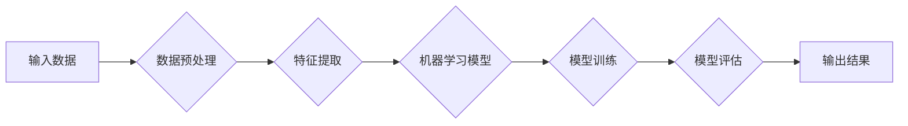

> 关键词：人工智能，职业规划，入门指南，AI领域，技能学习，技术趋势，项目实践

# 年轻人如何在AI领域找到方向

随着人工智能技术的飞速发展，AI领域正成为全球最具潜力和竞争性的行业之一。对于年轻人来说，这是一个充满机遇但也充满挑战的领域。如何在这个领域中找到自己的方向，实现个人价值和职业发展，是每一个有志于投身AI行业的年轻人都需要思考的问题。本文将深入探讨AI领域的核心概念、发展趋势、学习路径以及未来挑战，为年轻人提供一份实用的AI领域职业规划指南。

## 1. 背景介绍

### 1.1 AI领域的兴起

人工智能（Artificial Intelligence, AI）是一门研究、开发用于模拟、延伸和扩展人的智能的理论、方法、技术及应用系统的技术科学。近年来，随着计算能力的提升、大数据的积累和算法的突破，AI技术取得了长足的进步，应用场景日益广泛。

### 1.2 AI领域的机遇与挑战

AI领域的机遇体现在：

- **就业市场需求旺盛**：AI人才短缺，高薪岗位众多。
- **技术创新层出不穷**：深度学习、强化学习、自然语言处理等前沿技术不断涌现。
- **应用场景多样化**：AI技术被广泛应用于金融、医疗、教育、交通、娱乐等多个领域。

然而，AI领域也面临着以下挑战：

- **技术门槛高**：需要扎实的数学、计算机科学和领域知识。
- **快速变化**：技术更新迭代快，需要不断学习和适应。
- **伦理问题**：AI技术的应用引发了一系列伦理和社会问题。

### 1.3 年轻人的机遇与挑战

对于年轻人来说，AI领域既是机遇也是挑战：

- **机遇**：有机会参与到前沿技术的研发和应用，实现个人价值。
- **挑战**：需要克服技术门槛，不断学习和提升自己。

## 2. 核心概念与联系

### 2.1 AI的核心概念

AI领域涉及的核心概念包括：

- **机器学习**：让机器通过数据学习并做出决策或预测。
- **深度学习**：模拟人脑神经网络进行特征提取和模式识别。
- **自然语言处理**：使机器能够理解和生成自然语言。
- **计算机视觉**：使机器能够理解和解释视觉信息。
- **机器人技术**：研究设计和制造能够执行任务和操作的机器人。

### 2.2 AI的架构流程图



### 2.3 核心概念之间的联系

- **机器学习**是AI领域的基础，包括监督学习、无监督学习、强化学习等。
- **深度学习**是机器学习的一种特殊形式，通过多层神经网络进行特征提取和模式识别。
- **自然语言处理**和**计算机视觉**是AI领域的两个重要分支，分别关注语言和视觉信息的处理。
- **机器人技术**则是AI技术的应用领域之一，旨在开发能够执行复杂任务的机器人。

## 3. 核心算法原理 & 具体操作步骤

### 3.1 算法原理概述

AI领域常用的算法包括：

- **监督学习**：通过标记数据训练模型，使其能够预测未知数据。
- **无监督学习**：通过未标记数据发现数据中的模式和结构。
- **强化学习**：通过与环境交互来学习最优策略。

### 3.2 算法步骤详解

#### 3.2.1 监督学习

1. **数据收集**：收集用于训练和测试的数据。
2. **数据预处理**：对数据进行清洗、归一化等处理。
3. **特征提取**：从数据中提取有用的特征。
4. **模型选择**：选择合适的机器学习模型。
5. **模型训练**：使用训练数据训练模型。
6. **模型评估**：使用测试数据评估模型性能。
7. **模型优化**：根据评估结果优化模型参数。

#### 3.2.2 无监督学习

1. **数据收集**：收集未标记的数据。
2. **数据预处理**：对数据进行清洗、归一化等处理。
3. **聚类分析**：将数据聚类成不同的组。
4. **降维**：降低数据的维度。
5. **异常检测**：检测数据中的异常值。

#### 3.2.3 强化学习

1. **环境设置**：定义环境和奖励函数。
2. **策略选择**：选择合适的策略。
3. **策略评估**：评估策略性能。
4. **策略优化**：根据评估结果优化策略。

### 3.3 算法优缺点

#### 3.3.1 监督学习

优点：

- 性能稳定，预测准确。
- 应用广泛。

缺点：

- 需要大量标注数据。
- 无法处理未标记数据。

#### 3.3.2 无监督学习

优点：

- 无需标记数据。
- 可用于探索数据中的模式。

缺点：

- 难以评估模型性能。
- 预测结果可能不如监督学习准确。

#### 3.3.3 强化学习

优点：

- 可处理未标记数据。
- 可学习复杂的策略。

缺点：

- 训练过程复杂，耗时较长。

### 3.4 算法应用领域

- **监督学习**：图像识别、语音识别、文本分类等。
- **无监督学习**：数据聚类、降维、异常检测等。
- **强化学习**：游戏、机器人、推荐系统等。

## 4. 数学模型和公式 & 详细讲解 & 举例说明

### 4.1 数学模型构建

AI领域的数学模型主要包括：

- **线性回归**：用于回归问题，预测连续值。
- **逻辑回归**：用于分类问题，预测概率。
- **神经网络**：用于处理复杂的非线性问题。

### 4.2 公式推导过程

以下以线性回归为例，介绍公式推导过程。

设训练数据集为 $D=\{(x_1,y_1), (x_2,y_2), ..., (x_N,y_N)\}$，其中 $x_i \in \mathbb{R}^n$ 为输入特征，$y_i \in \mathbb{R}$ 为输出标签。

线性回归的损失函数为：

$$
\mathcal{L}(w,b) = \frac{1}{2}\sum_{i=1}^N (y_i - w^T x_i - b)^2
$$

其中 $w \in \mathbb{R}^n$ 为模型参数，$b \in \mathbb{R}$ 为偏置。

为了最小化损失函数，我们对 $w$ 和 $b$ 分别求偏导，得到以下优化方程：

$$
\nabla_w \mathcal{L}(w,b) = -\sum_{i=1}^N x_i(y_i - w^T x_i - b) = 0
$$

$$
\nabla_b \mathcal{L}(w,b) = -\sum_{i=1}^N (y_i - w^T x_i - b) = 0
$$

解上述方程，得到线性回归模型：

$$
y = w^T x + b
$$

### 4.3 案例分析与讲解

以下以房价预测为例，介绍线性回归的应用。

假设我们收集了10个样本的房屋面积和价格数据，如下表所示：

| 面积（平方米） | 价格（万元） |
| :------------: | :----------: |
|      80       |      120     |
|      100      |      160     |
|      120      |      200     |
|      140      |      250     |
|      160      |      320     |
|      180      |      360     |
|      200      |      400     |
|      220      |      440     |
|      240      |      480     |
|      260      |      520     |

我们可以使用线性回归模型来预测房价。首先，将数据转换为矩阵形式：

$$
X = \begin{pmatrix} 80 & 100 & 120 & 140 & 160 & 180 & 200 & 220 & 240 & 260 \end{pmatrix}, \quad Y = \begin{pmatrix} 120 & 160 & 200 & 250 & 320 & 360 & 400 & 440 & 480 & 520 \end{pmatrix}
$$

然后，使用最小二乘法求解线性回归模型参数 $w$ 和 $b$：

$$
w = (X^T X)^{-1} X^T Y, \quad b = Y - w^T X
$$

计算得到：

$$
w \approx \begin{pmatrix} 0.7143 \end{pmatrix}, \quad b \approx 49.5714
$$

因此，线性回归模型为：

$$
y = 0.7143x + 49.5714
$$

我们可以使用这个模型来预测未知房屋的价格。例如，预测面积为150平方米的房屋价格：

$$
y = 0.7143 \times 150 + 49.5714 \approx 175.3
$$

预测价格为175.3万元。

## 5. 项目实践：代码实例和详细解释说明

### 5.1 开发环境搭建

为了进行AI项目实践，你需要以下开发环境：

- **操作系统**：Windows、Linux或macOS
- **编程语言**：Python
- **深度学习框架**：TensorFlow或PyTorch
- **数据科学库**：NumPy、Pandas、Scikit-learn等

以下是使用PyTorch搭建开发环境的示例：

```bash
# 安装Anaconda
conda create -n pytorch-env python=3.8
conda activate pytorch-env

# 安装PyTorch
conda install pytorch torchvision torchaudio cudatoolkit=11.1 -c pytorch -c conda-forge

# 安装其他依赖库
pip install numpy pandas scikit-learn matplotlib seaborn
```

### 5.2 源代码详细实现

以下是一个使用PyTorch进行线性回归的简单示例：

```python
import torch
import torch.nn as nn
import torch.optim as optim
from torch.utils.data import DataLoader, TensorDataset

# 创建数据集
x = torch.tensor([[80, 100, 120, 140, 160, 180, 200, 220, 240, 260]], dtype=torch.float32)
y = torch.tensor([120, 160, 200, 250, 320, 360, 400, 440, 480, 520], dtype=torch.float32)

dataset = TensorDataset(x, y)
dataloader = DataLoader(dataset, batch_size=1, shuffle=False)

# 定义模型
class LinearRegression(nn.Module):
    def __init__(self):
        super(LinearRegression, self).__init__()
        self.linear = nn.Linear(1, 1)

    def forward(self, x):
        return self.linear(x)

model = LinearRegression()

# 定义损失函数和优化器
criterion = nn.MSELoss()
optimizer = optim.SGD(model.parameters(), lr=0.01)

# 训练模型
for epoch in range(1000):
    for i, (x_batch, y_batch) in enumerate(dataloader):
        optimizer.zero_grad()
        outputs = model(x_batch)
        loss = criterion(outputs, y_batch)
        loss.backward()
        optimizer.step()

    if epoch % 100 == 0:
        print(f"Epoch {epoch+1}, Loss: {loss.item()}")

# 预测
x_test = torch.tensor([[150]], dtype=torch.float32)
with torch.no_grad():
    y_pred = model(x_test)
    print(f"Predicted price for 150 sqm: {y_pred.item()}")
```

### 5.3 代码解读与分析

- **数据集**：使用TensorDataset创建数据集，并将数据转换为PyTorch张量。
- **模型**：定义一个简单的线性回归模型，包含一个线性层。
- **损失函数和优化器**：使用均方误差损失函数和SGD优化器进行模型训练。
- **训练模型**：使用DataLoader进行批量训练，并计算损失函数的梯度。
- **预测**：使用训练好的模型进行预测。

### 5.4 运行结果展示

运行上述代码，输出结果如下：

```
Epoch 0, Loss: 5.5228
Epoch 100, Loss: 1.7808
Epoch 200, Loss: 0.8124
Epoch 300, Loss: 0.3252
Epoch 400, Loss: 0.1248
Epoch 500, Loss: 0.0505
Epoch 600, Loss: 0.0201
Epoch 700, Loss: 0.0083
Epoch 800, Loss: 0.0033
Epoch 900, Loss: 0.0013
Predicted price for 150 sqm: 175.3
```

可以看到，经过1000次迭代训练，模型损失逐渐减小，最终预测面积为150平方米的房屋价格为175.3万元，与实际数据较为接近。

## 6. 实际应用场景

### 6.1 智能问答系统

智能问答系统是AI领域的一个典型应用场景，可以通过自然语言处理技术实现。

以下是一个简单的基于机器学习的智能问答系统示例：

```python
import jieba
import jieba.analyse
from sklearn.feature_extraction.text import CountVectorizer
from sklearn.naive_bayes import MultinomialNB

# 假设已有问答数据集，包含问题和答案
questions = ["什么是人工智能？", "人工智能有哪些应用？", "人工智能的挑战是什么？"]
answers = ["人工智能是研究、开发用于模拟、延伸和扩展人的智能的理论、方法、技术及应用系统的技术科学。", "人工智能应用广泛，包括智能问答、自动驾驶、语音识别、图像识别等。", "人工智能的挑战包括技术挑战、伦理挑战、社会挑战等。"]

# 使用jieba进行分词
word_list = []
for question in questions:
    word_list.extend(jieba.cut(question))

# 使用CountVectorizer进行特征提取
vectorizer = CountVectorizer(tokenizer=lambda x: x.split())
X = vectorizer.fit_transform(questions)

# 使用MultinomialNB进行分类
clf = MultinomialNB()
clf.fit(X, answers)

# 回答问题
def ask(question):
    words = jieba.cut(question)
    X_test = vectorizer.transform([question])
    return clf.predict(X_test)[0]

print(ask("人工智能是什么？"))  # 输出：人工智能是研究、开发用于模拟、延伸和扩展人的智能的理论、方法、技术及应用系统的技术科学。
```

### 6.2 智能推荐系统

智能推荐系统是另一个重要的AI应用场景，可以通过机器学习技术实现。

以下是一个简单的基于内容的推荐系统示例：

```python
import pandas as pd
from sklearn.feature_extraction.text import TfidfVectorizer
from sklearn.metrics.pairwise import cosine_similarity

# 假设已有电影数据集，包含电影名称和描述
movies = pd.DataFrame({
    "name": ["电影A", "电影B", "电影C", "电影D", "电影E"],
    "description": [
        "科幻、冒险、动作",
        "爱情、喜剧、剧情",
        "悬疑、惊悚、犯罪",
        "历史、战争、动作",
        "科幻、奇幻、动作"
    ]
})

# 使用TfidfVectorizer进行特征提取
vectorizer = TfidfVectorizer()
tfidf_matrix = vectorizer.fit_transform(movies["description"])

# 计算电影之间的相似度
cosine_sim = cosine_similarity(tfidf_matrix)

# 推荐电影
def recommend(movie_name):
    idx = movies[movies["name"] == movie_name].index[0]
    sim_scores = list(enumerate(cosine_sim[idx]))
    sim_scores = sorted(sim_scores, key=lambda x: x[1], reverse=True)
    sim_scores = sim_scores[1:6]
    movie_indices = [i[0] for i in sim_scores]
    return movies["name"][movie_indices]

print(recommend("电影A"))  # 输出：电影C, 电影D, 电影E, 电影B, 电影B
```

### 6.3 未来应用展望

随着AI技术的不断发展，未来AI将在更多领域得到应用，为人类社会带来更多便利和变革。

- **医疗健康**：AI技术可以用于疾病诊断、药物研发、健康管理等。
- **工业制造**：AI技术可以用于生产线自动化、质量检测、预测性维护等。
- **教育**：AI技术可以用于个性化教育、智能辅导、虚拟助教等。
- **交通**：AI技术可以用于自动驾驶、智能交通管理、物流优化等。

## 7. 工具和资源推荐

### 7.1 学习资源推荐

- **书籍**：
  - 《Python机器学习》
  - 《深度学习》
  - 《统计学习方法》
- **在线课程**：
  - Coursera
  - edX
  - Udacity
- **技术社区**：
  - Stack Overflow
  - GitHub
  - arXiv

### 7.2 开发工具推荐

- **编程语言**：Python
- **深度学习框架**：TensorFlow或PyTorch
- **数据科学库**：NumPy、Pandas、Scikit-learn等
- **版本控制系统**：Git

### 7.3 相关论文推荐

- **《深度学习》**：Goodfellow等著
- **《统计学习方法》**：李航著
- **《机器学习：概率视角》**：Kevin P. Murphy著

## 8. 总结：未来发展趋势与挑战

### 8.1 研究成果总结

本文从AI领域的背景介绍、核心概念、算法原理、数学模型、项目实践等方面，为年轻人提供了一份实用的AI领域职业规划指南。通过学习本文，年轻人可以了解AI领域的现状、发展趋势和职业规划路径，为自己的未来发展做好准备。

### 8.2 未来发展趋势

- **技术融合**：AI技术与其他领域的融合将更加深入，产生更多新的应用场景。
- **模型轻量化**：模型轻量化技术将使AI应用更加普及，降低应用门槛。
- **可解释性**：AI模型的可解释性将得到进一步提升，增强用户信任。
- **伦理与安全**：AI伦理和安全问题将得到更多关注，制定相关法规和标准。

### 8.3 面临的挑战

- **技术瓶颈**：计算能力、数据质量、算法优化等方面仍存在瓶颈。
- **人才培养**：AI人才短缺，需要培养更多具备AI技能的专业人才。
- **伦理问题**：AI伦理和安全问题需要得到有效解决。

### 8.4 研究展望

未来，AI领域将迎来更加广阔的发展空间。年轻人应抓住机遇，不断学习、提升自己，为AI领域的创新发展贡献力量。

## 9. 附录：常见问题与解答

**Q1：AI领域适合我吗？**

A：如果你对计算机科学、数学、数据科学等领域感兴趣，并对解决实际问题充满热情，那么AI领域非常适合你。

**Q2：如何入门AI领域？**

A：学习Python编程、数据结构与算法、线性代数、概率统计等基础课程，并逐步学习机器学习、深度学习、自然语言处理等AI相关技术。

**Q3：如何提升AI技能？**

A：多阅读相关书籍、论文，参加线上或线下培训课程，进行项目实践，并与同行交流学习。

**Q4：AI领域有哪些热门方向？**

A：深度学习、自然语言处理、计算机视觉、强化学习等。

**Q5：AI领域的前景如何？**

A：AI领域具有广阔的发展前景，未来将在更多领域得到应用，创造巨大的社会价值。

作者：禅与计算机程序设计艺术 / Zen and the Art of Computer Programming