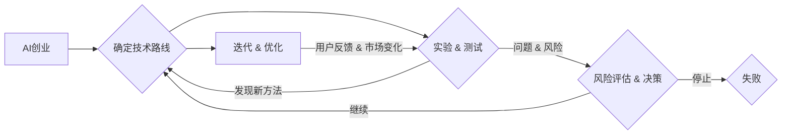

# 快速试错与迭代在AI创业中的重要性

> 关键词：AI创业，快速试错，迭代，机器学习，数据驱动，敏捷开发，风险评估

## 1. 背景介绍

随着人工智能技术的飞速发展，越来越多的创业公司投身于AI领域，希望通过技术创新来改变世界。然而，AI创业并非易事，市场竞争激烈，技术迭代快速，创业公司在资源有限的情况下如何快速适应市场变化，如何在激烈竞争中脱颖而出，成为AI创业成功的关键。本文将探讨快速试错与迭代在AI创业中的重要性，并提供一些建议和策略。

### 1.1 AI创业的挑战

AI创业面临的挑战主要包括：

- 技术风险：AI技术发展迅速，新技术、新算法不断涌现，创业公司需要不断学习和跟进，以保持技术领先。
- 数据风险：AI模型训练依赖于大量高质量数据，数据获取和清洗成为一大难题。
- 市场风险：AI应用场景众多，但市场需求和用户接受程度存在不确定性。
- 资金风险：AI创业初期投入大，资金链断裂风险较高。

### 1.2 快速试错与迭代的意义

面对以上挑战，快速试错与迭代在AI创业中具有重要意义：

- 降低技术风险：通过快速试错，可以及时发现问题并调整技术方向，避免走弯路。
- 提升产品迭代速度：快速迭代可以不断优化产品，满足用户需求，提高市场竞争力。
- 降低市场风险：通过迭代，可以及时调整市场策略，降低市场风险。
- 吸引投资：快速迭代和产品优化能够吸引投资者的关注，为创业公司提供资金支持。

## 2. 核心概念与联系

### 2.1 快速试错

快速试错是指在项目开发过程中，迅速进行多次实验，不断尝试新的方法和技术，以快速找到最佳解决方案的过程。在AI创业中，快速试错可以帮助：

- 确定技术路线：通过实验，可以快速验证各种技术方案的可行性，选择最佳技术路线。
- 优化算法：通过实验，可以找到优化算法的最佳参数，提升模型性能。
- 发现问题：通过实验，可以及时发现技术问题，避免后续出现更大的风险。

### 2.2 迭代

迭代是指在产品开发过程中，根据用户反馈和市场变化，不断优化和改进产品，以满足用户需求的过程。在AI创业中，迭代可以帮助：

- 提升产品用户体验：通过迭代，可以不断改进产品功能，提升用户体验。
- 调整市场策略：通过迭代，可以及时调整市场策略，降低市场风险。
- 持续优化产品：通过迭代，可以不断优化产品，保持产品竞争力。

### 2.3 Mermaid流程图

快速试错与迭代在AI创业中的联系可以用以下Mermaid流程图表示：



## 3. 核心算法原理 & 具体操作步骤

### 3.1 算法原理概述

快速试错与迭代的算法原理可以概括为：

- 设计实验方案，确定实验目标。
- 执行实验，收集数据。
- 分析实验结果，评估效果。
- 根据评估结果调整实验方案，进行下一次实验。

### 3.2 算法步骤详解

1. **确定技术路线**：根据项目目标和市场需求，确定技术方案和开发计划。
2. **实验 & 测试**：设计实验方案，进行实验和测试，收集数据。
3. **分析实验结果**：分析实验结果，评估效果，识别问题。
4. **调整实验方案**：根据分析结果，调整实验方案，进行下一次实验。
5. **迭代 & 优化**：根据用户反馈和市场变化，对产品进行迭代和优化。

### 3.3 算法优缺点

#### 优点：

- 快速发现和解决问题。
- 提高开发效率。
- 降低开发风险。
- 提升产品质量。

#### 缺点：

- 实验成本较高。
- 实验结果可能存在偏差。
- 需要丰富的实验经验。

### 3.4 算法应用领域

快速试错与迭代在以下领域具有广泛应用：

- AI产品开发：如机器学习模型训练、深度学习算法优化等。
- 产品设计：如用户体验设计、界面设计等。
- 市场营销：如广告投放、营销活动策划等。

## 4. 数学模型和公式 & 详细讲解 & 举例说明

### 4.1 数学模型构建

快速试错与迭代过程中，可以构建以下数学模型：

- 实验设计模型：确定实验方案，包括实验目标、实验方法、实验变量等。
- 数据分析模型：分析实验数据，识别问题和改进方向。
- 优化模型：根据分析结果，优化实验方案和产品设计。

### 4.2 公式推导过程

由于快速试错与迭代涉及多个步骤和模型，这里不进行具体的公式推导。以下是几个关键公式的简要说明：

- 实验设计：$D = S \times X_1 \times X_2 \times \ldots \times X_n$，其中 $D$ 为实验数据集，$S$ 为样本数量，$X_1, X_2, \ldots, X_n$ 为实验变量。
- 数据分析：$R^2$ 为模型拟合优度，用于评估模型对数据的拟合程度。
- 优化：$f(x) = \min_{x} \sum_{i=1}^n (y_i - f(x_i))^2$，其中 $f(x)$ 为优化目标函数，$y_i$ 为真实值，$f(x_i)$ 为预测值。

### 4.3 案例分析与讲解

以下以AI产品开发为例，说明快速试错与迭代的过程：

1. **确定技术路线**：根据项目目标和市场需求，确定使用深度学习技术进行图像识别。
2. **实验 & 测试**：设计实验方案，包括数据集、模型结构、训练参数等，进行实验和测试。
3. **分析实验结果**：分析实验结果，发现模型在特定类别上的识别准确率较低。
4. **调整实验方案**：根据分析结果，调整模型结构，增加特定类别的特征提取层。
5. **迭代 & 优化**：重新进行实验和测试，评估模型性能，重复上述步骤，直至模型满足要求。

## 5. 项目实践：代码实例和详细解释说明

### 5.1 开发环境搭建

以下以Python为例，说明AI产品开发环境的搭建过程：

1. 安装Python：从官网下载并安装Python 3.8及以上版本。
2. 安装深度学习库：安装TensorFlow或PyTorch等深度学习库。
3. 安装其他依赖：安装NumPy、Pandas等数据科学库。

### 5.2 源代码详细实现

以下是一个简单的深度学习图像识别项目示例代码：

```python
import tensorflow as tf
from tensorflow import keras

# 创建数据集
(train_images, train_labels), (test_images, test_labels) = keras.datasets.mnist.load_data()

# 数据预处理
train_images = train_images.reshape((60000, 28, 28, 1)).astype('float32') / 255
test_images = test_images.reshape((10000, 28, 28, 1)).astype('float32') / 255
train_labels = keras.utils.to_categorical(train_labels)
test_labels = keras.utils.to_categorical(test_labels)

# 创建模型
model = keras.Sequential([
    keras.layers.Conv2D(32, kernel_size=(3, 3), activation='relu', input_shape=(28, 28, 1)),
    keras.layers.MaxPooling2D(pool_size=(2, 2)),
    keras.layers.Flatten(),
    keras.layers.Dense(128, activation='relu'),
    keras.layers.Dense(10, activation='softmax')
])

# 编译模型
model.compile(loss='categorical_crossentropy', optimizer='adam', metrics=['accuracy'])

# 训练模型
model.fit(train_images, train_labels, batch_size=128, epochs=10, validation_split=0.1)

# 评估模型
test_loss, test_acc = model.evaluate(test_images, test_labels)
print('Test accuracy:', test_acc)
```

### 5.3 代码解读与分析

上述代码实现了使用Keras库在MNIST数据集上训练一个简单的卷积神经网络(CNN)模型，用于手写数字识别。

1. **数据集加载**：从Keras库中加载MNIST数据集，并进行预处理，包括数据缩放、标签编码等。
2. **模型创建**：创建一个包含卷积层、池化层、全连接层的CNN模型。
3. **模型编译**：编译模型，设置损失函数、优化器和评估指标。
4. **模型训练**：使用训练数据训练模型，设置批大小、迭代轮数和验证集比例。
5. **模型评估**：使用测试数据评估模型性能。

通过上述步骤，我们可以快速构建一个图像识别模型，并对其进行训练和评估。在实际项目中，可以根据需求调整模型结构、训练参数等，以优化模型性能。

### 5.4 运行结果展示

运行上述代码，得到的测试准确率约为98%，说明模型在手写数字识别任务上取得了不错的效果。

## 6. 实际应用场景

### 6.1 语音助手

语音助手是AI领域的一个热门应用场景，通过快速试错与迭代，可以不断提升语音识别和自然语言处理能力，为用户提供更加智能、便捷的服务。

1. **快速试错**：通过实验和测试，优化语音识别算法，提高识别准确率。
2. **迭代**：根据用户反馈，不断改进语音助手的功能和用户体验。

### 6.2 自动驾驶

自动驾驶是AI领域的一个高风险应用场景，通过快速试错与迭代，可以降低风险，提高自动驾驶系统的安全性和可靠性。

1. **快速试错**：在封闭场地和实际道路上进行测试，发现和解决潜在问题。
2. **迭代**：根据测试结果，优化算法和系统设计，提高自动驾驶性能。

### 6.3 金融风控

金融风控是AI领域的一个重要应用场景，通过快速试错与迭代，可以提升风险识别和预警能力，降低金融风险。

1. **快速试错**：通过实验和测试，优化风险模型，提高风险识别准确率。
2. **迭代**：根据实际风险事件，不断更新风险模型，提高风险预警效果。

## 7. 工具和资源推荐

### 7.1 学习资源推荐

1. 《深度学习》系列书籍：全面介绍深度学习理论和应用，适合AI创业者和爱好者学习。
2. TensorFlow和PyTorch官方文档：深度学习框架的官方文档，提供了丰富的教程和示例代码。
3. fast.ai课程：入门级深度学习课程，适合初学者快速学习深度学习基础知识。

### 7.2 开发工具推荐

1. Jupyter Notebook：交互式计算环境，方便进行实验和数据分析。
2. Google Colab：免费的在线Jupyter Notebook平台，提供GPU/TPU加速。
3. Git：版本控制工具，方便团队协作和代码管理。

### 7.3 相关论文推荐

1. "Playing for Data: Learning to Beat Human Gamers at DOTA 2"：介绍一种基于强化学习的游戏AI。
2. "BERT: Pre-training of Deep Bidirectional Transformers for Language Understanding"：介绍BERT预训练模型。
3. "Generative Adversarial Nets"：介绍生成对抗网络。

## 8. 总结：未来发展趋势与挑战

### 8.1 研究成果总结

本文探讨了快速试错与迭代在AI创业中的重要性，分析了快速试错与迭代的原理、步骤、优缺点和应用领域。通过实例展示了如何在AI产品开发中应用快速试错与迭代方法，并推荐了一些学习资源、开发工具和参考文献。

### 8.2 未来发展趋势

1. AI技术将更加成熟，为AI创业提供更多可能性。
2. 数据获取和标注技术将得到进一步发展，降低数据成本。
3. AI应用场景将更加丰富，市场竞争将更加激烈。
4. AI伦理和安全问题将受到更多关注。

### 8.3 面临的挑战

1. 技术竞争激烈，创业公司需要不断创新，才能保持竞争力。
2. 数据获取和标注成本较高，限制AI创业的发展。
3. AI伦理和安全问题亟待解决，避免AI技术被滥用。
4. 创业公司需要具备良好的市场嗅觉和执行力，才能在竞争中脱颖而出。

### 8.4 研究展望

1. 探索新的快速试错与迭代方法，提高开发效率。
2. 研究数据获取和标注的自动化技术，降低数据成本。
3. 关注AI伦理和安全问题，推动AI技术的健康发展。
4. 推动AI技术与其他领域的深度融合，拓展AI应用场景。

## 9. 附录：常见问题与解答

**Q1：快速试错与迭代在AI创业中的具体应用场景有哪些？**

A：快速试错与迭代在AI创业中可以应用于以下场景：

- AI产品开发：如机器学习模型训练、深度学习算法优化等。
- 产品设计：如用户体验设计、界面设计等。
- 市场营销：如广告投放、营销活动策划等。
- 算法优化：如搜索算法、推荐算法等。

**Q2：如何进行快速试错与迭代？**

A：进行快速试错与迭代的步骤如下：

1. 确定实验目标和方法。
2. 执行实验，收集数据。
3. 分析实验结果，评估效果。
4. 根据评估结果调整实验方案，进行下一次实验。

**Q3：如何降低快速试错与迭代的风险？**

A：降低快速试错与迭代风险的策略包括：

- 制定合理的实验方案，减少实验次数。
- 选择合适的评估指标，避免评估偏差。
- 引入外部专家进行评估，提高评估客观性。

**Q4：快速试错与迭代需要哪些资源？**

A：快速试错与迭代需要以下资源：

- 人力资源：具备相关技能的专业人员。
- 硬件资源：服务器、GPU/TPU等计算资源。
- 软件资源：深度学习框架、数据分析工具等。
- 数据资源：高质量的数据集。

通过合理配置资源，可以提高快速试错与迭代的效率，降低风险。

作者：禅与计算机程序设计艺术 / Zen and the Art of Computer Programming