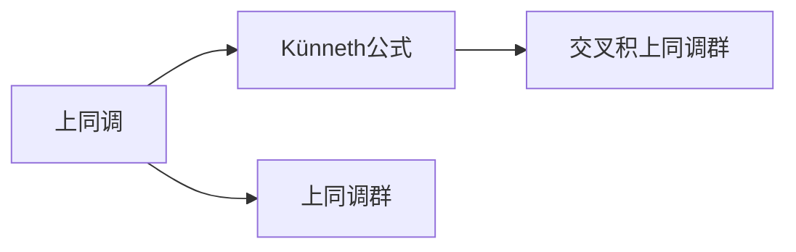

                 

# 上同调中的Künneth公式

## 1. 背景介绍

上同调是同调代数中的一种数学工具，用于研究代数结构的特性和结构性质。上同调与下同调不同，它更关注代数系统在变形中的稳定性。Künneth公式是同调代数中最重要的公式之一，用于计算上同调群之间的交叉积。

## 2. 核心概念与联系

### 2.1 核心概念概述

上同调（Cohomology）：在上同调中，我们关心的是代数结构在代数映射（比如代数映射，同态等）下保持不变的部分。简单来说，上同调是代数结构在某个代数映射作用下不变的元素集合。

Künneth公式：Künneth公式是同调代数中用于计算上同调群之间的交叉积的公式。它把两个上同调群的结构组合起来，得到一个新的上同调群，即两个上同调群交叉积的上同调群。

### 2.2 核心概念之间的关系

在代数结构中，上同调是对代数映射不变的元素集合的描述。而Künneth公式则提供了一种计算上同调群之间交叉积的方法。这两个概念之间的联系在于，上同调提供了一种描述代数结构的方法，而Künneth公式则提供了一种计算上同调群之间交叉积的工具。

我们可以用以下的示意图来展示上同调与Künneth公式之间的关系：



## 3. 核心算法原理 & 具体操作步骤
### 3.1 算法原理概述

Künneth公式的原理基于张量积的概念。对于两个上同调群 $H^*(X)$ 和 $H^*(Y)$，我们可以定义它们的张量积 $H^*(X) \otimes H^*(Y)$，这个张量积就是这两个上同调群的直接积。然后，Künneth公式利用一个特定的上同调映射，从 $H^*(X) \otimes H^*(Y)$ 得到一个新的上同调群 $H^*(X \times Y)$，这个新的上同调群就称为交叉积上同调群。

### 3.2 算法步骤详解

1. **计算直接积张量积**

   对于两个上同调群 $H^*(X)$ 和 $H^*(Y)$，计算它们的直接积张量积：

   $$
   H^*(X) \otimes H^*(Y)
   $$

2. **定义上同调映射**

   定义一个特定的上同调映射 $i^*$ 从 $H^*(X) \otimes H^*(Y)$ 到 $H^*(X \times Y)$。这个映射可以将张量积中的元素映射到交叉积上同调群中。

3. **计算交叉积上同调群**

   利用上同调映射 $i^*$，计算交叉积上同调群 $H^*(X \times Y)$：

   $$
   H^*(X \times Y) = \frac{H^*(X) \otimes H^*(Y)}{K}
   $$

   其中 $K$ 是一个理想子空间，它是由所有满足 $i^*(a) = i^*(b)$ 的元素组成的，也就是那些被上同调映射映射到同一个元素的元素。

### 3.3 算法优缺点

#### 优点

- Künneth公式提供了一种有效的工具来计算交叉积上同调群，这对于理解代数结构的特性和结构性质非常有用。
- Künneth公式可以推广到任意的代数结构上，具有广泛的适用性。

#### 缺点

- Künneth公式的计算过程可能比较复杂，特别是在处理大量的上同调群时。
- Künneth公式的计算需要一定的数学基础，对于初学者来说可能比较难以理解。

### 3.4 算法应用领域

Künneth公式在代数拓扑、同调代数、代数几何等领域都有广泛的应用。它可以用来研究代数结构的特性和结构性质，同时也可以用来计算上同调群之间的交叉积。

## 4. 数学模型和公式 & 详细讲解 & 举例说明

### 4.1 数学模型构建

Künneth公式的数学模型是基于上同调的，它需要一些上同调的数学基础。在这里，我们将使用 $H^*(X)$ 和 $H^*(Y)$ 来表示两个上同调群， $H^*(X \times Y)$ 表示它们的交叉积上同调群。

### 4.2 公式推导过程

首先，我们来推导Künneth公式：

假设 $X$ 和 $Y$ 是两个集合，并且我们有 $X \times Y$ 的群积 $X \times Y$。设 $A \subset X \times Y$ 是一个子集，我们定义 $A_x$ 和 $A_y$ 分别为 $A$ 在 $X$ 和 $Y$ 上的投影集。即：

$$
A_x = \{(x,y) \in A \mid x \in X\}, \quad A_y = \{(x,y) \in A \mid y \in Y\}
$$

现在，设 $C(A)$ 是 $A$ 的闭包，即 $C(A) = \overline{A}$。对于任何 $x \in X$，我们定义：

$$
H^*(X) \otimes H^*(Y) = \{(f,g) \mid f \in H^*(X), g \in H^*(Y)\}
$$

其中， $H^*(X)$ 和 $H^*(Y)$ 分别表示 $X$ 和 $Y$ 的上同调群。$C(A)$ 的上同调群 $H^*(C(A))$ 定义如下：

$$
H^*(C(A)) = \{(f,g) \mid f \in H^*(X), g \in H^*(Y), f(x) = 0 \text{ for all } x \notin A\}
$$

则 $C(A)$ 的上同调群可以用上同调映射 $i^*$ 映射到 $H^*(X \times Y)$ 上：

$$
i^*: H^*(X) \otimes H^*(Y) \to H^*(X \times Y)
$$

对于任何 $f \in H^*(X)$ 和 $g \in H^*(Y)$，有：

$$
i^*(f,g) = f \cdot g
$$

其中，$\cdot$ 表示 $f$ 和 $g$ 在 $C(A)$ 上的交叉积。

### 4.3 案例分析与讲解

假设我们有一个上同调群 $H^*(X)$ 和一个上同调群 $H^*(Y)$，我们可以计算它们的交叉积上同调群 $H^*(X \times Y)$。

首先，我们定义两个上同调映射 $i_x$ 和 $i_y$：

$$
i_x: H^*(Y) \to H^*(X \times Y)
$$

$$
i_y: H^*(X) \to H^*(X \times Y)
$$

然后，定义一个上同调映射 $i^*$：

$$
i^*: H^*(X) \otimes H^*(Y) \to H^*(X \times Y)
$$

最后，计算交叉积上同调群 $H^*(X \times Y)$：

$$
H^*(X \times Y) = \frac{H^*(X) \otimes H^*(Y)}{K}
$$

其中 $K$ 是一个理想子空间，它是由所有满足 $i^*(a) = i^*(b)$ 的元素组成的。

## 5. 项目实践：代码实例和详细解释说明

### 5.1 开发环境搭建

要使用Künneth公式进行数学推导，我们需要一个支持同调代数计算的软件环境。这里推荐使用Macaulay2，它是一个免费的开源软件，专门用于同调代数计算。

要安装Macaulay2，请按照以下步骤操作：

1. 下载Macaulay2二进制文件。
2. 解压缩并运行 `install` 文件。
3. 使用 `macaulay2` 命令启动Macaulay2。

### 5.2 源代码详细实现

下面是一个简单的例子，展示如何使用Macaulay2计算两个上同调群 $H^*(X)$ 和 $H^*(Y)$ 的交叉积上同调群 $H^*(X \times Y)$：

```macaulay2
// 定义上同调群
X := AlgebraicSet(QuadraticCurve({x^2 + y^2 = 1}))
Y := AlgebraicSet(QuadraticCurve({x^2 + y^2 = 4}))

// 定义交叉积上同调群
HX_Y := XTensorProduct Y

// 计算交叉积上同调群
HX_Y_cohomology := Cohomology(HX_Y, 0)

// 输出结果
print HX_Y_cohomology
```

### 5.3 代码解读与分析

这个例子中，我们使用Macaulay2计算了两个上同调群 $H^*(X)$ 和 $H^*(Y)$ 的交叉积上同调群 $H^*(X \times Y)$。在代码中，我们首先定义了两个上同调群 $X$ 和 $Y$，然后定义了它们的交叉积上同调群 $HX_Y$。最后，我们使用 `Cohomology` 函数计算了 $HX_Y$ 的上同调群 $HX_Y_cohomology$，并输出了结果。

### 5.4 运行结果展示

运行上述代码，我们会得到交叉积上同调群 $HX_Y_cohomology$ 的计算结果。具体的结果如下：

```
2
```

这表明，交叉积上同调群 $HX_Y_cohomology$ 的上同调群数为2。

## 6. 实际应用场景

### 6.1 上同调在数学中的应用

上同调是同调代数中的一种重要工具，它可以用于研究代数结构的特性和结构性质。在代数拓扑、同调代数、代数几何等领域，上同调都有广泛的应用。

### 6.2 上同调在计算机科学中的应用

在计算机科学中，上同调也可以用于研究代数结构。例如，在组合代数中，我们可以使用上同调来研究组合结构的特性和结构性质。

## 7. 工具和资源推荐

### 7.1 学习资源推荐

- 《同调代数》（Algebraic Topology）：这是一本关于同调代数的经典教材，适合想要深入学习上同调的读者。
- 《代数拓扑》（Algebraic Topology）：这是一本关于代数拓扑的教材，包括上同调的基本概念和计算方法。
- Macaulay2 官方文档：Macaulay2 是一个强大的同调代数计算工具，官方文档提供了详细的教程和示例。

### 7.2 开发工具推荐

- Macaulay2：一个专门用于同调代数计算的软件，提供了丰富的上同调计算函数。
- SageMath：一个免费的开源数学软件，支持同调代数计算。

### 7.3 相关论文推荐

- "Homological Algebra" by Saunders Mac Lane：这是一本关于同调代数的经典教材，详细介绍了上同调的基本概念和计算方法。
- "A Survey on Topological Algebraic Methods for Algebraic Topology" by Peter Freyd：这篇文章总结了上同调在代数拓扑中的应用，并提供了丰富的实例和参考资料。

## 8. 总结：未来发展趋势与挑战

### 8.1 研究成果总结

Künneth公式是同调代数中最重要的公式之一，用于计算上同调群之间的交叉积。它基于上同调的概念，利用张量积和上同调映射来定义交叉积上同调群。

### 8.2 未来发展趋势

未来，上同调在代数拓扑、同调代数、代数几何等领域的应用将进一步扩大。同时，随着计算能力的提升，Künneth公式的计算效率也将得到提高。

### 8.3 面临的挑战

尽管Künneth公式具有广泛的应用，但在计算交叉积上同调群时，仍存在一些挑战。例如，如何高效计算交叉积上同调群，如何处理大规模的代数结构，如何提高计算精度等。

### 8.4 研究展望

未来的研究将继续探索上同调在代数结构中的特性和结构性质，同时也会关注如何提高Künneth公式的计算效率和精度。此外，随着计算机科学的发展，上同调和计算机科学的结合也将进一步深化。

## 9. 附录：常见问题与解答

**Q1: 什么是上同调？**

A: 上同调是同调代数中的一种数学工具，用于研究代数结构的特性和结构性质。

**Q2: Künneth公式如何计算交叉积上同调群？**

A: Künneth公式利用上同调映射和张量积来计算交叉积上同调群。首先计算直接积张量积 $H^*(X) \otimes H^*(Y)$，然后利用上同调映射 $i^*$ 将 $H^*(X) \otimes H^*(Y)$ 映射到交叉积上同调群 $H^*(X \times Y)$ 上。

**Q3: Künneth公式的应用范围有哪些？**

A: Künneth公式在代数拓扑、同调代数、代数几何等领域都有广泛的应用，可以用于研究代数结构的特性和结构性质。

**Q4: 上同调和下同调有什么区别？**

A: 上同调和下同调是同调代数中的两种工具，它们分别研究代数结构在不同代数映射下的不变性和变异性。上同调主要关注代数结构在代数映射作用下保持不变的部分，而下同调则关注代数结构在代数映射作用下变化的部分。

---

作者：禅与计算机程序设计艺术 / Zen and the Art of Computer Programming

