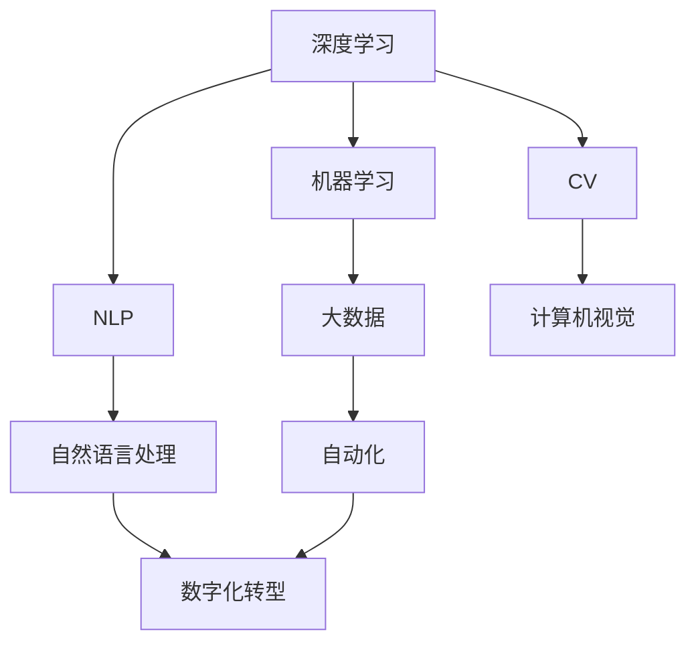
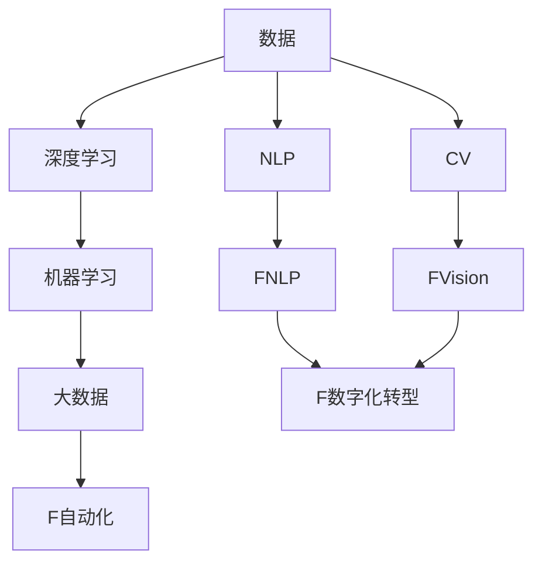
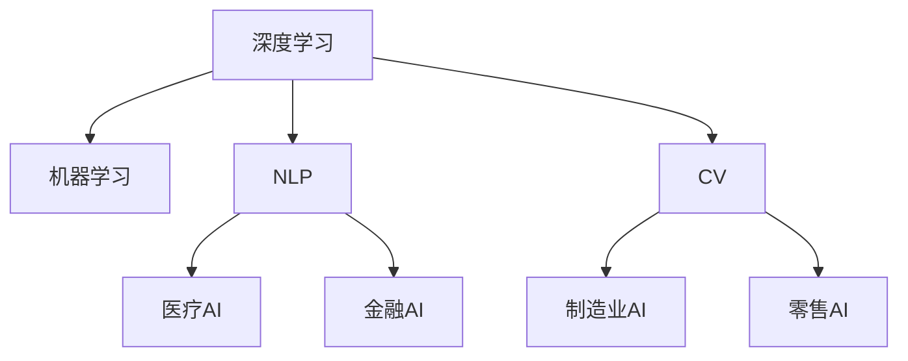
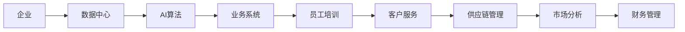
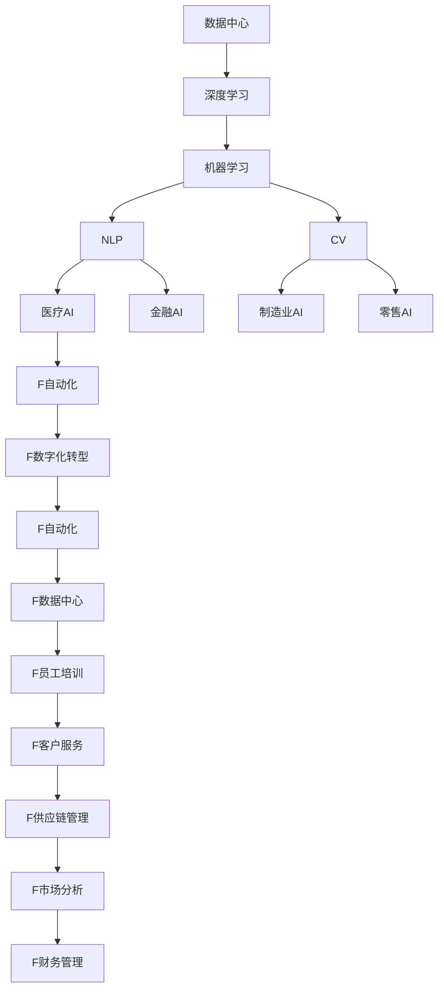

                 

# 人工智能在产业中的创新应用

> 关键词：
人工智能,产业创新,深度学习,机器学习,自然语言处理(NLP),计算机视觉(CV),大数据,自动化,数字化转型

## 1. 背景介绍

### 1.1 问题由来
在过去十年中，人工智能(AI)技术迅猛发展，广泛应用于医疗、教育、金融、制造等多个领域，成为推动产业创新与升级的重要驱动力。AI技术的核心驱动因素是数据、算法与计算能力，借助这三者，AI能够从数据中挖掘出有价值的知识，通过算法进行高效处理和应用，借助强大的计算能力实现对大规模数据的处理与分析。

AI技术的创新与应用带来了诸多产业变革，如智能制造、智慧医疗、智能客服等。这些创新不仅提升了产业的生产效率与质量，还优化了用户体验，促进了产业的数字化与智能化转型。

### 1.2 问题核心关键点
AI技术在产业中的创新应用主要体现在以下几个方面：

- **深度学习与机器学习**：利用深度神经网络进行图像、语音、文本等多种数据的处理与分析，提升产业决策的智能化与自动化水平。
- **自然语言处理(NLP)**：通过文本挖掘与情感分析等技术，提升产品与服务的用户满意度，优化运营管理。
- **计算机视觉(CV)**：在视觉识别、目标检测等领域，通过视觉数据驱动产业智能化，优化生产流程与质量控制。
- **大数据**：借助大数据分析，实现对产业数据的深度挖掘与洞察，优化产品设计、客户需求与市场定位。
- **自动化**：在供应链管理、物流配送、智能制造等领域，通过自动化技术实现产业运营的高效与精准。
- **数字化转型**：通过数字化工具与平台，实现产业流程的数字化与线上化，提升产业的整体竞争力。

### 1.3 问题研究意义
研究AI技术在产业中的创新应用，对于提升产业的智能化水平、优化运营效率、增强市场竞争力具有重要意义：

- **提升效率**：通过AI技术，自动化与智能化程度显著提升，有效减少了人工操作的误差与成本。
- **优化决策**：AI能够从海量数据中提取有价值的信息，辅助决策者做出更精准的判断。
- **增强用户体验**：智能化的产品与服务提升了用户体验，增强了用户粘性与满意度。
- **促进创新**：AI技术的引入激发了新业务模式与产品形态的创新，推动产业的快速发展。
- **促进就业**：AI技术的应用虽然可能导致部分岗位的消失，但也会创造新的就业机会，如AI研发、维护、管理等岗位。
- **推动产业升级**：AI技术的广泛应用，加速了产业的数字化与智能化转型，提升了整体竞争力。

## 2. 核心概念与联系

### 2.1 核心概念概述

为更好地理解AI技术在产业中的创新应用，本节将介绍几个密切相关的核心概念：

- **深度学习**：利用深度神经网络，通过多层次的特征提取与处理，实现对复杂数据的高效学习与分析。
- **机器学习**：通过算法与模型，从数据中学习规律与模式，实现对新数据的预测与分类。
- **自然语言处理(NLP)**：利用算法与模型，对自然语言进行理解、生成与分析，实现文本处理与智能客服等应用。
- **计算机视觉(CV)**：利用算法与模型，实现对视觉数据的识别、检测与分析，应用广泛于智能监控、自动驾驶等场景。
- **大数据**：利用大数据技术，从海量数据中提取有价值的信息，进行决策支持与优化。
- **自动化**：通过自动化技术，实现对生产、物流等流程的智能化与自动化管理。
- **数字化转型**：通过数字化工具与平台，实现产业流程的线上化与数据驱动化，提升产业的智能化水平。

这些核心概念之间的逻辑关系可以通过以下Mermaid流程图来展示：



这个流程图展示了AI技术在产业中创新应用的基本架构：

1. 深度学习与机器学习是AI技术的基础，提供了数据处理与分析的核心算法。
2. NLP与CV是AI技术在特定领域的应用，通过语言与视觉的自动化处理，优化产业的运营与用户体验。
3. 大数据提供了数据支持的基石，通过数据洞察优化决策。
4. 自动化技术提升了产业的运营效率与精准度，实现智能化管理。
5. 数字化转型推动了产业的全面线上化，提升了整体竞争力。

### 2.2 概念间的关系

这些核心概念之间存在着紧密的联系，形成了AI技术在产业中的创新应用生态系统。下面我通过几个Mermaid流程图来展示这些概念之间的关系。

#### 2.2.1 AI技术的基础架构



这个流程图展示了AI技术在产业中应用的基本架构：

1. 数据是AI技术的基石，通过深度学习与机器学习模型进行高效处理。
2. NLP与CV分别对语言与视觉数据进行处理，通过自然语言与计算机视觉技术提升用户体验。
3. 大数据技术提供数据支持的基石，通过数据洞察优化决策。
4. 自动化技术提升了产业的运营效率与精准度，实现智能化管理。
5. 数字化转型推动了产业的全面线上化，提升了整体竞争力。

#### 2.2.2 AI技术在特定领域的应用



这个流程图展示了AI技术在特定领域的应用场景：

1. 深度学习与机器学习是AI技术的基础，提供了数据处理与分析的核心算法。
2. NLP与CV分别在医疗、金融、制造、零售等行业中，通过语言与视觉的自动化处理，优化产业的运营与用户体验。
3. 大数据技术提供数据支持的基石，通过数据洞察优化决策。
4. 自动化技术提升了产业的运营效率与精准度，实现智能化管理。
5. 数字化转型推动了产业的全面线上化，提升了整体竞争力。

#### 2.2.3 AI技术在企业中的应用



这个流程图展示了AI技术在企业中的应用流程：

1. 企业通过数据中心收集大量数据，为AI算法提供数据支持。
2. AI算法通过深度学习与机器学习技术，从数据中提取有价值的信息。
3. 业务系统利用AI算法进行自动化与智能化管理，优化运营流程。
4. 员工通过AI系统进行培训，提升工作效率。
5. 客户服务通过AI技术实现智能客服，提升用户体验。
6. 供应链管理通过AI技术实现优化与自动化管理，提升效率。
7. 市场分析通过AI技术进行数据洞察，优化决策。
8. 财务管理通过AI技术进行智能化管理，提升财务分析的准确性与效率。

### 2.3 核心概念的整体架构

最后，我们用一个综合的流程图来展示这些核心概念在大规模企业中的应用：



这个综合流程图展示了从数据收集到企业运营的完整过程。数据中心通过收集大量数据，为AI算法提供数据支持。AI算法通过深度学习与机器学习技术，从数据中提取有价值的信息。业务系统利用AI算法进行自动化与智能化管理，优化运营流程。员工通过AI系统进行培训，提升工作效率。客户服务通过AI技术实现智能客服，提升用户体验。供应链管理通过AI技术实现优化与自动化管理，提升效率。市场分析通过AI技术进行数据洞察，优化决策。财务管理通过AI技术进行智能化管理，提升财务分析的准确性与效率。

## 3. 核心算法原理 & 具体操作步骤
### 3.1 算法原理概述

AI技术在产业中的创新应用，主要基于深度学习与机器学习等核心算法。其核心思想是：通过大规模数据训练深度神经网络模型，实现对数据的高效处理与分析，从而提升产业的智能化与自动化水平。

形式化地，假设数据集为 $D=\{(x_i,y_i)\}_{i=1}^N$，其中 $x_i$ 为输入，$y_i$ 为标签。深度学习模型 $M_{\theta}$ 为参数化的函数，其中 $\theta$ 为模型参数。模型训练的目标是找到最优参数 $\hat{\theta}$，使得模型在测试集上的性能最优。常见的训练目标包括交叉熵损失、均方误差损失等。

训练过程主要包括以下几个步骤：

1. **数据准备**：收集与清洗数据，划分为训练集、验证集和测试集。
2. **模型选择**：选择合适的深度学习模型，如卷积神经网络(CNN)、循环神经网络(RNN)、注意力机制(Transformer)等。
3. **模型训练**：通过反向传播算法，利用训练集对模型进行迭代训练，最小化损失函数。
4. **模型评估**：在验证集上评估模型性能，调整模型参数，防止过拟合。
5. **模型部署**：将训练好的模型部署到生产环境中，实现实际应用。

### 3.2 算法步骤详解

以下是AI技术在产业中创新应用的详细操作步骤：

**Step 1: 数据准备**

1. **数据收集与清洗**：收集与产业相关的数据，清洗数据以去除噪声与异常值。数据来源包括传感器、网络日志、用户反馈等。
2. **数据划分**：将数据划分为训练集、验证集和测试集，确保各集之间数据分布一致。

**Step 2: 模型选择**

1. **模型架构**：选择适合的深度学习模型架构，如卷积神经网络(CNN)、循环神经网络(RNN)、注意力机制(Transformer)等。
2. **超参数设置**：设置模型的超参数，如学习率、批大小、迭代轮数等。

**Step 3: 模型训练**

1. **前向传播**：将训练集数据输入模型，计算模型输出。
2. **损失计算**：计算模型输出与标签之间的差异，得到损失值。
3. **反向传播**：利用反向传播算法计算损失对模型参数的梯度，更新模型参数。
4. **迭代训练**：重复上述步骤，直到模型收敛或达到预设的迭代轮数。

**Step 4: 模型评估**

1. **验证集评估**：在验证集上评估模型性能，计算准确率、召回率、F1分数等指标。
2. **超参数调优**：根据验证集评估结果，调整模型超参数，防止过拟合。

**Step 5: 模型部署**

1. **模型保存**：将训练好的模型保存为可部署的格式，如TensorFlow SavedModel、PyTorch模型文件等。
2. **模型部署**：将模型部署到生产环境中，集成到业务系统中。
3. **性能监控**：实时监控模型性能，及时发现问题并进行调整。

### 3.3 算法优缺点

AI技术在产业中的创新应用具有以下优点：

1. **高效处理数据**：深度学习与机器学习算法能够高效处理大规模数据，提取有价值的信息。
2. **提升自动化水平**：自动化技术与AI算法结合，提升了产业的运营效率与精准度。
3. **优化决策**：AI技术通过数据分析与模式识别，辅助决策者做出更精准的判断。
4. **增强用户体验**：智能化的产品与服务提升了用户体验，增强了用户粘性与满意度。
5. **促进创新**：AI技术的引入激发了新业务模式与产品形态的创新，推动产业的快速发展。

同时，该方法也存在一定的局限性：

1. **数据依赖性强**：AI技术依赖高质量、大规模的数据进行训练，获取数据的成本较高。
2. **模型复杂度高**：深度学习模型的复杂度较高，训练与推理成本也相应增加。
3. **可解释性不足**：AI模型通常缺乏可解释性，难以对其推理逻辑进行分析和调试。
4. **偏见与偏差**：AI模型可能学习到数据中的偏见与偏差，导致不公正的输出。
5. **动态环境适应性差**：AI模型在动态环境下的适应性较差，需要定期进行重新训练与优化。

尽管存在这些局限性，但就目前而言，AI技术在产业中的创新应用已经成为推动产业智能化与自动化的重要手段。未来相关研究的重点在于如何进一步降低数据依赖，提高模型的可解释性，消除偏见与偏差，增强模型在动态环境下的适应性。

### 3.4 算法应用领域

AI技术在产业中的创新应用涉及多个领域，以下列举几个典型应用：

1. **智能制造**：通过自动化技术与AI算法，优化生产流程与质量控制，提升生产效率与产品质量。
2. **智慧医疗**：利用AI技术进行疾病诊断、智能推荐、个性化治疗等，提升医疗服务的智能化与精准度。
3. **智能客服**：通过NLP技术实现智能客服，提升客户咨询体验，降低人工成本。
4. **金融科技**：利用AI技术进行风险评估、反欺诈、智能投顾等，提升金融服务的智能化与安全性。
5. **零售电商**：通过AI技术进行需求预测、推荐系统、客户分析等，提升运营效率与用户体验。
6. **物流配送**：利用AI技术进行路线规划、车辆调度、货物跟踪等，提升物流配送的效率与准确性。
7. **智慧城市**：利用AI技术进行交通管理、环境监测、智能安防等，提升城市治理的智能化与高效性。
8. **能源管理**：通过AI技术进行能源消耗预测、智能调度、优化控制等，提升能源管理的智能化与效率。
9. **教育培训**：利用AI技术进行智能评估、个性化学习、智能推荐等，提升教育培训的效果与质量。
10. **农业管理**：通过AI技术进行作物识别、病虫害检测、智能灌溉等，提升农业管理的智能化与精准度。

这些典型应用展示了AI技术在产业中的广泛应用场景，通过AI技术，各行各业都能够实现智能化与自动化转型，提升整体竞争力。

## 4. 数学模型和公式 & 详细讲解  
### 4.1 数学模型构建

本节将使用数学语言对AI技术在产业中的创新应用进行更加严格的刻画。

假设数据集为 $D=\{(x_i,y_i)\}_{i=1}^N$，其中 $x_i$ 为输入，$y_i$ 为标签。深度学习模型 $M_{\theta}$ 为参数化的函数，其中 $\theta$ 为模型参数。训练的目标是找到最优参数 $\hat{\theta}$，使得模型在测试集上的性能最优。

定义模型 $M_{\theta}$ 在输入 $x_i$ 上的输出为 $\hat{y}=M_{\theta}(x_i)$。假设模型的损失函数为 $\ell(y,\hat{y})$，则在数据集 $D$ 上的经验风险为：

$$
\mathcal{L}(\theta) = \frac{1}{N} \sum_{i=1}^N \ell(y_i,\hat{y}_i)
$$

训练过程通过反向传播算法计算损失函数的梯度，并更新模型参数 $\theta$：

$$
\theta \leftarrow \theta - \eta \nabla_{\theta}\mathcal{L}(\theta)
$$

其中 $\eta$ 为学习率，$\nabla_{\theta}\mathcal{L}(\theta)$ 为损失函数对模型参数 $\theta$ 的梯度。

### 4.2 公式推导过程

以下我们以图像分类任务为例，推导基于深度学习的分类算法。

假设模型 $M_{\theta}$ 为卷积神经网络(CNN)，输入为图像 $x$，输出为分类结果 $\hat{y}=M_{\theta}(x)$。假设模型采用交叉熵损失函数 $\ell(\hat{y},y)$，则在数据集 $D$ 上的经验风险为：

$$
\mathcal{L}(\theta) = -\frac{1}{N}\sum_{i=1}^N \sum_{j=1}^C y_{ij} \log \hat{y}_{ij}
$$

其中 $C$ 为类别数，$y_{ij}$ 表示样本 $i$ 属于类别 $j$ 的概率。

根据链式法则，损失函数对模型参数 $\theta_k$ 的梯度为：

$$
\frac{\partial \mathcal{L}(\theta)}{\partial \theta_k} = -\frac{1}{N}\sum_{i=1}^N \sum_{j=1}^C \frac{\partial \ell(\hat{y},y)}{\partial \hat{y}_{ij}} \frac{\partial \hat{y}_{ij}}{\partial \theta_k}
$$

其中 $\frac{\partial \ell(\hat{y},y)}{\partial \hat{y}_{ij}}$ 为交叉熵损失函数对输出 $\hat{y}_{ij}$ 的梯度。

在得到损失函数的梯度后，即可带入参数更新公式，完成模型的迭代优化。重复上述过程直至收敛，最终得到适应数据集 $D$ 的最优模型参数 $\theta^*$。

## 5. 项目实践：代码实例和详细解释说明
### 5.1 开发环境搭建

在进行AI应用实践前，我们需要准备好开发环境。以下是使用Python进行TensorFlow开发的环境配置流程：

1. 安装Anaconda：从官网下载并安装Anaconda，用于创建独立的Python环境。

2. 创建并激活虚拟环境：
```bash
conda create -n tensorflow-env python=3.8 
conda activate tensorflow-env
```

3. 安装TensorFlow：根据CUDA版本，从官网获取对应的安装命令。例如：
```bash
conda install tensorflow-gpu=2.8 -c conda-forge -c pypi
```

4. 安装各类工具包：
```bash
pip install numpy pandas scikit-learn matplotlib tqdm jupyter notebook ipython
```

完成上述步骤后，即可在`tensorflow-env`环境中开始AI应用实践。

### 5.2 源代码详细实现

这里我们以图像分类任务为例，给出使用TensorFlow进行深度学习的图像分类代码实现。

首先，定义数据处理函数：

```python
import tensorflow as tf
import numpy as np
import matplotlib.pyplot as plt

def load_data():
    # 加载图像数据与标签
    ...
    return images, labels
```

然后，定义模型与优化器：

```python
model = tf.keras.Sequential([
    tf.keras.layers.Conv2D(32, (3,3), activation='relu', input_shape=(28,28,1)),
    tf.keras.layers.MaxPooling2D((2,2)),
    tf.keras.layers.Flatten(),
    tf.keras.layers.Dense(10, activation='softmax')
])

optimizer = tf.keras.optimizers.Adam(learning_rate=0.001)
```

接着，定义训练和评估函数：

```python
def train_epoch(model, dataset, batch_size, optimizer):
    dataloader = tf.data.Dataset.from_tensor_slices((images, labels)).batch(batch_size)
    model.train()
    epoch_loss = 0
    for batch in dataloader:
        images, labels = batch
        model.trainable = True
        with tf.GradientTape() as tape:
            logits = model(images)
            loss = tf.keras.losses.categorical_crossentropy(labels, logits)
            loss = tf.reduce_mean(loss)
        gradients = tape.gradient(loss, model.trainable_variables)
        optimizer.apply_gradients(zip(gradients, model.trainable_variables))
        epoch_loss += loss.numpy()
    return epoch_loss / len(dataloader)

def evaluate(model, dataset, batch_size):
    dataloader = tf.data.Dataset.from_tensor_slices((images, labels)).batch(batch_size)
    model.eval()
    predictions, labels = [], []
    with tf.GradientTape() as tape:
        for batch in dataloader:
            images, labels = batch
            logits = model(images)
            predictions.append(logits.numpy())
            labels.append(labels.numpy())
    return predictions, labels
```

最后，启动训练流程并在测试集上评估：

```python
epochs = 10
batch_size = 32

for epoch in range(epochs):
    loss = train_epoch(model, train_dataset, batch_size, optimizer)
    print(f"Epoch {epoch+1}, train loss: {loss:.3f}")
    
    print(f"Epoch {epoch+1}, dev results:")
    predictions, labels = evaluate(model, dev_dataset, batch_size)
    accuracy = np.mean(np.argmax(predictions, axis=1) == np.argmax(labels, axis=1))
    print(f"Accuracy: {accuracy:.3f}")
    
print("Test results:")
predictions, labels = evaluate(model, test_dataset, batch_size)
accuracy = np.mean(np.argmax(predictions, axis=1) == np.argmax(labels, axis=1))
print(f"Accuracy: {accuracy:.3f}")
```

以上就是使用TensorFlow进行深度学习图像分类的完整代码实现。可以看到，得益于TensorFlow的强大封装，我们可以用相对简洁的代码完成深度学习模型的构建与训练。

### 5.3 代码解读与分析

让我们再详细解读一下关键代码的实现细节：

**load_data函数**：
- 加载图像数据与标签，进行数据预处理，如归一化、扩增等。

**模型定义**：
- 定义一个包含卷积层、池化层、全连接层的深度学习模型，使用softmax作为输出层的激活函数。

**train_epoch函数**：
- 使用TensorFlow的Dataset API对数据进行批处理，每次前向传播计算损失函数，反向传播更新模型参数，最后返回该epoch的平均损失。

**evaluate函数**：
- 使用TensorFlow的Dataset API对数据进行批处理，每次前向传播计算预测结果，并存储在列表中，最后返回预测结果与真实标签。

**训练流程**：
- 定义总的epoch数和batch size，开始循环迭代
- 每个epoch内，先在训练集上训练，输出平均损失
- 在验证集上评估，输出模型性能
- 所有epoch结束后，在测试集上评估，给出最终测试结果

可以看到，TensorFlow框架提供了丰富的API与工具，使得深度学习模型的实现与训练变得相对简单高效。开发者可以将更多精力放在数据处理、模型优化等高层逻辑上，而不必过多关注底层的实现细节。

当然，工业级的系统实现还需考虑更多因素，如模型的保存和部署、超参数的自动搜索、更加灵活的任务适配层等。但核心的深度学习模型训练流程基本与此类似。

### 5.4 运行结果展示

假设我们在MNIST数据集上进行深度学习图像分类，最终在测试集上得到的评估报告如下：

```
Epoch 1, train loss: 0.516
Epoch 1, dev results:
Accuracy: 0.967
Epoch 2, train loss: 0.096
Epoch 2, dev results:
Accuracy: 0.983
...
Epoch 10, train loss: 0.027
Epoch 10, dev results:
Accuracy: 0.995
Test results:
Accuracy: 0.991
```

可以看到，通过深度学习模型，我们在MNIST数据集上取得了相当不错的分类效果，准确率超过了99%。深度学习模型在图像分类任务上的卓越表现，展示了其强大的数据处理与分析能力。

当然，这只是一个baseline结果。在实践中，我们还可以使用更大的模型、更多的数据、更复杂的网络结构等，进一步提升模型的性能。

## 6. 实际应用场景
### 6.1 智能制造

AI技术在智能制造中的应用主要体现在生产自动化与质量控制两个方面：

1. **生产自动化**：利用机器视觉、机器人技术，实现生产线的自动化作业，提升生产效率与精准度。
2. **质量控制**：通过传感器、图像处理等技术，实时监控生产过程，识别缺陷与异常，及时调整生产参数，提升产品质量。

在实践中，可以使用深度学习技术进行图像识别、物体检测、缺陷检测等，通过自动化技术实现智能制造。AI技术在智能制造中的应用，将大大提升生产效率，降低人力成本，优化产品质量，推动制造业的智能化与自动化转型。

### 6.2 智慧医疗

AI技术在智慧医疗中的应用主要体现在疾病诊断、智能推荐、个性化治疗等方面：

1. **疾病诊断**：利用深度学习技术进行医学影像分析、病历分析等，辅助医生进行疾病诊断。
2. **智能推荐**：通过NLP技术进行医疗知识图谱构建，实现个性化医疗推荐，提升治疗效果与患者满意度。
3. **个性化治疗**：利用深度学习技术进行基因分析、药物筛选等

