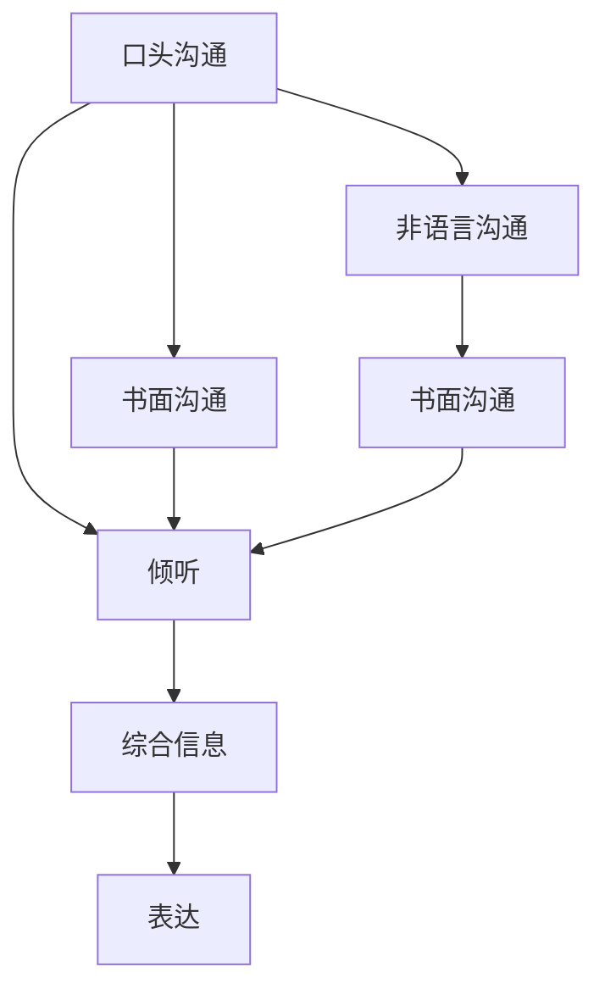

                 

# 人际沟通：人际沟通即与他人交换信息、交流感受、表达意思，包括口头沟通、书面沟通、非语言沟通、倾听

人际沟通是人类社会最重要的技能之一，它不仅是信息交换的手段，也是情感交流、文化传递的桥梁。随着技术的进步，尤其是计算机和互联网的普及，人际沟通的方式不断丰富和变革。本文将深入探讨人际沟通的核心概念、算法原理、操作步骤，以及未来应用展望，为提高沟通效率和质量提供技术支持。

## 1. 背景介绍

### 1.1 问题由来

在现代科技发展的大背景下，人际沟通面临着前所未有的挑战和机遇。传统的面对面交流逐渐被电子邮件、即时消息、社交媒体等电子沟通方式所取代，但这些新方式也带来了信息传递的延迟、误读和丢失的风险。随着自然语言处理（NLP）技术的飞速发展，机器能够更好地理解和生成人类语言，为电子沟通提供了新的可能性。

### 1.2 问题核心关键点

人际沟通的本质是人与人之间的信息交换、情感交流和意思表达。其核心关键点包括：
- **口头沟通**：通过语言和声音进行实时交流。
- **书面沟通**：通过文字进行书面和远程交流。
- **非语言沟通**：通过肢体语言、面部表情、语调等非语言信息进行交流。
- **倾听**：理解和回应他人的信息，是有效沟通的关键。

## 2. 核心概念与联系

### 2.1 核心概念概述

为了更好地理解人际沟通的各个方面，我们将介绍几个核心概念及其相互关系。

#### 2.1.1 口头沟通

口头沟通是最直接的沟通方式，通常涉及声音和语言的交流。它包括面对面对话和远程电话、视频会议等形式。口头沟通的优点是即时性强，但存在信息传递的准确性和持久性问题。

#### 2.1.2 书面沟通

书面沟通通过文字形式进行，如信件、电子邮件、社交媒体消息等。其优点是信息传递的持久性和准确性较高，但缺乏即时性。

#### 2.1.3 非语言沟通

非语言沟通包括肢体语言、面部表情、语调等非语言信息。它们在沟通过程中起到补充和强调的作用，有助于增强口头和书面沟通的效果。

#### 2.1.4 倾听

倾听不仅是接受信息的过程，还包括理解、分析和回应信息的能力。有效的倾听能够促进沟通双方的理解和信任，是良好沟通的基石。

### 2.2 核心概念间的关系

人际沟通的各个方面相互交织，形成了一个复杂的沟通网络。口头沟通、书面沟通和非语言沟通相互补充，共同构成了完整的沟通系统。而倾听则是沟通的核心技能，贯穿于整个沟通过程，确保信息传递的准确性和有效性。

以下是一个Mermaid流程图，展示了口头沟通、书面沟通、非语言沟通和倾听之间的关系：



这个流程图展示了口头沟通和书面沟通之间的相互影响，以及非语言沟通和倾听在沟通过程中的作用。

## 3. 核心算法原理 & 具体操作步骤

### 3.1 算法原理概述

人际沟通的算法原理可以理解为信息的编码、解码和传输。在这个过程中，信息被编码为特定的符号和语言，通过语言模型进行处理和解码，最终被接收方理解并回应。

具体来说，人际沟通的算法包括：
- **编码**：将信息转换为可以被接收方理解的符号和语言形式。
- **解码**：将符号和语言解码为信息，理解其含义。
- **传输**：通过特定通道（如声音、文字、图像等）将编码后的信息传递给接收方。
- **反馈**：接收方对接收到的信息进行回应，完成信息的闭环。

### 3.2 算法步骤详解

人际沟通的算法步骤包括：
1. **信息获取**：收集和整理需要传达的信息。
2. **信息编码**：将信息转换为合适的符号和语言形式，如文字、声音、图像等。
3. **信息传输**：通过特定通道（如电话、电子邮件、视频会议等）将信息传递给接收方。
4. **信息解码**：接收方对接收到的信息进行解码，理解其含义。
5. **信息回应**：接收方对理解后的信息进行回应，完成信息的闭环。

### 3.3 算法优缺点

人际沟通的算法有以下优点：
- **即时性强**：口头沟通能够实现实时交流。
- **信息持久性高**：书面沟通和文档记录信息持久性强。
- **信息丰富**：非语言沟通提供了丰富的情感和语境信息。

但同时也存在一些缺点：
- **误读风险**：电子沟通方式易出现信息误读。
- **信息丢失**：非语言沟通的信息容易丢失或被误解。
- **语言障碍**：不同语言和文化背景下的沟通存在障碍。

### 3.4 算法应用领域

人际沟通的算法广泛应用于各种领域，包括但不限于：
- **企业沟通**：通过会议、电子邮件、即时消息等方式进行沟通。
- **医疗咨询**：通过电话咨询、在线咨询等进行医患沟通。
- **教育培训**：通过课堂讲授、视频教学等方式进行师生沟通。
- **社交互动**：通过社交媒体、即时消息等方式进行朋友、家人之间的沟通。

## 4. 数学模型和公式 & 详细讲解 & 举例说明

### 4.1 数学模型构建

人际沟通的数学模型可以通过信息论和语言模型来构建。信息论提供了信息的熵和互信息的概念，用于衡量信息的不确定性和传递效率。语言模型则用于描述语言的统计特性，如单词、句子的概率分布。

假设信息 $X$ 的熵为 $H(X)$，接收方解码后的信息为 $\hat{X}$，则信息熵可以表示为：

$$
H(X) = -\sum_{x} P(x) \log P(x)
$$

其中 $P(x)$ 为信息 $x$ 的概率分布。

### 4.2 公式推导过程

在人际沟通的算法中，信息的传递和解码可以通过贝叶斯网络表示。假设信息 $X$ 和解码后的信息 $\hat{X}$ 之间的关系为 $P(\hat{X}|X)$，则信息的熵可以表示为：

$$
H(X|\hat{X}) = -\sum_{x} P(x) \log P(x|\hat{x})
$$

其中 $P(x|\hat{x})$ 为在解码后的信息 $\hat{x}$ 下，信息 $x$ 的条件概率。

### 4.3 案例分析与讲解

假设在视频会议中，一个演讲者（发送方）向多个听众（接收方）传达信息。信息 $X$ 为演讲内容，解码后的信息 $\hat{X}$ 为听众理解的演讲内容。通过贝叶斯网络，可以计算出信息 $X$ 的条件熵，即在听众理解的基础上，信息 $X$ 的不确定性。

## 5. 项目实践：代码实例和详细解释说明

### 5.1 开发环境搭建

要进行人际沟通的算法实践，需要搭建一个包含语音和文字处理模块的开发环境。以下是Python环境下常见的开发环境搭建步骤：

1. 安装Python环境：选择Python 3.x版本，使用Anaconda或Miniconda进行安装。
2. 安装语音和文字处理库：如SpeechRecognition、NLTK、spaCy等。
3. 搭建开发环境：使用Jupyter Notebook或PyCharm等IDE进行开发。

### 5.2 源代码详细实现

以下是一个简单的Python代码实现，展示了如何通过Text-to-Speech和Speech-to-Text技术实现口头沟通和书面沟通的转换：

```python
import speech_recognition as sr
import pyttsx3

def speech_to_text():
    r = sr.Recognizer()
    with sr.Microphone() as source:
        audio = r.listen(source)
    try:
        return r.recognize_google(audio)
    except sr.UnknownValueError:
        return "Could not understand audio"
    except sr.RequestError as e:
        return str(e)

def text_to_speech(text):
    engine = pyttsx3.init()
    engine.say(text)
    engine.runAndWait()
```

### 5.3 代码解读与分析

在上述代码中，`speech_to_text`函数用于将口头沟通转换为书面沟通，即语音转文字。它通过SpeechRecognition库获取麦克风输入的语音，使用Google Speech Recognition服务进行识别，并返回识别结果。

`text_to_speech`函数用于将书面沟通转换为口头沟通，即文字转语音。它使用pyttsx3库将文本转化为语音，并播放出来。

### 5.4 运行结果展示

假设我们进行一个简单的对话实验，首先使用`speech_to_text`函数将口头沟通转换为书面沟通，然后使用`text_to_speech`函数将书面沟通转换为口头沟通，重复多次，验证转换的正确性。

## 6. 实际应用场景

### 6.1 智能客服系统

智能客服系统利用NLP技术实现自动应答和问题解决，大幅提升了客户服务效率。在实际应用中，系统可以通过语音识别和自然语言理解技术，将客户的口头沟通转换为文字，进行自动应答或转接人工客服，从而实现24小时不间断服务。

### 6.2 远程医疗咨询

远程医疗咨询利用视频和语音技术，实现医生与患者的实时沟通。系统可以通过语音识别和文本分析技术，提取患者的症状和病史，辅助医生进行诊断和治疗。

### 6.3 教育培训平台

教育培训平台利用NLP技术，实现教师与学生的互动和教学内容自动生成。系统可以通过语音识别和自然语言生成技术，将教师的口头讲解转换为文本，生成教学课件和复习资料，提高教学效果。

### 6.4 未来应用展望

未来，人际沟通的算法将更加智能和人性化。随着技术的进步，我们可以预见以下趋势：
- **多模态沟通**：结合口头、书面、非语言等多种沟通方式，提供更加丰富和全面的沟通体验。
- **情感识别**：通过面部表情、语调等非语言信息，实现情感识别和智能应答，提高沟通的情感共鸣。
- **自然语言生成**：利用自然语言生成技术，实现智能写作、翻译、摘要等功能，提高沟通效率。

## 7. 工具和资源推荐

### 7.1 学习资源推荐

为了提高人际沟通的技术水平，推荐以下学习资源：
1. **《自然语言处理综论》**：由斯坦福大学开发的课程，涵盖NLP的基本理论和经典算法。
2. **《Python自然语言处理》**：由李宏毅教授的NLP入门教程，讲解Python在NLP中的应用。
3. **《语言模型与深度学习》**：深入介绍语言模型的原理和深度学习的应用，适合进阶学习。
4. **《人工智能导论》**：由吴恩达教授的AI课程，涵盖AI的各个方面，包括NLP。

### 7.2 开发工具推荐

以下是一些常用的人际沟通开发工具：
1. **Jupyter Notebook**：轻量级的开发环境，适合快速迭代开发。
2. **PyCharm**：功能强大的IDE，支持Python、Java等语言。
3. **Anaconda**：强大的Python发行版，包含多种科学计算库。
4. **TensorFlow**：Google开发的深度学习框架，支持语音和文字处理。
5. **PyTorch**：Facebook开发的深度学习框架，支持自然语言处理和语音识别。

### 7.3 相关论文推荐

以下是几篇经典的人际沟通和自然语言处理论文：
1. **Attention Is All You Need**：谷歌的Transformer模型，开创了大规模语言模型的时代。
2. **BERT: Pre-training of Deep Bidirectional Transformers for Language Understanding**：BERT模型，通过自监督预训练和微调技术，提升了NLP任务的性能。
3. **Sequence to Sequence Learning with Neural Networks**：Sequoia Capital的论文，介绍了基于神经网络的机器翻译技术。
4. **Transformers: State-of-the-Art Machine Translation**：OpenAI的论文，展示了Transformer在机器翻译中的应用。
5. **Exploring the Limits of Language Modeling**：Google的论文，讨论了语言模型的极限和未来发展方向。

## 8. 总结：未来发展趋势与挑战

### 8.1 研究成果总结

本文详细探讨了人际沟通的算法原理和操作步骤，通过数学模型和代码实例，展示了如何在Python环境下实现口头和书面沟通的转换。同时，通过实际应用场景，展示了人际沟通技术在智能客服、远程医疗、教育培训等领域的潜力。

### 8.2 未来发展趋势

未来，人际沟通的算法将朝着更加智能、自然和高效的方向发展。随着技术的进步，我们可以预见以下趋势：
- **多模态沟通**：结合口头、书面、非语言等多种沟通方式，提供更加丰富和全面的沟通体验。
- **情感识别**：通过面部表情、语调等非语言信息，实现情感识别和智能应答，提高沟通的情感共鸣。
- **自然语言生成**：利用自然语言生成技术，实现智能写作、翻译、摘要等功能，提高沟通效率。

### 8.3 面临的挑战

尽管人际沟通的算法技术取得了长足进步，但仍面临一些挑战：
- **语言多样性**：不同语言和文化背景下的沟通存在障碍。
- **数据隐私**：语音和文字数据需要保护用户隐私。
- **计算资源**：大规模语音和文字处理需要强大的计算资源。

### 8.4 研究展望

未来，人际沟通的研究方向将聚焦于以下几个方面：
- **多模态融合**：结合语音、图像和文本等多种模态数据，提升沟通效果。
- **隐私保护**：研究如何保护用户隐私，防止数据泄露和滥用。
- **计算优化**：探索高效的计算方法和算法，提高处理速度和资源利用率。
- **情感理解和生成**：通过情感识别和生成技术，实现更加智能和人性化的沟通。

## 9. 附录：常见问题与解答

**Q1：人际沟通的算法原理是什么？**

A: 人际沟通的算法原理可以理解为信息的编码、解码和传输。信息通过特定的符号和语言形式进行编码，并通过语言模型进行处理和解码，最终被接收方理解并回应。

**Q2：如何实现口头沟通和书面沟通的转换？**

A: 口头沟通和书面沟通的转换可以通过语音识别和自然语言处理技术实现。具体来说，可以使用SpeechRecognition库将语音转换为文本，再使用自然语言处理库（如NLTK、spaCy）对文本进行处理，生成回复。

**Q3：人际沟通的算法有哪些优缺点？**

A: 人际沟通的算法具有即时性强、信息持久性高等优点，但也有误读风险、信息丢失等缺点。

**Q4：未来人际沟通技术的发展方向是什么？**

A: 未来人际沟通技术将朝着多模态融合、情感识别、自然语言生成等方向发展，实现更加智能和人性化的沟通。

---

作者：禅与计算机程序设计艺术 / Zen and the Art of Computer Programming

