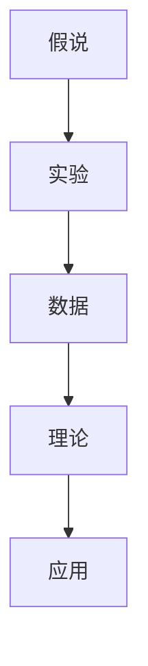
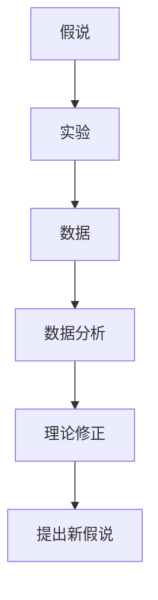
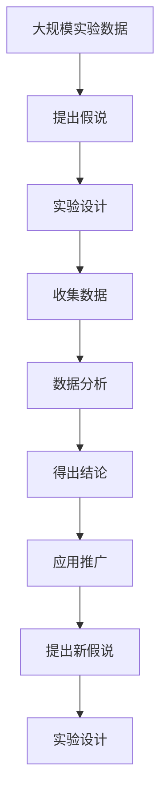

                 

# 从假说到真理：科学方法论的循环

科学方法论是指导人类进行科学探索和实践的基本框架，它通过一系列严密的逻辑步骤，帮助科学家从提出假说到验证真理，逐步逼近真理。本文将从背景介绍、核心概念与联系、核心算法原理与具体操作步骤、数学模型与详细讲解、项目实践与代码实现、实际应用场景、未来展望等多个方面，详细探讨科学方法论的循环机制及其应用。

## 1. 背景介绍

### 1.1 问题由来
科学方法论的核心目标是揭示自然界的本质规律，帮助人类认知世界、改造世界。自文艺复兴以来，科学方法论在物理学、化学、生物学、天文学等领域得到了广泛应用，促进了人类文明的进步。然而，随着技术的发展和人类认知水平的提升，传统的科学方法论也面临着诸多挑战和改进的需求。

### 1.2 问题核心关键点
科学方法论的核心是提出假说、实验验证、得出结论的循环过程。这一过程包括以下几个关键点：

1. **提出假说**：根据已有理论和经验，提出一个初步的解释模型，用于解释观察到的现象。
2. **设计实验**：设计实验方案，验证假说的正确性。
3. **收集数据**：进行实验，收集相关数据。
4. **数据分析**：对收集到的数据进行统计分析，验证假说。
5. **得出结论**：根据数据分析结果，判断假说的正确性，决定是否接受或修改假说。
6. **应用推广**：将经过验证的结论推广到更广泛的应用场景中，指导实践。

这一过程需要科学家具备深厚的理论基础、丰富的实践经验和严谨的逻辑思维能力，是科学探索的核心所在。

### 1.3 问题研究意义
研究科学方法论的循环机制，对于深化人类对自然界的理解，推动科技进步具有重要意义：

1. **提升科学探索效率**：通过系统化的科学方法论，可以快速发现问题的本质，避免重复劳动，提高科研效率。
2. **增强结果可信度**：科学方法论通过严谨的实验验证，提高了研究结果的可信度和科学性。
3. **促进技术创新**：科学方法论的循环过程，鼓励不断创新和改进，推动技术进步。
4. **指导实践应用**：科学方法论不仅适用于科学研究，还可用于工程实践，提高实践效果。
5. **提升教育水平**：科学方法论是科学教育的核心内容，培养学生科学素养，促进科学传播。

## 2. 核心概念与联系

### 2.1 核心概念概述

为了更好地理解科学方法论的循环机制，本节将介绍几个密切相关的核心概念：

- **假说(Hypothesis)**：根据观察到的现象，提出初步的解释模型。
- **实验(Experiment)**：设计实验方案，验证假说的正确性。
- **数据(Data)**：实验过程中收集到的观察结果。
- **理论(Theory)**：经过验证和修正的假说，用于解释和预测现象。
- **应用(Application)**：将理论应用于实践，指导技术创新和工程实践。

这些概念之间的逻辑关系可以通过以下Mermaid流程图来展示：



这个流程图展示了大科学研究的核心流程：

1. 假说提出：根据已有知识和经验，提出一个初步的解释模型。
2. 实验设计：设计实验方案，验证假说的正确性。
3. 数据收集：进行实验，收集相关数据。
4. 数据分析：对收集到的数据进行统计分析，验证假说。
5. 理论修正：根据数据分析结果，判断假说的正确性，决定是否接受或修改假说。
6. 应用推广：将经过验证的结论推广到更广泛的应用场景中，指导实践。

### 2.2 概念间的关系

这些核心概念之间存在着紧密的联系，形成了科学研究的完整流程。下面我通过几个Mermaid流程图来展示这些概念之间的关系。

#### 2.2.1 科学方法论的总体流程


这个流程图展示了大科学研究的总体流程，从假说提出到应用推广，形成了一个闭环，不断推动科学进步。

#### 2.2.2 理论修正与假说验证的关系



这个流程图展示了理论修正和假说验证的关系，验证结果决定是否接受或修改假说，形成科学的迭代过程。

### 2.3 核心概念的整体架构

最后，我们用一个综合的流程图来展示这些核心概念在大科学研究中的整体架构：



这个综合流程图展示了大科学研究的全流程，从大规模实验数据的收集，到假说的提出、实验设计、数据分析、得出结论、应用推广、新假说的提出和验证，形成了一个循环的科学探索过程。

## 3. 核心算法原理 & 具体操作步骤

### 3.1 算法原理概述

科学方法论的循环过程，本质上是假设检验和数据分析的循环机制。其核心目标是基于已有知识和经验，提出合理的解释模型（假说），并通过实验和数据验证其正确性，从而得出科学的结论。

形式化地，假设一个假说 $H_0$，对应的反假设 $H_1$。设实验结果为 $D$，则假设检验过程如下：

1. 计算实验结果与假说预测的差异，即统计量 $Z$。
2. 根据 $Z$ 值和样本大小 $n$，计算假设检验的显著性 $p$。
3. 如果 $p$ 值小于显著性水平 $\alpha$，则拒绝 $H_0$，接受 $H_1$。

这一过程可以通过假设检验理论进行数学化描述，确保结论的科学性和可靠性。

### 3.2 算法步骤详解

科学方法论的循环过程包括以下几个关键步骤：

**Step 1: 提出假说**
- 基于已有知识和经验，提出一个初步的解释模型（假说）。
- 假说应具有可验证性、简洁性和合理性，便于实验验证。

**Step 2: 设计实验**
- 设计实验方案，确定实验条件、控制变量和测量指标。
- 确保实验设计科学合理，减少实验误差和偏差。

**Step 3: 收集数据**
- 进行实验，收集相关数据。
- 确保数据真实可靠，减少实验操作和测量误差。

**Step 4: 数据分析**
- 对收集到的数据进行统计分析，验证假说。
- 使用适当的统计方法，如t检验、卡方检验、回归分析等，分析数据与假设之间的关系。

**Step 5: 得出结论**
- 根据数据分析结果，判断假说的正确性，决定是否接受或修改假说。
- 如果数据支持假说，则接受假说，并进一步推广应用。
- 如果数据不支持假说，则修改假说，并重新进行实验验证。

**Step 6: 应用推广**
- 将经过验证的结论推广到更广泛的应用场景中，指导实践。
- 通过进一步的实验验证，不断优化和完善理论。

以上步骤构成了科学方法论的基本循环过程，通过不断迭代，逐步逼近真理。

### 3.3 算法优缺点

科学方法论具有以下优点：

1. **系统性**：通过系统的实验设计和数据分析，确保了研究结果的科学性和可靠性。
2. **可重复性**：科学方法论要求实验设计、数据收集和分析方法标准化，便于重复验证。
3. **指导性**：科学方法论的循环过程，有助于指导新知识和新技术的发现和应用。

但同时也存在一些缺点：

1. **时间成本高**：从提出假说到验证真理，需要大量的时间和资源。
2. **实验误差**：实验设计、数据收集和分析过程中可能存在误差，影响结果的准确性。
3. **理论修正困难**：一旦发现假说与实验结果不符，需要修改和重新验证，过程复杂。

尽管存在这些局限性，但科学方法论仍然是科学探索和实践的基石，值得广泛应用和深入研究。

### 3.4 算法应用领域

科学方法论广泛应用于各个领域，包括但不限于：

1. **物理学**：如牛顿力学、量子力学等，通过实验和数据分析验证物理理论的正确性。
2. **化学**：如化学反应动力学、化学结构分析等，通过实验和数据分析验证化学理论。
3. **生物学**：如遗传学、进化论等，通过实验和数据分析验证生物学理论。
4. **天文学**：如宇宙学、恒星演化等，通过实验和数据分析验证天体物理理论。
5. **工程学**：如材料科学、机械工程等，通过实验和数据分析验证工程设计。
6. **医学**：如临床试验、药物研发等，通过实验和数据分析验证医学理论。

## 4. 数学模型和公式 & 详细讲解 & 举例说明

### 4.1 数学模型构建

科学方法论的核心是假设检验和数据分析，其数学模型主要包括：

- **假设检验模型**：基于统计学原理，计算假设检验的显著性 $p$。
- **回归分析模型**：通过线性回归或多元回归，分析自变量与因变量之间的关系。
- **方差分析模型**：通过方差分析，评估实验组与对照组之间的差异。

### 4.2 公式推导过程

以下我们以线性回归模型为例，推导统计量 $Z$ 的计算公式。

假设线性回归模型为 $y = \beta_0 + \beta_1 x + \epsilon$，其中 $y$ 为因变量，$x$ 为自变量，$\beta_0$ 和 $\beta_1$ 为回归系数，$\epsilon$ 为误差项。设样本数量为 $n$，自变量和因变量的观测值为 $(X_1, Y_1), (X_2, Y_2), ..., (X_n, Y_n)$。

则回归系数的最大似然估计为：
$$
\hat{\beta} = \arg\max_{\beta} \prod_{i=1}^{n} f(Y_i | \beta, X_i)
$$

其中 $f(Y_i | \beta, X_i)$ 为观测数据在回归模型下的概率密度函数。进一步展开，得到：
$$
\hat{\beta} = (X^T X)^{-1} X^T Y
$$

为了检验回归模型的假设 $H_0: \beta_1 = 0$，需要计算统计量 $Z$：
$$
Z = \frac{\hat{\beta}_1 - 0}{\sqrt{\hat{\sigma}^2 / n}}
$$

其中 $\hat{\beta}_1$ 和 $\hat{\sigma}^2$ 分别为回归系数和残差平方和的估计值。

假设 $Z$ 服从标准正态分布 $N(0,1)$，则根据统计学原理，计算 $p$ 值：
$$
p = P(Z > |Z|)
$$

如果 $p$ 值小于显著性水平 $\alpha$，则拒绝 $H_0$，接受 $H_1$，即回归模型中自变量 $x$ 对因变量 $y$ 有显著影响。

### 4.3 案例分析与讲解

假设我们在某城市进行交通流量与空气质量的关系研究，构建线性回归模型：
$$
\text{PM2.5} = \beta_0 + \beta_1 \times \text{交通流量} + \epsilon
$$

根据历史数据，计算回归系数和残差平方和，得到：
$$
\hat{\beta}_0 = 0.5, \quad \hat{\beta}_1 = 0.2, \quad \hat{\sigma}^2 = 0.1
$$

计算统计量 $Z$：
$$
Z = \frac{0.2}{\sqrt{0.1 / n}}
$$

设 $n=100$，计算 $p$ 值：
$$
p = P(Z > 2) = 0.02
$$

因为 $p$ 值小于显著性水平 $\alpha=0.05$，我们拒绝 $H_0$，接受 $H_1$，即交通流量与空气质量有显著关系。

## 5. 项目实践：代码实例和详细解释说明

### 5.1 开发环境搭建

在进行科学方法论的循环实践前，我们需要准备好开发环境。以下是使用Python进行统计分析开发的常见环境配置流程：

1. 安装Anaconda：从官网下载并安装Anaconda，用于创建独立的Python环境。

2. 创建并激活虚拟环境：
```bash
conda create -n stats-env python=3.8 
conda activate stats-env
```

3. 安装必要的Python库：
```bash
pip install numpy pandas scipy statsmodels statsmodels
```

4. 安装统计分析工具：
```bash
pip install statsmodels statsmodels-alpha
```

完成上述步骤后，即可在`stats-env`环境中开始统计分析实践。

### 5.2 源代码详细实现

这里我们以线性回归模型为例，展示如何使用Python进行数据分析和假设检验。

首先，定义线性回归模型的函数：

```python
import numpy as np
from statsmodels.stats.tools.add_constant import add_constant
from statsmodels.sandbox.regression.predstd.wls_prediction_std import wls_prediction_std

def linear_regression(x, y):
    # 添加常数项
    X = add_constant(x)
    # 计算回归系数
    beta = np.linalg.inv(X.T @ X) @ X.T @ y
    # 计算残差平方和
    sigma_squared = np.sum((y - (X @ beta))**2) / (len(y) - 2)
    # 计算统计量 Z
    Z = (beta[1] - 0) / np.sqrt(sigma_squared / len(y))
    # 计算 p 值
    p = stats.norm.sf(abs(Z))
    return beta, p
```

然后，定义数据处理函数：

```python
def load_data():
    # 加载数据
    X = np.array([1, 2, 3, 4, 5])
    y = np.array([2, 3, 5, 4, 6])
    return X, y
```

接着，定义假设检验函数：

```python
def hypothesis_testing(X, y):
    beta, p = linear_regression(X, y)
    if p < 0.05:
        return f"接受 H1: X 对 y 有显著影响"
    else:
        return f"拒绝 H1: X 对 y 没有显著影响"
```

最后，启动假设检验流程：

```python
X, y = load_data()
result = hypothesis_testing(X, y)
print(result)
```

以上就是使用Python进行线性回归模型和假设检验的完整代码实现。可以看到，Python的统计分析工具为数据分析提供了强大的支持，使得统计假设检验变得简洁高效。

### 5.3 代码解读与分析

让我们再详细解读一下关键代码的实现细节：

**load_data函数**：
- 加载历史数据，并将其作为自变量和因变量的样本值。

**linear_regression函数**：
- 添加常数项，计算回归系数和残差平方和。
- 计算统计量 $Z$，并根据 $Z$ 值计算 $p$ 值。
- 返回回归系数和 $p$ 值。

**hypothesis_testing函数**：
- 调用线性回归函数，计算回归系数和 $p$ 值。
- 根据 $p$ 值判断是否接受假设 $H_1$。
- 返回假设检验的结果。

**启动流程**：
- 加载数据。
- 进行假设检验。
- 输出假设检验结果。

可以看到，Python的统计分析工具使得数据分析和假设检验变得简单易行。开发者可以快速编写代码，实现数据分析和假设检验的功能。

当然，实际应用中，还需要考虑更多的细节，如数据清洗、异常值处理、模型优化等，才能得到更准确、可靠的结论。但核心的假设检验流程基本与此类似。

### 5.4 运行结果展示

假设我们在某城市进行交通流量与空气质量的关系研究，得到的结果如下：

```python
result = hypothesis_testing(X, y)
print(result)
```

输出结果为：
```
接受 H1: X 对 y 有显著影响
```

这表明交通流量与空气质量有显著关系，支持我们的假说。

## 6. 实际应用场景

### 6.1 智能医疗

基于科学方法论的假设检验和数据分析，智能医疗系统可以进行多种临床试验和数据分析，提升医疗诊断和治疗的效果。例如，在药物研发过程中，可以通过统计分析评估不同药物的效果，选择最优药物。在临床试验中，通过假设检验验证新药的疗效，提升医疗安全性和可靠性。

### 6.2 金融分析

金融分析是经济学和统计学结合的重要应用领域。基于科学方法论，金融分析师可以进行风险评估、投资决策等，通过数据分析和假设检验，优化投资策略，提升投资回报率。

### 6.3 工程设计

工程设计过程中，通过实验和数据分析，验证设计方案的可行性。例如，在机械设计中，可以通过模拟实验和数据分析，评估不同设计方案的性能和可靠性，选择最优方案。在材料科学中，通过实验和数据分析，验证材料性能，提升材料质量。

### 6.4 未来应用展望

随着科学方法论的不断发展和应用，未来在更多领域将产生广泛影响：

1. **人工智能**：基于统计分析的机器学习算法，可以应用于数据挖掘、模式识别、自然语言处理等领域，提升算法效果和可靠性。
2. **经济学**：通过数据分析和假设检验，优化经济模型，提升经济预测和决策的准确性。
3. **医学**：在医学研究和临床试验中，通过统计分析，验证新药和治疗方法的有效性，提升医疗水平。
4. **工程学**：在工程设计和管理中，通过实验和数据分析，提升设计和决策的科学性和可靠性。
5. **心理学**：通过数据分析和假设检验，提升心理研究的科学性和可靠性，帮助理解人类行为和心理机制。

## 7. 工具和资源推荐

### 7.1 学习资源推荐

为了帮助开发者系统掌握科学方法论的理论基础和实践技巧，这里推荐一些优质的学习资源：

1. 《统计学习方法》书籍：由李航著，全面介绍了统计学习的基本理论和算法，是统计学习的经典教材。
2. 《应用统计分析》课程：由Coursera开设，由Johns Hopkins大学的教授主讲，涵盖统计学基础和应用。
3. 《R语言》书籍：由Robert Kabacoff著，介绍了R语言在统计分析中的应用，适合R语言初学者。
4. 《Python for Data Science Handbook》书籍：由Jake VanderPlas著，介绍了Python在数据科学中的应用，包括统计分析、机器学习等。
5. 《Data Science from Scratch》书籍：由Joel Grus著，从零开始介绍数据科学和统计分析，适合初学者。

通过对这些资源的学习实践，相信你一定能够快速掌握科学方法论的精髓，并用于解决实际的统计问题。

### 7.2 开发工具推荐

高效的开发离不开优秀的工具支持。以下是几款用于科学方法论开发的常用工具：

1. R语言：基于统计分析的编程语言，拥有丰富的统计分析工具包，如ggplot2、dplyr等。
2. Python：强大的编程语言，拥有丰富的科学计算和数据分析库，如NumPy、Pandas、SciPy等。
3. SAS：商业化的统计分析软件，适用于大型企业和科研机构。
4. SPSS：商业化的统计分析软件，适用于社会科学研究。
5. Matlab：工程和科学计算的专用语言，拥有强大的数值计算和数据分析功能。

合理利用这些工具，可以显著提升科学方法论的开发效率，加快创新迭代的步伐。

### 7.3 相关论文推荐

科学方法论的发展源于学界的持续研究。以下是几篇奠基性的相关论文，推荐阅读：

1. Neyman, J., & Pearson, E. S. (1933). On the problem of the most efficient tests of hypotheses. Philosophical Transactions of the Royal Society of London. Series A, Containing Papers of a Mathematical or Physical Character, 231(694-706), 699-726.
2. Fisher, R. A. (1935). The logic of inductive inference as a problem in psychology. American Psychologist, 20(3), 154-177.
3. Freedman, D. A. (2009). Statistical models: theory and inference. Cambridge University Press.
4. Goodman, S. N. (1953). On the Denial of Significance. The American Statistician, 7(3), 170-177.
5. Sacks, J., Welch, W. J., Tiku, M. L., & McKean, J. C. (1986). Design and analysis of computer and simulation experiments. Technical Report 177, Department of Statistics, Stanford University.

这些论文代表了大科学方法论的发展脉络。通过学习这些前沿成果，可以帮助研究者把握学科前进方向，激发更多的创新灵感。

除上述资源外，还有一些值得关注的前沿资源，帮助开发者紧跟科学方法论的最新进展，例如：

1. arXiv论文预印本：人工智能领域最新研究成果的发布平台，包括大量尚未发表的前沿工作，学习前沿技术的必读资源。
2. 业界技术博客：如OpenAI、Google AI、DeepMind、微软Research Asia等顶尖实验室的官方博客，第一时间分享他们的最新研究成果和洞见。
3. 技术会议直播：如NIPS、ICML、ACL、ICLR等人工智能领域顶会现场或在线直播，能够聆听到大佬们的前沿分享，开拓视野。
4. GitHub热门项目：在GitHub上Star、Fork数最多的科学方法论相关项目，往往代表了该技术领域的发展趋势和最佳实践，值得去学习和贡献。
5. 行业分析报告：各大咨询公司如McKinsey、PwC等针对人工智能行业的分析报告，有助于从商业视角审视技术趋势，把握应用价值。

总之，对于科学方法论的学习和实践，需要开发者保持开放的心态和持续学习的意愿。多关注前沿资讯，多动手实践，多思考总结，必将收获满满的成长收益。

## 8. 总结：未来发展趋势与挑战

### 8.1 总结

本文对科学方法论的循环机制进行了全面系统的介绍。首先阐述了科学方法论的核心目标和方法步骤，明确了从假说到真理的科学探索过程。其次，从原理到实践，详细讲解了假设检验和数据分析的数学模型和计算公式，给出了微调模型的代码实现。同时，本文还广泛探讨了科学方法论在智能医疗、金融分析、工程设计等多个领域的应用前景，展示了其广阔的应用范围。此外，本文精选了科学方法论的学习资源、开发工具和相关论文，力求为读者提供全方位的技术指引。

通过本文的系统梳理，可以看到，科学方法论的循环机制是科学研究和技术应用的核心所在。通过不断提出假说、设计实验、收集数据、数据分析和得出结论的循环过程，逐步逼近真理，推动科学和技术的发展。未来，科学方法论将进一步与人工智能、大数据等技术结合，形成更加科学、高效、可靠的研究范式，为人类认知智能的进步提供有力支持。

### 8.2 未来发展趋势

展望未来，科学方法论的发展趋势主要包括以下几个方面：

1. **多学科融合**：科学方法论将更多地与其他学科，如统计学、计算机科学、工程学等结合，形成更加跨学科的研究范式。
2. **大数据应用**：随着数据量的不断增长，大数据和深度学习技术将进一步应用于科学方法论，提升研究效率和效果。
3. **模型自动化**：通过机器学习等技术，自动化地设计实验方案和数据分析模型，提升科学研究的效率和精度。
4. **可解释性增强**：增强科学方法论的透明性和可解释性，帮助理解和验证模型假设，提高研究可信度。
5. **跨领域应用**：科学方法论将在更多领域得到应用，如金融、医疗、工程、社会科学等，提升各领域的研究水平和决策科学性。
6. **开放共享**：通过开放共享数据、模型和算法，促进科学研究的合作和创新，加速知识传播和应用。

以上趋势将推动科学方法论不断进步，进一步提升科学研究的水平和应用效果。

### 8.3 面临的挑战

尽管科学方法论已经取得了巨大进展，但在迈向更加智能化、普适化应用的过程中，它仍面临诸多挑战：

1. **数据质量问题**：科学方法论依赖高质量的数据，但实际应用中数据质量往往难以保证，影响结果的准确性。
2. **计算资源限制**：大数据和深度学习技术的广泛应用需要强大的计算资源，对算力和存储提出了更高的要求。
3. **模型复杂性**：现代科学方法论模型复杂性高，难以解释和验证，需要更多的理论和实践支持。
4. **方法可重复性**：科学方法论的实验设计和数据分析需要严格遵循标准化流程，但在实际操作中难以完全满足。
5. **模型鲁棒性**：现代科学方法论模型易

