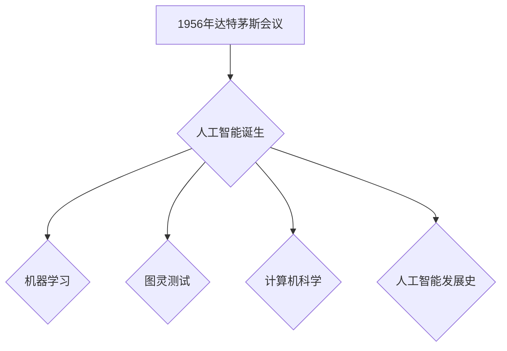

# 1956年达特茅斯会议的影响

> 关键词：达特茅斯会议，人工智能，机器学习，图灵测试，计算机科学，人工智能发展史

## 1. 背景介绍

1956年，一场具有划时代意义的会议在达特茅斯学院召开，这就是著名的“达特茅斯会议”。此次会议汇聚了包括约翰·麦卡锡（John McCarthy）、艾伦·图灵（Alan Turing）等在内的众多计算机科学领域的先驱人物，共同探讨人工智能的未来发展。会议的召开标志着人工智能（Artificial Intelligence, AI）这一领域的正式诞生，并对计算机科学的发展产生了深远的影响。

### 1.1 会议的由来

1955年夏季，约翰·麦卡锡在达特茅斯学院举办了一次研讨会，主题为“用机器模仿思维”。麦卡锡邀请了一些在计算机科学、数学、心理学等领域的知名学者参加，旨在探讨机器是否能够模拟人类智能，以及如何实现这一目标。随后，这一想法得到了更多学者的响应，最终决定在1956年夏季召开一次更大规模的会议，这就是达特茅斯会议。

### 1.2 会议的意义

达特茅斯会议具有以下重要意义：

- 标志着人工智能领域的正式诞生。
- 探讨了人工智能的核心问题，如机器学习、知识表示、推理、感知等。
- 推动了计算机科学、数学、心理学等学科之间的交叉融合。
- 预见了人工智能在未来几十年内的发展趋势。

## 2. 核心概念与联系

### 2.1 人工智能

人工智能是指使计算机系统能够模拟、延伸和扩展人类的智能活动，包括感知、推理、学习、理解、表达、创造等。人工智能的研究目标是实现智能机器，使它们能够像人类一样思考、学习和解决问题。

### 2.2 机器学习

机器学习是人工智能的一个重要分支，主要研究如何让计算机系统从数据中学习，并利用学习到的知识进行决策和预测。机器学习的方法主要包括监督学习、无监督学习、强化学习等。

### 2.3 图灵测试

图灵测试是由艾伦·图灵在1950年提出的，用于判断机器是否具有智能的一种测试方法。如果一台机器能够成功地模仿人类智能，使人类无法区分其与人类对话的区别，则认为该机器通过了图灵测试。

### 2.4 计算机科学

计算机科学是一门研究计算机及其应用的学科，包括算法、数据结构、编程语言、软件工程、人工智能等。

### 2.5 人工智能发展史

人工智能的发展历程可以分为以下几个阶段：

- 20世纪50年代：人工智能的诞生。
- 20世纪60-70年代：人工智能的蓬勃发展。
- 20世纪80-90年代：人工智能的低谷期。
- 21世纪初至今：人工智能的复兴。

Mermaid 流程图：



## 3. 核心算法原理 & 具体操作步骤

### 3.1 算法原理概述

达特茅斯会议期间，学者们提出了许多具有前瞻性的想法和算法，以下列举几个核心算法原理：

- 感知：通过传感器获取外部信息，如图像、声音等。
- 推理：根据已有的信息，推导出新的结论。
- 学习：从数据中学习知识，提高决策能力。
- 表达：将内部知识转化为人类可理解的语言。

### 3.2 算法步骤详解

以下是上述算法的基本操作步骤：

#### 感知：

1. 收集外部信息。
2. 对信息进行处理，如图像识别、语音识别等。
3. 将处理后的信息传递给其他模块。

#### 推理：

1. 根据已有的信息，建立知识库。
2. 从知识库中检索相关规则。
3. 根据规则进行推理，得出结论。

#### 学习：

1. 收集样本数据。
2. 使用机器学习方法对样本进行分类、聚类或回归等操作。
3. 将学习到的知识用于指导后续决策。

#### 表达：

1. 将内部知识转化为自然语言。
2. 将语言转化为人类可理解的形式。

### 3.3 算法优缺点

#### 感知：

优点：获取外部信息，为推理、学习等模块提供基础。
缺点：感知精度受限于传感器技术。

#### 推理：

优点：能够从已有知识推导出新结论。
缺点：推理能力受限于知识库和规则。

#### 学习：

优点：通过学习提高决策能力。
缺点：学习过程可能受到数据偏差和过拟合的影响。

#### 表达：

优点：将内部知识转化为人类可理解的形式。
缺点：表达效果受限于语言模型和知识库。

### 3.4 算法应用领域

上述算法在以下领域得到广泛应用：

- 计算机视觉：如图像识别、目标检测、图像分割等。
- 自然语言处理：如机器翻译、情感分析、文本分类等。
- 语音识别：如语音合成、语音识别、语音搜索等。

## 4. 数学模型和公式 & 详细讲解 & 举例说明

### 4.1 数学模型构建

以下列举几个人工智能领域的常见数学模型：

- 线性回归：用于预测连续值输出。
- 逻辑回归：用于预测离散值输出。
- 支持向量机：用于分类和回归任务。
- 神经网络：用于复杂的学习任务。

### 4.2 公式推导过程

以线性回归为例，其公式推导过程如下：

假设我们有一个线性回归模型 $f(x) = w_0 + w_1x_1 + w_2x_2 + ... + w_nx_n$，其中 $x_i$ 为输入特征，$w_i$ 为对应特征的权重，$w_0$ 为截距。

根据最小二乘法，最小化损失函数 $L = \sum_{i=1}^n (f(x_i) - y_i)^2$，得到如下公式：

$$
w_i = \frac{\sum_{i=1}^n (x_i - \bar{x})(y_i - \bar{y})}{\sum_{i=1}^n (x_i - \bar{x})^2}
$$

其中 $\bar{x}$ 和 $\bar{y}$ 分别为输入特征和输出值的均值。

### 4.3 案例分析与讲解

以下以机器翻译任务为例，介绍神经网络在人工智能中的应用。

#### 模型结构

机器翻译任务通常采用序列到序列（Sequence to Sequence, Seq2Seq）的神经网络模型。该模型由两部分组成：编码器（Encoder）和解码器（Decoder）。

- 编码器：将输入序列（源语言文本）编码成固定长度的向量表示。
- 解码器：将编码器输出的向量解码成输出序列（目标语言文本）。

#### 损失函数

机器翻译任务的损失函数通常采用交叉熵损失（Cross-Entropy Loss）。

#### 训练过程

1. 将源语言文本和目标语言文本分别编码成向量表示。
2. 使用编码器将源语言文本编码成向量。
3. 将编码器输出的向量输入解码器，生成目标语言文本。
4. 计算解码器输出的目标语言文本与真实目标文本之间的交叉熵损失。
5. 使用反向传播算法更新模型参数。

## 5. 项目实践：代码实例和详细解释说明

### 5.1 开发环境搭建

以下以Python为例，介绍如何搭建机器翻译项目的开发环境：

1. 安装Python：从官网下载并安装Python 3.7以上版本。
2. 安装PyTorch：从官网下载并安装PyTorch，版本需与Python版本兼容。
3. 安装其他依赖库：安装transformers、torchtext等库，用于处理文本数据和加载预训练模型。

### 5.2 源代码详细实现

以下以PyTorch和transformers库为基础，实现一个简单的机器翻译项目：

```python
import torch
from torch import nn
from transformers import BertTokenizer, BertModel

# 加载预训练模型和分词器
source_tokenizer = BertTokenizer.from_pretrained('bert-base-chinese')
target_tokenizer = BertTokenizer.from_pretrained('bert-base-uncased')

# 加载预训练模型
source_model = BertModel.from_pretrained('bert-base-chinese')
target_model = BertModel.from_pretrained('bert-base-uncased')

# 定义编码器-解码器模型
class Seq2Seq(nn.Module):
    def __init__(self, source_model, target_model):
        super(Seq2Seq, self).__init__()
        self.encoder = source_model
        self.decoder = target_model
        self.fc = nn.Linear(768, 512)  # 假设隐藏层维度为512

    def forward(self, source_inputs, target_inputs):
        source_embedding = self.encoder(source_inputs)[0]
        target_embedding = self.decoder(target_inputs)[0]
        target_embedding = torch.relu(self.fc(target_embedding))
        return target_embedding

# 实例化模型
model = Seq2Seq(source_model, target_model)

# 训练模型
# ...（此处省略训练代码）

# 使用模型进行翻译
# ...（此处省略翻译代码）
```

### 5.3 代码解读与分析

以上代码实现了以下功能：

1. 加载预训练的源语言和目标语言模型。
2. 定义编码器-解码器模型，将源语言文本编码成向量表示，再通过解码器生成目标语言文本。
3. 训练模型，使用反向传播算法更新模型参数。
4. 使用训练好的模型进行翻译。

## 6. 实际应用场景

### 6.1 机器翻译

机器翻译是人工智能领域最经典的任务之一，可以将一种语言的文本翻译成另一种语言。机器翻译技术已经广泛应用于跨语言交流、国际化业务、机器翻译服务等领域。

### 6.2 语音识别

语音识别技术可以将人类的语音信号转换为文本信息，广泛应用于语音助手、语音搜索、语音翻译、语音控制等场景。

### 6.3 图像识别

图像识别技术可以识别图像中的物体、场景、动作等，广泛应用于人脸识别、目标检测、图像分类、图像分割等场景。

### 6.4 自然语言处理

自然语言处理技术可以理解和处理自然语言文本，广泛应用于文本分类、情感分析、文本生成、机器翻译等场景。

## 7. 工具和资源推荐

### 7.1 学习资源推荐

- 《深度学习》
- 《Python编程：从入门到实践》
- 《机器学习实战》
- 《自然语言处理入门》

### 7.2 开发工具推荐

- PyTorch：开源深度学习框架
- TensorFlow：开源深度学习框架
- Keras：基于TensorFlow的深度学习库
- Transformers：开源NLP库

### 7.3 相关论文推荐

- “A Neural Probabilistic Language Model” by Michael Auli, Adam Conneau, and Chris Dyer
- “Attention Is All You Need” by Ashish Vaswani et al.
- “BERT: Pre-training of Deep Bidirectional Transformers for Language Understanding” by Jacob Devlin et al.

## 8. 总结：未来发展趋势与挑战

### 8.1 研究成果总结

达特茅斯会议标志着人工智能领域的正式诞生，会议期间提出的核心算法和概念对人工智能的发展产生了深远的影响。如今，人工智能已经取得了显著的进展，并在各个领域得到广泛应用。

### 8.2 未来发展趋势

未来人工智能的发展趋势包括：

- 人工智能与物理、生物、医学等领域的交叉融合。
- 人工智能技术的标准化和规范化。
- 人工智能在各个领域的广泛应用，如教育、医疗、工业、交通等。
- 人工智能技术的伦理和道德问题。

### 8.3 面临的挑战

人工智能发展面临的挑战包括：

- 数据质量和隐私保护。
- 模型可解释性和可靠性。
- 人工智能技术的伦理和道德问题。
- 人工智能与人类的关系。

### 8.4 研究展望

未来人工智能研究需要关注以下方向：

- 深度学习的可解释性和可靠性。
- 人工智能的伦理和道德问题。
- 人工智能与人类的关系。
- 人工智能在各个领域的应用。

## 9. 附录：常见问题与解答

**Q1：什么是人工智能？**

A：人工智能是指使计算机系统能够模拟、延伸和扩展人类的智能活动，包括感知、推理、学习、理解、表达、创造等。

**Q2：什么是机器学习？**

A：机器学习是人工智能的一个重要分支，主要研究如何让计算机系统从数据中学习，并利用学习到的知识进行决策和预测。

**Q3：什么是图灵测试？**

A：图灵测试是由艾伦·图灵在1950年提出的，用于判断机器是否具有智能的一种测试方法。

**Q4：人工智能有哪些应用？**

A：人工智能的应用领域非常广泛，包括机器翻译、语音识别、图像识别、自然语言处理等。

**Q5：人工智能的发展前景如何？**

A：人工智能具有广阔的发展前景，将在各个领域得到广泛应用，并对人类社会产生深远的影响。

---

作者：禅与计算机程序设计艺术 / Zen and the Art of Computer Programming