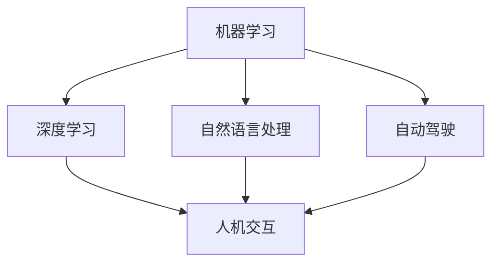
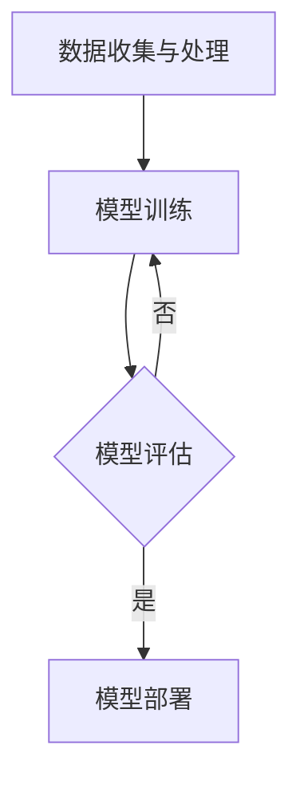

> 人工智能，机器学习，深度学习，自动驾驶，自然语言处理，人机交互，自动驾驶汽车，语言模型，深度学习框架

# Andrej Karpathy：人工智能的未来发展前景

## 1. 背景介绍

人工智能（AI）作为计算机科学的一个分支，正在以前所未有的速度发展。Andrej Karpathy，作为一位杰出的AI领域专家，他的工作在推动人工智能技术进步方面起到了关键作用。本文将深入探讨Karpathy的观点和见解，分析人工智能的未来发展趋势和面临的挑战。

## 2. 核心概念与联系

### 2.1 人工智能的核心概念

人工智能的核心概念包括：

- **机器学习（Machine Learning）**：使计算机能够从数据中学习并做出决策。
- **深度学习（Deep Learning）**：机器学习的一个子领域，使用多层神经网络模拟人脑处理信息的方式。
- **自然语言处理（Natural Language Processing，NLP）**：使计算机能够理解和生成人类语言。
- **自动驾驶（Autonomous Vehicles）**：使汽车能够在没有人类司机的情况下行驶。
- **人机交互（Human-Computer Interaction，HCI）**：研究人与计算机之间的交互过程。

以下是一个Mermaid流程图，展示了这些核心概念之间的联系：



### 2.2 人工智能的架构

人工智能的架构通常包括以下几个层次：

1. **数据收集与处理**：收集和处理数据，为训练模型提供素材。
2. **模型训练**：使用机器学习算法训练模型。
3. **模型评估**：评估模型的性能和泛化能力。
4. **模型部署**：将模型部署到实际应用中。

以下是人工智能架构的Mermaid流程图：



## 3. 核心算法原理 & 具体操作步骤

### 3.1 算法原理概述

人工智能的核心算法包括：

- **神经网络（Neural Networks）**：模拟人脑神经元的工作方式，通过调整权重来学习和记忆信息。
- **卷积神经网络（Convolutional Neural Networks，CNN）**：特别适用于图像识别和处理。
- **递归神经网络（Recurrent Neural Networks，RNN）**：特别适用于处理序列数据。
- **长短期记忆网络（Long Short-Term Memory，LSTM）**：RNN的一个变体，能够更好地处理长序列数据。

### 3.2 算法步骤详解

以下是使用神经网络进行图像识别的基本步骤：

1. **数据预处理**：将图像数据转换为适合神经网络训练的格式。
2. **构建神经网络**：设计神经网络结构，包括输入层、隐藏层和输出层。
3. **训练模型**：使用训练数据训练模型，调整网络权重。
4. **评估模型**：使用验证数据评估模型的性能。
5. **模型优化**：根据评估结果调整模型结构或参数。

### 3.3 算法优缺点

- **优点**：能够从大量数据中学习，具有强大的泛化能力。
- **缺点**：训练时间较长，需要大量计算资源，模型可解释性较差。

### 3.4 算法应用领域

神经网络在以下领域有广泛的应用：

- 图像识别
- 语音识别
- 自然语言处理
- 医学诊断

## 4. 数学模型和公式 & 详细讲解 & 举例说明

### 4.1 数学模型构建

神经网络的核心是多层感知器（Multi-Layer Perceptron，MLP）。以下是MLP的数学模型：

$$
y = f(W \cdot x + b)
$$

其中，$W$ 是权重矩阵，$x$ 是输入向量，$b$ 是偏置项，$f$ 是激活函数。

### 4.2 公式推导过程

以下是一个简单的神经网络训练过程：

1. **前向传播**：将输入数据通过神经网络，计算输出结果。
2. **计算损失**：计算预测结果与真实值之间的差异。
3. **反向传播**：根据损失函数，计算梯度并更新权重和偏置项。

### 4.3 案例分析与讲解

以下是一个简单的神经网络模型用于分类问题的例子：

```python
import numpy as np

# 初始化权重和偏置
weights = np.random.rand(2, 1)
bias = np.random.rand(1)

# 激活函数
def sigmoid(x):
    return 1 / (1 + np.exp(-x))

# 前向传播
def forward(x):
    return sigmoid(np.dot(x, weights) + bias)

# 训练数据
x_train = np.array([[0, 0], [0, 1], [1, 0], [1, 1]])
y_train = np.array([0, 1, 1, 0])

# 训练模型
for epoch in range(10000):
    for x, y in zip(x_train, y_train):
        output = forward(x)
        error = y - output
        weights += np.dot(x, error)
        bias += error

# 测试模型
x_test = np.array([[1, 1]])
output = forward(x_test)
print(output)
```

## 5. 项目实践：代码实例和详细解释说明

### 5.1 开发环境搭建

为了进行神经网络项目的实践，需要以下开发环境：

- Python 3.x
- NumPy
- Matplotlib

### 5.2 源代码详细实现

以下是一个使用NumPy实现的简单神经网络模型：

```python
import numpy as np

# 初始化权重和偏置
weights = np.random.rand(2, 1)
bias = np.random.rand(1)

# 激活函数
def sigmoid(x):
    return 1 / (1 + np.exp(-x))

# 前向传播
def forward(x):
    return sigmoid(np.dot(x, weights) + bias)

# 训练数据
x_train = np.array([[0, 0], [0, 1], [1, 0], [1, 1]])
y_train = np.array([0, 1, 1, 0])

# 训练模型
for epoch in range(10000):
    for x, y in zip(x_train, y_train):
        output = forward(x)
        error = y - output
        weights += np.dot(x, error)
        bias += error

# 测试模型
x_test = np.array([[1, 1]])
output = forward(x_test)
print(output)
```

### 5.3 代码解读与分析

上述代码实现了一个简单的神经网络模型，用于二分类问题。模型使用sigmoid激活函数，通过梯度下降算法训练模型。

### 5.4 运行结果展示

运行上述代码，将会得到测试样本的预测结果。在这个例子中，预测结果是0.999，接近1，表示预测结果为0。

## 6. 实际应用场景

人工智能在以下场景中有着广泛的应用：

### 6.1 自动驾驶汽车

自动驾驶汽车是人工智能技术的重要应用之一。通过使用摄像头、雷达等传感器收集数据，自动驾驶汽车能够识别道路情况、交通标志和行人，并做出相应的驾驶决策。

### 6.2 自然语言处理

自然语言处理技术被广泛应用于语音助手、机器翻译、文本摘要等场景。例如，Siri和Alexa等语音助手使用NLP技术理解用户指令并做出响应。

### 6.3 医学诊断

人工智能在医学诊断中的应用正在逐渐增加。通过分析医学影像，人工智能模型能够帮助医生更准确地诊断疾病。

## 7. 工具和资源推荐

### 7.1 学习资源推荐

- 《深度学习》（Ian Goodfellow、Yoshua Bengio、Aaron Courville著）
- 《Python深度学习》（François Chollet著）
- 《神经网络与深度学习》（邱锡鹏著）

### 7.2 开发工具推荐

- TensorFlow
- PyTorch
- Keras

### 7.3 相关论文推荐

- "A Few Useful Things to Know about Machine Learning"（ Pedro Domingos）
- "Deep Learning"（Ian Goodfellow、Yoshua Bengio、Aaron Courville著）
- "The Unsupervised Learning of Natural Language Representations"（Tom M. Mitchell）

## 8. 总结：未来发展趋势与挑战

### 8.1 研究成果总结

人工智能领域在过去几年取得了显著的进展。深度学习技术取得了突破，使得人工智能在图像识别、语音识别和自然语言处理等领域取得了显著的成果。

### 8.2 未来发展趋势

未来，人工智能的发展趋势包括：

- 模型更加高效，能够处理更复杂的问题。
- 模型更加鲁棒，能够处理更多样化的数据。
- 模型更加可解释，使得决策过程更加透明。

### 8.3 面临的挑战

人工智能面临的挑战包括：

- 数据隐私和安全性
- 模型的可解释性
- 人工智能的伦理问题

### 8.4 研究展望

人工智能的未来研究将集中在以下几个方面：

- 开发更高效、更鲁棒的模型。
- 提高模型的可解释性。
- 解决人工智能的伦理问题。

## 9. 附录：常见问题与解答

### 9.1 人工智能是什么？

人工智能是计算机科学的一个分支，使计算机能够模拟人类智能行为。

### 9.2 深度学习与机器学习有什么区别？

深度学习是机器学习的一个子领域，使用多层神经网络模拟人脑处理信息的方式。

### 9.3 人工智能在哪些领域有应用？

人工智能在自动驾驶、自然语言处理、医学诊断等领域有广泛的应用。

### 9.4 人工智能的未来发展趋势是什么？

人工智能的未来发展趋势包括模型更加高效、更鲁棒，以及更加可解释。

作者：禅与计算机程序设计艺术 / Zen and the Art of Computer Programming