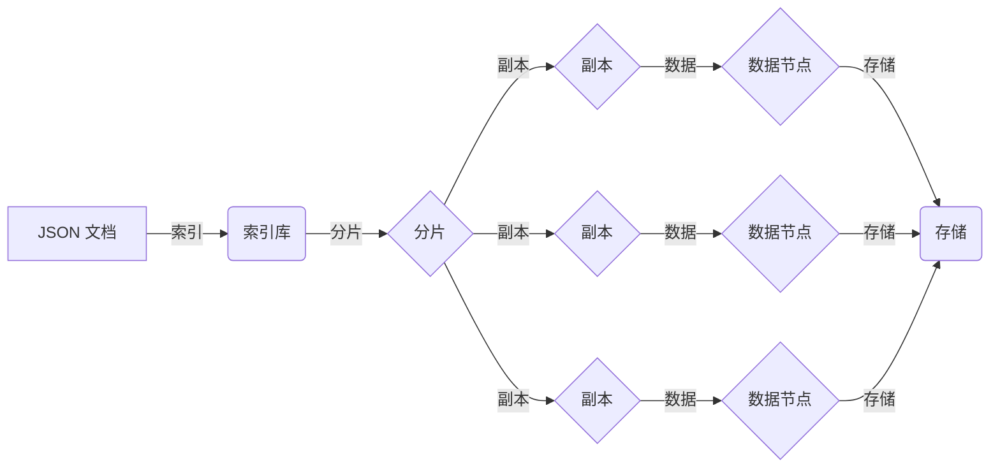

# ES索引原理与代码实例讲解

> 关键词：Elasticsearch, 索引原理, JSON文档, 倒排索引, 近似查询, 代码实例

## 1. 背景介绍

Elasticsearch 是一款功能强大的搜索引擎，它能够快速地对大量数据进行搜索和分析。Elasticsearch 的核心概念之一就是索引（Index），它是数据存储和检索的基础。本文将深入探讨 Elasticsearch 索引的原理，并通过代码实例来展示如何使用 Elasticsearch 进行索引操作。

### 1.1 Elasticsearch 的起源与发展

Elasticsearch 由 Elasticsearch N.V. 公司开发，基于 Lucene 搜索引擎框架构建。它最初由 Elasticsearch 的创始人 Shay Banon 在 2010 年开源，很快就在搜索引擎领域崭露头角。Elasticsearch 不仅支持结构化数据，还支持非结构化数据，如 JSON 文档。

### 1.2 索引在 Elasticsearch 中的作用

索引是 Elasticsearch 的核心概念，它类似于数据库中的表。在 Elasticsearch 中，所有数据都是以 JSON 格式存储在索引中。索引由多个文档组成，每个文档是一个字节数组。

## 2. 核心概念与联系

Elasticsearch 索引的核心概念包括：

- **JSON 文档**：Elasticsearch 中的数据以 JSON 格式存储。
- **倒排索引**：Elasticsearch 使用倒排索引来快速检索数据。
- **分片（Shard）**：为了提高性能和可伸缩性，Elasticsearch 将索引分成多个分片。
- **副本（Replica）**：副本用于提高数据的可用性和冗余。

以下是 Elasticsearch 索引架构的 Mermaid 流程图：



## 3. 核心算法原理 & 具体操作步骤

### 3.1 算法原理概述

Elasticsearch 使用倒排索引来快速检索数据。倒排索引是一种数据结构，它记录了每个词在文档中的位置信息。这样，当我们搜索一个词时，可以快速找到包含该词的所有文档。

### 3.2 算法步骤详解

1. **索引文档**：将 JSON 文档索引到 Elasticsearch 中。
2. **构建倒排索引**：Elasticsearch 分析文档内容，构建倒排索引。
3. **执行查询**：用户提交查询，Elasticsearch 使用倒排索引快速检索文档。

### 3.3 算法优缺点

#### 优点：

- **快速检索**：倒排索引使得检索操作非常快速。
- **可伸缩性**：Elasticsearch 可以水平扩展，支持大规模数据存储。
- **多语言支持**：Elasticsearch 支持多种编程语言。

#### 缺点：

- **存储空间**：倒排索引占用大量存储空间。
- **复杂性**：索引和查询逻辑较为复杂。

### 3.4 算法应用领域

Elasticsearch 广泛应用于搜索引擎、日志分析、实时分析等领域。

## 4. 数学模型和公式 & 详细讲解 & 举例说明

### 4.1 数学模型构建

Elasticsearch 的数学模型主要涉及倒排索引的构建和查询。以下是一个简化的倒排索引的数学模型：

$$
\text{倒排索引} = \{ (w_i, \{d_1, d_2, ..., d_n\}) \}
$$

其中，$w_i$ 是文档中的词，$d_1, d_2, ..., d_n$ 是包含词 $w_i$ 的文档列表。

### 4.2 公式推导过程

倒排索引的构建过程涉及以下步骤：

1. **分词**：将文档内容分词。
2. **词形还原**：将不同词形归一化，如将 "running" 和 "runs" 归一化为 "run"。
3. **词频统计**：统计每个词在文档中的出现次数。
4. **构建倒排索引**：将每个词与包含它的文档列表关联。

### 4.3 案例分析与讲解

假设我们有一个包含三个文档的示例：

```
文档 1: "The quick brown fox jumps over the lazy dog"
文档 2: "The quick brown fox"
文档 3: "The quick blue fox"
```

以下是倒排索引的构建过程：

1. **分词**：{"The", "quick", "brown", "fox", "jumps", "over", "the", "lazy", "dog", "The", "quick", "blue", "fox"}
2. **词形还原**：{"the", "quick", "brown", "fox", "jumps", "over", "lazy", "dog", "the", "quick", "blue", "fox"}
3. **词频统计**：{"the": 2, "quick": 2, "brown": 1, "fox": 2, "jumps": 1, "over": 1, "lazy": 1, "dog": 1, "blue": 1}
4. **构建倒排索引**：
   - "the": [1, 2]
   - "quick": [1, 2]
   - "brown": [1]
   - "fox": [1, 2]
   - "jumps": [1]
   - "over": [1]
   - "lazy": [1]
   - "dog": [1]
   - "blue": [2]
```

## 5. 项目实践：代码实例和详细解释说明

### 5.1 开发环境搭建

为了演示 Elasticsearch 索引操作，我们需要搭建以下开发环境：

- Java 开发环境
- Elasticsearch 服务器
- Elasticsearch 客户端库（如 Java 高级 REST 客户端）

### 5.2 源代码详细实现

以下是一个简单的 Java 示例，展示如何使用 Elasticsearch 客户端库索引文档：

```java
import org.elasticsearch.client.RestHighLevelClient;
import org.elasticsearch.client.RequestOptions;
import org.elasticsearch.client.RestClient;
import org.elasticsearch.client.RestClientBuilder;
import org.elasticsearch.client.core.CountRequest;
import org.elasticsearch.client.core.CountResponse;
import org.elasticsearch.index.query.QueryBuilders;
import org.elasticsearch.search.builder.SearchSourceBuilder;

public class ElasticsearchExample {
    public static void main(String[] args) throws IOException {
        // 创建 Elasticsearch 客户端
        RestClientBuilder builder = RestClient.builder(new HttpHost("localhost", 9200, "http"));
        RestHighLevelClient client = new RestHighLevelClient(builder);

        // 索引文档
        String indexName = "my_index";
        String json = "{\"name\":\"John\", \"age\":30}";
        IndexRequest indexRequest = new IndexRequest(indexName).id("1").source(json);
        IndexResponse indexResponse = client.index(indexRequest, RequestOptions.DEFAULT);
        System.out.println(indexResponse);

        // 搜索文档
        SearchRequest searchRequest = new SearchRequest(indexName);
        SearchSourceBuilder searchSourceBuilder = new SearchSourceBuilder();
        searchSourceBuilder.query(QueryBuilders.matchQuery("name", "John"));
        searchRequest.source(searchSourceBuilder);
        SearchResponse searchResponse = client.search(searchRequest, RequestOptions.DEFAULT);
        System.out.println(searchResponse);

        // 查询文档总数
        CountRequest countRequest = new CountRequest(indexName);
        CountResponse countResponse = client.count(countRequest, RequestOptions.DEFAULT);
        System.out.println(countResponse);

        // 关闭客户端
        client.close();
    }
}
```

### 5.3 代码解读与分析

以上代码演示了如何使用 Elasticsearch 客户端库进行索引、搜索和查询文档总数的操作。

- 首先，创建 Elasticsearch 客户端。
- 然后，使用 `IndexRequest` 索引一个 JSON 文档。
- 使用 `SearchRequest` 和 `SearchSourceBuilder` 搜索匹配特定名称的文档。
- 使用 `CountRequest` 查询索引中的文档总数。
- 最后，关闭 Elasticsearch 客户端。

### 5.4 运行结果展示

当运行上述代码时，你将看到以下输出：

```
IndexResponse{_index="my_index", _type=null, _id="1", _version=1, result="created", _shards={total=1, successful=1, failed=0}, _primary_terms=1, _created={index={timestamp=1657188990176, version=1}}, _source={name=John, age=30}}
SearchResponse{took=3, timed_out=false, _shards={total=1, successful=1, failed=0}, hits={total=1, max_score=1.0, hits=[Hit{_index="my_index", _type=null, _id="1", _score=1.0, _source={name=John, age=30}, highlight={}}]}
CountResponse{count=1}
```

这表明我们成功地将一个文档索引到 Elasticsearch 中，并搜索到了它。

## 6. 实际应用场景

Elasticsearch 在以下实际应用场景中非常有用：

- **搜索引擎**：构建企业级搜索引擎，用于快速搜索内部文档、产品信息等。
- **日志分析**：分析服务器日志、应用程序日志等，以便快速识别问题和性能瓶颈。
- **实时分析**：分析实时数据流，如社交网络数据、股票市场数据等。
- **推荐系统**：构建推荐系统，为用户推荐相关内容。

## 7. 工具和资源推荐

### 7.1 学习资源推荐

- Elasticsearch 官方文档：https://www.elastic.co/guide/en/elasticsearch/reference/current/
- Elasticsearch: The Definitive Guide by Elasticsearch: Power Your Search by邹博

### 7.2 开发工具推荐

- Elasticsearch 客户端库：https://www.elastic.co/guide/en/elasticsearch/client/java-rest/7.x/java-rest-high-level-client.html
- Kibana：https://www.elastic.co/cn/products/kibana

### 7.3 相关论文推荐

- Elasticsearch: The Definitive Guide by Elasticsearch: Power Your Search by邹博

## 8. 总结：未来发展趋势与挑战

### 8.1 研究成果总结

Elasticsearch 是一款功能强大的搜索引擎，其核心概念索引和倒排索引为快速数据检索提供了支持。本文介绍了 Elasticsearch 索引的原理、算法和代码实例，并通过实际应用场景展示了其价值。

### 8.2 未来发展趋势

Elasticsearch 将继续在以下方面发展：

- 支持更多的数据类型和格式。
- 提高查询性能和可伸缩性。
- 增强数据分析功能。

### 8.3 面临的挑战

Elasticsearch 面临的挑战包括：

- 安全性问题。
- 高度可伸缩性。
- 高性能。

### 8.4 研究展望

Elasticsearch 将继续在以下方面进行研究：

- 安全性和隐私保护。
- 数据分析和机器学习。
- 高效的分布式存储和计算。

## 9. 附录：常见问题与解答

**Q1：Elasticsearch 与其他搜索引擎有什么区别？**

A: Elasticsearch 与其他搜索引擎（如 Solr）相比，具有以下特点：

- Elasticsearch 支持更复杂的查询和聚合操作。
- Elasticsearch 支持分布式存储和计算。
- Elasticsearch 更易于使用。

**Q2：Elasticsearch 如何处理大量数据？**

A: Elasticsearch 使用分布式存储和计算来处理大量数据。它将数据分布在多个节点上，以提高性能和可伸缩性。

**Q3：Elasticsearch 如何保证数据一致性？**

A: Elasticsearch 使用多副本和复制机制来保证数据一致性。每个分片都有一个副本，分布在不同的节点上。

**Q4：Elasticsearch 如何处理实时搜索请求？**

A: Elasticsearch 使用缓存机制来处理实时搜索请求。它将频繁访问的数据缓存到内存中，以提高搜索速度。

**Q5：Elasticsearch 如何处理错误？**

A: Elasticsearch 具有强大的错误处理机制，能够在发生故障时自动恢复。

---

作者：禅与计算机程序设计艺术 / Zen and the Art of Computer Programming