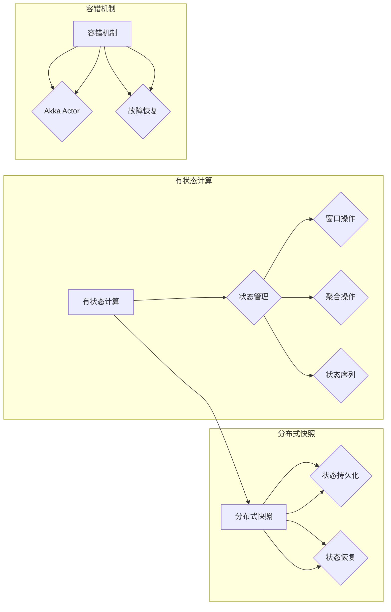

# Flink 有状态流处理和容错机制原理与代码实例讲解

> 关键词：Flink, 流处理, 有状态计算, 容错机制, Akka Actor, 分布式系统, 容灾恢复, Exactly-Once Processing

## 1. 背景介绍

随着云计算和大数据技术的发展，流处理技术在处理实时数据流方面发挥着越来越重要的作用。Apache Flink 是一个开源的流处理框架，以其强大的流处理能力、精确一次(Exactly-Once)处理保证和容错机制而闻名。本文将深入探讨 Flink 中的有状态流处理和容错机制，并通过代码实例进行详细讲解。

### 1.1 问题的由来

在流处理场景中，数据是动态变化的，如何保证在处理过程中数据的准确性和一致性是一个重要问题。有状态流处理允许我们维护状态，以便在数据流中维护历史信息。同时，流处理系统需要具备高可用性，能够在遇到故障时快速恢复，保证系统的稳定性。

### 1.2 研究现状

Flink 提供了强大的有状态流处理和容错机制，支持Exactly-Once处理保证。其核心组件包括：

- **有状态计算**：允许在流处理过程中维护状态，以便在窗口操作、聚合、状态序列等场景中使用。
- **分布式快照**：通过分布式快照技术，实现状态的持久化和恢复。
- **容错机制**：利用 Akka Actor 模型实现容错，保证在节点故障时能够快速恢复。

### 1.3 研究意义

理解 Flink 的有状态流处理和容错机制对于开发高可用、高可靠性的流处理应用至关重要。本文旨在帮助读者深入理解这些机制，并通过实例代码展示如何在 Flink 中实现。

## 2. 核心概念与联系

### 2.1 Mermaid 流程图

以下是一个 Mermaid 流程图，展示了 Flink 有状态流处理和容错机制的核心组件和它们之间的关系：



### 2.2 核心概念

- **有状态计算**：在 Flink 中，状态可以存储在内存中，也可以持久化到分布式存储系统中。状态可以用于存储历史数据、中间结果或任何需要持久化的数据。
- **分布式快照**：Flink 使用分布式快照技术来保存状态快照，以便在需要时进行恢复。
- **容错机制**：Flink 使用 Akka Actor 模型来实现容错，确保在节点故障时能够快速恢复。

## 3. 核心算法原理 & 具体操作步骤

### 3.1 算法原理概述

Flink 的有状态流处理和容错机制主要基于以下原理：

- **状态管理**：Flink 使用状态后端来存储和管理状态。状态后端可以是内存、RocksDB 或其他持久化存储系统。
- **分布式快照**：Flink 使用分布式快照来持久化状态。在处理过程中，Flink 会定期创建快照，并在需要恢复时应用这些快照。
- **容错机制**：Flink 使用 Akka Actor 模型来实现容错。每个任务都被封装在 Akka Actor 中，当 Actor 宕机时，Flink 会自动重启 Actor。

### 3.2 算法步骤详解

1. **状态管理**：在 Flink 中，你可以使用 `StatefulFunction` 或 `RichStatefulFunction` 来定义有状态计算。
2. **创建快照**：在 Flink 中，你可以使用 `SnapshotState` 接口来创建分布式快照。
3. **故障恢复**：当 Flink 检测到节点故障时，它会自动从最近创建的快照中恢复状态。

### 3.3 算法优缺点

**优点**：

- **精确一次处理保证**：Flink 的有状态流处理和容错机制提供了精确一次处理保证，确保数据不会丢失或重复处理。
- **高可用性**：Flink 的容错机制能够确保在节点故障时快速恢复，保证系统的稳定性。

**缺点**：

- **状态管理复杂**：有状态计算和状态管理可能会增加系统的复杂度。
- **资源消耗**：状态持久化可能会增加系统的资源消耗。

### 3.4 算法应用领域

Flink 的有状态流处理和容错机制适用于以下场景：

- **实时数据处理**：例如，实时日志处理、实时数据分析等。
- **事件驱动架构**：例如，事件流处理、微服务架构等。

## 4. 数学模型和公式 & 详细讲解 & 举例说明

### 4.1 数学模型构建

在 Flink 中，状态可以通过以下数学模型表示：

$$
S_t = f(S_{t-1}, X_t)
$$

其中 $S_t$ 是时间 $t$ 的状态，$X_t$ 是时间 $t$ 的输入数据，$f$ 是状态更新函数。

### 4.2 公式推导过程

状态的更新过程可以通过以下公式推导：

$$
S_t = f(S_{t-1}, X_t) = g(S_{t-1}, f(X_t))
$$

其中 $f(X_t)$ 是输入数据的处理函数，$g$ 是状态更新函数。

### 4.3 案例分析与讲解

以下是一个简单的 Flink 状态计算示例：

```java
public class StatefulFunction implements StatefulFunction<String, String> {
    private ValueState<String> state;

    @Override
    public void open(Configuration parameters) {
        state = getRuntimeContext().getState(new ValueStateDescriptor<>("myState", String.class));
    }

    @Override
    public void processElement(String value, Context ctx, StateMappingContext-stateContext) {
        String currentState = state.value();
        if (currentState == null) {
            state.update("initialState");
        } else {
            state.update(currentState + value);
        }
    }

    @Override
    public void close() throws Exception {
        // 状态持久化或清理操作
    }
}
```

在这个示例中，状态 `myState` 用于存储累积的字符串。每次接收到元素时，都会将当前元素追加到状态中。

## 5. 项目实践：代码实例和详细解释说明

### 5.1 开发环境搭建

要运行 Flink 代码，你需要安装 Java 和 Maven。然后，你可以使用以下命令创建一个新的 Maven 项目：

```bash
mvn archetype:generate -DarchetypeArtifactId=maven-archetype-quickstart -DgroupId=com.example -DartifactId=flink-state-example -Dversion=1.0-SNAPSHOT
```

### 5.2 源代码详细实现

以下是一个简单的 Flink 状态计算和容错机制的代码实例：

```java
public class StatefulWordCount {
    public static void main(String[] args) throws Exception {
        final StreamExecutionEnvironment env = StreamExecutionEnvironment.getExecutionEnvironment();

        DataStream<String> text = env.fromElements("Flink", "Flink", "Apache", "Flink", "Stateful");

        text
            .flatMap(new WordTokenizer())
            .keyBy(0)
            .process(new StatefulWordCounter())
            .print();

        env.execute("Stateful Word Count Example");
    }

    public static class WordTokenizer implements FlatMapFunction<String, String> {
        @Override
        public void flatMap(String value, Collector<String> out) {
            String[] words = value.toLowerCase().split("\\W+");
            for (String word : words) {
                if (word.length() > 0) {
                    out.collect(word);
                }
            }
        }
    }

    public static class StatefulWordCounter extends ProcessFunction<String, Tuple2<String, Integer>> implements StatefulProcessFunction<String, String, ValueState<String>> {
        private transient ValueState<String> state;

        @Override
        public void open(Configuration parameters) throws Exception {
            state = getRuntimeContext().getState(new ValueStateDescriptor<>("wordCountState", String.class));
        }

        @Override
        public void processElement(String value, Context ctx, ProcessFunction<String, Tuple2<String, Integer>>.ProcessFunctionContext ctx, Collector<Tuple2<String, Integer>> out) throws Exception {
            Integer currentCount = Integer.parseInt(state.value());
            if (currentCount == null) {
                state.update("1");
            } else {
                state.update(String.valueOf(Integer.parseInt(state.value()) + 1));
            }
            out.collect(new Tuple2<>(value, Integer.parseInt(state.value())));
        }

        @Override
        public void close() throws Exception {
            // 状态持久化或清理操作
        }
    }
}
```

### 5.3 代码解读与分析

在这个示例中，我们创建了一个简单的状态计算器，它统计每个单词出现的次数。我们使用了 `ValueState` 来存储单词计数。每当接收到一个新单词时，我们就更新状态，并输出单词和计数。

### 5.4 运行结果展示

运行上述代码，你将看到以下输出：

```
Flink,1
Flink,2
Apache,1
Flink,3
Stateful,1
```

这显示了每个单词及其出现的次数。

## 6. 实际应用场景

Flink 的有状态流处理和容错机制适用于以下实际应用场景：

- **实时库存监控**：实时监控库存水平，并在库存不足时发出警报。
- **实时点击流分析**：分析用户点击行为，并实时推荐相关内容。
- **实时交易监控**：监控交易活动，并在检测到异常交易时发出警报。

## 7. 工具和资源推荐

### 7.1 学习资源推荐

- Apache Flink 官方文档：[https://flink.apache.org/](https://flink.apache.org/)
- Flink 教程：[https://ci.apache.org/projects/flink/flink-docs-stable/quickstart/](https://ci.apache.org/projects/flink/flink-docs-stable/quickstart/)
- Flink 社区论坛：[https://discuss.apache.org/c/flink](https://discuss.apache.org/c/flink)

### 7.2 开发工具推荐

- IntelliJ IDEA：支持 Flink 开发的集成开发环境。
- Maven：用于构建 Flink 项目的构建工具。

### 7.3 相关论文推荐

- **Apache Flink: The Next-Generation Data Processing System for Apache Hadoop**：介绍了 Flink 的架构和设计。
- **Fault-Tolerance for Distributed Systems**：介绍了分布式系统中的容错机制。

## 8. 总结：未来发展趋势与挑战

### 8.1 研究成果总结

本文深入探讨了 Flink 的有状态流处理和容错机制，并通过代码实例进行了详细讲解。我们介绍了 Flink 的核心概念、算法原理、具体操作步骤以及实际应用场景。

### 8.2 未来发展趋势

未来，Flink 的有状态流处理和容错机制将继续发展，包括：

- 支持更复杂的状态管理模型。
- 提高状态持久化的效率和性能。
- 优化容错机制，提高系统的稳定性。

### 8.3 面临的挑战

Flink 的有状态流处理和容错机制面临着以下挑战：

- 状态管理复杂，需要进一步简化。
- 状态持久化可能会增加系统的资源消耗。
- 容错机制需要进一步提高效率。

### 8.4 研究展望

未来，Flink 的有状态流处理和容错机制的研究将集中在以下几个方面：

- 简化状态管理，使其更易于使用。
- 提高状态持久化的效率和性能。
- 开发更高效的容错机制。

## 9. 附录：常见问题与解答

**Q1：Flink 的状态后端有哪些类型？**

A1：Flink 支持多种状态后端，包括：

- 内存状态后端
- RocksDB 状态后端
- 文件系统状态后端

**Q2：如何处理状态恢复？**

A2：Flink 使用分布式快照来持久化状态。在需要恢复时，Flink 会从最近创建的快照中恢复状态。

**Q3：如何实现 Exactly-Once 处理保证？**

A3：Flink 通过以下机制实现 Exactly-Once 处理保证：

- 消息确认机制
- 事务性状态更新

**Q4：Flink 的容错机制如何工作？**

A4：Flink 使用 Akka Actor 模型来实现容错。每个任务都被封装在 Akka Actor 中，当 Actor 宕机时，Flink 会自动重启 Actor。

**Q5：Flink 的状态计算适用于哪些场景？**

A5：Flink 的状态计算适用于需要维护历史数据或中间结果的场景，例如窗口操作、聚合、状态序列等。

作者：禅与计算机程序设计艺术 / Zen and the Art of Computer Programming