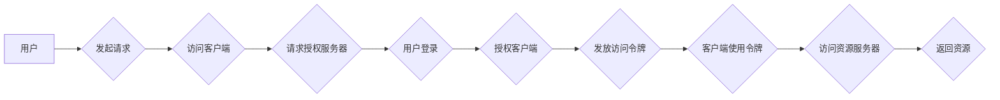

# OAuth 2.0 的跨应用集成

> 关键词：OAuth 2.0, 跨应用集成, 认证授权, API安全, OpenID Connect, Resource Owner Password Credentials, Client Credentials

## 1. 背景介绍

在互联网和移动互联网的今天，应用之间的数据共享和互操作性变得至关重要。然而，随着应用的增多，如何确保数据的安全和用户隐私成为了一大挑战。OAuth 2.0 是一个开放标准，允许第三方应用代表用户访问他们存储在另一个服务器上的资源，而不需要将用户名和密码提供给第三方应用。本文将深入探讨 OAuth 2.0 的原理、实现步骤、优缺点以及在各种应用场景中的集成实践。

### 1.1 问题的由来

随着社交媒体、云服务和移动应用的兴起，用户需要在多个应用之间进行身份验证和授权。传统的单一登录系统不仅用户体验差，而且存在安全风险。OAuth 2.0 提供了一种安全的机制，允许用户授权第三方应用访问其资源，同时保护用户的敏感信息。

### 1.2 研究现状

OAuth 2.0 已成为互联网上最流行的认证授权协议之一。它被广泛应用于社交媒体、云服务和移动应用中。随着 OAuth 2.0 的不断发展，衍生出了许多扩展协议，如 OpenID Connect，用于提供身份信息和单点登录功能。

### 1.3 研究意义

OAuth 2.0 的跨应用集成对于以下方面具有重要意义：

- 提升用户体验：用户可以在不同应用之间无缝切换，无需重复登录。
- 保护用户隐私：用户可以控制哪些应用可以访问自己的数据。
- 增强安全性：OAuth 2.0 机制可以防止用户凭据泄露。

### 1.4 本文结构

本文将分为以下几个部分：

- 介绍 OAuth 2.0 的核心概念与联系。
- 深入分析 OAuth 2.0 的算法原理和具体操作步骤。
- 讲解 OAuth 2.0 的数学模型和公式。
- 提供项目实践，包括代码实例和详细解释。
- 探讨 OAuth 2.0 在实际应用场景中的集成实践。
- 展望 OAuth 2.0 的未来发展趋势和挑战。

## 2. 核心概念与联系

OAuth 2.0 的核心概念包括：

- **客户端(Client)**：请求对资源服务器(Resource Server)上的资源进行访问的应用。
- **资源所有者(Resource Owner)**：拥有资源并授权客户端访问这些资源的应用用户。
- **授权服务器(Authorization Server)**：处理客户端授权请求并发放访问令牌的服务器。
- **资源服务器**：存储用户资源的实体，如数据库或文件系统。

以下是 OAuth 2.0 的基本架构 Mermaid 流程图：



## 3. 核心算法原理 & 具体操作步骤

### 3.1 算法原理概述

OAuth 2.0 的核心是授权令牌（Access Token），它允许客户端访问资源服务器上的资源。授权令牌的发放过程涉及以下几个步骤：

1. 用户登录并授权。
2. 授权服务器生成访问令牌。
3. 客户端使用访问令牌请求资源。
4. 资源服务器验证令牌并返回资源。

### 3.2 算法步骤详解

以下是 OAuth 2.0 的具体操作步骤：

1. **注册客户端**：客户端在授权服务器上注册，获取客户端ID和客户端密钥。
2. **用户登录**：用户在授权服务器上登录，并同意授权客户端访问其资源。
3. **请求授权码**：客户端向授权服务器请求授权码。
4. **用户授权**：用户在授权服务器上确认授权请求。
5. **获取访问令牌**：客户端使用授权码向授权服务器请求访问令牌。
6. **访问资源**：客户端使用访问令牌请求资源服务器上的资源。
7. **资源服务器验证令牌**：资源服务器验证访问令牌的有效性。
8. **返回资源**：资源服务器返回请求的资源给客户端。

### 3.3 算法优缺点

**优点**：

- **安全性**：通过令牌机制，用户凭据不需要直接传递给第三方应用，提高了安全性。
- **灵活性**：支持多种授权类型，如资源所有者密码凭证、客户端凭证等。
- **易用性**：简化了用户登录和授权过程。

**缺点**：

- **复杂性**：实现和配置相对复杂，需要考虑多种安全性和兼容性问题。
- **依赖第三方**：需要依赖授权服务器和资源服务器，增加了依赖风险。

### 3.4 算法应用领域

OAuth 2.0 在以下领域得到了广泛应用：

- **社交登录**：允许用户使用社交账户登录到第三方应用。
- **API集成**：允许不同应用之间安全地共享数据。
- **移动应用**：在移动应用中实现单点登录和多应用集成。

## 4. 数学模型和公式 & 详细讲解 & 举例说明

OAuth 2.0 的数学模型主要涉及授权码和访问令牌的生成和验证过程。

### 4.1 数学模型构建

授权码和访问令牌的生成通常涉及以下步骤：

1. **生成随机字符串**：使用随机数生成器生成授权码和访问令牌。
2. **加密**：使用哈希函数对授权码和访问令牌进行加密。
3. **签名**：使用私钥对加密后的授权码和访问令牌进行签名。

以下是授权码和访问令牌生成的示例公式：

$$
\text{Authorization Code} = H(\text{随机字符串} + \text{密钥}) 
$$

$$
\text{Access Token} = H(\text{随机字符串} + \text{密钥}) 
$$

其中 $H$ 表示哈希函数，$\text{随机字符串}$ 为随机生成的字符串，$\text{密钥}$ 为授权服务器和客户端共享的密钥。

### 4.2 公式推导过程

授权码和访问令牌的生成过程不涉及复杂的数学推导，主要依靠随机数生成器、哈希函数和加密算法。

### 4.3 案例分析与讲解

以下是一个简单的 OAuth 2.0 社交登录的案例：

1. 用户在第三方应用中点击登录按钮。
2. 第三方应用将用户重定向到授权服务器的登录页面。
3. 用户在授权服务器上登录并授权第三方应用访问其资源。
4. 授权服务器生成授权码并重定向用户回第三方应用。
5. 第三方应用使用授权码向授权服务器请求访问令牌。
6. 授权服务器验证授权码并生成访问令牌。
7. 第三方应用使用访问令牌请求用户资源。
8. 用户资源返回给第三方应用。

## 5. 项目实践：代码实例和详细解释说明

### 5.1 开发环境搭建

为了演示 OAuth 2.0 的集成，我们需要搭建一个简单的开发环境。以下是使用 Python 和 Flask 框架搭建 OAuth 2.0 服务的步骤：

1. 安装 Flask 和相关库：
```bash
pip install Flask requests
```

2. 创建 Flask 应用：
```python
from flask import Flask, request, redirect, url_for, session
import requests

app = Flask(__name__)
app.secret_key = 'your_secret_key'

@app.route('/')
def index():
    if 'username' in session:
        return 'Hello, %s!' % session['username']
    else:
        return redirect(url_for('login'))

@app.route('/login')
def login():
    return '''
        <form action="/auth" method="post">
            Username: <input type="text" name="username"><br>
            Password: <input type="password" name="password"><br>
            <input type="submit" value="Login">
        </form>
    '''

@app.route('/auth', methods=['POST'])
def auth():
    username = request.form['username']
    password = request.form['password']
    # 这里应该使用更安全的认证方式，例如 OAuth 2.0
    session['username'] = username
    return redirect(url_for('index'))

if __name__ == '__main__':
    app.run(debug=True)
```

### 5.2 源代码详细实现

以上代码展示了如何使用 Flask 框架创建一个简单的登录服务。在实际的 OAuth 2.0 集成中，我们需要使用 OAuth 2.0 的客户端库，例如 `requests-oauthlib`。

### 5.3 代码解读与分析

以上代码定义了一个 Flask 应用，包括登录页面、登录表单处理和首页展示。在登录页面，用户可以输入用户名和密码进行登录。在实际的 OAuth 2.0 集成中，我们需要使用 OAuth 2.0 的客户端库处理登录和授权流程。

### 5.4 运行结果展示

运行 Flask 应用后，用户可以通过浏览器访问 `http://localhost:5000/` 来测试登录功能。

## 6. 实际应用场景

OAuth 2.0 在以下实际应用场景中得到了广泛应用：

- **社交媒体登录**：用户可以使用 Facebook、Google 等社交媒体账户登录到第三方应用。
- **API集成**：允许不同应用之间安全地共享数据。
- **移动应用**：在移动应用中实现单点登录和多应用集成。

## 7. 工具和资源推荐

### 7.1 学习资源推荐

- **OAuth 2.0 简介**：https://tools.ietf.org/html/rfc6749
- **OpenID Connect**：https://openid.net/specs/
- **OAuth 2.0 实战**：https://oauth.net/2/intro/

### 7.2 开发工具推荐

- **OAuth 2.0 客户端库**：requests-oauthlib
- **OAuth 2.0 服务端库**：Flask-OAuthlib

### 7.3 相关论文推荐

- **OAuth 2.0 简介**：https://tools.ietf.org/html/rfc6749
- **OpenID Connect 简介**：https://openid.net/specs/

## 8. 总结：未来发展趋势与挑战

### 8.1 研究成果总结

OAuth 2.0 是一个安全、灵活的认证授权协议，已被广泛应用于各种应用场景。它为用户提供了更好的用户体验，同时保护了用户数据的安全。

### 8.2 未来发展趋势

OAuth 2.0 将继续演进，以支持更复杂的认证授权场景。以下是一些未来发展趋势：

- **多因素认证**：结合密码、生物识别和设备认证，提供更安全的认证机制。
- **联邦身份认证**：允许用户在不同组织之间安全地使用相同的身份信息。
- **零信任架构**：在权限授予时考虑最小权限原则，提高系统的安全性。

### 8.3 面临的挑战

OAuth 2.0 在实际应用中仍然面临一些挑战：

- **安全风险**：OAuth 2.0 仍然存在安全风险，如令牌泄露和中间人攻击。
- **互操作性**：不同提供商的 OAuth 2.0 实现可能存在差异，导致互操作性问题。
- **合规性**：OAuth 2.0 需要符合各种法律法规，如 GDPR。

### 8.4 研究展望

OAuth 2.0 的未来发展需要解决上述挑战，同时不断演进以适应新的应用场景。以下是一些研究展望：

- **标准化**：进一步标准化 OAuth 2.0 的实现，提高互操作性。
- **安全增强**：开发更安全的技术，如令牌加密和签名，提高 OAuth 2.0 的安全性。
- **隐私保护**：将隐私保护纳入 OAuth 2.0 的设计和实现，保护用户数据。

## 9. 附录：常见问题与解答

**Q1：OAuth 2.0 与 OAuth 1.0 的主要区别是什么？**

A1：OAuth 2.0 相比 OAuth 1.0，简化了认证授权流程，提高了安全性和易用性。OAuth 2.0 使用访问令牌代替了 OAuth 1.0 的签名，减少了复杂性和安全性风险。

**Q2：OAuth 2.0 有哪些授权类型？**

A2：OAuth 2.0 支持多种授权类型，包括：

- 授权码授权（Authorization Code）
- 简化授权（Implicit Grant）
- 资源所有者密码凭证（Resource Owner Password Credentials）
- 客户端凭证（Client Credentials）

**Q3：OAuth 2.0 的令牌有效期是多久？**

A3：令牌的有效期取决于授权服务器和客户端的设置。一些令牌可能只有几分钟的有效期，而其他令牌可能具有更长的有效期。

**Q4：如何保护 OAuth 2.0 令牌的安全？**

A4：为了保护 OAuth 2.0 令牌的安全，可以采取以下措施：

- 使用HTTPS进行通信
- 对令牌进行加密和签名
- 限制令牌的访问范围
- 定期更换令牌

---

作者：禅与计算机程序设计艺术 / Zen and the Art of Computer Programming