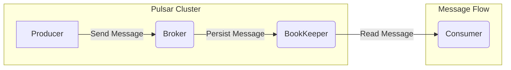

# Pulsar Producer原理与代码实例讲解

> 关键词：Pulsar, Apache Pulsar, Producer, 消息队列, 流计算, 分布式系统, API, 框架设计, 代码示例

## 1. 背景介绍

在分布式系统中，消息队列是一种常用的异步通信机制，它允许不同组件之间解耦，并支持高吞吐量和可靠的消息传递。Apache Pulsar 是一个开源的分布式发布-订阅消息系统，它旨在提供低延迟、高吞吐量、持久性和可扩展的解决方案。Pulsar 的核心组件包括 Producer、Consumer、Broker、Bookkeeper 等。本文将重点讲解 Pulsar Producer 的原理与代码实例，帮助读者深入理解其在流计算和分布式系统中的应用。

## 2. 核心概念与联系

### 2.1 核心概念

- **Producer**: Pulsar 中的消息生产者，负责向 Pulsar 集群发送消息。
- **Message**: 消息队列中的数据单元，包含数据内容和相关的元信息。
- **Topic**: 主题，用于组织消息，多个生产者可以向同一个主题发送消息，多个消费者可以从同一个主题读取消息。
- **Partition**: 分区，Pulsar 使用分区来提高吞吐量和并发能力。
- **Broker**: Pulsar 集群中的节点，负责管理分区和接收/发送消息。
- **BookKeeper**: Pulsar 的存储系统，用于持久化消息和状态信息。

### 2.2 架构的 Mermaid 流程图



## 3. 核心算法原理 & 具体操作步骤

### 3.1 算法原理概述

Pulsar Producer 的核心原理是通过客户端库（Client Library）与 Pulsar 集群进行通信。客户端库负责处理消息的序列化、发送、确认和错误处理等操作。

### 3.2 算法步骤详解

1. **初始化 Producer**：创建一个 Pulsar Producer 实例，指定主题和配置。
2. **序列化消息**：将消息序列化为字节序列。
3. **发送消息**：将序列化后的消息发送到指定的主题和分区。
4. **确认消息发送**：等待 Pulsar 集群确认消息已成功发送。
5. **错误处理**：在消息发送过程中，处理可能的错误，如网络故障、分区不可用等。

### 3.3 算法优缺点

**优点**：

- **高吞吐量**：Pulsar 支持百万级别的消息吞吐量，适用于高并发场景。
- **高可靠性**：消息在发送过程中会被持久化存储，即使在系统故障的情况下也能保证消息不丢失。
- **灵活的路由策略**：支持多种路由策略，如单分区、多分区、广播等。

**缺点**：

- **复杂性**：相较于简单的消息队列，Pulsar 的架构和配置较为复杂。
- **资源消耗**：Pulsar 需要一定的系统资源，如存储和计算资源。

### 3.4 算法应用领域

Pulsar Producer 可应用于以下场景：

- **流计算**：在流计算框架中，Pulsar Producer 可用于接收实时数据流，并将数据发送到下游处理节点。
- **日志聚合**：Pulsar Producer 可用于收集分布式系统的日志信息，并存储在 Pulsar 集群中。
- **消息队列**：Pulsar Producer 可作为消息队列，在分布式系统中进行异步通信。

## 4. 数学模型和公式 & 详细讲解 & 举例说明

### 4.1 数学模型构建

Pulsar Producer 的数学模型可以表示为：

$$
\text{Producer} = \text{Client Library} \times \text{Message} \times \text{Configuration}
$$

其中：

- **Client Library**：Pulsar 客户端库，负责消息的序列化、发送和确认等操作。
- **Message**：消息数据单元，包含数据和元信息。
- **Configuration**：生产者的配置参数，如主题、分区、发送策略等。

### 4.2 公式推导过程

由于 Pulsar Producer 的数学模型较为简单，其推导过程主要是对各个组成部分的描述和组合。

### 4.3 案例分析与讲解

以下是一个简单的 Pulsar Producer 代码示例，用于发送消息到指定的主题：

```java
import org.apache.pulsar.client.api.*;

public class PulsarProducerExample {
    public static void main(String[] args) {
        // 创建 Pulsar 客户端连接
        PulsarClient client = PulsarClient.builder()
            .serviceUrl("pulsar://localhost:6650")
            .build();

        // 创建生产者实例
        Producer<String> producer = client.newProducer()
            .topic("my-topic")
            .create();

        // 发送消息
        String message = "Hello, Pulsar!";
        producer.send(message);

        // 关闭生产者连接
        producer.close();
        client.close();
    }
}
```

## 5. 项目实践：代码实例和详细解释说明

### 5.1 开发环境搭建

1. 安装 Java 开发环境。
2. 添加 Pulsar 客户端库依赖到项目中。

### 5.2 源代码详细实现

上述代码示例已经展示了如何创建 Pulsar 客户端连接、创建生产者实例、发送消息和关闭连接。

### 5.3 代码解读与分析

- `PulsarClient.builder().serviceUrl("pulsar://localhost:6650").build();`：创建 Pulsar 客户端连接，指定 Pulsar 集群的地址。
- `client.newProducer().topic("my-topic").create();`：创建一个生产者实例，指定主题名称。
- `producer.send(message);`：发送消息到指定的主题。
- `producer.close();` 和 `client.close();`：关闭生产者连接和客户端连接。

### 5.4 运行结果展示

运行上述代码后，会在指定的主题中生成一条消息，内容为 "Hello, Pulsar!"。

## 6. 实际应用场景

Pulsar Producer 在实际应用中具有广泛的应用场景，以下是一些典型的应用案例：

- **实时数据分析**：Pulsar Producer 可用于收集实时数据，如用户行为数据、传感器数据等，并传递到下游处理系统进行实时分析。
- **事件流处理**：Pulsar Producer 可用于构建事件驱动架构，实现分布式系统之间的异步通信和事件流处理。
- **微服务集成**：Pulsar Producer 可用于集成微服务，实现服务之间的解耦和异步通信。

## 7. 工具和资源推荐

### 7.1 学习资源推荐

- Pulsar 官方文档：https://pulsar.apache.org/docs/en/latest/
- Pulsar 社区论坛：https://discuss.apache.org/c/pulsar
- Pulsar GitHub 仓库：https://github.com/apache/pulsar

### 7.2 开发工具推荐

- Apache Maven：https://maven.apache.org/
- IntelliJ IDEA：https://www.jetbrains.com/idea/

### 7.3 相关论文推荐

- **"Pulsar: Distributedpub/sub messaging system"**: 该论文详细介绍了 Pulsar 的架构和设计原理。

## 8. 总结：未来发展趋势与挑战

### 8.1 研究成果总结

本文详细讲解了 Pulsar Producer 的原理和代码实例，介绍了其在分布式系统和流计算中的应用。通过本文的学习，读者可以深入了解 Pulsar Producer 的功能、优势和局限性，并掌握如何使用 Pulsar Producer 进行消息传递。

### 8.2 未来发展趋势

- **性能优化**：Pulsar 将持续优化其性能，提高吞吐量和降低延迟。
- **易用性提升**：Pulsar 将提供更易于使用的客户端库和工具，降低用户的使用门槛。
- **生态系统扩展**：Pulsar 将与更多第三方系统集成，扩大其应用范围。

### 8.3 面临的挑战

- **资源消耗**：Pulsar 的资源消耗较大，需要优化其资源使用效率。
- **安全性**：Pulsar 的安全性需要进一步提升，以适应更广泛的应用场景。

### 8.4 研究展望

- **跨语言客户端库**：开发更多语言的客户端库，以支持更多开发者的需求。
- **多云部署**：支持多云部署，提高 Pulsar 的可移植性和可扩展性。
- **边缘计算**：将 Pulsar 应用于边缘计算场景，实现实时数据处理和推理。

## 9. 附录：常见问题与解答

**Q1：Pulsar 和 Kafka 有什么区别？**

A：Pulsar 和 Kafka 都是消息队列系统，但它们在架构和功能上有所不同。Pulsar 具有更高的吞吐量、更可靠的存储和更灵活的路由策略。Kafka 更适合于日志聚合和流处理场景。

**Q2：如何保证 Pulsar 消息的可靠性？**

A：Pulsar 使用 BookKeeper 存储系统来持久化消息，即使在系统故障的情况下也能保证消息不丢失。此外，Pulsar 还支持消息确认机制，确保消息被成功消费。

**Q3：Pulsar 适用于哪些场景？**

A：Pulsar 适用于实时数据分析、事件流处理、微服务集成等场景，特别适合高吞吐量、高可靠性和低延迟的应用。

**Q4：如何优化 Pulsar 的性能？**

A：优化 Pulsar 的性能可以从以下几个方面入手：
- 调整分区数量，以提高并发能力。
- 优化客户端库的配置，如超时设置、连接数等。
- 使用更高效的序列化库，如 Avro、Protobuf 等。

**Q5：Pulsar 的安全性如何保障？**

A：Pulsar 支持多种安全机制，如 TLS、SSL、权限控制等，以保障系统的安全性。此外，Pulsar 还提供审计日志和监控工具，帮助用户跟踪和监控系统活动。

作者：禅与计算机程序设计艺术 / Zen and the Art of Computer Programming