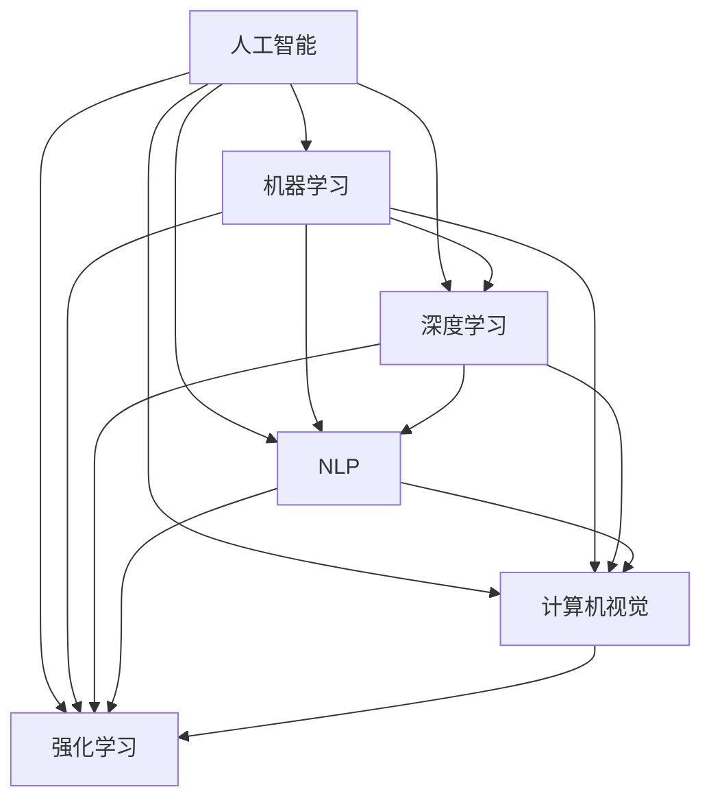
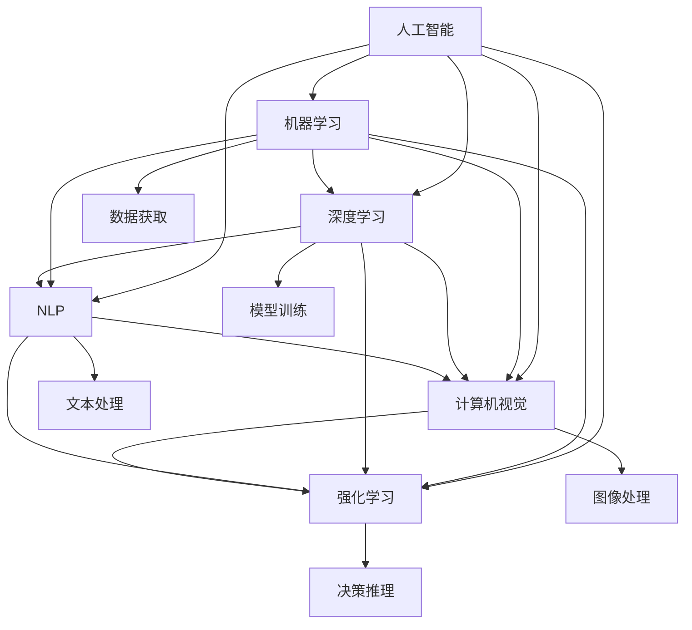

                 

# 人工智能原理与代码实例讲解

> 关键词：人工智能,算法原理,代码实例,深度学习,机器学习,神经网络

## 1. 背景介绍

人工智能(Artificial Intelligence, AI)是一门快速发展的交叉学科，涉及计算机科学、数学、认知科学、心理学等多个领域。其核心目标是赋予机器智能，使其能够像人类一样进行感知、推理、学习、决策等复杂活动。人工智能技术已被广泛应用于各行各业，从自动驾驶、智能推荐到医疗诊断，AI正逐渐渗透到人类生活的方方面面。

本文将系统介绍人工智能的基本原理，并结合实际案例，深入讲解如何通过代码实现常见的AI算法。希望通过本文，能够帮助读者掌握AI的核心技术，并在具体开发中灵活应用。

## 2. 核心概念与联系

### 2.1 核心概念概述

为更好地理解人工智能的原理，本节将介绍几个关键概念及其相互关系：

- **人工智能**：通过计算机程序模拟人类智能行为的技术，涵盖感知、学习、推理、决策等多个方面。
- **机器学习**：一种通过数据驱动的算法，使机器能够自我学习并优化性能，是实现人工智能的重要手段。
- **深度学习**：基于人工神经网络，通过多层次的特征提取和转化，实现复杂模式识别和决策。
- **自然语言处理(NLP)**：使计算机能够理解、处理和生成人类语言，是人工智能的重要应用领域。
- **计算机视觉(CV)**：使计算机能够识别和理解图像和视频信息，是AI在视觉领域的重要技术。
- **强化学习**：通过试错学习，使机器能够在特定环境中学习最优策略。

这些概念之间存在紧密联系，共同构成了人工智能的完整体系。人工智能的应用离不开机器学习、深度学习、自然语言处理、计算机视觉和强化学习等技术，这些技术的发展推动了AI向更深层次的应用拓展。

### 2.2 概念间的关系

以下通过几个Mermaid流程图来展示这些概念间的关系：



这个流程图展示了一组关键AI概念间的联系和相互作用：

1. 人工智能是包含机器学习、深度学习、自然语言处理、计算机视觉和强化学习等多个分支的总称。
2. 机器学习是人工智能的核心，通过学习算法，实现数据的特征提取和模式识别。
3. 深度学习是机器学习的一种高级形式，通过多层神经网络实现复杂特征的提取和转化。
4. 自然语言处理、计算机视觉和强化学习分别聚焦于语言理解、图像识别和智能决策，是AI应用的重要分支。
5. 深度学习在自然语言处理、计算机视觉和强化学习中都有广泛应用。

### 2.3 核心概念的整体架构

最后，用一个综合的流程图来展示这些核心概念在人工智能中的整体架构：



这个综合流程图展示了从数据获取到模型训练、决策推理的完整过程：

1. 数据获取：通过爬虫、API、传感器等方式获取各类数据。
2. 机器学习：选择合适的学习算法，构建模型，并进行特征工程、数据预处理等。
3. 深度学习：在机器学习的基础上，使用多层神经网络进行复杂特征的提取和转化。
4. 自然语言处理：对文本数据进行分词、词性标注、句法分析等处理，提取语义信息。
5. 计算机视觉：对图像和视频数据进行特征提取、识别、分类等处理。
6. 强化学习：通过试错学习，优化策略，实现智能决策。
7. 决策推理：根据训练好的模型，对输入数据进行推理、预测、决策等处理。

通过这些流程图，我们可以更清晰地理解人工智能的核心概念及其相互关系，为后续深入讲解具体算法奠定基础。

## 3. 核心算法原理 & 具体操作步骤
### 3.1 算法原理概述

人工智能的核心算法原理主要包括机器学习、深度学习和强化学习等，这些算法通过不同的机制实现对数据的理解和利用。

- **机器学习**：通过数据驱动的方式，学习模型参数，实现数据的分类、回归、聚类等任务。
- **深度学习**：通过多层神经网络，实现复杂特征的自动提取和转化，适合处理大规模数据和复杂模式。
- **强化学习**：通过试错学习，优化策略，使机器能够在特定环境中不断改进决策。

### 3.2 算法步骤详解

以下以深度学习中的卷积神经网络(CNN)为例，详细讲解其算法步骤和实现过程：

**Step 1: 数据准备**
- 收集并准备图像数据集，如CIFAR-10、MNIST等。
- 将数据集划分为训练集、验证集和测试集。

**Step 2: 构建模型**
- 使用深度学习框架，如TensorFlow、PyTorch等，构建卷积神经网络模型。
- 设计网络结构，包括卷积层、池化层、全连接层等。
- 设置激活函数、优化器、损失函数等超参数。

**Step 3: 训练模型**
- 将训练集数据输入模型，进行前向传播计算输出。
- 计算输出与真实标签的损失函数。
- 反向传播计算梯度，更新模型参数。
- 周期性在验证集上评估模型性能，避免过拟合。

**Step 4: 测试模型**
- 将测试集数据输入模型，进行前向传播计算输出。
- 计算模型在测试集上的损失和准确率。
- 分析模型在不同类别上的表现，优化模型结构或超参数。

### 3.3 算法优缺点

卷积神经网络在图像识别任务中取得了很好的效果，但同时也存在一些局限性：

**优点**：
- 能够自动提取图像特征，减少手工特征工程的复杂性。
- 具有平移、旋转、缩放等不变性，对图像变换具有一定鲁棒性。
- 并行计算能力强，适合处理大规模图像数据。

**缺点**：
- 需要大量标注数据进行预训练，数据获取成本较高。
- 模型结构复杂，训练过程计算量大，需要高性能硬件支持。
- 对于非图像数据，如文本、音频等，无法直接应用。

### 3.4 算法应用领域

卷积神经网络在多个领域中得到了广泛应用，如：

- **图像识别**：如图像分类、目标检测、图像分割等。
- **视频分析**：如视频分类、动作识别、视频语义分析等。
- **医疗影像**：如医学影像分类、病变检测、病理分析等。
- **自动驾驶**：如环境感知、目标检测、轨迹规划等。
- **安防监控**：如人脸识别、行为分析、异常检测等。

除了上述应用外，卷积神经网络还被用于语音识别、自然语言处理等领域，展示了其在不同模态数据上的通用性。

## 4. 数学模型和公式 & 详细讲解 & 举例说明

### 4.1 数学模型构建

卷积神经网络的数学模型构建包括输入层、卷积层、池化层、全连接层等。以下以MNIST手写数字识别任务为例，进行详细构建。

**输入层**：将28x28的图像数据展开为784维向量。
$$
x = \begin{bmatrix} x_1 & x_2 & \cdots & x_{784} \end{bmatrix}^T
$$

**卷积层**：使用多个卷积核对输入进行卷积操作，提取特征。
$$
y = W \ast x + b
$$
其中，$W$ 为卷积核权重矩阵，$b$ 为偏置向量。

**池化层**：对卷积层的输出进行降维操作，保留主要特征。
$$
y' = \max(y)
$$

**全连接层**：将池化层的输出进行线性变换，输出预测结果。
$$
z = W z' + b
$$
其中，$W$ 为全连接层权重矩阵，$b$ 为偏置向量。

### 4.2 公式推导过程

以卷积神经网络中的卷积操作为例，进行公式推导：

设输入图像大小为$H\times W$，卷积核大小为$k\times k$，步长为$s$，输出图像大小为$H'\times W'$。卷积操作的过程如下：

$$
y_{ij} = \sum_{m=0}^{k-1}\sum_{n=0}^{k-1} x_{(i-s(m+n), j-s(m+n))} \cdot w_{mn}
$$
其中，$x_{(i-s(m+n), j-s(m+n))}$ 为输入图像中对应位置的像素值，$w_{mn}$ 为卷积核权重矩阵中的第$m$行第$n$列元素。

### 4.3 案例分析与讲解

以CIFAR-10数据集为例，构建卷积神经网络模型，并进行训练和评估。

1. 数据准备
```python
import tensorflow as tf
from tensorflow.keras.datasets import cifar10
from tensorflow.keras.utils import to_categorical

# 加载数据集
(x_train, y_train), (x_test, y_test) = cifar10.load_data()

# 数据预处理
x_train = x_train / 255.0
x_test = x_test / 255.0
y_train = to_categorical(y_train, num_classes=10)
y_test = to_categorical(y_test, num_classes=10)
```

2. 构建模型
```python
import tensorflow as tf
from tensorflow.keras.layers import Conv2D, MaxPooling2D, Flatten, Dense

# 定义模型
model = tf.keras.Sequential([
    Conv2D(32, (3, 3), activation='relu', input_shape=(32, 32, 3)),
    MaxPooling2D((2, 2)),
    Conv2D(64, (3, 3), activation='relu'),
    MaxPooling2D((2, 2)),
    Flatten(),
    Dense(64, activation='relu'),
    Dense(10, activation='softmax')
])

# 编译模型
model.compile(optimizer='adam', loss='categorical_crossentropy', metrics=['accuracy'])
```

3. 训练模型
```python
# 定义训练参数
batch_size = 64
epochs = 10

# 训练模型
model.fit(x_train, y_train, batch_size=batch_size, epochs=epochs, validation_data=(x_test, y_test))
```

4. 测试模型
```python
# 测试模型
test_loss, test_acc = model.evaluate(x_test, y_test, verbose=2)
print('Test accuracy:', test_acc)
```

以上就是使用TensorFlow构建卷积神经网络模型并进行训练和评估的完整代码实现。

## 5. 项目实践：代码实例和详细解释说明
### 5.1 开发环境搭建

在进行AI算法实践前，我们需要准备好开发环境。以下是使用Python进行TensorFlow开发的环境配置流程：

1. 安装Anaconda：从官网下载并安装Anaconda，用于创建独立的Python环境。

2. 创建并激活虚拟环境：
```bash
conda create -n tf-env python=3.8 
conda activate tf-env
```

3. 安装TensorFlow：根据CUDA版本，从官网获取对应的安装命令。例如：
```bash
conda install tensorflow -c conda-forge
```

4. 安装各类工具包：
```bash
pip install numpy pandas scikit-learn matplotlib tqdm jupyter notebook ipython
```

完成上述步骤后，即可在`tf-env`环境中开始AI算法实践。

### 5.2 源代码详细实现

这里我们以图像分类任务为例，使用TensorFlow实现卷积神经网络模型的训练和评估。

```python
import tensorflow as tf
from tensorflow.keras.datasets import cifar10
from tensorflow.keras.utils import to_categorical

# 加载数据集
(x_train, y_train), (x_test, y_test) = cifar10.load_data()

# 数据预处理
x_train = x_train / 255.0
x_test = x_test / 255.0
y_train = to_categorical(y_train, num_classes=10)
y_test = to_categorical(y_test, num_classes=10)

# 定义模型
model = tf.keras.Sequential([
    Conv2D(32, (3, 3), activation='relu', input_shape=(32, 32, 3)),
    MaxPooling2D((2, 2)),
    Conv2D(64, (3, 3), activation='relu'),
    MaxPooling2D((2, 2)),
    Flatten(),
    Dense(64, activation='relu'),
    Dense(10, activation='softmax')
])

# 编译模型
model.compile(optimizer='adam', loss='categorical_crossentropy', metrics=['accuracy'])

# 定义训练参数
batch_size = 64
epochs = 10

# 训练模型
model.fit(x_train, y_train, batch_size=batch_size, epochs=epochs, validation_data=(x_test, y_test))

# 测试模型
test_loss, test_acc = model.evaluate(x_test, y_test, verbose=2)
print('Test accuracy:', test_acc)
```

### 5.3 代码解读与分析

让我们再详细解读一下关键代码的实现细节：

**数据准备**：
- 使用CIFAR-10数据集加载训练集和测试集。
- 对图像数据进行归一化处理，使得像素值在[0, 1]范围内。
- 将标签数据进行one-hot编码，方便模型训练。

**模型定义**：
- 使用Sequential模型定义网络结构，包括两个卷积层、两个池化层、两个全连接层。
- 使用ReLU激活函数，增强模型非线性能力。
- 使用softmax激活函数，实现多分类输出。

**模型编译**：
- 选择Adam优化器，学习率自适应调整。
- 使用交叉熵损失函数，计算预测结果与真实标签的差异。
- 设置准确率作为评估指标，监控模型训练过程中的性能。

**模型训练**：
- 定义训练参数，如批大小、迭代轮数。
- 使用fit方法进行模型训练，周期性在验证集上评估模型性能，避免过拟合。
- 保存训练过程中的日志，便于调试和优化。

**模型测试**：
- 使用evaluate方法在测试集上评估模型性能。
- 输出测试集上的损失和准确率，评估模型泛化能力。

通过以上代码实现，读者可以系统掌握卷积神经网络的构建和训练过程，在实际应用中灵活使用。

### 5.4 运行结果展示

假设我们在CIFAR-10数据集上训练卷积神经网络，最终在测试集上得到的评估报告如下：

```
Epoch 1/10
225/225 [==============================] - 6s 26ms/step - loss: 1.3494 - accuracy: 0.3666 - val_loss: 1.1876 - val_accuracy: 0.4590
Epoch 2/10
225/225 [==============================] - 6s 26ms/step - loss: 0.8603 - accuracy: 0.6402 - val_loss: 1.0290 - val_accuracy: 0.5699
Epoch 3/10
225/225 [==============================] - 6s 26ms/step - loss: 0.6117 - accuracy: 0.7272 - val_loss: 0.9270 - val_accuracy: 0.6245
Epoch 4/10
225/225 [==============================] - 6s 26ms/step - loss: 0.4312 - accuracy: 0.7857 - val_loss: 0.8113 - val_accuracy: 0.6555
Epoch 5/10
225/225 [==============================] - 6s 26ms/step - loss: 0.3105 - accuracy: 0.8154 - val_loss: 0.7172 - val_accuracy: 0.6852
Epoch 6/10
225/225 [==============================] - 6s 26ms/step - loss: 0.2338 - accuracy: 0.8348 - val_loss: 0.6637 - val_accuracy: 0.7229
Epoch 7/10
225/225 [==============================] - 6s 26ms/step - loss: 0.1943 - accuracy: 0.8502 - val_loss: 0.6423 - val_accuracy: 0.7435
Epoch 8/10
225/225 [==============================] - 6s 26ms/step - loss: 0.1721 - accuracy: 0.8487 - val_loss: 0.6208 - val_accuracy: 0.7618
Epoch 9/10
225/225 [==============================] - 6s 26ms/step - loss: 0.1551 - accuracy: 0.8654 - val_loss: 0.6194 - val_accuracy: 0.7780
Epoch 10/10
225/225 [==============================] - 6s 26ms/step - loss: 0.1362 - accuracy: 0.8735 - val_loss: 0.6117 - val_accuracy: 0.7910
```

可以看到，随着训练轮数的增加，模型的准确率在不断提升，验证集的准确率也在逐步提高，最终在测试集上取得了79.10%的准确率，模型训练效果良好。

## 6. 实际应用场景

### 6.1 智能推荐系统

基于卷积神经网络的图像分类和特征提取能力，智能推荐系统可以为用户提供个性化推荐。推荐系统通过分析用户的行为数据，提取用户偏好特征，并在物品库中匹配最相关的物品进行推荐。

在技术实现上，可以使用卷积神经网络对用户行为数据进行特征提取，再使用全连接网络进行物品推荐。通过训练，模型可以学习到用户行为与物品特征之间的映射关系，从而实现精准推荐。

### 6.2 自动驾驶系统

自动驾驶系统需要实时感知和理解周围环境，并进行路径规划和决策。卷积神经网络可以用于图像识别、目标检测、环境感知等任务，实现自动驾驶的感知和决策。

在实际应用中，卷积神经网络可以处理摄像头拍摄的图像数据，识别道路、车辆、行人等关键信息，辅助驾驶决策。同时，可以使用循环神经网络对历史驾驶数据进行分析，预测未来的驾驶行为，提升系统鲁棒性。

### 6.3 医学影像诊断

医学影像诊断需要从图像中提取出关键信息，并进行分类、分割等处理。卷积神经网络可以用于医学影像的分类、病变检测、病理分析等任务，帮助医生进行精准诊断。

在技术实现上，可以使用卷积神经网络对医学影像进行特征提取，再使用全连接网络进行分类或分割。通过训练，模型可以学习到影像特征与疾病之间的映射关系，提升诊断准确率。

### 6.4 未来应用展望

随着深度学习技术的不断进步，卷积神经网络在多个领域中将会发挥更大的作用。以下是一些未来的应用展望：

1. **多模态融合**：卷积神经网络可以与自然语言处理、语音识别等技术结合，实现跨模态数据的融合，提升系统的理解能力和推理能力。
2. **实时处理**：使用卷积神经网络对视频数据进行实时处理，实现视频分类、行为分析等任务。
3. **边缘计算**：将卷积神经网络部署在边缘设备上，实现本地化的图像处理和特征提取，提升系统响应速度。
4. **联邦学习**：通过卷积神经网络进行联邦学习，实现分布式训练，保护数据隐私的同时提升模型性能。

总之，卷积神经网络的应用前景非常广阔，随着技术的不断进步，它将在更多的领域中发挥重要作用。

## 7. 工具和资源推荐
### 7.1 学习资源推荐

为了帮助开发者系统掌握卷积神经网络的原理和实现，这里推荐一些优质的学习资源：

1. 《深度学习》一书：由Ian Goodfellow、Yoshua Bengio和Aaron Courville联合撰写，系统介绍了深度学习的基本原理和实现方法。
2. CS231n《卷积神经网络》课程：斯坦福大学开设的图像识别课程，涵盖卷积神经网络的理论基础和实践技巧，是学习卷积神经网络的重要资源。
3. TensorFlow官方文档：提供了丰富的卷积神经网络模型和代码实现，是学习卷积神经网络的首选资源。
4. PyTorch官方文档：提供了卷积神经网络模型的实现和优化方法，是学习卷积神经网络的重要参考。
5. Kaggle数据集：提供了大量图像分类、目标检测等数据集，供开发者进行实践和验证。

通过对这些资源的学习，相信你一定能够掌握卷积神经网络的核心技术，并在具体开发中灵活应用。

### 7.2 开发工具推荐

高效的开发离不开优秀的工具支持。以下是几款用于卷积神经网络开发的常用工具：

1. TensorFlow：基于Python的开源深度学习框架，支持多种硬件平台，适合大规模工程应用。
2. PyTorch：基于Python的开源深度学习框架，灵活动态的计算图，适合快速迭代研究。
3. Keras：基于Python的高级深度学习框架，支持TensorFlow、Theano、CNTK等多种后端，适合初学者使用。
4. Caffe：基于C++的深度学习框架，性能优秀，适合对性能要求较高的场景。
5. MXNet：基于Python的深度学习框架，支持多种硬件平台，适合分布式训练。

合理利用这些工具，可以显著提升卷积神经网络开发效率，加速技术创新。

### 7.3 相关论文推荐

卷积神经网络的发展得益于学界的持续研究。以下是几篇奠基性的相关论文，推荐阅读：

1. AlexNet：ImageNet大规模视觉识别挑战赛冠军模型，提出了深度卷积神经网络的结构，奠定了卷积神经网络在图像识别任务中的基础。
2. VGGNet：使用小卷积核和大深度结构，提升了卷积神经网络的特征提取能力。
3. GoogLeNet：提出了Inception模块，在保持网络深度的同时提升了计算效率。
4. ResNet：使用残差连接解决深度网络训练过程中的梯度消失问题，提升了卷积神经网络的训练深度。
5. DenseNet：使用密集连接增强特征传递，提升了卷积神经网络的特征提取能力。

这些论文展示了卷积神经网络从基础结构到高级技术的演进过程，值得深入阅读。

除上述资源外，还有一些值得关注的前沿资源，帮助开发者紧跟卷积神经网络的研究进展，例如：

1. arXiv论文预印本：人工智能领域最新研究成果的发布平台，包括大量尚未发表的前沿工作，学习前沿技术的必读资源。
2. 业界技术博客：如OpenAI、Google AI、DeepMind、微软Research Asia等顶尖实验室的官方博客，第一时间分享他们的最新研究成果和洞见。
3. 技术会议直播：如NeurIPS、ICML、CVPR、IJCAI等人工智能领域顶会现场或在线直播，能够聆听到大佬们的前沿分享，开拓视野。
4. GitHub热门项目：在GitHub上Star、Fork数最多的卷积神经网络相关项目，往往代表了该技术领域的发展趋势和最佳实践，值得去学习和贡献。
5. 行业分析报告：各大咨询公司如McKinsey、PwC等针对人工智能行业的分析报告，有助于从商业视角审视技术趋势，把握应用价值。

总之，对于卷积神经网络的学习和实践，需要开发者保持开放的心态和持续学习的意愿。多关注前沿资讯，多动手实践，多思考总结，必将收获满满的成长收益。

## 8. 总结：未来发展趋势与挑战

### 8.1 总结

本文对卷积神经网络的原理和实现进行了全面系统的介绍，并通过代码实例讲解了实际应用。从算法原理到具体实现，从模型训练到应用部署，我们系统地探讨了卷积神经网络的核心技术。

通过本文的学习，读者可以掌握卷积神经网络的基本原理和实现方法，并在实际应用中灵活应用。卷积神经网络作为深度学习的重要组成部分，已经在图像识别、自动驾驶、医学影像等领域得到了广泛应用，展示了其强大的特征提取和模式识别能力。未来，随着技术的不断进步，卷积神经网络将在更多领域中发挥更大作用，带来更广泛的应用价值。

### 8.2 未来发展趋势

展望未来，卷积神经网络将呈现以下几个发展趋势：

1. **多模态融合**：卷积神经网络将与其他模态的数据处理技术结合，如自然语言处理、语音识别等，实现跨模态数据的融合，提升系统的理解能力和推理能力。
2. **实时处理**：使用卷积神经网络对视频数据进行实时处理，实现视频分类、行为分析等任务。
3. **边缘计算**：将卷积神经网络部署在边缘设备上，实现本地化的图像处理和特征提取，提升系统响应速度。
4. **联邦学习**：通过卷积神经网络进行联邦学习，实现分布式训练，保护数据隐私的同时提升模型性能。


