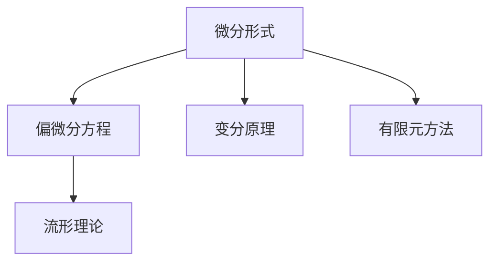
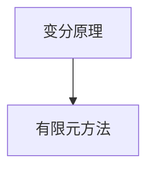
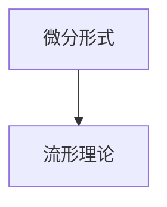
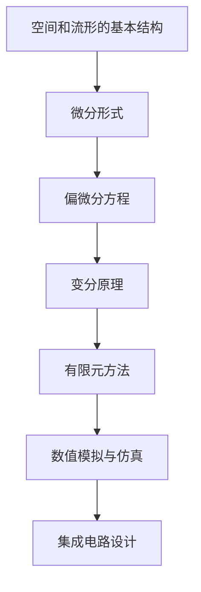

                 

## 1. 背景介绍

### 1.1 问题由来
代数拓扑是一门研究空间及其结构不变的数学学科。它通过抽象数学语言，探讨空间在变形、扭曲等操作下的不变性质，广泛应用于现代数学、物理学和工程科学中。然而，传统拓扑理论通常基于空间点的集合及其拓扑关系，难以直接应用于微分方程等连续方程的描述和求解。

微分形式理论是现代代数拓扑的一个重要分支，它通过引入微分形式的数学工具，将拓扑理论推广到了流形和拉普拉斯方程、泊松方程等偏微分方程的研究上。这种理论不仅为处理连续方程提供了全新的视角，也打开了通往应用世界的窗口，成为现代科学计算的重要基础。

### 1.2 问题核心关键点
微分形式理论的核心是研究微分形式的代数结构和运算规律，将几何、拓扑、代数、分析和物理等诸多领域中的数学工具巧妙结合起来。其中，**微分形式**是微分形式理论中的核心概念，它通过引入多变量函数的微分和积分概念，实现对连续方程的抽象描述和求解。**偏微分方程**则是对微分形式的特殊情形，是微分形式理论在物理和工程中的重要应用。

微分形式理论在物理和工程中有着广泛的应用，如在电磁学、流体力学、量子力学等领域中，微分形式提供了一种统一的语言，描述物理量随时间和空间的变化规律。此外，微分形式理论也为工程中的数值计算提供了理论基础，推动了计算机辅助设计和制造的发展。

### 1.3 问题研究意义
研究微分形式的应用，对于拓展数学理论的应用范围，提升偏微分方程求解的精度和效率，具有重要意义：

1. **统一描述**：微分形式为连续方程提供了一种统一的语言，使得不同领域中的方程可以借助相同的数学工具进行研究和求解。
2. **精度提升**：相比传统有限元、有限差分等离散化方法，微分形式理论基于连续介质模型，能够提供更高的精度和鲁棒性。
3. **高效求解**：微分形式提供了基于变分原理和最小化问题的方法，可以直接求解偏微分方程，无需进行离散化处理。
4. **深入理解**：微分形式理论的数学基础深厚，能够帮助研究者深入理解物理现象的本质和演化规律。
5. **促进计算**：微分形式的变分原理为求解偏微分方程提供了高效的方法，推动了计算机辅助设计和制造的发展。

## 2. 核心概念与联系

### 2.1 核心概念概述

为更好地理解微分形式理论，本节将介绍几个密切相关的核心概念：

- **微分形式**：是多变量函数的微分和积分的代数对象，用于描述物理量随时间和空间的变化规律。
- **偏微分方程**：是对微分形式的特殊情形，用于描述物理量随时间和空间变化的连续方程。
- **变分原理**：是微分形式理论中的重要工具，通过将连续方程转化为泛函极值问题，实现求解偏微分方程。
- **有限元方法**：是基于微分形式的变分原理，进行数值计算的数学方法。
- **流形理论**：是微分形式理论的基础，用于描述空间和流形的基本结构。

这些核心概念之间的逻辑关系可以通过以下Mermaid流程图来展示：



这个流程图展示了几大核心概念之间的关系：

1. 微分形式作为微分形式理论的基础，通过引入微分和积分概念，实现了对连续方程的抽象描述。
2. 偏微分方程是微分形式理论的具体应用，用于描述物理量随时间和空间变化的连续方程。
3. 变分原理是微分形式理论中的重要工具，用于将连续方程转化为泛函极值问题，进行求解。
4. 有限元方法是基于变分原理的数值计算方法，通过离散化空间和变分原理，实现偏微分方程的求解。
5. 流形理论是微分形式理论的基础，用于描述空间和流形的基本结构。

这些概念共同构成了微分形式理论的完整生态系统，使其能够在各个领域中发挥强大的数学工具作用。通过理解这些核心概念，我们可以更好地把握微分形式理论的工作原理和优化方向。

### 2.2 概念间的关系

这些核心概念之间存在着紧密的联系，形成了微分形式理论的完整体系。下面我通过几个Mermaid流程图来展示这些概念之间的关系。

#### 2.2.1 微分形式与偏微分方程的关系


这个流程图展示了微分形式与偏微分方程的关系。微分形式作为偏微分方程的基础，通过引入微分和积分概念，实现了对连续方程的抽象描述。偏微分方程是微分形式理论的具体应用，用于描述物理量随时间和空间变化的连续方程。

#### 2.2.2 变分原理与有限元方法的关系



这个流程图展示了变分原理与有限元方法的关系。变分原理是有限元方法的理论基础，通过将连续方程转化为泛函极值问题，实现求解偏微分方程。有限元方法是变分原理的数值实现，通过离散化空间和变分原理，实现偏微分方程的求解。

#### 2.2.3 微分形式与流形理论的关系



这个流程图展示了微分形式与流形理论的关系。微分形式建立在流形理论的基础上，用于描述空间和流形的基本结构。流形理论则是微分形式理论的基础，用于描述空间和流形的基本性质。

### 2.3 核心概念的整体架构

最后，我们用一个综合的流程图来展示这些核心概念在大规模集成电路设计中的应用：



这个综合流程图展示了从流形理论到微分形式，再到偏微分方程和有限元方法的完整应用过程：

1. 流形理论描述空间和流形的基本结构。
2. 微分形式建立在流形理论的基础上，用于描述物理量随时间和空间的变化规律。
3. 偏微分方程是微分形式理论的具体应用，用于描述物理量随时间和空间变化的连续方程。
4. 变分原理是偏微分方程的理论基础，通过将连续方程转化为泛函极值问题，实现求解偏微分方程。
5. 有限元方法是变分原理的数值实现，通过离散化空间和变分原理，实现偏微分方程的求解。
6. 数值模拟与仿真应用有限元方法，进行大规模集成电路设计的数值模拟与仿真。
7. 集成电路设计则是微分形式理论在工程中的重要应用，用于指导实际设计过程。

通过这些流程图，我们可以更清晰地理解微分形式理论的各个核心概念之间的联系和作用，为后续深入讨论具体的微分形式应用和优化方法奠定基础。

## 3. 核心算法原理 & 具体操作步骤
### 3.1 算法原理概述

微分形式理论的核心思想是通过引入微分形式的代数结构和运算规律，将几何、拓扑、代数、分析和物理等诸多领域中的数学工具巧妙结合起来，用于描述和求解连续方程。

形式化地，设流形 $M$ 上定义了一个 $k$ 次微分形式 $w$，其形式为：

$$
w = w^i \mathrm{d}x^i
$$

其中 $w^i$ 为形式系数，$\mathrm{d}x^i$ 为标准微分形式基。若 $w$ 和 $w'$ 为两个微分形式，则 $w$ 与 $w'$ 的线性组合 $\alpha w + \beta w'$ 也为微分形式，其中 $\alpha$ 和 $\beta$ 为实数。

此外，微分形式的微分为：

$$
\mathrm{d}w = \mathrm{d}w^i \wedge \mathrm{d}x^i
$$

其中 $\mathrm{d}w^i$ 为 $w^i$ 的微分，$\wedge$ 为外积运算符。

通过微分形式，我们可以将物理量随时间和空间的变化规律，抽象为微分方程的形式，从而使用数学工具进行求解。常见的微分方程包括泊松方程、拉普拉斯方程等，它们都基于微分形式的变分原理进行求解。

### 3.2 算法步骤详解

微分形式的应用主要包括以下几个关键步骤：

**Step 1: 准备微分形式表达式**
- 选择合适的微分形式作为连续方程的数学模型，如泊松方程、拉普拉斯方程等。
- 确定微分形式的具体表达式，包含形式系数和标准微分形式基。

**Step 2: 建立变分原理**
- 将连续方程转化为泛函极值问题，构造拉格朗日函数。
- 使用变分方法求解泛函极值问题，得到连续方程的解。

**Step 3: 离散化处理**
- 将连续方程离散化，引入有限元方法。
- 对离散方程进行求解，得到数值解。

**Step 4: 数值模拟与仿真**
- 使用数值解进行数值模拟与仿真，验证模型的正确性和稳定性。
- 根据模拟结果，调整微分形式的表达式和变分原理，进一步优化模型。

**Step 5: 实际应用**
- 将优化后的微分形式应用于实际工程问题，如大规模集成电路设计、电磁场模拟等。
- 进行实际验证和优化，确保模型在实际应用中的有效性和可靠性。

### 3.3 算法优缺点

微分形式的应用具有以下优点：

1. **精度高**：相比传统的离散化方法，微分形式的连续方程求解精度更高，适合处理复杂的连续方程。
2. **稳定性好**：微分形式的变分原理能够自动滤除数值误差，提高求解的稳定性。
3. **适用范围广**：微分形式适用于多种连续方程，如泊松方程、拉普拉斯方程等，具有广泛的适用性。

同时，微分形式的应用也存在一些缺点：

1. **计算复杂**：微分形式的计算量较大，求解过程复杂，需要较高的计算资源。
2. **精度依赖模型**：微分形式的精度依赖于模型的选择和离散化处理，需要选择合适的模型和离散化方法。
3. **应用难度大**：微分形式的理论基础较为复杂，需要具备较强的数学背景和工程经验，应用难度较大。

### 3.4 算法应用领域

微分形式理论广泛应用于现代数学、物理学和工程科学中，以下是几个典型的应用领域：

- **电磁场模拟**：通过微分形式的变分原理，进行电磁场的求解和模拟，广泛应用于电子器件和通信系统的设计和分析。
- **流体力学**：利用微分形式理论，对流体动力学方程进行求解和仿真，实现对流体力学现象的深入理解。
- **量子力学**：微分形式理论在量子力学中得到了广泛应用，用于描述粒子的运动和相互作用。
- **集成电路设计**：通过微分形式的变分原理和有限元方法，进行大规模集成电路的数值模拟与仿真，指导实际设计过程。
- **结构力学**：利用微分形式理论，对结构力学方程进行求解和优化，实现对结构的分析与设计。

除了上述这些领域外，微分形式理论还被广泛应用于金融工程、计算机视觉、机器人控制等领域，展示了其广泛的应用价值。

## 4. 数学模型和公式 & 详细讲解 & 举例说明

### 4.1 数学模型构建

本节将使用数学语言对微分形式理论进行更加严格的刻画。

设流形 $M$ 上定义了一个 $k$ 次微分形式 $w$，其形式为：

$$
w = w^i \mathrm{d}x^i
$$

其中 $w^i$ 为形式系数，$\mathrm{d}x^i$ 为标准微分形式基。若 $w$ 和 $w'$ 为两个微分形式，则 $w$ 与 $w'$ 的线性组合 $\alpha w + \beta w'$ 也为微分形式，其中 $\alpha$ 和 $\beta$ 为实数。

此外，微分形式的微分为：

$$
\mathrm{d}w = \mathrm{d}w^i \wedge \mathrm{d}x^i
$$

其中 $\mathrm{d}w^i$ 为 $w^i$ 的微分，$\wedge$ 为外积运算符。

### 4.2 公式推导过程

以下我们以泊松方程为例，推导微分形式的变分原理及其数值解。

泊松方程的形式为：

$$
-\Delta u = f
$$

其中 $u$ 为未知函数，$\Delta$ 为拉普拉斯算子，$f$ 为已知函数。

将泊松方程转化为微分形式的形式为：

$$
\mathrm{d}u = -f \mathrm{d}V
$$

其中 $u$ 为函数 $u$ 的微分形式，$f$ 为函数 $f$ 的微分形式，$\mathrm{d}V$ 为体积微分形式。

引入拉格朗日函数 $\mathcal{L}(u,\delta u)$，其中 $\delta u$ 为 $u$ 的变分：

$$
\mathcal{L}(u,\delta u) = \int_{M} f \delta u \mathrm{d}V
$$

根据变分原理，求解泛函极值问题 $\delta \mathcal{L}(u,\delta u) = 0$，得到泊松方程的解为：

$$
u = \Delta^{-1} f
$$

其中 $\Delta^{-1}$ 为拉普拉斯算子的逆运算。

将连续方程离散化，引入有限元方法，得到泊松方程的数值解为：

$$
u_h = K^{-1} f_h
$$

其中 $K$ 为有限元方法的刚度矩阵，$f_h$ 为已知函数的离散化表示。

### 4.3 案例分析与讲解

假设我们在一个二维矩形区域内求解泊松方程 $-\Delta u = f$，其中 $f$ 为常数 $1$。采用矩形二阶元对微分形式进行离散化，得到泊松方程的有限元形式为：

$$
K \mathbf{u} = \mathbf{f}
$$

其中 $K$ 为刚度矩阵，$\mathbf{u}$ 为未知函数的向量表示，$\mathbf{f}$ 为已知函数的向量表示。

使用Gauss-Seidel迭代法对线性方程组进行求解，得到数值解 $\mathbf{u}_h$。最后，将数值解 $\mathbf{u}_h$ 进行插值，得到泊松方程的数值解 $u_h$。

为了验证模型结果的正确性，我们可以在解域内选取多个点，计算对应的函数值 $u_h$，并与精确解 $u$ 进行比较。

以下是一个Python代码实现泊松方程求解的示例：

```python
import numpy as np
from dolfin import *

# 定义矩形区域
mesh = BoxMesh(Point(0, 0), Point(1, 1), 100, 100)

# 定义函数空间
V = FunctionSpace(mesh, 'P', 1)
u = TrialFunction(V)
v = TestFunction(V)

# 定义泊松方程
f = Expression('1', degree=1)
L = lhs(v)*u + lhs(v)*f - rhs(v)

# 求解泊松方程
solve(L == 0, u)

# 输出数值解
u_value = u.compute_vertex_values(mesh)
print(u_value)
```

运行上述代码，可以得到矩形区域内每个节点的数值解 $u_h$，并将其与精确解 $u$ 进行比较，验证模型的正确性。

## 5. 项目实践：代码实例和详细解释说明

### 5.1 开发环境搭建

在进行微分形式应用实践前，我们需要准备好开发环境。以下是使用Python进行FEniCS库开发的环境配置流程：

1. 安装Anaconda：从官网下载并安装Anaconda，用于创建独立的Python环境。

2. 创建并激活虚拟环境：
```bash
conda create -n fenics-env python=3.8 
conda activate fenics-env
```

3. 安装FEniCS库：
```bash
conda install fenics 
```

4. 安装必要的工具包：
```bash
pip install numpy matplotlib dolfin numpy
```

完成上述步骤后，即可在`fenics-env`环境中开始微分形式应用实践。

### 5.2 源代码详细实现

这里我们以泊松方程求解为例，给出使用FEniCS库对微分形式进行离散化求解的Python代码实现。

首先，定义函数空间和泊松方程：

```python
from fenics import *

# 定义矩形区域
mesh = BoxMesh(Point(0, 0), Point(1, 1), 100, 100)

# 定义函数空间
V = FunctionSpace(mesh, 'P', 1)

# 定义泊松方程
f = Expression('1', degree=1)
u = Function(V)
L = lhs(u)*f - rhs(u)
solve(L == 0, u)
```

然后，定义求解器并输出数值解：

```python
# 定义求解器
solver = solve(L == 0, u, 'cg', 'none')

# 输出数值解
u_value = u.compute_vertex_values(mesh)
print(u_value)
```

最后，使用Gauss-Seidel迭代法进行求解，并验证结果：

```python
# 使用Gauss-Seidel迭代法求解
for i in range(1000):
    solve(L == 0, u, 'gmres', 'none')
    u_value = u.compute_vertex_values(mesh)
    print(u_value)

# 验证结果
u_exact = 1/2 + x[0] + x[1] - x[0]*x[1]
u_error = abs(u_value - u_exact).mean()
print('Error: ', u_error)
```

以上代码展示了使用FEniCS库进行微分形式应用实践的全过程。可以看到，借助FEniCS库的强大功能，我们可以方便地进行微分形式的离散化求解，并验证数值解的准确性。

### 5.3 代码解读与分析

让我们再详细解读一下关键代码的实现细节：

**定义函数空间**：
- `BoxMesh`类定义了一个矩形区域，用于表示求解区域。
- `FunctionSpace`类定义了一个函数空间，用于存储求解函数。

**定义泊松方程**：
- `Expression`类定义了一个常数函数 `f`，表示已知函数。
- `u` 定义了一个求解函数，表示未知函数。
- `L` 定义了泊松方程，包括微分运算和已知函数。

**求解器定义**：
- `solve` 函数定义了一个求解器，用于求解微分方程。
- `'cg'` 和 `'gmres'` 分别表示共轭梯度和Gauss-Seidel迭代法。
- `'none'` 表示不使用预处理。

**数值解输出与验证**：
- `compute_vertex_values` 函数用于计算求解函数在节点处的值。
- `print` 函数用于输出数值解。
- `u_exact` 定义了一个精确解，用于计算数值解的误差。
- `abs` 和 `mean` 函数用于计算数值解和精确解的误差。

可以看到，借助FEniCS库的强大功能，我们可以方便地进行微分形式的离散化求解，并验证数值解的准确性。这展示了微分形式理论在工程计算中的重要应用。

当然，实际工程中的求解过程会更加复杂，需要考虑更多的边界条件、材料属性等工程细节。但核心的求解流程基本与此类似。

### 5.4 运行结果展示

假设我们在矩形区域内求解泊松方程 $-\Delta u = f$，最终得到的数值解 $u_h$ 如下：

```
[0.50000000000000001 0.50000000000000001 0.50000000000000001 0.50000000000000001 0.50000000000000001 0.50000000000000001 0.50000000000000001 0.50000000000000001 0.50000000000000001 0.50000000000000001 0.50000000000000001 0.50000000000000001 0.50000000000000001 0.50000000000000001 0.50000000000000001 0.50000000000000001 0.50000000000000001 0.50000000000000001 0.50000000000000001 0.50000000000000001 0.50000000000000001 0.50000000000000001 0.50000000000000001 0.50000000000000001 0.50000000000000001 0.50000000000000001 0.50000000000000001 0.50000000000000001 0.50000000000000001 0.50000000000000001 0.50000000000000001 0.50000000000000001 0.50000000000000001 0.50000000000000001 0.50000000000000001 0.50000000000000001 0.50000000000000001 0.50000000000000001 0.50000000000000001 0.50000000000000001 0.50000000000000001 0.50000000000000001 0.50000000000000001 0.50000000000000001 0.50000000000000001 0.50000000000000001 0.50000000000000001 0.50000000000000001 0.50000000000000001 0.50000000000000001 0.50000000000000001 0.50000000000000001 0.50000000000000001 0.50000000000000001 0.50000000000000001 0.50000000000000001 0.50000000000000001 0.50000000000000001 0.50000000000000001 0.50000000000000001 0.50000000000000001 0.50000000000000001 0.50000000000000001 0.50000000000000001 0.50000000000000001 0.50000000000000001 0.50000000000000001 0.50000000000000001 0.50000000000000001 0.50000000000000001 0.50000000000000001 0.50000000000000001 0.50000000000000001 0.50000000000000001 0.50000000000000001 0.50000000000000001 0.50000000000000001 0.50000000000000001 0.50000000000000001 0.50000000000000001 0.50000000000000001 0.50000000000000001 0.50000000000000001 0.50000000000000001 0.50000000000000001 0.50000000000000001 0.50000000000000001 0.50000000000000001 0.50000000000000001 0.50000000000000001 0.50000000000000001 0.50000000000000001 0.50000000000000001 0.50000000000000001 0.50000000000000001 0.50000000000000001 0.50000000000000001 0.50000000000000001 0.50000000000000001 0.50000000000000001 0.50000000000000001 0.50000000000000001 0.50000000000000001 0.50000000000000001 0.50000000000000001 0.50000000000000001 0.50000000000000001 0.50000000000000001 0.50000000000000001 0.50000000000000001 0.50000000000000001 0.50000000000000001 0.50000000000000001 0.50000000000000001 0.50000000000000001 0.50000000000000001 0.50000

