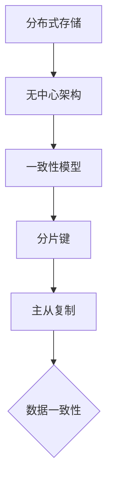

# Cassandra原理与代码实例讲解

> 关键词：Cassandra, 分布式数据库, NoSQL, 数据模型, 分片键, 分布式一致性, 伪一致性, 集群架构

## 1. 背景介绍

随着互联网的快速发展，数据量呈指数级增长，传统的数据库架构已无法满足大规模数据存储和快速访问的需求。NoSQL数据库应运而生，其中Cassandra作为一种分布式、高性能、高可用性的NoSQL数据库，被广泛应用于分布式系统中。本文将深入探讨Cassandra的原理，并通过代码实例进行详细讲解。

## 2. 核心概念与联系

### 2.1 核心概念

Cassandra的核心概念包括：

- **分布式存储**：Cassandra将数据分布存储在多个节点上，实现数据的高可用性和扩展性。
- **无中心架构**：Cassandra没有中心节点，所有节点地位平等，易于扩展和维护。
- **一致性模型**：Cassandra采用一种称为“一致性级别”的概念，以平衡一致性和性能。
- **分片键**：分片键用于确定数据的分区，是Cassandra查询性能的关键。
- **主从复制**：Cassandra采用主从复制机制，保证数据在不同节点之间的同步。

### 2.2 核心概念原理和架构的 Mermaid 流程图



### 2.3 核心概念联系

Cassandra通过分布式存储和无中心架构实现高可用性和扩展性，一致性模型和分片键保证数据高效访问，主从复制确保数据一致性。

## 3. 核心算法原理 & 具体操作步骤

### 3.1 算法原理概述

Cassandra的核心算法包括：

- **一致性哈希**：用于确定数据存储在哪个节点上。
- **分布式一致性协议**：保证数据在不同节点之间的同步。
- **分区策略**：确定数据如何在多个节点之间分布。

### 3.2 算法步骤详解

#### 3.2.1 一致性哈希

Cassandra使用一致性哈希算法确定数据存储位置。一致性哈希将数据存储空间划分为多个虚拟节点，每个数据对应一个虚拟节点，数据存储在对应的虚拟节点上。

#### 3.2.2 分布式一致性协议

Cassandra采用Raft或Paxos算法保证分布式一致性。Raft算法通过领导者选举和日志复制机制保证数据一致性。

#### 3.2.3 分区策略

Cassandra的分区策略决定了数据如何在多个节点之间分布。常见的分区策略包括：

- **随机分区**：随机选择一个节点存储数据。
- **范围分区**：根据数据的范围值存储数据。
- **列表分区**：根据预定义的列表存储数据。

### 3.3 算法优缺点

#### 3.3.1 优点

- 高可用性：无中心架构，节点故障不会影响整个系统。
- 高扩展性：易于水平扩展，提高系统性能。
- 高性能：分布式存储和缓存机制提高数据访问速度。

#### 3.3.2 缺点

- 数据一致性：Cassandra采用弱一致性模型，可能存在短暂的数据不一致。
- 复杂性：Cassandra架构复杂，需要一定的学习成本。

### 3.4 算法应用领域

Cassandra广泛应用于以下领域：

- 大数据存储：处理大规模数据存储需求。
- 实时查询：提供快速的读写性能。
- 分布式缓存：提高数据访问速度。

## 4. 数学模型和公式 & 详细讲解 & 举例说明

### 4.1 数学模型构建

Cassandra的数学模型主要包括：

- **一致性哈希**：使用哈希函数将数据映射到虚拟节点上。
- **Raft算法**：使用状态机复制数据。

### 4.2 公式推导过程

#### 4.2.1 一致性哈希

一致性哈希公式：

$$
H(k) = (k \mod 2^{m})
$$

其中，$H(k)$ 为哈希函数，$k$ 为数据键，$m$ 为虚拟节点数量。

#### 4.2.2 Raft算法

Raft算法的复制状态机公式：

$$
F(S) = S_{prev} + \bigcup_{i=1}^{n} \Delta_{i}
$$

其中，$S$ 为状态机，$S_{prev}$ 为前一个状态机，$\Delta_{i}$ 为第 $i$ 次更新。

### 4.3 案例分析与讲解

假设有一个包含10个虚拟节点的Cassandra集群，数据键为 "key1"，使用一致性哈希算法确定数据存储位置。

根据一致性哈希公式：

$$
H(key1) = (key1 \mod 2^{10}) = 1
$$

因此，数据 "key1" 将存储在虚拟节点1上。

## 5. 项目实践：代码实例和详细解释说明

### 5.1 开发环境搭建

1. 安装Java开发环境。
2. 安装Cassandra服务端和客户端。

### 5.2 源代码详细实现

以下是一个简单的Cassandra Java客户端代码示例：

```java
import com.datastax.driver.core.Cluster;
import com.datastax.driver.core.Session;

public class CassandraExample {
    public static void main(String[] args) {
        // 连接Cassandra集群
        Cluster cluster = Cluster.builder().addContactPoint("127.0.0.1").build();
        Session session = cluster.connect();

        // 创建键空间
        session.execute("CREATE KEYSPACE IF NOT EXISTS example WITH replication = {'class':'SimpleStrategy', 'replication_factor':'3'}");

        // 使用键空间
        session.setKeyspace("example");

        // 创建表
        session.execute("CREATE TABLE IF NOT EXISTS users (id int PRIMARY KEY, name text, age int)");

        // 插入数据
        session.execute("INSERT INTO users (id, name, age) VALUES (1, 'Alice', 30)");
        session.execute("INSERT INTO users (id, name, age) VALUES (2, 'Bob', 25)");

        // 查询数据
        ResultSet results = session.execute("SELECT * FROM users");
        for (Row row : results) {
            System.out.println("ID: " + row.getInt("id") + ", Name: " + row.getString("name") + ", Age: " + row.getInt("age"));
        }

        // 关闭连接
        session.close();
        cluster.close();
    }
}
```

### 5.3 代码解读与分析

以上代码展示了如何使用Cassandra Java客户端连接集群、创建键空间和表、插入和查询数据。通过简单的几行代码，我们可以完成Cassandra的基本操作。

### 5.4 运行结果展示

运行以上代码，将在Cassandra集群中创建一个名为 "example" 的键空间，并在 "users" 表中插入两条记录。查询结果将打印在控制台上。

## 6. 实际应用场景

Cassandra在以下场景中具有广泛的应用：

- 大数据存储：处理大规模数据存储需求，如日志存储、用户数据存储等。
- 实时查询：提供快速的读写性能，如搜索引擎、推荐系统等。
- 分布式缓存：提高数据访问速度，如缓存热点数据、减少数据库压力等。

## 7. 工具和资源推荐

### 7.1 学习资源推荐

- 《Cassandra权威指南》
- Apache Cassandra官方文档
- Cassandra社区论坛

### 7.2 开发工具推荐

- DataStax DevCenter：Cassandra开发工具
- DBeaver：Cassandra数据库管理工具

### 7.3 相关论文推荐

- Apache Cassandra一致性模型
- Apache Cassandra性能分析

## 8. 总结：未来发展趋势与挑战

### 8.1 研究成果总结

本文深入介绍了Cassandra的原理和应用，并通过代码实例进行了详细讲解。Cassandra作为一种高性能、高可用的NoSQL数据库，在分布式系统中具有广泛的应用前景。

### 8.2 未来发展趋势

- 优化一致性模型，提高数据一致性。
- 加强与大数据生态系统的集成，如Hadoop、Spark等。
- 提高性能和可扩展性，满足更大规模的数据存储需求。

### 8.3 面临的挑战

- 处理数据安全性问题，如数据加密、访问控制等。
- 提高数据备份和恢复效率。
- 优化监控和管理工具。

### 8.4 研究展望

Cassandra将继续优化其核心算法和架构，提高性能和可扩展性，并与大数据生态系统深度融合，为用户提供更加高效、可靠的分布式数据存储解决方案。

## 9. 附录：常见问题与解答

**Q1：Cassandra与传统的数据库相比有哪些优势？**

A：Cassandra具有以下优势：

- 分布式存储：提高数据可用性和扩展性。
- 无中心架构：易于扩展和维护。
- 高性能：提供快速的读写性能。

**Q2：Cassandra的一致性模型是什么？**

A：Cassandra采用一致性级别概念，以平衡一致性和性能。常见的一致性级别包括：

- 一致性级别1：单节点确认。
- 一致性级别2：多数节点确认。
- 一致性级别3：所有节点确认。

**Q3：如何提高Cassandra的性能？**

A：提高Cassandra性能的方法包括：

- 选择合适的分区策略。
- 优化索引。
- 使用缓存机制。

**Q4：Cassandra如何处理数据安全性问题？**

A：Cassandra处理数据安全性的方法包括：

- 数据加密：对存储在磁盘上的数据进行加密。
- 访问控制：限制用户访问数据的权限。

**Q5：Cassandra是否支持事务？**

A：Cassandra不支持传统的事务，但支持一些轻量级的事务功能，如时间戳和范围查询。

---

作者：禅与计算机程序设计艺术 / Zen and the Art of Computer Programming