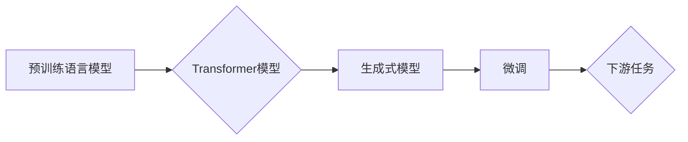

# GPT-3原理与代码实例讲解

> 关键词：GPT-3, Transformer, 语言模型, 预训练, 微调, 自然语言处理, NLP, 代码实例

## 1. 背景介绍

GPT-3（Generative Pre-trained Transformer 3）是由OpenAI于2020年推出的第三代预训练语言模型，其参数规模达到了1750亿，是目前最大的语言模型之一。GPT-3在多个自然语言处理（NLP）任务上取得了显著的成果，引起了全球范围内的关注和研究。本文将深入探讨GPT-3的原理、模型结构、训练过程和代码实例，帮助读者更好地理解和应用GPT-3。

## 2. 核心概念与联系

### 2.1 核心概念

- **预训练语言模型**：通过在大量无标注文本上训练，学习通用语言表示的模型。
- **Transformer模型**：一种基于自注意力机制的神经网络模型，能够捕捉序列数据中的长距离依赖关系。
- **生成式模型**：能够生成文本、图像、音频等数据的模型。
- **微调**：在预训练模型的基础上，使用标注数据进行有监督的训练，以适应特定任务。

### 2.2 架构Mermaid流程图



## 3. 核心算法原理 & 具体操作步骤

### 3.1 算法原理概述

GPT-3是基于Transformer模型构建的预训练语言模型。它采用无监督学习的方式，通过在大量无标注文本上训练，学习通用语言表示，从而具备强大的语言理解和生成能力。

### 3.2 算法步骤详解

1. **数据收集与预处理**：收集大量的文本数据，包括书籍、新闻、文章等，并进行预处理，如分词、去噪等。
2. **模型训练**：使用Transformer模型在预处理后的数据上进行预训练，学习通用语言表示。
3. **模型优化**：通过微调等手段，优化模型在特定任务上的性能。

### 3.3 算法优缺点

**优点**：

- **强大的语言理解能力**：GPT-3在多个NLP任务上取得了显著的成果，如文本分类、问答、文本摘要等。
- **良好的泛化能力**：GPT-3能够在不同的任务上取得较好的效果，无需针对每个任务进行大量调整。
- **易于扩展**：GPT-3的结构简单，易于扩展和改进。

**缺点**：

- **训练成本高**：GPT-3需要大量的计算资源和时间进行训练。
- **数据隐私问题**：预训练过程中使用的文本数据可能包含敏感信息。
- **模型可解释性差**：GPT-3的决策过程缺乏可解释性，难以理解其内部工作机制。

### 3.4 算法应用领域

- **文本生成**：如自动写作、机器翻译、对话系统等。
- **文本分类**：如情感分析、主题分类、垃圾邮件检测等。
- **问答系统**：如自动问答、信息检索等。
- **文本摘要**：如自动生成摘要、新闻摘要等。

## 4. 数学模型和公式 & 详细讲解 & 举例说明

### 4.1 数学模型构建

GPT-3的数学模型基于Transformer模型，其核心思想是自注意力机制。

### 4.2 公式推导过程

自注意力机制的计算公式如下：

$$
\text{Attention}(Q, K, V) = \text{softmax}(\frac{QK^T}{\sqrt{d_k}})V
$$

其中：

- $Q$ 表示查询向量，代表输入序列中每个token的表示。
- $K$ 表示键向量，代表输入序列中每个token的表示。
- $V$ 表示值向量，代表输入序列中每个token的表示。
- $d_k$ 表示键向量的维度。

### 4.3 案例分析与讲解

以下是一个简单的GPT-3代码实例，用于生成文本：

```python
import openai

# 使用OpenAI API
openai.api_key = 'your-api-key'

# 定义生成文本的函数
def generate_text(prompt):
    response = openai.Completion.create(
        engine="davinci",
        prompt=prompt,
        max_tokens=50
    )
    return response.choices[0].text.strip()

# 生成文本
prompt = "Tell me a joke about AI."
text = generate_text(prompt)
print(text)
```

## 5. 项目实践：代码实例和详细解释说明

### 5.1 开发环境搭建

1. 安装Python：下载并安装Python 3.6及以上版本。
2. 安装OpenAI Python客户端：使用pip安装`openai`库。

### 5.2 源代码详细实现

以上是GPT-3生成文本的代码实例。首先，使用OpenAI API的密钥进行认证。然后，定义一个生成文本的函数`generate_text`，该函数使用OpenAI API生成文本。最后，调用该函数生成一个关于AI的笑话。

### 5.3 代码解读与分析

- `openai.api_key = 'your-api-key'`：设置OpenAI API密钥。
- `openai.Completion.create()`：创建一个Completion对象，用于生成文本。
- `prompt`：输入文本，用于生成文本。
- `max_tokens`：生成的文本的最大长度。

## 6. 实际应用场景

GPT-3在多个实际应用场景中取得了显著的效果，以下是一些典型应用：

- **自动写作**：自动生成新闻、文章、博客等内容。
- **机器翻译**：将一种语言的文本翻译成另一种语言。
- **对话系统**：构建智能对话系统，如虚拟助手、聊天机器人等。
- **文本分类**：对文本进行分类，如情感分析、主题分类等。
- **问答系统**：构建自动问答系统，如信息检索、知识库等。

## 7. 工具和资源推荐

### 7.1 学习资源推荐

- 《Transformers：The Power of Attentive Neural Networks》
- 《Attention is All You Need》
- 《Natural Language Processing with Transformers》

### 7.2 开发工具推荐

- OpenAI API
- Transformers库

### 7.3 相关论文推荐

- `Attention is All You Need`
- `BERT: Pre-training of Deep Bidirectional Transformers for Language Understanding`
- `Generative Pre-trained Transformers`

## 8. 总结：未来发展趋势与挑战

### 8.1 研究成果总结

GPT-3是预训练语言模型的一个重要里程碑，它在NLP领域取得了显著的成果，并为未来的研究提供了宝贵的经验和启示。

### 8.2 未来发展趋势

- **模型规模将继续扩大**：随着计算能力的提升，预训练语言模型的规模将继续扩大，以学习更丰富的语言知识。
- **模型结构将更加多样化**：为了适应不同的任务和需求，模型结构将更加多样化，如多模态模型、强化学习模型等。
- **模型可解释性将得到提高**：随着研究的深入，模型的可解释性将得到提高，有助于理解模型的决策过程。

### 8.3 面临的挑战

- **计算资源需求**：预训练语言模型的训练需要大量的计算资源，这对硬件设备和能源消耗提出了挑战。
- **数据隐私问题**：预训练过程中使用的文本数据可能包含敏感信息，需要采取措施保护数据隐私。
- **模型伦理问题**：预训练语言模型可能学习到偏见和歧视，需要采取措施避免这些问题。

### 8.4 研究展望

GPT-3的成功为NLP领域的研究和应用提供了新的方向。未来，随着研究的深入，预训练语言模型将在更多领域发挥作用，为人类带来更多便利。

## 9. 附录：常见问题与解答

**Q1：GPT-3与BERT的区别是什么？**

A：GPT-3和BERT都是预训练语言模型，但它们的结构和训练方法有所不同。GPT-3采用自回归的方式，而BERT采用掩码语言模型（Masked Language Model）的方式。

**Q2：GPT-3如何处理长文本？**

A：GPT-3能够处理较长的文本，但需要注意以下问题：

- **内存限制**：长文本的输入可能导致内存不足，需要采取适当的处理方式。
- **处理效率**：长文本的处理效率较低，需要采取适当的优化策略。

**Q3：如何评估GPT-3的性能？**

A：评估GPT-3的性能可以通过以下方式：

- **下游任务性能**：在多个NLP任务上评估GPT-3的性能，如文本分类、问答、文本摘要等。
- **人类评估**：邀请人类评估GPT-3生成的文本质量。

**Q4：GPT-3有哪些潜在风险？**

A：GPT-3的潜在风险包括：

- **生成有害内容**：GPT-3可能生成歧视性、攻击性等有害内容。
- **泄露敏感信息**：GPT-3可能泄露用户的隐私信息。
- **滥用**：GPT-3可能被用于恶意目的。

**Q5：如何降低GPT-3的风险？**

A：为了降低GPT-3的风险，可以采取以下措施：

- **内容过滤**：对生成的文本进行过滤，避免生成有害内容。
- **数据脱敏**：对输入数据进行处理，避免泄露敏感信息。
- **伦理审查**：对GPT-3的应用进行伦理审查。

---

作者：禅与计算机程序设计艺术 / Zen and the Art of Computer Programming