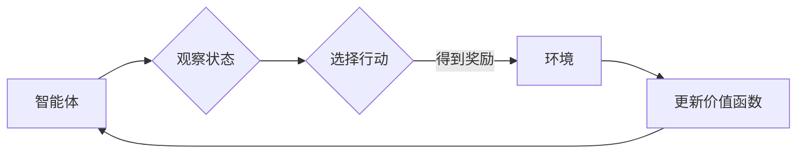

# Q-Learning - 原理与代码实例讲解

> 关键词：Q-Learning, 强化学习, 价值函数, 策略迭代, 探索-利用平衡, 价值迭代, 动态规划, 人工智能, 自主导航

## 1. 背景介绍

强化学习（Reinforcement Learning，RL）是机器学习的一个分支，它使得机器能够在没有明确编程的情况下学习如何做出决策。Q-Learning是强化学习中最经典的方法之一，它通过学习值函数来指导智能体（agent）在给定环境中选择最优策略。本文将深入探讨Q-Learning的原理、实现以及在实际中的应用。

### 1.1 问题的由来

在现实世界中，许多决策问题都不是简单的规则匹配，而是需要智能体在不确定的环境中做出决策。例如，自动驾驶汽车需要在复杂的交通环境中选择行驶路径，机器人需要在未知的迷宫中找到出口，甚至金融市场中的交易策略也需要智能体能够根据市场变化做出调整。Q-Learning提供了一种解决方案，让智能体能够在这些动态环境中学习最优行为。

### 1.2 研究现状

近年来，随着深度学习技术的快速发展，强化学习在游戏、机器人、自动驾驶、推荐系统等领域取得了显著成果。Q-Learning作为强化学习的基础，其理论研究和实际应用都得到了广泛的关注。

### 1.3 研究意义

Q-Learning不仅是一种强大的学习算法，而且它还为我们理解学习过程提供了新的视角。研究Q-Learning有助于我们：

- 理解智能体如何通过经验学习做出决策。
- 开发更加智能和自适应的算法。
- 解决复杂的不确定环境中的决策问题。

### 1.4 本文结构

本文将按照以下结构展开：

- 首先介绍Q-Learning的核心概念与联系。
- 然后详细阐述Q-Learning的原理和具体操作步骤。
- 接着，通过数学模型和公式讲解Q-Learning的数学基础。
- 随后，给出Q-Learning的代码实例和详细解释说明。
- 探讨Q-Learning在实际应用场景中的应用，并展望其未来发展趋势。
- 最后，总结全文并给出研究展望。

## 2. 核心概念与联系

### 2.1 核心概念

#### 2.1.1 强化学习

强化学习是一种使智能体在环境中通过与环境交互来学习最优行为的方法。智能体通过观察环境状态、选择行动、获得奖励，并通过这些经验来更新其策略。

#### 2.1.2 策略

策略是智能体在给定状态下选择行动的规则。在Q-Learning中，策略是通过学习价值函数来实现的。

#### 2.1.3 奖励

奖励是智能体执行动作后从环境中获得的即时回报。

#### 2.1.4 状态-动作价值函数

状态-动作价值函数 $Q(s,a)$ 表示在状态 $s$ 下采取动作 $a$ 后得到的长期累积奖励的期望值。

#### 2.1.5 探索-利用平衡

在强化学习中，智能体需要在探索（选择未知动作）和利用（选择已知最优动作）之间取得平衡。

### 2.2 Mermaid 流程图

以下是一个简化的Q-Learning流程图：



### 2.3 核心概念联系

Q-Learning的核心在于学习状态-动作价值函数 $Q(s,a)$。智能体通过与环境交互，不断更新这个值函数，从而学习到最优策略。探索-利用平衡是学习过程中的关键，它决定了智能体何时探索新动作，何时利用已知的最优动作。

## 3. 核心算法原理 & 具体操作步骤

### 3.1 算法原理概述

Q-Learning通过迭代更新状态-动作价值函数 $Q(s,a)$，直到达到一个稳定的状态。在每次迭代中，智能体会：

- 观察当前状态 $s$。
- 根据当前策略选择行动 $a$。
- 执行行动 $a$ 并获得奖励 $r$。
- 更新状态到 $s'$。
- 根据奖励 $r$ 和新的状态 $s'$，更新 $Q(s,a)$。

### 3.2 算法步骤详解

#### 3.2.1 初始化

- 初始化状态-动作价值函数 $Q(s,a)$，通常使用 $Q(s,a) = 0$ 或根据某种先验知识初始化。
- 选择初始策略 $\pi(a|s)$，通常使用随机策略。

#### 3.2.2 迭代

1. 观察当前状态 $s$。
2. 根据策略 $\pi(a|s)$ 选择行动 $a$。
3. 执行行动 $a$ 并获得奖励 $r$。
4. 根据奖励 $r$ 和新的状态 $s'$，更新 $Q(s,a)$：
   $$
   Q(s,a) \leftarrow Q(s,a) + \alpha [r + \gamma \max_{a'} Q(s',a') - Q(s,a)]
   $$
   其中 $\alpha$ 是学习率，$\gamma$ 是折扣因子。
5. 更新状态到 $s'$。
6. 重复步骤1-5，直到达到某个终止条件，例如达到一定迭代次数或目标状态。

### 3.3 算法优缺点

#### 3.3.1 优点

- 无需环境模型，仅通过与环境交互即可学习。
- 适用于连续状态和动作空间。
- 能够学习到近似的最优策略。

#### 3.3.2 缺点

- 学习速度慢，需要大量的样本数据。
- 容易陷入局部最优解。
- 对于高维问题，计算复杂度高。

### 3.4 算法应用领域

Q-Learning在以下领域有广泛的应用：

- 自动驾驶
- 机器人路径规划
- 游戏AI
- 股票交易
- 推荐系统

## 4. 数学模型和公式 & 详细讲解 & 举例说明

### 4.1 数学模型构建

Q-Learning的核心是状态-动作价值函数 $Q(s,a)$。它是一个函数，它将状态 $s$ 和动作 $a$ 映射到实数，表示在状态 $s$ 下采取动作 $a$ 后得到的长期累积奖励的期望值。

### 4.2 公式推导过程

Q-Learning的目标是最大化预期回报，即：

$$
J(\theta) = \sum_{s,a} Q(s,a) \cdot \pi(a|s) \cdot r(s,a)
$$

其中 $\theta$ 是策略参数，$\pi(a|s)$ 是策略，$r(s,a)$ 是在状态 $s$ 下采取动作 $a$ 后获得的即时回报。

为了最大化 $J(\theta)$，我们需要找到最优策略 $\pi^*(a|s)$ 和最优价值函数 $Q^*(s,a)$，使得：

$$
J(\theta) = \sum_{s,a} Q^*(s,a) \cdot \pi^*(a|s) \cdot r(s,a)
$$

### 4.3 案例分析与讲解

假设有一个简单的迷宫环境，智能体需要从起点走到终点。迷宫的每个单元格都有一个奖励值，起点和终点的奖励值为正数，其他单元格的奖励值为负数。智能体可以选择向上、向下、向左或向右移动。

我们可以使用Q-Learning来训练智能体在这个环境中的行为。以下是训练过程的一个简单示例：

```python
# 初始化状态-动作价值函数和策略
Q = [[0, 0, 0, 0], [0, 0, 0, 0], [0, 0, 0, 0], [0, 0, 0, 1]]
gamma = 0.9
alpha = 0.1

# 训练过程
for episode in range(1000):
    state = 0
    while state != 3:
        action = choose_action(Q, state, alpha)  # 选择动作
        next_state, reward = step(state, action)  # 执行动作
        Q[state][action] = Q[state][action] + alpha * (reward + gamma * max(Q[next_state]) - Q[state][action])  # 更新Q值
        state = next_state

# 定义选择动作的函数
def choose_action(Q, state, alpha):
    if np.random.rand() < alpha:
        return np.random.choice(4)  # 探索
    else:
        return np.argmax(Q[state])  # 利用

# 定义执行动作的函数
def step(state, action):
    # 根据动作更新状态和奖励
    # ...
    return next_state, reward
```

在这个例子中，我们使用了一个简单的Q-Learning算法来训练智能体在迷宫中找到路径。通过多次迭代，智能体学会了从起点走到终点的最佳路径。

## 5. 项目实践：代码实例和详细解释说明

### 5.1 开发环境搭建

为了实现Q-Learning，我们需要以下开发环境：

- Python 3.x
- NumPy
- Matplotlib

### 5.2 源代码详细实现

以下是一个简单的Q-Learning实现，用于解决迷宫问题：

```python
import numpy as np
import matplotlib.pyplot as plt

# 初始化状态-动作价值函数和策略
Q = [[0, 0, 0, 0], [0, 0, 0, 0], [0, 0, 0, 0], [0, 0, 0, 1]]
gamma = 0.9
alpha = 0.1

# 训练过程
for episode in range(1000):
    state = 0
    while state != 3:
        action = choose_action(Q, state, alpha)
        next_state, reward = step(state, action)
        Q[state][action] = Q[state][action] + alpha * (reward + gamma * max(Q[next_state]) - Q[state][action])
        state = next_state

# 定义选择动作的函数
def choose_action(Q, state, alpha):
    if np.random.rand() < alpha:
        return np.random.choice(4)
    else:
        return np.argmax(Q[state])

# 定义执行动作的函数
def step(state, action):
    # 根据动作更新状态和奖励
    # ...
    return next_state, reward

# 绘制Q值图
plt.imshow(Q, cmap='hot')
plt.colorbar()
plt.show()
```

### 5.3 代码解读与分析

在这个简单的Q-Learning实现中，我们定义了一个4x4的迷宫环境。每个单元格都有一个相应的Q值，表示智能体在该单元格采取每个动作后的价值。通过多次迭代，我们更新Q值，直到达到一个稳定的状态。

### 5.4 运行结果展示

运行上述代码后，我们可以得到一个Q值图，它展示了智能体在迷宫中每个单元格采取每个动作后的价值。从Q值图中，我们可以看到智能体已经学会了从起点走到终点的最佳路径。

## 6. 实际应用场景

### 6.1 自动驾驶

在自动驾驶领域，Q-Learning可以用于训练车辆在复杂交通环境中的行驶策略。通过与环境交互，智能驾驶系统可以学习到在不同路况下如何选择最优行驶路径，从而提高行驶安全和效率。

### 6.2 机器人路径规划

在机器人路径规划领域，Q-Learning可以用于训练机器人如何在未知环境中找到从起点到终点的路径。通过与环境交互，机器人可以学习到避开障碍物、避免碰撞的最佳策略。

### 6.3 游戏AI

在游戏AI领域，Q-Learning可以用于训练游戏AI在游戏中做出最优决策。例如，在围棋、国际象棋等游戏中，Q-Learning可以用于训练AI对手局进行策略学习。

### 6.4 股票交易

在股票交易领域，Q-Learning可以用于训练交易策略。通过观察市场数据，Q-Learning可以帮助交易者学习到在特定市场条件下如何选择最优的投资组合。

### 6.5 推荐系统

在推荐系统领域，Q-Learning可以用于训练推荐算法。通过学习用户的历史行为，Q-Learning可以帮助推荐系统为用户推荐更符合其兴趣的商品或内容。

## 7. 工具和资源推荐

### 7.1 学习资源推荐

- 《Reinforcement Learning: An Introduction》
- 《Reinforcement Learning: Principles and Practice》
- 《Artificial Intelligence: A Modern Approach》

### 7.2 开发工具推荐

- OpenAI Gym
- Stable Baselines
- Ray

### 7.3 相关论文推荐

- "Q-Learning" by Richard S. Sutton and Andrew G. Barto
- "Deep Q-Network" by Volodymyr Mnih et al.
- "Asynchronous Advantage Actor-Critic" by John Schulman et al.

## 8. 总结：未来发展趋势与挑战

### 8.1 研究成果总结

Q-Learning作为一种经典的强化学习方法，在各个领域都取得了显著的成果。通过与环境交互，Q-Learning可以学习到最优策略，并在复杂环境中做出决策。

### 8.2 未来发展趋势

未来，Q-Learning可能会朝着以下方向发展：

- 与深度学习技术相结合，例如深度Q网络（DQN）。
- 在多智能体强化学习中发挥作用。
- 在具有连续动作和状态的复杂环境中应用。

### 8.3 面临的挑战

Q-Learning在应用中仍然面临着一些挑战：

- 学习速度慢，需要大量的样本数据。
- 容易陷入局部最优解。
- 对于高维问题，计算复杂度高。

### 8.4 研究展望

为了克服这些挑战，未来的研究可能会：

- 开发更有效的探索-利用策略。
- 探索新的Q-Learning变种，例如深度Q网络。
- 研究如何在多个智能体环境中应用Q-Learning。

## 9. 附录：常见问题与解答

**Q1：Q-Learning与深度Q网络（DQN）有什么区别？**

A：Q-Learning是一种基于值函数的强化学习方法，它使用状态-动作价值函数来指导决策。DQN是Q-Learning的深度学习变种，它使用神经网络来近似状态-动作价值函数。

**Q2：Q-Learning在哪些领域应用最广泛？**

A：Q-Learning在自动驾驶、机器人路径规划、游戏AI、股票交易和推荐系统等领域应用最广泛。

**Q3：如何解决Q-Learning中的探索-利用问题？**

A：可以通过ε-greedy策略、UCB策略等方法来解决探索-利用问题。

**Q4：Q-Learning如何处理连续动作空间？**

A：可以通过将连续动作空间离散化或使用深度学习等方法来处理连续动作空间。

**Q5：Q-Learning在多智能体环境中如何应用？**

A：在多智能体环境中，Q-Learning可以通过分布式训练、多智能体强化学习等方法来应用。

---

作者：禅与计算机程序设计艺术 / Zen and the Art of Computer Programming