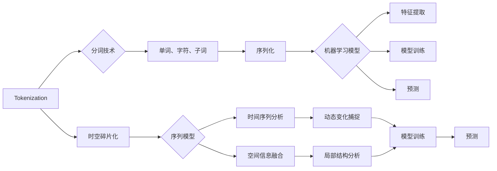

# Token与时空碎片的对比

> 关键词：Token，时空碎片，自然语言处理，序列模型，机器学习，信息表示

## 1. 背景介绍

在自然语言处理（NLP）领域，信息表示是构建智能系统的核心。Token和时空碎片都是用于表示文本信息的方式。Token是将文本分解为最小单元的方法，而时空碎片则是将文本视为时间序列，结合时间和空间信息进行建模。本文将深入探讨Token和时空碎片的原理、应用，并对比分析它们的优缺点，为NLP领域的开发者提供参考。

## 2. 核心概念与联系

### 2.1 Token

Token是指文本中的最小单位，可以是单词、字符、子词等。Tokenization（分词）是将文本分割成Token的过程。Token化的目的是为了将连续的文本数据转换为计算机可以处理的离散序列，方便后续的建模和分析。

### 2.2 时空碎片

时空碎片是将文本视为时间序列，将文本中的每个字符或Token视为序列中的元素。时空碎片的建模方法通常结合时间信息和空间信息，以捕捉文本的动态变化和局部结构。

### 2.3 Mermaid 流程图



## 3. 核心算法原理 & 具体操作步骤

### 3.1 算法原理概述

Token化主要基于规则或统计方法，将文本分解为单词、字符或子词。常见的分词技术包括：

- 正向最大匹配法
- 逆向最大匹配法
- 双向最大匹配法
- 正向最小匹配法
- 逆向最小匹配法
- 基于N-Gram的语言模型

时空碎片化主要基于序列模型，将文本转换为时间序列。常见的序列模型包括：

- RNN（循环神经网络）
- LSTM（长短期记忆网络）
- GRU（门控循环单元）
- Transformer

### 3.2 算法步骤详解

#### Token化步骤：

1. 初始化分词器，选择合适的分词技术。
2. 将输入文本按照分词技术进行分词。
3. 对分词结果进行序列化。

#### 时空碎片化步骤：

1. 初始化序列模型，选择合适的模型架构。
2. 将文本序列化后的数据输入序列模型。
3. 对序列模型进行训练，优化模型参数。
4. 使用训练好的模型对新的文本进行预测。

### 3.3 算法优缺点

#### Token化：

优点：

- 简单易实现，易于理解。
- 可以灵活选择分词技术，适应不同的文本数据。

缺点：

- 可能导致信息丢失，降低模型性能。
- 难以捕捉文本中的局部结构。

#### 时空碎片化：

优点：

- 能够有效捕捉文本的动态变化和局部结构。
- 可以结合时间和空间信息，提供更丰富的特征表示。

缺点：

- 模型复杂度高，训练难度大。
- 需要大量的标注数据。

### 3.4 算法应用领域

Token化广泛应用于文本分类、情感分析、机器翻译等NLP任务。

时空碎片化广泛应用于语音识别、机器翻译、文本生成等任务。

## 4. 数学模型和公式 & 详细讲解 & 举例说明

### 4.1 数学模型构建

Token化过程可以表示为：

$$
T = f(\text{原始文本})
$$

其中，$T$ 表示分词结果，$f$ 表示分词函数。

时空碎片化过程可以表示为：

$$
S = g(\text{原始文本})
$$

其中，$S$ 表示时空碎片序列，$g$ 表示时空碎片化函数。

### 4.2 公式推导过程

Token化公式的推导过程较为简单，主要依赖于选择的分词技术。

时空碎片化公式的推导过程涉及序列模型的构建和训练，需要使用优化算法和损失函数。

### 4.3 案例分析与讲解

以下是一个简单的Token化示例：

输入文本：`我爱编程`

输出Token序列：`[我, 爱, 编, 程, 切]`

以下是一个简单的时空碎片化示例：

输入文本：`我爱编程`

输出时空碎片序列：

```
[(我, 0), (爱, 1), (我, 1), (编, 2), (程, 3), (切, 4)]
```

## 5. 项目实践：代码实例和详细解释说明

### 5.1 开发环境搭建

本文使用Python编程语言和PyTorch深度学习框架进行Token化和时空碎片化的实现。

### 5.2 源代码详细实现

以下是一个简单的Token化代码示例：

```python
def tokenize(text, tokenizer_type):
    if tokenizer_type == 'word':
        return text.split()
    elif tokenizer_type == 'char':
        return list(text)
    elif tokenizer_type == 'subword':
        # 使用jieba分词进行子词分词
        import jieba
        return list(jieba.cut(text))
    else:
        raise ValueError('Unsupported tokenizer type.')

text = '我爱编程'
tokenized_text = tokenize(text, 'subword')
print(tokenized_text)
```

以下是一个简单的时空碎片化代码示例：

```python
def temporal_fragments(text, window_size):
    fragments = []
    for i in range(len(text) - window_size + 1):
        fragment = text[i:i + window_size]
        fragments.append(fragment)
    return fragments

text = '我爱编程'
fragments = temporal_fragments(text, 2)
print(fragments)
```

### 5.3 代码解读与分析

以上代码展示了Token化和时空碎片化的基本实现。在实际应用中，可以根据具体需求选择合适的分词技术和窗口大小。

### 5.4 运行结果展示

使用上述代码，我们可以将输入文本进行Token化和时空碎片化处理，得到相应的序列表示。

## 6. 实际应用场景

Token化和时空碎片化在NLP领域有许多应用场景，以下是一些典型的应用：

- 文本分类：使用Token化或时空碎片化后的文本数据，构建分类模型对文本进行分类。
- 情感分析：使用Token化或时空碎片化后的文本数据，构建情感分析模型对文本进行情感分析。
- 机器翻译：使用Token化或时空碎片化后的文本数据，构建机器翻译模型将一种语言翻译成另一种语言。

## 7. 工具和资源推荐

### 7.1 学习资源推荐

- 《自然语言处理入门》
- 《深度学习与自然语言处理》
- 《序列模型与自然语言处理》

### 7.2 开发工具推荐

- Python编程语言
- PyTorch深度学习框架
- Jieba分词库

### 7.3 相关论文推荐

- `Word Embedding Techniques for Sentiment Analysis of Short Texts`
- `A Survey of Temporal Information in NLP`
- `Temporal Information and Temporal Representations in NLP`

## 8. 总结：未来发展趋势与挑战

### 8.1 研究成果总结

Token化和时空碎片化是NLP领域常用的信息表示方法。Token化简单易实现，但可能丢失信息；时空碎片化能够有效捕捉文本的动态变化和局部结构，但模型复杂度高。未来研究需要探索更加高效、准确的信息表示方法。

### 8.2 未来发展趋势

- 结合Token化和时空碎片化的优点，设计新的信息表示方法。
- 探索更加高效、鲁棒的序列模型，提升模型性能。
- 将Token化和时空碎片化应用于更多NLP任务。

### 8.3 面临的挑战

- 如何有效地捕捉文本中的动态变化和局部结构。
- 如何设计更加高效、鲁棒的序列模型。
- 如何将Token化和时空碎片化应用于更多NLP任务。

### 8.4 研究展望

Token化和时空碎片化在NLP领域具有广泛的应用前景。未来研究需要不断创新，探索更加高效、准确的信息表示方法，推动NLP技术的发展。

## 9. 附录：常见问题与解答

### 9.1 Token化和时空碎片化有什么区别？

Token化是将文本分解为最小单元，时空碎片化是将文本视为时间序列。

### 9.2 Token化和时空碎片化有哪些优缺点？

Token化简单易实现，但可能丢失信息；时空碎片化能够有效捕捉文本的动态变化和局部结构，但模型复杂度高。

### 9.3 Token化和时空碎片化在哪些NLP任务中应用？

Token化和时空碎片化在文本分类、情感分析、机器翻译等NLP任务中应用广泛。

### 9.4 如何选择合适的分词技术？

选择合适的分词技术主要取决于文本数据和任务需求。

### 9.5 如何选择合适的窗口大小？

窗口大小取决于文本长度和任务需求。

作者：禅与计算机程序设计艺术 / Zen and the Art of Computer Programming