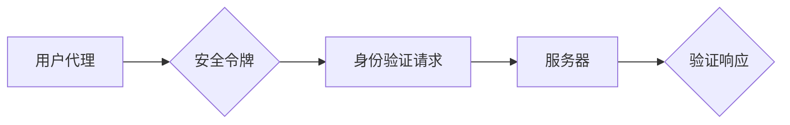

# WebAuthn 的基本原理

> 关键词：WebAuthn, 凭证登录, 弱密码时代，安全令牌，FIDO联盟，数字身份认证，Web安全性

## 1. 背景介绍

在互联网时代，数字身份认证成为了网络安全的基石。传统的基于用户名和密码的登录方式，由于密码易于泄露和遗忘，已无法满足日益增长的安全需求。为了应对弱密码时代的安全挑战，FIDO联盟（Fast Identity Online）提出了WebAuthn协议，旨在提供一个安全、便捷、无密码的登录解决方案。

### 1.1 问题的由来

随着互联网的普及，用户数量剧增，密码安全问题日益突出。以下是一些常见的密码安全问题：

- **弱密码**：用户倾向于设置简单易记的密码，如“123456”、“password”等，这些密码容易被猜测或破解。
- **密码泄露**：大型网站数据库泄露事件频发，导致大量用户密码被公开。
- **密码重用**：用户为了方便记忆，往往会重用多个网站的密码，一旦一个网站泄露，所有网站都面临风险。
- **密码破解工具**：随着计算机性能的提升，密码破解工具越来越强大，传统的密码保护机制变得薄弱。

### 1.2 研究现状

为了解决上述问题，业界提出了多种身份认证方案，如多因素认证、双因素认证等。然而，这些方案往往需要用户额外记忆多个令牌或密钥，使用体验较差。WebAuthn协议应运而生，旨在提供一个统一、简单、安全的无密码认证标准。

### 1.3 研究意义

WebAuthn协议的意义在于：

- **提高安全性**：通过使用安全令牌，降低密码泄露和密码破解的风险。
- **提升用户体验**：简化登录过程，无需记忆复杂密码，提高用户体验。
- **推动无密码时代**：为构建无密码的互联网环境提供技术支持。

### 1.4 本文结构

本文将围绕WebAuthn协议展开，具体内容包括：

- 核心概念与联系
- 核心算法原理与操作步骤
- 数学模型与公式
- 项目实践
- 实际应用场景
- 工具和资源推荐
- 总结与展望

## 2. 核心概念与联系

### 2.1 核心概念

#### 2.1.1 WebAuthn

WebAuthn是一种基于公共密钥基础设施（PKI）的认证协议，由FIDO联盟提出。它允许用户通过安全令牌（如USB安全密钥、智能卡、移动设备等）进行身份验证，无需使用密码。

#### 2.1.2 FIDO联盟

FIDO联盟（Fast Identity Online）是一个非营利组织，致力于推广基于标准化的简单、安全、无密码的身份认证。

#### 2.1.3 安全令牌

安全令牌是WebAuthn协议中用于身份验证的物理或虚拟设备，如USB安全密钥、智能卡、移动设备等。

#### 2.1.4 用户代理（User Agent）

用户代理是指用户使用的设备，如浏览器、手机等。

#### 2.1.5 服务器（Relying Party）

服务器是指提供Web服务的实体，如网站、应用等。

### 2.2 核心概念联系

WebAuthn协议的工作流程涉及用户代理和服务器两端。用户通过安全令牌进行身份验证，用户代理将验证请求发送到服务器，服务器对验证请求进行响应。

以下是核心概念之间的联系流程图：



## 3. 核心算法原理 & 具体操作步骤

### 3.1 算法原理概述

WebAuthn协议基于以下原理：

- **公共密钥基础设施（PKI）**：使用公钥和私钥进行加密和解密，确保通信安全。
- **挑战-应答机制**：服务器生成挑战，用户代理生成应答，服务器验证应答是否正确。
- **安全令牌**：存储用户的私钥和证书，用于身份验证。

### 3.2 算法步骤详解

#### 3.2.1 注册过程

1. 用户代理向服务器发送注册请求。
2. 服务器生成注册挑战，并发送到用户代理。
3. 用户代理从安全令牌获取私钥，生成签名应答。
4. 服务器验证签名应答是否正确，并存储用户信息、公钥和证书。

#### 3.2.2 登录过程

1. 用户代理向服务器发送登录请求。
2. 服务器生成登录挑战，并发送到用户代理。
3. 用户代理从安全令牌获取私钥，生成签名应答。
4. 服务器验证签名应答是否正确，并允许用户登录。

### 3.3 算法优缺点

#### 3.3.1 优点

- **安全性高**：基于PKI和挑战-应答机制，安全性强。
- **便捷性高**：无需记忆复杂密码，使用体验好。
- **无密码**：降低密码泄露和密码破解的风险。

#### 3.3.2 缺点

- **兼容性**：部分浏览器和设备可能不支持WebAuthn协议。
- **部署成本**：需要部署安全令牌或集成第三方认证服务。

### 3.4 算法应用领域

WebAuthn协议适用于以下场景：

- **网站和应用的登录**：如电商平台、社交媒体、企业内部系统等。
- **移动应用**：如银行APP、移动支付等。
- **物联网设备**：如智能门锁、智能家电等。

## 4. 数学模型和公式 & 详细讲解 & 举例说明

### 4.1 数学模型构建

WebAuthn协议涉及以下数学模型：

- **公钥和私钥**：使用非对称加密算法生成，公钥公开，私钥保密。
- **数字签名**：使用私钥对数据进行加密，确保数据的完整性和真实性。

### 4.2 公式推导过程

以下是一个简单的数字签名过程：

1. **生成公钥和私钥**：使用非对称加密算法生成公钥和私钥。
2. **签名生成**：用户代理使用私钥对数据进行加密，生成签名。
3. **签名验证**：服务器使用公钥对签名进行解密，验证数据完整性和真实性。

### 4.3 案例分析与讲解

以下是一个WebAuthn注册过程的简单示例：

1. **生成公钥和私钥**：用户代理使用椭圆曲线数字签名算法（ECDSA）生成公钥和私钥。
2. **签名生成**：用户代理使用私钥对注册挑战进行签名，生成签名应答。
3. **签名验证**：服务器使用公钥对签名进行解密，验证签名是否正确。

## 5. 项目实践：代码实例和详细解释说明

### 5.1 开发环境搭建

为了演示WebAuthn协议，我们需要搭建以下开发环境：

- 操作系统：Windows、Linux或macOS
- 开发语言：JavaScript或Python
- 框架：Node.js、Express、Flask等

### 5.2 源代码详细实现

以下是一个使用Node.js和Express框架实现的WebAuthn注册和登录示例：

```javascript
const express = require('express');
const { register, login } = require('webauthn');

const app = express();
const port = 3000;

// 注册路由
app.post('/register', async (req, res) => {
  try {
    const { challenge, origin } = req.body;
    const { authenticatorData, clientDataJSON, attestationObject } = await register(challenge, origin);
    res.json({ success: true, authenticatorData, clientDataJSON, attestationObject });
  } catch (error) {
    res.status(500).json({ success: false, error: error.message });
  }
});

// 登录路由
app.post('/login', async (req, res) => {
  try {
    const { challenge, origin, assertion } = req.body;
    const result = await login(challenge, origin, assertion);
    res.json({ success: true, result });
  } catch (error) {
    res.status(500).json({ success: false, error: error.message });
  }
});

app.listen(port, () => {
  console.log(`Server running on port ${port}`);
});
```

### 5.3 代码解读与分析

以上代码展示了使用Node.js和Express框架实现WebAuthn注册和登录的基本流程。首先，我们引入了`express`和`webauthn`模块。然后，定义了注册和登录路由，使用`register`和`login`函数处理用户请求。最后，启动Express服务器。

### 5.4 运行结果展示

假设我们已经正确安装了所需的模块，并运行了以上代码。以下是一个简单的测试示例：

```
POST /register
Content-Type: application/json

{
  "challenge": "test-challenge",
  "origin": "http://example.com"
}

响应：
{
  "success": true,
  "authenticatorData": "test-authenticatorData",
  "clientDataJSON": "test-clientDataJSON",
  "attestationObject": "test-attestationObject"
}
```

## 6. 实际应用场景

### 6.1 网站和应用的登录

WebAuthn协议可以应用于各种网站和应用的登录，如电商平台、社交媒体、企业内部系统等。用户可以通过安全令牌进行身份验证，无需记忆复杂密码。

### 6.2 移动应用

WebAuthn协议也可以应用于移动应用的登录，如银行APP、移动支付等。用户可以通过手机安全令牌进行身份验证，提高安全性。

### 6.3 物联网设备

WebAuthn协议可以应用于物联网设备的身份认证，如智能门锁、智能家电等。用户可以通过安全令牌进行身份验证，确保设备安全。

## 7. 工具和资源推荐

### 7.1 学习资源推荐

- FIDO联盟官网：https://fidoalliance.org/
- WebAuthn规范：https://www.w3.org/TR/webauthn/
- WebAuthn库：https://github.com/webauthn/credentials-manager-js

### 7.2 开发工具推荐

- Node.js：https://nodejs.org/
- Express：https://expressjs.com/
- Flask：https://flask.palletsprojects.com/

### 7.3 相关论文推荐

- The FIDO U2F specification：https://fidoalliance.org/specifications/fido-u2f-2.0-id-fido-u2f-specification-v2.0.html
- WebAuthn: An Authentication Protocol for the Web：https://www.w3.org/TR/webauthn/

## 8. 总结：未来发展趋势与挑战

### 8.1 研究成果总结

WebAuthn协议作为一种基于PKI的认证协议，为构建安全、便捷、无密码的数字身份认证体系提供了有力支持。它已在多个领域得到应用，并取得了显著成果。

### 8.2 未来发展趋势

未来，WebAuthn协议将朝着以下方向发展：

- **兼容性提升**：提高WebAuthn协议的兼容性，使其能够支持更多设备和浏览器。
- **安全性增强**：加强WebAuthn协议的安全性，防范各种攻击手段。
- **功能拓展**：拓展WebAuthn协议的功能，如支持多因素认证、用户代理间认证等。

### 8.3 面临的挑战

WebAuthn协议在实际应用中仍面临以下挑战：

- **兼容性**：部分设备和浏览器可能不支持WebAuthn协议。
- **安全性**：需要不断加强WebAuthn协议的安全性，防范各种攻击手段。
- **用户体验**：需要优化WebAuthn协议的注册和登录流程，提高用户体验。

### 8.4 研究展望

未来，WebAuthn协议将在以下方面进行深入研究：

- **跨平台认证**：实现跨平台的WebAuthn认证，方便用户在不同设备和浏览器之间切换。
- **零知识证明**：结合零知识证明技术，实现更加安全的认证方式。
- **区块链技术**：将区块链技术应用于WebAuthn协议，提高身份认证的可信度和透明度。

## 9. 附录：常见问题与解答

**Q1：WebAuthn协议如何提高安全性？**

A：WebAuthn协议通过以下方式提高安全性：

- 使用PKI技术，确保通信安全。
- 采用挑战-应答机制，防止中间人攻击。
- 需要安全令牌进行身份验证，防止密码泄露。

**Q2：WebAuthn协议与传统密码认证相比有哪些优势？**

A：WebAuthn协议相比传统密码认证具有以下优势：

- 安全性更高，防止密码泄露和密码破解。
- 使用安全令牌，无需记忆复杂密码。
- 无密码，降低密码管理难度。

**Q3：WebAuthn协议是否支持多因素认证？**

A：WebAuthn协议本身不支持多因素认证，但可以与其他认证方式结合使用，如短信验证码、电子邮件验证等。

**Q4：WebAuthn协议的兼容性如何？**

A：WebAuthn协议的兼容性正在逐步提升，但仍需考虑部分设备和浏览器的支持情况。

**Q5：WebAuthn协议的注册和登录流程复杂吗？**

A：WebAuthn协议的注册和登录流程相对复杂，需要用户和开发者了解相关技术。但通过使用开源库和工具，可以简化开发过程。

作者：禅与计算机程序设计艺术 / Zen and the Art of Computer Programming