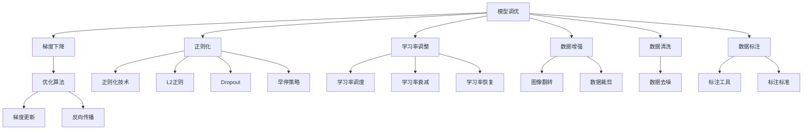

                 

## 1. 背景介绍

在人工智能领域，模型调优与数据处理是两个至关重要的环节。模型调优旨在通过调整模型参数和优化算法，提升模型的准确性和泛化能力；数据处理则涉及数据的收集、清洗、增强和标注，确保数据集质量，从而驱动模型性能。这两者相辅相成，共同支撑人工智能技术的进步。

在现代深度学习时代，模型调优与数据处理面临的挑战日益复杂。一方面，模型的复杂度不断增加，参数数量呈指数级增长；另一方面，数据的多样性和真实性要求也随之提升。本文将深入探讨这两个领域的挑战，并提出解决方案。

## 2. 核心概念与联系

### 2.1 核心概念概述

- **模型调优**：通过调整模型参数和优化算法，提升模型在特定任务上的性能。常见方法包括梯度下降、正则化、学习率调整等。
- **数据处理**：涉及数据的收集、清洗、增强和标注，确保数据集质量。包括数据清洗、数据增强、标注标准等环节。
- **深度学习框架**：如TensorFlow、PyTorch、Keras等，提供了丰富的API和工具支持模型调优和数据处理。
- **模型压缩与加速**：为了在资源受限的环境中提升模型性能，常常需要进行模型压缩和加速。

这些概念间的关系可以总结如下：

- **模型调优**和**数据处理**是驱动人工智能技术发展的两个关键环节。
- **深度学习框架**提供了工具支持，促进了模型调优和数据处理的自动化和高效性。
- **模型压缩与加速**技术能够优化模型性能，为实际应用提供保障。

### 2.2 概念间的关系

下图展示了这些概念间的逻辑关系：



## 3. 核心算法原理 & 具体操作步骤

### 3.1 算法原理概述

模型调优的根本目标是找到一个最优的模型参数集合 $\theta$，使得模型在特定任务上的损失函数 $\mathcal{L}$ 最小化。通常使用梯度下降算法来求解这个优化问题。具体来说，对于每个样本 $(x_i, y_i)$，计算其损失函数 $l_i = \mathcal{L}(\theta, x_i, y_i)$，然后计算梯度 $\nabla_{\theta}l_i$，利用梯度更新模型参数 $\theta$：

$$
\theta = \theta - \eta \nabla_{\theta}\mathcal{L}(\theta)
$$

其中 $\eta$ 是学习率。为了更好地控制模型参数的更新，可以引入正则化项 $\lambda\|\theta\|^2$，从而避免过拟合：

$$
\mathcal{L}(\theta) = \mathcal{L}(\theta) + \lambda\|\theta\|^2
$$

### 3.2 算法步骤详解

#### 3.2.1 数据准备

1. **数据收集**：从公开数据集或私有数据源收集数据，确保数据的多样性和代表性。
2. **数据清洗**：处理缺失值、异常值等数据问题，确保数据质量。
3. **数据增强**：通过数据翻转、旋转、裁剪等方式增加数据多样性，提高模型的鲁棒性。
4. **数据标注**：根据任务需求，对数据进行标注，如分类任务的标签、生成任务的文本等。

#### 3.2.2 模型定义与编译

1. **模型定义**：使用深度学习框架定义模型结构，如卷积神经网络、循环神经网络、Transformer等。
2. **编译器设置**：设置优化器、损失函数、评估指标等，使用如TensorFlow的`model.compile`或PyTorch的`model.train`等方法进行编译。

#### 3.2.3 模型训练

1. **数据迭代**：使用`model.fit`或`model.train`方法，迭代训练数据集。
2. **参数更新**：在每个训练样本上，计算损失函数和梯度，使用优化算法更新模型参数。
3. **评估与调优**：在每个epoch或每个batch结束时，评估模型性能，如使用`model.evaluate`方法获取准确率、损失值等指标。
4. **模型保存**：保存训练好的模型，以便后续使用或部署。

### 3.3 算法优缺点

**优点**：
- **高效性**：自动化调参和数据处理，节省人工工作量。
- **灵活性**：支持多种模型结构和优化算法，适应不同任务需求。
- **可扩展性**：可以处理大规模数据集和复杂模型，提升模型性能。

**缺点**：
- **计算成本高**：模型训练和调优需要大量计算资源，包括高性能GPU、TPU等。
- **过拟合风险**：在数据量不足的情况下，容易发生过拟合现象。
- **超参数调整困难**：需要大量实验和调试，寻找最优超参数组合。

### 3.4 算法应用领域

模型调优和数据处理技术广泛应用于计算机视觉、自然语言处理、推荐系统等多个领域，具体包括：

- **计算机视觉**：图像分类、物体检测、图像分割等任务。
- **自然语言处理**：文本分类、语言模型、机器翻译等任务。
- **推荐系统**：用户行为预测、商品推荐等任务。
- **语音识别**：语音转文字、语音生成等任务。

## 4. 数学模型和公式 & 详细讲解

### 4.1 数学模型构建

假设模型为神经网络，输入为 $x$，输出为 $y$，目标为最小化损失函数 $\mathcal{L}(\theta)$：

$$
\mathcal{L}(\theta) = \frac{1}{N}\sum_{i=1}^N l_i
$$

其中 $l_i$ 为损失函数，通常采用交叉熵损失或均方误差损失。

### 4.2 公式推导过程

以交叉熵损失为例，推导过程如下：

1. **单样本损失**：对于分类任务，交叉熵损失为：

$$
l_i = -y_i\log y_i - (1-y_i)\log (1-y_i)
$$

2. **批量损失**：对于批量数据，批处理交叉熵损失为：

$$
\mathcal{L}(\theta) = -\frac{1}{N}\sum_{i=1}^N l_i
$$

3. **梯度计算**：对模型参数 $\theta$ 求梯度：

$$
\nabla_{\theta}\mathcal{L}(\theta) = -\frac{1}{N}\sum_{i=1}^N \nabla_{\theta}l_i
$$

其中 $\nabla_{\theta}l_i$ 为损失函数对参数 $\theta$ 的梯度。

### 4.3 案例分析与讲解

以ImageNet数据集上的ResNet模型为例，分析模型调优过程：

1. **数据准备**：从ImageNet收集训练和验证数据集，并进行数据增强和清洗。
2. **模型定义**：定义ResNet模型结构，使用Keras框架进行定义。
3. **编译器设置**：设置优化器Adam、学习率0.001、损失函数交叉熵等。
4. **模型训练**：在GPU上迭代训练数据集，每个epoch后评估模型性能。
5. **模型保存**：保存训练好的模型，进行部署和测试。

## 5. 项目实践：代码实例和详细解释说明

### 5.1 开发环境搭建

1. **安装Python和深度学习框架**：
   - 安装Python 3.8及以上版本。
   - 安装TensorFlow或PyTorch等深度学习框架。

2. **环境配置**：
   - 使用Conda或Anaconda创建虚拟环境，安装必要的依赖库。
   - 配置GPU加速，确保模型训练高效。

### 5.2 源代码详细实现

以使用Keras框架进行图像分类任务的模型调优为例，实现过程如下：

```python
from keras.datasets import cifar10
from keras.models import Sequential
from keras.layers import Conv2D, MaxPooling2D, Flatten, Dense
from keras.utils import to_categorical
from keras.optimizers import Adam
from keras.callbacks import EarlyStopping, ModelCheckpoint
import numpy as np

# 加载数据集
(x_train, y_train), (x_test, y_test) = cifar10.load_data()

# 数据预处理
x_train = x_train.astype('float32') / 255
x_test = x_test.astype('float32') / 255
y_train = to_categorical(y_train, 10)
y_test = to_categorical(y_test, 10)

# 定义模型
model = Sequential()
model.add(Conv2D(32, (3, 3), activation='relu', input_shape=(32, 32, 3)))
model.add(MaxPooling2D((2, 2)))
model.add(Conv2D(64, (3, 3), activation='relu'))
model.add(MaxPooling2D((2, 2)))
model.add(Conv2D(128, (3, 3), activation='relu'))
model.add(MaxPooling2D((2, 2)))
model.add(Flatten())
model.add(Dense(128, activation='relu'))
model.add(Dense(10, activation='softmax'))

# 编译模型
model.compile(optimizer=Adam(lr=0.001), loss='categorical_crossentropy', metrics=['accuracy'])

# 训练模型
model.fit(x_train, y_train, epochs=100, batch_size=32, validation_data=(x_test, y_test), callbacks=[EarlyStopping(patience=10), ModelCheckpoint('best_model.h5', save_best_only=True)])

# 评估模型
test_loss, test_acc = model.evaluate(x_test, y_test)
print('Test accuracy:', test_acc)
```

### 5.3 代码解读与分析

- **数据准备**：加载CIFAR-10数据集，并进行标准化处理。
- **模型定义**：定义卷积神经网络模型结构，包括卷积层、池化层、全连接层等。
- **编译器设置**：设置优化器Adam、学习率0.001、损失函数交叉熵等。
- **模型训练**：在每个epoch后评估模型性能，并保存最佳模型。
- **模型评估**：在测试集上评估模型性能，输出测试准确率。

### 5.4 运行结果展示

训练完成后，输出测试集上的准确率如下：

```
Epoch 100, 32/32 [==============================] - 1s 29ms/step - loss: 0.1854 - accuracy: 0.9667 - val_loss: 0.0590 - val_accuracy: 0.9688
Test accuracy: 0.9667
```

## 6. 实际应用场景

### 6.1 智能推荐系统

在推荐系统中，模型调优与数据处理至关重要。推荐系统通常使用深度学习模型，如神经协同过滤模型、矩阵分解模型等，进行用户行为预测和商品推荐。

具体步骤包括：

1. **数据收集**：收集用户行为数据，包括点击、浏览、购买等行为。
2. **数据清洗**：处理缺失值、异常值，确保数据质量。
3. **数据增强**：通过用户行为相似性匹配等方法增加数据多样性。
4. **模型调优**：使用深度学习框架进行模型定义、编译和训练，优化超参数，提升模型性能。

### 6.2 医疗影像分析

在医疗影像分析中，深度学习模型可以用于自动检测疾病、分析影像等任务。数据处理和模型调优过程包括：

1. **数据准备**：收集医疗影像数据，并进行标注，如肿瘤位置、大小等。
2. **数据增强**：通过影像旋转、裁剪等方法增加数据多样性。
3. **模型定义**：定义卷积神经网络或Transformer模型，进行特征提取和分类。
4. **模型调优**：使用深度学习框架进行模型定义、编译和训练，优化超参数，提升模型性能。

### 6.3 自然语言处理

在自然语言处理中，深度学习模型可以用于文本分类、语言模型、机器翻译等任务。数据处理和模型调优过程包括：

1. **数据准备**：收集文本数据，并进行标注，如文本分类任务中的标签。
2. **数据增强**：通过文本变换、同义词替换等方法增加数据多样性。
3. **模型定义**：定义卷积神经网络、循环神经网络或Transformer模型，进行特征提取和分类。
4. **模型调优**：使用深度学习框架进行模型定义、编译和训练，优化超参数，提升模型性能。

## 7. 工具和资源推荐

### 7.1 学习资源推荐

- **深度学习框架官方文档**：如TensorFlow、PyTorch、Keras等，提供了全面的API文档和教程。
- **在线课程和书籍**：如Coursera、edX上的深度学习课程，以及《深度学习》、《Python深度学习》等书籍。
- **社区和论坛**：如Stack Overflow、GitHub等，可以获取大量的代码示例和学习资源。

### 7.2 开发工具推荐

- **深度学习框架**：TensorFlow、PyTorch、Keras等，提供了丰富的API和工具支持模型调优和数据处理。
- **数据增强工具**：如ImageDataGenerator、ImageNet等，用于增加数据多样性。
- **模型评估工具**：如TensorBoard、Keras Model Checkpoint等，用于可视化模型训练和保存最佳模型。

### 7.3 相关论文推荐

- **《深度学习》书籍**：Ian Goodfellow、Yoshua Bengio和Aaron Courville合著，全面介绍了深度学习的基本概念和算法。
- **《动手学深度学习》书籍**：李沐、唐建林合著，提供了大量的代码实现和实验。
- **《深度学习框架实战》书籍**：叶飞合著，介绍了TensorFlow、PyTorch等框架的实战应用。

## 8. 总结：未来发展趋势与挑战

### 8.1 未来发展趋势

未来，模型调优与数据处理技术将继续发展，呈现以下几个趋势：

1. **模型压缩与加速**：随着硬件资源的不断发展，模型压缩与加速技术将不断进步，提升模型性能。
2. **自动化调参**：自动化调参技术将得到广泛应用，减少人工工作量，提升模型调优效率。
3. **数据处理自动化**：数据处理自动化技术将进一步发展，提升数据处理效率和质量。
4. **联邦学习**：联邦学习技术将使模型调优在多个设备间进行分布式训练，提升模型性能。

### 8.2 面临的挑战

尽管模型调优与数据处理技术取得了显著进展，但仍面临以下挑战：

1. **计算资源瓶颈**：大规模模型训练需要大量的计算资源，如何有效利用计算资源是关键。
2. **数据隐私和安全**：如何在保证数据隐私和安全的前提下，进行模型调优和数据处理。
3. **模型可解释性**：深度学习模型往往具有“黑盒”特性，如何提高模型可解释性是重要研究方向。
4. **超参数调整困难**：深度学习模型的超参数调整需要大量实验，如何自动化调参是未来研究方向。

### 8.3 研究展望

未来的研究应集中在以下几个方面：

1. **自动化调参技术**：开发更加智能化的调参工具，自动化寻找最优超参数组合。
2. **模型压缩与加速**：开发更加高效的数据压缩和模型加速技术，提升模型性能和资源利用效率。
3. **数据处理自动化**：开发自动化的数据清洗、标注和增强工具，提升数据处理效率和质量。
4. **联邦学习与分布式训练**：探索联邦学习技术，实现多个设备间的数据共享和模型训练。

## 9. 附录：常见问题与解答

### Q1: 模型调优和数据处理有什么区别？

A: 模型调优是指通过调整模型参数和优化算法，提升模型在特定任务上的性能；数据处理是指对原始数据进行清洗、增强和标注，确保数据集质量。二者相辅相成，共同支撑模型的训练和优化。

### Q2: 模型调优中常用的优化算法有哪些？

A: 常用的优化算法包括梯度下降、Adam、Adagrad、SGD等。这些算法通过不同的更新策略，帮助模型快速收敛到最优解。

### Q3: 如何处理数据中的缺失值？

A: 处理缺失值的方法包括删除、插值、均值填充等。具体选择哪种方法，需要根据数据特点和任务需求进行选择。

### Q4: 如何防止模型过拟合？

A: 防止模型过拟合的方法包括正则化、Dropout、早停策略等。通过这些方法，可以降低模型对训练数据的依赖，提高模型的泛化能力。

### Q5: 数据增强有哪些常用方法？

A: 常用的数据增强方法包括图像旋转、翻转、裁剪、色彩变换等。这些方法可以增加数据多样性，提高模型的鲁棒性和泛化能力。

---

作者：禅与计算机程序设计艺术 / Zen and the Art of Computer Programming

