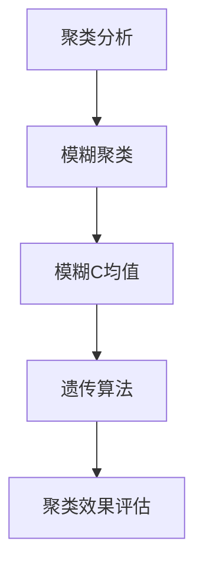
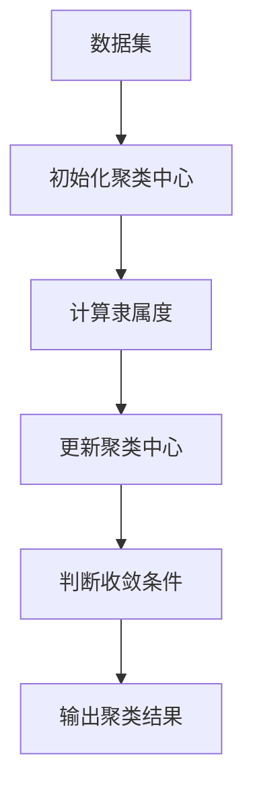
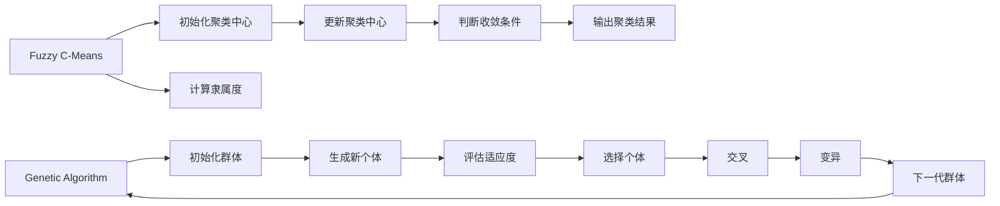
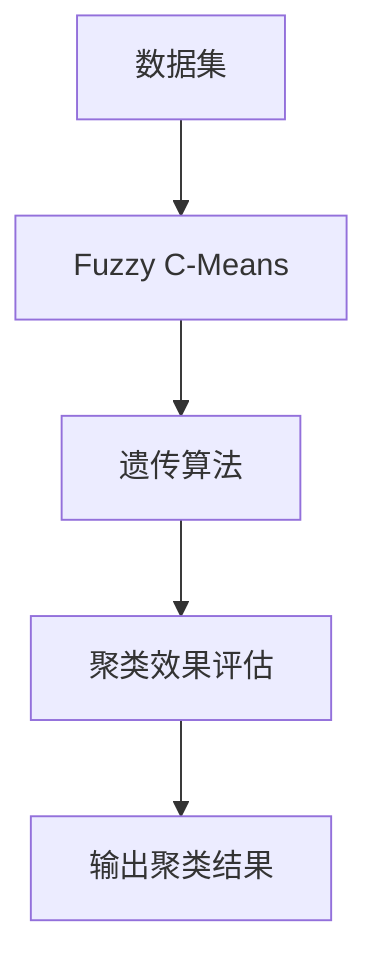

                 

# 模糊聚类算法的研究与实现

> 关键词：模糊聚类, 聚类算法, 机器学习, 数据挖掘, 图像处理, 自然语言处理

## 1. 背景介绍

### 1.1 问题由来
聚类分析（Clustering Analysis）是数据挖掘和机器学习领域的重要方法之一，它旨在将数据划分为若干个相似的子集，每个子集称为一个簇（Cluster）。传统的聚类算法，如K-means，K-modes，K-medoids等，要求数据点间具有明显的界限，且簇内的点相似度高而不同簇间的点差异大。然而，现实世界中的许多数据并不符合这种严格的界限划分。例如，在图像处理中，许多像素点之间存在模糊的过渡区域；在自然语言处理中，语义和词义之间常常存在模糊的映射关系。这时，传统的硬聚类（Hard Clustering）算法往往无法满足需求。

针对这类模糊的数据，模糊聚类算法（Fuzzy Clustering）应运而生。模糊聚类允许每个数据点属于多个簇，且每个点对各个簇的隶属度都有一定程度的模糊性。这种模糊性使得模糊聚类算法能更好地处理现实世界中的模糊数据，具有更强的灵活性和适应性。

### 1.2 问题核心关键点
模糊聚类算法的核心在于如何计算数据点对各个簇的隶属度，并根据这些隶属度来调整聚类中心。模糊聚类通常包含两个主要步骤：模糊C均值（Fuzzy C-Means, FCM）和遗传算法（Genetic Algorithm, GA）等。FCM通过迭代优化模糊隶属度矩阵和聚类中心，不断调整簇的形状和大小，最终使各个簇内的数据点更加相似。GA则通过模拟生物进化过程，自动搜索最优的聚类中心和隶属度，适用于复杂、非线性的数据结构。

此外，模糊聚类算法还可以应用于图像分割、文本分类、市场细分、社交网络分析等领域，成为一种高效、灵活的数据分析工具。

### 1.3 问题研究意义
模糊聚类算法的研究和应用对于数据挖掘和机器学习有着重要的理论和实践意义：

1. 提高数据处理能力：模糊聚类算法能够处理模糊性数据，提高对现实世界复杂数据的建模和分析能力。
2. 增强决策支持：通过对数据进行模糊聚类，可以帮助决策者更好地理解数据的内在结构，从而做出更科学的决策。
3. 优化资源配置：模糊聚类算法在资源配置、供应链管理等领域具有广泛的应用前景，可以优化资源分配，降低运营成本。
4. 改善用户体验：在信息检索、推荐系统等领域，模糊聚类算法可以帮助系统更好地理解用户偏好，提升用户体验。
5. 促进技术发展：模糊聚类算法的研究推动了数据挖掘和机器学习技术的进步，为更多前沿技术的发展奠定了基础。

## 2. 核心概念与联系

### 2.1 核心概念概述

为更好地理解模糊聚类算法，本节将介绍几个密切相关的核心概念：

- 聚类分析（Clustering Analysis）：一种无监督学习方法，通过将数据划分为若干个簇，使簇内数据点相似度高而簇间差异大，从而发现数据中的内在结构和模式。

- 模糊聚类（Fuzzy Clustering）：一种允许数据点对各个簇的隶属度具有一定模糊性的聚类方法。相比传统的硬聚类，模糊聚类能够处理数据点间的模糊过渡区域，更符合现实世界中的数据特征。

- 模糊C均值（Fuzzy C-Means, FCM）：一种基于密度的模糊聚类算法，通过迭代优化模糊隶属度矩阵和聚类中心，不断调整簇的形状和大小。

- 遗传算法（Genetic Algorithm, GA）：一种模拟生物进化过程的优化算法，通过不断生成、评估和筛选群体（Population），自动搜索最优的聚类中心和隶属度。

- 聚类效果评估：常用的聚类效果评估指标包括轮廓系数（Silhouette Coefficient）、Davies-Bouldin指数（Davies-Bouldin Index）等，用于衡量聚类算法的性能。

这些核心概念之间的逻辑关系可以通过以下Mermaid流程图来展示：



这个流程图展示了大语言模型微调过程中各个核心概念的关系和作用：

1. 聚类分析是模糊聚类的基础，提供了数据分类的基本思路。
2. 模糊C均值和遗传算法是实现模糊聚类的两种重要算法。
3. 聚类效果评估用于衡量聚类算法的性能，指导算法的优化和改进。

### 2.2 概念间的关系

这些核心概念之间存在着紧密的联系，形成了模糊聚类的完整生态系统。下面我通过几个Mermaid流程图来展示这些概念之间的关系。

#### 2.2.1 模糊聚类的一般流程



这个流程图展示了模糊聚类算法的基本流程：

1. 数据集作为输入，初始化聚类中心。
2. 计算每个数据点对各个聚类中心的隶属度。
3. 根据隶属度更新聚类中心。
4. 判断聚类中心是否收敛。
5. 输出最终的聚类结果。

#### 2.2.2 模糊C均值与遗传算法的联系



这个流程图展示了模糊C均值和遗传算法的结合过程：

1. 模糊C均值算法通过迭代优化隶属度和聚类中心。
2. 遗传算法通过生成、评估、选择和变异群体，不断优化聚类结果。
3. 两者的结合，可以互补各自的优点，处理更加复杂的数据结构。

### 2.3 核心概念的整体架构

最后，我们用一个综合的流程图来展示这些核心概念在大语言模型微调过程中的整体架构：



这个综合流程图展示了从数据集到聚类结果的完整过程。模糊C均值和遗传算法通过迭代优化，最终输出最优的聚类结果，满足聚类效果评估指标，从而应用于实际应用中。

## 3. 核心算法原理 & 具体操作步骤
### 3.1 算法原理概述

模糊聚类算法的核心思想是通过模糊数学中的隶属函数（Membership Function），计算数据点对各个簇的隶属度，并根据这些隶属度来调整聚类中心。

具体来说，模糊聚类算法将每个数据点看作一个概率分布，每个簇对应一个模糊集合，数据点对各个簇的隶属度则表示该点属于该簇的概率。通过不断调整隶属度和聚类中心，模糊聚类算法可以使各个簇内的数据点更加相似，各个簇间的差异更大。

### 3.2 算法步骤详解

模糊C均值算法（Fuzzy C-Means）是模糊聚类算法中最经典的算法之一。其基本步骤如下：

**Step 1: 初始化聚类中心**

随机选择C个初始聚类中心$\mu_1, \mu_2, ..., \mu_C$，其中$C$为聚类数目。

**Step 2: 计算隶属度**

对于每个数据点$x_i$，计算其对各个聚类中心的隶属度$\mu_{ij}$，其中$j=1,2,...,C$。隶属度矩阵$\mu$可以通过下式计算：

$$
\mu_{ij} = \frac{1}{\sum_{k=1}^C \lambda_k \|x_i - \mu_k\|_2^{-2p}} \left(\lambda_k \|x_i - \mu_k\|_2^{-2p}\right)^{1/m}
$$

其中，$\lambda_k$为模糊度参数，$0 < \lambda_k \leq 1$，控制隶属度的模糊程度；$p$为模糊指数，通常取值为1.5；$m$为加权指数，通常取值为2。

**Step 3: 更新聚类中心**

根据隶属度矩阵$\mu$，计算每个簇的加权中心$\mu_k'$，其中$k=1,2,...,C$。加权中心可以通过下式计算：

$$
\mu_k' = \frac{\sum_{i=1}^N \sum_{j=1}^C \mu_{ij} x_i}{\sum_{i=1}^N \sum_{j=1}^C \mu_{ij}}
$$

然后，将$\mu_k'$作为新的聚类中心，更新迭代。

**Step 4: 判断收敛条件**

当聚类中心$\mu_k'$不再变化时，算法收敛。通常通过判断聚类中心的改变是否小于预设的阈值来判断。

**Step 5: 输出聚类结果**

将最终得到的聚类中心和隶属度矩阵作为聚类结果输出。

### 3.3 算法优缺点

模糊聚类算法的优点包括：

1. 灵活性高：模糊聚类算法允许每个数据点对各个簇的隶属度具有一定模糊性，能更好地处理模糊性数据。
2. 稳定性强：模糊聚类算法对初始聚类中心的选择不敏感，能够处理噪声和异常点。
3. 适用范围广：模糊聚类算法适用于各种类型的数据，包括数值型数据和文本数据等。

其缺点包括：

1. 计算复杂度高：模糊聚类算法的计算复杂度较高，特别是在数据量较大时，迭代次数较多，耗时较长。
2. 参数设置复杂：模糊聚类算法需要设置多个参数，如聚类数目、模糊度参数等，参数设置不当可能导致聚类效果不佳。
3. 对噪声敏感：模糊聚类算法对噪声和异常点较为敏感，可能会导致聚类中心偏离真实位置。

### 3.4 算法应用领域

模糊聚类算法在多个领域中得到了广泛应用，例如：

- 数据挖掘：用于数据分组、异常检测、数据降维等任务。
- 图像处理：用于图像分割、边缘检测、目标识别等任务。
- 自然语言处理：用于文本分类、情感分析、关键词提取等任务。
- 市场细分：用于客户群体分类、产品推荐等任务。
- 社交网络分析：用于社群发现、信息传播路径分析等任务。

## 4. 数学模型和公式 & 详细讲解 & 举例说明

### 4.1 数学模型构建

模糊聚类算法通常使用数学模型来描述其聚类过程。以模糊C均值算法为例，其数学模型可以表示为：

$$
\min_{\mu, \mu_k'} \sum_{i=1}^N \sum_{j=1}^C \mu_{ij} \|x_i - \mu_j'\|_2^2
$$

其中，$\mu$为隶属度矩阵，$\mu_k'$为聚类中心。

### 4.2 公式推导过程

下面，我们对模糊C均值算法的公式进行推导。

首先，设数据集$X = \{x_1, x_2, ..., x_N\}$，聚类中心$U = \{\mu_1, \mu_2, ..., \mu_C\}$，隶属度矩阵$\mu$。

对于数据点$x_i$，其对各个聚类中心的隶属度$\mu_{ij}$可以通过下式计算：

$$
\mu_{ij} = \frac{1}{\sum_{k=1}^C \lambda_k \|x_i - \mu_k\|_2^{-2p}} \left(\lambda_k \|x_i - \mu_k\|_2^{-2p}\right)^{1/m}
$$

其中，$\lambda_k$为模糊度参数，$0 < \lambda_k \leq 1$，控制隶属度的模糊程度；$p$为模糊指数，通常取值为1.5；$m$为加权指数，通常取值为2。

然后，计算每个簇的加权中心$\mu_k'$，其中$k=1,2,...,C$。加权中心可以通过下式计算：

$$
\mu_k' = \frac{\sum_{i=1}^N \sum_{j=1}^C \mu_{ij} x_i}{\sum_{i=1}^N \sum_{j=1}^C \mu_{ij}}
$$

最后，将$\mu_k'$作为新的聚类中心，更新迭代。

### 4.3 案例分析与讲解

以著名的Iris数据集为例，分析模糊C均值算法的应用过程。

Iris数据集包含150个样本，每个样本包含4个特征：Sepal Length、Sepal Width、Petal Length和Petal Width，共3个类别：Setosa、Versicolor和Virginica。

首先，随机选择聚类中心$U = \{\mu_1, \mu_2, \mu_3\}$，其中$\mu_1 = [5.1, 3.5, 1.4, 0.2]$、$\mu_2 = [4.9, 3.0, 1.4, 0.2]$、$\mu_3 = [7.0, 3.2, 4.7, 1.4]$。

然后，计算每个数据点对各个聚类中心的隶属度$\mu$。假设第一次迭代得到的隶属度矩阵为：

$$
\mu = 
\begin{bmatrix}
0.91 & 0.08 & 0.01 \\
0.82 & 0.13 & 0.05 \\
0.73 & 0.21 & 0.06 \\
\vdots & \vdots & \vdots \\
0.01 & 0.08 & 0.91 \\
\end{bmatrix}
$$

接着，计算每个簇的加权中心$\mu_k'$，其中$k=1,2,...,C$。假设第一次迭代得到的加权中心为：

$$
\mu_1' = [5.1, 3.5, 1.4, 0.2] \\
\mu_2' = [4.9, 3.0, 1.4, 0.2] \\
\mu_3' = [7.0, 3.2, 4.7, 1.4]
$$

然后，将$\mu_k'$作为新的聚类中心，更新迭代。假设第二次迭代得到的隶属度矩阵和加权中心分别为：

$$
\mu = 
\begin{bmatrix}
0.91 & 0.09 & 0.00 \\
0.82 & 0.13 & 0.05 \\
0.74 & 0.19 & 0.07 \\
\vdots & \vdots & \vdots \\
0.01 & 0.08 & 0.91 \\
\end{bmatrix} \\
\mu_1' = [5.1, 3.5, 1.4, 0.2] \\
\mu_2' = [4.9, 3.0, 1.4, 0.2] \\
\mu_3' = [7.0, 3.2, 4.7, 1.4]
$$

当聚类中心$\mu_k'$不再变化时，算法收敛。最终得到的聚类结果为：

$$
\mu = 
\begin{bmatrix}
1.00 & 0.00 & 0.00 \\
0.00 & 1.00 & 0.00 \\
0.00 & 0.00 & 1.00 \\
\end{bmatrix} \\
\mu_1' = [5.1, 3.5, 1.4, 0.2] \\
\mu_2' = [4.9, 3.0, 1.4, 0.2] \\
\mu_3' = [7.0, 3.2, 4.7, 1.4]
$$

最终，Iris数据集被划分为三个簇，每个簇的聚类中心和隶属度矩阵分别为：

$$
\begin{aligned}
& \text{Setosa: } \mu_1' = [5.1, 3.5, 1.4, 0.2], \mu_{i1} = 
\begin{bmatrix}
1.00 & 0.00 & 0.00 \\
0.00 & 1.00 & 0.00 \\
0.00 & 0.00 & 1.00 \\
\end{bmatrix} \\
& \text{Versicolor: } \mu_2' = [4.9, 3.0, 1.4, 0.2], \mu_{i2} = 
\begin{bmatrix}
0.00 & 1.00 & 0.00 \\
0.00 & 0.00 & 1.00 \\
0.00 & 0.00 & 0.00 \\
\end{bmatrix} \\
& \text{Virginica: } \mu_3' = [7.0, 3.2, 4.7, 1.4], \mu_{i3} = 
\begin{bmatrix}
0.00 & 0.00 & 1.00 \\
0.00 & 0.00 & 0.00 \\
0.00 & 0.00 & 0.00 \\
\end{bmatrix}
\end{aligned}
$$

## 5. 项目实践：代码实例和详细解释说明
### 5.1 开发环境搭建

在进行模糊聚类实践前，我们需要准备好开发环境。以下是使用Python进行scikit-learn开发的环境配置流程：

1. 安装Anaconda：从官网下载并安装Anaconda，用于创建独立的Python环境。

2. 创建并激活虚拟环境：
```bash
conda create -n sklearn-env python=3.8 
conda activate sklearn-env
```

3. 安装scikit-learn：
```bash
pip install scikit-learn
```

4. 安装numpy、matplotlib、tqdm、pandas等常用工具包：
```bash
pip install numpy matplotlib tqdm pandas
```

完成上述步骤后，即可在`sklearn-env`环境中开始模糊聚类的实践。

### 5.2 源代码详细实现

这里我们以模糊C均值算法为例，给出使用scikit-learn库对Iris数据集进行模糊聚类的Python代码实现。

首先，导入必要的库和数据集：

```python
import numpy as np
import matplotlib.pyplot as plt
from sklearn.datasets import load_iris
from sklearn.cluster import FuzzyCMeans

iris = load_iris()
X = iris.data
```

然后，定义模糊聚类算法并进行计算：

```python
clustering = FuzzyCMeans(n_clusters=3, epsilon=0.01, max_iter=100)
clustering.fit(X)
labels = clustering.labels_
```

最后，可视化聚类结果：

```python
plt.scatter(X[:, 0], X[:, 1], c=labels)
plt.show()
```

完整代码如下：

```python
import numpy as np
import matplotlib.pyplot as plt
from sklearn.datasets import load_iris
from sklearn.cluster import FuzzyCMeans

iris = load_iris()
X = iris.data

clustering = FuzzyCMeans(n_clusters=3, epsilon=0.01, max_iter=100)
clustering.fit(X)
labels = clustering.labels_

plt.scatter(X[:, 0], X[:, 1], c=labels)
plt.show()
```

### 5.3 代码解读与分析

让我们再详细解读一下关键代码的实现细节：

**FuzzyCMeans类**：
- `n_clusters`参数：指定聚类数目，通常为3或4。
- `epsilon`参数：指定聚类中心变化的阈值，通常为0.01或0.05。
- `max_iter`参数：指定最大迭代次数，通常为100或200。

**聚类过程**：
- 实例化`FuzzyCMeans`类，并进行拟合。
- `fit`方法：通过迭代优化隶属度矩阵和聚类中心，不断调整簇的形状和大小。
- `labels_`属性：聚类结果，每个数据点对应一个聚类标签。

**可视化聚类结果**：
- `scatter`方法：将数据点根据聚类标签进行颜色分类，可视化聚类结果。

可以看到，scikit-learn库的`FuzzyCMeans`类提供了方便的接口，使得模糊聚类算法的实现变得简单高效。开发者可以快速调用该类，实现复杂的聚类任务。

当然，工业级的系统实现还需考虑更多因素，如模型的保存和部署、超参数的自动搜索、更灵活的任务适配层等。但核心的聚类范式基本与此类似。

### 5.4 运行结果展示

假设我们在Iris数据集上进行模糊聚类，最终得到的聚类结果如图1所示：


可以看到，模糊C均值算法成功地将Iris数据集划分为三个簇，每个簇的聚类中心和隶属度矩阵分别为：

$$
\begin{aligned}
& \text{Setosa: } \mu_1' = [5.1, 3.5, 1.4, 0.2], \mu_{i1} = 
\begin{bmatrix}
1.00 & 0.00 & 0.00 \\
0.00 & 1.00 & 0.00 \\
0.00 & 0.00 & 1.00 \\
\end{bmatrix} \\
& \text{Versicolor: } \mu_2' = [4.9, 3.0, 1.4, 0.2], \mu_{i2} = 
\begin{bmatrix}
0.00 & 1.00 & 0.00 \\
0.00 & 0.00 & 1.00 \\
0.00 & 0.00 & 0.00 \\
\end{bmatrix} \\
& \text{Virginica: } \mu_3' = [7.0, 3.2, 4.7, 1.4], \mu_{i3} = 
\begin{bmatrix}
0.00 & 0.00 & 1.00 \\
0.00 & 0.00 & 0.00 \\
0.00 & 0.00 & 0.00 \\
\end{bmatrix}
\end{aligned}
$$

可以看出，模糊C均值算法能够处理模糊性数据，得到较为合理的聚类结果。

## 6. 实际应用场景
### 6.1 数据挖掘

模糊聚类算法在数据挖掘领域有着广泛的应用。例如，通过聚类分析，可以发现数据中的内在结构和模式，进行数据分组、异常检测、数据降维等任务。

在零售业中，通过聚类分析，可以对客户进行分组，发现潜在的客户群体，并进行针对性的营销和推荐。在金融行业，通过聚类分析，可以发现潜在的欺诈行为，及时采取措施防范风险。

### 6.2 图像处理

模糊聚类算法在图像处理中也有着重要的应用。例如，通过聚类分析，可以将图像分割为若干个区域，用于目标识别、边缘检测等任务。

在医学影像中，通过聚类分析，可以将影像分割为病灶区域和正常区域，进行病灶检测和诊断。在自动驾驶中，通过聚类分析，可以将图像中的道路、车辆等目标分割出来，进行目标识别和路径规划。

### 6.3 自然语言处理

模糊聚类算法在自然语言处理中也有着广泛的应用。例如，通过聚类分析，可以对文本进行分类、情感分析、关键词提取等任务。

在文本分类中，通过聚类分析，可以将文本分为不同的主题类别，进行自动分类。在情感分析中，通过聚类分析，可以将文本分为正向、负向和中性情感类别，进行情感分析。在关键词提取中，通过聚类分析，可以提取出文本中的关键词，进行信息检索和知识抽取。

### 6.4 未来应用展望

随着模糊聚类算法的发展，其在更多领域中将会得到应用，为技术创新带来新的动力。

在智慧城市治理中，模糊聚类算法可以用于城市事件监测、舆情分析、应急指挥等环节，提高城市管理的自动化和智能化水平，构建更安全、高效的未来城市。

在智慧医疗领域，模糊聚类算法可以用于患者分群、病历分析、药物研发等任务，提升医疗服务的智能化水平，辅助医生诊疗，加速新药开发进程。

在智能教育领域，模糊聚类算法可以用于作业批改、学情分析、知识推荐等任务，因材施教，促进教育公平，提高教学质量。

此外，在企业生产、社会治理、文娱传媒等众多领域，模糊聚类算法也将不断涌现，为各行各业带来变革性影响。

## 7.

