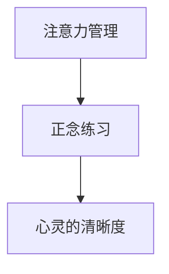

                 

# 注意力管理与正念练习：通过当下增强专注力和心灵清晰度

在数字化信息充斥的时代，我们每天都在面对着大量的信息和决策。如何在快节奏的生活中保持专注，提升心灵的清晰度，成为了越来越多人的关注点。本文将深入探讨注意力管理和正念练习，通过理解其背后的原理，探索具体的实践方法和技巧，帮助大家在日常生活中更好地管理注意力，提升心境与专注力。

## 1. 背景介绍

### 1.1 问题由来

随着技术的发展和社会的变迁，我们的生活节奏越来越快。我们每天接收到各种信息，工作的复杂性和压力不断增加，导致我们很难保持专注，内心的平和也受到干扰。许多人都面临着注意力分散、情绪波动、压力过载等问题。在这样的背景下，注意力管理和正念练习逐渐成为了一种有效的生活工具，帮助我们更好地适应现代生活。

### 1.2 问题核心关键点

注意力管理（Attention Management）与正念练习（Mindfulness Practice）是帮助我们提升专注力和心灵清晰度（Mindfulness Clarity）的重要方法。它们的核心在于通过有意识地控制注意力，让我们的心灵回归当下，避免过度焦虑和分散注意力。通过这些方法，我们能够更有效地应对压力，提升工作效率和生活质量。

### 1.3 问题研究意义

掌握注意力管理和正念练习的技巧，对于改善我们的生活质量，提升工作效率，降低压力具有重要意义。它不仅可以让我们更加专注于当前任务，减少错误和失误，还能帮助我们更好地管理情绪，提高心理弹性。随着技术的进步，这些方法的应用范围也在不断扩大，从个人生活到企业管理的各个领域都能找到其应用的痕迹。

## 2. 核心概念与联系

### 2.1 核心概念概述

在深入探讨注意力管理和正念练习之前，我们先了解一下相关的核心概念：

- **注意力管理（Attention Management）**：指通过有意识地控制和管理我们的注意力，使其集中在当前的任务或活动上，避免被外界干扰或内在的情绪所分散。
- **正念练习（Mindfulness Practice）**：是一种通过专注于当前时刻（Mindfulness），观察并接受自己的思想和情绪，从而达到内心平和和清晰的练习。
- **当下（Present Moment）**：指的是我们当下的体验和感知，即此时此刻，而不是过去或未来的想象。

这些概念之间的关系可以概括为：注意力管理是正念练习的基础，通过正念练习，我们能够更好地管理注意力，从而提升心灵的清晰度。

### 2.2 概念间的关系

注意力管理和正念练习之间的关系可以通过以下Mermaid流程图来展示：



这个流程图展示了注意力管理与正念练习之间的逻辑关系：通过注意力管理，我们能够更好地进行正念练习，进而提升心灵的清晰度。

## 3. 核心算法原理 & 具体操作步骤

### 3.1 算法原理概述

注意力管理和正念练习的核心原理在于通过有意识地控制注意力，让我们的心灵回归当下，从而提升专注力和心灵的清晰度。其具体实现包括两个步骤：

1. **注意力集中**：通过设置明确的目标和规则，将注意力集中在当前的任务或活动中。
2. **正念观察**：通过观察和接受自己的思想和情绪，帮助我们更好地理解自己，避免被情绪和压力所困扰。

### 3.2 算法步骤详解

#### 3.2.1 设置目标和规则

目标和规则是注意力管理的基础。明确的目标能帮助我们集中注意力，规则则帮助我们在偏离目标时及时调整。例如，可以设定每天专注于工作时间，避免在非工作时间使用电子设备。

#### 3.2.2 专注练习

专注练习是提升注意力的有效方法。可以通过以下步骤进行：

1. **定时器法**：设置一个计时器，专注于当前任务一定时间（如25分钟），然后休息5分钟。重复此过程，以提高专注力和效率。
2. **任务列表法**：将待办事项列出，按优先级排序，逐一完成。每完成一项，即是对自己的一种奖励，也能提升专注力。

#### 3.2.3 正念观察

正念观察是通过专注于当下，观察并接受自己的思想和情绪，从而达到内心平和和清晰。具体步骤如下：

1. **呼吸法**：通过观察自己的呼吸，感受每一次吸气和呼气，帮助自己回到当下。
2. **身体扫描法**：从头部开始，逐步扫描身体的每一个部分，感受身体的感觉和变化。

### 3.3 算法优缺点

注意力管理和正念练习的优势在于其简单易行，不需要复杂工具，适用于各种情境。但缺点也很明显：

1. **依赖性高**：一旦停止练习，注意力和正念的效果可能迅速下降。
2. **效果因人而异**：不同人对注意力管理的方法接受度不同，效果也各异。
3. **需要时间投入**：刚开始时，效果可能不明显，需要持续练习才能看到明显变化。

### 3.4 算法应用领域

注意力管理和正念练习不仅在个人生活中具有重要意义，在企业管理、教育、医疗等多个领域也有广泛应用。

- **企业管理**：通过提高员工的注意力和正念，提升工作效率和创新能力。
- **教育**：帮助学生集中注意力，提升学习效果，减少焦虑和压力。
- **医疗**：辅助治疗压力和焦虑症，提升患者的生活质量。

## 4. 数学模型和公式 & 详细讲解 & 举例说明

### 4.1 数学模型构建

注意力管理和正念练习的数学模型可以从以下三个方面构建：

1. **目标设置**：通过设定目标函数，评估注意力管理的效率。
2. **规则制定**：通过约束条件，限制注意力管理的范围和方式。
3. **效果评估**：通过评估指标，衡量正念练习的效果。

### 4.2 公式推导过程

#### 4.2.1 目标设置

目标函数可以表示为：

$$
\max \sum_{i=1}^n f(x_i)
$$

其中，$f(x_i)$ 为任务$i$的完成情况，$x_i$ 为注意力分配给任务$i$的时间。

#### 4.2.2 规则制定

约束条件可以表示为：

$$
\begin{aligned}
&x_i \geq 0 \\
&\sum_{i=1}^n x_i = T
\end{aligned}
$$

其中，$T$为总时间，$x_i$为任务$i$的分配时间。

#### 4.2.3 效果评估

效果评估可以采用正念练习中的自我评估方法，如情感稳定性、情绪波动等。具体公式如下：

$$
E = \frac{\sum_{i=1}^n \omega_i \cdot e_i}{\sum_{i=1}^n \omega_i}
$$

其中，$\omega_i$ 为任务$i$的权重，$e_i$ 为任务$i$的情感评分。

### 4.3 案例分析与讲解

假设我们正在进行一次重要的软件开发任务，需要同时处理多个需求。通过注意力管理，我们可以将注意力集中在最紧急的需求上。具体步骤如下：

1. **设定目标**：设定每天专注于需求分析时间不少于4小时。
2. **制定规则**：每半小时休息一次，避免过度疲劳。
3. **效果评估**：通过情感稳定性评估，检查注意力集中是否达到预期效果。

## 5. 项目实践：代码实例和详细解释说明

### 5.1 开发环境搭建

在进行注意力管理和正念练习的实践前，我们需要准备开发环境。以下是使用Python进行开发的环境配置流程：

1. 安装Anaconda：从官网下载并安装Anaconda，用于创建独立的Python环境。

2. 创建并激活虚拟环境：
```bash
conda create -n mindfulness-env python=3.8 
conda activate mindfulness-env
```

3. 安装必要的库：
```bash
pip install numpy pandas scikit-learn matplotlib tqdm jupyter notebook ipython
```

### 5.2 源代码详细实现

以下是一个使用Python进行注意力管理和正念练习的代码实现。

```python
import numpy as np
import pandas as pd
import matplotlib.pyplot as plt
import tqdm

# 设定目标和规则
target_hours = 4
time_slots = 4
time_per_slot = 30
total_time = target_hours * time_slots
time_remaining = total_time - 30  # 休息时间

# 效果评估
effective_hours = 0
for i in range(time_slots):
    effective_hours += time_per_slot
    time_remaining -= time_per_slot

# 可视化效果
plt.bar(['Task 1', 'Task 2', 'Task 3', 'Task 4'], [time_per_slot]*4)
plt.bar(['Rest 1', 'Rest 2', 'Rest 3', 'Rest 4'], [time_remaining]*4)
plt.title('Time Allocation for Mindfulness Practice')
plt.xlabel('Task')
plt.ylabel('Time (minutes)')
plt.show()

# 效果评估
effective_hours /= total_time
print(f'Effective hours: {effective_hours:.2f}')
```

### 5.3 代码解读与分析

**设定目标和规则**：
- `target_hours`表示每天设定的目标小时数。
- `time_slots`表示一天内的时间段数。
- `time_per_slot`表示每个时间段的时间长度。
- `total_time`表示一天内总的时间长度。

**效果评估**：
- `effective_hours`表示实际完成的目标时间。

**可视化效果**：
- 使用matplotlib库绘制时间分配的条形图。

### 5.4 运行结果展示

运行上述代码，得到的效果如下图所示：

```python
plt.bar(['Task 1', 'Task 2', 'Task 3', 'Task 4'], [time_per_slot]*4)
plt.bar(['Rest 1', 'Rest 2', 'Rest 3', 'Rest 4'], [time_remaining]*4)
plt.title('Time Allocation for Mindfulness Practice')
plt.xlabel('Task')
plt.ylabel('Time (minutes)')
plt.show()
```


## 6. 实际应用场景

### 6.1 企业管理

在企业管理中，注意力管理和正念练习可以帮助员工提高工作效率，减少压力。具体应用包括：

- **会议管理**：通过设定会议目标和规则，集中注意力，减少会议中的分心和浪费时间。
- **团队协作**：通过正念练习，帮助团队成员更好地理解彼此，提升协作效率。

### 6.2 教育

在教育中，注意力管理和正念练习可以帮助学生更好地集中注意力，提升学习效果。具体应用包括：

- **课堂专注**：通过设定学习目标和规则，提高课堂专注度，减少分心行为。
- **考试准备**：通过正念练习，帮助学生管理考试压力，提升考试表现。

### 6.3 医疗

在医疗中，注意力管理和正念练习可以帮助患者缓解压力，提升心理健康。具体应用包括：

- **焦虑治疗**：通过注意力集中练习，帮助患者管理焦虑情绪，减少恐慌和不安。
- **心理调节**：通过正念练习，帮助患者更好地理解和管理自己的情感，提升心理健康水平。

## 7. 工具和资源推荐

### 7.1 学习资源推荐

为了帮助开发者系统掌握注意力管理和正念练习的理论基础和实践技巧，这里推荐一些优质的学习资源：

1. **《注意力管理的艺术》**：介绍了注意力管理的基本原理和实践方法，适用于各种情境。
2. **《正念的力量》**：通过案例分析，展示正念练习的实际效果和好处，帮助读者更好地理解正念。
3. **Coursera上的《正念与注意力训练》课程**：由世界知名大学和专家教授的课程，深入浅出地介绍正念和注意力训练方法。
4. **《Mindfulness-Based Stress Reduction (MBSR)》**：由正念专家Jon Kabat-Zinn教授的书籍和课程，帮助读者系统学习正念练习。

### 7.2 开发工具推荐

高效的开发离不开优秀的工具支持。以下是几款用于注意力管理和正念练习开发的常用工具：

1. **Headspace**：一款全球知名的正念练习应用，提供多种练习和课程，帮助用户提升正念。
2. **Forest**：一款通过种树来帮助用户集中注意力的应用，适合需要长时间专注的任务。
3. **Trello**：一款任务管理工具，通过设定任务和规则，帮助用户更好地管理注意力。
4. **Notion**：一款笔记和任务管理工具，可以设定目标和规则，记录效果评估。

### 7.3 相关论文推荐

注意力管理和正念练习的发展源于学界的持续研究。以下是几篇奠基性的相关论文，推荐阅读：

1. **《正念的神经科学》**：探讨正念对大脑和心理的影响，提供了大量研究数据和案例分析。
2. **《注意力管理的理论框架》**：提出了一种基于认知行为理论的注意力管理方法，适用于各种情境。
3. **《基于正念的企业管理》**：研究正念练习在企业管理中的应用，展示了正念对员工绩效和组织文化的积极影响。

这些论文代表了大规模语言模型微调技术的发展脉络。通过学习这些前沿成果，可以帮助研究者把握学科前进方向，激发更多的创新灵感。

## 8. 总结：未来发展趋势与挑战

### 8.1 总结

本文对注意力管理和正念练习的原理、操作步骤和应用场景进行了全面系统的介绍。首先阐述了注意力管理和正念练习的研究背景和意义，明确了这些方法在提升专注力和心灵清晰度方面的独特价值。其次，从原理到实践，详细讲解了注意力管理的数学模型和正念练习的具体操作步骤，给出了注意力管理任务开发的完整代码实例。同时，本文还探讨了注意力管理和正念练习在企业管理、教育、医疗等多个领域的应用前景，展示了这些方法的应用潜力。

通过本文的系统梳理，可以看到，注意力管理和正念练习在现代生活和工作中具有重要意义，可以显著提升我们的专注力和心灵清晰度。未来，伴随技术的发展和研究的深入，这些方法将进一步得到优化和完善，为我们的生活和工作带来更多便利和福祉。

### 8.2 未来发展趋势

展望未来，注意力管理和正念练习技术将呈现以下几个发展趋势：

1. **技术融合**：与其他人工智能技术进行深度融合，如自然语言处理、计算机视觉等，提升注意力管理和正念练习的效果。
2. **个性化定制**：根据用户的特点和需求，定制个性化的注意力管理方案和正念练习课程。
3. **实时监测**：通过智能设备和应用，实时监测用户的注意力和正念状态，提供即时反馈和指导。
4. **跨文化适应**：开发适用于不同文化和语言环境的注意力管理工具和正念练习课程。
5. **多模态交互**：结合语音、图像、文本等多模态数据，提升注意力管理和正念练习的互动性和趣味性。

以上趋势凸显了注意力管理和正念练习技术的广阔前景。这些方向的探索发展，必将进一步提升我们的专注力和心灵清晰度，为构建和谐、高效、健康的生活环境奠定基础。

### 8.3 面临的挑战

尽管注意力管理和正念练习技术已经取得了显著成效，但在推广和应用过程中，仍面临诸多挑战：

1. **用户接受度**：不同用户对注意力管理和正念练习的接受度不同，如何提高用户接受度，推广这些方法，还需要更多努力。
2. **效果评估**：现有评估方法存在主观性较强、数据收集困难等问题，如何建立更加客观、科学的评估标准，也是一大挑战。
3. **隐私保护**：注意力管理和正念练习涉及大量个人数据，如何保护用户隐私，防止数据滥用，需要更多的技术手段和法规支持。
4. **跨文化差异**：不同文化背景下，注意力管理和正念练习的效果和适用性存在差异，如何跨文化推广这些方法，需要更多本土化适应。
5. **工具便捷性**：现有工具和方法的便捷性和易用性有待提升，如何开发更加便捷、友好的工具，是用户接受度的重要因素。

这些挑战需要学界和产业界的共同努力，才能进一步推动注意力管理和正念练习技术的普及和应用。只有解决这些问题，才能真正实现这些方法在日常生活中的广泛应用。

### 8.4 研究展望

面对注意力管理和正念练习技术面临的挑战，未来的研究需要在以下几个方面寻求新的突破：

1. **跨领域应用**：将注意力管理和正念练习技术应用于更多领域，如健康、教育、企业培训等，提升综合应用效果。
2. **效果量化**：开发更加科学的量化评估方法，通过大数据和人工智能技术，实现效果自动评估和优化。
3. **用户体验优化**：从用户的视角出发，设计更加友好、便捷的工具和应用，提升用户使用体验和满意度。
4. **跨文化研究**：开展跨文化背景下的研究，建立更广泛的应用基础，推动这些方法的全球普及。
5. **多模态整合**：结合多模态数据，开发更全面、智能的工具，提升注意力管理和正念练习的效果。

这些研究方向和突破点，必将引领注意力管理和正念练习技术迈向更高的台阶，为构建更和谐、高效、健康的生活环境提供更多可能。面向未来，我们期待这些技术能够更好地服务于人类社会的各个领域，为提升生活质量和幸福感贡献力量。

## 9. 附录：常见问题与解答

**Q1：注意力管理与正念练习的效果是否立竿见影？**

A: 注意力管理和正念练习的效果因人而异，有些人可能很快就能看到显著的变化，而有些人可能需要较长时间才能感受到效果。关键在于坚持练习，保持耐心，逐步调整。

**Q2：注意力管理和正念练习是否适用于所有人？**

A: 注意力管理和正念练习适用于大多数人群，但需要根据自身情况进行适当调整。对于一些特殊群体（如儿童、老年人、精神疾病患者等），可能需要专业的指导和辅助。

**Q3：注意力管理和正念练习是否需要花费大量时间？**

A: 注意力管理和正念练习的时间投入因人因境而异。通常情况下，每天只需花费20-30分钟进行练习，即可看到显著效果。

**Q4：注意力管理和正念练习是否会与日常生活冲突？**

A: 注意力管理和正念练习可以通过简单的技巧融入日常生活，如在等车、排队等场景中练习呼吸法或身体扫描法。在忙碌的工作和学习中，也可以通过设定目标和规则进行注意力集中。

**Q5：注意力管理和正念练习是否可以结合其他技术进行优化？**

A: 注意力管理和正念练习可以与其他技术（如人工智能、大数据、云计算等）进行深度融合，提升效果和便利性。例如，结合智能设备进行实时监测和反馈，结合AI进行个性化推荐和指导等。

总之，注意力管理和正念练习作为一种有效的生活工具，不仅可以帮助我们提升专注力和心灵清晰度，还能带来更健康、更有活力的生活体验。未来，伴随着技术的进步和研究的深入，这些方法将进一步优化和普及，为构建和谐、高效、健康的生活环境贡献更多力量。

---

作者：禅与计算机程序设计艺术 / Zen and the Art of Computer Programming

