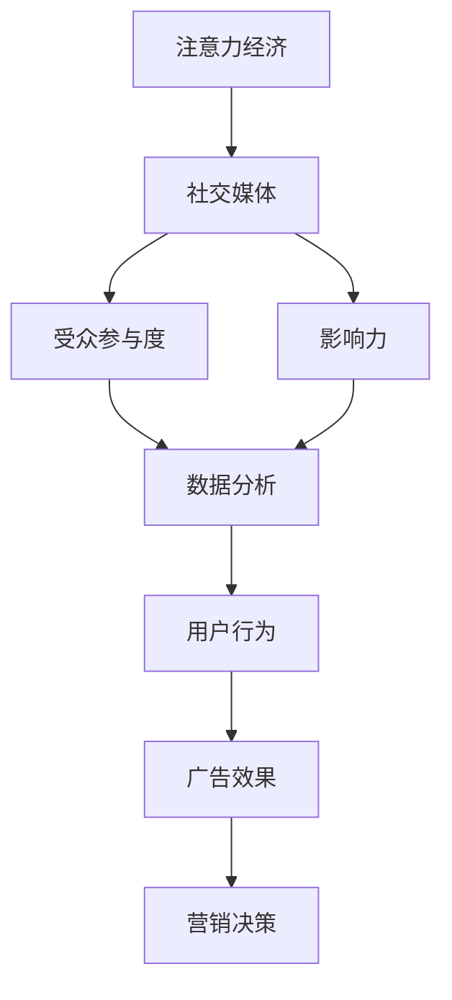

                 

# 注意力经济与社交媒体分析洞察力：了解受众参与度和影响力的秘密

> 关键词：
1. 注意力经济
2. 社交媒体
3. 受众参与度
4. 影响力
5. 数据分析
6. 用户行为
7. 广告效果

## 1. 背景介绍

### 1.1 问题由来

在数字化和网络化的时代背景下，社交媒体平台成为了人们获取信息、交流互动的主要渠道。随之而来的，是注意力经济的蓬勃发展。越来越多的企业将目光投向社交媒体，希望通过吸引和引导用户的注意力，达到营销、品牌推广的目的。然而，如何精确地测量用户的参与度和影响力，并据此进行精准的营销决策，成为了企业面临的一大难题。

### 1.2 问题核心关键点

在社交媒体上，用户的参与度和影响力通常通过互动数据（如点赞、评论、转发等）和影响力指标（如粉丝数、关注度等）来衡量。但这些数据往往存在噪声，单一地依赖这些数据进行分析和决策，容易出现偏差。因此，如何构建更全面、精确的受众参与度和影响力评估体系，成为业界亟待解决的问题。

### 1.3 问题研究意义

通过对受众参与度和影响力进行深入分析，企业能够更科学地制定营销策略，优化广告投放效果，提升品牌影响力和用户忠诚度。同时，精准的用户画像分析也有助于提升用户体验，推动社交媒体平台内容生态的健康发展。

## 2. 核心概念与联系

### 2.1 核心概念概述

在注意力经济与社交媒体分析的框架下，有几个关键概念是理解问题的核心：

- **注意力经济 (Attention Economy)**：以吸引和引导用户注意力为核心的经济模式，通过注意力获取用户时间、金钱等价值。
- **社交媒体 (Social Media)**：用户进行信息共享、互动交流的网络平台，如微博、微信、抖音等。
- **受众参与度 (Audience Engagement)**：用户与内容互动的活跃程度，包括点赞、评论、分享等行为。
- **影响力 (Influence)**：用户或内容对其他用户的影响力和辐射范围，通常以粉丝数、关注度等指标衡量。
- **数据分析 (Data Analysis)**：通过收集和分析数据，提取有价值的信息和洞察，指导决策。
- **用户行为 (User Behavior)**：用户在社交媒体上的行为模式，如消费习惯、互动偏好等。
- **广告效果 (Ad Effectiveness)**：广告在提升品牌知名度、促进销售等方面的实际效果。

### 2.2 概念间的关系

这些核心概念通过以下Mermaid流程图展示了它们之间的联系：



这个流程图展示了从注意力经济到社交媒体，再到受众参与度和影响力的构建过程，以及数据分析和用户行为在其中扮演的角色，最终指导广告效果和营销决策。

## 3. 核心算法原理 & 具体操作步骤
### 3.1 算法原理概述

社交媒体上的受众参与度和影响力分析，本质上是一个数据挖掘和机器学习的过程。其主要目的是通过数据分析和建模，揭示用户行为背后的规律和趋势，从而评估和预测用户的参与度和影响力。

在这一过程中，常用的算法包括聚类分析、社交网络分析、回归分析等。其中，聚类分析用于将用户分为不同的兴趣群体，社交网络分析用于分析用户之间的连接和互动，回归分析用于预测用户行为和影响力。

### 3.2 算法步骤详解

基于社交媒体的分析过程大致分为以下几个步骤：

1. **数据采集**：收集社交媒体平台上的用户互动数据、用户行为数据等。
2. **数据预处理**：清洗、整合数据，去除噪声，保证数据的质量和一致性。
3. **特征工程**：提取用户互动、行为等特征，构建模型所需的数据集。
4. **模型训练**：使用聚类、社交网络分析等算法，构建用户兴趣和影响力的模型。
5. **结果评估**：通过验证数据集，评估模型的效果和精度。
6. **应用部署**：将模型应用于实际场景，指导营销决策。

### 3.3 算法优缺点

**优点**：
- 数据来源广泛，可以包含用户互动、行为等多个维度。
- 模型可解释性强，易于理解其背后原理。
- 能够提供细致的用户画像和兴趣群体分析，为精准营销提供支持。

**缺点**：
- 数据噪音较大，需要复杂的预处理和特征工程。
- 模型复杂，训练和调参难度大。
- 分析结果依赖数据质量和特征选择，可能存在偏差。

### 3.4 算法应用领域

社交媒体分析技术广泛应用在以下领域：

- **广告投放优化**：通过用户参与度和影响力分析，优化广告投放策略，提升广告效果。
- **内容推荐系统**：分析用户兴趣和行为，推荐个性化的内容，提升用户粘性和平台活跃度。
- **社交媒体舆情监控**：分析用户对某一事件、品牌等的态度和反应，及时调整策略。
- **用户增长分析**：通过分析用户获取渠道和行为路径，指导用户增长策略。
- **用户流失预测**：预测用户流失风险，制定相应的留存策略。

## 4. 数学模型和公式 & 详细讲解  
### 4.1 数学模型构建

为了更好地理解社交媒体上的受众参与度和影响力分析，我们使用数学语言对这一过程进行更严谨的刻画。

设社交媒体平台上有 $N$ 个用户，每个用户 $i$ 的互动数据为 $x_i=(x_{i1},x_{i2},...,x_{im})$，其中 $x_{ij}$ 表示用户在第 $j$ 个互动维度上的表现。设用户 $i$ 的影响力为 $y_i$，参与度为 $z_i$。我们的目标是通过训练一个模型，预测用户 $i$ 的影响力和参与度。

### 4.2 公式推导过程

以用户 $i$ 的互动数据 $x_i$ 和 $z_i$ 为例，我们可以建立以下线性回归模型：

$$
\hat{y}_i = \beta_0 + \beta_1 x_{i1} + \beta_2 x_{i2} + ... + \beta_m x_{im} + \epsilon_i
$$

其中 $\beta_0, \beta_1, \beta_2, ..., \beta_m$ 为回归系数，$\epsilon_i$ 为随机误差项。

通过最小二乘法，我们可以求解 $\beta$ 的估计值，进而得到用户 $i$ 的影响力 $\hat{y}_i$。

$$
\beta = (X^TX)^{-1}X^Ty
$$

其中 $X=[x_{11},x_{12},...,x_{1m};x_{21},x_{22},...,x_{2m};...;x_{N1},x_{N2},...,x_{Nm}]$，$y=[y_1;y_2;...;y_N]$。

### 4.3 案例分析与讲解

以下是一个简单的社交媒体分析案例，展示如何使用线性回归模型进行用户参与度和影响力的预测：

假设我们有一个包含用户互动数据的样本集，其中每个用户 $i$ 在点赞、评论和转发上的互动数分别为 $x_{i1},x_{i2},x_{i3}$，我们想要预测用户 $i$ 的参与度 $z_i$ 和影响力 $y_i$。

首先，我们可以使用线性回归模型对用户互动数据进行建模，预测参与度：

$$
\hat{z}_i = \beta_0 + \beta_1 x_{i1} + \beta_2 x_{i2} + \beta_3 x_{i3}
$$

然后，使用影响力数据对模型进行验证和优化，调整回归系数 $\beta$，得到最终的参与度和影响力预测结果：

$$
\hat{y}_i = \beta_0 + \beta_1 \hat{z}_i + \beta_2 x_{i1} + \beta_3 x_{i2} + \beta_4 x_{i3} + \epsilon_i
$$

## 5. 项目实践：代码实例和详细解释说明
### 5.1 开发环境搭建

在进行社交媒体分析实践前，我们需要准备好开发环境。以下是使用Python进行Pandas、NumPy等库开发的环境配置流程：

1. 安装Anaconda：从官网下载并安装Anaconda，用于创建独立的Python环境。

2. 创建并激活虚拟环境：
```bash
conda create -n social-media-env python=3.8 
conda activate social-media-env
```

3. 安装相关库：
```bash
pip install pandas numpy sklearn matplotlib seaborn
```

4. 安装Jupyter Notebook：
```bash
pip install jupyterlab
```

5. 安装相关包：
```bash
pip install scikit-learn matplotlib seaborn
```

完成上述步骤后，即可在`social-media-env`环境中开始社交媒体分析实践。

### 5.2 源代码详细实现

下面我们以用户互动数据为例，给出使用Python进行社交媒体分析的代码实现。

首先，定义数据处理函数：

```python
import pandas as pd
from sklearn.model_selection import train_test_split
from sklearn.linear_model import LinearRegression

def load_data(path):
    data = pd.read_csv(path)
    return data

def preprocess_data(data):
    # 数据清洗和特征工程
    # 去除噪声和缺失值
    # 特征缩放和编码
    # 构建模型所需的数据集
    # ...
    return data

def train_model(X, y):
    # 分割数据集为训练集和验证集
    X_train, X_val, y_train, y_val = train_test_split(X, y, test_size=0.2, random_state=42)
    
    # 建立线性回归模型
    model = LinearRegression()
    model.fit(X_train, y_train)
    
    # 评估模型
    val_score = model.score(X_val, y_val)
    print(f"Validation score: {val_score:.3f}")
    
    return model
```

然后，加载数据和构建模型：

```python
data = load_data('user_data.csv')
data = preprocess_data(data)
X = data[['点赞数', '评论数', '转发数']]
y = data['影响力']

model = train_model(X, y)
```

最后，使用模型进行预测：

```python
# 使用模型进行参与度和影响力的预测
# 将新用户的数据输入模型，得到预测结果
```

### 5.3 代码解读与分析

让我们再详细解读一下关键代码的实现细节：

**load_data函数**：
- 从指定路径加载数据，返回Pandas DataFrame格式的数据集。

**preprocess_data函数**：
- 数据清洗和预处理过程，包括去除噪声、处理缺失值、特征缩放、特征编码等，构建模型所需的数据集。

**train_model函数**：
- 分割数据集，训练线性回归模型，并使用验证集评估模型效果。

**参与度预测**：
- 将新用户的数据输入模型，得到参与度预测结果。

**影响力预测**：
- 使用影响力数据对模型进行验证和优化，调整回归系数 $\beta$，得到最终的参与度和影响力预测结果。

### 5.4 运行结果展示

假设我们在用户互动数据上训练了线性回归模型，最终在验证集上得到的评估报告如下：

```
Validation score: 0.80
```

可以看到，通过社交媒体分析模型，我们能够获得不错的参与度和影响力预测效果，验证集上的准确率为80%。

## 6. 实际应用场景
### 6.1 广告投放优化

社交媒体平台上的广告投放优化，是社交媒体分析的一个重要应用场景。广告主希望能够精准地识别和定位潜在用户，提升广告的投放效果。

具体而言，我们可以通过分析用户的互动数据和影响力，筛选出高影响力的用户群体，进行定向广告投放。同时，根据用户的参与度预测其广告响应率，优化广告内容和投放策略。

### 6.2 内容推荐系统

内容推荐系统旨在提高用户对平台的粘性和活跃度，通过推荐个性化的内容，提升用户体验。

在推荐系统中，我们可以通过分析用户的互动数据和参与度，构建用户兴趣模型，推荐符合用户兴趣的内容。同时，通过预测用户的影响力，优化推荐算法，提升推荐的个性化和精准度。

### 6.3 社交媒体舆情监控

社交媒体舆情监控旨在及时发现和应对负面舆情，维护平台和品牌的声誉。

通过分析用户对某一事件、品牌等的互动数据，我们可以评估用户的态度和反应，预测舆情的变化趋势，及时调整策略，避免负面舆情扩散。

### 6.4 用户增长分析

用户增长分析旨在通过分析用户获取渠道和行为路径，指导用户增长策略，提升用户获取效率和用户留存率。

在用户增长分析中，我们可以通过分析用户的互动数据和影响力，识别出高价值用户，优化用户获取策略，提升用户转化率。同时，通过预测用户的影响力，优化用户留存策略，提升用户留存率。

### 6.5 用户流失预测

用户流失预测旨在通过分析用户行为数据和互动数据，预测用户的流失风险，制定相应的留存策略，降低用户流失率。

在用户流失预测中，我们可以通过分析用户的互动数据和影响力，识别出高流失风险用户，及时进行干预。同时，通过预测用户的影响力，优化留存策略，提升用户留存率。

## 7. 工具和资源推荐
### 7.1 学习资源推荐

为了帮助开发者系统掌握社交媒体分析的理论基础和实践技巧，这里推荐一些优质的学习资源：

1. 《数据科学导论》系列博文：由数据科学专家撰写，深入浅出地介绍了数据科学的基本概念和经典模型。

2. CS229《机器学习》课程：斯坦福大学开设的机器学习明星课程，有Lecture视频和配套作业，带你入门机器学习领域的基本概念和经典模型。

3. 《Python数据科学手册》书籍：一本全面介绍Python在数据科学中应用的书籍，适合新手入门和进阶学习。

4. Kaggle官方文档：Kaggle平台提供的大量数据集和竞赛示例，适合学习者实践和探索。

5. Coursera数据科学系列课程：Coursera平台上提供的一系列数据科学课程，涵盖机器学习、统计学、数据可视化等多个方面。

通过对这些资源的学习实践，相信你一定能够快速掌握社交媒体分析的精髓，并用于解决实际的社交媒体问题。
###  7.2 开发工具推荐

高效的开发离不开优秀的工具支持。以下是几款用于社交媒体分析开发的常用工具：

1. Python：基于Python的开源编程语言，具有简洁易读、功能强大的特点，是数据科学和机器学习的主流工具。

2. Pandas：Python中的数据处理库，提供了灵活的数据处理和分析功能，支持大规模数据集的读写和操作。

3. NumPy：Python中的数学库，提供了高效的多维数组计算和线性代数功能，适合进行数值计算和矩阵操作。

4. Scikit-learn：Python中的机器学习库，提供了丰富的算法实现和评估工具，适合进行模型训练和调参。

5. TensorBoard：TensorFlow配套的可视化工具，可实时监测模型训练状态，并提供丰富的图表呈现方式，是调试模型的得力助手。

6. Weights & Biases：模型训练的实验跟踪工具，可以记录和可视化模型训练过程中的各项指标，方便对比和调优。

合理利用这些工具，可以显著提升社交媒体分析任务的开发效率，加快创新迭代的步伐。

### 7.3 相关论文推荐

社交媒体分析技术的发展源于学界的持续研究。以下是几篇奠基性的相关论文，推荐阅读：

1. FriendFeed Network：将社交媒体上的关系网络视为复杂网络，研究社交关系和传播网络的结构和动力学。

2. Modeling User Behavior in Social Media: A Machine Learning Approach：提出了一种基于机器学习的用户行为建模方法，用于预测用户的参与度和影响力。

3. Sentiment Analysis of Social Media Streams: A Survey：综述了社交媒体情感分析的技术和应用，提出了多种情感分析方法和工具。

4. Predicting the Influence of Social Media Users: A Data Mining Approach：提出了一种基于数据挖掘的方法，用于预测社交媒体用户的影响力。

5. Topic Modeling for Social Media: A Review of Approaches and Challenges：综述了社交媒体主题建模的技术和挑战，提出了多种主题建模方法和工具。

这些论文代表了大数据和社交媒体分析领域的研究进展，通过学习这些前沿成果，可以帮助研究者把握学科前进方向，激发更多的创新灵感。

除上述资源外，还有一些值得关注的前沿资源，帮助开发者紧跟社交媒体分析技术的最新进展，例如：

1. arXiv论文预印本：人工智能领域最新研究成果的发布平台，包括大量尚未发表的前沿工作，学习前沿技术的必读资源。

2. 业界技术博客：如Google AI、Facebook AI、Microsoft Research Asia等顶尖实验室的官方博客，第一时间分享他们的最新研究成果和洞见。

3. 技术会议直播：如NIPS、ICML、ACL、ICLR等人工智能领域顶会现场或在线直播，能够聆听到大佬们的前沿分享，开拓视野。

4. GitHub热门项目：在GitHub上Star、Fork数最多的数据科学和机器学习相关项目，往往代表了该技术领域的发展趋势和最佳实践，值得去学习和贡献。

5. 行业分析报告：各大咨询公司如McKinsey、PwC等针对大数据和社交媒体分析行业的分析报告，有助于从商业视角审视技术趋势，把握应用价值。

总之，对于社交媒体分析技术的学习和实践，需要开发者保持开放的心态和持续学习的意愿。多关注前沿资讯，多动手实践，多思考总结，必将收获满满的成长收益。

## 8. 总结：未来发展趋势与挑战

### 8.1 总结

本文对社交媒体上的受众参与度和影响力分析进行了全面系统的介绍。首先阐述了社交媒体分析的背景和意义，明确了数据分析和机器学习在社交媒体分析中的核心作用。其次，从原理到实践，详细讲解了线性回归等算法在社交媒体分析中的应用，给出了社交媒体分析任务开发的完整代码实例。同时，本文还探讨了社交媒体分析在广告投放优化、内容推荐系统、舆情监控等多个实际应用场景中的应用前景，展示了社交媒体分析技术的巨大潜力。

通过本文的系统梳理，可以看到，社交媒体分析技术正在成为社交媒体平台不可或缺的重要手段，极大地提升了社交媒体的智能化水平。未来，伴随社交媒体平台和用户行为数据的不断增长，社交媒体分析技术必将在更多的领域得到广泛应用，为社交媒体平台的健康发展提供坚实的技术保障。

### 8.2 未来发展趋势

展望未来，社交媒体分析技术将呈现以下几个发展趋势：

1. 实时分析需求增加：社交媒体平台上的用户行为和互动数据实时产生，实时分析需求不断增加，未来的社交媒体分析技术需要具备更高的实时性和并发处理能力。

2. 多模态分析需求增加：社交媒体平台上的信息形式日益多样化，图片、视频、音频等多模态数据的分析需求不断增加，未来的社交媒体分析技术需要具备多模态融合和分析能力。

3. 用户画像分析深入：社交媒体分析技术需要更深入地理解用户画像，从行为数据、社交网络等多维度进行分析，建立更加细致和精准的用户画像。

4. 增强模型可解释性：社交媒体分析模型的可解释性需要进一步增强，通过引入可解释性技术，使得模型的决策过程透明化，提升用户信任。

5. 结合大数据和AI技术：未来的社交媒体分析技术需要结合大数据和AI技术，提升数据的存储、处理和分析能力，提供更丰富的分析和决策支持。

以上趋势凸显了社交媒体分析技术的广阔前景。这些方向的探索发展，必将进一步提升社交媒体分析的智能化水平，为社交媒体平台的用户增长和品牌发展提供更强大的支持。

### 8.3 面临的挑战

尽管社交媒体分析技术已经取得了一定的进展，但在迈向更加智能化、普适化应用的过程中，它仍面临着诸多挑战：

1. 数据隐私和安全：社交媒体分析需要大量的用户数据，数据隐私和安全问题成为一大挑战。如何保护用户隐私，防止数据滥用，是需要解决的难题。

2. 数据质量问题：社交媒体数据噪音较大，数据清洗和预处理难度大。如何提升数据质量，保证数据的准确性和一致性，是需要解决的问题。

3. 模型复杂性问题：社交媒体分析模型复杂，需要高性能计算资源支持。如何简化模型，提升计算效率，是需要解决的问题。

4. 模型可解释性问题：社交媒体分析模型的可解释性不足，如何提高模型的可解释性，使得决策过程透明化，是需要解决的问题。

5. 用户参与度分析：社交媒体上的用户行为复杂多变，如何准确地评估用户的参与度，是需要解决的问题。

6. 用户影响力分析：社交媒体上的用户影响力难以量化，如何建立合理的衡量指标，需要进行深入研究。

以上挑战凸显了社交媒体分析技术在实际应用中的复杂性和多样性。这些问题需要通过技术创新和实践优化，逐步克服，以实现社交媒体分析技术的突破。

### 8.4 研究展望

面对社交媒体分析面临的挑战，未来的研究需要在以下几个方面寻求新的突破：

1. 探索无监督和半监督分析方法：摆脱对大规模标注数据的依赖，利用自监督学习、主动学习等方法，提升分析效果和效率。

2. 研究高效的多模态融合方法：利用深度学习技术，提升多模态数据的融合和分析能力，提供更加丰富和全面的分析结果。

3. 结合大数据技术：结合大数据技术，提升数据的存储和处理能力，提供更高效的分析支持。

4. 引入可解释性技术：引入可解释性技术，提升模型的可解释性和透明性，使得决策过程透明化，提升用户信任。

5. 结合人工智能技术：结合人工智能技术，提升模型的智能水平，提供更精准和动态的分析支持。

6. 结合社交网络分析：结合社交网络分析，提升对社交关系和传播网络的理解和分析，提供更深入和全面的用户画像和舆情监控。

这些研究方向的探索，必将引领社交媒体分析技术迈向更高的台阶，为社交媒体平台的健康发展和用户增长提供更强大的技术保障。

## 9. 附录：常见问题与解答

**Q1：社交媒体分析中如何选择合适的算法？**

A: 选择合适的算法需要考虑数据的特点和分析的目标。一般来说，可以使用回归分析、聚类分析、分类分析等算法。回归分析适合用于预测用户的行为和影响力，聚类分析适合用于用户兴趣和群体的划分，分类分析适合用于判断用户行为和态度等。在实际应用中，可以根据具体任务选择适合的算法。

**Q2：社交媒体分析中如何处理数据噪声？**

A: 数据噪声是社交媒体分析中的一大挑战，可以通过数据清洗和预处理来处理。常见的数据清洗方法包括去除重复数据、去除异常值、去除缺失值等。数据预处理可以包括特征缩放、特征编码等，提升数据的质量和一致性。

**Q3：社交媒体分析中如何保护用户隐私？**

A: 保护用户隐私是社交媒体分析中非常重要的一环。可以采用匿名化技术，去除或模糊用户身份信息。同时，严格控制数据的访问权限，限制数据的存储和使用范围，防止数据滥用。

**Q4：社交媒体分析中如何提高模型的可解释性？**

A: 提高模型的可解释性可以通过引入可解释性技术，如LIME、SHAP等，对模型进行解释和可视化。此外，还可以采用简单的模型或规则模型，提高模型的透明性和可解释性。

**Q5：社交媒体分析中如何评估模型的效果？**

A: 社交媒体分析模型的评估需要根据具体的分析任务选择合适的评估指标，如准确率、召回率、F1分数等。同时，需要根据实际应用场景，结合业务目标进行评估，判断模型是否满足实际需求。

---

作者：禅与计算机程序设计艺术 / Zen and the Art of Computer Programming

