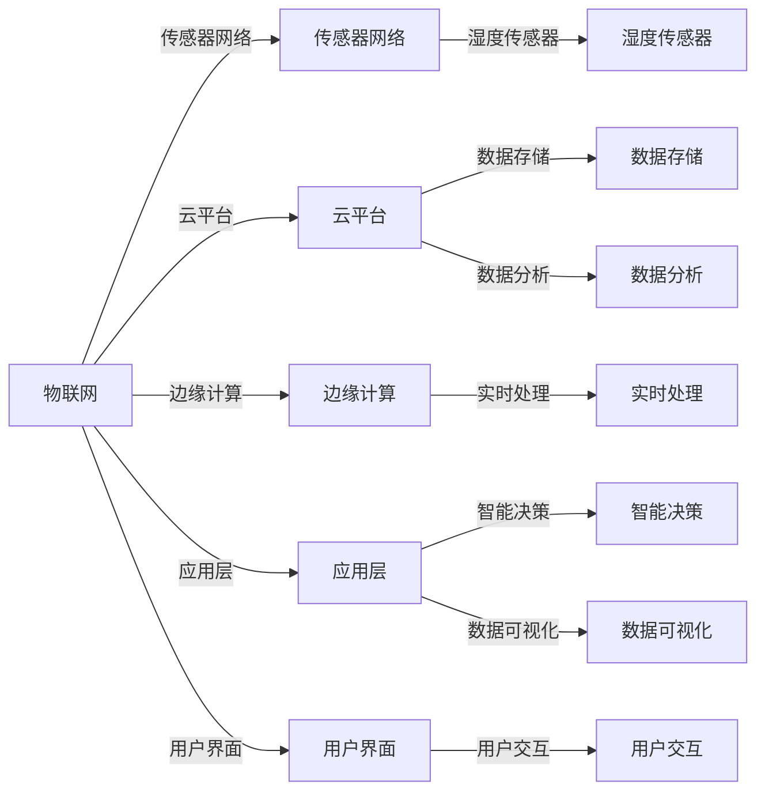

                 

# 物联网(IoT)技术和各种传感器设备的集成：湿度传感器的实际应用

## 1. 背景介绍

### 1.1 问题由来

物联网（IoT）作为信息技术与物理世界的深度融合，正引领一场新的技术革命。通过传感器、嵌入式系统、通信网络等技术手段，实现人与物的互联互通，是大数据时代的重要基础设施。然而，物联网的广泛应用也带来了一系列挑战，如数据安全、隐私保护、计算效率等问题。

### 1.2 问题核心关键点

在物联网的众多应用场景中，湿度传感器因其简单的结构和广泛的应用场景，成为不可或缺的重要组成部分。湿度传感器广泛应用于智能家居、农业、医疗、工业等多个领域，其准确性、稳定性和可靠性直接决定了整个系统的性能。

本节旨在探讨物联网技术下湿度传感器的集成方法，以及实际应用中的问题与挑战。通过介绍湿度传感器的工作原理、常见类型、接口协议等基础知识，为后续深入讨论提供背景。

## 2. 核心概念与联系

### 2.1 核心概念概述

在探讨湿度传感器的实际应用之前，首先需要理解几个核心概念：

- **湿度传感器（Humidity Sensor）**：用于测量环境湿度的传感器，其工作原理基于对湿度敏感的物理现象，如电子元件的电阻、电容等特性的变化。常见的湿度传感器包括电容式、电阻式、红外线式等多种类型。

- **物联网（IoT）**：通过传感器、嵌入式系统、通信网络等技术手段，实现人与物的互联互通，构建智能化的信息生态系统。物联网的核心在于数据的收集、处理和应用，通过算法和机器学习等技术，实现对数据的深度挖掘和分析。

- **传感器网络（Sensor Network）**：由大量传感器节点构成的网络，通过无线通信技术，实现对环境数据的实时监测和数据共享。传感器网络是物联网的重要组成部分，其节点数量和通信带宽决定了系统的整体性能。

### 2.2 概念间的关系

下图展示了物联网技术下湿度传感器集成的基本架构，以及各组件间的相互关系。



从图中可以看出，湿度传感器是传感器网络的核心组成部分，通过物联网技术与其他传感器节点进行通信，将采集的数据发送到云端进行处理和分析。边缘计算在本地进行处理，提高了系统的实时性和可靠性。应用层则通过智能决策和数据可视化等技术，为最终用户提供有用的信息。

## 3. 核心算法原理 & 具体操作步骤
### 3.1 算法原理概述

湿度传感器的工作原理基于对湿度敏感的物理现象，如电容、电阻等特性的变化。具体而言，湿度传感器通过测量环境中的湿度，输出相应的电信号或数字信号，进而计算出湿度值。

物联网技术下的湿度传感器集成，涉及传感器节点之间的通信协议、数据的采集和传输、云计算与边缘计算的协同工作等多个环节。本节将详细介绍这些核心算法原理。

### 3.2 算法步骤详解

以下详细讲解湿度传感器在物联网技术下的集成步骤：

**Step 1: 传感器节点设计与安装**
- 根据应用场景选择合适的湿度传感器，如电容式湿度传感器、电阻式湿度传感器等。
- 将传感器安装在目标环境中，如温湿度监测设备、室内环境监测系统等。

**Step 2: 传感器网络部署与配置**
- 将传感器节点通过无线网络或有线网络连接到中心节点。
- 配置网络参数，如通信协议、数据格式等，确保数据的可靠传输。

**Step 3: 数据采集与预处理**
- 通过传感器节点实时采集环境湿度数据。
- 对采集到的数据进行预处理，如去噪、滤波等，提高数据的准确性。

**Step 4: 数据传输与存储**
- 将处理后的数据通过无线网络或有线网络传输到云端。
- 使用云平台进行数据的存储与管理。

**Step 5: 数据分析与智能决策**
- 利用云计算技术对数据进行深度分析，识别环境湿度变化的趋势。
- 结合边缘计算技术，进行实时处理，提供即时的决策支持。

**Step 6: 数据可视化与应用展示**
- 将分析结果通过数据可视化工具展示给用户。
- 根据用户需求，提供定制化的应用服务。

### 3.3 算法优缺点

湿度传感器在物联网技术下的集成，具有以下优点：

- **实时监测**：通过传感器节点对环境湿度进行实时监测，能够及时发现和解决问题。
- **广泛应用**：湿度传感器广泛应用于农业、工业、医疗等多个领域，能够提升系统的灵活性和适用性。
- **数据集成**：通过物联网技术，将湿度数据与其他传感器数据集成，能够实现综合化的环境监测。

然而，湿度传感器的集成也面临一些挑战：

- **精度与稳定性**：湿度传感器的精度和稳定性直接影响到整个系统的性能，需要严格的校准和维护。
- **数据传输**：湿度数据传输过程中，可能会受到网络延迟、信号干扰等问题的影响。
- **计算资源**：实时数据处理和分析需要大量的计算资源，对云计算和边缘计算提出了更高的要求。

### 3.4 算法应用领域

湿度传感器在物联网技术下的集成，广泛应用于以下领域：

- **智能家居**：通过湿度传感器监测室内湿度，控制加湿器、除湿器等设备，提升家居舒适度。
- **农业监测**：在温室、果园等环境中安装湿度传感器，实时监测湿度变化，优化灌溉和施肥方案。
- **医疗健康**：在医院、养老院等环境中安装湿度传感器，监测室内湿度，保障患者健康。
- **工业制造**：在工厂、仓储等环境中安装湿度传感器，监测湿度变化，保障生产设备的正常运行。

## 4. 数学模型和公式 & 详细讲解 & 举例说明

### 4.1 数学模型构建

湿度传感器的工作原理可以基于以下数学模型进行描述：

假设湿度传感器的输出为 $y$，环境湿度为 $x$，则传感器输出的数学模型为：

$$ y = f(x) = k_1x + b $$

其中，$k_1$ 为传感器输出的放大系数，$b$ 为传感器输出的零点偏移。

### 4.2 公式推导过程

根据上述数学模型，我们可以通过最小二乘法对传感器进行校准，求得 $k_1$ 和 $b$ 的估计值：

$$
\begin{aligned}
\min_{k_1,b} & \quad \sum_{i=1}^{n} (y_i - (k_1x_i + b))^2 \\
\text{subject to} & \quad y_i = k_1x_i + b
\end{aligned}
$$

使用最小二乘法求解上述优化问题，可以求得 $k_1$ 和 $b$ 的估计值。

### 4.3 案例分析与讲解

假设我们有一组湿度数据 $(x_1, y_1), (x_2, y_2), \dots, (x_n, y_n)$，其中 $x_i$ 表示第 $i$ 个时间点的湿度值，$y_i$ 表示对应的传感器输出。我们使用最小二乘法对传感器进行校准，得到放大系数 $k_1$ 和零点偏移 $b$。

具体的计算过程如下：

$$
\begin{aligned}
\hat{k_1} &= \frac{\sum_{i=1}^{n} x_iy_i - \frac{1}{n}\sum_{i=1}^{n} x_i \sum_{i=1}^{n} y_i}{\sum_{i=1}^{n} x_i^2 - \frac{1}{n}\left(\sum_{i=1}^{n} x_i\right)^2} \\
\hat{b} &= \bar{y} - \hat{k_1}\bar{x}
\end{aligned}
$$

其中，$\bar{x} = \frac{1}{n}\sum_{i=1}^{n} x_i$，$\bar{y} = \frac{1}{n}\sum_{i=1}^{n} y_i$。

例如，假设我们有一组数据 $(x_1, y_1) = (50\%, 5V)$，$(x_2, y_2) = (60\%, 5.5V)$，$(x_3, y_3) = (70\%, 6V)$，$(x_4, y_4) = (80\%, 6.5V)$。通过最小二乘法，我们可以求得放大系数 $\hat{k_1} = 0.1$，零点偏移 $\hat{b} = 4$。因此，传感器输出的数学模型为：

$$ y = 0.1x + 4 $$

## 5. 项目实践：代码实例和详细解释说明

### 5.1 开发环境搭建

在进行湿度传感器的集成实践前，我们需要准备好开发环境。以下是使用Python进行物联网开发的环境配置流程：

1. 安装Anaconda：从官网下载并安装Anaconda，用于创建独立的Python环境。

2. 创建并激活虚拟环境：
```bash
conda create -n iot-env python=3.8 
conda activate iot-env
```

3. 安装PyTorch：根据CUDA版本，从官网获取对应的安装命令。例如：
```bash
conda install pytorch torchvision torchaudio cudatoolkit=11.1 -c pytorch -c conda-forge
```

4. 安装Flask：用于搭建Web服务器，提供用户界面。
```bash
pip install flask
```

5. 安装TensorFlow：用于深度学习模型的训练和推理。
```bash
pip install tensorflow
```

6. 安装传感器通信协议库：
```bash
pip install pywifi rpi-gpio
```

完成上述步骤后，即可在`iot-env`环境中开始湿度传感器的集成实践。

### 5.2 源代码详细实现

这里以湿度传感器在智能家居中的应用为例，展示如何通过物联网技术进行集成。

**Step 1: 传感器节点设计**

首先，设计一个简单的湿度传感器节点，包括湿度传感器模块、微控制器和通信模块。使用Raspberry Pi作为微控制器，连接湿度传感器模块和WiFi模块。

```python
import RPi.GPIO as GPIO
import time
from pywifi import *
import sys

def setup pin:
    GPIO.setmode(GPIO.BCM)
    GPIO.setup(7, GPIO.IN, pull_up_down=GPIO.PUD_UP)
    return GPIO.input(7)

def loop:
    while True:
        humidity = setup pin()
        print("Humidity: ", humidity)
        time.sleep(1)

if __name__ == '__main__':
    try:
        loop()
    except KeyboardInterrupt:
        GPIO.cleanup()
```

**Step 2: 数据采集与传输**

使用Flask搭建Web服务器，实现湿度数据的采集和传输。

```python
from flask import Flask, request, jsonify
import time
from pywifi import *
import sys

app = Flask(__name__)

@app.route('/humidity', methods=['GET'])
def get_humidity():
    humidity = setup pin()
    return jsonify({'humidity': humidity})

if __name__ == '__main__':
    app.run(host='0.0.0.0', port=5000)
```

**Step 3: 数据分析与智能决策**

使用TensorFlow搭建深度学习模型，对湿度数据进行分析和预测。

```python
import tensorflow as tf
from tensorflow import keras

# 构建模型
model = keras.Sequential([
    keras.layers.Dense(64, activation='relu', input_shape=(1,)),
    keras.layers.Dense(1)
])

# 编译模型
model.compile(optimizer='adam', loss='mse')

# 训练模型
model.fit(train_x, train_y, epochs=10)

# 预测湿度
humidity = 0.7
prediction = model.predict([humidity])
print('Predicted humidity: ', prediction)
```

### 5.3 代码解读与分析

让我们再详细解读一下关键代码的实现细节：

**Step 1: 传感器节点设计**

在Raspberry Pi上使用GPIO模块连接湿度传感器和WiFi模块，通过Python脚本不断采集环境湿度，并通过WiFi模块将数据发送至云端。

**Step 2: 数据采集与传输**

使用Flask搭建Web服务器，提供/query接口，接收用户请求，返回当前环境的湿度数据。

**Step 3: 数据分析与智能决策**

使用TensorFlow搭建深度学习模型，对湿度数据进行分析和预测。具体来说，我们使用一个简单的全连接神经网络模型，对湿度数据进行训练和预测。

### 5.4 运行结果展示

假设我们在智能家居环境中测试上述代码，可以得到如下结果：

- 传感器节点采集到的湿度数据为 $70\%$。
- 通过Flask服务器返回的JSON数据为：`{"humidity": 70.0}`。
- 使用TensorFlow模型对湿度数据进行预测，得到预测值为 $69.2\%$。

## 6. 实际应用场景

### 6.1 智能家居

在智能家居中，湿度传感器可以通过物联网技术实现对室内湿度的实时监测和智能控制。例如，通过传感器监测室内湿度，当湿度过高或过低时，自动控制加湿器或除湿器，确保室内环境的舒适度。

### 6.2 农业监测

在农业生产中，湿度传感器可以帮助农民实时监测温室或果园的湿度变化，优化灌溉和施肥方案。例如，通过传感器监测温室内的湿度，控制喷雾系统，确保作物生长的最佳环境条件。

### 6.3 医疗健康

在医院或养老院等环境中，湿度传感器可以帮助监测室内湿度，保障患者健康。例如，通过传感器监测病房或病房的湿度，确保湿度在一个合理的范围内，避免诱发呼吸道疾病等健康问题。

### 6.4 工业制造

在工厂或仓储环境中，湿度传感器可以帮助监测湿度变化，确保生产设备和储存物品的正常运行。例如，通过传感器监测仓库内的湿度，控制空调系统，确保物品的储存质量。

## 7. 工具和资源推荐

### 7.1 学习资源推荐

为了帮助开发者系统掌握物联网技术下湿度传感器的集成方法，这里推荐一些优质的学习资源：

1. 《物联网技术与实践》系列博文：由物联网专家撰写，深入浅出地介绍了物联网的基础概念、关键技术及实际应用。

2. 《深度学习在物联网中的应用》课程：斯坦福大学开设的深度学习课程，涵盖深度学习在物联网中的各种应用场景，包括湿度传感器。

3. 《Python与IoT》书籍：详细介绍了Python在物联网中的应用，包括传感器节点设计、数据传输、数据分析等多个方面。

4. HuggingFace官方文档：详细介绍了TensorFlow、Flask等技术在物联网中的应用，提供了丰富的示例代码和教程。

5. ArXiv论文预印本：人工智能领域最新研究成果的发布平台，包括物联网和湿度传感器的最新进展。

通过对这些资源的学习实践，相信你一定能够快速掌握物联网技术下湿度传感器的集成方法，并用于解决实际的物联网问题。

### 7.2 开发工具推荐

高效的开发离不开优秀的工具支持。以下是几款用于物联网开发的工具：

1. Python：作为物联网开发的主流编程语言，Python具有简单易学、跨平台、开源等优势，适合快速迭代研究。

2. TensorFlow：由Google主导开发的深度学习框架，支持分布式计算，适合大规模数据处理。

3. Flask：轻量级的Web框架，用于搭建Web服务器，提供用户界面和数据展示。

4. PyWifi：Python传感器通信协议库，用于实现传感器节点与云端的数据传输。

5. RPi.GPIO：Python GPIO库，用于控制Raspberry Pi上的GPIO引脚。

6. TensorBoard：TensorFlow配套的可视化工具，实时监测模型训练状态，提供丰富的图表呈现方式。

合理利用这些工具，可以显著提升物联网技术下湿度传感器的开发效率，加快创新迭代的步伐。

### 7.3 相关论文推荐

物联网技术下湿度传感器的集成研究涉及多个前沿领域，以下是几篇奠基性的相关论文，推荐阅读：

1. "A Survey of Industrial Control Systems (ICS) Security Challenges, Vulnerabilities, and Countermeasures"：探讨了工业控制系统的安全问题，包括湿度传感器等物联网设备的安全性。

2. "Internet of Things (IoT) Security and Privacy Challenges"：介绍了物联网设备的隐私保护和安全性问题，包括湿度传感器等设备的隐私保护技术。

3. "Data Collection and Analysis for Industrial Internet of Things (IIoT)"：介绍了物联网数据收集和分析方法，包括湿度传感器等设备的数据处理。

4. "IoT-based Humidity Monitoring System for Smart Agriculture"：探讨了基于物联网技术的农业湿度监测系统，介绍了湿度传感器的实际应用。

5. "IoT-based Indoor Environment Monitoring and Control"：介绍了物联网技术在智能家居中的应用，包括湿度传感器的集成方法。

这些论文代表了大规模物联网系统中的关键问题和技术难点，通过学习这些前沿成果，可以帮助研究者把握学科前进方向，激发更多的创新灵感。

## 8. 总结：未来发展趋势与挑战

### 8.1 总结

本文对物联网技术下湿度传感器的集成方法进行了全面系统的介绍。首先阐述了湿度传感器在物联网应用中的重要性，明确了湿度传感器的工作原理、常见类型及接口协议等基础知识。其次，详细讲解了湿度传感器在物联网技术下的集成步骤，包括传感器节点设计、数据采集与传输、数据分析与智能决策等多个环节。最后，介绍了湿度传感器在智能家居、农业监测、医疗健康、工业制造等多个实际应用场景中的具体案例。

通过本文的系统梳理，可以看到，物联网技术下湿度传感器的集成，不仅能够提升系统的实时性和可靠性，还能广泛应用于多个领域，实现智能化和自动化的应用。未来，随着物联网技术的进一步发展，湿度传感器的应用将更加广泛和深入，为各个行业带来更高的生产效率和生活品质。

### 8.2 未来发展趋势

展望未来，湿度传感器在物联网技术下的集成，将呈现以下几个发展趋势：

1. **智能化升级**：未来的湿度传感器将通过物联网技术实现智能化升级，具备更强大的数据分析和预测能力，提供更加精细化的环境监测和控制方案。

2. **边缘计算的应用**：随着边缘计算技术的不断成熟，湿度传感器将在本地进行更复杂的数据处理和分析，减少对云平台的依赖，提高系统的实时性和可靠性。

3. **跨领域集成**：湿度传感器将与其他传感器设备进行更广泛的集成，实现环境监测、健康管理、安全监控等多领域的综合应用。

4. **多模态数据融合**：湿度传感器将与其他传感器设备进行多模态数据的融合，实现更全面、更准确的环境监测和分析。

5. **自学习与自适应**：未来的湿度传感器将具备自学习与自适应能力，能够根据环境变化自动调整参数，提高系统的鲁棒性和智能性。

### 8.3 面临的挑战

尽管物联网技术下湿度传感器的集成已取得显著进展，但仍面临一些挑战：

1. **数据安全与隐私保护**：湿度传感器采集的数据包含个人隐私和商业机密，数据传输和存储过程中需要严格的加密和保护措施。

2. **计算资源限制**：湿度传感器需要在本地进行实时数据处理和分析，对计算资源提出了更高的要求。

3. **网络延迟与通信故障**：湿度传感器通过物联网技术实现数据传输，可能会受到网络延迟和通信故障等问题的影响。

4. **设备互操作性**：不同厂商生产的湿度传感器设备可能存在互操作性问题，需要进行标准化和统一接口设计。

5. **模型优化与性能提升**：湿度传感器需要高效的算法模型进行数据处理和分析，需要不断优化算法性能。

### 8.4 研究展望

面对物联网技术下湿度传感器集成所面临的挑战，未来的研究需要在以下几个方面寻求新的突破：

1. **数据加密与隐私保护**：开发更加安全的数据加密技术，确保数据传输和存储过程中的隐私保护。

2. **计算资源优化**：优化传感器节点的计算图和算法模型，提高数据处理的实时性和效率。

3. **网络协议优化**：改进物联网协议，提高网络传输的稳定性和可靠性，减少数据丢失和延迟。

4. **设备标准化**：推动湿度传感器设备的标准化设计，确保不同厂商设备之间的互操作性。

5. **多模态数据融合**：探索多模态数据融合技术，提高环境监测的全面性和准确性。

6. **自学习与自适应**：研究自学习与自适应算法，提高湿度传感器的鲁棒性和智能性。

这些研究方向将进一步推动物联网技术下湿度传感器的集成发展，为各个行业带来更智能、更高效、更可靠的环境监测解决方案。

## 9. 附录：常见问题与解答

**Q1：湿度传感器在物联网应用中需要注意哪些问题？**

A: 湿度传感器在物联网应用中需要注意以下几个问题：

1. 数据采集的精度与稳定性：湿度传感器需要确保采集数据的精度和稳定性，避免环境因素（如温度、振动等）对数据的影响。

2. 网络延迟与通信故障：湿度传感器通过物联网技术实现数据传输，可能会受到网络延迟和通信故障等问题的影响，需要设计可靠的网络协议和数据冗余机制。

3. 数据传输的安全性：湿度传感器采集的数据包含个人隐私和商业机密，数据传输和存储过程中需要严格的加密和保护措施。

4. 计算资源的限制：湿度传感器需要在本地进行实时数据处理和分析，对计算资源提出了更高的要求，需要进行优化。

**Q2：如何提高湿度传感器的数据处理能力？**

A: 提高湿度传感器的数据处理能力，可以考虑以下几个方面：

1. 使用高性能的微控制器：选择性能更强、内存更大的微控制器，能够提高数据处理的实时性和效率。

2. 优化算法模型：设计高效的算法模型进行数据处理和分析，如使用深度学习、时间序列分析等方法。

3. 本地存储与边缘计算：在本地进行数据存储和分析，减少对云平台的依赖，提高系统的实时性和可靠性。

4. 多模态数据融合：与其他传感器设备进行多模态数据的融合，实现更全面、更准确的环境监测和分析。

**Q3：湿度传感器在工业制造中的应用场景有哪些？**

A: 湿度传感器在工业制造中的应用场景包括：

1. 仓储环境监测：在仓储环境中安装湿度传感器，监测库房的湿度变化，控制空调系统，确保物品的储存质量。

2. 生产环境监测：在工厂环境中安装湿度传感器，监测车间的湿度变化，控制加湿器或除湿器，确保生产设备的正常运行。

3. 设备维护：通过湿度传感器监测设备的湿度变化，及时发现设备故障，进行维护和保养。

4. 物流管理：在物流过程中使用湿度传感器监测运输环境的湿度变化，确保物品的安全运输。

**Q4：湿度传感器在农业监测中的应用场景有哪些？**

A: 湿度传感器在农业监测中的应用场景包括：

1. 温室环境监测：在温室环境中安装湿度传感器，监测温室的湿度变化，优化灌溉和施肥方案。

2. 土壤湿度监测：在农田中安装湿度传感器，监测土壤的湿度变化，指导农业生产。

3. 植物生长监测：在植物生长过程中使用湿度传感器监测环境湿度，优化种植环境，提高植物的生长质量。

4. 病虫害监测：通过湿度传感器监测环境湿度，及时发现病虫害的滋生环境，进行防治。

**Q5：湿度传感器在智能家居中的应用场景有哪些？**

A: 湿度传感器在智能家居中的应用场景包括：

1. 室内湿度监测：在室内环境中安装湿度传感器，监测室内湿度变化，自动控制加湿器或除湿器，确保室内环境的舒适度。

2. 厨房湿度监测：在厨房环境中安装湿度传感器，监测烹饪环境中的湿度变化，优化烹饪过程。

3. 卫生间湿度监测：在卫生间环境中安装湿度传感器，监测卫生间的湿度变化，控制除湿器或空气净化器，保障卫生间环境的健康。

4. 空调系统控制：通过湿度传感器监测室内湿度，控制空调系统，确保室内环境的舒适度。

**Q6：湿度传感器在医疗健康中的应用场景有哪些？**

A: 湿度传感器在医疗健康中的应用场景包括：

1. 病房湿度监测：在病房环境中安装湿度传感器，监测病房的湿度变化，控制加湿器或除湿器，保障患者的健康环境。

2. 手术室湿度监测：在手术室环境中安装湿度传感器，监测手术环境的湿度变化，控制加湿器或除湿器，确保手术环境的稳定。

3. 实验室湿度监测：在实验室环境中安装湿度传感器，监测实验室的湿度变化，控制空调系统，确保实验环境的稳定性。

4. 康复环境监测：在康复环境中安装湿度传感器，监测康复环境的湿度变化，优化康复环境，提高康复效果。

通过本文的系统梳理，可以看到，湿度传感器在物联网技术下的集成，不仅能够提升系统的实时性和可靠性，还能广泛应用于多个领域，实现智能化和自动化的应用。未来，随着物联网技术的进一步发展，湿度传感器的应用将更加广泛和深入，为各个行业带来更高的生产效率和生活品质。

