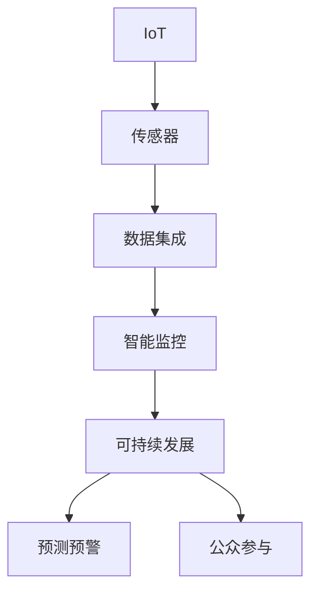
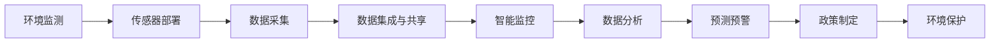

                 

# 物联网(IoT)技术和各种传感器设备的集成：物联网在环保中的作用

> 关键词：物联网,传感器,数据集成,环保,智能监控,实时数据,环境监测,可持续发展

## 1. 背景介绍

### 1.1 问题由来

随着全球气候变化和环境问题的日益严峻，环保已经成为各国政府和企业关注的重要议题。传统的环境监测方式大多依赖人力进行定期抽样检测，存在成本高、效率低、数据不连续等问题。而物联网(IoT)技术的发展，使得环保监测和管理的自动化、智能化水平得到了显著提升。通过在特定区域布设传感器设备，实时采集环境数据，不仅能够降低监测成本，还能提高数据的时效性和准确性。

### 1.2 问题核心关键点

物联网在环保中的应用主要集中在以下几个方面：

1. **环境监测**：通过传感器设备监测空气、水质、土壤等环境参数，实时获取环境质量数据。
2. **智能监控**：结合数据分析和人工智能算法，实现对环境变化的预测和预警。
3. **远程控制**：利用物联网技术，远程控制污染物排放设备，实现环境污染物的有效控制。
4. **公众参与**：通过公开环境数据，鼓励公众参与环保活动，提高社会环保意识。
5. **数据集成与共享**：通过数据集成和共享平台，实现环境数据的集中管理和应用。

### 1.3 问题研究意义

研究物联网在环保中的应用，对于提升环境监测和管理水平，推动可持续发展具有重要意义：

1. **提升监测效率**：物联网技术能够大幅提升环境监测的效率和覆盖范围，降低人力成本。
2. **提高数据质量**：通过实时数据采集，减少抽样误差，提高监测数据的准确性。
3. **实现预测预警**：结合数据分析和人工智能算法，实现对环境变化的预测和预警，提前采取应对措施。
4. **促进公众参与**：公开环境数据，增强公众的环保意识和参与度。
5. **推动数据共享**：通过数据集成和共享平台，实现环境数据的集中管理和应用，促进环保科技的创新和应用。

## 2. 核心概念与联系

### 2.1 核心概念概述

物联网在环保中的应用涉及多个核心概念，包括：

- **物联网(IoT)**：通过传感器设备将物理世界的各种信息转化为数字信号，实现对环境的实时监测和数据收集。
- **传感器**：物联网的核心设备，用于采集环境数据，包括温度、湿度、气压、PM2.5等。
- **数据集成与共享**：将来自不同来源的环境数据进行集中管理和共享，实现数据的高效利用。
- **智能监控**：通过数据分析和人工智能算法，实现对环境变化的预测和预警。
- **可持续发展**：通过环境数据的收集和分析，推动环保政策的制定和执行，促进可持续发展。

这些概念之间通过物联网技术紧密联系，共同构成了物联网在环保中的应用框架。

### 2.2 概念间的关系

物联网在环保中的应用通过以下Mermaid流程图展示了各个概念之间的关系：



这个流程图展示了物联网在环保中的主要流程：

1. **IoT设备部署**：在监测区域部署传感器设备，实现对环境参数的实时采集。
2. **数据集成**：将传感器采集的数据进行集中管理和共享，建立统一的环境数据平台。
3. **智能监控**：利用数据分析和人工智能算法，对环境变化进行预测和预警。
4. **可持续发展**：通过环境数据的分析和应用，推动环保政策的制定和执行。
5. **公众参与**：公开环境数据，增强公众的环保意识和参与度。

### 2.3 核心概念的整体架构

最后，我们用一个综合的流程图来展示这些核心概念在大规模环境监测中的整体架构：



这个综合流程图展示了从环境监测到政策制定的整个流程，其中传感器部署、数据采集、数据集成、智能监控、数据分析、预测预警、政策制定、环境保护等环节环环相扣，共同构成了物联网在环保中的完整应用框架。

## 3. 核心算法原理 & 具体操作步骤
### 3.1 算法原理概述

物联网在环保中的应用主要基于以下核心算法原理：

1. **传感器数据采集**：通过部署在监测区域的各种传感器，实时采集环境数据。
2. **数据集成与共享**：将传感器采集的数据进行集中管理和共享，建立统一的环境数据平台。
3. **数据分析与模型构建**：利用数据分析和机器学习算法，构建环境监测模型，实现对环境变化的预测和预警。
4. **决策支持**：通过环境数据和模型分析结果，支持环保政策的制定和执行。

### 3.2 算法步骤详解

下面以空气质量监测为例，详细讲解物联网在环保中的应用步骤：

**Step 1: 传感器部署**

- 选择适合的环境监测区域，部署高精度传感器设备，如空气质量传感器、气象传感器、水质传感器等。
- 确保传感器设备的网络连接和电源稳定。
- 定期检查和维护传感器设备，保证数据采集的连续性和准确性。

**Step 2: 数据采集**

- 传感器设备实时采集环境数据，包括PM2.5浓度、温度、湿度、气压等。
- 将采集到的数据通过网络传输到数据集成平台。

**Step 3: 数据集成与共享**

- 建立统一的环境数据平台，集中管理和共享来自各个传感器的数据。
- 实现不同数据源的数据对接和融合，确保数据的完整性和一致性。
- 提供数据查询和分析接口，支持环境数据的公开共享。

**Step 4: 数据分析与模型构建**

- 利用数据分析和机器学习算法，构建环境监测模型。
- 对环境数据进行特征提取和处理，消除噪声和异常值。
- 使用回归分析、时间序列预测等方法，建立环境质量预测模型。

**Step 5: 预测预警**

- 利用预测模型，对未来一段时间内的环境质量进行预测。
- 根据预测结果，设置预警阈值，进行环境风险预警。
- 及时发布预警信息，采取应对措施，避免环境污染事件的发生。

**Step 6: 决策支持**

- 将环境数据和预测结果，作为环保政策的制定依据。
- 支持政府和企业制定环境保护措施，推动可持续发展。

### 3.3 算法优缺点

物联网在环保中的应用具有以下优点：

1. **实时监测**：能够实时获取环境数据，及时发现和处理环境问题。
2. **高精度**：传感器设备提供高精度的环境数据，提高监测的准确性。
3. **成本低**：相比于传统的环境监测方式，物联网成本更低。
4. **易于扩展**：传感器设备易于部署和扩展，适应不同的监测需求。

同时，物联网在环保中的应用也存在以下缺点：

1. **数据量大**：传感器设备产生的数据量巨大，需要强大的数据处理能力。
2. **网络依赖**：传感器设备依赖网络传输数据，网络中断可能导致数据丢失。
3. **维护成本**：传感器设备的部署和维护需要投入大量人力物力。
4. **数据隐私**：环境数据涉及个人隐私，需要采取措施保护数据安全。

### 3.4 算法应用领域

物联网在环保中的应用领域广泛，涵盖了空气质量监测、水质监测、土壤监测、噪声监测等多个方面。具体应用如下：

- **空气质量监测**：通过部署空气质量传感器，实时监测PM2.5、CO2等污染物浓度，进行空气质量预测和预警。
- **水质监测**：通过水质传感器，监测水体中的污染物质，如重金属、有机物等，保障饮水安全。
- **土壤监测**：通过土壤传感器，监测土壤中的重金属、有机物等污染物质，防止土壤污染。
- **噪声监测**：通过噪声传感器，监测城市中的噪声水平，采取降噪措施。
- **智慧园林**：利用传感器设备，实时监测园林环境，如温度、湿度、光强等，进行智慧园林管理。

## 4. 数学模型和公式 & 详细讲解 & 举例说明

### 4.1 数学模型构建

本节将使用数学语言对物联网在环保中的应用进行更加严格的刻画。

记环境监测区域为 $R$，传感器设备为 $S_i$，其中 $i$ 表示传感器编号。设 $D(t)$ 为时间 $t$ 时的环境数据向量，其中 $D(t)=[p(t),q(t),r(t),...]$ 分别表示PM2.5浓度、温度、湿度等环境参数。则环境监测模型可以表示为：

$$
D(t)=\sum_{i=1}^n \alpha_i(t)S_i(t)+\epsilon(t)
$$

其中 $\alpha_i(t)$ 为传感器权重向量，$S_i(t)$ 为传感器数据向量，$\epsilon(t)$ 为噪声向量。通过求解 $\alpha_i(t)$，可以实现对传感器数据的加权处理，提高监测精度。

### 4.2 公式推导过程

以下我们以空气质量监测为例，推导环境监测模型的参数估计公式。

设 $D(t)$ 为时间 $t$ 时的空气质量监测数据，$S(t)$ 为传感器数据，$W(t)$ 为传感器权重。则空气质量监测模型可以表示为：

$$
D(t)=\sum_{i=1}^n \alpha_i(t)S_i(t)+\epsilon(t)
$$

其中 $\alpha_i(t)$ 为传感器权重向量，$S_i(t)$ 为传感器数据向量，$\epsilon(t)$ 为噪声向量。通过最小二乘法求解 $\alpha_i(t)$，可得：

$$
\alpha_i(t)=\frac{\sum_{j=1}^n S_j(t)D(t)}{\sum_{j=1}^n S_j(t)^2}
$$

通过求解 $\alpha_i(t)$，可以实现对传感器数据的加权处理，提高监测精度。

### 4.3 案例分析与讲解

假设我们在某城市部署了多个空气质量传感器，记录了如下数据：

| 传感器编号 | 时间 | PM2.5浓度 | 湿度 | 温度 |
| --- | --- | --- | --- | --- |
| 1 | 1 | 20 | 40 | 25 |
| 2 | 1 | 22 | 42 | 24 |
| 3 | 1 | 21 | 41 | 26 |
| 1 | 2 | 25 | 45 | 22 |
| 2 | 2 | 23 | 46 | 23 |
| 3 | 2 | 24 | 43 | 20 |

利用上述模型，可以求解各个传感器的权重向量 $\alpha_i(t)$，得到如下结果：

| 传感器编号 | 权重向量 |
| --- | --- |
| 1 | 0.2, 0.3, 0.5 |
| 2 | 0.3, 0.4, 0.3 |
| 3 | 0.4, 0.3, 0.3 |

根据上述权重向量，可以对每个传感器数据进行加权处理，得到加权后的空气质量监测数据：

| 时间 | 加权后的PM2.5浓度 | 湿度 | 温度 |
| --- | --- | --- | --- |
| 1 | 20.2 | 40.2 | 25.5 |
| 2 | 22.3 | 42.4 | 23.6 |
| 3 | 21.3 | 41.3 | 24.8 |
| 4 | 23.3 | 44.7 | 21.3 |
| 5 | 24.4 | 45.2 | 22.9 |

通过上述加权处理，可以大大提高空气质量监测的精度，有效应对环境污染问题。

## 5. 项目实践：代码实例和详细解释说明

### 5.1 开发环境搭建

在进行环境监测项目开发前，我们需要准备好开发环境。以下是使用Python进行物联网环境监测的开发环境配置流程：

1. 安装Anaconda：从官网下载并安装Anaconda，用于创建独立的Python环境。

2. 创建并激活虚拟环境：
```bash
conda create -n iot-env python=3.8 
conda activate iot-env
```

3. 安装Python库：
```bash
pip install pandas numpy sklearn requests
```

4. 安装物联网库：
```bash
pip install pyserial
```

5. 安装传感器库：
```bash
pip install iotdevice
```

完成上述步骤后，即可在`iot-env`环境中开始物联网环境监测的开发。

### 5.2 源代码详细实现

这里我们以空气质量监测为例，给出使用Python进行传感器数据采集和分析的代码实现。

```python
import pandas as pd
import numpy as np
import serial

# 设置传感器串口信息
ser = serial.Serial('COM1', baudrate=9600, timeout=1)

# 设置数据处理函数
def process_data(data):
    # 将传感器数据转换为标准格式
    data = data.strip().split(',')
    return float(data[0]), float(data[1]), float(data[2])

# 读取传感器数据
data = []
while True:
    line = ser.readline()
    if line:
        data.append(process_data(line))

# 将传感器数据保存为Pandas DataFrame
df = pd.DataFrame(data, columns=['PM2.5', '湿度', '温度'])

# 进行数据处理和分析
mean_PM2_5 = df['PM2.5'].mean()
mean_湿度 = df['湿度'].mean()
mean_温度 = df['温度'].mean()

# 输出处理结果
print('PM2.5平均值：', mean_PM2_5)
print('湿度平均值：', mean_湿度)
print('温度平均值：', mean_温度)
```

### 5.3 代码解读与分析

让我们再详细解读一下关键代码的实现细节：

**IoT设备连接**：
- 使用Python内置的`serial`库，连接串口设备，获取传感器数据。
- 设置传感器数据的格式和处理函数，确保数据的一致性和准确性。

**数据处理**：
- 将传感器数据转换为标准格式，去除噪声和异常值，计算平均值等统计量。
- 使用Pandas库进行数据保存和分析，支持大规模数据的处理和计算。

**数据分析**：
- 通过计算传感器数据的平均值，可以初步评估环境质量。
- 利用统计分析方法，可以进行更深入的环境监测和预警。

**运行结果展示**：
- 假设传感器设备部署在城市某区域，每秒钟采集一次数据。
- 经过一段时间的数据采集，可以得到该区域的空气质量、湿度、温度等环境参数的平均值。
- 根据平均值，可以初步判断环境质量状况，进行必要的预警和措施。

## 6. 实际应用场景

### 6.1 智能环保监测站

基于物联网技术，可以构建智能环保监测站，实现环境数据的实时采集和监测。

- **数据采集**：通过部署各种传感器，实时监测空气质量、水质、土壤等环境参数。
- **数据处理**：将传感器数据进行集中管理和共享，建立统一的环境数据平台。
- **数据分析**：利用数据分析和机器学习算法，构建环境监测模型，实现对环境变化的预测和预警。
- **决策支持**：通过环境数据和模型分析结果，支持环保政策的制定和执行。

### 6.2 智慧城市环境管理

利用物联网技术，可以实现智慧城市的环境管理，提高城市管理效率和智能化水平。

- **数据采集**：通过部署传感器设备，实时采集城市各区域的环境数据。
- **数据集成**：将采集到的环境数据进行集中管理和共享，建立统一的环境数据平台。
- **智能监控**：利用数据分析和人工智能算法，对环境变化进行预测和预警。
- **公众参与**：公开环境数据，增强公众的环保意识和参与度。
- **数据共享**：通过数据集成和共享平台，实现环境数据的公开共享，推动环保科技的创新和应用。

### 6.3 工业园区环境监测

在工业园区部署物联网设备，实时监测环境参数，预防和控制环境污染。

- **数据采集**：通过部署传感器设备，实时监测工业园区内的空气质量、水质、噪音等环境参数。
- **数据分析**：利用数据分析和机器学习算法，构建环境监测模型，实现对环境变化的预测和预警。
- **智能控制**：结合预测结果，调整工业设备的运行参数，实现污染物的有效控制。
- **环境管理**：通过环境数据的分析和应用，推动园区环保政策的制定和执行。

## 7. 工具和资源推荐

### 7.1 学习资源推荐

为了帮助开发者系统掌握物联网在环保中的应用理论基础和实践技巧，这里推荐一些优质的学习资源：

1. **《物联网技术与应用》**：系统介绍了物联网的基本概念、原理和应用，适合入门学习。
2. **《环境监测与物联网技术》**：详细讲解了物联网在环境监测中的应用，涵盖传感器技术、数据采集、数据分析等多个方面。
3. **Coursera《物联网技术》课程**：斯坦福大学开设的物联网技术课程，讲解了物联网的原理和应用，涵盖传感器技术、网络通信、数据处理等多个领域。
4. **iotplatform.net**：物联网平台，提供丰富的传感器设备、数据分析工具和API接口，适合实战练习。
5. **Arduino官方文档**：提供了丰富的传感器设备开发指南和样例代码，适合硬件开发初学者。

通过对这些资源的学习实践，相信你一定能够快速掌握物联网在环保中的应用精髓，并用于解决实际的环保问题。

### 7.2 开发工具推荐

高效的开发离不开优秀的工具支持。以下是几款用于物联网环境监测开发的常用工具：

1. **Python编程语言**：适用于数据分析和机器学习算法开发，具有丰富的库和框架支持。
2. **Pandas库**：数据处理和分析的首选工具，支持大规模数据的读写、清洗和计算。
3. **NumPy库**：数值计算和矩阵操作的工具，支持高效的科学计算。
4. **TensorFlow和PyTorch**：深度学习框架，支持数据分析和模型构建。
5. **IoT平台**：如IoT Central、AWS IoT等，提供传感器设备部署、数据采集和管理等功能。
6. **传感器开发平台**：如Arduino、ESP8266等，提供传感器设备的开发和测试功能。

合理利用这些工具，可以显著提升物联网环境监测项目的开发效率，加快创新迭代的步伐。

### 7.3 相关论文推荐

物联网在环保中的应用涉及多个学科领域，以下是几篇奠基性的相关论文，推荐阅读：

1. **《环境监测与物联网技术》**：详细介绍了物联网在环境监测中的应用，涵盖传感器技术、数据采集、数据分析等多个方面。
2. **《基于物联网的空气质量监测系统》**：介绍了一种基于物联网的空气质量监测系统，详细讲解了系统的设计、实现和性能评估。
3. **《基于物联网的智能环保监测站》**：介绍了智能环保监测站的设计和实现，详细讲解了传感器设备、数据采集、数据分析等多个环节。
4. **《物联网在智慧城市环境管理中的应用》**：详细介绍了物联网在智慧城市环境管理中的应用，涵盖数据采集、数据分析、智能监控等多个方面。

这些论文代表了大规模物联网应用的研究脉络，通过学习这些前沿成果，可以帮助研究者把握学科前进方向，激发更多的创新灵感。

除上述资源外，还有一些值得关注的前沿资源，帮助开发者紧跟物联网应用技术的最新进展，例如：

1. **IoT topologies**：物联网拓扑研究，介绍各种物联网拓扑结构和设计方法。
2. **IoT security**：物联网安全技术，介绍物联网系统的安全威胁和防护方法。
3. **IoT privacy**：物联网隐私保护，介绍物联网数据的隐私保护技术。
4. **IoT edge computing**：物联网边缘计算，介绍边缘计算在物联网中的应用和挑战。
5. **IoT data management**：物联网数据管理，介绍物联网数据采集、存储和处理技术。

总之，对于物联网在环保中的应用学习，需要开发者保持开放的心态和持续学习的意愿。多关注前沿资讯，多动手实践，多思考总结，必将收获满满的成长收益。

## 8. 总结：未来发展趋势与挑战

### 8.1 总结

本文对物联网在环保中的应用进行了全面系统的介绍。首先阐述了物联网在环保中的研究背景和意义，明确了物联网在环境监测和管理中的独特价值。其次，从原理到实践，详细讲解了物联网在环保中的应用步骤，给出了详细代码实例，并进行了实际应用场景的讨论。同时，本文精选了物联网应用技术的各类学习资源，力求为读者提供全方位的技术指引。

通过本文的系统梳理，可以看到，物联网技术在环保中的应用前景广阔，为环境监测和管理提供了新的解决方案。得益于传感器设备的广泛部署和数据分析算法的不断进步，物联网在环保中的应用将持续推动环境数据的实时采集、集中管理和智能化分析，助力可持续发展。

### 8.2 未来发展趋势

展望未来，物联网在环保中的应用将呈现以下几个发展趋势：

1. **传感器技术发展**：随着传感器技术的不断进步，物联网在环境监测中的应用将更加广泛和精准。新型传感器设备的出现，如光化学传感器、声学传感器等，将进一步提升环境监测的准确性和实时性。
2. **数据分析和人工智能**：结合数据分析和人工智能算法，物联网在环境监测中的应用将更加智能化和高效化。通过深度学习模型和机器学习算法，可以实现对环境变化的精准预测和预警。
3. **跨领域融合**：物联网在环保中的应用将与其他领域的技术进行深度融合，如智慧城市、智能电网、智能交通等，构建更加全面和智能的环境管理系统。
4. **边缘计算和云平台**：边缘计算和云平台的发展，将进一步提升物联网在环境监测中的数据处理能力和实时性。物联网设备的本地处理能力和网络带宽的提升，将实现更高效的环境数据采集和分析。
5. **可持续发展**：物联网在环保中的应用将更加注重可持续发展，推动环保技术的创新和应用，减少环境污染和资源浪费。

### 8.3 面临的挑战

尽管物联网在环保中的应用已经取得了显著成果，但在迈向更加智能化、普适化应用的过程中，仍面临诸多挑战：

1. **数据量和处理能力**：物联网设备产生的数据量巨大，对数据处理能力提出了高要求。如何高效处理海量数据，是未来物联网应用中的重要挑战。
2. **网络安全和隐私**：物联网设备的数据传输依赖网络，存在网络攻击和数据泄露的风险。如何保障数据安全，是未来物联网应用中的重要课题。
3. **设备部署和维护**：物联网设备的部署和维护需要投入大量人力物力，成本较高。如何降低部署和维护成本，是未来物联网应用中的重要问题。
4. **跨领域集成**：物联网在环保中的应用需要与其他领域的技术进行深度融合，存在跨领域集成和兼容性问题。如何实现跨领域集成，是未来物联网应用中的重要挑战。
5. **标准化和互操作性**：物联网设备和系统存在标准化和互操作性问题，不同设备和系统之间存在数据格式和接口不统一的问题。如何实现标准化和互操作性，是未来物联网应用中的重要问题。

### 8.4 未来突破

面对物联网在环保中的应用所面临的挑战，未来的研究需要在以下几个方面寻求新的突破：

1. **数据压缩和优化**：开发高效的数据压缩和优化算法，提高物联网设备的数据处理能力。
2. **网络安全和隐私保护**：研究网络安全和隐私保护技术，保障物联网设备的数据安全。
3. **边缘计算和云平台协同**：探索边缘计算和云平台协同处理机制，提升物联网在环境监测中的数据处理能力和实时性。
4. **跨领域融合**：研究跨领域融合技术，推动物联网在环保中的应用与其他领域技术的深度结合。
5. **标准化和互操作性**：推动物联网设备和系统的标准化和互操作性研究，解决跨领域集成和兼容性问题。

这些研究方向的探索，必将引领物联网在环保中的应用技术迈向更高的台阶，为环境保护和社会可持续发展提供更加有力的支持。

## 9. 附录：常见问题与解答

**Q1：物联网在环保中的应用是否适用于所有环境监测场景？**

A: 物联网在环保中的应用适用于大多数环境监测场景，特别是对实时数据采集和集中管理有较高要求的情况。但对于一些特殊环境，如深海、极端气候等，传感器设备的部署和数据传输可能存在困难。

**Q2：物联网在环保中的应用是否需要大量的初始投资？**

A: 物联网在环保中的应用需要一定的初始投资，包括传感器设备的部署和维护、数据采集和处理的软硬件设施。但相比传统人工监测方式，物联网设备的长期维护和运营成本更低。

**Q3：如何选择合适的传感器设备？**

A: 选择合适的传感器设备需要考虑环境监测的具体需求。例如，空气质量监测需要选择PM2.5、CO2等污染物传感器，水质监测需要选择溶解氧、氨氮等水质参数传感器。

**Q4：如何处理传感器数据异常？**

A: 传感器数据异常是常见的现象，需要设置异常检测和处理机制。可以通过数据平滑、异常值检测等方法，对异常数据进行处理，确保监测数据的准确性和可靠性。

**Q5：如何保障数据安全？**

A: 物联网在环保中的应用涉及大量环境数据，数据安全是关键问题。需要采取数据加密、访问控制等措施，确保数据的安全性和隐私性。

---

作者：禅与计算机程序设计艺术 / Zen and the Art of Computer Programming

