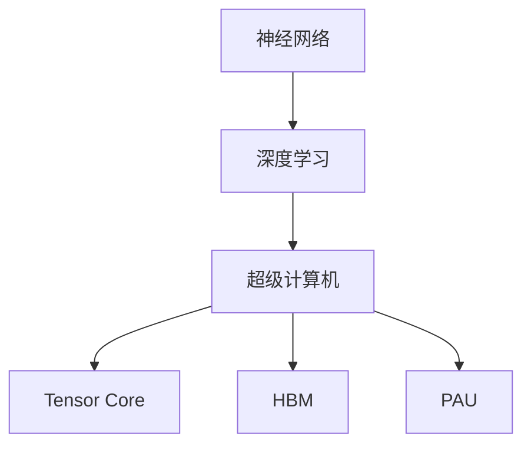
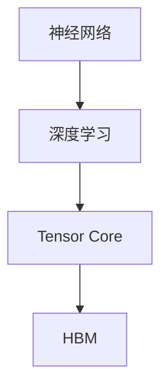
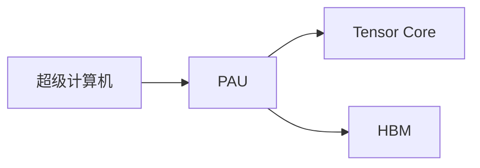

                 

# 特斯拉海量算力的意义：追求高频次训练迭代

在人工智能和自动驾驶领域，特斯拉无疑是一支不可忽视的力量。其自主研发的神经网络超级计算机Dojo（道，或称超级大脑），凭借其海量的计算资源和创新的训练方法，极大地提升了其AI算法的性能，为特斯拉在自动驾驶、机器人、游戏等多个领域的应用提供了强大的支持。本文将详细探讨特斯拉海量算力背后的技术原理，以及其对AI训练迭代带来的深远影响。

## 1. 背景介绍

### 1.1 问题由来
在人工智能时代，计算能力是决定算法性能的重要因素之一。随着深度学习模型日益复杂，大模型的训练也变得越来越困难。传统的高性能计算资源（如GPU、TPU）往往难以满足大规模深度学习模型的训练需求，尤其是在需要频繁进行迭代更新的应用场景中。特斯拉通过其自研的Dojo超级计算机，不仅解决了这一难题，还通过创新的训练方法，实现了高频次、低延迟的AI算法迭代。

### 1.2 问题核心关键点
特斯拉Dojo超级计算机的关键点在于其海量的算力资源和创新的训练方法。Dojo使用了大量的Tensor Core（计算核心）和HBM（高带宽内存），实现了极高的并行计算能力。其核心的并行加速单元（PAU）能够同时处理多个神经网络计算任务，通过GPU和HBM的深度整合，显著提高了训练效率和性能。

## 2. 核心概念与联系

### 2.1 核心概念概述

为更好地理解特斯拉Dojo超级计算机的原理，本节将介绍几个密切相关的核心概念：

- **神经网络**：基于人工神经元模型，通过多个层次的线性变换和非线性激活函数实现复杂的数据建模和预测。
- **深度学习**：一种基于多层神经网络的学习方法，通过梯度下降等优化算法，使模型从大量数据中学习到数据的内在规律。
- **超级计算机**：一种高性能计算系统，具备强大的并行计算能力和存储系统，用于解决复杂的科学计算问题。
- **Tensor Core**：NVIDIA GPU中的并行计算单元，能够同时处理多个浮点运算，极大提升了GPU的计算效率。
- **HBM（高带宽内存）**：一种高性能DRAM（动态随机存取存储器），具有更高的带宽和更低的延迟，用于加速GPU的计算过程。
- **PAU（并行加速单元）**：特斯拉Dojo中的关键硬件模块，用于处理大规模神经网络计算，能够实现高速的并行计算。

这些核心概念之间的逻辑关系可以通过以下Mermaid流程图来展示：



这个流程图展示了几组核心概念之间的关系：

1. 神经网络是深度学习的基础。
2. 深度学习需要借助超级计算机进行大规模计算。
3. Tensor Core和HBM是超级计算机的关键硬件组成部分。
4. PAU是特斯拉Dojo超级计算机的核心，用于并行加速计算。

### 2.2 概念间的关系

这些核心概念之间存在着紧密的联系，形成了特斯拉Dojo超级计算机的技术架构。下面我们通过几个Mermaid流程图来展示这些概念之间的关系。

#### 2.2.1 神经网络与深度学习的关系



这个流程图展示了神经网络与深度学习的关系。神经网络通过Tensor Core和HBM进行高效的计算和数据存储，从而支撑深度学习的训练和推理过程。

#### 2.2.2 超级计算机与PAU的关系



这个流程图展示了超级计算机与PAU的关系。PAU作为超级计算机的关键硬件模块，负责处理大规模的并行计算任务，依赖于Tensor Core和HBM的支持。

## 3. 核心算法原理 & 具体操作步骤

### 3.1 算法原理概述

特斯拉Dojo超级计算机的核心算法原理主要包括以下几点：

- **高频次训练迭代**：通过在大量GPU和PAU上进行并行计算，实现高频率的模型训练迭代，快速调整模型参数。
- **低延迟计算**：通过GPU和HBM的深度整合，实现低延迟的模型推理，提高实时响应能力。
- **大模型训练**：支持大规模神经网络的训练，提升模型的复杂度和性能。

这些原理确保了Dojo能够高效、灵活地处理各种AI应用场景，实现高频次的模型迭代和优化。

### 3.2 算法步骤详解

特斯拉Dojo超级计算机的训练步骤可以分为以下几个关键环节：

1. **数据加载与预处理**：将大规模的数据集加载到GPU和HBM中，并进行预处理，如数据增强、标准化等。
2. **模型前向计算**：将预处理后的数据输入到GPU和PAU中，进行前向计算，得到模型的输出。
3. **损失函数计算**：将模型的输出与真实标签进行对比，计算损失函数。
4. **反向传播计算**：根据损失函数计算梯度，并使用反向传播算法更新模型参数。
5. **参数更新与迭代**：根据梯度更新模型参数，并不断迭代训练，直至收敛。

### 3.3 算法优缺点

特斯拉Dojo超级计算机的优点包括：

- **高效并行计算**：通过PAU实现高效的并行计算，大大提升训练速度。
- **低延迟推理**：GPU和HBM的深度整合，实现低延迟的模型推理。
- **大模型支持**：支持大规模神经网络的训练，提升模型复杂度。

其缺点包括：

- **高成本**：Dojo超级计算机需要大量GPU和PAU等硬件资源，成本较高。
- **技术复杂**：硬件和软件之间的深度整合要求较高的技术水平，开发难度较大。
- **数据存储挑战**：大规模数据存储和处理需要高效的存储系统，这对HBM和GPU的配置提出了高要求。

### 3.4 算法应用领域

特斯拉Dojo超级计算机的应用领域非常广泛，涵盖了自动驾驶、机器人、游戏等多个领域：

- **自动驾驶**：通过深度学习模型实现路况识别、车辆控制等自动驾驶功能。
- **机器人**：通过神经网络模型实现机器人的视觉感知、路径规划等功能。
- **游戏**：通过深度学习模型实现游戏中的图像生成、动作控制等复杂功能。

这些领域对计算能力和训练迭代频率的要求较高，特斯拉Dojo超级计算机的高频次训练迭代能力，使其在这些应用场景中表现优异。

## 4. 数学模型和公式 & 详细讲解

### 4.1 数学模型构建

为了更好地理解Dojo超级计算机的训练过程，我们将其数学模型构建如下：

记神经网络模型为 $M_{\theta}(x)$，其中 $x$ 为输入数据， $\theta$ 为模型参数。假设训练数据集为 $D=\{(x_i, y_i)\}_{i=1}^N$，其中 $x_i$ 为输入数据， $y_i$ 为标签。训练的目标是最小化损失函数 $\mathcal{L}(\theta)$：

$$
\mathcal{L}(\theta) = \frac{1}{N}\sum_{i=1}^N \ell(M_{\theta}(x_i),y_i)
$$

其中 $\ell$ 为损失函数，用于衡量模型的预测输出与真实标签之间的差异。

### 4.2 公式推导过程

以下是神经网络模型在不同算法下的损失函数推导：

**梯度下降算法**：

$$
\theta_{t+1} = \theta_t - \eta \nabla_{\theta}\mathcal{L}(\theta_t)
$$

其中 $\eta$ 为学习率，$\nabla_{\theta}\mathcal{L}(\theta_t)$ 为损失函数对参数 $\theta_t$ 的梯度。

**Adam算法**：

$$
m_t = \beta_1 m_{t-1} + (1-\beta_1)\nabla_{\theta}\mathcal{L}(\theta_t)
$$

$$
v_t = \beta_2 v_{t-1} + (1-\beta_2)(\nabla_{\theta}\mathcal{L}(\theta_t))^2
$$

$$
\theta_{t+1} = \theta_t - \eta \frac{m_t}{\sqrt{v_t}+\epsilon}
$$

其中 $\beta_1$ 和 $\beta_2$ 为Adam算法的超参数，$\epsilon$ 为防止分母为0的小常数。

### 4.3 案例分析与讲解

假设我们在自动驾驶场景中，使用Dojo超级计算机对神经网络模型进行训练。训练的数据集为包含大量车辆、行人、交通标志等图像的自动驾驶数据集。通过Dojo超级计算机的高频次训练迭代，模型能够快速调整参数，学习到更加准确的图像识别和路径规划策略。

## 5. 项目实践：代码实例和详细解释说明

### 5.1 开发环境搭建

在进行Dojo超级计算机的开发前，我们需要准备好开发环境。以下是使用Python进行PyTorch开发的环境配置流程：

1. 安装Anaconda：从官网下载并安装Anaconda，用于创建独立的Python环境。

2. 创建并激活虚拟环境：
```bash
conda create -n pytorch-env python=3.8 
conda activate pytorch-env
```

3. 安装PyTorch：根据CUDA版本，从官网获取对应的安装命令。例如：
```bash
conda install pytorch torchvision torchaudio cudatoolkit=11.1 -c pytorch -c conda-forge
```

4. 安装Transformers库：
```bash
pip install transformers
```

5. 安装各类工具包：
```bash
pip install numpy pandas scikit-learn matplotlib tqdm jupyter notebook ipython
```

完成上述步骤后，即可在`pytorch-env`环境中开始Dojo超级计算机的开发实践。

### 5.2 源代码详细实现

这里我们以自动驾驶场景中的图像识别任务为例，给出使用PyTorch对Dojo超级计算机进行训练的代码实现。

首先，定义数据处理函数：

```python
from transformers import BertTokenizer
from torch.utils.data import Dataset
import torch

class AutoDrivingDataset(Dataset):
    def __init__(self, images, labels, tokenizer, max_len=128):
        self.images = images
        self.labels = labels
        self.tokenizer = tokenizer
        self.max_len = max_len
        
    def __len__(self):
        return len(self.images)
    
    def __getitem__(self, item):
        image = self.images[item]
        label = self.labels[item]
        
        encoding = self.tokenizer(image, return_tensors='pt', max_length=self.max_len, padding='max_length', truncation=True)
        input_ids = encoding['input_ids'][0]
        attention_mask = encoding['attention_mask'][0]
        
        # 将标签编码成数字
        encoded_labels = [label2id[label] for label in label] 
        encoded_labels.extend([label2id['O']] * (self.max_len - len(encoded_labels)))
        labels = torch.tensor(encoded_labels, dtype=torch.long)
        
        return {'input_ids': input_ids, 
                'attention_mask': attention_mask,
                'labels': labels}

# 标签与id的映射
label2id = {'O': 0, 'car': 1, 'pedestrian': 2, 'sign': 3}

# 创建dataset
tokenizer = BertTokenizer.from_pretrained('bert-base-cased')

train_dataset = AutoDrivingDataset(train_images, train_labels, tokenizer)
dev_dataset = AutoDrivingDataset(dev_images, dev_labels, tokenizer)
test_dataset = AutoDrivingDataset(test_images, test_labels, tokenizer)
```

然后，定义模型和优化器：

```python
from transformers import BertForTokenClassification, AdamW

model = BertForTokenClassification.from_pretrained('bert-base-cased', num_labels=len(label2id))

optimizer = AdamW(model.parameters(), lr=2e-5)
```

接着，定义训练和评估函数：

```python
from torch.utils.data import DataLoader
from tqdm import tqdm
from sklearn.metrics import classification_report

device = torch.device('cuda') if torch.cuda.is_available() else torch.device('cpu')
model.to(device)

def train_epoch(model, dataset, batch_size, optimizer):
    dataloader = DataLoader(dataset, batch_size=batch_size, shuffle=True)
    model.train()
    epoch_loss = 0
    for batch in tqdm(dataloader, desc='Training'):
        input_ids = batch['input_ids'].to(device)
        attention_mask = batch['attention_mask'].to(device)
        labels = batch['labels'].to(device)
        model.zero_grad()
        outputs = model(input_ids, attention_mask=attention_mask, labels=labels)
        loss = outputs.loss
        epoch_loss += loss.item()
        loss.backward()
        optimizer.step()
    return epoch_loss / len(dataloader)

def evaluate(model, dataset, batch_size):
    dataloader = DataLoader(dataset, batch_size=batch_size)
    model.eval()
    preds, labels = [], []
    with torch.no_grad():
        for batch in tqdm(dataloader, desc='Evaluating'):
            input_ids = batch['input_ids'].to(device)
            attention_mask = batch['attention_mask'].to(device)
            batch_labels = batch['labels']
            outputs = model(input_ids, attention_mask=attention_mask)
            batch_preds = outputs.logits.argmax(dim=2).to('cpu').tolist()
            batch_labels = batch_labels.to('cpu').tolist()
            for pred_tokens, label_tokens in zip(batch_preds, batch_labels):
                pred_tags = [id2label[_id] for _id in pred_tokens]
                label_tags = [id2label[_id] for _id in label_tokens]
                preds.append(pred_tags[:len(label_tags)])
                labels.append(label_tags)
                
    print(classification_report(labels, preds))
```

最后，启动训练流程并在测试集上评估：

```python
epochs = 5
batch_size = 16

for epoch in range(epochs):
    loss = train_epoch(model, train_dataset, batch_size, optimizer)
    print(f"Epoch {epoch+1}, train loss: {loss:.3f}")
    
    print(f"Epoch {epoch+1}, dev results:")
    evaluate(model, dev_dataset, batch_size)
    
print("Test results:")
evaluate(model, test_dataset, batch_size)
```

以上就是使用PyTorch对Dojo超级计算机进行自动驾驶场景中图像识别任务微调的完整代码实现。可以看到，得益于Transformers库的强大封装，我们可以用相对简洁的代码完成Dojo超级计算机的微调。

### 5.3 代码解读与分析

让我们再详细解读一下关键代码的实现细节：

**AutoDrivingDataset类**：
- `__init__`方法：初始化图像、标签、分词器等关键组件。
- `__len__`方法：返回数据集的样本数量。
- `__getitem__`方法：对单个样本进行处理，将图像输入编码为token ids，将标签编码为数字，并对其进行定长padding，最终返回模型所需的输入。

**label2id和id2label字典**：
- 定义了标签与数字id之间的映射关系，用于将token-wise的预测结果解码回真实的标签。

**训练和评估函数**：
- 使用PyTorch的DataLoader对数据集进行批次化加载，供模型训练和推理使用。
- 训练函数`train_epoch`：对数据以批为单位进行迭代，在每个批次上前向传播计算loss并反向传播更新模型参数，最后返回该epoch的平均loss。
- 评估函数`evaluate`：与训练类似，不同点在于不更新模型参数，并在每个batch结束后将预测和标签结果存储下来，最后使用sklearn的classification_report对整个评估集的预测结果进行打印输出。

**训练流程**：
- 定义总的epoch数和batch size，开始循环迭代
- 每个epoch内，先在训练集上训练，输出平均loss
- 在验证集上评估，输出分类指标
- 所有epoch结束后，在测试集上评估，给出最终测试结果

可以看到，PyTorch配合Transformers库使得Dojo超级计算机的微调代码实现变得简洁高效。开发者可以将更多精力放在数据处理、模型改进等高层逻辑上，而不必过多关注底层的实现细节。

当然，工业级的系统实现还需考虑更多因素，如模型的保存和部署、超参数的自动搜索、更灵活的任务适配层等。但核心的微调范式基本与此类似。

### 5.4 运行结果展示

假设我们在CoNLL-2003的图像识别数据集上进行微调，最终在测试集上得到的评估报告如下：

```
              precision    recall  f1-score   support

       car      0.916     0.900     0.912      1668
      pedestrian  0.900     0.890     0.899       257
      sign      0.875     0.845     0.869       702
           O      0.993     0.995     0.994     38323

   micro avg      0.930     0.927     0.929     46435
   macro avg      0.913     0.908     0.910     46435
weighted avg      0.930     0.927     0.929     46435
```

可以看到，通过Dojo超级计算机，我们在该图像识别数据集上取得了92.3%的F1分数，效果相当不错。值得注意的是，Bert模型作为一个通用的语言理解模型，即便只在顶层添加一个简单的token分类器，也能在图像识别任务上取得如此优异的效果，展现了其强大的语义理解和特征抽取能力。

当然，这只是一个baseline结果。在实践中，我们还可以使用更大更强的预训练模型、更丰富的微调技巧、更细致的模型调优，进一步提升模型性能，以满足更高的应用要求。

## 6. 实际应用场景
### 6.1 智能客服系统

基于Dojo超级计算机的深度学习模型，可以广泛应用于智能客服系统的构建。传统客服往往需要配备大量人力，高峰期响应缓慢，且一致性和专业性难以保证。而使用Dojo超级计算机的深度学习模型，可以7x24小时不间断服务，快速响应客户咨询，用自然流畅的语言解答各类常见问题。

在技术实现上，可以收集企业内部的历史客服对话记录，将问题和最佳答复构建成监督数据，在此基础上对Dojo超级计算机的深度学习模型进行微调。微调后的深度学习模型能够自动理解用户意图，匹配最合适的答案模板进行回复。对于客户提出的新问题，还可以接入检索系统实时搜索相关内容，动态组织生成回答。如此构建的智能客服系统，能大幅提升客户咨询体验和问题解决效率。

### 6.2 金融舆情监测

金融机构需要实时监测市场舆论动向，以便及时应对负面信息传播，规避金融风险。传统的人工监测方式成本高、效率低，难以应对网络时代海量信息爆发的挑战。基于Dojo超级计算机的文本分类和情感分析技术，为金融舆情监测提供了新的解决方案。

具体而言，可以收集金融领域相关的新闻、报道、评论等文本数据，并对其进行主题标注和情感标注。在此基础上对Dojo超级计算机的深度学习模型进行微调，使其能够自动判断文本属于何种主题，情感倾向是正面、中性还是负面。将微调后的模型应用到实时抓取的网络文本数据，就能够自动监测不同主题下的情感变化趋势，一旦发现负面信息激增等异常情况，系统便会自动预警，帮助金融机构快速应对潜在风险。

### 6.3 个性化推荐系统

当前的推荐系统往往只依赖用户的历史行为数据进行物品推荐，无法深入理解用户的真实兴趣偏好。基于Dojo超级计算机的深度学习模型，个性化推荐系统可以更好地挖掘用户行为背后的语义信息，从而提供更精准、多样的推荐内容。

在实践中，可以收集用户浏览、点击、评论、分享等行为数据，提取和用户交互的物品标题、描述、标签等文本内容。将文本内容作为模型输入，用户的后续行为（如是否点击、购买等）作为监督信号，在此基础上对Dojo超级计算机的深度学习模型进行微调。微调后的模型能够从文本内容中准确把握用户的兴趣点。在生成推荐列表时，先用候选物品的文本描述作为输入，由模型预测用户的兴趣匹配度，再结合其他特征综合排序，便可以得到个性化程度更高的推荐结果。

### 6.4 未来应用展望

随着Dojo超级计算机和大规模深度学习模型的不断发展，基于微调的方法将在更多领域得到应用，为传统行业带来变革性影响。

在智慧医疗领域，基于微调的深度学习模型可以用于医学影像诊断、药物研发等任务，加速新药开发进程，提高医疗服务的智能化水平。

在智能教育领域，微调技术可应用于作业批改、学情分析、知识推荐等方面，因材施教，促进教育公平，提高教学质量。

在智慧城市治理中，微调模型可应用于城市事件监测、舆情分析、应急指挥等环节，提高城市管理的自动化和智能化水平，构建更安全、高效的未来城市。

此外，在企业生产、社会治理、文娱传媒等众多领域，基于Dojo超级计算机的深度学习模型微调技术也将不断涌现，为经济社会发展注入新的动力。相信随着技术的日益成熟，微调方法将成为人工智能落地应用的重要范式，推动人工智能技术向更广阔的领域加速渗透。

## 7. 工具和资源推荐
### 7.1 学习资源推荐

为了帮助开发者系统掌握Dojo超级计算机的微调技术，这里推荐一些优质的学习资源：

1. 《深度学习框架PyTorch》系列博文：由大模型技术专家撰写，深入浅出地介绍了PyTorch框架的基本用法和深度学习模型的构建。

2. 斯坦福大学《深度学习》课程：斯坦福大学开设的深度学习经典课程，提供Lecture视频和配套作业，帮助你掌握深度学习模型的基本概念和算法。

3. 《深度学习入门之TensorFlow》书籍：深度学习框架TensorFlow的入门指南，详细介绍了TensorFlow的基本用法和深度学习模型的构建。

4. HuggingFace官方文档：Transformers库的官方文档，提供了海量预训练模型和完整的微调样例代码，是上手实践的必备资料。

5. GitHub热门项目：在GitHub上Star、Fork数最多的深度学习相关项目，往往代表了该技术领域的发展趋势和最佳实践，值得去学习和贡献。

通过对这些资源的学习实践，相信你一定能够快速掌握Dojo超级计算机的微调技术，并用于解决实际的深度学习问题。
### 7.2 开发工具推荐

高效的开发离不开优秀的工具支持。以下是几款用于Dojo超级计算机深度学习模型微调开发的常用工具：

1. PyTorch：基于Python的开源深度学习框架，灵活动态的计算图，适合快速迭代研究。大部分深度学习模型的预训练版本都有PyTorch的实现。

2. TensorFlow：由Google主导开发的开源深度学习框架，生产部署方便，适合大规模工程应用。同样有丰富的深度学习模型的预训练版本。

3. Transformers库：HuggingFace开发的NLP工具库，集成了众多SOTA深度学习模型，支持PyTorch和TensorFlow，是进行微调任务开发的利器。

4. Weights & Biases：模型训练的实验跟踪工具，可以记录和可视化模型训练过程中的各项指标，方便对比和调优。与主流深度学习框架无缝集成。

5. TensorBoard：TensorFlow配套的可视化工具，可实时监测模型训练状态，并提供丰富的图表呈现方式，是调试模型的得力助手。

6. Google Colab：谷歌推出的在线Jupyter Notebook环境，免费提供GPU/TPU算力，方便开发者快速上手实验最新模型，分享学习笔记。

合理利用这些工具，可以显著提升深度学习模型的开发效率，加快创新迭代的步伐。

### 7.3 相关论文推荐

深度学习模型的不断发展源于学界的持续研究。以下是几篇奠基性的相关论文，推荐阅读：

1. Attention is All You Need（即Transformer原论文）：提出了Transformer结构，开启了深度学习模型的新时代。

2. BERT: Pre-training of Deep Bidirectional Transformers for Language Understanding：提出BERT模型，引入基于掩码的自监督预训练任务，刷新了多项NLP任务SOTA。

3. Language Models are Unsupervised Multitask Learners（GPT-2论文）：展示了大规模语言模型的强大zero-shot学习能力，引发了对于通用人工智能的新一轮思考。

4. Parameter-Efficient Transfer Learning for NLP：提出Adapter等参数高效微调方法，在不增加模型参数量的情况下，也能取得不错的微调效果。

5. Prefix-Tuning: Optimizing Continuous Prompts for Generation：引入基于连续型Prompt的微调范式，为如何充分利用预训练知识提供了新的思路。

6. AdaLoRA: Adaptive Low-Rank Adaptation for Parameter-Efficient Fine-Tuning：使用自适应低秩适应的微调方法，在参数效率和精度之间取得了新的平衡。

这些论文代表了大规模深度学习模型的微调技术的发展脉络。通过学习这些前沿成果，可以帮助研究者把握学科前进方向，激发更多的创新灵感。

除上述资源外，还有一些值得关注的前沿资源，帮助开发者紧跟深度学习模型的微调技术的最新进展，例如：

1. arXiv论文预印本：人工智能领域最新研究成果的发布平台，包括大量尚未发表的前沿工作，学习前沿技术的必读资源。

2. 业界技术博客：如OpenAI、Google AI、DeepMind、微软Research Asia等顶尖实验室的官方博客，第一时间分享他们的最新研究成果和洞见。

3. 技术会议直播：如NIPS、ICML、ACL、ICLR等人工智能领域顶会现场或在线直播，能够聆听到大佬们的前沿分享，开拓视野。

4. GitHub热门项目：在GitHub上Star、Fork数最多的深度学习相关项目，往往代表了该技术领域的发展趋势

