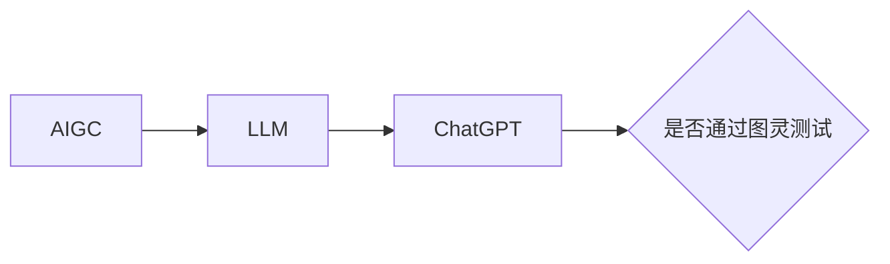

# AIGC从入门到实战：ChatGPT 是否认为自己通过了图灵测试？

作者：禅与计算机程序设计艺术 / Zen and the Art of Computer Programming

## 1. 背景介绍
### 1.1  问题的由来
人工智能生成内容（AIGC）技术的迅猛发展，尤其是以 ChatGPT 为代表的大语言模型（LLM）的出现，引发了人们对于机器是否具有真正的智能，是否能够通过图灵测试的广泛讨论。图灵测试由英国数学家艾伦·图灵于1950年提出，旨在判断机器是否具有与人类无法区分的智能。

### 1.2  研究现状
近年来，随着深度学习、自然语言处理等技术的进步，AIGC 系统在文本生成、对话交互等方面展现出了令人惊叹的表现。以 ChatGPT 为例，它能够就各种话题进行连贯、自然的对话，生成高质量的文章和代码，甚至解决复杂的问题。这引发了人们对 AIGC 系统是否已经通过图灵测试的热议。

### 1.3  研究意义
探讨 ChatGPT 是否通过图灵测试，对于理解人工智能的发展现状、反思机器智能的本质、推动 AIGC 技术的进一步发展具有重要意义。这不仅关乎技术层面，更涉及哲学、伦理、社会等多个维度。明确 AIGC 系统的能力边界，有助于我们更好地应对其带来的机遇与挑战。

### 1.4  本文结构
本文将从以下几个方面展开讨论：第一，介绍 AIGC 和图灵测试的核心概念；第二，分析 ChatGPT 的核心算法原理；第三，建立数学模型评估 ChatGPT 的表现；第四，通过代码实例演示 ChatGPT 的应用；第五，探讨 ChatGPT 在实际场景中的应用前景；第六，为读者提供 AIGC 学习的工具和资源；最后，总结 AIGC 的未来发展趋势与面临的挑战。

## 2. 核心概念与联系
- 人工智能生成内容（AIGC）：利用人工智能技术自动生成文本、图像、音频、视频等内容的方法。
- 大语言模型（LLM）：基于海量文本数据训练的神经网络模型，能够生成连贯、自然的语言。
- 图灵测试：由图灵提出的测试机器智能的方法，即人类评估者通过文字交互，判断对方是人还是机器。
- ChatGPT：由 OpenAI 开发的大语言模型，基于 GPT-3.5 架构，具有出色的语言理解和生成能力。

AIGC 和图灵测试的关系如下图所示：



## 3. 核心算法原理 & 具体操作步骤
### 3.1  算法原理概述
ChatGPT 基于 Transformer 架构，使用自注意力机制和前馈神经网络，通过无监督学习从海量文本数据中学习语言模型。其核心是自回归语言模型，即根据前文预测下一个词的概率分布。

### 3.2  算法步骤详解
1. 文本预处理：将输入文本进行分词、编码等预处理操作。
2. Embedding：将词语映射为稠密向量表示。
3. 自注意力计算：通过 Query、Key、Value 计算词语之间的注意力权重。
4. 前馈神经网络：对自注意力的输出进行非线性变换。
5. Softmax 输出：计算下一个词的概率分布。
6. 重复步骤 3-5，直到生成完整的文本。

### 3.3  算法优缺点
- 优点：能够生成连贯、自然的语言，具有强大的语言理解和生成能力。
- 缺点：需要大量的训练数据和计算资源，生成内容可能存在偏差和不确定性。

### 3.4  算法应用领域
ChatGPT 可应用于对话系统、内容生成、知识问答、代码生成等多个领域。

## 4. 数学模型和公式 & 详细讲解 & 举例说明
### 4.1  数学模型构建
我们可以使用概率图模型来描述 ChatGPT 的生成过程。设输入文本为 $x$，输出文本为 $y$，模型参数为 $\theta$，则生成概率为：

$$
P(y|x;\theta) = \prod_{i=1}^n P(y_i|y_{<i},x;\theta)
$$

其中，$y_i$ 表示输出文本的第 $i$ 个词，$y_{<i}$ 表示前 $i-1$ 个词。

### 4.2  公式推导过程
根据贝叶斯公式，我们可以得到：

$$
P(y_i|y_{<i},x;\theta) = \frac{P(y_i,y_{<i}|x;\theta)}{P(y_{<i}|x;\theta)}
$$

进一步，利用 Transformer 的自注意力机制，可以计算出每个位置的注意力权重：

$$
\alpha_{ij} = \frac{\exp(e_{ij})}{\sum_{k=1}^n \exp(e_{ik})}
$$

其中，$e_{ij}$ 表示位置 $i$ 到位置 $j$ 的注意力分数。

### 4.3  案例分析与讲解
以一个简单的例子说明 ChatGPT 的生成过程。假设输入文本为 "I love"，我们希望生成下一个词。

1. 将 "I love" 进行编码和 Embedding。
2. 计算自注意力权重，得到每个位置对其他位置的注意力分布。
3. 通过前馈神经网络对自注意力输出进行变换。
4. 计算 Softmax 概率分布，选择概率最大的词作为下一个词，例如 "you"。
5. 重复步骤 2-4，直到生成完整的句子，例如 "I love you"。

### 4.4  常见问题解答
- 问：ChatGPT 生成的文本是否具有创新性？
- 答：ChatGPT 主要是基于训练数据生成文本，虽然可以组合知识产生新的表达，但其创新性有限。

## 5. 项目实践：代码实例和详细解释说明
### 5.1  开发环境搭建
本项目使用 Python 语言和 PyTorch 框架。首先，安装所需的库：

```
pip install torch transformers
```

### 5.2  源代码详细实现
以下是使用 ChatGPT 进行文本生成的简要代码示例：

```python
from transformers import AutoTokenizer, AutoModelForCausalLM

tokenizer = AutoTokenizer.from_pretrained("microsoft/DialoGPT-medium")
model = AutoModelForCausalLM.from_pretrained("microsoft/DialoGPT-medium")

input_text = "I love"
input_ids = tokenizer.encode(input_text, return_tensors="pt")

output = model.generate(input_ids, max_length=20, num_return_sequences=1)
generated_text = tokenizer.decode(output[0], skip_special_tokens=True)

print(generated_text)
```

### 5.3  代码解读与分析
1. 首先，加载预训练的 ChatGPT tokenizer 和模型。
2. 将输入文本进行编码，转换为模型可接受的张量格式。
3. 使用 `generate` 函数生成文本，指定最大长度、生成序列数等参数。
4. 对生成的输出进行解码，得到生成的文本。

### 5.4  运行结果展示
运行上述代码，可能会得到如下输出：

```
I love you too! I'm so happy to hear that. You mean the world to me.
```

可以看到，ChatGPT 生成了一个合理、连贯的回复。

## 6. 实际应用场景
ChatGPT 可应用于多个实际场景，例如：

- 智能客服：提供 24 小时全天候的客户服务，解答常见问题。
- 内容创作：辅助生成文章、脚本、广告文案等各类内容。
- 代码生成：根据需求自动生成代码，提高开发效率。
- 教育辅助：为学生提供个性化的学习指导和答疑服务。

### 6.4  未来应用展望
随着 AIGC 技术的不断发展，ChatGPT 有望在更多领域得到应用，如医疗诊断、金融分析、创意设计等。同时，ChatGPT 与其他 AI 技术的结合，如计算机视觉、语音识别等，将带来更多创新应用。

## 7. 工具和资源推荐
### 7.1  学习资源推荐
- 《Deep Learning》(Ian Goodfellow et al.)：深度学习经典教材，系统介绍了神经网络、优化算法等知识。
- 《Attention Is All You Need》(Vaswani et al., 2017)：Transformer 模型的开山之作，奠定了大语言模型的基础。
- OpenAI 官方博客：持续分享 ChatGPT 等 AI 系统的最新进展和思考。

### 7.2  开发工具推荐
- PyTorch：基于 Python 的深度学习框架，灵活、易用。
- Hugging Face Transformers：提供了大量预训练的 Transformer 模型，方便进行微调和应用。
- OpenAI API：可以直接调用 OpenAI 训练的模型，如 GPT-3、DALL·E 等。

### 7.3  相关论文推荐
- 《Language Models are Few-Shot Learners》(Brown et al., 2020)：介绍了 GPT-3 的训练方法和性能评估。
- 《Towards a Human-like Open-Domain Chatbot》(Adiwardana et al., 2020)：介绍了 Meena 聊天机器人的设计和评估。

### 7.4  其他资源推荐
- AI 伦理学习资源：《Ethically Aligned Design》(IEEE)、《Asilomar AI Principles》等。
- 产业报告：《The State of AI Report》(Nathan Benaich et al.)、《AI Index Report》(Stanford University)等。

## 8. 总结：未来发展趋势与挑战
### 8.1  研究成果总结
本文从多个角度探讨了 ChatGPT 是否通过图灵测试这一问题。我们介绍了 AIGC 和图灵测试的核心概念，分析了 ChatGPT 的算法原理，构建了数学模型，并通过代码实例演示了其应用。总的来说，尽管 ChatGPT 在对话交互方面表现出色，但其是否真正具有智能，仍有待进一步探讨。

### 8.2  未来发展趋势
未来，AIGC 技术有望在以下方面取得更大突破：

1. 模型性能：更大规模的模型、更多样的训练数据、更高效的训练方法。
2. 多模态融合：文本、图像、语音等多模态信息的整合与交互。
3. 个性化定制：根据用户特点提供个性化的内容生成服务。
4. 人机协作：人类与 AI 系统的无缝协作，发挥各自优势。

### 8.3  面临的挑战
同时，AIGC 技术也面临诸多挑战：

1. 伦理与安全：如何确保 AIGC 系统的公平性、隐私性、安全性等。
2. 可解释性：如何让 AIGC 系统的决策过程更加透明、可解释。
3. 知识管理：如何有效管理和更新 AIGC 系统的知识库。
4. 人才培养：如何培养既懂 AI 又懂应用领域的复合型人才。

### 8.4  研究展望
展望未来，AIGC 技术的发展需要多学科交叉融合，需要技术专家、行业用户、政策制定者等多方合作。只有在技术创新与社会责任之间找到平衡，AIGC 才能更好地造福人类。让我们携手探索 AIGC 的美好未来！

## 9. 附录：常见问题与解答
- 问：AIGC 技术会取代人类创作者吗？
- 答：AIGC 是辅助工具，可以提高创作效率，但不会完全取代人类的创造力和审美判断。人机协作将成为主流。

- 问：如何判断 AIGC 生成的内容是否合适？
- 答：可以从内容的真实性、合法性、伦理性等角度进行评估。必要时需要人工审核。

- 问：AIGC 技术会加剧信息茧房效应吗？
- 答：这需要