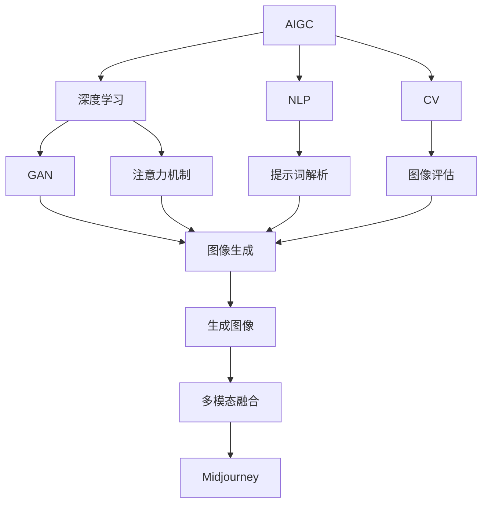

# AIGC从入门到实战：揭秘 Midjourney 的提示词写作技巧

## 1. 背景介绍

### 1.1 问题的由来

在当今科技飞速发展的时代，人工智能生成内容(AIGC)已经成为一股不可忽视的潮流。作为AIGC领域的佼佼者之一，Midjourney凭借其强大的图像生成能力，吸引了无数创作者和爱好者的目光。然而,要充分发挥Midjourney的潜力,掌握提示词的写作技巧是关键所在。

提示词(Prompt)是用户与Midjourney交互的桥梁,它决定了生成图像的风格、细节和整体质量。然而,编写高质量的提示词并非一蹴而就,需要对Midjourney的工作原理有深入的理解,并掌握一定的写作技巧。

### 1.2 研究现状

目前,关于Midjourney提示词写作的研究和指南仍然相对有限。虽然Midjourney官方提供了一些基本的指导,但对于高级用户来说,这些指导可能显得过于简单和片面。同时,由于Midjourney的算法不断更新,一些旧的写作技巧可能会失去效力。

因此,有必要总结和梳理Midjourney提示词写作的最新技巧,帮助用户更好地掌握这一强大工具,从而创作出更加出色的作品。

### 1.3 研究意义

掌握Midjourney提示词写作技巧,不仅能够提高个人的创作水平,还可以为AIGC行业的发展做出贡献。通过优化提示词,用户可以更好地控制生成内容的质量和风格,从而推动AIGC技术的进步。

此外,本文还将探讨Midjourney提示词写作背后的原理和算法,为读者提供更深入的理解。这不仅有助于提高写作技巧,也能够促进AIGC领域的研究和创新。

### 1.4 本文结构

本文将从以下几个方面全面介绍Midjourney提示词写作技巧:

1. 背景介绍
2. 核心概念与联系
3. 核心算法原理与具体操作步骤
4. 数学模型和公式详细讲解与举例说明
5. 项目实践:代码实例和详细解释说明
6. 实际应用场景
7. 工具和资源推荐
8. 总结:未来发展趋势与挑战
9. 附录:常见问题与解答

## 2. 核心概念与联系

在深入探讨Midjourney提示词写作技巧之前,我们需要先了解一些核心概念和它们之间的联系。

### 2.1 人工智能生成内容(AIGC)

人工智能生成内容(AIGC)是指利用人工智能技术自动生成文本、图像、音频、视频等各种形式的内容。AIGC技术的发展,使得内容创作变得前所未有的高效和便捷。

Midjourney就是一款基于人工智能的图像生成工具,它属于AIGC领域的一个重要分支。

### 2.2 深度学习

深度学习是AIGC技术的核心驱动力之一。它是一种基于人工神经网络的机器学习算法,能够从大量数据中自动学习特征,并对新的输入数据进行预测或生成。

Midjourney的图像生成能力就是建立在深度学习技术之上的。它通过训练大型神经网络模型,学习图像数据中的特征和模式,从而实现高质量的图像生成。

### 2.3 自然语言处理(NLP)

自然语言处理(NLP)是人工智能领域的一个重要分支,它研究如何让计算机能够理解和处理人类语言。在Midjourney中,NLP技术被用于解析和理解用户输入的提示词,从而指导图像生成过程。

有效的提示词写作需要考虑NLP技术的特点和限制,以确保Midjourney能够正确理解用户的意图。

### 2.4 计算机视觉(CV)

计算机视觉(CV)是另一个与AIGC密切相关的领域。它研究如何让计算机能够识别和理解数字图像或视频中的内容。

在Midjourney中,CV技术被用于评估和优化生成的图像,以确保它们符合用户的期望。同时,CV技术也可以帮助Midjourney从现有图像中学习特征和模式,进而提高生成质量。

### 2.5 生成对抗网络(GAN)

生成对抗网络(GAN)是深度学习领域的一种重要模型,它被广泛应用于AIGC任务,包括图像生成。Midjourney的核心算法就是基于GAN的变体模型。

GAN由两个神经网络组成:生成器(Generator)和判别器(Discriminator)。生成器负责生成新的图像,而判别器则评估生成图像的质量和真实性。通过两个网络的对抗训练,GAN可以逐步提高生成图像的质量和真实感。

### 2.6 注意力机制(Attention Mechanism)

注意力机制是深度学习中一种重要的技术,它允许模型在处理序列数据(如文本或图像)时,selectively关注输入的不同部分。

在Midjourney中,注意力机制被用于帮助模型更好地理解和关注提示词中的关键信息,从而生成更加符合用户意图的图像。同时,注意力机制也可以帮助模型捕捉图像中的细节和关系。

### 2.7 多模态学习(Multimodal Learning)

多模态学习是一种将不同模态(如文本、图像、音频等)的信息融合在一起进行学习的范式。Midjourney就是一个典型的多模态系统,它需要同时处理文本提示词和图像数据。

多模态学习的挑战在于如何有效地融合不同模态的信息,并从中学习出有用的表示。Midjourney采用了一些先进的多模态融合技术,以提高图像生成的质量和一致性。

### 2.8 Mermaid 流程图

上图使用Mermaid流程图展示了Midjourney图像生成过程中涉及的核心概念及其关系。可以看出,Midjourney是一个复杂的多模态系统,它将深度学习、NLP、CV等多种技术有机结合,实现了高质量的图像生成功能。

## 3. 核心算法原理与具体操作步骤

### 3.1 算法原理概述

Midjourney的核心算法是基于生成对抗网络(GAN)的变体模型。GAN由生成器(Generator)和判别器(Discriminator)两个神经网络组成,通过对抗训练实现高质量图像的生成。

具体来说,Midjourney的生成器接收用户输入的提示词和一些随机噪声作为输入,并尝试生成符合提示词描述的图像。同时,判别器会评估生成图像的质量和真实性,并将评估结果反馈给生成器,指导其进一步优化图像生成过程。

在这个过程中,Midjourney还融合了注意力机制和多模态学习技术,以更好地理解和处理提示词信息,并从文本和图像数据中学习出有用的表示。

### 3.2 算法步骤详解

Midjourney图像生成过程可以概括为以下几个主要步骤:

1. **提示词处理**:首先,Midjourney会使用自然语言处理(NLP)技术对用户输入的提示词进行解析和理解。这个过程包括词法分析、语义分析和意图识别等子任务。

2. **特征提取**:根据提示词的意义,Midjourney会从其训练数据中提取相关的文本和图像特征,作为图像生成的初始条件。这个过程利用了注意力机制和多模态融合技术。

3. **图像生成**:生成器网络会基于提取的特征和一些随机噪声,生成初步的图像。这个过程通常需要多次迭代和优化。

4. **图像评估**:判别器网络会对生成的图像进行评估,判断其质量和真实性。评估结果会被反馈给生成器,指导其进一步优化图像生成过程。

5. **图像优化**:根据判别器的反馈,生成器会不断调整内部参数,重新生成图像,直到达到满意的质量和真实性为止。

6. **输出结果**:最终,Midjourney会输出优化后的高质量图像作为最终结果。

需要注意的是,上述步骤并非严格线性的,实际上是一个迭代和反馈的过程。生成器和判别器会不断交替优化,直到达到收敛。

### 3.3 算法优缺点

Midjourney的核心算法具有以下优点:

- 生成质量高:通过对抗训练,Midjourney能够生成高质量、逼真的图像。
- 可控性强:用户可以通过提示词对生成图像的内容和风格进行精细控制。
- 多模态融合:算法能够有效地融合文本和图像信息,提高生成的一致性和相关性。
- 可扩展性好:算法可以通过增加训练数据和计算资源,不断提高生成质量和能力。

但同时,该算法也存在一些缺点和挑战:

- 训练成本高:训练高质量的GAN模型需要大量的计算资源和训练数据。
- 模式崩溃:在某些情况下,生成器可能会产生不合理或失真的图像,这被称为"模式崩溃"。
- 偏差和公平性:由于训练数据的偏差,生成的图像可能会存在一定的偏见和不公平性。
- 可解释性差:GAN模型的内部工作机制通常是一个"黑箱",难以解释和理解。

### 3.4 算法应用领域

基于GAN的图像生成算法不仅应用于Midjourney,还广泛应用于以下领域:

- 计算机图形学:用于生成高质量的3D模型、动画和特效。
- 医疗影像:可以生成合成医学图像,用于辅助诊断和治疗。
- 虚拟现实(VR)和增强现实(AR):生成逼真的虚拟环境和物体。
- 视频编辑:自动生成视频剪辑、过渡效果和背景。
- 艺术创作:辅助艺术家进行创作,提供灵感和素材。
- 安全和监控:生成合成人脸和场景,用于训练识别系统。

总的来说,GAN及其变体算法为各种领域的图像生成任务提供了强大的解决方案,促进了人工智能技术的广泛应用。

## 4. 数学模型和公式详细讲解与举例说明

### 4.1 数学模型构建

为了更好地理解Midjourney的核心算法,我们需要建立相应的数学模型。在这里,我们将介绍生成对抗网络(GAN)的基本数学模型。

GAN由两个神经网络组成:生成器(Generator) $G$ 和判别器(Discriminator) $D$。生成器的目标是从一个潜在空间(latent space) $\mathcal{Z}$ 中采样一个潜在向量 $z$,并将其映射到数据空间 $\mathcal{X}$ 中的一个样本 $x = G(z)$。判别器则接收真实数据样本 $x$ 或生成器生成的样本 $G(z)$,并输出一个标量 $D(x) \in [0, 1]$,表示输入样本是真实数据的概率。

在训练过程中,生成器 $G$ 和判别器 $D$ 通过一个对抗性的min-max游戏进行优化,目标函数可以表示为:

$$\min_G \max_D V(D, G) = \mathbb{E}_{x \sim p_\text{data}(x)}[\log D(x)] + \mathbb{E}_{z \sim p_z(z)}[\log(1 - D(G(z)))]$$

其中,第一项是判别器对真实数据样本的期望log概率,第二项是判别器对生成器生成样本的期望log(1-概率)。生成器 $G$ 的目标是最小化这