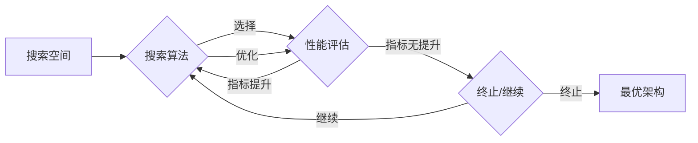

# NAS在计算机视觉领域的应用成果

> 关键词：神经网络架构搜索（NAS），计算机视觉，深度学习，架构优化，自动设计，目标检测，图像识别

## 1. 背景介绍

随着深度学习在计算机视觉领域的迅猛发展，深度神经网络（DNN）已经成为图像识别、目标检测、图像分割等任务中不可或缺的工具。然而，DNN的设计过程通常是手工设计，需要大量经验和专业知识。这种设计方法不仅费时费力，而且难以满足日益增长的需求。神经网络架构搜索（Neural Architecture Search，NAS）作为一种新兴的深度学习技术，旨在通过自动化搜索的方式，发现最优或近似最优的神经网络架构。本文将探讨NAS在计算机视觉领域的应用成果，分析其原理、算法、实践以及未来发展趋势。

## 2. 核心概念与联系

### 2.1 核心概念

**神经网络架构搜索（NAS）**：NAS是一种通过搜索算法自动设计神经网络架构的方法。它旨在寻找在特定任务上性能最优或近似最优的神经网络结构。

**搜索空间**：NAS搜索的是一组可能的网络架构，这些架构由网络层、连接方式、参数等组成。

**性能指标**：NAS的目标是优化特定任务上的性能指标，如准确率、召回率、计算复杂度等。

### 2.2 核心概念原理和架构的 Mermaid 流程图



### 2.3 核心概念联系

NAS通过搜索算法在搜索空间中寻找最优或近似最优的神经网络架构，并通过性能评估来衡量架构的优劣。如果性能指标得到提升，则继续搜索；否则，可能终止搜索或进行其他优化策略。

## 3. 核心算法原理 & 具体操作步骤

### 3.1 算法原理概述

NAS算法主要分为以下几类：

**基于强化学习**：利用强化学习算法，通过奖励机制引导模型搜索最优架构。

**基于贝叶斯优化**：使用贝叶斯优化方法，根据历史搜索结果来优化搜索策略。

**基于遗传算法**：借鉴遗传算法的原理，模拟自然选择过程进行架构搜索。

**基于迁移学习**：利用已搜索过的架构作为起点，通过迁移学习的方法来寻找新的架构。

### 3.2 算法步骤详解

1. 定义搜索空间：确定网络层、连接方式、参数等搜索参数。
2. 设计搜索算法：选择合适的搜索算法，如强化学习、贝叶斯优化、遗传算法等。
3. 性能评估：在验证集上评估搜索到的架构性能。
4. 搜索优化：根据性能评估结果，调整搜索策略，如调整搜索参数、选择新的搜索算法等。
5. 模型训练：在最优或近似最优的架构上进行模型训练。
6. 性能测试：在测试集上测试模型的最终性能。

### 3.3 算法优缺点

**优点**：

- 自动化设计：NAS可以自动搜索最优或近似最优的架构，节省人力成本。
- 提升性能：NAS可以找到比手工设计更好的架构，提升模型性能。
- 灵活性强：NAS可以根据不同的任务和需求，灵活搜索不同的架构。

**缺点**：

- 计算复杂度：NAS搜索过程通常需要大量的计算资源。
- 难以评估：对于复杂的网络架构，评估其性能可能比较困难。
- 需要大量数据：NAS需要大量的数据来评估架构性能。

### 3.4 算法应用领域

NAS在计算机视觉领域已经取得了显著的成果，以下是一些主要应用领域：

- 目标检测
- 图像识别
- 图像分割
- 视频分析
- 图像生成

## 4. 数学模型和公式 & 详细讲解 & 举例说明

### 4.1 数学模型构建

NAS的数学模型通常包括以下部分：

1. **网络层函数**：如卷积层、全连接层、激活函数等。
2. **连接方式**：如全连接、跳跃连接、转置卷积等。
3. **损失函数**：如交叉熵损失、均方误差等。
4. **优化器**：如Adam、SGD等。

### 4.2 公式推导过程

以下以交叉熵损失函数为例进行推导：

$$
L = -\frac{1}{N} \sum_{i=1}^{N} [y_i \log(\hat{y}_i) + (1-y_i) \log(1-\hat{y}_i)]
$$

其中，$y_i$ 为真实标签，$\hat{y}_i$ 为模型预测概率。

### 4.3 案例分析与讲解

以下以目标检测任务为例，分析NAS在计算机视觉领域的应用：

**任务描述**：给定一张图像，检测图像中的目标位置和类别。

**数据集**：PASCAL VOC数据集

**搜索空间**：搜索包含不同网络层的网络架构，如卷积层、池化层、全连接层等。

**搜索算法**：使用强化学习算法进行架构搜索。

**性能评估**：在验证集上评估模型的平均精度（mAP）。

**优化策略**：根据mAP值调整搜索策略，如调整搜索参数、选择新的搜索算法等。

## 5. 项目实践：代码实例和详细解释说明

### 5.1 开发环境搭建

1. 安装Python环境
2. 安装TensorFlow或PyTorch框架
3. 安装NAS相关库，如AutoDL、AutoTensorFlow等

### 5.2 源代码详细实现

以下是一个使用AutoDL进行NAS搜索的简单示例：

```python
import autotvm as tvm
from autoDL.searcher importNAS

# 定义搜索空间
search_space = {
    'layer': ['conv2d', 'max_pool2d', 'avg_pool2d'],
    'filter_size': [3, 5],
    'kernel_size': [3, 5],
    'stride': [1, 2],
    'num_filter': [16, 32, 64],
    'act_type': ['relu', 'leaky_relu', 'sigmoid'],
}

# 初始化NAS搜索器
searcher = NAS(search_space)

# 设置搜索参数
searcher.set_search_params(
    task='classification',
    task_params={'data_shape': (1, 3, 224, 224)},
    num_trials=100,
    device='cuda'
)

# 搜索最优架构
searcher.search()

# 获取最优架构
best_arch = searcher.get_best_architecture()

# 使用最优架构训练模型
model = build_model(best_arch)
model.fit(train_data, train_labels, batch_size=32, epochs=10)

# 测试模型性能
test_loss, test_accuracy = model.evaluate(test_data, test_labels)

print(f"Test loss: {test_loss}, Test accuracy: {test_accuracy}")
```

### 5.3 代码解读与分析

- `import autotvm as tvm` 和 `import autoDL.searcher as NAS` 导入所需的库。
- `search_space` 定义了搜索空间，包括网络层、参数等。
- `searcher` 初始化NAS搜索器，并设置搜索参数。
- `searcher.search()` 开始搜索最优架构。
- `searcher.get_best_architecture()` 获取最优架构。
- `build_model()` 使用最优架构构建模型。
- `model.fit()` 使用训练数据训练模型。
- `model.evaluate()` 使用测试数据评估模型性能。

## 6. 实际应用场景

NAS在计算机视觉领域已经取得了显著的应用成果，以下是一些实际应用场景：

- **目标检测**：使用NAS搜索最优的目标检测模型，如YOLO、SSD、Faster R-CNN等。
- **图像识别**：使用NAS搜索最优的图像识别模型，如ResNet、VGG、MobileNet等。
- **图像分割**：使用NAS搜索最优的图像分割模型，如FCN、U-Net、DeepLab等。
- **视频分析**：使用NAS搜索最优的视频分析模型，如光流估计、动作识别等。

## 7. 工具和资源推荐

### 7.1 学习资源推荐

- 《深度学习》（Goodfellow et al.）
- 《动手学深度学习》（Deng et al.）
- 《AutoML：自动化机器学习》（Biermann et al.）

### 7.2 开发工具推荐

- TensorFlow：https://www.tensorflow.org/
- PyTorch：https://pytorch.org/
- AutoDL：https://github.com/Automatic-ML/AutoDL

### 7.3 相关论文推荐

- Hinton et al., "Distilling the knowledge in a neural network," arXiv preprint arXiv:1803.02999 (2018)
- Zoph et al., "Neural Architecture Search with Reinforcement Learning," arXiv preprint arXiv:1609.02907 (2016)
- Pham et al., "Efficient Neural Architecture Search via Parameter Sharing," arXiv preprint arXiv:1902.02806 (2019)

## 8. 总结：未来发展趋势与挑战

### 8.1 研究成果总结

NAS在计算机视觉领域取得了显著的成果，为深度学习模型的自动设计提供了新的思路。NAS可以帮助研究人员发现更优的模型架构，提高模型性能，并降低设计成本。

### 8.2 未来发展趋势

- NAS算法将更加高效，计算复杂度将降低。
- NAS将与其他深度学习技术，如迁移学习、强化学习等，进行更深入的融合。
- NAS将应用于更多领域，如语音识别、自然语言处理等。

### 8.3 面临的挑战

- NAS搜索空间庞大，搜索效率有待提高。
- NAS算法的可解释性有待加强。
- NAS模型的泛化能力有待提高。

### 8.4 研究展望

NAS技术将推动深度学习模型的自动设计，为人工智能的发展带来新的突破。未来，NAS将在更多领域得到应用，为构建更加智能化的系统提供支持。

## 9. 附录：常见问题与解答

**Q1：NAS与传统的手工设计相比有哪些优势？**

A：NAS可以自动搜索最优或近似最优的架构，节省人力成本，并提升模型性能。

**Q2：NAS搜索效率如何提高？**

A：可以通过以下方法提高NAS搜索效率：
- 使用高效的搜索算法，如基于强化学习、贝叶斯优化、遗传算法等。
- 使用迁移学习，利用已搜索过的架构作为起点。
- 使用多线程、分布式计算等技术加速搜索过程。

**Q3：NAS模型的泛化能力如何提升？**

A：可以通过以下方法提升NAS模型的泛化能力：
- 使用更丰富的搜索空间，包括更多类型的网络层、连接方式等。
- 使用数据增强技术，增加训练数据的多样性。
- 使用正则化技术，防止模型过拟合。

**Q4：NAS在实际应用中面临哪些挑战？**

A：NAS在实际应用中面临以下挑战：
- 搜索空间庞大，搜索效率有待提高。
- NAS算法的可解释性有待加强。
- NAS模型的泛化能力有待提高。

**Q5：NAS技术在哪些领域有应用？**

A：NAS技术在以下领域有应用：
- 目标检测
- 图像识别
- 图像分割
- 视频分析
- 图像生成

作者：禅与计算机程序设计艺术 / Zen and the Art of Computer Programming