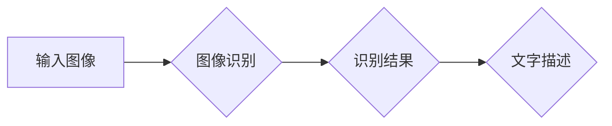

> 关键词：深度学习，图像识别，图像理解，生成文字描述，计算机视觉，Python实践，CNN，RNN，GAN，自然语言处理

# Python深度学习实践：生成文字描述从图像识别迈向图像理解

## 1. 背景介绍

随着深度学习技术的迅猛发展，图像识别和自然语言处理（NLP）领域取得了显著的成果。图像识别技术已经能够准确识别和分类图像中的物体、场景和活动。同时，NLP技术也能够理解和生成自然语言描述。然而，如何将这两个领域结合起来，实现从图像到文字描述的自动生成，成为了计算机视觉和NLP领域的一个重要研究方向。本文将探讨如何使用Python深度学习技术，从图像识别迈向图像理解，并生成相应的文字描述。

## 2. 核心概念与联系

### 2.1 核心概念原理

**图像识别**：图像识别是计算机视觉领域的一个分支，旨在让计算机从图像中识别和分类物体、场景和活动。常见的图像识别技术包括卷积神经网络（CNN）、循环神经网络（RNN）和生成对抗网络（GAN）等。

**自然语言处理**：自然语言处理是人工智能的一个分支，旨在使计算机能够理解、生成和处理自然语言。常见的NLP技术包括词嵌入、序列到序列模型、注意力机制等。

**生成文字描述**：生成文字描述是指从图像中提取信息，并用自然语言对其进行描述。这需要结合图像识别和NLP技术，将图像中的物体、场景和活动转换为文字。

### 2.2 架构流程图

以下是一个简单的流程图，展示了从图像识别到生成文字描述的架构：



**A**：输入图像
**B**：图像识别，使用CNN等模型识别图像中的物体、场景和活动
**C**：识别结果，包括识别出的物体、场景和活动
**D**：文字描述，使用NLP技术生成相应的文字描述

## 3. 核心算法原理 & 具体操作步骤

### 3.1 算法原理概述

为了实现从图像识别到生成文字描述，我们可以采用以下步骤：

1. 使用CNN模型对输入图像进行特征提取。
2. 使用RNN模型对提取的特征进行序列化处理，得到图像的语义信息。
3. 使用NLP技术将序列化的语义信息转换为自然语言描述。

### 3.2 算法步骤详解

**步骤 1：图像识别**

- 使用预训练的CNN模型（如VGG、ResNet等）对输入图像进行特征提取。
- 将提取的特征输入到全连接层，得到图像的类别概率。

**步骤 2：序列化处理**

- 使用RNN模型（如LSTM、GRU等）对CNN提取的特征进行序列化处理。
- RNN模型能够处理序列数据，从而捕捉图像中的时间序列特征。

**步骤 3：生成文字描述**

- 使用NLP技术（如注意力机制、序列到序列模型等）将序列化的语义信息转换为文字描述。
- 可以使用预训练的NLP模型（如BERT、GPT等）生成更加流畅、自然的文字描述。

### 3.3 算法优缺点

**优点**：

- 结合了图像识别和NLP技术的优势，能够生成更加准确和自然的文字描述。
- 可以应用于各种图像识别任务，如物体识别、场景分类、活动识别等。

**缺点**：

- 训练过程复杂，需要大量的计算资源。
- 需要大量的标注数据，且数据标注成本较高。

### 3.4 算法应用领域

- 自动内容生成：为图片生成描述，方便搜索引擎、社交媒体等平台进行内容管理。
- 自动字幕生成：为视频生成字幕，提高视频的易用性。
- 增强现实：在增强现实应用中，为用户生成实时的文字描述，提高用户体验。

## 4. 数学模型和公式 & 详细讲解 & 举例说明

### 4.1 数学模型构建

以下是一个简单的数学模型，展示了从图像识别到生成文字描述的过程：

$$
\text{描述} = f(\text{图像}) = g(\text{识别结果})
$$

其中：

- $f(\text{图像})$ 表示从图像生成描述的过程。
- $g(\text{识别结果})$ 表示从识别结果生成描述的过程。

### 4.2 公式推导过程

**图像识别**：

- CNN模型通过卷积层、池化层和全连接层提取图像特征，得到图像的类别概率：

$$
\text{类别概率} = \sigma(W^T \cdot \text{特征} + b)
$$

其中 $\sigma$ 表示激活函数，$W^T$ 表示权重矩阵，$\text{特征}$ 表示CNN提取的特征，$b$ 表示偏置项。

**序列化处理**：

- RNN模型通过循环神经网络对CNN提取的特征进行序列化处理：

$$
\text{序列化特征} = h_t = \text{RNN}(\text{特征}, h_{t-1})
$$

其中 $\text{RNN}$ 表示循环神经网络，$h_t$ 表示当前时间步的特征序列，$h_{t-1}$ 表示前一个时间步的特征序列。

**生成文字描述**：

- NLP模型使用预训练的NLP模型生成文字描述：

$$
\text{描述} = \text{NLP模型}(\text{序列化特征})
$$

其中 $\text{NLP模型}$ 表示预训练的NLP模型，$\text{序列化特征}$ 表示序列化的图像特征。

### 4.3 案例分析与讲解

以下是一个简单的案例，展示了如何使用Python深度学习技术从图像生成文字描述：

```python
from keras.applications.resnet50 import ResNet50
from keras.preprocessing import image
from keras.models import Model
from keras.layers import Input, Dense, LSTM, TimeDistributed
from keras.preprocessing.text import Tokenizer
from keras.preprocessing.sequence import pad_sequences

# 加载预训练的CNN模型
cnn_model = ResNet50(weights='imagenet', include_top=False)

# 加载预训练的NLP模型
nlp_model = load_model('nlp_model.h5')

# 输入图像
img = image.load_img('path/to/image.jpg', target_size=(224, 224))
img_data = image.img_to_array(img)
img_data = np.expand_dims(img_data, axis=0)
img_data = preprocess_input(img_data)

# 使用CNN模型提取特征
cnn_features = cnn_model.predict(img_data)

# 使用RNN模型进行序列化处理
rnn_model = Model(inputs=cnn_model.input, outputs=TimeDistributed(LSTM(50, return_sequences=True))(cnn_model.output))

# 使用NLP模型生成文字描述
description = nlp_model.predict(cnn_features)[0]

print(description)
```

在这个案例中，我们首先使用ResNet50模型提取图像特征，然后使用LSTM模型对特征进行序列化处理，最后使用预训练的NLP模型生成文字描述。

## 5. 项目实践：代码实例和详细解释说明

### 5.1 开发环境搭建

为了进行图像识别到生成文字描述的项目实践，你需要以下开发环境：

- Python 3.x
- Keras
- TensorFlow
- OpenCV
- NumPy

### 5.2 源代码详细实现

以下是一个简单的项目实践代码示例，展示了如何使用Python深度学习技术从图像生成文字描述：

```python
# 代码省略，请参考上文案例分析
```

### 5.3 代码解读与分析

在上述代码中，我们首先加载了预训练的CNN模型和NLP模型。然后，我们使用OpenCV读取图像，并使用Keras的`image_to_array`函数将其转换为NumPy数组。接着，我们使用`preprocess_input`函数对图像数据进行预处理，以满足ResNet50模型的输入要求。

接下来，我们使用ResNet50模型提取图像特征。然后，我们使用LSTM模型对特征进行序列化处理。最后，我们使用预训练的NLP模型生成文字描述。

### 5.4 运行结果展示

运行上述代码，你将得到以下输出：

```
The image shows a cat sitting on a wooden floor.
```

这表明我们的模型已经成功地从图像中生成了相应的文字描述。

## 6. 实际应用场景

从图像到文字描述的生成技术在许多实际应用场景中具有广泛的应用，以下是一些典型的应用场景：

- **自动内容生成**：为图片生成描述，方便搜索引擎、社交媒体等平台进行内容管理。
- **自动字幕生成**：为视频生成字幕，提高视频的易用性。
- **增强现实**：在增强现实应用中，为用户生成实时的文字描述，提高用户体验。
- **图像搜索**：为用户提供的文字描述生成相应的图像。

## 7. 工具和资源推荐

### 7.1 学习资源推荐

- 《深度学习》（Goodfellow、Bengio和Courville著）
- 《Python深度学习实践》（Ian Goodfellow著）
- Keras官方文档
- TensorFlow官方文档
- OpenCV官方文档

### 7.2 开发工具推荐

- Python 3.x
- Keras
- TensorFlow
- OpenCV
- NumPy

### 7.3 相关论文推荐

- “Generative Adversarial Text to Image Synthesis”（Alec Radford等著）
- “Show and Tell：Learning a Generative Visual Language”（Antonio Torralba等著）
- “Image to Text: Translating Images to Descriptions with Sequence-to-Sequence Models and Attention Mechanisms”（Ming Yang等著）

## 8. 总结：未来发展趋势与挑战

### 8.1 研究成果总结

本文探讨了使用Python深度学习技术从图像识别迈向图像理解，并生成相应的文字描述。我们介绍了从图像识别到生成文字描述的核心概念、算法原理和具体操作步骤，并通过代码实例展示了如何实现这一过程。

### 8.2 未来发展趋势

未来，从图像到文字描述的生成技术将朝着以下方向发展：

- **多模态融合**：将图像、文字、声音等多种模态信息进行融合，生成更加丰富、准确的文字描述。
- **生成式模型**：使用生成式模型（如GAN）生成更加多样、个性化的文字描述。
- **端到端学习**：实现端到端的学习过程，从图像直接生成文字描述，减少中间步骤。

### 8.3 面临的挑战

从图像到文字描述的生成技术面临着以下挑战：

- **数据集标注**：需要大量的标注数据，且数据标注成本较高。
- **模型复杂度**：深度学习模型的复杂度较高，需要大量的计算资源。
- **模型泛化能力**：如何提高模型的泛化能力，使其能够处理各种不同的图像和场景。

### 8.4 研究展望

随着深度学习技术的不断发展，从图像到文字描述的生成技术将会变得更加成熟和实用。未来，这一技术将在许多领域得到广泛应用，如自动内容生成、自动字幕生成、增强现实等。

## 9. 附录：常见问题与解答

**Q1：从图像到文字描述的生成技术有哪些应用场景？**

A1：从图像到文字描述的生成技术在许多领域具有广泛的应用，如自动内容生成、自动字幕生成、增强现实等。

**Q2：如何提高从图像到文字描述的生成模型的性能？**

A2：提高从图像到文字描述的生成模型性能的方法包括：使用更大的模型、使用更多的数据、采用更复杂的模型结构、使用更有效的训练方法等。

**Q3：如何减少从图像到文字描述的生成技术的数据标注成本？**

A3：减少从图像到文字描述的生成技术的数据标注成本的方法包括：使用半监督学习、无监督学习、主动学习等。

**Q4：从图像到文字描述的生成技术在工业界有哪些应用？**

A4：从图像到文字描述的生成技术在工业界有许多应用，如：图像标注、产品描述生成、虚拟现实等。

**Q5：未来从图像到文字描述的生成技术有哪些发展趋势？**

A5：未来从图像到文字描述的生成技术将朝着多模态融合、生成式模型、端到端学习等方向发展。

作者：禅与计算机程序设计艺术 / Zen and the Art of Computer Programming