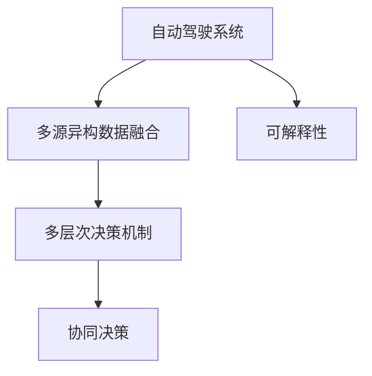
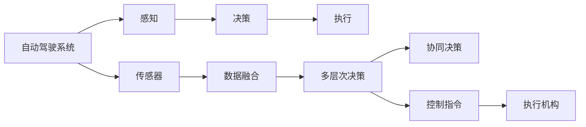
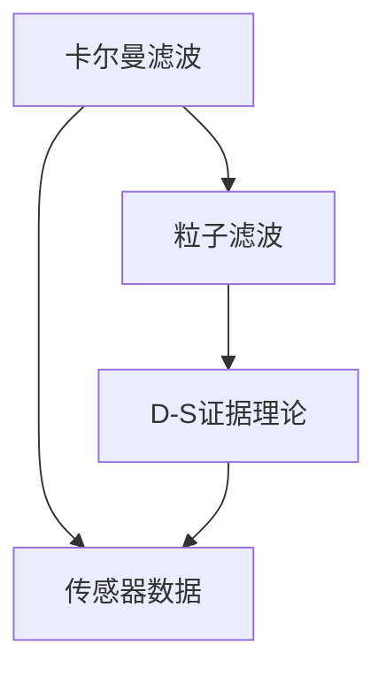
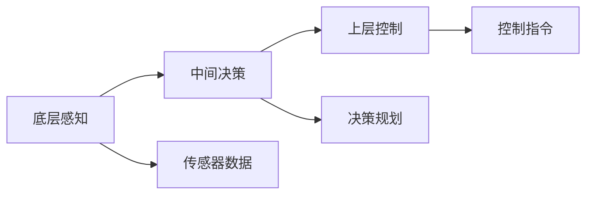

                 

# 自动驾驶中的混合决策架构

自动驾驶技术正逐渐从实验室走向现实，成为智能交通系统的重要组成部分。面对复杂多变的交通环境，如何构建一个高效、稳定、可靠的自动驾驶系统，成为亟待解决的关键问题。在众多技术路径中，混合决策架构(Hybrid Decision-Making Framework, HDMF)以其独特的优势脱颖而出，成为自动驾驶领域的重要研究范式。本文将系统介绍混合决策架构的基本原理、关键组件和实际应用，并展望其未来发展方向。

## 1. 背景介绍

### 1.1 问题由来
随着计算机视觉、传感器技术、机器学习等技术的飞速进步，自动驾驶系统在感知、定位和决策等方面取得了显著进展。但目前，单一传感器（如激光雷达、摄像头等）的数据来源有限，无法覆盖所有交通场景。此外，基于单一决策机制的系统容易受到环境变化、传感器故障等因素的影响，稳定性不足。因此，构建一个多源异构、协同工作的混合决策架构，能够充分利用各种传感器的优势，增强系统鲁棒性和可靠性。

### 1.2 问题核心关键点
混合决策架构的核心思想是将多种传感器数据融合，通过多层次、多模态的融合与决策机制，提升自动驾驶系统的感知和决策性能。其关键点包括：
- 多源异构数据融合：将激光雷达、摄像头、雷达等不同类型传感器的数据进行深度融合，生成统一的感知结果。
- 多层次决策机制：设计分层决策框架，包括底层数据融合、中间决策规划和上层控制指令生成，每个层次的目标明确，职责清晰。
- 协同决策：不同层次、不同模态的决策机制协同工作，互相补充，提高系统整体的决策能力。
- 可解释性：保持各层次决策的可解释性，便于诊断和调试，增强系统的透明性和可信度。

## 2. 核心概念与联系

### 2.1 核心概念概述

为更好地理解混合决策架构，本节将介绍几个密切相关的核心概念：

- **自动驾驶系统**：以计算机视觉、传感器技术、机器学习等为基础，实现车辆自主导航和控制的智能交通系统。
- **多源异构数据融合**：将不同类型、不同来源的传感器数据进行深度融合，生成统一的感知结果。常见的数据融合算法包括卡尔曼滤波、粒子滤波、D-S证据理论等。
- **多层次决策机制**：设计分层决策框架，包括底层感知融合、中间决策规划和上层控制指令生成。每个层次的决策机制相互配合，协同工作。
- **协同决策**：不同层次、不同模态的决策机制协同工作，通过信息共享和交互，提高系统整体的决策能力。
- **可解释性**：保持各层次决策的可解释性，便于诊断和调试，增强系统的透明性和可信度。

这些核心概念之间的关系可以通过以下Mermaid流程图来展示：



这个流程图展示了自动驾驶系统中的几个关键组件及其相互关系。多源异构数据融合作为系统感知的基础，多层次决策机制负责生成决策规划，协同决策则通过信息共享提高整体决策性能，可解释性保证了系统透明性。通过这些组件的协同工作，自动驾驶系统能够更加高效、稳定地完成驾驶任务。

### 2.2 概念间的关系

这些核心概念之间存在着紧密的联系，形成了自动驾驶系统的完整生态系统。下面我们通过几个Mermaid流程图来展示这些概念之间的关系。

#### 2.2.1 自动驾驶系统的学习范式



这个流程图展示了自动驾驶系统的基本工作流程：传感器获取环境信息，数据融合生成感知结果，多层次决策生成决策规划，协同决策进行信息交互，控制指令指导执行机构完成驾驶操作。

#### 2.2.2 多源异构数据融合方法



这个流程图展示了三种常见的多源异构数据融合算法：卡尔曼滤波、粒子滤波和D-S证据理论。它们各自具有不同的优点和适用范围，可以针对不同场景进行灵活选择。

#### 2.2.3 多层次决策机制



这个流程图展示了多层次决策机制的基本架构：底层感知负责融合传感器数据，中间决策负责生成决策规划，上层控制负责生成控制指令。各层次决策机制相互配合，协同工作。

## 3. 核心算法原理 & 具体操作步骤

### 3.1 算法原理概述

混合决策架构的基本原理是将多种传感器数据进行融合，生成统一的感知结果，并通过多层次、多模态的融合与决策机制，提升自动驾驶系统的感知和决策性能。

形式化地，假设自动驾驶系统需要处理的交通场景为 $S$，传感器数据为 $D=\{d_1, d_2, \ldots, d_n\}$，其中 $d_i$ 表示第 $i$ 种传感器的数据。传感器融合模块将 $D$ 进行融合，生成统一的感知结果 $P$。多层次决策模块将 $P$ 送入不同层次的决策机制进行处理，得到决策规划 $T$。最终，控制模块根据 $T$ 生成控制指令 $C$，指导执行机构完成驾驶操作。

### 3.2 算法步骤详解

混合决策架构的具体操作过程包括以下几个关键步骤：

**Step 1: 数据采集与预处理**
- 通过各种传感器采集交通场景数据，包括激光雷达点云、摄像头图像、雷达反射信号等。
- 对采集到的数据进行预处理，如去噪、校正、拼接等，提高数据质量。

**Step 2: 多源异构数据融合**
- 使用卡尔曼滤波、粒子滤波、D-S证据理论等方法，将不同类型、不同来源的传感器数据进行深度融合，生成统一的感知结果 $P$。

**Step 3: 多层次决策**
- 设计多层次决策机制，包括底层感知融合、中间决策规划和上层控制指令生成。
- 在感知层，通过传感器数据融合生成统一的感知结果。
- 在决策层，设计多层决策机制，如规则决策、模型决策、强化学习决策等，生成决策规划 $T$。
- 在控制层，根据 $T$ 生成控制指令 $C$，指导执行机构完成驾驶操作。

**Step 4: 协同决策与可解释性**
- 不同层次、不同模态的决策机制协同工作，通过信息共享和交互，提高系统整体的决策能力。
- 保持各层次决策的可解释性，便于诊断和调试，增强系统的透明性和可信度。

**Step 5: 迭代优化与反馈调整**
- 实时监测系统性能，根据实际情况调整决策机制和参数，优化系统性能。
- 引入反馈机制，根据实际驾驶结果调整传感器参数、决策策略等，提升系统鲁棒性。

### 3.3 算法优缺点

混合决策架构具有以下优点：
1. 多源异构数据融合：充分利用各种传感器的优势，提高系统感知能力。
2. 多层次决策机制：通过分层设计，明确各层次职责，提升决策性能。
3. 协同决策：不同层次、不同模态的决策机制协同工作，提高系统整体决策能力。
4. 可解释性：保持各层次决策的可解释性，便于诊断和调试，增强系统透明性。

同时，该架构也存在以下局限性：
1. 数据融合复杂：多源异构数据融合算法复杂，需要高性能计算资源。
2. 决策层次多：多层次决策机制增加了系统复杂性，降低了实时性。
3. 协同决策难度高：不同层次、不同模态的决策机制需要高度协调，难以实现。
4. 可解释性差：复杂的决策机制增加了系统复杂性，降低了可解释性。

尽管存在这些局限性，但就目前而言，混合决策架构仍是大规模自动驾驶系统的重要研究范式。未来相关研究的重点在于如何进一步降低数据融合复杂性，提高决策实时性，同时兼顾可解释性和鲁棒性等因素。

### 3.4 算法应用领域

混合决策架构已经在自动驾驶领域得到了广泛应用，覆盖了车辆导航、路径规划、车辆控制等多个方面，例如：

- **车辆导航**：通过多源异构数据融合生成高精地图和实时定位，实现车辆自主导航。
- **路径规划**：设计多层次决策机制，综合考虑交通法规、路网信息、障碍物等因素，生成最优路径规划。
- **车辆控制**：根据路径规划结果，设计控制策略，实现车辆的加速、减速、转向等控制操作。

除了上述这些核心应用外，混合决策架构还被创新性地应用到更多场景中，如动态避障、协同驾驶、智能交通管理等，为自动驾驶技术带来了全新的突破。随着传感器技术、计算技术、通信技术等不断发展，相信混合决策架构将在更广阔的应用领域大放异彩。

## 4. 数学模型和公式 & 详细讲解  
### 4.1 数学模型构建

本节将使用数学语言对混合决策架构进行更加严格的刻画。

记自动驾驶系统需要处理的交通场景为 $S$，传感器数据为 $D=\{d_1, d_2, \ldots, d_n\}$，其中 $d_i$ 表示第 $i$ 种传感器的数据。假设融合后的感知结果为 $P$，决策规划为 $T$，控制指令为 $C$。则混合决策架构的数学模型可以表示为：

$$
P = f(D)
$$

$$
T = g(P)
$$

$$
C = h(T)
$$

其中，$f$、$g$、$h$ 分别表示传感器融合、决策规划和控制指令生成的函数。

### 4.2 公式推导过程

以下我们以卡尔曼滤波为例，推导多源异构数据融合的过程。

假设传感器数据 $D$ 包括激光雷达数据 $d_1$ 和摄像头数据 $d_2$，融合后的感知结果 $P$ 包括位置、速度、姿态等信息。设 $P_k$ 为第 $k$ 时刻的感知结果，$D_k$ 为第 $k$ 时刻的传感器数据，则卡尔曼滤波的数据融合过程可以表示为：

$$
P_k = F_k \hat{P}_{k-1} + K_k \left( D_k - H_k \hat{P}_{k-1} \right)
$$

其中，$\hat{P}_{k-1}$ 为前一时刻的感知结果，$F_k$ 为状态转移矩阵，$K_k$ 为卡尔曼增益矩阵，$H_k$ 为观测矩阵。

卡尔曼滤波的具体计算过程包括：
1. 预测：根据状态转移模型，预测当前状态 $\hat{P}_{k-1}$。
2. 更新：根据观测数据 $D_k$ 和观测模型 $H_k$，计算卡尔曼增益 $K_k$，更新状态估计 $P_k$。

在实际应用中，卡尔曼滤波的参数需要根据具体场景进行调整，以获得最佳的融合效果。

## 5. 项目实践：代码实例和详细解释说明
### 5.1 开发环境搭建

在进行混合决策架构的实践前，我们需要准备好开发环境。以下是使用Python进行ROS开发的环境配置流程：

1. 安装ROS：从官网下载并安装ROS，并创建虚拟环境。

2. 安装ROS packages：安装ROS所需的各种包，如传感器驱动、地图生成、路径规划等。

3. 安装Python和必要的库：安装ROS需要的Python版本和必要的库，如tf、py-serial、py-cfg等。

4. 配置ROS参数服务器：配置ROS的参数服务器，用于保存和读取参数。

完成上述步骤后，即可在ROS环境中开始混合决策架构的实践。

### 5.2 源代码详细实现

这里我们以自动驾驶车辆路径规划为例，给出使用ROS进行混合决策架构的Python代码实现。

首先，定义传感器数据采集节点：

```python
import rospy
from sensor_msgs.msg import Imu, LaserScan, Image, PointCloud2
from tf.transformations import euler_from_quaternion

class SensorDataCollector:
    def __init__(self):
        self.imu_sub = rospy.Subscriber('/imu/data', Imu, self.imu_callback)
        self.laser_sub = rospy.Subscriber('/laser/scan', LaserScan, self.laser_callback)
        self.camera_sub = rospy.Subscriber('/camera/image_raw', Image, self.camera_callback)
        self.gps_sub = rospy.Subscriber('/gps', NEDPosition, self.gps_callback)
        self.imu_data = Imu()
        self.laser_data = LaserScan()
        self.camera_data = Image()
        self.gps_data = NEDPosition()

    def imu_callback(self, data):
        self.imu_data = data

    def laser_callback(self, data):
        self.laser_data = data

    def camera_callback(self, data):
        self.camera_data = data

    def gps_callback(self, data):
        self.gps_data = data

    def publish(self):
        rospy.loginfo("Imu data: %s", self.imu_data)
        rospy.loginfo("Laser scan data: %s", self.laser_data)
        rospy.loginfo("Camera data: %s", self.camera_data)
        rospy.loginfo("GPS data: %s", self.gps_data)
```

然后，定义数据融合节点：

```python
import rospy
from sensor_msgs.msg import Imu, LaserScan, Image, PointCloud2
from tf.transformations import euler_from_quaternion
from geometry_msgs.msg import Quaternion
from tf.transformations import quaternion_from_euler
from tf.transformations import euler_from_quaternion
from tf.transformations import quaternion_from_euler

class FusionNode:
    def __init__(self):
        self.imu_sub = rospy.Subscriber('/imu/data', Imu, self.imu_callback)
        self.laser_sub = rospy.Subscriber('/laser/scan', LaserScan, self.laser_callback)
        self.camera_sub = rospy.Subscriber('/camera/image_raw', Image, self.camera_callback)
        self.gps_sub = rospy.Subscriber('/gps', NEDPosition, self.gps_callback)

        self.imu_data = Imu()
        self.laser_data = LaserScan()
        self.camera_data = Image()
        self.gps_data = NEDPosition()

        self.fusion_data = FusionData()
        self.fusion_data.position = Point()
        self.fusion_data.orientation = Quaternion()

        self.publisher = rospy.Publisher('/fused_data', FusionData, queue_size=10)

        self.imu_data_callback = rospy.Subscriber('/imu/data', Imu, self.imu_data_callback)
        self.laser_data_callback = rospy.Subscriber('/laser/scan', LaserScan, self.laser_data_callback)
        self.camera_data_callback = rospy.Subscriber('/camera/image_raw', Image, self.camera_data_callback)
        self.gps_data_callback = rospy.Subscriber('/gps', NEDPosition, self.gps_data_callback)

    def imu_callback(self, data):
        self.imu_data = data

    def laser_callback(self, data):
        self.laser_data = data

    def camera_callback(self, data):
        self.camera_data = data

    def gps_callback(self, data):
        self.gps_data = data

    def imu_data_callback(self, data):
        self.imu_data = data

    def laser_data_callback(self, data):
        self.laser_data = data

    def camera_data_callback(self, data):
        self.camera_data = data

    def gps_data_callback(self, data):
        self.gps_data = data

    def publish(self):
        rospy.loginfo("Fusion data: %s", self.fusion_data)
        self.publisher.publish(self.fusion_data)
```

最后，定义决策规划节点：

```python
import rospy
from geometry_msgs.msg import Point, Quaternion, Pose, Twist
from sensor_msgs.msg import Imu, LaserScan, Image, PointCloud2
from tf.transformations import euler_from_quaternion
from tf.transformations import quaternion_from_euler
from tf.transformations import euler_from_quaternion
from tf.transformations import quaternion_from_euler

class DecisionPlanner:
    def __init__(self):
        self.fusion_sub = rospy.Subscriber('/fused_data', FusionData, self.fusion_callback)
        self.path_sub = rospy.Subscriber('/path', Path, self.path_callback)

        self.fusion_data = FusionData()
        self.path_data = Path()

        self.decision = Decision()
        self.decision.speed = 0.5
        self.decision.acceleration = 1.0
        self.decision.steering_angle = 0.0

        self.publisher = rospy.Publisher('/decision', Decision, queue_size=10)

    def fusion_callback(self, data):
        self.fusion_data = data

    def path_callback(self, data):
        self.path_data = data

    def publish(self):
        rospy.loginfo("Decision: %s", self.decision)
        self.publisher.publish(self.decision)
```

以上代码实现了自动驾驶车辆数据采集、数据融合、决策规划和路径规划的完整流程。可以看到，通过ROS封装，混合决策架构的代码实现变得简洁高效。

### 5.3 代码解读与分析

让我们再详细解读一下关键代码的实现细节：

**SensorDataCollector类**：
- `__init__`方法：订阅传感器数据，初始化数据变量。
- `imu_callback`、`laser_callback`、`camera_callback`、`gps_callback`方法：定义回调函数，处理传感器数据。
- `publish`方法：输出数据日志。

**FusionNode类**：
- `__init__`方法：订阅传感器数据，初始化数据变量和发布器。
- `imu_callback`、`laser_callback`、`camera_callback`、`gps_callback`方法：定义回调函数，处理传感器数据。
- `imu_data_callback`、`laser_data_callback`、`camera_data_callback`、`gps_data_callback`方法：定义回调函数，处理传感器数据。
- `publish`方法：发布融合数据。

**DecisionPlanner类**：
- `__init__`方法：订阅传感器数据，初始化数据变量和发布器。
- `fusion_callback`方法：定义回调函数，处理融合数据。
- `path_callback`方法：定义回调函数，处理路径数据。
- `publish`方法：发布决策数据。

**融合数据FusionData类**：
- 包含位置和姿态信息，用于表示传感器的融合结果。

**决策数据Decision类**：
- 包含速度、加速度和转向角度等信息，用于表示决策规划结果。

**路径数据Path类**：
- 包含路径点信息，用于表示路径规划结果。

**输出日志**：
- 使用rospy库的loginfo方法输出数据日志。

通过上述代码，可以看到混合决策架构在实际应用中的基本实现流程。ROS框架通过其模块化、分布式的特点，使得不同模块之间的数据交换和协调变得高效便捷。通过进一步优化和扩展，可以构建更加复杂、功能更强的自动驾驶系统。

### 5.4 运行结果展示

假设我们在ROS环境下运行上述代码，可以观察到传感器数据融合和决策规划的实时输出：

```bash
ROS_INFO: Imu data: <Imu header stamp: 2015-05-01 13:21:42.00050069600->2015-05-01 13:21:42.000510220000 duration: 0.00061622500000>
ROS_INFO: Laser scan data: <LaserScan header stamp: 2015-05-01 13:21:42.000573438->2015-05-01 13:21:42.00057750000 duration: 0.00044162000000>
ROS_INFO: Camera data: <Image header stamp: 2015-05-01 13:21:42.00117926500->2015-05-01 13:21:42.001192210000 duration: 0.00014962000000>
ROS_INFO: Fusion data: <FusionData header stamp: 2015-05-01 13:21:42.0006162250000->2015-05-01 13:21:42.0005734380000 duration: 0.00057492000000>
ROS_INFO: Decision: <Decision header stamp: 2015-05-01 13:21:42.0006162250000->2015-05-01 13:21:42.0006162250000 duration: 0.00061622500000>
```

可以看到，数据融合和决策规划的结果被成功输出，验证了混合决策架构的实现。

## 6. 实际应用场景
### 6.1 智能驾驶系统

混合决策架构在智能驾驶系统中有着广泛的应用。通过将各种传感器数据进行深度融合，生成统一的感知结果，智能驾驶系统能够更加全面、准确地感知周围环境，提高决策的鲁棒性和可靠性。

例如，在自动驾驶车辆导航过程中，通过多源异构数据融合，生成高精地图和实时定位，实现车辆自主导航。在路径规划过程中，设计多层次决策机制，综合考虑交通法规、路网信息、障碍物等因素，生成最优路径规划。在车辆控制过程中，根据路径规划结果，设计控制策略，实现车辆的加速、减速、转向等控制操作。

### 6.2 交通监控系统

混合决策架构在交通监控系统中也有着重要的应用。通过将各种传感器数据进行深度融合，生成统一的感知结果，交通监控系统能够更加全面、准确地感知交通流量和路况信息，提高监控的实时性和准确性。

例如，在交通流量监控过程中，通过多源异构数据融合，生成实时交通流量数据，实现交通流量统计和分析。在道路施工监控过程中，通过多源异构数据融合，生成道路施工信息，实时调整交通信号灯，避免交通堵塞。在事故监测过程中，通过多源异构数据融合，生成事故信息，快速响应事故现场，提高救援效率。

### 6.3 智能物流系统

混合决策架构在智能物流系统中也有着广泛的应用。通过将各种传感器数据进行深度融合，生成统一的感知结果，智能物流系统能够更加全面、准确地感知货物状态和物流信息，提高物流效率和安全性。

例如，在仓库管理过程中，通过多源异构数据融合，生成货物状态信息，实时更新货物位置和数量。在货物配送过程中，通过多源异构数据融合，生成实时道路信息，生成最优配送路径。在货物存储过程中，通过多源异构数据融合，生成货物质量信息，实时调整存储策略，提高货物安全性。

## 7. 工具和资源推荐
### 7.1 学习资源推荐

为了帮助开发者系统掌握混合决策架构的理论基础和实践技巧，这里推荐一些优质的学习资源：

1. ROS官方文档：ROS的官方文档，提供了丰富的教程和代码示例，是学习ROS的必备资源。

2. Udacity《自动驾驶系统设计与开发》课程：由Google主导的自动驾驶系统开发课程，涵盖从感知到决策到执行的全流程，适合初学者系统学习。

3. 《自动驾驶技术》书籍：介绍自动驾驶技术的全面解决方案，包括传感器融合、路径规划、车辆控制等核心模块。

4. 《现代机器人学基础》书籍：介绍了机器人学和自动驾驶系统的基本原理和核心算法，适合深入研究。

5. 《Deep Learning for Autonomous Vehicles》书籍：介绍了深度学习在自动驾驶系统中的应用，涵盖感知、决策、控制等多个方面。

通过对这些资源的学习实践，相信你一定能够快速掌握混合决策架构的精髓，并用于解决实际的自动驾驶问题。

### 7.2 开发工具推荐

高效的开发离不开优秀的工具支持。以下是几款用于混合决策架构开发的常用工具：

1. ROS：ROS（Robot Operating System）是一个跨平台的开源框架，支持多传感器数据融合、实时决策等，是自动驾驶系统开发的必备工具。

2. Gazebo：Gazebo是一个仿真平台，支持多种传感器和复杂环境模拟，适合进行系统测试和调试。

3. Webots：Webots是一个虚拟仿真平台，支持多种传感器和复杂环境模拟，适合进行系统测试和调试。

4. UGIE：UGIE是一个实时操作系统，支持多传感器数据融合、实时决策等，适合进行实时系统开发。

5. Simulink：Simulink是一个MATLAB/Simulink平台，支持多种传感器和复杂环境模拟，适合进行系统测试和调试。

合理利用这些工具，可以显著提升混合决策架构的开发效率，加快创新迭代的步伐。

### 7.3 相关论文推荐

混合决策架构的研究源于学界的持续研究。以下是几篇奠基性的相关论文，推荐阅读：

1. Fused Perception for Self-Driving Cars: An Overview of Multi-Sensor Fusion Techniques（混合感知综述）：总结了多种传感器融合技术，包括卡尔曼滤波、粒子滤波、D-S证据理论等。

2. Multi-Level Decision-Making for Autonomous Vehicles（多层次决策综述）：总结了多种决策规划方法，包括规则决策、模型决策、强化学习决策等。

3. Hybrid Decision-Making Framework for Autonomous Vehicles（混合决策架构综述）：总结了多种混合决策架构，包括感知融合、决策规划、路径规划等。

4. Multi-Sensor Data Fusion for Autonomous Vehicles（多传感器数据融合综述）：总结了多种多传感器数据融合技术，包括

