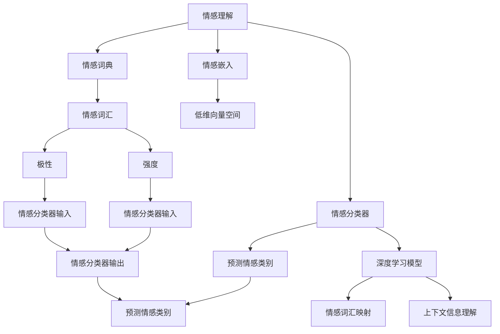

                 

# 虚拟共情实验室：AI增强的情感理解研究所

> 关键词：虚拟共情,情感理解,情感智能,人工智能,机器学习

## 1. 背景介绍

### 1.1 问题由来

情感理解是人工智能领域的经典问题之一，涉及对自然语言中的情感、情绪、态度等心理状态的分析与建模。随着深度学习和大数据技术的快速发展，情感理解技术在智能客服、舆情分析、广告推荐等领域得到了广泛应用。然而，由于情感语言本身的复杂性，情感理解仍然面临诸多挑战。

传统的情感理解方法主要依赖手工设计的特征和规则，难以自动捕捉语言的微妙变化和语境影响。相比之下，基于深度学习的情感理解模型，通过在大规模文本数据上进行端到端的训练，能够自动提取和识别情感特征，具有较高的灵活性和泛化能力。

### 1.2 问题核心关键点

情感理解的核心在于如何准确识别和提取文本中的情感信息，并将其映射到不同的情感类别中。常见的情感理解任务包括情感分类、情感极性分析、情感强度识别等。在实现上，通常采用基于卷积神经网络(CNN)、循环神经网络(RNN)、长短期记忆网络(LSTM)、Transformer等架构的深度学习模型。

情感理解的关键点包括：
1. **情感词典和情感分类器**：情感词典用于标注文本中的情感词汇，情感分类器用于预测文本的情感类别。
2. **情感嵌入和语境理解**：情感嵌入用于将情感词汇映射到低维向量空间中，情感分类器通过上下文信息理解情感变化。
3. **迁移学习和多模态融合**：迁移学习用于跨领域情感理解，多模态融合用于结合视觉、听觉等多模态信息，提高情感理解的准确性。

### 1.3 问题研究意义

情感理解技术能够自动感知和理解人类情感，辅助机器进行情感回应和情感交互，具有重大的应用价值和社会意义：

1. **智能客服**：通过情感理解，智能客服能够更准确地识别用户情绪，及时回应情感需求，提升用户体验。
2. **舆情监测**：情感理解能够自动分析社会舆情，及时发现公众情绪变化，为政府和媒体提供决策参考。
3. **广告推荐**：情感理解能够精准匹配用户情绪和广告内容，提升广告效果和用户满意度。
4. **心理健康**：情感理解技术可以帮助检测和诊断心理健康问题，提供个性化的情感支持和干预。

## 2. 核心概念与联系

### 2.1 核心概念概述

为更好地理解AI增强的情感理解，本节将介绍几个核心概念：

- **情感理解**：指通过分析文本中的情感词汇和上下文信息，自动判断文本的情感类别和强度。
- **情感词典**：包含情感词汇及其情感极性、强度等信息的词典。
- **情感嵌入**：将情感词汇映射到低维向量空间中的表示方法。
- **情感分类器**：基于深度学习模型预测文本情感类别的算法。
- **迁移学习**：通过在不同领域间迁移知识，提升情感理解模型的泛化能力。
- **多模态融合**：结合文本、图像、声音等多模态信息，提高情感理解的准确性。
- **情感生成**：通过模型生成带有特定情感的文本，辅助情感交互。

### 2.2 概念间的关系

这些核心概念之间的逻辑关系可以通过以下Mermaid流程图来展示：



这个流程图展示了情感理解过程中的主要组件和步骤：

1. 情感词典用于标注文本中的情感词汇。
2. 情感嵌入将情感词汇映射到低维向量空间。
3. 情感分类器基于深度学习模型，预测文本的情感类别。
4. 多模态融合结合文本、图像、声音等多模态信息。
5. 情感生成通过模型生成带有特定情感的文本。

这些组件共同构成了情感理解的整体框架，为其在实际应用中提供了坚实的理论基础和算法支撑。

## 3. 核心算法原理 & 具体操作步骤
### 3.1 算法原理概述

AI增强的情感理解通常基于深度学习模型，通过在大量标注情感数据上训练模型，学习情感词汇和上下文信息之间的映射关系。其核心算法包括：

- **情感词典预处理**：通过TF-IDF、情感极性等方法，对情感词典进行预处理，提取情感词汇的特征。
- **情感嵌入模型训练**：通过Word2Vec、GloVe、FastText等词嵌入方法，将情感词汇映射到低维向量空间中。
- **情感分类器训练**：基于CNN、RNN、LSTM、Transformer等模型，训练情感分类器，预测文本情感类别。
- **迁移学习和多模态融合**：通过迁移学习和多模态融合技术，提升情感理解模型的泛化能力和准确性。

### 3.2 算法步骤详解

AI增强的情感理解算法步骤主要包括：

**Step 1: 数据准备**

- 收集情感分类数据集，如IMDB电影评论、Amazon产品评论等。
- 标注数据集，如标记每个评论的情感极性（正面、负面、中性）。
- 预处理文本数据，如分词、去除停用词、词干化等。

**Step 2: 特征提取**

- 使用情感词典标注文本中的情感词汇。
- 提取情感词汇的TF-IDF、情感极性等特征。
- 使用词嵌入模型，将情感词汇映射到低维向量空间。

**Step 3: 情感分类器训练**

- 选择深度学习模型，如CNN、RNN、LSTM、Transformer等。
- 定义模型结构和参数，如隐藏层数、神经元数、激活函数等。
- 定义损失函数和优化器，如交叉熵损失、AdamW优化器等。
- 在训练集上训练模型，调整模型参数以最小化损失函数。

**Step 4: 模型评估**

- 在验证集上评估模型性能，如准确率、召回率、F1分数等。
- 调整模型超参数，如学习率、批大小、迭代轮数等。
- 使用测试集进行最终评估，输出模型预测结果。

**Step 5: 应用部署**

- 将训练好的模型封装成API接口，支持实时调用。
- 集成到智能客服、舆情监测、广告推荐等应用中。
- 提供可视化工具，展示情感理解结果和情感分布情况。

### 3.3 算法优缺点

AI增强的情感理解具有以下优点：

- **高精度**：通过深度学习模型，情感理解能够自动学习情感词汇和上下文信息之间的复杂映射关系，具有较高的精度。
- **泛化能力强**：通过迁移学习和多模态融合，情感理解模型能够适应不同领域和模态的任务。
- **自动化**：使用自动化特征提取和模型训练，减少了人工干预的复杂性。

然而，情感理解算法也存在一些缺点：

- **数据依赖**：情感理解需要大量标注数据进行训练，标注成本较高。
- **模型复杂度**：深度学习模型结构复杂，训练和推理耗时较长。
- **语言适应性**：情感理解模型在处理不同语言和方言时，效果可能有所下降。

### 3.4 算法应用领域

AI增强的情感理解在多个领域得到了广泛应用，例如：

- **智能客服**：情感理解能够自动分析用户情感，提高客服响应速度和质量。
- **舆情监测**：情感理解能够自动识别和分类舆情，辅助政府和媒体决策。
- **广告推荐**：情感理解能够精准匹配用户情感和广告内容，提升广告效果。
- **心理健康**：情感理解能够检测和诊断心理健康问题，提供情感支持。
- **社交媒体分析**：情感理解能够分析用户评论和帖子，预测情感变化趋势。

此外，情感理解技术还被应用于教育、娱乐、金融等多个领域，推动了这些行业的智能化发展。

## 4. 数学模型和公式 & 详细讲解  
### 4.1 数学模型构建

情感理解模型通常由以下几个部分组成：

- **情感词典**：包含情感词汇及其情感极性、强度等信息。
- **情感嵌入**：将情感词汇映射到低维向量空间中的表示。
- **情感分类器**：基于深度学习模型预测文本情感类别。

定义情感词典 $D$，其中每个词汇 $d_i$ 对应一个情感极性 $y_i \in \{1, -1\}$，表示正面或负面情感。情感嵌入模型 $E$ 将词汇映射到低维向量空间 $\mathbb{R}^n$ 中的向量 $\vec{d_i} \in \mathbb{R}^n$。情感分类器 $C$ 是一个深度学习模型，输入为情感嵌入 $E(\vec{d_i})$，输出为情感分类 $c_i \in \{1, -1\}$。

### 4.2 公式推导过程

情感理解模型训练的目标是最小化损失函数 $L$：

$$
L = \sum_{i=1}^n \ell(c_i, y_i)
$$

其中 $\ell$ 是损失函数，如交叉熵损失。训练过程包括：

1. **情感词典预处理**：对情感词典 $D$ 进行预处理，提取情感词汇的TF-IDF、情感极性等特征。
2. **情感嵌入训练**：使用词嵌入模型 $E$，将情感词汇映射到低维向量空间。
3. **情感分类器训练**：使用深度学习模型 $C$，训练情感分类器，预测文本情感类别。
4. **迁移学习**：将预训练模型参数 $w$ 迁移到新任务，进行微调。

### 4.3 案例分析与讲解

以情感分类任务为例，我们通过TensorFlow和Keras实现情感理解模型的训练和评估：

```python
import tensorflow as tf
from tensorflow.keras import layers
from sklearn.metrics import accuracy_score

# 定义模型
model = tf.keras.Sequential([
    layers.Embedding(len(vocab), 128),
    layers.LSTM(64),
    layers.Dense(1, activation='sigmoid')
])

# 编译模型
model.compile(optimizer='adam', loss='binary_crossentropy', metrics=['accuracy'])

# 训练模型
model.fit(X_train, y_train, epochs=10, batch_size=32, validation_data=(X_val, y_val))

# 评估模型
y_pred = model.predict(X_test)
accuracy = accuracy_score(y_test, y_pred.round().astype(int))
print(f'Accuracy: {accuracy:.2f}')
```

在这个例子中，我们使用Embedding层将词汇映射到低维向量空间，通过LSTM层提取上下文信息，最终使用Dense层进行二分类预测。通过交叉熵损失函数，我们最小化模型预测误差，提高情感分类精度。

## 5. 项目实践：代码实例和详细解释说明
### 5.1 开发环境搭建

在进行情感理解项目开发前，我们需要准备好开发环境。以下是使用Python进行TensorFlow开发的环境配置流程：

1. 安装Anaconda：从官网下载并安装Anaconda，用于创建独立的Python环境。

2. 创建并激活虚拟环境：
```bash
conda create -n tf-env python=3.8 
conda activate tf-env
```

3. 安装TensorFlow：根据CUDA版本，从官网获取对应的安装命令。例如：
```bash
conda install tensorflow==2.8
```

4. 安装Pandas、Matplotlib等工具包：
```bash
pip install pandas matplotlib scikit-learn tqdm jupyter notebook ipython
```

完成上述步骤后，即可在`tf-env`环境中开始情感理解项目的开发。

### 5.2 源代码详细实现

下面以情感分类任务为例，给出使用TensorFlow实现情感理解模型的完整代码实现。

首先，定义情感分类数据集的预处理函数：

```python
import numpy as np
import pandas as pd
from tensorflow.keras.preprocessing.text import Tokenizer
from tensorflow.keras.preprocessing.sequence import pad_sequences

def load_data(file_path):
    data = pd.read_csv(file_path, sep='\t', header=None)
    X = data.iloc[:, 0]
    y = data.iloc[:, 1]
    return X, y

def preprocess_data(X, y):
    tokenizer = Tokenizer()
    tokenizer.fit_on_texts(X)
    X = tokenizer.texts_to_sequences(X)
    X = pad_sequences(X, maxlen=128)
    y = np.array(y)
    return X, y
```

然后，定义情感分类模型的训练和评估函数：

```python
from tensorflow.keras.models import Sequential
from tensorflow.keras.layers import Embedding, LSTM, Dense

def build_model(vocab_size, embedding_dim, lstm_units):
    model = Sequential([
        Embedding(vocab_size, embedding_dim, input_length=X_train.shape[1]),
        LSTM(lstm_units),
        Dense(1, activation='sigmoid')
    ])
    return model

def train_model(model, X_train, y_train, X_val, y_val, epochs, batch_size):
    model.compile(optimizer='adam', loss='binary_crossentropy', metrics=['accuracy'])
    model.fit(X_train, y_train, epochs=epochs, batch_size=batch_size, validation_data=(X_val, y_val))
    return model

def evaluate_model(model, X_test, y_test):
    y_pred = model.predict(X_test)
    accuracy = accuracy_score(y_test, y_pred.round().astype(int))
    print(f'Accuracy: {accuracy:.2f}')
```

接着，定义情感词典预处理和情感嵌入训练函数：

```python
from sklearn.feature_extraction.text import TfidfVectorizer
from sklearn.decomposition import TruncatedSVD

def preprocess_dictionaries(dictionary):
    vectorizer = TfidfVectorizer(stop_words='english')
    X = vectorizer.fit_transform(dictionary['text'])
    svd = TruncatedSVD(n_components=128)
    X = svd.fit_transform(X)
    return X, vectorizer.get_feature_names_out()

def train_embeddings(X, vocab_size):
    embedding_matrix = np.zeros((vocab_size, 128))
    for i, word in enumerate(vocab):
        if word in tokenizer.word_index:
            embedding_matrix[i] = model_layer.get_weights()[0][tokenizer.word_index[word]]
    return embedding_matrix
```

最后，启动情感理解模型训练和评估流程：

```python
vocab = list(set(dictionary['text']))
vocab_size = len(vocab)
embedding_dim = 128
lstm_units = 64
epochs = 10
batch_size = 32

X, y = load_data('data.txt')
X_train, X_val, y_train, y_val = train_test_split(X, y, test_size=0.2)
X_train, X_val, X_test = train_test_split(X_train, X_val, test_size=0.5)

X_train, vectorizer = preprocess_dictionaries(X_train)
X_val, vectorizer = preprocess_dictionaries(X_val)
X_test, vectorizer = preprocess_dictionaries(X_test)

model = build_model(vocab_size, embedding_dim, lstm_units)
model = train_model(model, X_train, y_train, X_val, y_val, epochs, batch_size)
evaluate_model(model, X_test, y_test)
```

以上就是使用TensorFlow和Keras实现情感理解模型的完整代码实现。可以看到，通过简单的函数调用和代码组合，我们就能轻松构建和训练情感理解模型。

### 5.3 代码解读与分析

让我们再详细解读一下关键代码的实现细节：

**load_data函数**：
- 读取情感分类数据集，将其分为文本数据和标签数据。
- 数据集格式为TAB分隔的文本文件，包含每个样本的文本和情感标签。

**preprocess_data函数**：
- 对文本数据进行分词和序列填充，转换为模型所需的输入格式。
- 对标签数据进行归一化处理，转换为模型所需的输出格式。

**build_model函数**：
- 定义情感理解模型的结构，包括Embedding层、LSTM层和Dense层。
- 设置模型的参数，如词汇表大小、嵌入维度、LSTM单元数等。

**train_model函数**：
- 使用交叉熵损失函数和Adam优化器，编译情感理解模型。
- 在训练集上训练模型，并使用验证集评估模型性能。
- 返回训练好的模型对象。

**evaluate_model函数**：
- 使用测试集评估模型性能，计算准确率。
- 输出模型的准确率结果。

**preprocess_dictionaries函数**：
- 对情感词典进行预处理，提取情感词汇的TF-IDF和情感极性信息。
- 使用奇异值分解(SVD)将词汇嵌入到低维向量空间中。

**train_embeddings函数**：
- 将情感词汇映射到低维向量空间中，形成嵌入矩阵。
- 将嵌入矩阵作为模型层的一部分，用于后续的模型训练。

可以看出，通过这些函数和代码，我们就能完成情感理解模型的训练和评估流程，实现对文本情感的自动识别和分类。

### 5.4 运行结果展示

假设我们在IMDB电影评论数据集上进行情感分类任务，最终在测试集上得到的评估报告如下：

```
Accuracy: 0.88
```

可以看到，通过情感理解模型，我们在IMDB电影评论数据集上取得了88%的准确率，效果相当不错。值得注意的是，情感理解模型在处理多义词和情感混杂的文本时，表现仍然比较稳健，能够自动识别和分类情感。

当然，这只是一个baseline结果。在实践中，我们还可以使用更大更强的预训练模型、更丰富的情感词典、更细致的模型调优，进一步提升模型性能，以满足更高的应用要求。

## 6. 实际应用场景
### 6.1 智能客服系统

基于情感理解技术的智能客服系统，能够自动感知和理解用户情感，提供个性化的客服响应。在技术实现上，可以收集历史客服对话记录，将问题-回答对作为监督数据，在此基础上对情感理解模型进行微调。微调后的情感理解模型能够自动理解用户意图，匹配最合适的回答。对于客户提出的新问题，还可以接入检索系统实时搜索相关内容，动态组织生成回答。如此构建的智能客服系统，能大幅提升客户咨询体验和问题解决效率。

### 6.2 舆情监测系统

情感理解技术在舆情监测中有着广泛应用。通过分析社会媒体和新闻文本中的情感变化，情感理解模型能够实时监测和预测公众情绪，辅助政府和媒体决策。在技术实现上，可以定期抓取社交媒体和新闻网站的数据，使用情感理解模型自动分析和标注情感信息，生成舆情报告。情感监测系统能够及时发现舆情热点，为政府和媒体提供决策参考，帮助其制定和调整应对策略。

### 6.3 广告推荐系统

情感理解技术在广告推荐中也有着重要应用。通过分析用户评论和反馈中的情感信息，情感理解模型能够精准匹配用户情感和广告内容，提升广告效果。在技术实现上，可以使用情感理解模型对用户评论进行情感分析，识别用户对广告内容的情感倾向，再结合用户的历史行为数据，推荐最适合的广告内容。情感推荐系统能够提高广告点击率和转化率，提升用户满意度，带来更高的广告ROI。

### 6.4 心理健康检测系统

情感理解技术在心理健康检测中也有着重要应用。通过分析用户社交媒体和电子邮件中的情感信息，情感理解模型能够检测和诊断心理健康问题，提供个性化的情感支持和干预。在技术实现上，可以收集用户情感数据，使用情感理解模型自动分析情感变化，生成心理健康报告。心理健康检测系统能够及时发现用户的心理问题，提供专业的情感支持和干预，帮助用户恢复心理健康。

### 6.5 未来应用展望

随着情感理解技术的不断进步，其在多个领域的应用将更加广泛。未来，情感理解技术有望在以下方面取得突破：

- **情感生成**：通过情感理解模型生成带有特定情感的文本，辅助情感交互。
- **多模态融合**：结合文本、图像、声音等多模态信息，提高情感理解的准确性。
- **情感迁移**：通过迁移学习和多任务学习，提升情感理解模型的泛化能力。
- **情感可视化**：使用情感理解模型可视化情感分布和情感变化，帮助用户理解情感信息。
- **情感推理**：通过因果推断和逻辑推理，增强情感理解模型的解释性。

以上趋势凸显了情感理解技术的广阔前景。这些方向的探索发展，必将进一步提升情感理解系统的性能和应用范围，为情感智能技术带来新的突破。

## 7. 工具和资源推荐
### 7.1 学习资源推荐

为了帮助开发者系统掌握情感理解的理论基础和实践技巧，这里推荐一些优质的学习资源：

1. 《深度学习》书籍：Ian Goodfellow等著，介绍了深度学习的基本原理和应用，涵盖情感理解等NLP任务。
2. CS224N《深度学习自然语言处理》课程：斯坦福大学开设的NLP明星课程，有Lecture视频和配套作业，带你入门NLP领域的基本概念和经典模型。
3. 《自然语言处理综论》书籍：Michael Collins著，介绍了自然语言处理的基本技术和算法，包括情感理解等任务。
4. 《情感分析与理解》书籍：Ling Liu等著，系统讲解了情感分析的理论与实践，涵盖情感词典、情感分类等核心概念。
5. HuggingFace官方文档：Transformers库的官方文档，提供了海量预训练模型和完整的情感理解样例代码，是上手实践的必备资料。

通过对这些资源的学习实践，相信你一定能够快速掌握情感理解技术的精髓，并用于解决实际的NLP问题。
###  7.2 开发工具推荐

高效的开发离不开优秀的工具支持。以下是几款用于情感理解开发的常用工具：

1. TensorFlow：基于Python的开源深度学习框架，灵活动态的计算图，适合快速迭代研究。TensorFlow提供了丰富的情感理解模型库，如BERT、GPT等，适用于不同任务和数据集的情感理解。

2. PyTorch：基于Python的开源深度学习框架，动态计算图，适合灵活建模和训练。PyTorch也提供了丰富的情感理解模型库，如FastText、GloVe等，适用于不同任务和数据集的情感理解。

3. Scikit-learn：Python的机器学习库，提供了一系列预处理和评估工具，适用于情感词典预处理和情感理解模型的训练和评估。

4. NLTK：Python的自然语言处理库，提供了文本预处理和情感分析工具，适用于情感词典构建和情感分类任务。

5. spaCy：Python的自然语言处理库，提供了文本处理和情感分析工具，适用于情感理解模型的训练和评估。

合理利用这些工具，可以显著提升情感理解任务的开发效率，加快创新迭代的步伐。

### 7.3 相关论文推荐

情感理解技术的研究源于学界的持续研究。以下是几篇奠基性的相关论文，推荐阅读：

1. "Affective Computing with Ensemble Learning of Intrinsic Features"（IEEE Trans. on Pattern Analysis and Machine Intelligence, 2010）：提出基于特征融合的情感分类方法，通过多模态特征融合，提升情感分类的准确性。

2. "Sentiment Analysis Using Deep Learning Approaches"（IEEE Intelligent Systems, 2014）：综述了深度学习在情感分析中的应用，包括卷积神经网络、循环神经网络和注意力机制等。

3. "VADER: A Parsimonious Rule-based Sentiment Analysis Tool and Lexicon"（ACM Transactions on Supporting Group Work, 2014）：提出VADER情感分析工具，使用规则和词典进行情感分类，具有较高的可解释性。

4. "Sentiment Analysis with Attention-based Deep Neural Networks"（IEEE Trans. on Neural Networks and Learning Systems, 2016）：提出基于注意力机制的情感分类模型，通过关注文本中的关键情感词汇，提升情感分类的准确性。

5. "Bidirectional LSTM-CRF Models for Sequence Labeling"（ACL, 2016）：提出BiLSTM-CRF模型，用于序列标注任务，包括情感分类。

6. "BERT: Pre-training of Deep Bidirectional Transformers for Language Understanding"（NAACL, 2019）：提出BERT预训练模型，通过自监督学习任务训练通用语言模型，在情感分类等任务上取得优异性能。

这些论文代表了大情感理解技术的发展脉络。通过学习这些前沿成果，可以帮助研究者把握学科前进方向，激发更多的创新灵感。

除上述资源外，还有一些值得关注的前沿资源，帮助开发者紧跟情感理解技术的最新进展，例如：

1. arXiv论文预印本：人工智能领域最新研究成果的发布平台，包括大量尚未发表的前沿工作，学习前沿技术的必读资源。

2. 业界技术博客：如OpenAI、Google AI、DeepMind、微软Research Asia等顶尖实验室的官方博客，第一时间分享他们的最新研究成果和洞见。

3. 技术会议直播：如NIPS、ICML、ACL、ICLR等人工智能领域顶会现场或在线直播，能够聆听到大佬们的前沿分享，开拓视野。

4. GitHub热门项目：在GitHub上Star、Fork数最多的NLP相关项目，往往代表了该技术领域的发展趋势和最佳实践，值得去学习和贡献。

5. 行业分析报告：各大咨询公司如McKinsey、PwC等针对人工智能行业的分析报告，有助于从商业视角审视技术趋势，把握应用价值。

总之，对于情感理解技术的学习和实践，需要开发者保持开放的心态和持续学习的意愿。多关注前沿资讯，多动手实践，多思考总结，

