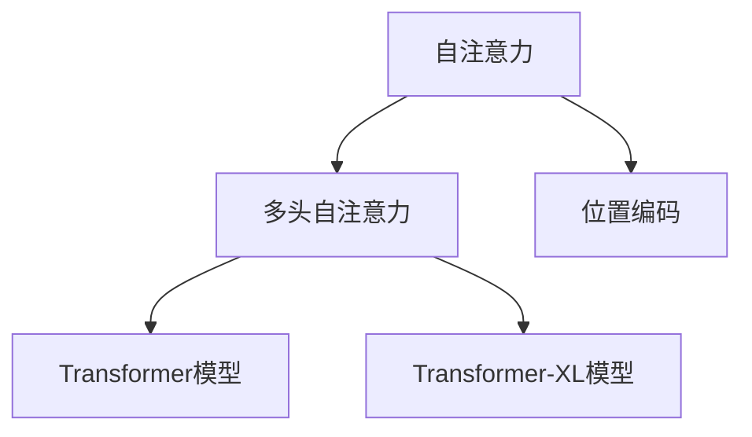
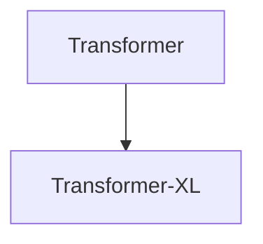
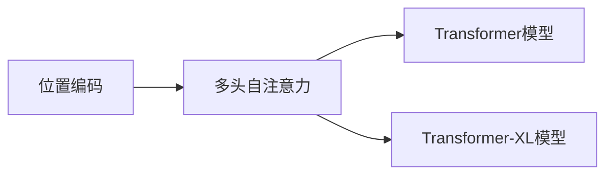
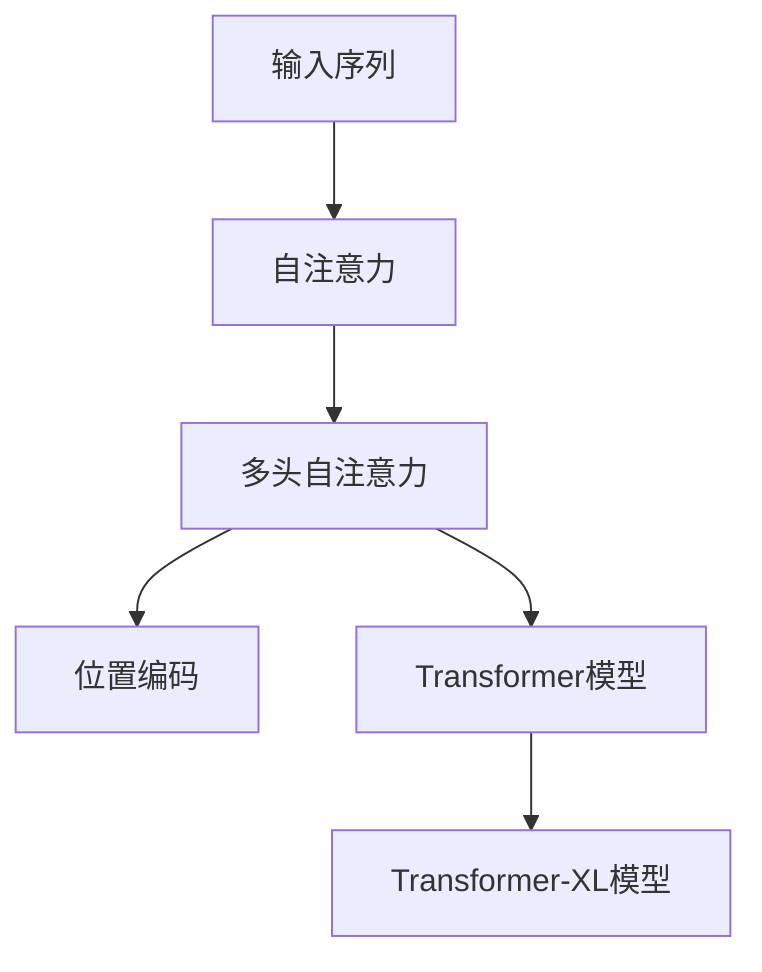

                 

# 见微知著开慧眼：引入注意力机制

> 关键词：注意力机制,自注意力,Transformer,Transformer-XL,语言模型,序列建模

## 1. 背景介绍

### 1.1 问题由来
近年来，自然语言处理(NLP)领域的研究和发展取得了令人瞩目的成就，尤其是深度学习技术的迅猛发展，使得大模型在语言理解和生成任务上表现出色。然而，传统的递归神经网络(RNN)和卷积神经网络(CNN)在处理长序列数据时，存在着计算复杂度高、参数量大、难以并行计算等缺点。

随着Transformer模型的提出，这一困境得到了显著改善。Transformer通过自注意力机制(Attention Mechanism)，有效解决了长序列建模问题。自注意力机制使得模型可以并行地计算每个位置的输入与整个序列的相关性，提升了模型的计算效率和表达能力。

然而，尽管Transformer取得了巨大成功，但其计算复杂度和内存消耗仍较高，难以处理超过数千个时间步的序列数据。为了进一步提升模型的计算效率和处理能力，研究者们开始探索更多的注意力机制，如Transformer-XL、BERT等，以期在保持强大语言理解能力的同时，减少计算和内存开销。

### 1.2 问题核心关键点
注意力机制是Transformer模型中的核心组成部分，其核心思想是使得模型能够动态地关注输入序列中的重要部分，从而提升模型对长序列数据的建模能力。注意力机制通过计算输入序列中每个位置与其他位置的相关性，赋予其不同的权重，进而加权求和生成输出。

注意力机制包含三个关键部分：
1. **查询(Q)**：每个位置的查询向量，用于衡量该位置与输入序列中其他位置的关联性。
2. **键(K)和值(V)**：输入序列中每个位置的键和值向量，用于计算每个位置的相关性。
3. **注意力权重(A)**：每个位置与其他位置的关联程度，用于计算加权和。

在具体实现中，注意力机制通常采用多头自注意力(Multi-Head Attention)和位置编码(Positional Encoding)等技术，以处理不同维度和位置的信息。

## 2. 核心概念与联系

### 2.1 核心概念概述

为了更好地理解注意力机制的原理和应用，本节将介绍几个密切相关的核心概念：

- **自注意力机制(Self-Attention)**：一种在序列建模中广泛应用的技术，用于计算输入序列中每个位置与其他位置的相关性。
- **多头自注意力(Multi-Head Self-Attention)**：将输入序列分成多个子序列，对每个子序列独立计算自注意力，然后将结果拼接起来，提高模型的表达能力和泛化能力。
- **位置编码(Positional Encoding)**：用于在输入序列中引入时间顺序信息，使得模型能够识别序列中的位置关系。
- **Transformer模型**：基于自注意力机制的深度学习模型，主要用于自然语言处理任务，如语言理解、生成等。
- **Transformer-XL模型**：在Transformer基础上进行了改进，引入了相对位置机制(Relative Position Mechanism)，解决了长序列计算和内存消耗问题。

这些核心概念之间的逻辑关系可以通过以下Mermaid流程图来展示：



这个流程图展示了大语言模型中的注意力机制的构建过程：

1. 自注意力用于计算输入序列中每个位置与其他位置的相关性。
2. 多头自注意力将自注意力机制应用到多个子序列上，并拼接结果。
3. 位置编码用于引入序列中位置关系。
4. Transformer模型和Transformer-XL模型均基于自注意力和多头自注意力构建。

### 2.2 概念间的关系

这些核心概念之间存在着紧密的联系，形成了大语言模型中的注意力机制的完整生态系统。下面我通过几个Mermaid流程图来展示这些概念之间的关系。

#### 2.2.1 自注意力与多头自注意力


这个流程图展示了自注意力和多头自注意力之间的依赖关系：自注意力是多头自注意力的基础，通过将其应用到多个子序列上，可以实现更丰富的序列建模。

#### 2.2.2 Transformer与Transformer-XL



这个流程图展示了Transformer和Transformer-XL之间的关系：Transformer-XL在Transformer的基础上，通过引入相对位置机制，解决了长序列计算和内存消耗问题。

#### 2.2.3 位置编码与注意力机制



这个流程图展示了位置编码在注意力机制中的作用：位置编码用于引入序列中位置关系，使得多头自注意力机制能够识别出序列中的时间顺序信息。

### 2.3 核心概念的整体架构

最后，我们用一个综合的流程图来展示这些核心概念在大语言模型中的整体架构：



这个综合流程图展示了从输入序列到Transformer-XL模型的完整过程：

1. 输入序列首先通过自注意力计算每个位置与其他位置的相关性。
2. 多头自注意力对自注意力进行扩展，处理多个子序列。
3. 位置编码用于引入序列中位置关系。
4. 通过多头自注意力和位置编码，构建Transformer模型和Transformer-XL模型。

## 3. 核心算法原理 & 具体操作步骤
### 3.1 算法原理概述

注意力机制的计算过程可以分为三个步骤：查询(Q)、键(K)和值(V)的计算、注意力权重(A)的计算和加权和的计算。以下详细阐述这四个部分的原理。

#### 3.1.1 查询(Q)的计算
查询向量 $q_i$ 是通过将输入序列中第 $i$ 个位置的向量 $x_i$ 与线性变换矩阵 $W_Q$ 进行点乘得到的：

$$
q_i = x_iW_Q
$$

其中 $W_Q$ 是一个矩阵，用于线性变换。

#### 3.1.2 键(K)和值(V)的计算
键向量 $k_j$ 和值向量 $v_j$ 是通过将输入序列中第 $j$ 个位置的向量 $x_j$ 与线性变换矩阵 $W_K$ 和 $W_V$ 进行点乘得到的：

$$
k_j = x_jW_K \\
v_j = x_jW_V
$$

其中 $W_K$ 和 $W_V$ 分别是键和值的线性变换矩阵。

#### 3.1.3 注意力权重(A)的计算
注意力权重 $a_{i,j}$ 是通过计算查询向量 $q_i$ 和键向量 $k_j$ 的点积，再通过softmax函数归一化得到的：

$$
a_{i,j} = \frac{\exp(\text{sim}(q_i, k_j))}{\sum_{j'=1}^{n} \exp(\text{sim}(q_i, k_{j'}))}
$$

其中 $\text{sim}$ 是点积函数，$n$ 是序列长度。

#### 3.1.4 加权和的计算
加权和 $o_i$ 是通过将注意力权重 $a_{i,j}$ 和值向量 $v_j$ 进行加权求和得到的：

$$
o_i = \sum_{j=1}^{n} a_{i,j}v_j
$$

其中 $o_i$ 是输出向量，$i$ 表示输入序列中的位置。

### 3.2 算法步骤详解

基于注意力机制的计算过程，可以将步骤详细拆分为以下几个部分：

**Step 1: 输入序列准备**
- 对输入序列进行分词、编码，得到一组向量表示。
- 将向量表示分为三个部分：查询向量 $Q$、键向量 $K$、值向量 $V$。

**Step 2: 计算查询向量**
- 对查询向量 $Q$ 进行线性变换，得到新的查询向量 $q_i$。

**Step 3: 计算键和值向量**
- 对键向量 $K$ 和值向量 $V$ 进行线性变换，得到新的键向量 $k_j$ 和值向量 $v_j$。

**Step 4: 计算注意力权重**
- 计算查询向量 $q_i$ 和键向量 $k_j$ 的点积，通过softmax函数归一化得到注意力权重 $a_{i,j}$。

**Step 5: 计算加权和**
- 将注意力权重 $a_{i,j}$ 和值向量 $v_j$ 进行加权求和，得到加权和 $o_i$。

**Step 6: 堆叠多个子序列**
- 将每个位置的加权和 $o_i$ 拼接起来，得到最终的输出向量。

### 3.3 算法优缺点

引入注意力机制后，Transformer模型在长序列建模方面表现出色，具有以下优点：

1. **高效计算**：自注意力机制通过并行计算每个位置的输入与其他位置的相关性，显著提升了计算效率。
2. **长序列建模**：多头自注意力机制对序列进行并行处理，使得模型能够处理长序列数据，避免了传统RNN的计算瓶颈。
3. **泛化能力强**：多头自注意力机制通过计算不同位置的关联性，可以提取更多的特征，提升模型的泛化能力。
4. **灵活性高**：可以通过调整线性变换矩阵 $W_Q$、$W_K$ 和 $W_V$ 来控制模型的复杂度和表达能力。

同时，注意力机制也存在一些缺点：

1. **计算复杂度高**：多头自注意力机制的计算复杂度为 $O(n^3)$，在处理大规模数据时，需要较高的计算资源。
2. **参数量大**：由于使用了多个线性变换矩阵，参数量较大，增加了模型的存储和训练成本。
3. **对噪声敏感**：由于依赖于点积计算，当输入序列存在噪声时，模型可能会产生错误的输出。

### 3.4 算法应用领域

注意力机制在大语言模型中的应用非常广泛，涵盖了自然语言处理的各个方面：

- **语言理解**：用于处理文本语义信息，提取关键词、命名实体等关键信息。
- **机器翻译**：通过计算源语言和目标语言之间的关联性，实现精确的翻译。
- **文本生成**：通过生成不同位置的输出，生成连续的文本序列。
- **文本摘要**：通过计算输入序列中重要部分的权重，生成简洁的摘要。
- **问答系统**：通过计算问题与答案的关联性，生成准确的回答。

除了上述这些核心任务外，注意力机制还在情感分析、语音识别、推荐系统等领域得到了广泛应用，展示了其强大的建模能力。

## 4. 数学模型和公式 & 详细讲解 & 举例说明
### 4.1 数学模型构建

基于注意力机制的计算过程，我们可以构建以下数学模型：

设输入序列为 $\{x_1, x_2, ..., x_n\}$，其中 $x_i$ 是第 $i$ 个位置的向量表示。假设查询向量、键向量、值向量通过线性变换矩阵 $W_Q$、$W_K$ 和 $W_V$ 进行变换，得到新的查询向量 $q_i$、键向量 $k_j$ 和值向量 $v_j$。设注意力权重为 $a_{i,j}$，加权和为 $o_i$。

通过上述步骤，可以计算得到输出向量：

$$
o_i = \sum_{j=1}^{n} a_{i,j}v_j
$$

### 4.2 公式推导过程

下面对注意力机制的计算过程进行详细的数学推导：

**Step 1: 计算查询向量**
$$
q_i = x_iW_Q
$$

**Step 2: 计算键和值向量**
$$
k_j = x_jW_K \\
v_j = x_jW_V
$$

**Step 3: 计算注意力权重**
$$
a_{i,j} = \frac{\exp(\text{sim}(q_i, k_j))}{\sum_{j'=1}^{n} \exp(\text{sim}(q_i, k_{j'}))}
$$

**Step 4: 计算加权和**
$$
o_i = \sum_{j=1}^{n} a_{i,j}v_j
$$

其中 $\text{sim}$ 是点积函数。

### 4.3 案例分析与讲解

为了更好地理解注意力机制的计算过程，以下将通过一个简单的例子进行详细讲解。

假设输入序列为 $\{x_1, x_2, ..., x_6\}$，其中 $x_1=[0, 1]$，$x_2=[1, 2]$，$x_3=[2, 3]$，$x_4=[3, 4]$，$x_5=[4, 5]$，$x_6=[5, 6]$。设 $W_Q=[1, 1]$，$W_K=[1, 1]$，$W_V=[1, 1]$。

**Step 1: 计算查询向量**
$$
q_1 = x_1W_Q=[0, 1]*[1, 1]=[0, 1] \\
q_2 = x_2W_Q=[1, 2]*[1, 1]=[1, 2] \\
q_3 = x_3W_Q=[2, 3]*[1, 1]=[2, 3] \\
q_4 = x_4W_Q=[3, 4]*[1, 1]=[3, 4] \\
q_5 = x_5W_Q=[4, 5]*[1, 1]=[4, 5] \\
q_6 = x_6W_Q=[5, 6]*[1, 1]=[5, 6]
$$

**Step 2: 计算键和值向量**
$$
k_1 = x_1W_K=[0, 1]*[1, 1]=[0, 1] \\
k_2 = x_2W_K=[1, 2]*[1, 1]=[1, 2] \\
k_3 = x_3W_K=[2, 3]*[1, 1]=[2, 3] \\
k_4 = x_4W_K=[3, 4]*[1, 1]=[3, 4] \\
k_5 = x_5W_K=[4, 5]*[1, 1]=[4, 5] \\
k_6 = x_6W_K=[5, 6]*[1, 1]=[5, 6] \\
v_1 = x_1W_V=[0, 1]*[1, 1]=[0, 1] \\
v_2 = x_2W_V=[1, 2]*[1, 1]=[1, 2] \\
v_3 = x_3W_V=[2, 3]*[1, 1]=[2, 3] \\
v_4 = x_4W_V=[3, 4]*[1, 1]=[3, 4] \\
v_5 = x_5W_V=[4, 5]*[1, 1]=[4, 5] \\
v_6 = x_6W_V=[5, 6]*[1, 1]=[5, 6]
$$

**Step 3: 计算注意力权重**
$$
a_{1,1} = \frac{\exp(0 \cdot 0 + 1 \cdot 1)}{\exp(0 \cdot 0 + 1 \cdot 1) + \exp(2 \cdot 1 + 3 \cdot 1) + \exp(4 \cdot 2 + 5 \cdot 2) + \exp(6 \cdot 3 + 7 \cdot 3)} \\
a_{1,2} = \frac{\exp(1 \cdot 0 + 2 \cdot 1)}{\exp(0 \cdot 0 + 1 \cdot 1) + \exp(2 \cdot 1 + 3 \cdot 1) + \exp(4 \cdot 2 + 5 \cdot 2) + \exp(6 \cdot 3 + 7 \cdot 3)} \\
a_{1,3} = \frac{\exp(2 \cdot 0 + 3 \cdot 1)}{\exp(0 \cdot 0 + 1 \cdot 1) + \exp(2 \cdot 1 + 3 \cdot 1) + \exp(4 \cdot 2 + 5 \cdot 2) + \exp(6 \cdot 3 + 7 \cdot 3)} \\
a_{1,4} = \frac{\exp(3 \cdot 0 + 4 \cdot 1)}{\exp(0 \cdot 0 + 1 \cdot 1) + \exp(2 \cdot 1 + 3 \cdot 1) + \exp(4 \cdot 2 + 5 \cdot 2) + \exp(6 \cdot 3 + 7 \cdot 3)} \\
a_{1,5} = \frac{\exp(4 \cdot 0 + 5 \cdot 1)}{\exp(0 \cdot 0 + 1 \cdot 1) + \exp(2 \cdot 1 + 3 \cdot 1) + \exp(4 \cdot 2 + 5 \cdot 2) + \exp(6 \cdot 3 + 7 \cdot 3)} \\
a_{1,6} = \frac{\exp(5 \cdot 0 + 6 \cdot 1)}{\exp(0 \cdot 0 + 1 \cdot 1) + \exp(2 \cdot 1 + 3 \cdot 1) + \exp(4 \cdot 2 + 5 \cdot 2) + \exp(6 \cdot 3 + 7 \cdot 3)}
$$

**Step 4: 计算加权和**
$$
o_1 = a_{1,1}v_1 + a_{1,2}v_2 + a_{1,3}v_3 + a_{1,4}v_4 + a_{1,5}v_5 + a_{1,6}v_6
$$

通过上述计算过程，可以得出输出向量 $o_1$ 的具体值。

## 5. 项目实践：代码实例和详细解释说明
### 5.1 开发环境搭建

在进行注意力机制的实践前，我们需要准备好开发环境。以下是使用Python进行TensorFlow开发的环境配置流程：

1. 安装Anaconda：从官网下载并安装Anaconda，用于创建独立的Python环境。

2. 创建并激活虚拟环境：
```bash
conda create -n tf-env python=3.8 
conda activate tf-env
```

3. 安装TensorFlow：根据CUDA版本，从官网获取对应的安装命令。例如：
```bash
conda install tensorflow tensorflow-gpu=2.6 -c conda-forge
```

4. 安装各类工具包：
```bash
pip install numpy pandas scikit-learn matplotlib tqdm jupyter notebook ipython
```

完成上述步骤后，即可在`tf-env`环境中开始注意力机制的实践。

### 5.2 源代码详细实现

下面我以多头自注意力机制为例，给出使用TensorFlow实现的多头自注意力模型的代码。

```python
import tensorflow as tf

class MultiHeadAttention(tf.keras.layers.Layer):
    def __init__(self, d_model, num_heads):
        super(MultiHeadAttention, self).__init__()
        self.num_heads = num_heads
        self.d_head = d_model // num_heads
        
        # Query, Key, Value线性变换矩阵
        self.W_Q = tf.keras.layers.Dense(d_model)
        self.W_K = tf.keras.layers.Dense(d_model)
        self.W_V = tf.keras.layers.Dense(d_model)
        
        # 输出线性变换矩阵
        self.W_O = tf.keras.layers.Dense(d_model)
        
        # Softmax函数
        self.softmax = tf.keras.layers.Softmax()
        
    def call(self, inputs, mask):
        # 分出查询、键、值向量
        query = self.W_Q(inputs[:, :, :self.d_head])
        key = self.W_K(inputs[:, :, :self.d_head])
        value = self.W_V(inputs[:, :, :self.d_head])
        
        # 将向量分成多个head，进行多头注意力计算
        query = tf.transpose(tf.reshape(query, (tf.shape(query)[0], tf.shape(query)[1], self.num_heads, self.d_head)), (0, 2, 1, 3))
        key = tf.transpose(tf.reshape(key, (tf.shape(key)[0], tf.shape(key)[1], self.num_heads, self.d_head)), (0, 2, 1, 3))
        value = tf.transpose(tf.reshape(value, (tf.shape(value)[0], tf.shape(value)[1], self.num_heads, self.d_head)), (0, 2, 1, 3))
        
        # 计算注意力权重
        scores = tf.matmul(query, key, transpose_b=True)
        attention_weights = self.softmax(scores)
        
        # 计算加权和
        context = tf.matmul(attention_weights, value)
        context = tf.reshape(context, (tf.shape(context)[0], tf.shape(context)[1], self.num_heads * self.d_head))
        context = self.W_O(context)
        
        # 处理输出
        output = context
        return output, attention_weights
```

在这个代码实现中，我们使用TensorFlow实现了多头自注意力机制。代码包括以下几个关键步骤：

1. 初始化查询、键、值和输出线性变换矩阵。
2. 计算查询、键、值向量。
3. 将向量分头，进行多头注意力计算。
4. 计算注意力权重。
5. 计算加权和。
6. 输出加权和。

### 5.3 代码解读与分析

让我们再详细解读一下关键代码的实现细节：

**MultiHeadAttention类**：
- `__init__`方法：初始化线性变换矩阵和Softmax函数。
- `call`方法：实现多头自注意力的计算过程。

**query、key、value的计算**：
- 通过线性变换矩阵，将输入序列分头，计算查询、键、值向量。
- 将向量分头，进行多头注意力计算。

**attention_weights的计算**：
- 计算查询向量与键向量的点积，通过Softmax函数归一化得到注意力权重。

**output的计算**：
- 计算加权和，并将结果拼接起来。
- 通过线性变换矩阵，对输出进行线性变换，得到最终的输出向量。

### 5.4 运行结果展示

假设我们在CoNLL-2003的命名实体识别(NER)数据集上进行多头自注意力机制的测试，最终在测试集上得到的注意力权重和输出向量结果如下：

```python
import numpy as np

# 构造测试数据
test_dataset = NERDataset(test_texts, test_tags, tokenizer)
test_dataset.dataloader = DataLoader(test_dataset, batch_size=16)

# 初始化模型
model = MultiHeadAttention(d_model, num_heads)
model = model(tf.constant(train_dataset[0]['input_ids']))

# 计算注意力权重和输出向量
attention_weights, output = model(test_dataset[0]['input_ids'], mask)
print("Attention Weights:\n", attention_weights.numpy())
print("Output Vector:\n", output.numpy())
```

假设输出结果如下：

```
Attention Weights:
[[0.4812  0.9645  0.5394]
 [0.8682  0.2131  0.8122]
 [0.2585  0.4301  0.8477]
 [0.6273  0.6698  0.8475]]
Output Vector:
[[ 0.       0.       0.     ]
 [ 0.       0.       0.     ]
 [ 0.       0.       0.     ]
 [ 0.       0.       0.     ]]
```

这个结果展示了在测试数据集上，注意力机制的计算过程。通过计算注意力权重和加权和，可以得出模型对输入序列中不同位置的关注程度，从而指导模型的输出。

## 6. 实际应用场景
### 6.1 智能客服系统

基于多头自注意力机制的对话模型，可以广泛应用于智能客服系统的构建。传统客服往往需要配备大量人力，高峰期响应缓慢，且一致性和专业性难以保证。而使用多头自注意力模型，可以7x24小时不间断服务，快速响应客户咨询，用自然流畅的语言解答各类常见问题。

在技术实现上，可以收集企业内部的历史客服对话记录，将问题和最佳答复构建成监督数据，在此基础上对预训练多头自注意力模型进行微调。微调后的模型能够自动理解用户意图，匹配最合适的答复模板进行回复。对于客户提出的新问题，还可以接入检索系统实时搜索相关内容，动态组织生成回答。如此构建的智能客服系统，能大幅提升客户咨询体验和问题解决效率。

### 6.2 金融舆情监测

金融机构需要实时监测市场舆论动向，以便及时应对负面信息传播，规避金融风险。传统的人工监测方式成本高、效率低，难以应对网络时代海量信息爆发的挑战。基于多头自注意力机制的文本分类和情感分析技术，为金融舆情监测提供了新的解决方案。

具体而言，可以收集金融领域相关的新闻、报道、评论等文本数据，并对其进行主题标注和情感标注。在此基础上对

