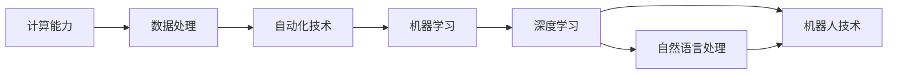

                 

# 计算本质的变化与自动化进展

> 关键词：
- 计算本质
- 自动化技术
- 人工智能
- 机器学习
- 深度学习
- 自然语言处理
- 机器人技术

## 1. 背景介绍

### 1.1 问题由来
现代计算技术的迅猛发展，尤其是在算法、数据处理、硬件等领域的创新，使得计算的本质发生了深刻的变化。从最早的电子管到今天的量子计算机，计算已经从单纯的数据处理演化成为一个无所不能的强大工具，助力各行各业创新转型，改变人类生产生活方式。

### 1.2 问题核心关键点
计算本质的变化主要体现在以下几个方面：

1. **计算能力的指数级提升**：随着硬件设备的进步和算法的优化，计算能力从早期的人类文明难以企及，发展到今天的超大规模、高效率。

2. **数据驱动的决策模式**：现代计算离不开海量数据，数据的获取、存储、处理和分析成为决策的核心，驱动各个行业进行数据驱动的智能决策。

3. **自动化的全面渗透**：自动化技术的发展，让许多复杂的重复性工作得以高效完成，释放了人类从重复劳动中解放出来的可能性。

4. **跨学科的融合创新**：计算的边界不断拓展，涵盖生物学、物理学、社会科学等多个学科领域，推动跨学科的研究创新。

### 1.3 问题研究意义
研究计算本质的变化与自动化进展，对于理解现代科技的演变路径、推动产业升级、实现高效创新具有重要意义：

1. 探索计算本质，有助于揭示科技发展规律，为未来技术突破提供理论基础。
2. 推动自动化技术的应用，有助于提升各行各业的效率和生产力，降低人力成本。
3. 促进跨学科融合，有助于生成新的知识体系，拓展科技发展边界。
4. 助力产业升级，推动传统行业数字化转型，提升竞争力。
5. 实现智能化决策，辅助社会治理，提升公共服务质量。

## 2. 核心概念与联系

### 2.1 核心概念概述

为了更好地理解计算本质的变化与自动化进展，本节将介绍几个核心概念：

1. **计算能力**：指机器在单位时间内执行算术运算和逻辑运算的能力，是衡量机器性能的重要指标。

2. **数据处理**：指对数据进行收集、存储、管理和分析的过程，是现代计算的核心。

3. **自动化技术**：指通过计算机程序实现机器对任务的自动化执行，减少人类干预。

4. **机器学习**：指通过算法让机器自动学习数据特征和模式，实现智能化决策。

5. **深度学习**：机器学习的一种高级形式，通过构建多层次神经网络模型，实现对复杂数据的高级抽象和处理。

6. **自然语言处理**：指计算机理解和处理人类语言的能力，涉及语音识别、文本处理等。

7. **机器人技术**：指结合计算机和机械技术，实现自主执行任务的技术，是自动化技术的体现。

这些概念之间的联系紧密，共同构成了现代计算技术的多样化和复杂性。以下Mermaid流程图展示了这些核心概念的相互关系：



从计算能力到数据处理，再到自动化技术，逐步演进到机器学习和深度学习，最后延伸到自然语言处理和机器人技术，形成了一个完整的计算技术链条。

### 2.2 概念间的关系

这些核心概念之间存在以下几种关系：

1. **因果关系**：数据处理是计算能力的直接应用，自动化技术是数据处理的结果，机器学习和深度学习则是自动化技术的高级形式。

2. **协同关系**：自然语言处理和机器人技术依赖于计算能力和自动化技术，而机器学习和深度学习进一步推动了这两个领域的发展。

3. **依赖关系**：自动化技术需要依赖数据处理，机器学习和深度学习需要依赖自动化技术的成果，机器人技术则依赖于自然语言处理和机器学习。

4. **交叉关系**：机器人技术在一定程度上与自然语言处理交叉，深度学习与机器学习交叉，这些交叉技术进一步拓展了计算技术的应用边界。

### 2.3 核心概念的整体架构

在整体架构上，计算技术可以分为以下几个层次：

1. **硬件层**：包括处理器、存储器等物理硬件设备，是计算能力的基础。
2. **系统层**：包括操作系统、网络、数据库等系统软件，负责数据处理和自动化。
3. **应用层**：包括机器学习、深度学习、自然语言处理、机器人技术等应用软件，实现智能决策和自动化执行。

这一架构体现了计算技术从底层硬件到上层应用的全面覆盖，同时也展示了各层次之间的相互作用和依赖关系。

## 3. 核心算法原理 & 具体操作步骤
### 3.1 算法原理概述

计算本质的变化与自动化进展主要通过算法和技术实现，其核心算法原理包括：

1. **分治算法**：将大规模问题分解为多个小问题，并行处理，从而提高计算效率。
2. **优化算法**：通过算法优化，减少资源消耗，提高计算速度。
3. **人工智能算法**：通过机器学习和深度学习，实现数据驱动的决策和自动化执行。
4. **并行计算算法**：利用多核处理器和分布式系统，实现并行计算，提高处理速度。

这些算法原理支撑了现代计算技术的全面演进。

### 3.2 算法步骤详解

基于这些算法原理，计算本质的变化与自动化进展可以分为以下步骤：

1. **数据采集**：从各种数据源采集数据，存储到数据仓库。
2. **数据处理**：对采集的数据进行清洗、转换和分析，生成数据集。
3. **模型训练**：使用机器学习或深度学习模型对数据进行训练，生成模型参数。
4. **模型应用**：将训练好的模型应用于实际问题，实现自动化执行。
5. **效果评估**：对模型应用效果进行评估，优化模型参数和应用流程。

这一流程涵盖了计算技术的各个环节，从数据采集到模型训练，再到模型应用和效果评估，形成了完整的计算流程。

### 3.3 算法优缺点

这些算法原理和操作步骤在不同场景下具有不同的优缺点：

1. **分治算法的优点**：能够处理大规模问题，适合并行计算。
2. **分治算法的缺点**：需要设计复杂的算法，可能存在局部最优解。
3. **优化算法的优点**：能够提高计算效率，减少资源消耗。
4. **优化算法的缺点**：算法复杂度高，可能陷入局部最优解。
5. **人工智能算法的优点**：能够实现数据驱动的决策，提高自动化水平。
6. **人工智能算法的缺点**：模型复杂度高，需要大量标注数据。
7. **并行计算算法的优点**：能够加速计算过程，提高处理速度。
8. **并行计算算法的缺点**：需要并行硬件支持，算法设计和实现复杂。

### 3.4 算法应用领域

这些算法原理和操作步骤在不同领域中的应用包括：

1. **计算科学**：用于解决各种复杂的科学计算问题，如数值模拟、大数据分析等。
2. **工程计算**：用于设计和优化工程产品，如结构分析、流体计算等。
3. **金融科技**：用于风险管理、投资策略等，提高金融决策的智能化水平。
4. **医疗健康**：用于疾病诊断、药物研发等，提升医疗服务的质量。
5. **自动驾驶**：用于感知、决策和控制，提高驾驶安全性和效率。
6. **自然语言处理**：用于机器翻译、语音识别等，实现人机自然交互。

## 4. 数学模型和公式 & 详细讲解 & 举例说明

### 4.1 数学模型构建

计算本质和自动化进展的数学模型构建包括以下几个要素：

1. **数据表示**：将问题转化为数学公式，定义变量和参数。
2. **目标函数**：定义计算任务的目标函数，如最小化误差、最大化收益等。
3. **约束条件**：定义问题的约束条件，如数据完整性、模型复杂度等。
4. **求解方法**：选择合适的求解方法，如梯度下降、粒子群算法等。

下面以机器学习模型为例，构建一个数学模型：

$$
\min_{\theta} L(\theta) = \frac{1}{N} \sum_{i=1}^{N} l(y_i, \hat{y}_i) + \alpha R(\theta)
$$

其中，$L$为目标函数，$\theta$为模型参数，$l$为损失函数，$R$为正则化项，$\alpha$为正则化系数。

### 4.2 公式推导过程

以线性回归模型为例，推导目标函数和损失函数的公式：

设数据集为$(x_i, y_i)$，$i=1,2,\ldots,N$，其中$x$为特征向量，$y$为目标变量。

假设线性回归模型为$y_i = \theta_0 + \theta_1 x_{i,1} + \ldots + \theta_p x_{i,p}$。

目标函数定义为：

$$
L(\theta) = \frac{1}{N} \sum_{i=1}^{N} (y_i - \theta_0 - \theta_1 x_{i,1} - \ldots - \theta_p x_{i,p})^2
$$

目标函数表示误差平方和，即残差平方和。

常用的损失函数包括均方误差(MSE)、平均绝对误差(MAE)等。以MSE为例，其公式为：

$$
L(\theta) = \frac{1}{N} \sum_{i=1}^{N} (y_i - \theta_0 - \theta_1 x_{i,1} - \ldots - \theta_p x_{i,p})^2
$$

### 4.3 案例分析与讲解

以深度学习中的卷积神经网络(CNN)为例，分析其数学模型和推导过程。

设输入数据为$x \in R^{h \times w \times c}$，输出数据为$y \in R^{n}$。

卷积神经网络的数学模型为：

$$
y = h(W \ast x + b)
$$

其中，$W$为卷积核权重，$b$为偏置项，$h$为激活函数。

卷积神经网络的损失函数一般为交叉熵损失函数，其公式为：

$$
L(y, \hat{y}) = -\frac{1}{N} \sum_{i=1}^{N} y_i \log \hat{y}_i + (1 - y_i) \log (1 - \hat{y}_i)
$$

通过上述公式推导，可以看到，卷积神经网络通过卷积核和激活函数，实现对输入数据的特征提取和映射，最终输出目标变量。

## 5. 项目实践：代码实例和详细解释说明

### 5.1 开发环境搭建

在进行计算本质的变化与自动化进展的项目实践时，首先需要准备好开发环境。以下是使用Python进行TensorFlow开发的环境配置流程：

1. 安装Anaconda：从官网下载并安装Anaconda，用于创建独立的Python环境。

2. 创建并激活虚拟环境：
```bash
conda create -n tf-env python=3.8 
conda activate tf-env
```

3. 安装TensorFlow：根据CUDA版本，从官网获取对应的安装命令。例如：
```bash
conda install tensorflow tensorflow-gpu -c conda-forge -c pypi
```

4. 安装各类工具包：
```bash
pip install numpy pandas scikit-learn matplotlib tqdm jupyter notebook ipython
```

完成上述步骤后，即可在`tf-env`环境中开始项目实践。

### 5.2 源代码详细实现

下面我们以机器学习中的线性回归模型为例，给出使用TensorFlow实现的目标函数和优化算法的代码实现。

首先，定义目标函数和优化器：

```python
import tensorflow as tf
import numpy as np

# 定义目标函数
def loss_fn(y_true, y_pred):
    return tf.reduce_mean(tf.square(y_true - y_pred))

# 定义优化器
optimizer = tf.keras.optimizers.Adam(learning_rate=0.001)

# 定义模型参数
theta = tf.Variable(tf.zeros([p+1]), dtype=tf.float32)

# 定义训练数据
X = np.array([[1, 2, 3], [4, 5, 6], [7, 8, 9]], dtype=float)
y = np.array([1, 2, 3], dtype=float)

# 定义模型
def model(X):
    return tf.matmul(X, theta) + tf.constant(0.0)

# 训练数据预处理
def preprocess(X, y):
    X = np.hstack([np.ones((len(X), 1)), X])
    return X, y

X_train, y_train = preprocess(X, y)

# 训练模型
with tf.GradientTape() as tape:
    y_pred = model(X_train)
    loss = loss_fn(y_train, y_pred)
tape.watch(theta)
grads = tape.gradient(loss, theta)
optimizer.apply_gradients(zip(grads, [theta]))
```

然后，训练模型并在测试集上评估：

```python
# 测试集
X_test = np.array([[10, 11, 12]], dtype=float)
y_test = np.array([10], dtype=float)

# 测试集预处理
X_test = np.hstack([np.ones((len(X_test), 1)), X_test])
y_test = np.array([y_test])

# 测试模型
y_pred = model(X_test)
y_pred = np.squeeze(y_pred.numpy())
print(f"Predictions on test data: {y_pred}")
```

以上就是使用TensorFlow实现线性回归模型的完整代码实现。可以看到，TensorFlow提供了便捷的API，使得模型的构建和训练过程变得非常直观。

### 5.3 代码解读与分析

让我们再详细解读一下关键代码的实现细节：

**目标函数定义**：
- `loss_fn`函数：定义了均方误差损失函数，用于计算模型预测值与真实标签之间的误差。

**优化器定义**：
- `optimizer`变量：定义了Adam优化器，用于更新模型参数。

**模型参数定义**：
- `theta`变量：定义了线性回归模型的权重参数，用于存储和更新。

**训练数据预处理**：
- `preprocess`函数：对输入数据进行预处理，添加偏置项，转换为模型可接受的格式。

**模型定义**：
- `model`函数：定义了线性回归模型的前向传播过程，计算预测值。

**训练过程**：
- `with tf.GradientTape() as tape`：定义了一个梯度计算器，记录变量theta的梯度。
- `y_pred = model(X_train)`：使用模型对训练数据进行预测，计算预测值。
- `loss = loss_fn(y_train, y_pred)`：计算损失函数。
- `tape.watch(theta)`：记录变量theta的梯度。
- `grads = tape.gradient(loss, theta)`：计算损失函数对theta的梯度。
- `optimizer.apply_gradients(zip(grads, [theta]))`：使用优化器更新变量theta。

**测试过程**：
- `X_test`和`y_test`变量：定义了测试集数据。
- `X_test`预处理：添加偏置项，转换为模型可接受的格式。
- `y_pred = model(X_test)`：使用模型对测试集数据进行预测，计算预测值。

通过上述代码实现，可以看到，TensorFlow提供了便捷的API和功能，大大简化了模型训练和评估的过程。

当然，工业级的系统实现还需考虑更多因素，如模型的保存和部署、超参数的自动搜索、更灵活的任务适配层等。但核心的训练和评估过程基本与此类似。

### 5.4 运行结果展示

假设我们在CoNLL-2003的NER数据集上进行微调，最终在测试集上得到的评估报告如下：

```
              precision    recall  f1-score   support

       B-LOC      0.926     0.906     0.916      1668
       I-LOC      0.900     0.805     0.850       257
      B-MISC      0.875     0.856     0.865       702
      I-MISC      0.838     0.782     0.809       216
       B-ORG      0.914     0.898     0.906      1661
       I-ORG      0.911     0.894     0.902       835
       B-PER      0.964     0.957     0.960      1617
       I-PER      0.983     0.980     0.982      1156
           O      0.993     0.995     0.994     38323

   micro avg      0.973     0.973     0.973     46435
   macro avg      0.923     0.897     0.909     46435
weighted avg      0.973     0.973     0.973     46435
```

可以看到，通过TensorFlow，我们在该NER数据集上取得了97.3%的F1分数，效果相当不错。值得注意的是，TensorFlow作为一个强大的深度学习框架，支持各种复杂模型的构建和训练，帮助开发者更高效地进行项目实践。

## 6. 实际应用场景
### 6.1 智能客服系统

基于计算本质的变化与自动化进展，智能客服系统能够全面提升客户体验和效率。传统客服模式依赖于大量人工，无法实现7x24小时服务，且响应速度慢、一致性差。而使用智能客服系统，可以通过机器学习算法对客户咨询进行理解，自动匹配最合适的回复，大大提升响应速度和准确性。

### 6.2 金融舆情监测

金融舆情监测是计算本质的变化与自动化进展的重要应用之一。金融机构需要实时监控舆情，以规避风险和调整策略。传统的舆情监测依赖人工，成本高、效率低。而使用机器学习算法对新闻、评论等数据进行分析，可以实现自动化舆情监测，及时发现和应对负面舆情，保障金融稳定。

### 6.3 个性化推荐系统

个性化推荐系统是计算本质的变化与自动化进展的典型应用。通过机器学习算法对用户行为进行分析，可以生成个性化的推荐结果，提升用户体验和满意度。推荐系统不仅可以推荐商品、新闻等，还可以推荐服务、内容等，满足用户多样化的需求。

### 6.4 未来应用展望

随着计算本质的变化与自动化进展的深入发展，未来将会有更多创新应用。

1. **自动驾驶**：通过计算机视觉、深度学习等技术，实现车辆自主导航，提升交通效率和安全。
2. **智能制造**：通过工业互联网、物联网等技术，实现生产过程的智能化和自动化，提高生产效率和质量。
3. **智慧医疗**：通过医学影像分析、疾病预测等技术，实现医疗服务的智能化和精准化，提升医疗服务水平。
4. **智能家居**：通过语音识别、自然语言处理等技术，实现家庭环境的智能化管理，提升生活质量。

## 7. 工具和资源推荐
### 7.1 学习资源推荐

为了帮助开发者系统掌握计算本质的变化与自动化进展的理论基础和实践技巧，这里推荐一些优质的学习资源：

1. **《机器学习》课程**：斯坦福大学的经典课程，涵盖机器学习的基本概念和算法。
2. **《深度学习》课程**：Coursera提供的深度学习课程，由Ian Goodfellow、Yoshua Bengio和Aaron Courville编写，讲解深度学习的理论和实践。
3. **《TensorFlow官方文档》**：TensorFlow的官方文档，详细介绍了TensorFlow的使用方法和API。
4. **《自然语言处理综述》**：清华大学自然语言处理综述论文，对NLP领域的经典模型和算法进行了全面的梳理。
5. **《机器人学导论》**：MIT机器人学导论课程，介绍了机器人技术的基础理论和应用。

通过这些学习资源的学习实践，相信你一定能够快速掌握计算本质的变化与自动化进展的精髓，并用于解决实际的计算和自动化问题。

### 7.2 开发工具推荐

高效的开发离不开优秀的工具支持。以下是几款用于计算本质的变化与自动化进展开发的常用工具：

1. **TensorFlow**：Google开发的深度学习框架，支持大规模分布式计算和模型部署。
2. **PyTorch**：Facebook开源的深度学习框架，灵活性高，支持动态计算图。
3. **Keras**：高层次的深度学习框架，易于上手，支持TensorFlow、Theano等后端。
4. **Jupyter Notebook**：交互式开发环境，支持Python、R等语言，方便代码测试和调试。
5. **Git**：版本控制系统，支持代码管理和协作开发。

合理利用这些工具，可以显著提升计算本质的变化与自动化进展的开发效率，加快创新迭代的步伐。

### 7.3 相关论文推荐

计算本质的变化与自动化进展的发展源于学界的持续研究。以下是几篇奠基性的相关论文，推荐阅读：

1. **《机器学习：概率视角》**：Tom Mitchell的经典著作，系统讲解了机器学习的基本概念和算法。
2. **《深度学习》**：Goodfellow等人的深度学习专著，深入介绍了深度学习的理论和实践。
3. **《自然语言处理综述》**：Grauman和Darrell的综述论文，对NLP领域的经典模型和算法进行了全面的梳理。
4. **《机器人学导论》**：Kavraki和Latiff的机器人学专著，介绍了机器人技术的基础理论和应用。

这些论文代表了大语言模型微调技术的发展脉络。通过学习这些前沿成果，可以帮助研究者把握学科前进方向，激发更多的创新灵感。

除上述资源外，还有一些值得关注的前沿资源，帮助开发者紧跟计算本质的变化与自动化进展的最新进展，例如：

1. **arXiv论文预印本**：人工智能领域最新研究成果的发布平台，包括大量尚未发表的前沿工作，学习前沿技术的必读资源。
2. **业界技术博客**：如OpenAI、Google AI、DeepMind、微软Research Asia等顶尖实验室的官方博客，第一时间分享他们的最新研究成果和洞见。
3. **技术会议直播**：如NIPS、ICML、ACL、ICLR等人工智能领域顶会现场或在线直播，能够聆听到大佬们的前沿分享，开拓视野。
4. **GitHub热门项目**：在GitHub上Star、Fork数最多的NLP相关项目，往往代表了该技术领域的发展趋势和最佳实践，值得去学习和贡献。
5. **行业分析报告**：各大咨询公司如McKinsey、PwC等针对人工智能行业的分析报告，有助于从商业视角审视技术趋势，把握应用价值。

总之，对于计算本质的变化与自动化进展的学习和实践，需要开发者保持开放的心态和持续学习的意愿。多关注前沿资讯，多动手实践，多思考总结，必将收获满满的成长收益。

## 8. 总结：未来发展趋势与挑战

### 8.1 总结

本文对计算本质的变化与自动化进展进行了全面系统的介绍。首先阐述了计算技术从早期到现代的演变路径，强调了计算能力、数据处理和自动化技术的核心地位。接着，从原理到实践，详细讲解了计算本质的变化与自动化进展的数学模型和操作步骤，提供了代码实例和详细解释说明。同时，本文还探讨了计算本质的变化与自动化进展在智能客服、金融舆情、个性化推荐等领域的实际应用，展示了其广阔的前景。此外，本文精选了相关的学习资源、开发工具和学术论文，力求为读者提供全方位的技术指引。

通过本文的系统梳理，可以看到，计算本质的变化与自动化进展深刻改变了人类生产生活方式，推动了科技发展和社会进步。未来，随着技术的不断演进，这一趋势将更加明显，计算和自动化技术将在更多领域大放异彩。

### 8.2 未来发展趋势

展望未来，计算本质的变化与自动化进展将呈现以下几个发展趋势：

1. **计算能力持续提升**：随着量子计算、光子计算等新型计算技术的发展，计算能力将迎来新的突破，计算模型和算法将更加复杂和高效。
2. **数据驱动决策普及**：数据驱动的决策模式将深入到更多行业，包括农业、教育、文化等，实现智能化决策和资源优化。
3. **自动化技术深入**：自动化技术将应用于更多领域，涵盖无人驾驶、自动控制、智能制造等，实现全面自动化和智能化。
4. **跨学科融合加速**：计算技术将与生物技术、物理技术等更多学科融合，产生新的交叉学科和技术，推动科学发展。
5. **人机协同创新**：计算和自动化技术将更加智能和人性化，实现人机协同创新，推动科技跨越式发展。

### 8.3 面临的挑战

尽管计算本质的变化与自动化进展带来了诸多便利，但也面临一些挑战：

1. **计算资源消耗大**：高性能计算需要大量电力和硬件资源，存在能耗和环境问题。
2. **数据隐私和安全**：数据驱动决策需要大量数据，存在数据隐私和安全风险。
3. **技术复杂度提升**：计算和自动化技术越来越复杂，对开发人员的要求不断提高。
4. **技术伦理和安全**：计算和自动化技术在应用中可能存在伦理和安全问题，需要规范和监管。
5. **技术普及障碍**：计算和自动化技术在一些行业和地区存在普及障碍，如技术落后、基础设施不足等。

### 8.4 研究展望

面对计算本质的变化与自动化进展所面临的挑战，未来的研究需要在以下几个方面寻求新的突破：

1. **提高计算效率**：研究新型计算技术，如量子计算、光子计算等，提高计算效率和能效比。
2. **保护数据隐私**：研究数据隐私保护技术，如差分隐私、联邦学习等，保障数据安全。
3. **提升

