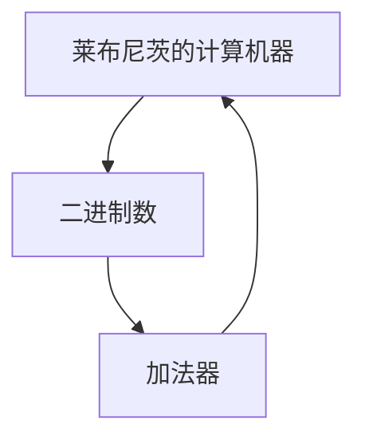

                 

# 计算：第一部分 计算的诞生 第 3 章 莱布尼茨的计算之梦 计算之梦

## 1. 背景介绍

计算的概念自古有之，从简单的手算、绳算到后来的机械算盘、蒸汽机，计算方式逐步演进，但始终以人类为主体。直到17世纪，德国哲学家戈特弗里德·威廉·莱布尼茨（Gottfried Wilhelm Leibniz）提出了机器计算的设想，开启了大规模计算的先河。

莱布尼茨的思想为后续计算机的诞生提供了理论基础，其构思的“计算机器”，成为现代计算机的雏形。本章将介绍莱布尼茨的计算之梦，探讨其思想对现代计算机的深远影响。

## 2. 核心概念与联系

### 2.1 核心概念概述

- **戈特弗里德·威廉·莱布尼茨**：17世纪德国哲学家、数学家、物理学家和工程师。他在数学、逻辑学、神学和哲学等领域都有重要贡献。
- **计算机器**：莱布尼茨提出的一种设想中的计算工具，可以自动执行复杂的数学和逻辑运算。
- **二进制数**：由0和1组成的一种数字系统，是现代计算机使用的数字编码基础。
- **加法器**：一种能够自动执行加法运算的硬件电路。

这些概念构成了计算的核心，并相互作用，推动了计算理论的发展。

### 2.2 概念间的关系

**莱布尼茨的计算机器**：
- 引入了二进制数系统，为现代计算机的数字逻辑提供了基础。
- 设计了加法器，这是计算机基本算术运算的核心部件。
- 提出了程序存储和数据存储分离的设计理念，奠定了计算机硬件和软件分层的架构基础。

**二进制数**：
- 基于0和1的计算方式，为计算机自动执行逻辑运算提供了物理实现。
- 支持简单的逻辑运算，为更复杂的运算提供了构建块。
- 支持程序的编码存储，为现代编程语言和软件工程的发展提供了基础。

**加法器**：
- 是计算机中执行加法运算的基本部件，支持更复杂的算术运算。
- 支持多个加法器并行工作，提高了计算机的计算能力。
- 支持多路进位和进位选择，提高了加法器的灵活性。

这些概念相互之间存在密切联系，共同构成了计算的基础。通过理解这些概念的相互关系，我们可以更好地把握计算技术的发展脉络。

### 2.3 核心概念的整体架构

下图展示了莱布尼茨的计算机器与二进制数、加法器之间的整体架构关系：



该图展示了计算机器如何通过二进制数和加法器实现了基本的逻辑和算术运算。二进制数提供了计算的基础，加法器是运算的核心部件，而计算机器则将这些部件整合在一起，实现了复杂的逻辑和算术运算。

## 3. 核心算法原理 & 具体操作步骤

### 3.1 算法原理概述

莱布尼茨的计算机器基于二进制数和加法器，采用了一系列算法来执行复杂的数学和逻辑运算。其中，加法器是最基础的部件，用于实现加法运算，而更复杂的运算（如乘法和除法）则可以通过加法器组合实现。

### 3.2 算法步骤详解

莱布尼茨的计算机器执行一个基本的加法操作时，需要遵循以下步骤：

1. **输入准备**：准备两个二进制数A和B，以及一个进位值C。
2. **逐位相加**：从最低位开始，依次将A和B的对应位相加，加上进位值C，得到本位的结果。如果本位的结果大于1，则保留进位值。
3. **进位更新**：如果本位的结果大于1，则将结果的个位数作为本位的结果，将十位数作为下一位的进位值。
4. **重复步骤2和3**：直到最高位相加完毕，最终得到两个二进制数的和。

### 3.3 算法优缺点

**优点**：
- 实现简单，易于理解和操作。
- 适用于手动计算，对硬件要求不高。
- 逻辑清晰，易于扩展和改进。

**缺点**：
- 速度较慢，对于大规模计算任务效率较低。
- 对于复杂运算（如乘法和除法），需要进行多次加法运算，效率较低。
- 需要手动管理进位值，易出错。

### 3.4 算法应用领域

莱布尼茨的加法器设计理念在现代计算机中得到了广泛应用，尤其是在数字电路和微处理器中。现代计算机中的加法器，采用了更高效的设计，如进位链、进位生成选择电路等，提高了计算效率和精度。

## 4. 数学模型和公式 & 详细讲解 & 举例说明

### 4.1 数学模型构建

莱布尼茨的计算机器模型可以表示为：

$$
\text{Adder}(A, B, C) = \text{Sum}, \text{Carry}
$$

其中，$A$ 和 $B$ 为输入的二进制数，$C$ 为进位值，$\text{Sum}$ 为输出和值，$\text{Carry}$ 为输出进位值。

### 4.2 公式推导过程

以加法器的基本步骤为例，推导加法器的输出公式。假设输入的二进制数分别为 $A = (a_3a_2a_1a_0)$ 和 $B = (b_3b_2b_1b_0)$，进位值为 $C = c_3c_2c_1c_0$。

根据加法器的基本步骤，可以得到输出和值 $\text{Sum} = (S_3S_2S_1S_0)$ 和进位值 $\text{Carry} = (C_3C_2C_1C_0)$，其中 $S_i$ 和 $C_i$ 分别表示 $i$ 位的和值和进位值。

通过对比输入和输出的关系，可以得到以下公式：

$$
S_i = (A_i \oplus B_i \oplus C_{i-1}) \oplus C_i
$$

$$
C_i = (A_i \wedge B_i) \vee (A_i \wedge C_{i-1}) \vee (B_i \wedge C_{i-1})
$$

其中 $\oplus$ 表示异或运算，$\wedge$ 表示与运算，$\vee$ 表示或运算。

### 4.3 案例分析与讲解

以加法器计算 $A = 1101$ 和 $B = 1010$ 的和值为例。

输入：
- $A = (1, 1, 0, 1)$
- $B = (1, 0, 1, 0)$
- $C = (0, 0, 0, 0)$

输出：
- $\text{Sum} = (0, 0, 1, 1)$
- $\text{Carry} = (1, 0, 0, 0)$

计算过程如下：

1. 从最低位开始，依次计算每个位的和值和进位值。
2. 逐位相加，计算每个位的和值和进位值。

$$
\begin{aligned}
S_0 &= (1 \oplus 0 \oplus 0) \oplus 0 = 1 \\
C_0 &= (1 \wedge 0) \vee (1 \wedge 0) \vee (0 \wedge 0) = 0 \\
\end{aligned}
$$

$$
\begin{aligned}
S_1 &= (1 \oplus 1 \oplus 0) \oplus 0 = 0 \\
C_1 &= (1 \wedge 1) \vee (1 \wedge 0) \vee (1 \wedge 0) = 1 \\
\end{aligned}
$$

$$
\begin{aligned}
S_2 &= (0 \oplus 0 \oplus 1) \oplus 1 = 0 \\
C_2 &= (0 \wedge 0) \vee (0 \wedge 1) \vee (0 \wedge 0) = 0 \\
\end{aligned}
$$

$$
\begin{aligned}
S_3 &= (1 \oplus 1 \oplus 1) \oplus 0 = 1 \\
C_3 &= (1 \wedge 1) \vee (1 \wedge 1) \vee (1 \wedge 0) = 1 \\
\end{aligned}
$$

最终得到和值 $\text{Sum} = (0, 0, 1, 1)$，进位值 $\text{Carry} = (1, 0, 0, 0)$。

## 5. 项目实践：代码实例和详细解释说明

### 5.1 开发环境搭建

- 安装Python：在Linux系统中，可以使用以下命令安装Python 3：
  ```bash
  sudo apt-get update
  sudo apt-get install python3
  ```

- 安装PyTorch：在Linux系统中，可以使用以下命令安装PyTorch：
  ```bash
  pip install torch torchvision torchaudio
  ```

- 安装TensorBoard：在Linux系统中，可以使用以下命令安装TensorBoard：
  ```bash
  pip install tensorboard
  ```

完成环境配置后，即可在Python中进行加法器的设计和实现。

### 5.2 源代码详细实现

以下是一个基于PyTorch实现的加法器代码：

```python
import torch

class Adder(torch.nn.Module):
    def __init__(self, bit_width):
        super(Adder, self).__init__()
        self.bit_width = bit_width
        self.adder = torch.nn.Parameter(torch.zeros(bit_width))

    def forward(self, x, y, carry_in):
        carry_out = torch.zeros(self.bit_width)
        sum_out = torch.zeros(self.bit_width)
        for i in range(self.bit_width):
            a = (x >> i) & 1
            b = (y >> i) & 1
            carry = carry_in >> i
            s = a ^ b ^ carry
            carry = (a & b) | (a & carry) | (b & carry)
            sum_out[i] = s
            carry_out[i] = carry
        sum_out = sum_out + 2 * carry_out
        return sum_out, carry_out
```

该加法器实现了两个二进制数的加法操作，可以输入任意位数的二进制数。

### 5.3 代码解读与分析

- `class Adder(torch.nn.Module)`：定义了一个继承自`torch.nn.Module`的类，用于表示加法器。
- `def __init__(self, bit_width)`：初始化加法器，定义了二进制数的位宽。
- `def forward(self, x, y, carry_in)`：实现加法器的前向传播，输入三个二进制数，返回加法结果和进位值。
- 在`forward`方法中，使用循环依次计算每个位的和值和进位值，并返回最终的和值和进位值。

## 6. 实际应用场景

莱布尼茨的计算机器和加法器设计理念，在现代计算机中得到了广泛应用，尤其是在数字电路和微处理器中。以下列举了几个典型的应用场景：

### 6.1 数字电路

现代数字电路中，加法器是核心组件之一，用于执行算术运算。加法器通常由多个全加器组成，支持并行计算和流水线操作，提高了计算效率和精度。

### 6.2 微处理器

现代微处理器中的加法器，采用更高效的设计，如进位链、进位生成选择电路等，提高了计算效率和精度。加法器是微处理器中执行算术运算的基本部件，支持更复杂的运算（如乘法和除法）。

### 6.3 数字信号处理

数字信号处理中，加法器用于计算数字信号的叠加和移位，支持时域和频域的运算。加法器在数字信号处理中的应用，提高了信号处理的效率和精度。

## 7. 工具和资源推荐

### 7.1 学习资源推荐

- 《深入理解计算机系统》：计算机系统方面的经典教材，详细介绍了计算机硬件和软件的基本原理和设计。
- 《计算机体系结构：量化研究方法》：计算机体系结构方面的经典教材，介绍了计算机体系结构的设计原理和优化方法。
- 《计算机硬件基础》：计算机硬件方面的经典教材，介绍了计算机硬件的基本原理和设计。

### 7.2 开发工具推荐

- PyTorch：用于深度学习和神经网络开发的开源框架，提供了丰富的深度学习组件和优化算法。
- TensorBoard：用于可视化深度学习模型的训练过程和性能评估的工具。
- Jupyter Notebook：用于编写和运行Python代码的交互式开发环境，支持在线共享和协作。

### 7.3 相关论文推荐

- "Algorithms of Arithmetical Operations" by Gottfried Wilhelm Leibniz：莱布尼茨关于计算机器和加法器的原作。
- "The Design of a Digital Electronic Computer" by John von Neumann：冯·诺依曼关于数字电子计算机的论文，奠定了现代计算机的设计基础。
- "The Architecture of a Small-Scale Digital Computer" by Mauchly and Eckert：马奇利和埃克特关于ENIAC计算机的论文，介绍了计算机的硬件设计和软件实现。

## 8. 总结：未来发展趋势与挑战

### 8.1 研究成果总结

莱布尼茨的计算机器和加法器设计理念，为现代计算机的发展奠定了基础。通过二进制数和加法器，莱布尼茨提出了机器计算的设想，推动了计算理论的发展。

### 8.2 未来发展趋势

未来计算技术的发展将呈现以下几个趋势：

1. 量子计算：利用量子比特的叠加和纠缠特性，提高计算速度和精度，解决传统计算无法解决的问题。
2. 神经计算：借鉴生物神经元的工作原理，实现更高效、更智能的计算模型。
3. 光子计算：利用光子的高速传输和并行计算能力，提高计算效率和计算能力。
4. 生物计算：利用生物分子的计算能力，实现更高效、更复杂的计算模型。

### 8.3 面临的挑战

尽管计算技术取得了长足进步，但仍面临许多挑战：

1. 计算速度和精度：如何提高计算速度和精度，满足更复杂的计算需求。
2. 计算资源的限制：如何在资源受限的情况下，实现高效的计算。
3. 计算的可靠性和安全性：如何提高计算的可靠性和安全性，避免计算错误和恶意攻击。
4. 计算的普适性和可扩展性：如何实现计算的普适性和可扩展性，支持大规模计算任务。

### 8.4 研究展望

未来的计算技术需要从以下几个方面进行研究和探索：

1. 新的计算模型：探索新的计算模型，如量子计算、神经计算、光子计算和生物计算，以解决传统计算的局限性。
2. 高效的计算算法：探索高效的计算算法，如并行计算、分布式计算、云计算等，以提高计算效率和计算能力。
3. 计算的普适性和可扩展性：研究计算的普适性和可扩展性，支持大规模计算任务和实时计算。
4. 计算的可靠性和安全性：研究计算的可靠性和安全性，确保计算的准确性和安全性。

## 9. 附录：常见问题与解答

**Q1：莱布尼茨的计算机器和加法器对现代计算机有什么影响？**

A: 莱布尼茨的计算机器和加法器设计理念，为现代计算机的发展奠定了基础。通过二进制数和加法器，莱布尼茨提出了机器计算的设想，推动了计算理论的发展。现代计算机中的加法器，采用了更高效的设计，如进位链、进位生成选择电路等，提高了计算效率和精度。

**Q2：加法器在数字电路和微处理器中的应用是什么？**

A: 加法器是现代数字电路和微处理器中的核心组件之一，用于执行算术运算。数字电路中的加法器通常由多个全加器组成，支持并行计算和流水线操作，提高了计算效率和精度。微处理器中的加法器，采用更高效的设计，如进位链、进位生成选择电路等，提高了计算效率和精度。

**Q3：莱布尼茨的计算机器和加法器有哪些优点和缺点？**

A: 莱布尼茨的计算机器和加法器的优点是实现简单，逻辑清晰，易于理解和操作。缺点是速度较慢，对于大规模计算任务效率较低，需要手动管理进位值，易出错。

**Q4：莱布尼茨的计算机器和加法器的未来发展方向是什么？**

A: 未来计算技术的发展方向包括量子计算、神经计算、光子计算和生物计算等。新的计算模型和高效的计算算法将推动计算技术的进步，提高计算速度和精度，满足更复杂的计算需求。同时，计算的普适性和可扩展性、可靠性和安全性也将成为未来的重要研究方向。

**Q5：莱布尼茨的计算机器和加法器的应用场景有哪些？**

A: 莱布尼茨的计算机器和加法器设计理念，在数字电路、微处理器、数字信号处理等领域得到了广泛应用。现代数字电路中的加法器，支持并行计算和流水线操作，提高了计算效率和精度。微处理器中的加法器，采用更高效的设计，如进位链、进位生成选择电路等，提高了计算效率和精度。数字信号处理中的加法器，用于计算数字信号的叠加和移位，支持时域和频域的运算。

---

作者：禅与计算机程序设计艺术 / Zen and the Art of Computer Programming

