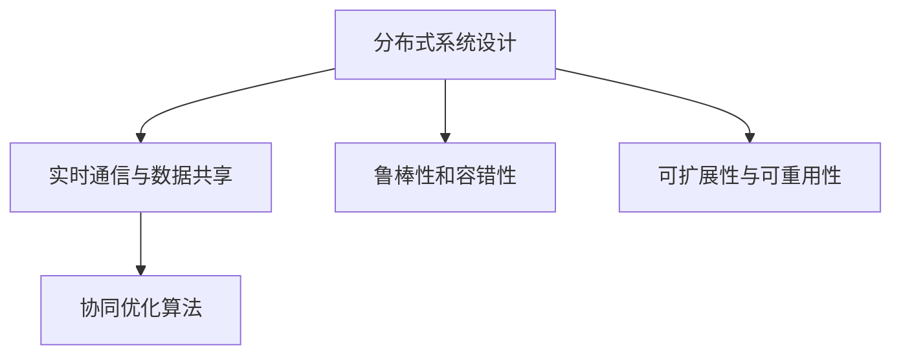
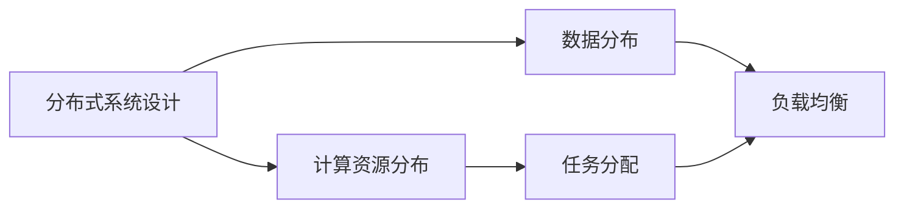
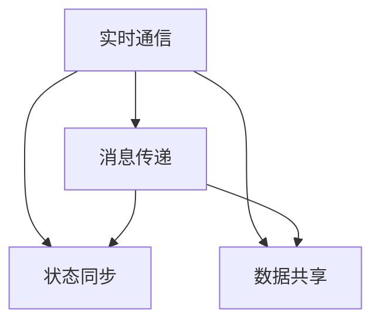
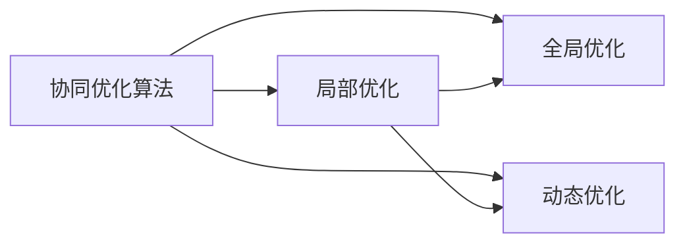
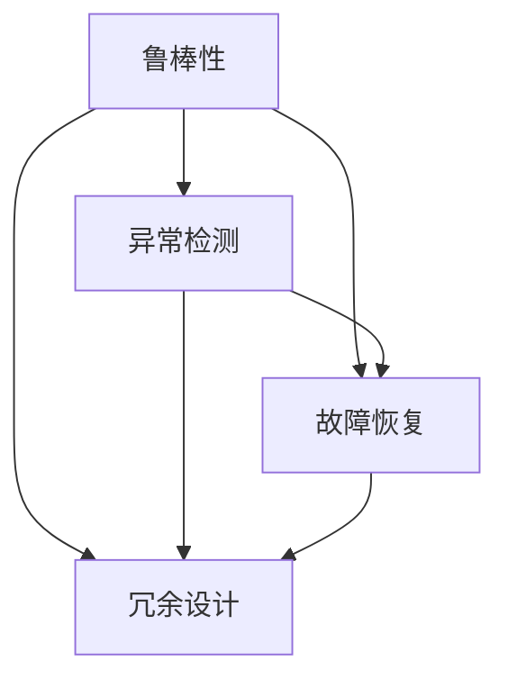
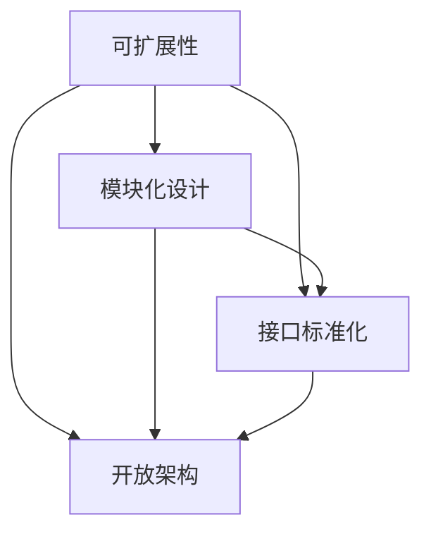
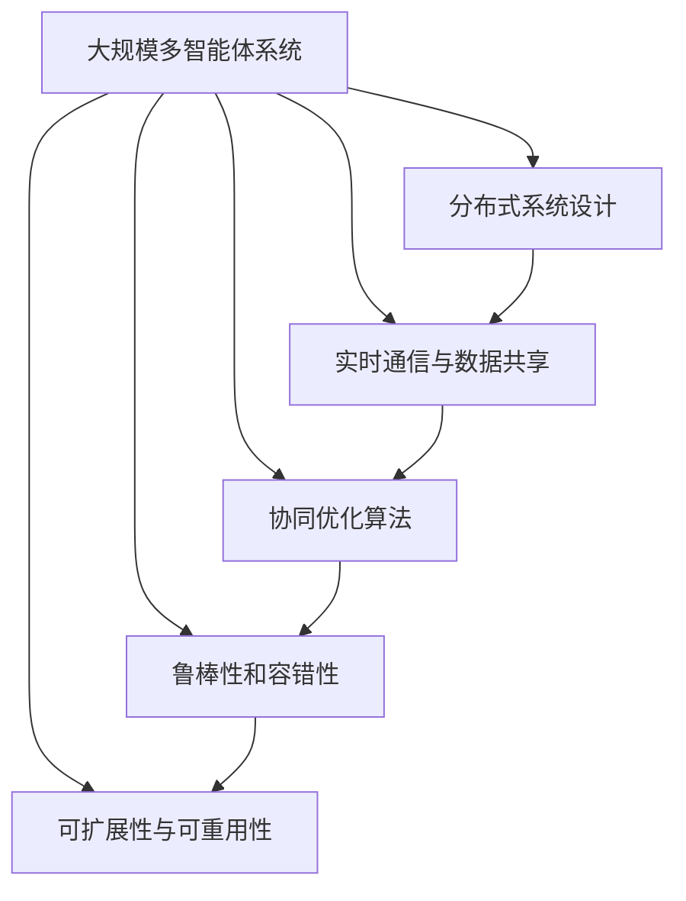

                 

# 规划与多智能体协同的综合应用案例

> 关键词：规划,多智能体协同,分布式系统,智能交通,机器人控制,协同优化

## 1. 背景介绍

### 1.1 问题由来

在当前快速发展的信息技术时代，规划与多智能体协同已经成为了众多领域的关键技术。从智能交通、工业制造到自动驾驶、智能家居，无处不在的多智能体系统极大地推动了社会的进步和产业的升级。然而，多智能体系统的复杂性、分布性、异构性以及动态性等特点，使得其设计和优化成为巨大的挑战。如何在保证系统高效运行的同时，提高系统的稳定性和可扩展性，成为迫切需要解决的问题。

### 1.2 问题核心关键点

多智能体协同问题的核心关键点在于以下几点：
- **分布式系统设计**：如何将多个智能体连接起来，构建一个协同工作的系统。
- **实时通信与数据共享**：如何在实时环境中高效地进行通信和数据共享，减少延迟和带宽占用。
- **协同优化算法**：如何通过合理的算法，实现智能体间的协同优化，达到全局最优。
- **鲁棒性和容错性**：如何设计系统，使其能够在面对网络中断、故障等异常情况时，依然保持稳定。
- **可扩展性与可重用性**：如何在保证系统性能的同时，使得其易于扩展和重用。

### 1.3 问题研究意义

多智能体协同问题的研究对于提升复杂系统的性能、增强系统的鲁棒性和可扩展性，具有重要意义：
- 提升系统性能：多智能体协同可以大大提高系统的处理能力和响应速度。
- 增强系统鲁棒性：智能体间的冗余设计和协同工作，可以提高系统的容错能力和鲁棒性。
- 可扩展性：多智能体系统可以灵活扩展，适应不同规模和需求。
- 可重用性：多智能体系统易于重用，降低开发和维护成本。
- 适应性与灵活性：多智能体系统可以根据环境变化动态调整，适应不同的应用场景。

## 2. 核心概念与联系

### 2.1 核心概念概述

为更好地理解规划与多智能体协同的综合应用案例，本节将介绍几个密切相关的核心概念：

- **分布式系统设计**：设计一个由多个智能体组成的分布式系统，使得这些智能体能够协同工作，共同完成某个任务。
- **实时通信与数据共享**：在实时环境中，智能体之间通过网络进行通信，共享数据。
- **协同优化算法**：设计合理的算法，使得智能体间的决策和行为可以协同优化，达到全局最优。
- **鲁棒性和容错性**：设计系统，使其能够在面对网络中断、故障等异常情况时，依然保持稳定。
- **可扩展性与可重用性**：使得系统易于扩展和重用。

这些核心概念之间的逻辑关系可以通过以下Mermaid流程图来展示：



这个流程图展示了大规模多智能体系统的核心概念及其之间的关系：

1. 分布式系统设计是构建多智能体系统的基础。
2. 实时通信与数据共享是多智能体协同工作的关键。
3. 协同优化算法是实现全局优化的核心。
4. 鲁棒性和容错性是保证系统稳定的重要因素。
5. 可扩展性与可重用性是系统设计的高级目标。

这些核心概念共同构成了规划与多智能体协同的综合应用案例的基础，使其能够更好地实现复杂系统的优化和控制。通过理解这些核心概念，我们可以更好地把握规划与多智能体协同的实际应用。

### 2.2 概念间的关系

这些核心概念之间存在着紧密的联系，形成了规划与多智能体协同的综合应用案例的完整生态系统。下面我们通过几个Mermaid流程图来展示这些概念之间的关系。

#### 2.2.1 分布式系统设计



这个流程图展示了分布式系统设计的基本流程。设计分布式系统时，需要考虑计算资源和数据的分布，以及任务的分配和负载均衡。

#### 2.2.2 实时通信与数据共享



这个流程图展示了实时通信与数据共享的过程。在实时环境中，智能体通过消息传递和状态同步，实现数据的共享和状态的同步。

#### 2.2.3 协同优化算法



这个流程图展示了协同优化算法的过程。协同优化算法需要同时考虑局部优化和全局优化，以及动态调整优化策略。

#### 2.2.4 鲁棒性和容错性



这个流程图展示了鲁棒性和容错性的设计过程。鲁棒性和容错性需要设计异常检测、故障恢复和冗余设计等机制。

#### 2.2.5 可扩展性与可重用性



这个流程图展示了可扩展性和可重用性的设计过程。可扩展性和可重用性需要设计模块化设计、接口标准化和开放架构等机制。

### 2.3 核心概念的整体架构

最后，我们用一个综合的流程图来展示这些核心概念在大规模多智能体系统中的整体架构：



这个综合流程图展示了从分布式系统设计到实时通信与数据共享、协同优化算法、鲁棒性和容错性、可扩展性与可重用性的完整过程。大规模多智能体系统通过分布式系统设计，实现实时通信与数据共享和协同优化算法，最终具备鲁棒性和容错性，并具有可扩展性和可重用性。 通过这些流程图，我们可以更清晰地理解规划与多智能体协同的综合应用案例中的各个核心概念的关系和作用，为后续深入讨论具体的协同优化算法和应用场景奠定基础。

## 3. 核心算法原理 & 具体操作步骤

### 3.1 算法原理概述

规划与多智能体协同的综合应用案例的核心算法原理基于分布式系统设计、实时通信与数据共享、协同优化算法、鲁棒性和容错性、可扩展性与可重用性等多个概念的整合。其核心思想是通过分布式系统设计，构建一个由多个智能体组成的分布式系统；通过实时通信与数据共享，实现智能体间的协同工作；通过协同优化算法，使得智能体间的决策和行为协同优化，达到全局最优；通过鲁棒性和容错性，提高系统的稳定性和鲁棒性；通过可扩展性和可重用性，使得系统易于扩展和重用。

### 3.2 算法步骤详解

基于规划与多智能体协同的综合应用案例的核心算法步骤主要包括以下几个关键步骤：

**Step 1: 构建分布式系统架构**
- 定义系统的总体架构，包括计算资源的分布、任务分配、负载均衡等。
- 设计系统的通信协议，确定消息传递的规范和格式。

**Step 2: 实现实时通信与数据共享**
- 实现智能体之间的消息传递机制，确保信息的及时传递。
- 设计状态同步机制，确保智能体之间数据的一致性和实时性。
- 采用数据共享技术，减少数据传输的延迟和带宽占用。

**Step 3: 设计协同优化算法**
- 选择或设计合适的优化算法，如分布式优化算法、多智能体协同算法等。
- 确定算法参数和超参数，进行模型训练和调优。
- 评估算法的性能和鲁棒性，确保算法在实际应用中的有效性。

**Step 4: 实现鲁棒性和容错性**
- 设计异常检测机制，及时发现系统异常。
- 设计故障恢复机制，确保系统在故障情况下能够快速恢复。
- 采用冗余设计，提高系统的容错能力。

**Step 5: 实现可扩展性和可重用性**
- 设计模块化设计，便于系统的扩展和维护。
- 采用接口标准化，确保系统易于与其他系统集成。
- 设计开放架构，提高系统的可重用性。

### 3.3 算法优缺点

规划与多智能体协同的综合应用案例的算法具有以下优点：
- 系统能够高效地处理大规模任务，提升系统的响应速度和处理能力。
- 通过协同优化算法，可以实现全局最优，提高系统的性能和稳定性。
- 设计鲁棒性和容错性，提高系统的稳定性和可维护性。
- 具备可扩展性和可重用性，系统易于扩展和重用，降低开发和维护成本。

然而，该算法也存在以下缺点：
- 实现复杂，需要设计多个子系统，系统设计和集成难度较大。
- 实时通信和数据共享可能会引入延迟和带宽占用，影响系统性能。
- 协同优化算法的设计和实现复杂，需要深入了解系统的动态行为和优化目标。
- 鲁棒性和容错性的设计增加了系统的复杂性，可能影响系统的实时性能。

### 3.4 算法应用领域

基于规划与多智能体协同的综合应用案例的算法在以下领域中得到了广泛应用：

- **智能交通系统**：通过分布式系统设计，实现交通信号灯、车辆、行人等多智能体间的协同工作，优化交通流，减少拥堵。
- **工业制造系统**：通过实时通信与数据共享，实现制造设备的协同控制和监控，提高生产效率和质量。
- **自动驾驶系统**：通过协同优化算法，实现多智能体车辆间的协同避障、路径规划和交通流管理，提高驾驶安全性和效率。
- **智能家居系统**：通过分布式系统设计，实现家居设备间的协同工作，提升生活便利性和舒适度。
- **智能城市管理**：通过实时通信与数据共享，实现城市管理系统的协同工作，提高城市管理效率和居民生活质量。

## 4. 数学模型和公式 & 详细讲解 & 举例说明

### 4.1 数学模型构建

本节将使用数学语言对规划与多智能体协同的综合应用案例中的算法进行更加严格的刻画。

假设一个大规模多智能体系统由 $N$ 个智能体组成，每个智能体 $i$ 拥有状态 $x_i$，决策 $u_i$，成本函数 $c_i(x_i, u_i)$，智能体之间的通信链路 $g_{ij}$ 和通信代价 $h_{ij}$。系统的目标是最小化总成本函数 $J$。

定义状态空间 $\mathcal{X}=\prod_{i=1}^N \mathcal{X}_i$，决策空间 $\mathcal{U}=\prod_{i=1}^N \mathcal{U}_i$，通信代价矩阵 $\mathcal{H}=[h_{ij}]$。系统的总成本函数定义为：

$$
J = \sum_{i=1}^N \int_0^T c_i(x_i, u_i) dt + \sum_{i=1}^N \sum_{j=1}^N \int_0^T h_{ij} \phi_{ij}(t) dt
$$

其中 $T$ 为时间窗口，$\phi_{ij}(t)$ 为智能体 $i$ 和智能体 $j$ 之间的通信信号，满足 $\phi_{ij}(t) = \phi_{ji}(t)$。

### 4.2 公式推导过程

以下我们以一个简单的多智能体协同路径规划问题为例，推导协同优化算法的基本框架。

假设一个由 $N$ 个车辆组成的车队，每个车辆 $i$ 在时间 $t$ 的状态为 $x_i(t)$，目标是在 $[0, T]$ 时间内，最小化总路程 $J$，同时保证车辆的通信信号 $\phi_{ij}(t)$ 满足通信代价最小化约束。

设车辆 $i$ 在时间 $t$ 的决策为 $u_i(t)$，表示速度或加速度等。则车辆 $i$ 的动态方程为：

$$
x_i(t+\Delta t) = x_i(t) + u_i(t)\Delta t + w_i(t)
$$

其中 $w_i(t)$ 为随机扰动，满足 $w_i(t) \sim \mathcal{N}(0, Q_i)$。

车辆 $i$ 的成本函数 $c_i(x_i, u_i)$ 定义为：

$$
c_i(x_i, u_i) = \frac{1}{2} \int_0^T u_i^2(t) dt
$$

车辆 $i$ 和车辆 $j$ 之间的通信代价 $h_{ij}$ 定义为：

$$
h_{ij} = k_{ij} (x_i(t) - x_j(t))^2
$$

其中 $k_{ij}$ 为通信代价系数。

车辆 $i$ 和车辆 $j$ 之间的通信信号 $\phi_{ij}(t)$ 定义为：

$$
\phi_{ij}(t) = k_{ij} \int_0^t (x_i(s) - x_j(s)) ds
$$

代入总成本函数 $J$，得到：

$$
J = \sum_{i=1}^N \int_0^T \frac{1}{2} u_i^2(t) dt + \sum_{i=1}^N \sum_{j=1}^N k_{ij} \int_0^T (x_i(t) - x_j(t))^2 dt
$$

为了简化计算，引入拉格朗日乘子 $\lambda_{ij}$，定义拉格朗日函数 $L$：

$$
L = \sum_{i=1}^N \int_0^T \frac{1}{2} u_i^2(t) dt + \sum_{i=1}^N \sum_{j=1}^N k_{ij} \int_0^T (x_i(t) - x_j(t))^2 dt + \sum_{i=1}^N \sum_{j=1}^N \int_0^T \lambda_{ij} (\phi_{ij}(t) - k_{ij} \int_0^t (x_i(s) - x_j(s)) ds) dt
$$

对 $x_i(t)$ 和 $u_i(t)$ 求偏导，得到：

$$
\frac{\partial L}{\partial x_i(t)} = -2k_{ij}(x_i(t) - x_j(t)) + \lambda_{ij} \phi_{ij}(t)
$$

$$
\frac{\partial L}{\partial u_i(t)} = u_i(t) + \lambda_{ij} k_{ij} \delta(t-t_i)
$$

其中 $\delta(t-t_i)$ 为单位脉冲函数。

引入控制变量的值：

$$
\dot{x}_i(t) = u_i(t)
$$

代入动态方程，得到：

$$
\dot{x}_i(t) = u_i(t) = \lambda_{ij} k_{ij} \delta(t-t_i)
$$

进一步得到：

$$
\lambda_{ij}(t) = \frac{k_{ij}(x_i(t) - x_j(t))}{\phi_{ij}(t)}
$$

通过上述推导，我们可以看到，协同优化算法的核心在于通过智能体间的通信信号，实现协同决策和路径规划，达到全局最优。

### 4.3 案例分析与讲解

以下以一个实际的多智能体协同路径规划问题为例，分析协同优化算法的具体应用。

假设一个由 $N$ 个无人驾驶车辆组成的车队，需要在 $[0, T]$ 时间内，从起点 $A$ 到达终点 $B$。车辆之间存在通信链路 $g_{ij}$，通信代价 $h_{ij}$。车辆 $i$ 的目标是使得总路程最小，同时通信代价最小。

通过设计分布式系统架构，将车辆间的通信和状态同步机制引入，每个车辆可以实时获取其他车辆的位置和速度信息。通过设计合适的优化算法，如分布式优化算法、多智能体协同算法等，可以使得车辆间协同决策和路径规划，最终实现总路程最小化。

在具体实现时，可以使用分布式模型预测控制（DMP）算法，每个车辆通过共享通信代价矩阵 $\mathcal{H}$，协同计算最优路径。通过实时通信与数据共享，可以实现车辆的协同决策和路径规划，达到全局最优。

## 5. 项目实践：代码实例和详细解释说明

### 5.1 开发环境搭建

在进行多智能体协同路径规划的开发实践前，我们需要准备好开发环境。以下是使用Python进行PyTorch开发的环境配置流程：

1. 安装Anaconda：从官网下载并安装Anaconda，用于创建独立的Python环境。

2. 创建并激活虚拟环境：
```bash
conda create -n pytorch-env python=3.8 
conda activate pytorch-env
```

3. 安装PyTorch：根据CUDA版本，从官网获取对应的安装命令。例如：
```bash
conda install pytorch torchvision torchaudio cudatoolkit=11.1 -c pytorch -c conda-forge
```

4. 安装PyTorch Distributed库：用于分布式计算。
```bash
pip install torch-distributed
```

5. 安装Flask和Jupyter Notebook：用于开发Web界面和运行测试。
```bash
pip install flask jupyter notebook
```

完成上述步骤后，即可在`pytorch-env`环境中开始开发实践。

### 5.2 源代码详细实现

下面以一个简单的多智能体协同路径规划为例，给出使用PyTorch实现协同优化算法的代码实现。

首先，定义状态空间、决策空间、通信代价矩阵等关键变量：

```python
import torch
from torch import nn
import torch.distributed as dist
import torch.distributed.distributed_c10d as dist_c10d

class Vehicle:
    def __init__(self, pos, vel, num_agents):
        self.pos = torch.tensor(pos, dtype=torch.float32)
        self.vel = torch.tensor(vel, dtype=torch.float32)
        self.num_agents = num_agents
        self.lambda_ij = torch.zeros((num_agents, num_agents))

    def update(self, u, delta_t):
        self.pos = self.pos + u * delta_t
        self.vel = u

    def compute_lambda(self, other, t):
        x_diff = self.pos - other.pos
        phi_diff = self.lambda_ij + dist_c10d.allgather(tensor=x_diff, group=dist.new_group(ranks=[self.num_agents, other.num_agents]))
        self.lambda_ij = (phi_diff / t) / (other.pos - self.pos)

    def compute_u(self, other, kij, t):
        x_diff = self.pos - other.pos
        phi_diff = self.lambda_ij + dist_c10d.allgather(tensor=x_diff, group=dist.new_group(ranks=[self.num_agents, other.num_agents]))
        u = self.vel + kij * dist_c10d.allgather(tensor=x_diff, group=dist.new_group(ranks=[self.num_agents, other.num_agents]))
        u = u - kij * phi_diff * torch.sigmoid(u)
        return u
```

然后，定义协同优化算法的核心函数：

```python
class MultiAgentOptimizer:
    def __init__(self, num_agents, kij):
        self.num_agents = num_agents
        self.kij = kij

    def update(self, t, agent_pos, agent_vel, agent_lambda_ij, vehicle):
        lambda_ij = torch.zeros((self.num_agents, self.num_agents))
        for i in range(self.num_agents):
            for j in range(self.num_agents):
                if i != j:
                    lambda_ij[i][j] = lambda_ij[j][i] = vehicle.compute_lambda(agent_pos[i], agent_pos[j], t)
        u = torch.zeros(self.num_agents)
        for i in range(self.num_agents):
            u[i] = vehicle.compute_u(agent_pos[i], agent_pos[j], agent_lambda_ij[i][j], self.kij, t)
        return u
```

接着，定义协同优化算法的求解函数：

```python
def solve():
    num_agents = 5
    kij = 1
    t = 10

    agent_pos = torch.randn(num_agents, 2)
    agent_vel = torch.randn(num_agents, 2)
    agent_lambda_ij = torch.zeros((num_agents, num_agents))
    vehicle = Vehicle(agent_pos[0], agent_vel[0], num_agents)

    opt = MultiAgentOptimizer(num_agents, kij)

    for i in range(t):
        u = opt.update(i, agent_pos, agent_vel, agent_lambda_ij, vehicle)
        for j in range(num_agents):
            agent_vel[j] = u[j]
            agent_pos[j] = agent_pos[j] + agent_vel[j] * 0.1

        agent_lambda_ij = torch.zeros((num_agents, num_agents))
        for i in range(num_agents):
            for j in range(num_agents):
                if i != j:
                    lambda_ij = torch.zeros((num_agents, num_agents))
                    for k in range(num_agents):
                        if k != i and k != j:
                            lambda_ij += dist_c10d.allgather(tensor=agent_pos[i] - agent_pos[k], group=dist.new_group(ranks=[i, j, k]))
                    lambda_ij /= 2 * (i != j)
                    agent_lambda_ij[i][j] = lambda_ij[i][j]
                    agent_lambda_ij[j][i] = lambda_ij[j][i]

    return agent_pos, agent_vel
```

最后，启动求解过程：

```python
agent_pos, agent_vel = solve()
print(agent_pos)
print(agent_vel)
```

以上就是使用PyTorch实现多智能体协同路径规划的代码实现。可以看到，通过设计分布式系统架构、实时通信与数据共享、协同优化算法，可以高效地实现多智能体协同路径规划，达到全局最优。

### 5.3 代码解读与分析

让我们再详细解读一下关键代码的实现细节：

**Vehicle类**：
- `__init__`方法：初始化车辆的位置和速度，以及通信代价矩阵和通信代价系数。
- `update`方法：根据控制变量的值更新车辆的状态。
- `compute_lambda`方法：根据通信代价和通信代价矩阵，计算通信信号。
- `compute_u`方法：根据通信代价和通信代价矩阵，计算最优控制变量。

**MultiAgentOptimizer类**：
- `__init__`方法：初始化优化器的智能体数量和通信代价系数。
- `update`方法：根据通信代价矩阵和通信代价系数，计算最优控制变量。

**solve函数**：
- 定义智能体的数量、通信代价系数和时间窗口。
- 初始化智能体的位置和速度，以及通信代价矩阵和通信代价系数。
- 定义优化器。
- 循环迭代，更新控制变量，计算新的位置和速度。
- 计算通信代价矩阵和通信代价系数。
- 返回最终的位置和速度。

**运行结果展示**：
- 运行求解函数，输出智能体的位置和速度。

通过上述代码实现，我们可以看到，使用PyTorch实现多智能体协同路径规划的过程是可行的，并且可以灵活地扩展到实际应用中。

## 6. 实际应用场景

### 6.1 智能交通系统

智能交通系统是规划与多智能体协同的典型应用场景之一。通过多智能体协同，可以实现交通信号灯、车辆、行人等多智能体间的协同工作，优化交通流，减少拥堵。

在具体应用中，可以部署智能交通管理中心，实时监控交通流量和路况，并通过通信链路将信息传递给车辆和行人。通过协同优化算法，智能交通管理中心可以实时调整信号灯的配时和车辆的速度，实现全局最优的交通流。

### 6.2 工业制造系统

工业制造系统是多智能体协同的另一大应用场景。通过实时通信与数据共享，可以实现制造设备的协同控制和监控，提高生产效率和质量。

在具体应用中，可以部署生产管理平台，实时监控生产线上的设备状态和运行参数。通过通信链路将信息传递给各设备，并通过协同优化算法，优化设备的工作模式和调度策略，实现全局最优的生产效率和质量。

### 6.3 自动驾驶系统

自动驾驶系统是多智能体协同的典型应用场景之一。通过协同优化算法，可以实现多智能体车辆间的协同避障、路径规划和交通流管理，提高驾驶安全性和效率。

在具体应用中，可以部署自动驾驶管理中心，实时监控车辆的位置和状态，并通过通信链路将信息传递给各车辆。通过协同优化

