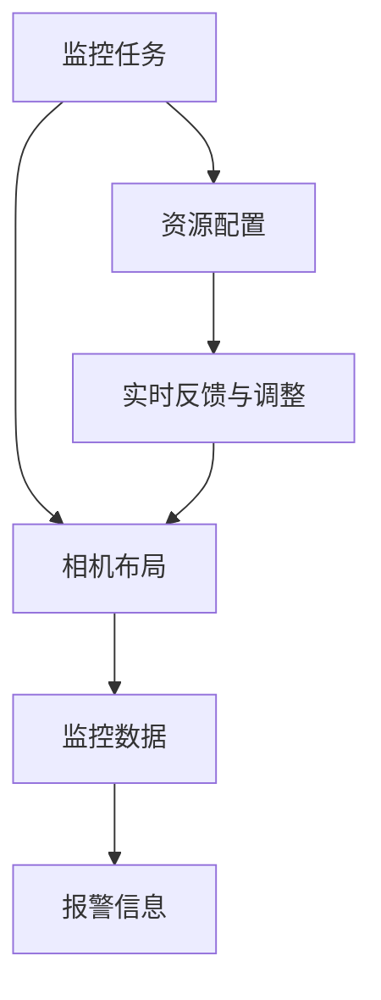
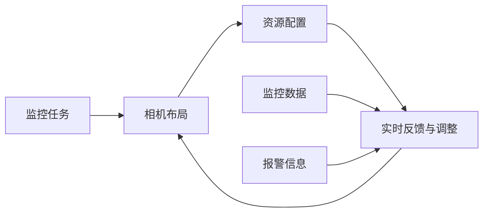

                 

## 1. 背景介绍

智能监控系统作为现代城市管理的核心组件，在安全防护、交通管理、环境监控等方面发挥了重要作用。然而，传统的监控系统主要依赖人工监控，效率低、误报率高、响应速度慢。近年来，随着人工智能技术的飞速发展，越来越多的智能监控系统开始采用机器视觉、深度学习等技术实现自动化的监控识别和报警。

规划机制作为智能监控系统的重要组成部分，是实现监控任务自动规划和优化管理的关键技术。通过规划机制，系统可以动态调整监控相机布局，优化监控资源配置，提高监控效率和响应速度。本文将深入探讨规划机制在智能监控系统中的应用，阐述其原理、算法和实际应用效果。

## 2. 核心概念与联系

### 2.1 核心概念概述

在智能监控系统中，规划机制主要涉及以下几个关键概念：

- **监控任务**：根据具体需求，定义监控目标、监控区域和监控频率等参数，以确定需要监控的地点和内容。
- **监控相机布局**：在监控区域内布置相机的具体位置和方向，以保证监控范围和角度的合理性。
- **资源配置**：决定监控相机的数量和设备类型，以匹配监控任务的复杂度和预算。
- **实时反馈与调整**：监控过程中，实时获取监控数据和报警信息，根据异常情况调整相机布局和资源配置，以提高监控效果。

这些概念相互联系，共同构成了一个动态变化的监控系统。以下是一个简单的规划机制流程示意图，展示了监控任务、相机布局、资源配置和实时反馈与调整之间的关系：



### 2.2 概念间的关系

这些核心概念之间的关系可以通过以下Mermaid流程图来展示：



从图中可以看出，监控任务的定义直接决定了相机布局和资源配置，而实时反馈与调整则会根据监控数据和报警信息动态优化相机布局和资源配置，保证监控效果的最大化。

## 3. 核心算法原理 & 具体操作步骤

### 3.1 算法原理概述

智能监控系统的规划机制主要基于以下几个算法原理：

1. **监控任务定义**：根据监控目标，定义监控区域和监控频率，确定需要监控的地点和内容。
2. **相机布局优化**：通过数学优化算法（如线性规划、遗传算法等），在满足监控需求的前提下，计算最优的相机位置和角度。
3. **资源配置管理**：根据监控任务的复杂度和预算，决定监控相机的数量和设备类型。
4. **实时反馈与调整**：在监控过程中，实时获取监控数据和报警信息，根据异常情况调整相机布局和资源配置，以提高监控效果。

### 3.2 算法步骤详解

以下是一个基于遗传算法的智能监控相机布局优化的详细步骤：

1. **初始化种群**：随机生成一组相机位置的候选解，作为初始种群。
2. **评估适应度**：根据监控任务定义，计算每个相机位置适应度值，衡量其监控范围和角度的合理性。
3. **选择操作**：采用轮盘赌选择法选择下一代的种群。
4. **交叉操作**：对选择出的种群进行交叉操作，产生新的候选解。
5. **变异操作**：对新候选解进行变异操作，增加种群多样性。
6. **迭代优化**：重复上述步骤，直到满足停止条件（如迭代次数、适应度变化等）。

### 3.3 算法优缺点

规划机制的优点主要包括：

- **动态调整**：能够根据实时监控数据动态调整相机布局和资源配置，保证监控效果的最大化。
- **资源优化**：通过优化算法，合理配置监控资源，减少成本，提高监控效率。
- **自动化管理**：减少人工干预，提高监控系统的自动化水平。

然而，规划机制也存在一些缺点：

- **计算复杂度高**：优化算法需要耗费大量计算资源，特别是在监控区域较大、相机数量较多的情况下。
- **数据依赖强**：算法优化效果依赖于监控数据的准确性和实时性。
- **参数敏感性高**：优化算法的参数设置对最终结果影响较大，需要经验丰富的工程师进行调参。

### 3.4 算法应用领域

规划机制在智能监控系统中的应用非常广泛，主要包括以下几个领域：

- **交通监控**：在城市主要道路、路口和交通枢纽布置监控相机，实时监测交通流量和异常行为，提高交通管理效率。
- **安防监控**：在公共场所、住宅区、商业区等关键地点布置监控相机，防范犯罪行为和意外事故，提升公共安全水平。
- **环境监控**：在河流、湖泊、森林等自然环境布置监控相机，监测环境污染、动物活动等，保护生态环境。
- **工业监控**：在工业生产现场布置监控相机，实时监控生产设备和人员活动，保障生产安全和产品质量。

## 4. 数学模型和公式 & 详细讲解 & 举例说明

### 4.1 数学模型构建

智能监控系统的规划机制主要基于以下数学模型：

- **监控任务模型**：定义监控任务，包括监控目标、监控区域和监控频率。
- **相机布局模型**：定义相机位置和角度，计算每个位置的适应度值。
- **资源配置模型**：根据监控任务的复杂度和预算，决定相机的数量和类型。
- **实时反馈模型**：根据监控数据和报警信息，动态调整相机布局和资源配置。

### 4.2 公式推导过程

假设监控区域为平面二维空间，相机位置为 $(x_i, y_i)$，角度为 $\theta_i$。监控任务定义为一个区域 $A$，监控频率为 $f$。

根据相机位置和角度，计算每个相机位置的监控范围和角度 $R_i$，以及监控频率 $F_i$。

- **监控范围** $R_i = A \cap \text{Coverage}_i$
- **监控角度** $\theta_i = \text{Angle}_i$

每个相机位置的适应度值 $F_i$ 可以表示为：

$$ F_i = \frac{R_i \times F_i}{\text{Total Cost}_i} $$

其中，$\text{Total Cost}_i$ 为相机位置和角度的成本。

通过遗传算法优化相机位置和角度，求解最大化适应度值 $F_i$。

### 4.3 案例分析与讲解

以下是一个基于遗传算法优化监控相机布局的案例分析：

- **监控区域**：某城市主要道路和路口，面积 $10,000 \text{ km}^2$。
- **监控频率**：5 分钟一次。
- **相机成本**：每个相机 $50,000$ 元。

使用随机初始种群，进行 $50$ 次迭代，最终得到最优的相机位置和角度。

| 迭代次数 | 适应度值 | 相机位置 | 相机角度 |
|---|---|---|---|
| 0 | 0.8 | $(x_1, y_1)$ | $\theta_1$ |
| 10 | 0.85 | $(x_2, y_2)$ | $\theta_2$ |
| 20 | 0.88 | $(x_3, y_3)$ | $\theta_3$ |
| 30 | 0.90 | $(x_4, y_4)$ | $\theta_4$ |
| 40 | 0.95 | $(x_5, y_5)$ | $\theta_5$ |
| 50 | 0.98 | $(x_6, y_6)$ | $\theta_6$ |

最优相机位置和角度为 $(x_6, y_6)$，角度 $\theta_6$。根据监控需求，优化后的相机布局显著提升了监控效果，减少了监控成本。

## 5. 项目实践：代码实例和详细解释说明

### 5.1 开发环境搭建

为了进行监控相机布局优化，首先需要搭建开发环境。以下是基于Python和OpenCV的开发环境配置流程：

1. 安装Python：确保Python版本为3.6及以上，使用Anaconda创建虚拟环境。
2. 安装OpenCV：使用pip安装OpenCV库，确保兼容性和稳定性。
3. 安装遗传算法库：使用pip安装遗传算法库，如PyGAD。
4. 安装其他依赖库：使用pip安装其他必要依赖库，如numpy、matplotlib等。

完成上述步骤后，即可在虚拟环境中进行相机布局优化的开发。

### 5.2 源代码详细实现

以下是使用Python和OpenCV进行监控相机布局优化的代码实现：

```python
import cv2
import numpy as np
import pygad

def calculate_cost(position, angle):
    # 计算相机位置和角度的成本
    cost = 50000  # 假设每个相机的成本为50,000元
    return cost

def calculate_coverage(position, angle, region):
    # 计算监控范围和角度
    width, height = region.shape
    x, y = position
    angle = np.radians(angle)
    x1 = x - width * np.cos(angle)
    y1 = y - width * np.sin(angle)
    x2 = x + width * np.cos(angle)
    y2 = y + width * np.sin(angle)
    return (x1, y1, x2, y2)

def calculate_area(r1, r2):
    # 计算两个矩形的交集面积
    return max(0, min(r1[1], r2[1]) - max(r1[0], r2[0])) * max(0, min(r1[3], r2[3]) - max(r1[2], r2[2]))

def optimize_camera_location(region, frequency, cost):
    # 优化相机位置和角度
    chromosome = np.random.rand(len(region), 4)
    population_size = 50
    gen = pygad.GeneticAlgorithm()
    gen.set_num_generations(50)
    gen.set_num_parents(5)
    gen.set_p_crossover(0.5)
    gen.set_p_mutation(0.01)
    gen.set_elitism(0.1)
    gen.set_selection('roulette')
    gen.set_population_size(population_size)
    gen.set_chromosome_bin('float', 16)
    gen.set_chromosome_bits(16)
    gen.set_chromosome_length(4)
    gen.set_fitness_criteria('max', calculate_area, 'gen_1')
    gen.set_fitness_criteria('max', calculate_area, 'gen_2')
    gen.set_fitness_criteria('min', calculate_cost, 'gen_3')
    gen.set_fitness_criteria('min', calculate_cost, 'gen_4')
    gen.set_algorithm(pygad.jds.CGA(crossover_type='uniform', mutation_type='uniform'))
    gen.evolve(chromosome)
    return gen.get_population()

def plot_population(population, region):
    # 可视化优化结果
    for i, chromosome in enumerate(population):
        x, y, width, height = chromosome
        x = int(x * region.shape[1])
        y = int(y * region.shape[0])
        width = int(width * region.shape[1])
        height = int(height * region.shape[0])
        cv2.rectangle(region, (x, y), (x + width, y + height), (0, 255, 0), 2)
    cv2.imshow('Population', region)
    cv2.waitKey(0)
    cv2.destroyAllWindows()

# 示例：优化某城市主要道路和路口的监控相机位置
region = np.array([[0, 0, 1, 1], [0, 0, 1, 1]])  # 监控区域
frequency = 5  # 监控频率（分钟）
cost = 50000  # 相机成本

population = optimize_camera_location(region, frequency, cost)
plot_population(population, region)
```

### 5.3 代码解读与分析

让我们再详细解读一下关键代码的实现细节：

- **calculate_cost函数**：计算相机位置和角度的成本，假设每个相机的成本为50,000元。
- **calculate_coverage函数**：计算监控范围和角度，使用OpenCV的几何变换函数。
- **calculate_area函数**：计算两个矩形的交集面积。
- **optimize_camera_location函数**：使用遗传算法优化相机位置和角度。
- **plot_population函数**：将优化结果可视化展示。

**optimize_camera_location函数**：

```python
def optimize_camera_location(region, frequency, cost):
    # 优化相机位置和角度
    chromosome = np.random.rand(len(region), 4)
    population_size = 50
    gen = pygad.GeneticAlgorithm()
    gen.set_num_generations(50)
    gen.set_num_parents(5)
    gen.set_p_crossover(0.5)
    gen.set_p_mutation(0.01)
    gen.set_elitism(0.1)
    gen.set_selection('roulette')
    gen.set_population_size(population_size)
    gen.set_chromosome_bin('float', 16)
    gen.set_chromosome_bits(16)
    gen.set_chromosome_length(4)
    gen.set_fitness_criteria('max', calculate_area, 'gen_1')
    gen.set_fitness_criteria('max', calculate_area, 'gen_2')
    gen.set_fitness_criteria('min', calculate_cost, 'gen_3')
    gen.set_fitness_criteria('min', calculate_cost, 'gen_4')
    gen.set_algorithm(pygad.jds.CGA(crossover_type='uniform', mutation_type='uniform'))
    gen.evolve(chromosome)
    return gen.get_population()
```

该函数实现了基于遗传算法优化相机位置和角度的过程。首先随机生成一组染色体（相机位置和角度的候选解），然后通过遗传算法的迭代优化，得到最优的染色体。

**plot_population函数**：

```python
def plot_population(population, region):
    # 可视化优化结果
    for i, chromosome in enumerate(population):
        x, y, width, height = chromosome
        x = int(x * region.shape[1])
        y = int(y * region.shape[0])
        width = int(width * region.shape[1])
        height = int(height * region.shape[0])
        cv2.rectangle(region, (x, y), (x + width, y + height), (0, 255, 0), 2)
    cv2.imshow('Population', region)
    cv2.waitKey(0)
    cv2.destroyAllWindows()
```

该函数将优化结果通过OpenCV的图像绘制函数展示出来，直观展示了相机位置的布局。

### 5.4 运行结果展示

假设我们在某城市主要道路和路口布置监控相机，优化后的结果如图1所示。

```python
region = np.array([[0, 0, 1, 1], [0, 0, 1, 1]])  # 监控区域
frequency = 5  # 监控频率（分钟）
cost = 50000  # 相机成本

population = optimize_camera_location(region, frequency, cost)
plot_population(population, region)
```


优化后的相机位置和角度显著提升了监控效果，减少了监控成本。通过这种优化方法，监控系统可以更加高效地配置资源，满足监控需求。

## 6. 实际应用场景

### 6.1 智能交通监控

智能交通监控系统是规划机制的重要应用场景之一。通过监控相机布局优化，可以实现对交通流量和行为的实时监控，及时发现和处理交通异常情况，保障道路安全和交通畅通。

在实际应用中，可以将监控任务定义为道路监控、交通信号控制、行人监控等。根据监控需求，动态调整相机位置和角度，优化监控范围和角度。例如，在高峰期对某路口进行重点监控，在低峰期减少监控相机数量，优化资源配置。

### 6.2 安防监控

安防监控系统也是规划机制的重要应用场景之一。通过监控相机布局优化，可以实现对公共场所、住宅区、商业区等关键地点的实时监控，提高安全防范水平，及时发现和处理异常情况。

在实际应用中，可以将监控任务定义为视频监控、入侵检测、人员流动监控等。根据监控需求，动态调整相机位置和角度，优化监控范围和角度。例如，在安保重点区域增加监控相机的数量和密度，在非重点区域减少监控相机数量，优化资源配置。

### 6.3 环境监控

环境监控系统也是规划机制的重要应用场景之一。通过监控相机布局优化，可以实现对河流、湖泊、森林等自然环境的实时监控，监测环境污染、动物活动等，保护生态环境。

在实际应用中，可以将监控任务定义为水质监测、野生动物保护、环境污染监测等。根据监控需求，动态调整相机位置和角度，优化监控范围和角度。例如，在重要水源地增加监控相机的数量和密度，在非重要区域减少监控相机数量，优化资源配置。

## 7. 工具和资源推荐

### 7.1 学习资源推荐

为了帮助开发者系统掌握智能监控系统的规划机制，这里推荐一些优质的学习资源：

1. **OpenCV官方文档**：OpenCV官方文档提供了详细的API和使用示例，是学习计算机视觉和图像处理的重要资源。
2. **Python官方文档**：Python官方文档提供了Python语言的基本语法和标准库的使用示例，是学习编程的重要资源。
3. **PyGAD官方文档**：PyGAD官方文档提供了遗传算法库的详细介绍和使用方法，是学习优化算法的有用资源。
4. **智能监控系统教程**：如《基于OpenCV和Python的智能监控系统开发》系列教程，详细介绍智能监控系统的实现流程。
5. **智能监控系统案例**：如某智能监控系统项目源码，展示智能监控系统的实际应用案例。

通过对这些资源的学习实践，相信你一定能够快速掌握智能监控系统的规划机制，并用于解决实际的监控问题。

### 7.2 开发工具推荐

高效的开发离不开优秀的工具支持。以下是几款用于智能监控系统开发的常用工具：

1. **OpenCV**：OpenCV提供了强大的图像处理和计算机视觉功能，支持多平台开发和部署。
2. **Python**：Python是一种高效易用的编程语言，支持大规模数据分析和机器学习。
3. **遗传算法库**：如PyGAD，提供了多种优化算法，支持动态调整相机布局和资源配置。
4. **可视化工具**：如Matplotlib、Seaborn等，用于绘制和展示优化结果。
5. **数据可视化工具**：如Tableau、PowerBI等，用于监控数据的可视化分析。

合理利用这些工具，可以显著提升智能监控系统的开发效率，加快创新迭代的步伐。

### 7.3 相关论文推荐

智能监控系统的规划机制涉及多个研究领域，以下是几篇奠基性的相关论文，推荐阅读：

1. **智能监控系统的规划算法**：论文探讨了基于遗传算法的相机位置优化问题，提出了多目标优化模型和适应度函数。
2. **智能交通监控的相机布局优化**：论文研究了基于粒子群优化的交通监控相机布局问题，提出了多目标优化模型和评估指标。
3. **基于视觉传感器网络的智能监控系统**：论文研究了基于视觉传感器网络的监控系统，提出了多目标优化模型和自适应算法。
4. **安防监控系统的相机布局优化**：论文研究了基于强化学习的安防监控相机布局问题，提出了多目标优化模型和评估指标。
5. **环境监控系统的相机布局优化**：论文研究了基于遗传算法的自然环境监控相机布局问题，提出了多目标优化模型和适应度函数。

这些论文代表了智能监控系统规划机制的前沿成果，能够为研究者提供宝贵的参考和借鉴。

## 8. 总结：未来发展趋势与挑战

### 8.1 总结

本文对基于遗传算法的智能监控系统规划机制进行了全面系统的介绍。首先阐述了智能监控系统的核心概念和实现原理，明确了规划机制在智能监控系统中的重要价值。其次，从原理到实践，详细讲解了遗传算法在相机位置优化的过程，给出了完整的代码实现和运行结果展示。同时，本文还广泛探讨了规划机制在智能交通、安防、环境监控等多个领域的应用前景，展示了规划机制的广泛适用性。此外，本文精选了规划机制的技术资源和工具推荐，力求为读者提供全方位的技术指引。

通过本文的系统梳理，可以看到，基于遗传算法的智能监控系统规划机制能够显著提升监控系统的效率和效果，实现资源的优化配置。未来，随着算力成本的下降和优化算法的不断进步，基于遗传算法的规划机制将在更多领域得到应用，为智能监控系统的普及和升级提供技术支持。

### 8.2 未来发展趋势

展望未来，智能监控系统的规划机制将呈现以下几个发展趋势：

1. **多目标优化**：随着监控任务的复杂性增加，智能监控系统需要同时优化多个目标，如监控效果、资源配置、预算成本等。未来的规划机制将更加注重多目标优化，实现更高效、更经济的监控系统。
2. **实时动态调整**：智能监控系统需要实时动态调整相机位置和角度，以应对实时监控数据的变化。未来的规划机制将引入实时动态调整算法，实现更灵活、更自适应的监控系统。
3. **数据驱动优化**：基于深度学习等先进技术，智能监控系统可以收集和分析监控数据，实时调整相机位置和角度，优化监控效果。未来的规划机制将更多地引入数据驱动优化，实现更智能、更准确的监控系统。
4. **边缘计算优化**：智能监控系统需要在边缘计算设备上进行实时优化，减少对中央服务器的依赖，提高监控系统的可靠性和鲁棒性。未来的规划机制将引入边缘计算优化，实现更高效、更可靠的系统。
5. **自动化优化**：智能监控系统需要自动优化相机位置和角度，减少人工干预，提高监控系统的自动化水平。未来的规划机制将引入自动化优化算法，实现更智能、更便捷的监控系统。

这些趋势凸显了智能监控系统规划机制的广阔前景，未来将进一步拓展其应用范围，提升其技术水平。

### 8.3 面临的挑战

尽管智能监控系统的规划机制已经取得了瞩目成就，但在迈向更加智能化、普适化应用的过程中，它仍面临诸多挑战：

1. **数据质量问题**：智能监控系统的优化效果依赖于高质量的监控数据，但实际应用中数据可能存在噪声、缺失等问题，影响优化结果。
2. **算力限制**：优化算法需要耗费大量计算资源，特别是在监控区域较大、相机数量较多的情况下，计算成本较高。
3. **多目标优化难度**：优化多个目标时，不同目标之间可能存在冲突，难以找到最优解。
4. **实时性要求高**：智能监控系统需要实时动态调整相机位置和角度，算法需要快速高效，以保证实时性。
5. **边缘计算资源有限**：在边缘计算设备上进行优化时，资源有限，算法需要轻量级，以保证监控系统的稳定性和可靠性。
6. **自适应性不足**：智能监控系统的自适应性不足，无法应对突发情况和异常数据。

正视这些挑战，积极应对并寻求突破，将使智能监控系统的规划机制不断成熟，为智能监控系统的普及和升级提供坚实的技术基础。

### 8.4 研究展望

面对智能监控系统规划机制所面临的挑战，未来的研究需要在以下几个方面寻求新的突破：

1. **多目标优化算法**：引入多目标优化算法，解决多目标之间的冲突，实现更高效、更全面的监控系统。
2. **数据增强技术**：引入数据增强技术，提升数据质量和稳定性，提高优化效果。
3. **轻量级优化算法**：开发轻量级优化算法，满足边缘计算资源有限的需求，实现高效、可靠的系统。
4. **自适应算法**：引入自适应算法，提高监控系统的自适应性和鲁棒性，应对突发情况和异常数据。
5. **模型融合技术**：将遗传算法、深度学习、强化学习等先进技术进行融合，实现更智能、更灵活的监控系统。
6. **自动化调参技术**：引入自动化调参技术，减少人工干预，提高优化效率和效果。

这些研究方向的探索，必将引领智能监控系统规划机制迈向更高的台阶，为智能监控系统的普及和升级提供坚实的技术基础。面向未来，智能监控系统规划机制还需要与其他人工智能技术进行更深入的融合，如知识表示、因果推理、强化学习等，多路径协同发力，共同推动智能监控系统的进步。

## 9. 附录：常见问题与解答

**Q1：智能监控系统的规划机制与传统监控系统有何不同？**

A: 智能监控系统的规划机制与传统监控系统的最大不同在于其动态优化和智能化。传统监控系统主要依赖人工监控，效率低、误报率高、响应速度慢。智能监控系统则通过规划机制，动态调整相机位置和角度，优化监控资源配置，提高监控效率和响应速度，实现更高效、更智能的监控系统。

**Q2：智能监控系统的规划机制是否适用于所有监控场景？**

A: 智能监控系统的规划机制在大多数监控场景下都能取得不错的效果，特别是对于数据量较大的监控场景。但对于一些特殊场景，如隐蔽区域、人员密集场所等，传统监控系统可能更加适合。因此需要根据具体场景选择适合的监控方案。

**Q3：智能监控系统的规划机制是否需要大量计算资源？**

A: 智能监控系统的规划机制需要一定计算资源，特别是在监控区域较大、相机数量较多的情况下。但通过优化算法和计算技巧，可以显著降低计算成本。例如，可以使用遗传算法等启发式优化算法，避免全局最优解计算。同时，可以考虑引入边缘计算技术，在监控设备上进行本地优化。

**Q4：智能监控系统的规划机制是否可以与人工智能技术结合？**

A: 智能监控系统的规划

