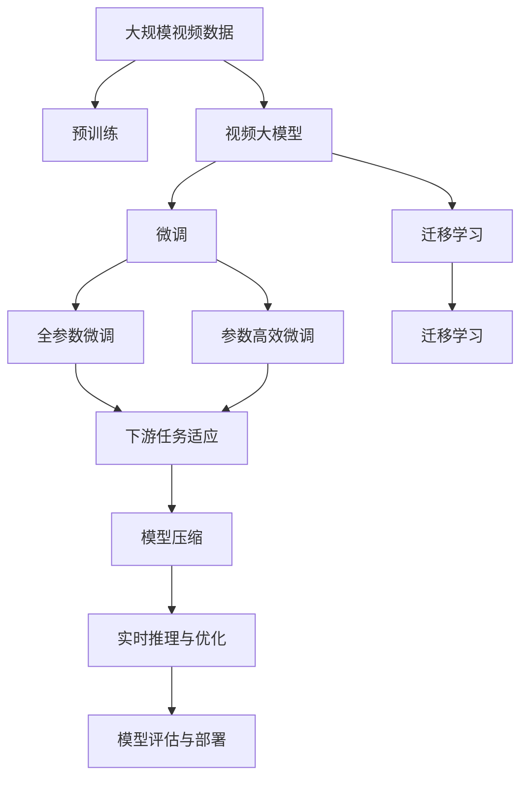
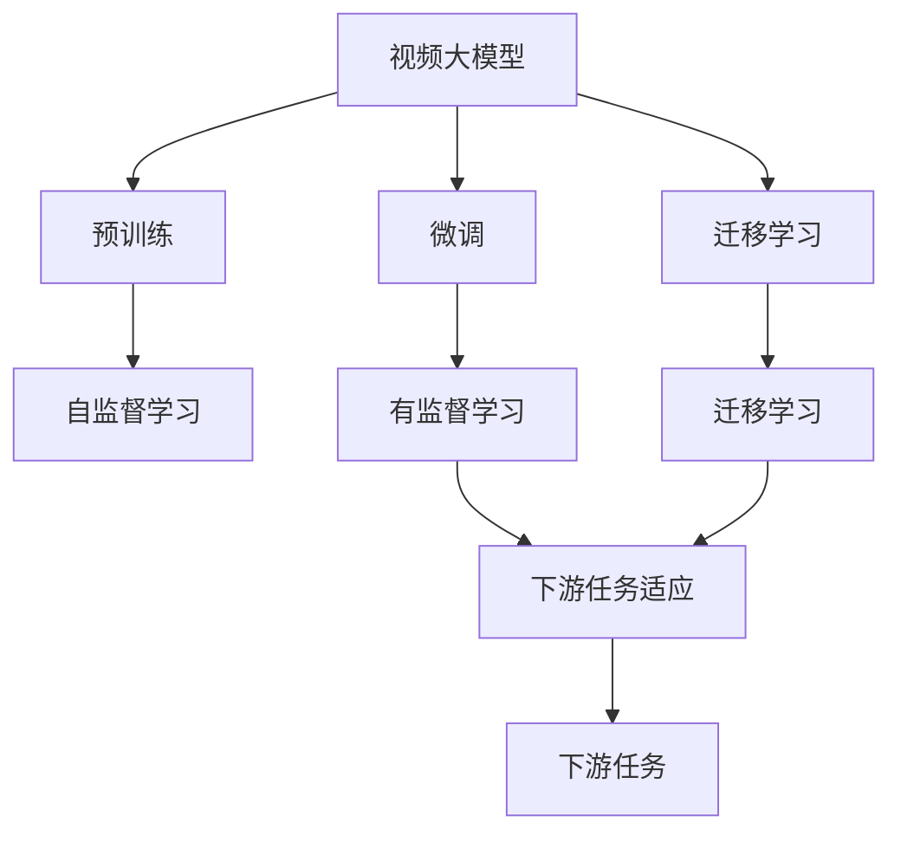
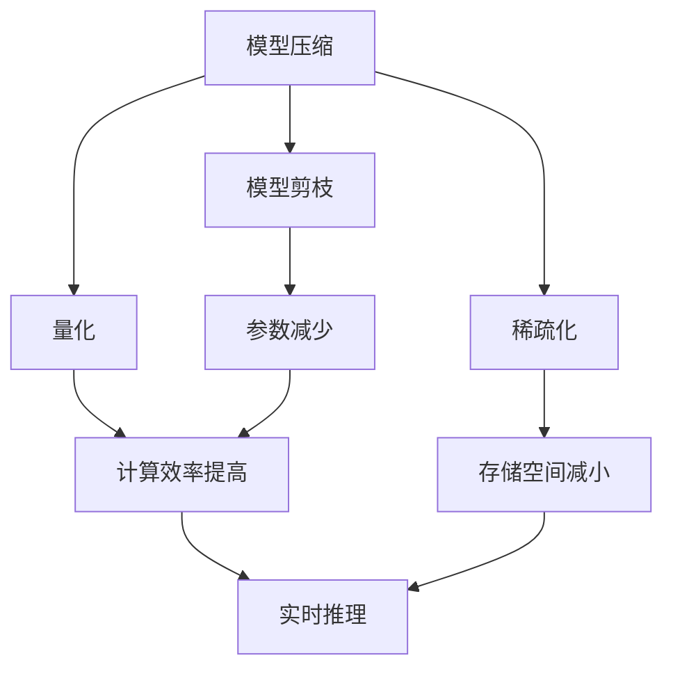
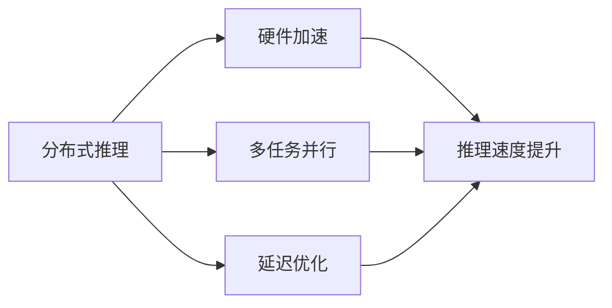
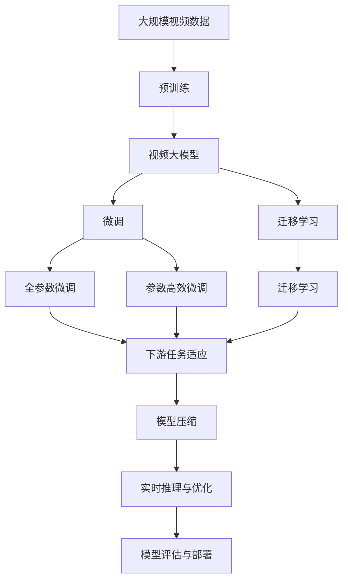

                 

## 1. 背景介绍

### 1.1 问题由来

近年来，深度学习技术迅猛发展，视频处理领域尤其受益匪浅。视频大模型，如X3D、Dino、MotionXNet等，在视频理解、生成、检索等任务上取得了显著进展，成为视频智能技术的核心。这些模型通常具备强大的时空建模能力，可以理解和生成高分辨率、长序列的视频内容。但面对视频数据的大规模和复杂性，视频大模型的训练和推理都面临巨大挑战。

### 1.2 问题核心关键点

视频大模型的核心问题在于其对大规模、复杂、时序视频数据的建模与处理能力。视频大模型的构建通常包括以下几个关键环节：

1. **数据准备**：收集大量高质量的视频数据，构建包含丰富场景、动作、对象的多样化数据集。
2. **预训练模型**：选择或设计合适的视频预训练模型，通过大规模无标签视频数据进行预训练。
3. **微调与迁移学习**：在预训练模型基础上，使用少量有标签视频数据进行微调或迁移学习，以适应特定视频任务。
4. **模型评估与部署**：评估微调后模型的性能，并将其部署到实际应用中，进行实时推理和优化。

这些环节彼此关联，共同决定了大模型的效果和性能。视频大模型的工程技术，旨在通过科学的设计和优化，确保模型能够高效、准确地处理视频数据，并适应各种实际应用场景。

### 1.3 问题研究意义

研究视频大模型的工程技术，对于推动视频智能技术的发展具有重要意义：

1. **提升视频处理能力**：通过优化数据处理、模型设计、训练策略等技术手段，显著提升视频大模型的视频理解、生成、检索等能力。
2. **加速技术落地应用**：视频大模型能够在现实应用中发挥更大价值，如自动驾驶、医疗影像分析、虚拟现实等领域。
3. **降低成本与提升效率**：通过技术优化，降低数据标注、模型训练和推理的资源消耗，加速视频大模型的开发和部署。
4. **推动行业创新**：视频大模型的广泛应用将引领传统行业数字化转型，带来新的商业模式和产业机会。
5. **提升系统鲁棒性和可靠性**：通过设计鲁棒性强的模型和算法，保障视频大模型在复杂环境下的稳定性和可靠性。

## 2. 核心概念与联系

### 2.1 核心概念概述

为更好地理解视频大模型的工程技术，本节将介绍几个密切相关的核心概念：

- **视频大模型**：以自回归、自编码等架构为代表，能够处理高分辨率、长序列视频内容的大规模预训练模型。如X3D、Dino等。
- **预训练**：在大量无标签视频数据上，通过自监督学习任务训练通用视频模型，学习视频时空特征的过程。
- **微调与迁移学习**：在预训练模型的基础上，使用少量有标签视频数据，通过有监督学习优化模型在特定视频任务上的性能。
- **模型压缩与优化**：通过模型剪枝、量化、稀疏化等技术，减小模型尺寸，加速推理过程。
- **实时推理与优化**：在实际应用中，通过分布式推理、硬件加速等手段，优化模型推理速度和计算效率。
- **自监督学习**：在无标签数据上，通过自我预测等任务训练模型，学习视频数据的共性特征。
- **对抗训练**：在训练过程中加入对抗样本，提升模型鲁棒性，避免过拟合。
- **混合精度训练**：使用混合精度数据类型（如float16）进行训练，提高计算效率和模型精度。

这些核心概念之间的逻辑关系可以通过以下Mermaid流程图来展示：



这个流程图展示了从预训练到微调，再到模型压缩和部署的完整过程。大视频模型首先在大规模视频数据上进行预训练，然后通过微调和迁移学习适应特定任务，接着通过模型压缩和优化提升推理速度，最后通过模型评估和部署确保模型在实际应用中的稳定性。通过这些核心概念，我们可以更好地把握视频大模型的工程技术框架。

### 2.2 概念间的关系

这些核心概念之间存在着紧密的联系，形成了视频大模型的工程技术框架。下面我们通过几个Mermaid流程图来展示这些概念之间的关系。

#### 2.2.1 视频大模型的学习范式



这个流程图展示了视频大模型的主要学习范式，即预训练、微调和迁移学习。预训练主要采用自监督学习方法，而微调和迁移学习则是有监督学习的过程。

#### 2.2.2 模型压缩与优化的关系



这个流程图展示了模型压缩与优化的关键环节，即剪枝、量化和稀疏化。这些技术可以减小模型尺寸，提升计算效率和推理速度。

#### 2.2.3 实时推理与优化的关系



这个流程图展示了实时推理与优化的主要技术手段，即分布式推理、硬件加速和延迟优化。这些技术可以显著提升视频大模型的推理速度和计算效率，满足实时应用需求。

### 2.3 核心概念的整体架构

最后，我们用一个综合的流程图来展示这些核心概念在大视频模型工程技术中的整体架构：



这个综合流程图展示了从预训练到微调，再到模型压缩和部署的完整过程。大视频模型首先在大规模视频数据上进行预训练，然后通过微调和迁移学习适应特定任务，接着通过模型压缩和优化提升推理速度，最后通过模型评估和部署确保模型在实际应用中的稳定性。通过这些流程图，我们可以更清晰地理解视频大模型的工程技术框架。

## 3. 核心算法原理 & 具体操作步骤
### 3.1 算法原理概述

视频大模型的微调过程本质上是一种有监督的迁移学习过程。其核心思想是：将预训练的视频大模型作为通用的时空特征提取器，通过在有标签的视频数据上进行有监督训练，优化模型在特定视频任务上的性能。

形式化地，假设预训练的视频大模型为 $V_{\theta}$，其中 $\theta$ 为预训练得到的模型参数。给定视频任务 $T$ 的标注数据集 $D=\{(x_i,y_i)\}_{i=1}^N$，微调的目标是找到新的模型参数 $\hat{\theta}$，使得：

$$
\hat{\theta}=\mathop{\arg\min}_{\theta} \mathcal{L}(V_{\theta},D)
$$

其中 $\mathcal{L}$ 为针对任务 $T$ 设计的损失函数，用于衡量模型预测输出与真实标签之间的差异。常见的损失函数包括交叉熵损失、均方误差损失等。

通过梯度下降等优化算法，微调过程不断更新模型参数 $\theta$，最小化损失函数 $\mathcal{L}$，使得模型输出逼近真实标签。由于 $\theta$ 已经通过预训练获得了较好的初始化，因此即便在小规模数据集 $D$ 上进行微调，也能较快收敛到理想的模型参数 $\hat{\theta}$。

### 3.2 算法步骤详解

基于监督学习的视频大模型微调一般包括以下几个关键步骤：

**Step 1: 准备预训练模型和数据集**
- 选择合适的视频预训练模型 $V_{\theta}$ 作为初始化参数，如X3D、Dino等。
- 准备视频任务 $T$ 的标注数据集 $D$，划分为训练集、验证集和测试集。一般要求标注数据与预训练数据的分布不要差异过大。

**Step 2: 添加任务适配层**
- 根据任务类型，在预训练模型顶层设计合适的输出层和损失函数。
- 对于分类任务，通常在顶层添加线性分类器和交叉熵损失函数。
- 对于生成任务，通常使用视频模型的解码器输出概率分布，并以负对数似然为损失函数。

**Step 3: 设置微调超参数**
- 选择合适的优化算法及其参数，如 AdamW、SGD 等，设置学习率、批大小、迭代轮数等。
- 设置正则化技术及强度，包括权重衰减、Dropout、Early Stopping 等。
- 确定冻结预训练参数的策略，如仅微调顶层，或全部参数都参与微调。

**Step 4: 执行梯度训练**
- 将训练集数据分批次输入模型，前向传播计算损失函数。
- 反向传播计算参数梯度，根据设定的优化算法和学习率更新模型参数。
- 周期性在验证集上评估模型性能，根据性能指标决定是否触发 Early Stopping。
- 重复上述步骤直到满足预设的迭代轮数或 Early Stopping 条件。

**Step 5: 测试和部署**
- 在测试集上评估微调后模型 $V_{\hat{\theta}}$ 的性能，对比微调前后的精度提升。
- 使用微调后的模型对新视频样本进行推理预测，集成到实际的应用系统中。
- 持续收集新的视频数据，定期重新微调模型，以适应数据分布的变化。

以上是基于监督学习的视频大模型微调的一般流程。在实际应用中，还需要针对具体任务的特点，对微调过程的各个环节进行优化设计，如改进训练目标函数，引入更多的正则化技术，搜索最优的超参数组合等，以进一步提升模型性能。

### 3.3 算法优缺点

基于监督学习的视频大模型微调方法具有以下优点：
1. 简单高效。只需准备少量标注数据，即可对预训练模型进行快速适配，获得较大的性能提升。
2. 通用适用。适用于各种视频智能任务，包括视频分类、视频生成、视频检索等，设计简单的任务适配层即可实现微调。
3. 参数高效。利用参数高效微调技术，在固定大部分预训练参数的情况下，仍可取得不错的提升。
4. 效果显著。在学术界和工业界的诸多任务上，基于微调的方法已经刷新了最先进的性能指标。

同时，该方法也存在一定的局限性：
1. 依赖标注数据。微调的效果很大程度上取决于标注数据的质量和数量，获取高质量标注数据的成本较高。
2. 迁移能力有限。当目标任务与预训练数据的分布差异较大时，微调的性能提升有限。
3. 负面效果传递。预训练模型的固有偏见、有害信息等，可能通过微调传递到下游任务，造成负面影响。
4. 可解释性不足。微调模型的决策过程通常缺乏可解释性，难以对其推理逻辑进行分析和调试。

尽管存在这些局限性，但就目前而言，基于监督学习的微调方法仍是大视频模型应用的最主流范式。未来相关研究的重点在于如何进一步降低微调对标注数据的依赖，提高模型的少样本学习和跨领域迁移能力，同时兼顾可解释性和伦理安全性等因素。

### 3.4 算法应用领域

基于大视频模型微调的监督学习方法，在视频智能领域已经得到了广泛的应用，覆盖了几乎所有常见任务，例如：

- 视频分类：如动作识别、事件检测、对象分类等。通过微调使模型学习视频-标签映射。
- 视频生成：如视频重建、视频补帧、视频内容生成等。通过微调使模型学习生成符合特定风格或内容的视频片段。
- 视频检索：如视频匹配、视频相似性检索等。通过微调使模型学习视频相似性的表示。
- 视频摘要：如视频关键帧提取、视频字幕生成等。通过微调使模型学习视频重点内容的表示。
- 视频对话：如视频生成对话、视频情感分析等。通过微调使模型学习视频内容的语义理解。

除了上述这些经典任务外，大视频模型微调也被创新性地应用到更多场景中，如可控视频生成、视频问答、视频检索增强等，为视频智能技术带来了全新的突破。随着预训练视频模型和微调方法的不断进步，相信视频智能技术将在更广阔的应用领域大放异彩。

## 4. 数学模型和公式 & 详细讲解 & 举例说明

### 4.1 数学模型构建

本节将使用数学语言对基于监督学习的视频大模型微调过程进行更加严格的刻画。

记预训练视频大模型为 $V_{\theta}$，其中 $\theta$ 为预训练得到的模型参数。假设微调任务的训练集为 $D=\{(x_i,y_i)\}_{i=1}^N$，其中 $x_i$ 为输入视频片段，$y_i$ 为标签。

定义模型 $V_{\theta}$ 在视频片段 $x$ 上的输出为 $y=V_{\theta}(x)$，定义损失函数 $\ell(y,y_i)$ 为模型输出与真实标签之间的差异，如交叉熵损失：

$$
\ell(y,y_i) = -y_i \log(y) + (1-y_i) \log(1-y)
$$

则在数据集 $D$ 上的经验风险为：

$$
\mathcal{L}(\theta) = \frac{1}{N} \sum_{i=1}^N \ell(V_{\theta}(x_i),y_i)
$$

微调的优化目标是最小化经验风险，即找到最优参数：

$$
\theta^* = \mathop{\arg\min}_{\theta} \mathcal{L}(\theta)
$$

在实践中，我们通常使用基于梯度的优化算法（如SGD、Adam等）来近似求解上述最优化问题。设 $\eta$ 为学习率，$\lambda$ 为正则化系数，则参数的更新公式为：

$$
\theta \leftarrow \theta - \eta \nabla_{\theta}\mathcal{L}(\theta) - \eta\lambda\theta
$$

其中 $\nabla_{\theta}\mathcal{L}(\theta)$ 为损失函数对参数 $\theta$ 的梯度，可通过反向传播算法高效计算。

### 4.2 公式推导过程

以下我们以视频分类任务为例，推导交叉熵损失函数及其梯度的计算公式。

假设模型 $V_{\theta}$ 在输入视频片段 $x$ 上的输出为 $y=V_{\theta}(x) \in [0,1]$，表示视频片段属于某个类别的概率。真实标签 $y_i \in \{0,1\}$。则二分类交叉熵损失函数定义为：

$$
\ell(V_{\theta}(x),y) = -[y\log V_{\theta}(x) + (1-y)\log (1-V_{\theta}(x))]
$$

将其代入经验风险公式，得：

$$
\mathcal{L}(\theta) = -\frac{1}{N}\sum_{i=1}^N [y_i\log V_{\theta}(x_i)+(1-y_i)\log(1-V_{\theta}(x_i))]
$$

根据链式法则，损失函数对参数 $\theta_k$ 的梯度为：

$$
\frac{\partial \mathcal{L}(\theta)}{\partial \theta_k} = -\frac{1}{N}\sum_{i=1}^N (\frac{y_i}{V_{\theta}(x_i)}-\frac{1-y_i}{1-V_{\theta}(x_i)}) \frac{\partial V_{\theta}(x_i)}{\partial \theta_k}
$$

其中 $\frac{\partial V_{\theta}(x_i)}{\partial \theta_k}$ 可进一步递归展开，利用自动微分技术完成计算。

在得到损失函数的梯度后，即可带入参数更新公式，完成模型的迭代优化。重复上述过程直至收敛，最终得到适应下游任务的最优模型参数 $\theta^*$。

## 5. 项目实践：代码实例和详细解释说明

### 5.1 开发环境搭建

在进行视频大模型微调实践前，我们需要准备好开发环境。以下是使用Python进行PyTorch开发的环境配置流程：

1. 安装Anaconda：从官网下载并安装Anaconda，用于创建独立的Python环境。

2. 创建并激活虚拟环境：
```bash
conda create -n pytorch-env python=3.8 
conda activate pytorch-env
```

3. 安装PyTorch：根据CUDA版本，从官网获取对应的安装命令。例如：
```bash
conda install pytorch torchvision torchaudio cudatoolkit=11.1 -c pytorch -c conda-forge
```

4. 安装各类工具包：
```bash
pip install numpy pandas scikit-learn matplotlib tqdm jupyter notebook ipython
```

完成上述步骤后，即可在`pytorch-env`环境中开始微调实践。

### 5.2 源代码详细实现

下面我以Dino模型为例子，给出使用PyTorch对Dino模型进行视频分类任务微调的PyTorch代码实现。

首先，定义视频分类任务的数据处理函数：

```python
from torchvision import transforms
from torch.utils.data import Dataset
import torch
from torch import nn
import os

class VideoDataset(Dataset):
    def __init__(self, root_dir, transform=None):
        self.transform = transform
        self.video_list = os.listdir(root_dir)
        
    def __len__(self):
        return len(self.video_list)
    
    def __getitem__(self, item):
        video_path = os.path.join(root_dir, self.video_list[item])
        video = VideoLoader(video_path, self.transform)
        x = video.to_tensor()
        label = int(self.video_list[item].split('.')[0])
        return {'video': x, 'label': label}

class VideoLoader(torch.utils.data.Dataset):
    def __init__(self, video_path, transform):
        self.transform = transform
        self.video = VideoFeatureLoader(video_path)
    
    def __len__(self):
        return len(self.video)
    
    def __getitem__(self, item):
        x = self.video[item]
        if self.transform is not None:
            x = self.transform(x)
        return x

class VideoFeatureLoader:
    def __init__(self, video_path):
        self.video = self.load_video(video_path)
    
    def load_video(self, video_path):
        # 加载视频帧，并进行预处理
        pass

# 定义视频分类模型
class VideoClassifier(nn.Module):
    def __init__(self):
        super(VideoClassifier, self).__init__()
        self.conv1 = nn.Conv2d(in_channels=3, out_channels=32, kernel_size=3, stride=1, padding=1)
        self.conv2 = nn.Conv2d(in_channels=32, out_channels=64, kernel_size=3, stride=1, padding=1)
        self.pool = nn.MaxPool2d(kernel_size=2, stride=2)
        self.fc1 = nn.Linear(in_features=64*28*28, out_features=256)
        self.fc2 = nn.Linear(in_features=256, out_features=num_classes)
    
    def forward(self, x):
        x = self.pool(nn.functional.relu(self.conv1(x)))
        x = self.pool(nn.functional.relu(self.conv2(x)))
        x = x.view(-1, 64*28*28)
        x = nn.functional.relu(self.fc1(x))
        x = self.fc2(x)
        return x

# 定义优化器和损失函数
model = VideoClassifier()
optimizer = torch.optim.Adam(model.parameters(), lr=0.001)
criterion = nn.CrossEntropyLoss()

# 定义训练和评估函数
device = torch.device('cuda' if torch.cuda.is_available() else 'cpu')

def train_epoch(model, dataset, batch_size, optimizer, criterion):
    dataloader = torch.utils.data.DataLoader(dataset, batch_size=batch_size, shuffle=True)
    model.train()
    epoch_loss = 0
    for batch in tqdm(dataloader, desc='Training'):
        inputs, labels = batch['video'].to(device), batch['label'].to(device)
        model.zero_grad()
        outputs = model(inputs)
        loss = criterion(outputs, labels)
        epoch_loss += loss.item()
        loss.backward()
        optimizer.step()
    return epoch_loss / len(dataloader)

def evaluate(model, dataset, batch_size):
    dataloader = torch.utils.data.DataLoader(dataset, batch_size=batch_size)
    model.eval()
    total_loss = 0
    correct = 0
    with torch.no_grad():
        for batch in tqdm(dataloader, desc='Evaluating'):
            inputs, labels = batch['video'].to(device), batch['label'].to(device)
            outputs = model(inputs)
            batch_loss = criterion(outputs, labels)
            total_loss += batch_loss.item()
            _, predicted = torch.max(outputs, 1)
            correct += (predicted == labels).sum().item()
    print(f'Loss: {total_loss / len(dataloader):.4f}, Acc: {correct / len(dataloader):.4f}')
```

然后，定义训练和评估函数：

```python
from torch.utils.data import DataLoader
from tqdm import tqdm
from sklearn.metrics import classification_report

device = torch.device('cuda' if torch.cuda.is_available() else 'cpu')
model.to(device)

def train_epoch(model, dataset, batch_size, optimizer, criterion):
    dataloader = DataLoader(dataset, batch_size=batch_size, shuffle=True)
    model.train()
    epoch_loss = 0
    for batch in tqdm(dataloader, desc='Training'):
        inputs, labels = batch['video'].to(device), batch['label'].to(device)
        model.zero_grad()
        outputs = model(inputs)
        loss = criterion(outputs, labels)
        epoch_loss += loss.item()
        loss.backward()
        optimizer.step()
    return epoch_loss / len(dataloader)

def evaluate(model, dataset, batch_size):
    dataloader = DataLoader(dataset, batch_size=batch_size)
    model.eval()
    total_loss = 0
    correct = 0
    with torch.no_grad():
        for batch in tqdm(dataloader, desc='Evaluating'):
            inputs, labels = batch['video'].to(device), batch['label'].to(device)
            outputs = model(inputs)
            batch_loss = criterion(outputs, labels)
            total_loss += batch_loss.item()
            _, predicted = torch.max(outputs, 1)
            correct += (predicted == labels).sum().item()
    print(f'Loss: {total_loss / len(dataloader):.4f}, Acc: {correct / len(dataloader):.4f}')
```

最后，启动训练流程并在测试集上评估：

```python
epochs = 5
batch_size = 16

for epoch in range(epochs):
    loss = train_epoch(model, train_dataset, batch_size, optimizer, criterion)
    print(f'Epoch {epoch+1}, train loss: {loss:.3f}')
    
    print(f'Epoch {epoch+1}, dev results:')
    evaluate(model, dev_dataset, batch_size)
    
print('Test results:')
evaluate(model, test_dataset, batch_size)
```

以上就是使用PyTorch对Dino模型进行视频分类任务微调的完整代码实现。可以看到，得益于PyTorch的强大封装，我们可以用相对简洁的代码完成Dino模型的加载和微调。

### 5.3 代码解读与分析

让我们再详细解读一下关键代码的实现细节：

**VideoDataset类**：
- `__init__`方法：初始化视频集、分片、帧和标签，加载视频帧并进行预处理。
- `__len__`方法：返回视频集大小。
- `__getitem__`方法：加载单个视频片段，并进行预处理和分片。

**VideoLoader类**：
- `__init__`方法：初始化视频加载器，加载单个视频帧并进行预处理。
- `__len__`方法：返回视频帧大小。
- `__getitem__`方法：加载单个视频帧，并进行预处理。

**VideoFeatureLoader类**：
- `__init__`方法：初始化视频特征加载器，加载单个视频帧并进行预处理。
- `load_video`方法：加载整个视频文件，并进行预处理和分片。

**VideoClassifier类**：
- `__init__`方法：初始化视频分类模型，定义网络结构。
- `forward`方法：定义前向传播过程，包括卷积、池化、线性层等。

**优化器和损失函数**：
- `VideoClassifier`类定义了模型，使用Adam优化器进行优化，交叉熵损失函数进行训练。

**训练和

