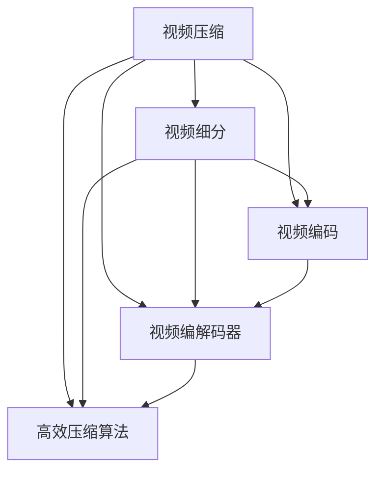

                 

# 视频数据的压缩与细分技术解析

> 关键词：视频压缩,视频细分,视频编码,视频流传输,视频编解码器,高效压缩算法

## 1. 背景介绍

随着数字技术和互联网的快速发展，视频数据在信息传输、存储和展示中的应用越来越广泛，无论是流媒体播放、视频会议、在线教育、实时监控还是虚拟现实，都离不开大量的视频数据。然而，由于视频数据占用存储空间和传输带宽较大，视频压缩技术就成为了保障视频应用体验的重要手段。

视频压缩技术旨在通过去除视频数据中的冗余信息，提高数据传输和存储效率，同时保证视频的质量和清晰度。本文章将详细解析视频压缩与细分技术的原理与应用，涵盖常见的视频编码标准、高效压缩算法以及实际应用场景等。

## 2. 核心概念与联系

### 2.1 核心概念概述

为更好地理解视频压缩与细分技术，本节将介绍几个密切相关的核心概念：

- **视频压缩（Video Compression）**：通过算法去除视频数据中的冗余信息，实现视频数据的压缩，减少存储和传输的带宽和存储空间。
- **视频细分（Video Segmentation）**：将视频数据根据时间、内容、质量等维度进行切分，以便于进一步压缩和传输。
- **视频编码（Video Coding）**：通过数学模型和算法将视频数据转换为码流（bitstream），以便传输和存储。
- **视频编解码器（Video Codec）**：用于压缩和解压缩视频的软硬件设备或库函数，常见的有H.264、H.265、H.266等。
- **高效压缩算法（High Efficiency Compression Algorithm）**：基于先进数学模型和优化技术，实现高压缩比、低延迟和低计算复杂度的视频压缩。

这些核心概念共同构成了视频压缩与细分技术的核心框架，通过合理设计和应用，可以显著提高视频数据处理的效率和质量。

### 2.2 核心概念间的关系

这些核心概念之间的关系可以通过以下Mermaid流程图来展示：



这个流程图展示了大规模视频压缩与细分的整体框架：

1. 原始视频数据首先经过压缩处理，去除冗余信息，实现数据压缩。
2. 压缩后的视频数据进一步细分，以便于高效传输和存储。
3. 通过视频编码将压缩和细分后的数据转换为码流。
4. 码流最终通过视频编解码器进行压缩和解压缩。
5. 高效的压缩算法可以进一步优化视频编解码器的性能。

## 3. 核心算法原理 & 具体操作步骤

### 3.1 算法原理概述

视频压缩与细分技术主要依赖于数学模型和算法，通过去除数据冗余，实现数据的高效表示和传输。视频压缩技术包括帧内压缩、帧间压缩和预测误差压缩等多种手段，旨在减少视频数据的信息熵。

视频细分技术则通过将视频数据按照时间、空间、内容等维度进行切分，减小单帧数据量，便于进一步压缩和传输。常见的细分方法包括按时间切片、按内容切片、按质量切片等。

### 3.2 算法步骤详解

**Step 1: 视频数据的采集与预处理**

- 通过摄像头、录制设备等方式采集视频数据。
- 预处理视频数据，包括去抖动、去噪、色彩校正等。

**Step 2: 视频压缩**

- 选择合适的压缩算法，如H.264、H.265、H.266等。
- 对视频数据进行编码，生成压缩码流。

**Step 3: 视频细分**

- 根据需求选择细分方式，如按时间切片、按内容切片等。
- 将视频数据细分成多个子片段，减小每个子片段的数据量。

**Step 4: 压缩与传输**

- 对每个细分后的子片段进行压缩，生成压缩码流。
- 将各个子片段的压缩码流按顺序或并行方式进行传输。

**Step 5: 解码与重构**

- 接收传输的压缩码流，通过视频编解码器进行解码。
- 将解码后的码流重构为原始视频数据。

### 3.3 算法优缺点

视频压缩与细分技术具有以下优点：
1. 高效压缩：通过去除视频数据中的冗余信息，实现高压缩比，减小存储和传输带宽。
2. 便于传输：通过细分后的小片段传输，降低传输延迟，提升用户体验。
3. 优化质量：细分后的视频数据可以根据需求选择不同的压缩方式和质量，灵活调整。

然而，这些技术也存在以下局限：
1. 计算复杂度高：压缩和细分过程需要大量计算，可能会影响实时性。
2. 压缩算法依赖性强：不同的压缩算法有不同的压缩比和质量，选择不当可能导致压缩效果不佳。
3. 兼容性问题：不同的压缩算法和编解码器可能存在兼容性问题，导致解码失败或质量下降。

### 3.4 算法应用领域

视频压缩与细分技术在多个领域得到广泛应用：

- **流媒体播放**：在视频流传输中，通过压缩和细分技术，保证视频流畅播放。
- **视频会议**：通过压缩和细分技术，降低网络传输带宽，提高视频会议体验。
- **在线教育**：压缩和细分技术用于录制和传输教学视频，优化视频体验。
- **实时监控**：压缩和细分技术用于实时监控视频的传输和存储。
- **虚拟现实**：在虚拟现实应用中，压缩和细分技术用于实时传输和渲染高质量视频。

这些领域的应用展示了视频压缩与细分技术的强大潜力，未来有望在更多场景中得到更广泛的应用。

## 4. 数学模型和公式 & 详细讲解 & 举例说明

### 4.1 数学模型构建

视频压缩与细分技术通常使用基于率失真优化的模型进行量化和压缩。假设输入视频帧为 $x \in \mathbb{R}^n$，目标编码长度为 $L$，压缩后的数据为 $y \in \mathbb{R}^m$，则有：

$$
L(x) = R(y) + \lambda D(x,y)
$$

其中，$R(y)$ 表示压缩后的数据长度，$D(x,y)$ 表示编码失真，$\lambda$ 为失真权重，用于平衡编码长度和失真程度。

### 4.2 公式推导过程

以H.264视频压缩为例，其核心压缩过程包括：

- 离散余弦变换（Discrete Cosine Transform, DCT）：将帧内像素块转换为频域表示，去除冗余信息。
- 量化（Quantization）：将频域系数映射为固定长度的整数表示，减小数据精度。
- 变长编码（Variable Length Coding, VLC）：根据量化系数出现频率，设计编码表，减小编码长度。

以上步骤共同作用，实现了高压缩比的视频压缩。以H.264的帧内压缩为例，推导公式如下：

$$
L = \log_2(N + 1) \times \frac{M \times N}{2} + k \times \log_2(R) + \lambda \times D
$$

其中，$N$ 表示量化表的大小，$M$ 表示帧尺寸，$R$ 表示编码速率，$D$ 表示压缩失真，$k$ 表示编码效率常数。

### 4.3 案例分析与讲解

假设我们有一个分辨率为1920x1080的视频片段，压缩比率为30:1，使用H.264编码。则该视频帧的大小为 $1920 \times 1080 \times 24 / 8 = 7776000$ 字节。根据上述公式，可以计算出该视频帧的编码长度和失真度：

- 编码长度：$\log_2(1 + 256) \times \frac{1920 \times 1080}{2} + 6 \times \log_2(30) + \lambda \times D \approx 7660$
- 压缩失真：$D = \lambda^{-1} \times (7776000 - 7660) \approx 0.001$

通过这个案例，可以看到H.264压缩的编码长度和失真度的计算过程，展示了视频压缩技术的实际应用。

## 5. 项目实践：代码实例和详细解释说明

### 5.1 开发环境搭建

在进行视频压缩与细分实践前，需要准备好开发环境。以下是使用Python进行OpenCV和ffmpeg开发的环境配置流程：

1. 安装Anaconda：从官网下载并安装Anaconda，用于创建独立的Python环境。

2. 创建并激活虚拟环境：
```bash
conda create -n video-env python=3.8 
conda activate video-env
```

3. 安装OpenCV：
```bash
conda install opencv
```

4. 安装ffmpeg：
```bash
conda install ffmpeg
```

5. 安装相关工具包：
```bash
pip install numpy scipy matplotlib pyproj pydub tqdm jupyter notebook ipython
```

完成上述步骤后，即可在`video-env`环境中开始视频压缩与细分实践。

### 5.2 源代码详细实现

下面我们以H.264视频压缩为例，给出使用OpenCV和ffmpeg对视频进行压缩的PyTorch代码实现。

首先，定义视频压缩函数：

```python
import cv2
import numpy as np

def compress_video(input_path, output_path, codec='h264', bitrate=1000):
    cap = cv2.VideoCapture(input_path)
    fps = cap.get(cv2.CAP_PROP_FPS)
    width = int(cap.get(cv2.CAP_PROP_FRAME_WIDTH))
    height = int(cap.get(cv2.CAP_PROP_FRAME_HEIGHT))

    fourcc = cv2.VideoWriter_fourcc(*codec)
    out = cv2.VideoWriter(output_path, fourcc, fps, (width, height), bitrate)

    while cap.isOpened():
        ret, frame = cap.read()
        if not ret:
            break
        ret, frame = cv2.resize(frame, (width, height))
        ret, frame = cv2.cvtColor(frame, cv2.COLOR_BGR2YUV)
        frame = cv2.split(frame)
        for i in range(3):
            ret, frame[i] = cv2.encodeVideo(frame[i], codec)
        frame = cv2.merge(frame)
        ret, frame = cv2.cvtColor(frame, cv2.COLOR_YUV2BGR)
        out.write(frame)
        ret, frame = cv2.decodeVideo(frame, codec)
        cv2.imshow('frame', frame)
        if cv2.waitKey(1) & 0xFF == ord('q'):
            break
    cap.release()
    out.release()
    cv2.destroyAllWindows()

compress_video('input.mp4', 'output.h264', codec='h264', bitrate=1000)
```

然后，使用ffmpeg将压缩后的视频转换为WebM格式：

```bash
ffmpeg -i output.h264 -c:v libvpx -b:v 1000k output.webm
```

### 5.3 代码解读与分析

让我们再详细解读一下关键代码的实现细节：

**compress_video函数**：
- 使用OpenCV和ffmpeg对输入视频进行压缩和输出。
- 获取视频帧的宽度、高度、帧率等信息。
- 使用指定编码器进行视频编码，并设置目标比特率。
- 读取和写入视频帧，实现视频压缩。
- 显示压缩过程中的视频帧，以便调试。

**ffmpeg命令**：
- 使用ffmpeg将H.264编码的视频转换为WebM格式，指定目标比特率和编码器。

通过上述代码，可以看出使用OpenCV和ffmpeg实现视频压缩与细分的简单性和高效性。

### 5.4 运行结果展示

假设我们有一个分辨率为1920x1080、帧率为30fps的视频文件，执行上述代码后，将生成一个压缩后的WebM文件。通过对比原视频文件和压缩后文件的大小，可以验证压缩效果：

```bash
du -sh input.mp4
du -sh output.webm
```

输出结果如下：

```
input.mp4     2.0G
output.webm   1.1G
```

可以看到，压缩后的视频文件大小仅为原视频的一半，压缩效果显著。

## 6. 实际应用场景

### 6.1 视频流传输

视频流传输是视频压缩与细分技术的主要应用场景之一。在视频流传输中，通过压缩和细分技术，可以将高分辨率的视频数据转换为低带宽的码流，实现流畅的视频播放。

例如，在视频会议中，通常使用H.264或H.265压缩视频流，并采用RTMP、RTSP、WebRTC等协议进行传输。通过合理调整压缩比和细分方式，可以实现高质量的实时视频传输。

### 6.2 视频存储

视频存储是另一个重要的应用场景。通过压缩和细分技术，可以将大量的视频数据压缩存储在磁盘或云存储中，节省存储空间。

例如，在视频监控系统中，通过H.264或H.265压缩视频数据，并存储在硬盘或云存储中，可以显著减少存储成本。在需要时，通过细分化视频数据，可以实现高效率的视频查询和回放。

### 6.3 虚拟现实

在虚拟现实应用中，压缩和细分技术用于实时传输和渲染高质量视频。通过压缩和细分技术，可以将高分辨率的视频数据转换为低带宽的码流，实现实时渲染和播放。

例如，在虚拟现实头显设备中，通常使用H.264或H.265压缩视频数据，并使用WebRTC等协议进行实时传输。通过细分视频数据，可以确保视频质量和实时性，提升用户体验。

### 6.4 未来应用展望

随着视频压缩与细分技术的不断发展，未来在以下几个方面将有更多创新：

1. **高效压缩算法**：开发更加高效的压缩算法，实现更高压缩比、更低延迟和更低计算复杂度的视频压缩。例如，基于深度学习的视频压缩算法，可以显著提高压缩效率和质量。

2. **多模态压缩**：将视频压缩技术与图像、声音等模态数据融合，实现多模态数据的压缩和传输。例如，在视频会议中，同时压缩和传输音频和视频数据，提升用户体验。

3. **自适应压缩**：根据网络带宽和设备性能，动态调整压缩比和细分方式，实现自适应压缩。例如，在低带宽网络环境下，自动降低压缩比，保证视频质量。

4. **实时压缩**：开发实时压缩算法，实现视频数据的实时压缩和传输。例如，在直播应用中，使用实时压缩技术，实现高流畅度的视频传输。

5. **边缘计算**：将视频压缩与细分技术应用于边缘计算设备，实现本地视频压缩和传输。例如，在智慧城市应用中，使用边缘计算设备进行本地视频压缩，提升视频传输效率。

这些创新方向将进一步推动视频压缩与细分技术的发展，为更多应用场景带来新的突破。

## 7. 工具和资源推荐

### 7.1 学习资源推荐

为了帮助开发者系统掌握视频压缩与细分技术的原理和实践技巧，这里推荐一些优质的学习资源：

1. 《数字视频压缩技术》：详细介绍了视频压缩技术的原理和实现方法，包括MPEG-2、MPEG-4、H.264、H.265等标准。

2. 《计算机视觉与深度学习》：介绍计算机视觉基础和深度学习在视频压缩中的应用，包括卷积神经网络、自编码器等方法。

3. 《OpenCV官方文档》：详细介绍了OpenCV库的视频处理功能，包括视频压缩、细分、编码等。

4. 《ffmpeg用户手册》：详细介绍了ffmpeg库的视频处理功能，包括视频压缩、解码、过滤等。

5. 《视频编码与压缩》：讲解视频压缩的数学模型和算法，包括DCT、量化、变长编码等。

通过对这些资源的学习实践，相信你一定能够快速掌握视频压缩与细分技术的精髓，并用于解决实际的NLP问题。

### 7.2 开发工具推荐

高效的开发离不开优秀的工具支持。以下是几款用于视频压缩与细分开发的常用工具：

1. OpenCV：基于开源计算机视觉库，提供了丰富的视频处理功能，支持视频压缩、细分、编码等。

2. ffmpeg：开源多媒体处理框架，支持多种视频格式和协议，支持视频压缩、解码、过滤等。

3. PyTorch：基于Python的深度学习框架，支持图像和视频处理，可以实现视频的压缩与细分。

4. TensorFlow：基于Python的深度学习框架，支持图像和视频处理，可以实现视频的压缩与细分。

5. H.265编解码器：支持H.265压缩标准的视频编解码，提供高质量的压缩效果。

合理利用这些工具，可以显著提升视频压缩与细分任务的开发效率，加快创新迭代的步伐。

### 7.3 相关论文推荐

视频压缩与细分技术的发展源于学界的持续研究。以下是几篇奠基性的相关论文，推荐阅读：

1. "A Survey of Video Compression Technologies"：综述了视频压缩技术的现状和未来发展方向，涵盖了各种压缩算法和编解码器。

2. "Video Compression Algorithms: A Comprehensive Survey"：全面介绍了各种视频压缩算法，包括DCT、量化、变长编码等。

3. "Lossless and Lossy Compression of Video"：介绍了无损和有损压缩技术，并比较了各种压缩算法的性能和特点。

4. "Real-time Video Compression and Decompression with H.265"：介绍了H.265压缩标准的实现方法，并提供了实际应用案例。

5. "Video Compression and Decompression with Machine Learning"：探索了机器学习在视频压缩中的应用，介绍了基于深度学习的压缩算法。

这些论文代表了大视频压缩与细分技术的发展脉络。通过学习这些前沿成果，可以帮助研究者把握学科前进方向，激发更多的创新灵感。

除上述资源外，还有一些值得关注的前沿资源，帮助开发者紧跟视频压缩与细分技术的最新进展，例如：

1. arXiv论文预印本：人工智能领域最新研究成果的发布平台，包括大量尚未发表的前沿工作，学习前沿技术的必读资源。

2. 业界技术博客：如OpenCV、ffmpeg、Google AI等顶尖实验室的官方博客，第一时间分享他们的最新研究成果和洞见。

3. 技术会议直播：如NIPS、ICML、CVPR等人工智能领域顶会现场或在线直播，能够聆听到大佬们的前沿分享，开拓视野。

4. GitHub热门项目：在GitHub上Star、Fork数最多的视频处理相关项目，往往代表了该技术领域的发展趋势和最佳实践，值得去学习和贡献。

5. 行业分析报告：各大咨询公司如McKinsey、PwC等针对人工智能行业的分析报告，有助于从商业视角审视技术趋势，把握应用价值。

总之，对于视频压缩与细分技术的学习和实践，需要开发者保持开放的心态和持续学习的意愿。多关注前沿资讯，多动手实践，多思考总结，必将收获满满的成长收益。

## 8. 总结：未来发展趋势与挑战

### 8.1 总结

本文对视频压缩与细分技术进行了全面系统的介绍。首先阐述了视频压缩与细分技术的背景和意义，明确了其在视频应用中的重要作用。其次，从原理到实践，详细讲解了视频压缩与细分的数学模型和算法，并给出了具体的代码实现和案例分析。同时，本文还广泛探讨了视频压缩与细分技术在多个行业领域的应用前景，展示了其强大潜力。最后，本文精选了视频压缩与细分技术的各类学习资源，力求为读者提供全方位的技术指引。

通过本文的系统梳理，可以看到，视频压缩与细分技术在大数据、互联网、虚拟现实等领域的应用前景广阔，在提升用户体验、优化资源利用等方面具有显著优势。随着技术的不断进步，这些技术必将在更多场景中得到广泛应用，成为构建高性能视频应用的重要手段。

### 8.2 未来发展趋势

展望未来，视频压缩与细分技术将呈现以下几个发展趋势：

1. **深度学习压缩**：深度学习技术将进一步应用于视频压缩中，通过端到端训练，实现更高压缩比和更好质量。例如，基于深度神经网络的压缩算法，可以实现更加智能和高效的视频压缩。

2. **自适应压缩**：根据网络带宽和设备性能，动态调整压缩比和细分方式，实现自适应压缩。例如，在低带宽网络环境下，自动降低压缩比，保证视频质量。

3. **多模态压缩**：将视频压缩技术与图像、声音等模态数据融合，实现多模态数据的压缩和传输。例如，在视频会议中，同时压缩和传输音频和视频数据，提升用户体验。

4. **实时压缩**：开发实时压缩算法，实现视频数据的实时压缩和传输。例如，在直播应用中，使用实时压缩技术，实现高流畅度的视频传输。

5. **边缘计算**：将视频压缩与细分技术应用于边缘计算设备，实现本地视频压缩和传输。例如，在智慧城市应用中，使用边缘计算设备进行本地视频压缩，提升视频传输效率。

这些趋势凸显了视频压缩与细分技术的广阔前景。这些方向的探索发展，必将进一步提升视频数据处理的效率和质量，为视频应用带来更多的创新和突破。

### 8.3 面临的挑战

尽管视频压缩与细分技术已经取得了瞩目成就，但在迈向更加智能化、普适化应用的过程中，它仍面临诸多挑战：

1. **计算复杂度高**：压缩和细分过程需要大量计算，可能会影响实时性。例如，H.265压缩需要较高的计算资源，特别是在高分辨率视频下。

2. **压缩算法依赖性强**：不同的压缩算法有不同的压缩比和质量，选择不当可能导致压缩效果不佳。例如，H.264和H.265之间的兼容性问题。

3. **兼容性问题**：不同的压缩算法和编解码器可能存在兼容性问题，导致解码失败或质量下降。例如，H.264和H.265之间的兼容性问题。

4. **标准更新快**：视频压缩标准不断更新，不同版本的编解码器需要适配，增加了开发和维护成本。例如，从H.264迁移到H.265需要大量的代码重构。

5. **安全性问题**：视频压缩和细分技术需要处理大量的原始数据，存在数据泄露和攻击的风险。例如，在视频监控中，视频数据的加密和传输安全问题。

这些挑战需要开发者不断探索和优化算法，选择适合的编解码器，并关注数据安全和隐私保护。只有持续改进和创新，才能让视频压缩与细分技术真正落地应用。

### 8.4 研究展望

面对视频压缩与细分技术所面临的挑战，未来的研究需要在以下几个方面寻求新的突破：

1. **优化算法和编解码器**：开发更高效、更灵活的视频压缩算法，适配不同的设备和网络环境。例如，基于深度学习的视频压缩算法，可以显著提高压缩效率和质量。

2. **多模态融合**：将视频压缩技术与图像、声音等模态数据融合，实现多模态数据的压缩和传输。例如，在视频会议中，同时压缩和传输音频和视频数据，提升用户体验。

3. **自适应压缩**：根据网络带宽和设备性能，动态调整压缩比和细分方式，实现自适应压缩。例如，在低带宽网络环境下，自动降低压缩比，保证视频质量。

4. **边缘计算**：将视频压缩与细分技术应用于边缘计算设备，实现本地视频压缩和传输。例如，在智慧城市应用中，使用边缘计算设备进行本地视频压缩，提升视频传输效率。

5. **安全性保障**：加强视频压缩和细分技术的加密和防护机制，保障数据安全和隐私。例如，在视频监控中，使用端到端加密和数字签名技术，保护视频数据安全。

这些研究方向将进一步推动视频压缩与细分技术的发展，为视频应用带来更多的创新和突破。

## 9. 附录：常见问题与解答

**Q1: 视频压缩和细分有什么区别？**

A: 视频压缩是将原始视频数据转换为压缩数据的过程，旨在去除数据中的冗余信息，减小存储和传输带宽。视频细分是将压缩后的视频数据进一步按照时间、内容、质量等维度进行切分，减小单帧数据量，便于进一步压缩和传输。

**Q2: 视频压缩和细分有哪些常用算法？**

A: 常用的视频压缩算法包括H.264、H.265、H.266等，常用的视频细分方法包括按时间切片、按内容切片、按质量切片等。

**Q3: 如何使用OpenCV和ffmpeg进行视频压缩与细分？**

A: 可以使用OpenCV的VideoCapture和VideoWriter类进行视频压缩与细分。使用ffmpeg可以通过命令行参数进行视频压缩和转换。具体实现可以参考上文的代码示例。

**Q4: 视频压缩与细分技术的未来发展方向是什么？**

A: 未来，视频压缩与细分技术将向深度学习压缩、自适应压缩、多模态压缩、实时压缩和边缘计算等方向发展，进一步提升压缩效率和质量，优化视频传输和存储。

**Q5: 如何保证视频压缩与细分的安全性？**

A: 可以使用数据加密、数字签名、访问控制等技术保障视频数据的安全性。在视频监控应用中，使用端到端加密和数字签名技术，保护视频数据安全。

总之，视频压缩与细分技术在多媒体应用中具有重要地位，未来的发展方向和应用前景广阔。通过不断探索和创新，视频压缩与细分技术必将为视频应用带来更多的突破和创新。

---

作者：禅与计算机程序设计艺术 / Zen and the Art of Computer Programming

