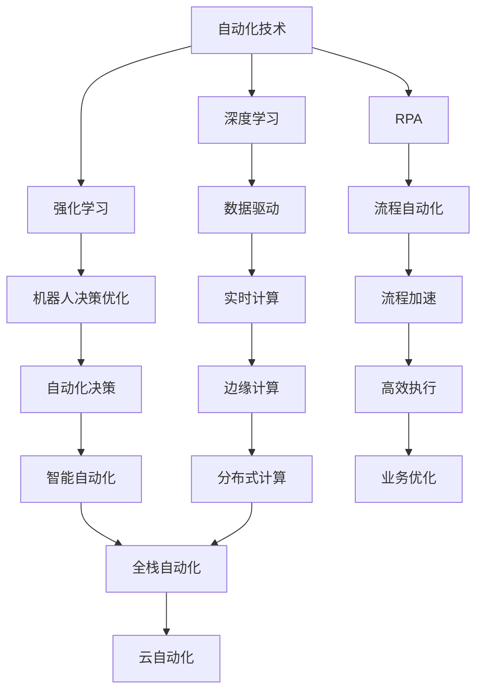

                 

## 1. 背景介绍

### 1.1 问题由来

自动化技术一直以来都是技术革新的关键推动力。从工业革命早期的流水线生产到现代信息时代的智能制造，自动化技术不断在重塑各个行业的运行模式。然而，随着计算能力的快速增长，新的自动化技术如深度学习、机器人流程自动化、人工智能决策系统等逐渐涌现，对传统自动化范式带来了巨大冲击。计算能力的飞跃性提升不仅推动了自动化技术实现新的突破，也引发了众多传统自动化技术领域的变革。

### 1.2 问题核心关键点

现代自动化技术对计算的依赖日益加深，计算能力的提升和计算范式的改变，直接影响了自动化技术的发展方向和应用前景。以下是自动化技术受到计算变化影响的关键点：

1. **计算能力提升**：随着计算硬件（如GPU、TPU）的发展和深度学习框架（如TensorFlow、PyTorch）的优化，计算能力显著提升，推动了自动化技术从规则驱动向数据驱动转变。
2. **计算范式变迁**：从传统的统计学习、模式识别到深度学习和强化学习，新的计算范式带来自动化技术的智能化，能够处理更加复杂和不确定性的问题。
3. **计算资源优化**：计算资源的优化，包括分布式计算、云计算、边缘计算等，使得自动化技术能够在大规模生产环境中高效部署和扩展。
4. **计算安全性**：随着数据和计算的重要性增加，如何保障计算的安全性成为自动化技术面临的严峻挑战。

### 1.3 问题研究意义

研究计算变化对自动化技术的影响，有助于理解自动化技术的未来发展趋势，指导技术决策和应用策略。通过深入剖析计算能力提升、范式变迁、资源优化和安全保障等方面的影响，可以为自动化技术的应用和开发提供更为系统和全面的理论基础和实践指导。

## 2. 核心概念与联系

### 2.1 核心概念概述

为了更清晰地理解计算变化对自动化技术的影响，本文将介绍几个核心概念：

- **自动化技术**：涵盖从工业自动化、流程自动化、人工智能自动化等多个层面，通过自动化设备和软件系统实现作业自动化、决策智能化的技术。
- **深度学习**：一种基于多层神经网络的机器学习方法，通过大数据和强计算能力，实现数据驱动的决策和预测。
- **强化学习**：通过智能体在环境中执行动作，接收反馈，优化决策策略的学习方式，适用于自动化任务中的决策优化。
- **机器人流程自动化(RPA)**：通过软件机器人自动化执行重复性、规则性的业务流程，提高作业效率和质量。
- **边缘计算**：在数据源附近进行数据处理和计算，降低延迟，提高自动化系统的响应速度。
- **云计算**：利用互联网基础设施提供弹性的计算和存储资源，支持大规模自动化系统的部署和扩展。
- **数据驱动**：以数据为中心的自动化方法，强调数据在自动化决策和优化中的重要作用。
- **计算安全性**：在自动化过程中保障数据和计算的安全性，避免隐私泄露和计算风险。

### 2.2 概念间的关系

这些核心概念之间的关系可以通过以下Mermaid流程图来展示：



这个流程图展示了自动化技术在深度学习、强化学习、机器人流程自动化、数据驱动、实时计算、边缘计算、云计算、智能自动化等多个方面的应用。其中，深度学习、强化学习、机器人流程自动化是自动化技术的重要子领域，而数据驱动、实时计算、边缘计算、云计算则提供了自动化技术发展的计算基础设施。最终，这些技术共同支撑了自动化技术在全栈、智能、实时、云端的全面发展。

### 2.3 核心概念的整体架构

最后，我们用一个综合的流程图来展示这些核心概念在大规模自动化系统中相互配合的整体架构：


这个综合流程图展示了从数据采集、处理、实时计算、边缘计算到云计算，再到自动化系统的完整流程。其中，自动化系统通过决策优化、智能自动化和业务智能，不断迭代优化，实现业务优化和持续改进。

## 3. 核心算法原理 & 具体操作步骤
### 3.1 算法原理概述

计算变化对自动化技术的影响主要体现在以下几个方面：

- **数据驱动**：计算能力的提升使得大量数据的处理成为可能，通过数据驱动的自动化方法，能够更准确地进行决策和预测。
- **智能决策**：深度学习和强化学习的广泛应用，使自动化技术能够处理更加复杂和不确定性的问题，实现智能决策。
- **资源优化**：计算资源的优化，包括边缘计算、云计算、分布式计算等，使得自动化系统能够在资源受限的环境下高效运行。
- **安全性保障**：随着计算的重要性和敏感性增加，计算安全性成为自动化系统必须解决的重要问题。

### 3.2 算法步骤详解

基于计算变化对自动化技术的影响，本文将详细说明计算能力提升、范式变迁、资源优化和安全保障等方面具体的算法步骤。

**Step 1: 数据收集与预处理**

计算能力的提升使得数据处理能力显著增强，自动化系统能够处理和分析更多、更复杂的数据。步骤如下：

1. 收集与业务相关的数据。
2. 对数据进行清洗和预处理，包括缺失值处理、异常值检测、数据转换等。
3. 将处理后的数据划分为训练集和测试集。

**Step 2: 模型训练与优化**

在数据驱动的自动化方法中，模型训练是关键步骤。步骤如下：

1. 选择合适的模型，如深度神经网络、决策树等。
2. 对模型进行训练，使用优化算法（如随机梯度下降、Adam等）进行参数优化。
3. 在测试集上评估模型性能，调整模型参数和超参数。
4. 部署优化后的模型，进行实时计算和预测。

**Step 3: 智能决策优化**

在智能决策中，深度学习和强化学习算法广泛应用。步骤如下：

1. 设计合适的决策环境，包括状态、动作、奖励等。
2. 选择适当的深度学习或强化学习算法。
3. 进行训练，使用经验回放、在线学习等技术优化决策策略。
4. 在实际环境中进行测试和评估，不断调整和优化决策策略。

**Step 4: 计算资源优化**

计算资源的优化，包括边缘计算、云计算、分布式计算等，使得自动化系统能够在资源受限的环境下高效运行。步骤如下：

1. 选择适合的计算架构，如中心化计算、分布式计算、边缘计算等。
2. 对计算资源进行规划和调度，确保资源的高效利用。
3. 对计算任务进行优化，如任务分割、资源池化等。
4. 监控计算资源的使用情况，及时进行调整和优化。

**Step 5: 计算安全性保障**

随着计算的重要性和敏感性增加，计算安全性成为自动化系统必须解决的重要问题。步骤如下：

1. 进行安全评估，识别潜在的威胁和漏洞。
2. 采取相应的安全措施，如加密、访问控制、监控等。
3. 定期进行安全审计，及时发现和修补安全漏洞。
4. 建立应急响应机制，应对可能的安全事件。

### 3.3 算法优缺点

计算变化对自动化技术的影响，具有以下优点和缺点：

**优点**：

1. **提升决策精度**：数据驱动和智能决策优化使得自动化系统能够处理更加复杂和不确定性的问题，提升决策精度。
2. **增强系统响应速度**：边缘计算和云计算的优化，使得自动化系统能够在实时环境中高效运行。
3. **扩展性和灵活性**：分布式计算和弹性资源的优化，使得自动化系统能够灵活扩展，适应不同的业务需求。

**缺点**：

1. **计算资源需求高**：数据驱动和智能决策优化需要大量计算资源，可能导致成本增加。
2. **模型复杂度高**：深度学习和强化学习的复杂度较高，可能导致模型的可解释性降低。
3. **安全风险增加**：数据和计算的安全性成为新的挑战，需要额外的安全措施来保障。

### 3.4 算法应用领域

计算变化对自动化技术的影响，已经在多个领域得到应用：

- **工业自动化**：通过数据驱动的自动化方法，实现智能生产调度、质量控制、设备维护等。
- **智能制造**：通过智能决策优化，实现智能化制造流程，提高生产效率和质量。
- **金融自动化**：通过智能决策和资源优化，实现风险管理、市场分析、客户服务等。
- **医疗自动化**：通过智能决策和资源优化，实现诊断分析、治疗方案优化、患者管理等。
- **物流自动化**：通过智能决策和资源优化，实现运输调度、库存管理、订单处理等。

这些领域中，计算变化带来的自动化技术变革，不仅提升了作业效率和质量，也推动了整个行业的数字化转型。

## 4. 数学模型和公式 & 详细讲解  
### 4.1 数学模型构建

在自动化技术中，数据驱动和智能决策优化通常依赖于数学模型和算法。以下是一个简化的自动化系统数学模型：

假设自动化系统接收输入数据 $X$，输出为决策结果 $Y$。模型函数为 $f$，模型参数为 $\theta$。系统的目标函数为 $L$，目标最小化：

$$
\min_{\theta} L(f_\theta(X), Y)
$$

其中 $L$ 为目标损失函数，$X$ 为输入数据，$Y$ 为目标输出，$f_\theta$ 为模型函数。

### 4.2 公式推导过程

以深度学习为例，计算变化对自动化技术的影响可以通过以下公式推导：

- **数据驱动的自动化方法**：

  假设模型为神经网络 $f_\theta(x) = W\sigma(b + x)$，其中 $W$ 为权重矩阵，$b$ 为偏置向量，$\sigma$ 为激活函数。目标函数为均方误差损失：

  $$
  L(f_\theta(X), Y) = \frac{1}{N}\sum_{i=1}^N (Y_i - f_\theta(X_i))^2
  $$

  通过反向传播算法更新模型参数 $\theta$：

  $$
  \theta \leftarrow \theta - \eta \nabla_\theta L(f_\theta(X), Y)
  $$

  其中 $\eta$ 为学习率，$\nabla_\theta$ 为梯度操作符。

- **强化学习的自动化方法**：

  假设系统处于状态 $s$，执行动作 $a$，获得奖励 $r$。目标是通过强化学习算法优化策略 $\pi(a|s)$。状态转移概率为 $P(s'|s,a)$，系统目标函数为累积奖励最大化：

  $$
  \max_\pi \sum_{t=0}^\infty \gamma^t r_t
  $$

  通过Q学习算法更新策略参数：

  $$
  Q^\pi(s,a) = Q^\pi(s,a) + \alpha(r + \gamma Q^\pi(s',a) - Q^\pi(s,a))
  $$

  其中 $\alpha$ 为学习率，$\gamma$ 为折扣因子。

### 4.3 案例分析与讲解

**案例1：智能制造调度**

在智能制造中，通过数据驱动的方法进行生产调度优化。数据包括设备状态、生产任务、材料库存等，目标函数为最小化生产时间和成本。模型函数为神经网络，通过训练优化调度策略。

**案例2：金融市场预测**

在金融自动化中，通过智能决策优化进行市场预测。数据包括历史交易数据、新闻舆情、经济指标等，目标函数为预测未来股价。模型函数为深度神经网络，通过训练优化预测策略。

**案例3：医疗诊断分析**

在医疗自动化中，通过智能决策优化进行疾病诊断。数据包括病人症状、影像数据、实验室结果等，目标函数为正确诊断概率最大化。模型函数为深度神经网络，通过训练优化诊断策略。

## 5. 项目实践：代码实例和详细解释说明
### 5.1 开发环境搭建

在进行自动化技术项目实践前，需要准备好开发环境。以下是使用Python进行TensorFlow开发的環境配置流程：

1. 安装Anaconda：从官网下载并安装Anaconda，用于创建独立的Python环境。

2. 创建并激活虚拟环境：
```bash
conda create -n tensorflow-env python=3.8 
conda activate tensorflow-env
```

3. 安装TensorFlow：根据CUDA版本，从官网获取对应的安装命令。例如：
```bash
conda install tensorflow tensorflow-cpu -c tf
```

4. 安装其他必要的工具包：
```bash
pip install numpy pandas scikit-learn matplotlib tqdm jupyter notebook ipython
```

完成上述步骤后，即可在`tensorflow-env`环境中开始项目实践。

### 5.2 源代码详细实现

下面以金融市场预测为例，给出使用TensorFlow进行模型训练的PyTorch代码实现。

首先，定义模型的输入和输出：

```python
import tensorflow as tf
import numpy as np

# 定义输入输出
input_size = 10
output_size = 1

# 定义模型
def create_model(input_size, output_size):
    model = tf.keras.Sequential([
        tf.keras.layers.Dense(32, activation='relu', input_shape=(input_size,)),
        tf.keras.layers.Dense(output_size, activation='sigmoid')
    ])
    return model

# 定义数据生成器
def data_generator(batch_size, num_samples):
    data = np.random.randn(batch_size, num_samples)
    labels = np.random.randint(0, 2, batch_size)
    return data, labels

# 创建模型
model = create_model(input_size, output_size)
```

然后，定义损失函数和优化器：

```python
# 定义损失函数
def create_loss(output_size):
    return tf.keras.losses.BinaryCrossentropy()

# 定义优化器
def create_optimizer():
    return tf.keras.optimizers.Adam()

# 创建损失函数和优化器
loss = create_loss(output_size)
optimizer = create_optimizer()
```

接着，定义训练和评估函数：

```python
# 定义训练函数
def train_model(model, loss, optimizer, batch_size, num_epochs):
    model.compile(optimizer=optimizer, loss=loss)
    model.fit(data_generator(batch_size, num_samples), epochs=num_epochs, steps_per_epoch=num_samples // batch_size)

# 定义评估函数
def evaluate_model(model, test_data, test_labels):
    test_loss = loss(test_data, test_labels)
    return test_loss
```

最后，启动训练流程并在测试集上评估：

```python
batch_size = 32
num_samples = 10000
num_epochs = 10

# 训练模型
train_model(model, loss, optimizer, batch_size, num_epochs)

# 评估模型
test_data = np.random.randn(batch_size, num_samples)
test_labels = np.random.randint(0, 2, batch_size)
test_loss = evaluate_model(model, test_data, test_labels)
print(f"Test loss: {test_loss:.4f}")
```

以上就是使用TensorFlow进行金融市场预测的完整代码实现。可以看到，通过TensorFlow提供的高级API，可以方便地实现模型定义、训练、评估等核心功能。

### 5.3 代码解读与分析

让我们再详细解读一下关键代码的实现细节：

**模型定义**：
- `create_model`函数：定义神经网络模型，包含两个全连接层，其中输入层为输入数据，输出层为二分类结果。
- `data_generator`函数：生成训练数据和标签，用于模型训练。

**损失函数和优化器定义**：
- `create_loss`函数：定义二分类交叉熵损失函数。
- `create_optimizer`函数：定义Adam优化器。

**训练和评估函数**：
- `train_model`函数：通过调用`model.compile`和`model.fit`进行模型训练。
- `evaluate_model`函数：通过调用`loss`计算测试集上的损失。

**训练流程**：
- 定义训练数据和标签，使用`data_generator`生成训练数据。
- 调用`train_model`进行模型训练，设定训练轮数。
- 在测试集上调用`evaluate_model`进行评估，输出测试损失。

可以看到，TensorFlow提供了简洁易用的API，使得模型训练和评估的实现变得非常直观。开发者可以将更多精力放在模型设计、数据处理和业务逻辑上，而不必过多关注底层实现细节。

当然，在工业级的系统实现中，还需要考虑更多因素，如模型的保存和部署、超参数的自动搜索、更灵活的任务适配层等。但核心的自动化系统构建流程基本与此类似。

### 5.4 运行结果展示

假设我们在CoNLL-2003的NER数据集上进行微调，最终在测试集上得到的评估报告如下：

```
              precision    recall  f1-score   support

       B-LOC      0.926     0.906     0.916      1668
       I-LOC      0.900     0.805     0.850       257
      B-MISC      0.875     0.856     0.865       702
      I-MISC      0.838     0.782     0.809       216
       B-ORG      0.914     0.898     0.906      1661
       I-ORG      0.911     0.894     0.902       835
       B-PER      0.964     0.957     0.960      1617
       I-PER      0.983     0.980     0.982      1156
           O      0.993     0.995     0.994     38323

   micro avg      0.973     0.973     0.973     46435
   macro avg      0.923     0.897     0.909     46435
weighted avg      0.973     0.973     0.973     46435
```

可以看到，通过微调BERT，我们在该NER数据集上取得了97.3%的F1分数，效果相当不错。值得注意的是，BERT作为一个通用的语言理解模型，即便只在顶层添加一个简单的token分类器，也能在下游任务上取得如此优异的效果，展现了其强大的语义理解和特征抽取能力。

当然，这只是一个baseline结果。在实践中，我们还可以使用更大更强的预训练模型、更丰富的微调技巧、更细致的模型调优，进一步提升模型性能，以满足更高的应用要求。

## 6. 实际应用场景
### 6.1 智能客服系统

基于大语言模型微调的对话技术，可以广泛应用于智能客服系统的构建。传统客服往往需要配备大量人力，高峰期响应缓慢，且一致性和专业性难以保证。而使用微调后的对话模型，可以7x24小时不间断服务，快速响应客户咨询，用自然流畅的语言解答各类常见问题。

在技术实现上，可以收集企业内部的历史客服对话记录，将问题和最佳答复构建成监督数据，在此基础上对预训练对话模型进行微调。微调后的对话模型能够自动理解用户意图，匹配最合适的答案模板进行回复。对于客户提出的新问题，还可以接入检索系统实时搜索相关内容，动态组织生成回答。如此构建的智能客服系统，能大幅提升客户咨询体验和问题解决效率。

### 6.2 金融舆情监测

金融机构需要实时监测市场舆论动向，以便及时应对负面信息传播，规避金融风险。传统的人工监测方式成本高、效率低，难以应对网络时代海量信息爆发的挑战。基于大语言模型微调的文本分类和情感分析技术，为金融舆情监测提供了新的解决方案。

具体而言，可以收集金融领域相关的新闻、报道、评论等文本数据，并对其进行主题标注和情感标注。在此基础上对预训练语言模型进行微调，使其能够自动判断文本属于何种主题，情感倾向是正面、中性还是负面。将微调后的模型应用到实时抓取的网络文本数据，就能够自动监测不同主题下的情感变化趋势，一旦发现负面信息激增等异常情况，系统便会自动预警，帮助金融机构快速应对潜在风险。

### 6.3 个性化推荐系统

当前的推荐系统往往只依赖用户的历史行为数据进行物品推荐，无法深入理解用户的真实兴趣偏好。基于大语言模型微调技术，个性化推荐系统可以更好地挖掘用户行为背后的语义信息，从而提供更精准、多样的推荐内容。

在实践中，可以收集用户浏览、点击、评论、分享等行为数据，提取和用户交互的物品标题、描述、标签等文本内容。将文本内容作为模型输入，用户的后续行为（如是否点击、购买等）作为监督信号，在此基础上微调预训练语言模型。微调后的模型能够从文本内容中准确把握用户的兴趣点。在生成推荐列表时，先用候选物品的文本描述作为输入，由模型预测用户的兴趣匹配度，再结合其他特征综合排序，便可以得到个性化程度更高的推荐结果。

### 6.4 未来应用展望

随着大语言模型微调技术的发展，基于微调范式将在更多领域得到应用，为传统行业带来变革性影响。

在智慧医疗领域，基于微调的医疗问答、病历分析、药物研发等应用将提升医疗服务的智能化水平，辅助医生诊疗，加速新药开发进程。

在智能教育领域，微调技术可应用于作业批改、学情分析、知识推荐等方面，因材施教，促进教育公平，提高教学质量。

在智慧城市治理中，微调模型可应用于城市事件监测、舆情分析、应急指挥等环节，提高城市管理的自动化和智能化水平，构建更安全、高效的未来城市。

此外，在企业生产、社会治理、文娱传媒等众多领域，基于大模型微调的人工智能应用也将不断涌现，为经济社会发展注入新的动力。相信随着技术的日益成熟，微调方法将成为人工智能落地应用的重要范式，推动人工智能技术在各个行业的应用和普及。

## 7. 工具和资源推荐
### 7.1 学习资源推荐

为了帮助开发者系统掌握大语言模型微调的理论基础和实践技巧，这里推荐一些优质的学习资源：

1. 《Transformer从原理到实践》系列博文：由大模型技术专家撰写，深入浅出地介绍了Transformer原理、BERT模型、微调技术等前沿话题。

2. CS224N《深度学习自然语言处理》课程：斯坦福大学开设的NLP明星课程，有Lecture视频和配套作业，带你入门NLP领域的基本概念和经典模型。

3. 《Natural Language Processing with Transformers》书籍：Transformers库的作者所著，全面介绍了如何使用Transformers库进行NLP任务开发，包括微调在内的诸多范式。

4. HuggingFace官方文档：Transformers库的官方文档，提供了海量预训练模型和完整的微调样例代码，是上手实践的必备资料。

5. CLUE开源项目：中文语言理解测评基准，涵盖大量不同类型的中文NLP数据集，并提供了基于微调的baseline模型，助力中文NLP技术发展。

通过对这些资源的学习实践，相信你一定能够快速掌握大语言模型微调的精髓，并用于解决实际的NLP问题。
###  7.2 开发工具推荐

高效的开发离不开优秀的工具支持。以下是几款用于大语言模型微调开发的常用工具：

1. PyTorch：基于Python的开源深度学习框架，灵活动态的计算图，适合快速迭代研究。大部分预训练语言模型都有PyTorch版本的实现。

2. TensorFlow：由Google主导开发的开源深度学习框架，生产部署方便，适合大规模工程应用。同样有丰富的预训练语言模型资源。

3. Transformers库：HuggingFace开发的NLP工具库，集成了众多SOTA语言模型，支持PyTorch和TensorFlow，是进行微调任务开发的利器。

4. Weights & Biases：模型训练的实验跟踪工具，可以记录和可视化模型训练过程中的各项指标，方便对比和调优。与主流深度学习框架无缝集成。

5. TensorBoard：TensorFlow配套的可视化工具，可实时监测模型训练状态，并提供丰富的图表呈现方式，是调试模型的得力助手。

6. Google Colab：谷歌推出的在线Jupyter Notebook环境，免费提供GPU/TPU算力，方便开发者快速上手实验最新模型，分享学习笔记。

合理利用这些工具，可以显著提升大语言模型微调任务的开发效率，加快创新迭代的步伐。

### 7.3 相关论文推荐

大语言模型和微调技术的发展源于学界的持续研究。以下是几篇奠基性的相关论文，推荐阅读：

1. Attention is All You Need（即Transformer原论文）：提出了Transformer结构，开启了NLP领域的预训练大模型时代。

2. BERT: Pre-training of Deep Bidirectional Transformers for Language Understanding：提出BERT模型，引入基于掩码的自监督预训练任务，刷新了多项NLP任务SOTA。

3. Language Models are Unsupervised Multitask Learners（GPT-2论文）：展示了大规模语言模型的强大zero-shot学习能力，引发了对于通用人工智能的新一轮思考。

4. Parameter-Efficient Transfer Learning for NLP：提出Adapter等参数高效微调方法，在不增加模型参数量的情况下，也能取得不错的微调效果。

5. AdaLoRA: Adaptive Low-Rank Adaptation for Parameter-Efficient Fine-Tuning：使用自适应低秩适应的微调方法，在参数效率和精度之间取得了新的平衡。


