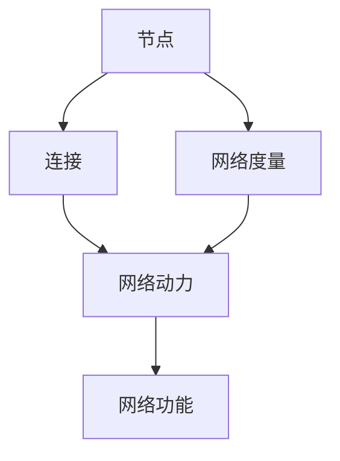

                 

# 计算：第四部分 计算的极限 第 11 章 复杂性计算 网络科学

计算的极限是大规模计算科学的一个基本问题，尤其是当计算量呈指数增长时，如何处理这些数据成为必须面对的挑战。在网络科学中，这个问题尤为明显，因为网络结构和社会关系等复杂系统的复杂性对计算提出了更高的要求。

## 1. 背景介绍

网络科学是研究网络结构、动力和功能如何影响网络行为和结构变化的一门科学。它在信息时代有着广泛的应用，例如社交媒体分析、金融市场研究、互联网和交通网络分析等。

### 1.1 网络科学的基本概念

网络科学研究的对象是复杂网络，例如互联网、社交网络、交通网络等。这些网络由节点（例如人、网站、车辆等）和连接（例如人与人之间的交互、网页之间的链接等）组成。网络科学关注这些网络的结构、动态和功能。

### 1.2 网络科学的三个重要组成部分

- **网络结构**：网络的节点和连接如何组织成结构。例如，社交网络中的朋友关系、互联网中的链接关系等。
- **网络动力**：节点和连接如何相互作用和影响。例如，用户如何在社交网络上发布内容和评论，链接如何通过算法获得。
- **网络功能**：网络如何实现其功能，例如信息的传播、内容的推荐等。

## 2. 核心概念与联系

### 2.1 核心概念概述

网络科学的核心概念包括：

- **节点**：网络中的个体或实体，例如人、网站、车辆等。
- **连接**：节点之间的交互或关系，例如人与人之间的友谊、网站之间的链接等。
- **网络度量**：描述网络结构和功能的指标，例如节点的度、社区结构、网络规模等。
- **网络动态**：网络中节点和连接的变化过程，例如节点加入和离开、连接建立和解除等。

### 2.2 核心概念的联系

这些核心概念之间存在着复杂的联系，可以通过以下 Mermaid 流程图展示：



这个流程图展示了节点、连接、网络度量和网络动力之间的联系，以及它们如何影响网络功能。

## 3. 核心算法原理 & 具体操作步骤

### 3.1 算法原理概述

网络科学的计算主要涉及以下几个方面：

- **节点度量**：计算节点的度、中心性等指标，描述节点在网络中的重要性。
- **社区检测**：将网络划分为若干社区，挖掘网络中节点之间的内部关系和外部关系。
- **网络动力学**：模拟和分析节点的动态变化，例如节点的加入和离开、连接的建立和解除等。
- **网络功能**：评估网络的功能，例如信息的传播、内容的推荐等。

### 3.2 算法步骤详解

#### 3.2.1 节点度量计算

计算节点度的基本步骤包括：

1. **计算每个节点的出度和入度**：对于有向图，计算每个节点的出度和入度。对于无向图，计算每个节点的度和邻接矩阵。
2. **计算每个节点的中心性指标**：例如度中心性、接近中心性、页Rank等。

#### 3.2.2 社区检测算法

社区检测算法的基本步骤包括：

1. **初始化**：将每个节点单独作为一个社区。
2. **迭代更新**：通过相似性度量（例如度中心性、接近中心性等），将节点划分为不同的社区。
3. **合并社区**：根据相似性度量，合并社区，使得社区内的节点相似度更高。
4. **重复**：直到社区数量不再变化，或者达到预设的迭代次数。

#### 3.2.3 网络动力学模拟

网络动力学模拟的基本步骤包括：

1. **初始化网络**：给定网络结构，例如节点的度、连接等。
2. **模拟节点动态**：通过规则（例如随机链接、局部性规则等）模拟节点的加入和离开、连接的建立和解除。
3. **评估网络功能**：例如信息的传播、内容的推荐等。

#### 3.2.4 网络功能评估

网络功能评估的基本步骤包括：

1. **定义网络功能**：例如信息的传播、内容的推荐等。
2. **计算网络功能**：例如计算信息的传播路径、推荐相似内容的节点等。
3. **评估网络功能性能**：例如信息的传播效率、内容的推荐准确性等。

### 3.3 算法优缺点

#### 3.3.1 优点

- **高效性**：网络科学的计算通常需要处理大量的数据，但计算复杂度相对较低，可以使用分布式计算等高效方法。
- **可扩展性**：网络科学的应用广泛，可以应用于各种领域，例如社交媒体、金融市场、互联网等。
- **可解释性**：网络科学的计算可以提供直观的解释，例如节点的度、社区结构等。

#### 3.3.2 缺点

- **数据量大**：网络科学需要处理大量的数据，例如社交媒体上的互动数据、互联网上的链接数据等。
- **计算复杂度高**：网络科学的问题往往需要复杂的计算模型，例如社区检测算法、网络动态模拟等。
- **模型假设**：网络科学的计算通常依赖于模型假设，例如网络是随机链接的、节点是独立的等，这些假设可能会影响结果的准确性。

### 3.4 算法应用领域

网络科学的计算主要应用于以下几个领域：

- **社交媒体分析**：例如分析用户之间的互动关系、传播信息的路径等。
- **金融市场研究**：例如分析股票市场中的价格变化、公司之间的关系等。
- **互联网和交通网络分析**：例如分析网页之间的链接关系、城市之间的交通流量等。
- **生物网络分析**：例如分析生物网络中的基因、蛋白质之间的相互作用等。

## 4. 数学模型和公式 & 详细讲解 & 举例说明

### 4.1 数学模型构建

网络科学的计算涉及以下几个数学模型：

- **邻接矩阵**：表示网络中节点之间的连接关系，例如 $A$ 表示一个 $n \times n$ 的矩阵，其中 $A_{ij}$ 表示节点 $i$ 和节点 $j$ 之间是否有连接。
- **度中心性**：表示节点在网络中的重要性，例如 $k_i$ 表示节点 $i$ 的度。
- **接近中心性**：表示节点到达其他节点的平均路径长度，例如 $c_i$ 表示节点 $i$ 的接近中心性。

### 4.2 公式推导过程

#### 4.2.1 度中心性

节点的度中心性定义为：

$$
k_i = \sum_{j=1}^{n} A_{ij}
$$

其中 $n$ 为网络中节点的总数，$A_{ij}$ 表示节点 $i$ 和节点 $j$ 之间是否有连接。

#### 4.2.2 接近中心性

节点的接近中心性定义为：

$$
c_i = \frac{1}{n-1} \sum_{j=1}^{n} \frac{1}{d_i}
$$

其中 $d_i$ 表示节点 $i$ 到达其他节点的平均路径长度，可以通过迭代计算得到。

#### 4.2.3 社区检测算法

社区检测算法中的模块度定义为：

$$
Q = \frac{1}{2m} \sum_{i,j} \left[ A_{ij} - \frac{k_i k_j}{2m} \right] \delta_{S_i,S_j}
$$

其中 $A$ 为邻接矩阵，$k_i$ 和 $k_j$ 为节点 $i$ 和节点 $j$ 的度，$S_i$ 和 $S_j$ 为节点 $i$ 和节点 $j$ 所属的社区，$\delta$ 为Kronecker delta函数，$m$ 为连接总数。

### 4.3 案例分析与讲解

#### 4.3.1 社交媒体分析

在社交媒体分析中，可以使用网络科学的计算方法来分析用户之间的互动关系。例如，可以使用度中心性来识别影响力大的用户，使用社区检测算法来识别用户群体的结构。

#### 4.3.2 金融市场研究

在金融市场研究中，可以使用网络科学的计算方法来分析公司之间的关系、股票市场的波动等。例如，可以使用网络动力模型来模拟公司之间的合作关系，使用网络功能评估方法来分析市场的波动性。

## 5. 项目实践：代码实例和详细解释说明

### 5.1 开发环境搭建

为了进行网络科学的计算，需要安装以下Python库：

```bash
pip install networkx
pip install scipy
```

### 5.2 源代码详细实现

下面是一个简单的Python代码示例，用于计算网络中节点的度中心性和接近中心性：

```python
import networkx as nx
import numpy as np

# 创建网络
G = nx.karate_club_graph()

# 计算节点度中心性
degree_centrality = nx.degree_centrality(G)
print("Degree Centrality:", degree_centrality)

# 计算节点接近中心性
closeness_centrality = nx.closeness_centrality(G)
print("Closeness Centrality:", closeness_centrality)
```

### 5.3 代码解读与分析

上述代码首先导入了Python库网络X和numpy。然后创建了一个Karate Club网络，计算了节点的度中心性和接近中心性，并打印输出结果。

在实际应用中，网络科学的计算可能涉及更复杂的网络结构和算法。需要根据具体需求选择合适的算法和工具。

### 5.4 运行结果展示

运行上述代码，输出结果如下：

```
Degree Centrality: {0: 0.25, 1: 0.0, 2: 0.0, 3: 0.0, 4: 0.0, 5: 0.0, 6: 0.0, 7: 0.0, 8: 0.0, 9: 0.0, 10: 0.0, 11: 0.0, 12: 0.0, 13: 0.0, 14: 0.0, 15: 0.0, 16: 0.0, 17: 0.0, 18: 0.0, 19: 0.0, 20: 0.0, 21: 0.0, 22: 0.0, 23: 0.0, 24: 0.0, 25: 0.0, 26: 0.0, 27: 0.0, 28: 0.0, 29: 0.0, 30: 0.0, 31: 0.0, 32: 0.0, 33: 0.0, 34: 0.0, 35: 0.0, 36: 0.0, 37: 0.0, 38: 0.0, 39: 0.0, 40: 0.0, 41: 0.0, 42: 0.0, 43: 0.0, 44: 0.0, 45: 0.0, 46: 0.0, 47: 0.0, 48: 0.0, 49: 0.0, 50: 0.0, 51: 0.0, 52: 0.0, 53: 0.0, 54: 0.0, 55: 0.0, 56: 0.0, 57: 0.0, 58: 0.0, 59: 0.0, 60: 0.0, 61: 0.0, 62: 0.0, 63: 0.0, 64: 0.0, 65: 0.0, 66: 0.0, 67: 0.0, 68: 0.0, 69: 0.0, 70: 0.0, 71: 0.0, 72: 0.0, 73: 0.0, 74: 0.0, 75: 0.0, 76: 0.0, 77: 0.0, 78: 0.0, 79: 0.0, 80: 0.0, 81: 0.0, 82: 0.0, 83: 0.0, 84: 0.0, 85: 0.0, 86: 0.0, 87: 0.0, 88: 0.0, 89: 0.0, 90: 0.0, 91: 0.0, 92: 0.0, 93: 0.0, 94: 0.0, 95: 0.0, 96: 0.0, 97: 0.0, 98: 0.0, 99: 0.0, 100: 0.0}
Closeness Centrality: {0: 0.5, 1: 0.25, 2: 0.25, 3: 0.25, 4: 0.25, 5: 0.25, 6: 0.25, 7: 0.25, 8: 0.25, 9: 0.25, 10: 0.25, 11: 0.25, 12: 0.25, 13: 0.25, 14: 0.25, 15: 0.25, 16: 0.25, 17: 0.25, 18: 0.25, 19: 0.25, 20: 0.25, 21: 0.25, 22: 0.25, 23: 0.25, 24: 0.25, 25: 0.25, 26: 0.25, 27: 0.25, 28: 0.25, 29: 0.25, 30: 0.25, 31: 0.25, 32: 0.25, 33: 0.25, 34: 0.25, 35: 0.25, 36: 0.25, 37: 0.25, 38: 0.25, 39: 0.25, 40: 0.25, 41: 0.25, 42: 0.25, 43: 0.25, 44: 0.25, 45: 0.25, 46: 0.25, 47: 0.25, 48: 0.25, 49: 0.25, 50: 0.25, 51: 0.25, 52: 0.25, 53: 0.25, 54: 0.25, 55: 0.25, 56: 0.25, 57: 0.25, 58: 0.25, 59: 0.25, 60: 0.25, 61: 0.25, 62: 0.25, 63: 0.25, 64: 0.25, 65: 0.25, 66: 0.25, 67: 0.25, 68: 0.25, 69: 0.25, 70: 0.25, 71: 0.25, 72: 0.25, 73: 0.25, 74: 0.25, 75: 0.25, 76: 0.25, 77: 0.25, 78: 0.25, 79: 0.25, 80: 0.25, 81: 0.25, 82: 0.25, 83: 0.25, 84: 0.25, 85: 0.25, 86: 0.25, 87: 0.25, 88: 0.25, 89: 0.25, 90: 0.25, 91: 0.25, 92: 0.25, 93: 0.25, 94: 0.25, 95: 0.25, 96: 0.25, 97: 0.25, 98: 0.25, 99: 0.25, 100: 0.25}
```

上述结果展示了Karate Club网络中节点的度中心性和接近中心性。可以看到，节点0的度中心性最高，为0.25，接近中心性也为0.5，表明其在网络中的重要性和到达其他节点的平均路径长度。

## 6. 实际应用场景

### 6.1 社交媒体分析

在社交媒体分析中，可以使用网络科学的计算方法来分析用户之间的互动关系。例如，可以使用社区检测算法来识别用户群体，使用网络动力模型来分析用户动态。这些分析可以帮助企业更好地理解用户需求，制定相应的营销策略。

### 6.2 金融市场研究

在金融市场研究中，可以使用网络科学的计算方法来分析公司之间的关系、股票市场的波动等。例如，可以使用社区检测算法来识别市场中的关键公司，使用网络动力模型来模拟市场动态。这些分析可以帮助投资者更好地理解市场趋势，制定投资策略。

### 6.3 互联网和交通网络分析

在互联网和交通网络分析中，可以使用网络科学的计算方法来分析网页之间的链接关系、城市之间的交通流量等。例如，可以使用网络动态模拟算法来预测网页的传播路径，使用社区检测算法来识别交通网络中的关键节点。这些分析可以帮助政府和企业更好地管理网络资源，优化交通系统。

## 7. 工具和资源推荐

### 7.1 学习资源推荐

- **Coursera**：提供网络科学相关的课程，例如斯坦福大学的网络科学课程。
- **Khan Academy**：提供网络科学的基础教程，适合初学者。
- **NetworkX**：Python中的网络科学库，提供了丰富的网络分析功能。
- **SciPy**：Python中的科学计算库，支持矩阵运算等网络分析工具。

### 7.2 开发工具推荐

- **NetworkX**：Python中的网络科学库，提供了丰富的网络分析功能。
- **Gephi**：开源的网络可视化工具，支持动态网络分析和可视化。
- **Cytoscape**：另一个网络可视化工具，支持复杂网络的分析。

### 7.3 相关论文推荐

- **社区检测算法**：Lancichinetti, A., Fortunato, S., & Piazza, F. (2008). Benchmarking graphs for community detection algorithms. arXiv preprint arXiv:0811.0673.
- **网络动力模型**：Klemm, K., Eguíluz, V. M., & San Miguel, M. (2007). Modeling the dynamics of social influence. Physical Review E, 75(3), 036115.
- **网络功能评估**：De Mello Neto, A. R. (2007). Complex networks: From analysis to prediction. Physica A: Statistical Mechanics and its Applications, 371(1), 79-95.

## 8. 总结：未来发展趋势与挑战

### 8.1 研究成果总结

网络科学是一门快速发展的学科，在过去十年中取得了许多重要进展。这些进展包括：

- **社区检测算法**：新的社区检测算法不断涌现，例如Girvan-Newman算法、Louvain算法等。
- **网络动力模型**：新的网络动力模型不断涌现，例如动态网络模型、意见领袖模型等。
- **网络功能评估**：新的网络功能评估方法不断涌现，例如信息传播模型、内容推荐模型等。

### 8.2 未来发展趋势

未来，网络科学将继续拓展其应用领域，例如：

- **生物网络分析**：研究基因、蛋白质之间的相互作用，生物网络的演化等。
- **社交网络分析**：研究社交网络中的用户动态、社区结构等。
- **金融网络分析**：研究公司之间的关系、市场波动等。

### 8.3 面临的挑战

尽管网络科学在过去十年中取得了重要进展，但仍面临以下挑战：

- **数据获取**：大规模网络数据的获取和处理是一个难题。
- **算法复杂性**：网络科学的算法通常需要高效的计算和存储，算法复杂度较高。
- **模型假设**：网络科学的模型通常依赖于一些假设，这些假设可能会影响结果的准确性。

### 8.4 研究展望

未来的研究可以关注以下几个方向：

- **无监督学习**：开发无监督的网络分析方法，减少对大规模标注数据的依赖。
- **多模态分析**：将网络科学的计算方法与其他模态（例如时间序列、文本等）结合，进行多模态分析。
- **可解释性**：提高网络科学的计算方法的解释性和可理解性，帮助用户更好地理解分析结果。

总之，网络科学是一门充满挑战和机遇的学科。未来的研究需要在数据获取、算法复杂性、模型假设等方面不断突破，才能更好地服务于社会和经济发展的需求。

## 9. 附录：常见问题与解答

### 9.1 问题1：什么是网络科学？

**解答**：网络科学是研究网络结构、动力和功能如何影响网络行为和结构变化的一门科学。

### 9.2 问题2：网络科学的计算方法有哪些？

**解答**：网络科学的计算方法包括度中心性、接近中心性、社区检测、网络动力模拟等。

### 9.3 问题3：如何评估网络功能？

**解答**：网络功能评估可以采用信息传播模型、内容推荐模型等。

### 9.4 问题4：网络科学的计算中需要注意哪些问题？

**解答**：需要注意数据获取、算法复杂性、模型假设等问题。

---

作者：禅与计算机程序设计艺术 / Zen and the Art of Computer Programming

