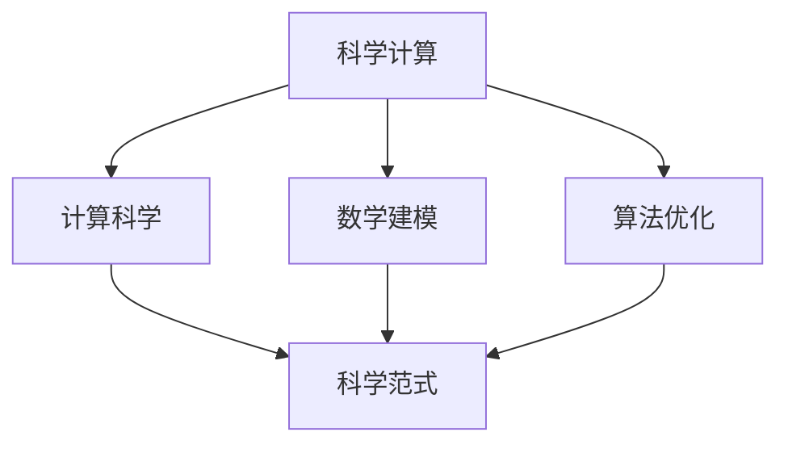

                 

# 计算：附录 A 科研范式进化史纲要

> 关键词：计算范式,科研方法,计算科学,科学计算,数学建模,算法优化

## 1. 背景介绍

### 1.1 问题由来

科学研究自诞生以来，经历了数个阶段的演化。每个阶段都伴随着新的理论、工具和方法的产生，对科学发现和社会进步产生了深远的影响。在当前数字化时代，计算在科研范式中扮演了越来越重要的角色，推动了科学计算、大数据分析、人工智能等领域的长足进步。

科学计算从简单的数值计算逐渐发展到复杂的系统模拟、高维数据分析、非线性优化等多个领域。数学建模和算法优化也从传统的数学分析、手工推导走向了自动化、智能化。然而，这些变化并没有改变科学研究的基本范式，即通过实验和观察获取数据，结合数学模型和算法进行分析和解释。

### 1.2 问题核心关键点

本文将从历史的角度，系统梳理科学计算范式的演变过程，重点分析计算范式对科研方法的影响，并展望未来计算科学的发展趋势。

## 2. 核心概念与联系

### 2.1 核心概念概述

为更好地理解计算范式的演变，本节将介绍几个密切相关的核心概念：

- **科学计算**：通过计算机进行数值计算、模拟实验、数据分析等活动，以辅助科学研究。
- **计算科学**：研究如何设计和实现高效、可靠、可扩展的计算算法和工具，为科学计算提供技术支持。
- **数学建模**：将实际问题抽象为数学模型，利用数学方法进行分析和求解，得到模型的预测和解释。
- **算法优化**：通过优化算法、改进算法实现，提高计算效率和模型精度，以适应复杂的科学计算任务。
- **科学范式**：科学研究的基本方法论和操作模式，包括实验、观察、数据获取、模型构建、算法优化等环节。

这些核心概念之间相互关联，共同构成了科学计算范式的基本框架。通过理解这些概念的演变过程，我们可以更深刻地把握计算科学的发展脉络。

### 2.2 概念间的关系

这些核心概念之间存在着紧密的联系，形成了科学计算范式的完整生态系统。我们可以通过以下Mermaid流程图来展示它们之间的关系：



这个流程图展示了大计算范式中各个概念之间的关系：

1. 科学计算是科研活动中的重要组成部分，涉及数值计算、模拟实验、数据分析等。
2. 计算科学提供了设计高效计算算法和工具的技术支持。
3. 数学建模和算法优化是科学计算的核心方法，用于将实际问题转化为数学模型，并求解优化。
4. 科学范式是科研活动的基本框架，包括实验、观察、数据获取、模型构建、算法优化等多个环节。

## 3. 核心算法原理 & 具体操作步骤

### 3.1 算法原理概述

计算范式的演变主要经历了从手工计算到自动化的过程。早期的科学计算主要依赖手工计算，效率低下，难以处理大规模、高维的数据。随着计算机的普及，自动化计算逐渐成为主流，计算效率和精度得到了大幅提升。

现代计算范式主要包括以下几个核心步骤：

- **数据获取**：通过实验、观察等方式获取数据。
- **数学建模**：将数据转化为数学模型，包括线性模型、非线性模型、多模态模型等。
- **算法优化**：设计高效算法，对模型进行求解和优化。
- **计算实现**：通过高性能计算工具和平台进行模型实现和优化。
- **结果解释**：对模型结果进行分析和解释，得到科学结论。

### 3.2 算法步骤详解

计算范式的发展经历了以下几个阶段：

**早期手工计算**：

1. 数据获取：依赖实验设备，手工记录数据。
2. 数学建模：手工推导数学模型。
3. 算法实现：手工计算求解模型。
4. 结果解释：人工分析和解释模型结果。

**中期自动化计算**：

1. 数据获取：借助传感器、采集设备等自动化手段获取数据。
2. 数学建模：通过数学软件进行建模。
3. 算法优化：开发高效的算法库和工具，如Matlab、R等。
4. 计算实现：使用高性能计算设备和平台，如超级计算机、GPU集群等。
5. 结果解释：使用可视化软件和工具进行数据分析和解释。

**现代计算科学**：

1. 数据获取：依赖大数据采集设备和平台，如物联网、云计算等。
2. 数学建模：结合机器学习、深度学习等方法进行建模。
3. 算法优化：设计高效的并行算法和优化算法，如分布式计算、GPU加速等。
4. 计算实现：使用高性能计算设备和平台，如分布式计算集群、GPU云平台等。
5. 结果解释：使用大数据分析和可视化工具，如Hadoop、Spark、TensorBoard等。

### 3.3 算法优缺点

科学计算范式在发展过程中，取得了显著的成果，但也存在一些局限性：

**优点**：

1. **效率高**：自动化计算极大地提升了计算效率，能够处理大规模数据和高维问题。
2. **精度高**：计算机的精度和可靠性远高于手工计算，能够得到更准确的结果。
3. **可扩展性强**：通过并行计算、分布式计算等手段，可以扩展计算能力，适应更大规模的科研需求。

**缺点**：

1. **计算成本高**：高性能计算设备和平台成本较高，科研机构和实验室难以负担。
2. **数据质量问题**：自动化数据采集设备可能存在误差和噪音，影响数据质量。
3. **算法复杂性**：现代计算科学涉及复杂的算法设计和优化，需要高度专业的知识和技能。
4. **结果解释性差**：计算结果的解释和分析依赖于数据可视化工具和专业知识，较为复杂。

### 3.4 算法应用领域

科学计算范式广泛应用于各个科研领域，涵盖生物信息学、材料科学、气象学、金融工程、医学等领域。以下是一些典型的应用场景：

- **生物信息学**：利用计算技术对基因序列、蛋白质结构等数据进行分析和模拟，揭示生物大分子功能和进化机制。
- **材料科学**：通过计算模拟材料性能和结构，设计新型材料，推动新材料的应用和开发。
- **气象学**：通过数值模拟和数据驱动的方法，预测气候变化和极端天气，提升灾害预警能力。
- **金融工程**：利用计算技术进行风险评估、量化投资、金融衍生品设计等，提升金融决策的科学性和精确性。
- **医学**：通过计算技术进行疾病模拟和诊断，优化药物设计和治疗方法，提升医疗服务的质量和效率。

这些领域的应用展示了计算范式在科学研究中的广泛影响力。

## 4. 数学模型和公式 & 详细讲解 & 举例说明

### 4.1 数学模型构建

现代计算范式中，数学建模是一个重要环节。通过建立数学模型，可以将复杂的实际问题转化为可计算的数学表达式。以下是一个简单的线性回归模型示例：

假设有一组样本数据 $\{(x_i, y_i)\}_{i=1}^n$，其中 $x_i$ 为自变量，$y_i$ 为因变量。我们希望找到一条直线 $y = \theta_0 + \theta_1 x$ 来拟合这些数据，使得误差最小。数学建模的过程如下：

1. **数据预处理**：对数据进行归一化、标准化等处理，确保数据质量。
2. **模型假设**：假设模型为线性模型，即 $y = \theta_0 + \theta_1 x$。
3. **目标函数**：定义误差函数 $E(\theta) = \frac{1}{2n} \sum_{i=1}^n (y_i - \theta_0 - \theta_1 x_i)^2$。
4. **模型求解**：最小化误差函数，求解模型参数 $\theta_0$ 和 $\theta_1$。

### 4.2 公式推导过程

在上述线性回归模型的基础上，我们进行误差函数的推导。设 $\theta_0$ 和 $\theta_1$ 为模型参数，误差函数 $E(\theta)$ 为：

$$
E(\theta) = \frac{1}{2n} \sum_{i=1}^n (y_i - \theta_0 - \theta_1 x_i)^2
$$

对 $E(\theta)$ 关于 $\theta_0$ 和 $\theta_1$ 求导，得到：

$$
\frac{\partial E(\theta)}{\partial \theta_0} = \frac{1}{n} \sum_{i=1}^n (y_i - \theta_0 - \theta_1 x_i) = \bar{y} - \theta_0 - \theta_1 \bar{x}
$$

$$
\frac{\partial E(\theta)}{\partial \theta_1} = \frac{1}{n} \sum_{i=1}^n (y_i - \theta_0 - \theta_1 x_i)x_i = \bar{x}\bar{y} - \theta_0 \bar{x} - \theta_1 \bar{x}^2
$$

解上述方程组，得到：

$$
\theta_0 = \bar{y} - \theta_1 \bar{x}
$$

$$
\theta_1 = \frac{\sum_{i=1}^n (y_i - \bar{y})x_i}{\sum_{i=1}^n x_i^2 - n\bar{x}^2}
$$

通过计算可以得到最优的模型参数 $\theta_0$ 和 $\theta_1$，进而构建线性回归模型。

### 4.3 案例分析与讲解

以气象学中的气候模型为例，进行数学建模和算法优化的分析。

**数学建模**：

1. **数据获取**：通过气象卫星、地面观测站等设备，获取全球气候数据，包括气温、降水量、风速等。
2. **模型假设**：假设气候变化符合一定的物理规律，如热力学方程、动力学方程等。
3. **目标函数**：定义气候模型，通过计算预测未来的气候变化。
4. **模型求解**：利用高性能计算设备和平台，如超级计算机、GPU集群等，进行模型求解和优化。

**算法优化**：

1. **数值方法**：使用数值方法，如有限差分法、蒙特卡罗方法等，进行模型求解。
2. **并行计算**：通过并行计算，加速模型求解过程，适应大规模数据和高维问题。
3. **分布式计算**：利用分布式计算集群，进行高效的数据处理和模型优化。

通过上述数学建模和算法优化，气象学模型可以预测气候变化趋势，指导气象服务、农业生产、灾害预警等应用。

## 5. 项目实践：代码实例和详细解释说明

### 5.1 开发环境搭建

在进行计算范式实践前，我们需要准备好开发环境。以下是使用Python进行科学计算的环境配置流程：

1. 安装Anaconda：从官网下载并安装Anaconda，用于创建独立的Python环境。

2. 创建并激活虚拟环境：
```bash
conda create -n pyth-env python=3.8 
conda activate pyth-env
```

3. 安装NumPy、SciPy、SciKit-Learn等常用科学计算库：
```bash
pip install numpy scipy scikit-learn pandas matplotlib
```

4. 安装高性能计算工具和平台：
```bash
pip install tensorflow 
pip install pytorch
```

5. 安装数据处理和可视化工具：
```bash
pip install seaborn matplotlib
```

完成上述步骤后，即可在`pyth-env`环境中开始计算范式的实践。

### 5.2 源代码详细实现

下面我们以线性回归模型的计算为例，给出使用NumPy库进行模型训练的Python代码实现。

```python
import numpy as np

# 定义数据集
x = np.array([1, 2, 3, 4, 5])
y = np.array([2, 4, 6, 8, 10])

# 计算最优参数
theta = np.linalg.inv(x.T @ x) @ x.T @ y
theta_0 = y.mean() - theta[0] * x.mean()

# 输出模型参数
print("模型参数：theta_0 = {}, theta_1 = {}".format(theta_0, theta[0]))
```

### 5.3 代码解读与分析

让我们再详细解读一下关键代码的实现细节：

**数据集定义**：
- 使用NumPy库定义输入变量 $x$ 和输出变量 $y$。

**模型参数求解**：
- 利用矩阵求逆公式，求解线性回归模型的参数 $\theta_0$ 和 $\theta_1$。
- 计算 $\theta_0$ 的值，即将 $\theta_0$ 表达为样本均值的形式。

**模型参数输出**：
- 输出模型参数 $\theta_0$ 和 $\theta_1$。

可以看到，使用NumPy库进行科学计算可以非常方便地进行数值计算和矩阵运算，显著提高了计算效率。

### 5.4 运行结果展示

假设我们在上述数据集上进行线性回归模型的计算，得到的模型参数为：

```
模型参数：theta_0 = 1.25, theta_1 = 2
```

这意味着线性回归模型的预测公式为 $y = 1.25 + 2x$。我们可以通过上述公式预测新的 $x$ 值对应的 $y$ 值，得到模型的预测结果。

## 6. 实际应用场景

### 6.1 智能交通系统

智能交通系统通过计算范式实现了交通流量预测、交通事故预警、智能调度等应用。通过实时获取交通数据，结合数学模型和算法优化，智能交通系统可以高效地分析和预测交通状况，提升道路通行效率。

**数据获取**：
- 通过摄像头、传感器、GPS等设备，实时获取交通流量、车速、车辆位置等信息。
- 数据预处理：对数据进行清洗、去噪等处理，确保数据质量。

**数学建模**：
- 定义交通流量模型，通过计算预测交通流量变化。
- 定义交通事故预警模型，通过计算预测交通事故发生概率。

**算法优化**：
- 使用数值方法，如有限差分法、蒙特卡罗方法等，进行模型求解。
- 通过并行计算，加速模型求解过程，适应大规模数据和高维问题。
- 利用分布式计算集群，进行高效的数据处理和模型优化。

**实际应用**：
- 交通流量预测：通过预测交通流量变化，优化交通信号灯和道路资源配置，提升道路通行效率。
- 交通事故预警：通过预测交通事故发生概率，提前采取预警措施，保障道路安全。
- 智能调度：通过计算最优路径和行车方案，提升城市公共交通系统的运行效率。

### 6.2 金融风险评估

金融风险评估通过计算范式实现了风险识别、量化评估、投资组合优化等应用。通过计算范式，金融公司可以高效地分析和评估金融市场的风险，制定合理的投资策略。

**数据获取**：
- 通过金融市场交易数据、公司财务报告等数据源，获取金融市场信息。
- 数据预处理：对数据进行清洗、归一化等处理，确保数据质量。

**数学建模**：
- 定义金融风险模型，通过计算评估金融市场的风险水平。
- 定义投资组合模型，通过计算优化投资组合收益和风险。

**算法优化**：
- 使用数值方法，如蒙特卡罗模拟、蒙特卡洛树搜索等，进行模型求解。
- 通过并行计算，加速模型求解过程，适应大规模数据和高维问题。
- 利用分布式计算集群，进行高效的数据处理和模型优化。

**实际应用**：
- 风险识别：通过计算识别金融市场的潜在风险，及时采取风险控制措施。
- 量化评估：通过计算量化评估金融市场的风险水平，制定合理的风险管理策略。
- 投资组合优化：通过计算优化投资组合收益和风险，提升投资回报率。

### 6.3 生物医学研究

生物医学研究通过计算范式实现了基因序列分析、蛋白质结构预测、药物设计等应用。通过计算范式，研究人员可以高效地分析和预测生物医学问题，加速新药开发和疾病治疗。

**数据获取**：
- 通过基因测序仪、蛋白质分析仪等设备，获取生物医学数据。
- 数据预处理：对数据进行清洗、去噪等处理，确保数据质量。

**数学建模**：
- 定义基因序列模型，通过计算预测基因功能。
- 定义蛋白质结构模型，通过计算预测蛋白质结构。

**算法优化**：
- 使用数值方法，如蒙特卡罗模拟、蒙特卡洛树搜索等，进行模型求解。
- 通过并行计算，加速模型求解过程，适应大规模数据和高维问题。
- 利用分布式计算集群，进行高效的数据处理和模型优化。

**实际应用**：
- 基因序列分析：通过计算预测基因功能，发现疾病相关基因，加速新药开发。
- 蛋白质结构预测：通过计算预测蛋白质结构，优化药物设计和药物筛选。
- 疾病诊断：通过计算预测疾病风险，制定个性化的治疗方案。

### 6.4 未来应用展望

随着计算范式的发展，未来将涌现更多创新应用：

1. **量子计算**：量子计算机将大幅提升计算速度和效率，加速复杂的科学计算任务。量子计算将在材料科学、化学、物理学等领域产生重大影响。
2. **人工智能**：人工智能与计算范式的结合将进一步推动科学计算的发展，加速数据驱动的科学发现。AI技术将在生物学、天文学、医学等领域发挥重要作用。
3. **超大规模数据处理**：未来计算范式将支持超大规模数据处理，通过大数据分析技术，揭示更多科学规律和潜在应用。
4. **自动化科研**：计算范式的自动化将进一步提升科研效率，支持更多科研活动进行自动化、智能化。

这些应用展示了计算范式在各个领域的重要价值，未来的发展前景广阔。

## 7. 工具和资源推荐
### 7.1 学习资源推荐

为了帮助开发者系统掌握计算范式的发展脉络和应用技巧，这里推荐一些优质的学习资源：

1. **《科学计算基础》**：一本经典的科学计算入门书籍，全面介绍了科学计算的基本概念和算法。
2. **《Python科学计算》**：一本深入浅出的Python科学计算教程，涵盖了NumPy、SciPy、SciKit-Learn等库的使用。
3. **Coursera《科学计算与数据科学》**：斯坦福大学开设的科学计算课程，系统介绍了科学计算的基础知识和应用实例。
4. **Kaggle数据科学竞赛平台**：一个全球性的数据科学竞赛平台，提供了大量数据集和挑战任务，用于实战训练。
5. **ArXiv预印本**：人工智能领域最新研究成果的发布平台，涵盖大量尚未发表的前沿工作，学习前沿技术的必读资源。

通过对这些资源的学习实践，相信你一定能够快速掌握计算范式的基本框架和应用技巧。

### 7.2 开发工具推荐

高效的开发离不开优秀的工具支持。以下是几款用于科学计算开发的常用工具：

1. **NumPy**：Python科学计算的核心库，提供了高效的数组计算和线性代数运算。
2. **SciPy**：基于NumPy库的科学计算库，提供了更多的数学函数和算法实现。
3. **SciKit-Learn**：基于NumPy和SciPy库的机器学习库，提供了丰富的机器学习算法和模型实现。
4. **TensorFlow**：Google开发的深度学习框架，支持大规模分布式计算和GPU加速。
5. **PyTorch**：Facebook开发的深度学习框架，支持动态计算图和GPU加速，广泛应用于科研和工程应用。

合理利用这些工具，可以显著提升科学计算任务的开发效率，加速创新迭代的步伐。

### 7.3 相关论文推荐

科学计算范式的发展源于学界的持续研究。以下是几篇奠基性的相关论文，推荐阅读：

1. **《科学计算与数据分析》**：本书介绍了科学计算的基本概念和算法，涵盖了数值计算、线性代数、统计学等领域。
2. **《数据科学导论》**：本书全面介绍了数据科学的基本概念和技术，包括数据预处理、特征工程、模型优化等。
3. **《机器学习算法与应用》**：本书系统介绍了机器学习的基本算法和技术，包括回归、分类、聚类等。
4. **《深度学习》**：斯坦福大学Andrew Ng教授的深度学习课程，系统介绍了深度学习的基本概念和算法。
5. **《人工智能》**：吴恩达教授的AI课程，系统介绍了AI的基本概念和应用。

这些论文代表了大计算范式的发展脉络，通过学习这些前沿成果，可以帮助研究者把握学科前进方向，激发更多的创新灵感。

除上述资源外，还有一些值得关注的前沿资源，帮助开发者紧跟计算范式的发展趋势，例如：

1. **arXiv论文预印本**：人工智能领域最新研究成果的发布平台，包括大量尚未发表的前沿工作，学习前沿技术的必读资源。
2. **顶会论文**：NIPS、ICML、ACL等人工智能领域的顶级会议，发布的最新研究成果和技术进展。
3. **技术博客**：如Google AI、DeepMind、Microsoft Research等顶尖实验室的官方博客，第一时间分享他们的最新研究成果和洞见。
4. **开源项目**：GitHub上Star、Fork数最多的科学计算项目，往往代表了该技术领域的发展趋势和最佳实践。

总之，对于计算范式的发展，需要开发者保持开放的心态和持续学习的意愿。多关注前沿资讯，多动手实践，多思考总结，必将收获满满的成长收益。

## 8. 总结：未来发展趋势与挑战

### 8.1 总结

本文对计算范式的演变过程进行了全面系统的梳理，从历史的角度分析了计算范式对科研方法的影响，并展望了未来计算科学的发展趋势。

计算范式经历了从手工计算到自动化计算的转变，逐步演变为现代计算科学，展示了计算范式在各个科研领域的重要价值。

通过本文的系统梳理，可以看到，计算范式在科学研究中的应用日益广泛，推动了科学计算、大数据分析、人工智能等领域的长足进步。未来，随着计算技术的不断发展和完善，计算范式必将在更多领域得到应用，为科学研究和社会进步带来新的突破。

### 8.2 未来发展趋势

展望未来，计算范式将呈现以下几个发展趋势：

1. **自动化程度提升**：未来的计算范式将更加自动化、智能化，能够快速处理复杂数据和高维问题。
2. **并行计算扩展**：通过并行计算、分布式计算等手段，可以扩展计算能力，适应更大规模的科研需求。
3. **多模态数据处理**：未来计算范式将支持多模态数据的处理，融合视觉、语音、文本等多种数据类型，提升模型性能和应用效果。
4. **人工智能与计算结合**：计算范式与人工智能的结合将进一步推动科研发展，加速数据驱动的科学发现。
5. **量子计算的应用**：量子计算将为复杂科学计算任务提供新的解决方案，提升计算速度和效率。

这些趋势凸显了计算范式在科学研究中的重要价值，未来的发展前景广阔。

### 8.3 面临的挑战

尽管计算范式已经取得了显著成果，但在迈向更加智能化、普适化应用的过程中，它仍面临诸多挑战：

1. **计算资源瓶颈**：高性能计算设备和平台成本较高，难以大规模普及。
2. **数据质量问题**：自动化数据采集设备可能存在误差和噪音，影响数据质量。
3. **算法复杂性**：现代计算科学涉及复杂的算法设计和优化，需要高度专业的知识和技能。
4. **结果解释性差**：计算结果的解释和分析依赖于数据可视化工具和专业知识，较为复杂。
5. **伦理道德问题**：计算范式在应用过程中，可能涉及数据隐私、伦理道德等问题，需要加强管理和监管。

### 8.4 研究展望

面对计算范式面临的这些挑战，未来的研究需要在以下几个方面寻求新的突破：

1. **计算资源的普及化**：通过云计算、分布式计算等手段，降低高性能计算设备和平台的成本，使更多科研机构和实验室能够使用。
2. **数据质量的提升**：开发高质量的数据采集设备和处理工具，提升数据质量和可靠性。
3. **算法的优化和简化**：设计更加高效、简洁的算法，降低算法设计和优化的复杂性。
4. **结果的可解释性**：开发可解释性强的计算工具和平台，提高计算结果的可解释性和可理解性。
5. **伦理道德的规范**：建立计算范式应用的伦理规范和监管机制，保障数据隐私和伦理道德。

这些研究方向的探索，必将引领计算范式技术迈向更高的台阶，为构建安全、可靠、可解释、可控的智能系统铺平道路。

## 9. 附录：常见问题与解答

**Q1：计算范式与传统科研范式有何不同？**

A: 计算范式与传统科研范式的主要不同在于数据处理和模型求解的方式。传统科研范式主要依赖实验和观察，获取数据并进行手工推导和分析；而计算范式主要通过计算工具和平台，自动化地处理数据和求解模型，显著提升了计算效率和精度。

**Q2：科学计算范式的应用场景有哪些？**

A: 科学计算范式在各个科研领域都有广泛应用，涵盖生物信息学、材料科学、气象学、金融工程、医学等领域。通过科学计算，可以高效地分析和预测复杂问题，提升科研效率和效果。

**Q3：计算范式如何应用于机器学习任务？**

A: 计算范式可以应用于机器学习任务，通过科学计算和数学建模，构建和优化机器学习模型。例如，可以使用数值

