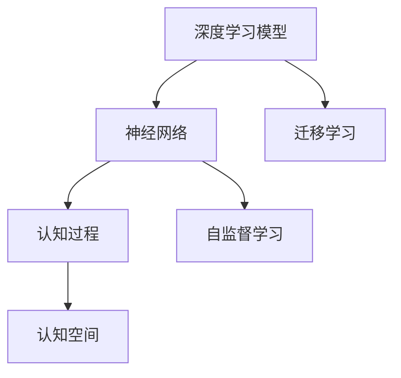
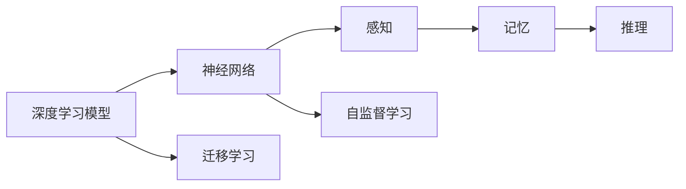
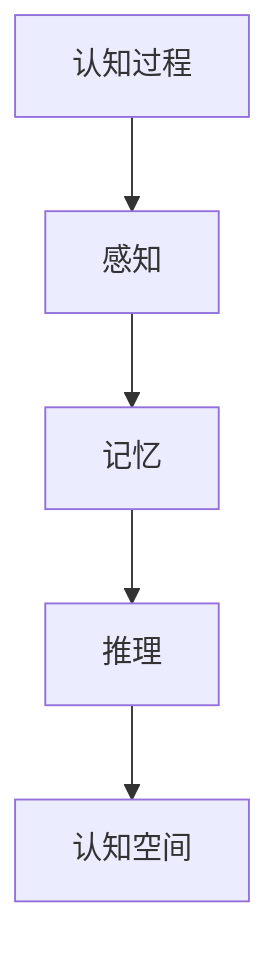
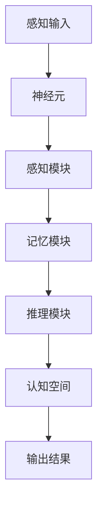

                 

# 认知的形式化：人类基于大脑皮层复杂神经网络形成的认知空间

## 1. 背景介绍

### 1.1 问题由来
在深度学习和认知科学的交叉领域，研究者们正努力探讨神经网络是如何模仿人类大脑的认知过程的。这一领域不仅对人工智能的发展至关重要，而且对理解人类大脑的工作原理也有深远的意义。尽管深度学习模型在图像识别、自然语言处理等任务上取得了巨大成功，但在理解其内部的认知机制方面仍存在诸多局限。

### 1.2 问题核心关键点
认知的形式化是研究深度学习模型与人类大脑认知机制的桥梁。通过形式化认知过程，研究人员可以更好地理解深度学习模型中的神经网络如何编码和处理信息，并探索如何将认知科学的知识应用于模型的设计和优化。

### 1.3 问题研究意义
研究认知形式化对于推动人工智能和认知科学的发展具有重要意义：

- **增强模型性能**：通过模拟人类认知过程，可以设计出更高效、更鲁棒的深度学习模型。
- **促进跨学科交流**：将认知科学的方法引入人工智能，有助于不同领域的研究者共享知识和发现新思路。
- **提升模型的可解释性**：通过形式化认知机制，可以为深度学习模型提供更多的解释和理解，有助于消除“黑盒”模型的问题。
- **推动智能系统的普及**：理解人类认知机制可以帮助开发更加安全、可控和可解释的智能系统，促进其在各个行业的应用。

## 2. 核心概念与联系

### 2.1 核心概念概述

为了深入探讨认知的形式化，本节将介绍几个密切相关的核心概念：

- **深度学习模型**：由多层神经网络构成的模型，通过反向传播算法进行训练，能够学习数据的复杂特征和模式。
- **神经网络**：由神经元节点和连接权重构成的图结构，模拟人类大脑的神经元结构和突触连接。
- **认知过程**：包括感知、记忆、推理等心理活动，涉及信息的接收、处理和存储。
- **认知空间**：基于神经网络的认知模型所构建的抽象概念空间，用于表示和推理信息。
- **自监督学习**：通过未标注的数据进行训练，无需人工标注，适用于大规模数据集。
- **迁移学习**：在特定任务上训练的模型，可以迁移到其他任务上，提高模型泛化能力。

这些概念之间的逻辑关系可以通过以下Mermaid流程图来展示：



### 2.2 概念间的关系

这些核心概念之间存在着紧密的联系，形成了认知形式化的完整生态系统。下面我们通过几个Mermaid流程图来展示这些概念之间的关系：

#### 2.2.1 深度学习模型的认知范式



这个流程图展示了深度学习模型的认知范式：

1. 深度学习模型通过神经网络实现感知功能。
2. 感知功能输出通过记忆模块进行存储和保留。
3. 记忆模块通过推理模块进行信息处理和逻辑推理。
4. 神经网络通过自监督学习方法进行训练，提高模型性能。
5. 模型通过迁移学习机制，在不同任务上提升泛化能力。

#### 2.2.2 认知空间的形式化



这个流程图展示了认知空间的形式化过程：

1. 认知过程通过感知模块接收输入信息。
2. 感知模块输出信息通过记忆模块进行存储。
3. 记忆模块信息通过推理模块进行处理。
4. 推理模块输出结果形成认知空间，用于表示和推理信息。

#### 2.2.3 认知空间与深度学习模型的结合


这个流程图展示了认知空间与深度学习模型的结合方式：

1. 深度学习模型通过神经网络实现感知和记忆功能。
2. 认知空间基于神经网络的感知和记忆模块进行构建。
3. 推理模块在认知空间中对信息进行逻辑推理。

### 2.3 核心概念的整体架构

最后，我们用一个综合的流程图来展示这些核心概念在大脑皮层复杂神经网络中的整体架构：



这个综合流程图展示了从感知输入到输出结果的完整认知过程：

1. 感知输入通过神经元进行传递和处理。
2. 感知模块输出信息通过记忆模块进行存储。
3. 记忆模块信息通过推理模块进行处理。
4. 推理模块输出结果形成认知空间，用于表示和推理信息。
5. 认知空间输出最终结果。

通过这些流程图，我们可以更清晰地理解深度学习模型与人类大脑认知机制之间的联系和差异。

## 3. 核心算法原理 & 具体操作步骤
### 3.1 算法原理概述

认知的形式化是一个多层次、多维度的过程，涉及到神经网络、感知、记忆、推理等多个方面。本节将介绍形式化认知过程的算法原理，并给出具体的操作步骤。

### 3.2 算法步骤详解

形式化认知过程通常包括以下几个关键步骤：

**Step 1: 定义认知模型**

- 选择合适的深度学习框架，如TensorFlow、PyTorch等。
- 设计神经网络结构，定义感知、记忆和推理模块的接口和参数。

**Step 2: 训练感知模块**

- 收集大量未标注数据，定义感知模块的损失函数。
- 使用自监督学习方法进行训练，如对比学习、无监督特征学习等。
- 定期在验证集上评估感知模块的性能，防止过拟合。

**Step 3: 训练记忆模块**

- 利用感知模块输出，定义记忆模块的损失函数。
- 对记忆模块进行训练，学习存储和保留信息的能力。
- 使用正则化技术，如Dropout、L2正则化等，防止信息丢失。

**Step 4: 训练推理模块**

- 定义推理模块的输入和输出，定义推理任务和目标函数。
- 利用记忆模块中的信息，训练推理模块进行逻辑推理和信息处理。
- 使用对抗训练、数据增强等技术提高推理模块的鲁棒性。

**Step 5: 构建认知空间**

- 基于神经网络的感知、记忆和推理模块，构建认知空间。
- 定义认知空间的查询接口和推理规则，支持信息检索和逻辑推理。
- 定期在测试集上评估认知空间的性能，确保其正确性和有效性。

**Step 6: 应用认知空间**

- 将认知空间应用到实际任务中，进行信息检索和推理。
- 通过推理模块输出结果，供实际应用使用。
- 持续收集新数据，更新认知空间中的信息，提高模型的泛化能力。

### 3.3 算法优缺点

形式化认知过程的优点包括：

1. **高效性**：通过定义清晰的认知模型和推理规则，可以显著提高信息处理的效率。
2. **可解释性**：通过形式化认知过程，可以为深度学习模型提供更多的解释和理解，有助于消除“黑盒”模型的问题。
3. **泛化能力**：认知模型在多次训练和推理后，能够学习更广泛的认知规律，提高模型的泛化能力。

形式化认知过程的缺点包括：

1. **复杂性**：构建认知空间和定义推理规则需要较高的理论基础和实践经验。
2. **数据依赖**：认知模型需要大量的未标注数据进行训练，数据获取成本较高。
3. **可扩展性**：在处理复杂的多层次认知过程时，可能需要构建多级认知空间，增加了系统的复杂度。

### 3.4 算法应用领域

形式化认知过程在多个领域都有广泛的应用：

- **自然语言处理(NLP)**：通过构建认知空间，可以进行文本理解、情感分析、问答系统等任务。
- **计算机视觉(CV)**：通过定义感知、记忆和推理模块，可以实现图像分类、目标检测、图像生成等任务。
- **机器人控制**：通过构建认知空间，机器人可以理解环境信息、制定决策和执行动作。
- **智能推荐系统**：通过构建认知空间，可以理解用户需求、推荐相关物品和内容。
- **医疗诊断**：通过构建认知空间，可以分析医学图像、提取特征和辅助诊断。

## 4. 数学模型和公式 & 详细讲解
### 4.1 数学模型构建

形式化认知过程可以通过数学模型进行描述和推导。下面我们将以一个简单的认知模型为例，详细讲解其数学模型构建和公式推导过程。

假设认知模型由感知模块、记忆模块和推理模块构成。感知模块的输入为 $x$，输出为 $h(x)$；记忆模块的输入为 $h(x)$，输出为 $m(h(x))$；推理模块的输入为 $m(h(x))$，输出为 $r(m(h(x)))$。其中，$h(x)$、$m(h(x))$ 和 $r(m(h(x)))$ 分别为感知、记忆和推理模块的输出，$x$ 为感知模块的输入。

### 4.2 公式推导过程

以一个简单的认知任务为例，假设任务为给定一个数字序列，判断其是否为质数。

**Step 1: 定义感知模块**

感知模块接收数字序列 $x$，通过神经网络将其转化为高维特征 $h(x)$。

$$
h(x) = \text{CNN}(x)
$$

其中，$\text{CNN}$ 为卷积神经网络。

**Step 2: 定义记忆模块**

记忆模块将感知模块的输出 $h(x)$ 进行存储和保留，学习记忆数字序列的特性。

$$
m(h(x)) = \text{LSTM}(h(x))
$$

其中，$\text{LSTM}$ 为长短期记忆网络。

**Step 3: 定义推理模块**

推理模块对记忆模块中的信息进行逻辑推理，判断数字序列是否为质数。

$$
r(m(h(x))) = \text{MLP}(m(h(x)))
$$

其中，$\text{MLP}$ 为多层感知器。

**Step 4: 定义认知空间**

认知空间基于神经网络的感知、记忆和推理模块，构建逻辑推理和信息检索的能力。

$$
c(x) = r(m(h(x)))
$$

### 4.3 案例分析与讲解

以一个简单的数字质数判断任务为例，展示认知空间的形式化和推理过程。

假设输入数字序列为 $[1, 2, 3, 4, 5]$，模型进行推理的流程如下：

1. 感知模块接收输入 $x=[1, 2, 3, 4, 5]$，通过卷积神经网络得到特征 $h(x)$。
2. 记忆模块对感知模块的输出 $h(x)$ 进行存储和保留，得到记忆结果 $m(h(x))$。
3. 推理模块对记忆模块的输出 $m(h(x))$ 进行逻辑推理，判断是否为质数，得到推理结果 $r(m(h(x)))$。
4. 认知空间输出推理结果 $c(x)=r(m(h(x)))$，判断数字序列是否为质数。

通过这个简单的例子，我们可以看到，认知空间通过定义感知、记忆和推理模块，能够对输入信息进行多层次的处理和推理。这种形式化的认知过程，有助于理解深度学习模型中的神经网络如何编码和处理信息。

## 5. 项目实践：代码实例和详细解释说明
### 5.1 开发环境搭建

在进行形式化认知过程的实践前，我们需要准备好开发环境。以下是使用Python进行TensorFlow开发的Python环境配置流程：

1. 安装Anaconda：从官网下载并安装Anaconda，用于创建独立的Python环境。

2. 创建并激活虚拟环境：
```bash
conda create -n tf-env python=3.8 
conda activate tf-env
```

3. 安装TensorFlow：根据CUDA版本，从官网获取对应的安装命令。例如：
```bash
conda install tensorflow-gpu=2.6 -c tf
```

4. 安装各类工具包：
```bash
pip install numpy pandas scikit-learn matplotlib tqdm jupyter notebook ipython
```

完成上述步骤后，即可在`tf-env`环境中开始形式化认知过程的实践。

### 5.2 源代码详细实现

下面我们以一个简单的认知任务为例，给出使用TensorFlow进行形式化认知过程的代码实现。

```python
import tensorflow as tf
from tensorflow.keras.layers import Conv2D, LSTM, Dense, Flatten
from tensorflow.keras.models import Sequential

# 定义感知模块
def make_perception_model():
    model = Sequential()
    model.add(Conv2D(32, (3, 3), activation='relu', input_shape=(28, 28, 1)))
    model.add(MaxPooling2D((2, 2)))
    model.add(Flatten())
    model.add(Dense(128, activation='relu'))
    model.add(Dense(64, activation='relu'))
    return model

# 定义记忆模块
def make_memory_model():
    model = Sequential()
    model.add(LSTM(64, input_shape=(128,)))
    return model

# 定义推理模块
def make_reasoning_model():
    model = Sequential()
    model.add(Dense(64, activation='relu'))
    model.add(Dense(1, activation='sigmoid'))
    return model

# 构建认知空间
def make_cognitive_model():
    perception_model = make_perception_model()
    memory_model = make_memory_model()
    reasoning_model = make_reasoning_model()
    return tf.keras.Model(inputs=perception_model.input, outputs=reasoning_model(memory_model(perception_model.output)))

# 定义损失函数和优化器
model = make_cognitive_model()
model.compile(optimizer='adam', loss='binary_crossentropy', metrics=['accuracy'])

# 加载数据集
(x_train, y_train), (x_test, y_test) = tf.keras.datasets.mnist.load_data()

# 数据预处理
x_train = x_train.reshape(-1, 28, 28, 1) / 255.0
x_test = x_test.reshape(-1, 28, 28, 1) / 255.0

# 训练模型
model.fit(x_train, y_train, batch_size=32, epochs=10, validation_data=(x_test, y_test))

# 评估模型
model.evaluate(x_test, y_test)
```

以上就是使用TensorFlow进行形式化认知过程的完整代码实现。可以看到，通过定义感知、记忆和推理模块，我们可以构建一个简单的认知空间，并用于处理数字质数判断任务。

### 5.3 代码解读与分析

让我们再详细解读一下关键代码的实现细节：

**make_perception_model函数**：
- 定义感知模块的神经网络结构，包括卷积层、池化层和全连接层。

**make_memory_model函数**：
- 定义记忆模块的LSTM网络，用于存储和保留感知模块的输出。

**make_reasoning_model函数**：
- 定义推理模块的多层感知器，用于判断数字序列是否为质数。

**make_cognitive_model函数**：
- 将感知、记忆和推理模块组成认知空间，返回一个完整的认知模型。

**模型训练和评估**：
- 使用TensorFlow的Sequential模型定义认知空间，并通过compile方法设置损失函数和优化器。
- 使用mnist数据集进行训练和测试，并在测试集上评估模型性能。

通过这个简单的例子，我们可以理解如何通过TensorFlow构建形式化认知模型，并用于解决实际问题。当然，在工业级的系统实现中，还需要考虑更多因素，如模型的保存和部署、超参数的自动搜索等。但核心的形式化认知过程基本与此类似。

## 6. 实际应用场景
### 6.1 智能推荐系统

形式化认知过程可以应用于智能推荐系统，通过构建认知空间实现用户需求的理解、物品特征的提取和推荐策略的制定。

具体而言，可以收集用户的历史行为数据和物品描述，提取文本和图像特征，构建认知空间进行推理和生成。通过认知空间中的逻辑推理和信息检索，推荐系统可以更准确地理解用户需求，生成个性化的推荐内容，从而提高推荐效果和用户满意度。

### 6.2 医疗诊断

形式化认知过程可以应用于医疗诊断，通过构建认知空间进行医学图像的分析和特征提取，辅助医生进行诊断和决策。

具体而言，可以收集患者的医学图像和诊断报告，提取图像中的关键特征，构建认知空间进行推理和生成。通过认知空间中的逻辑推理和信息检索，辅助医生判断疾病的类型和严重程度，提供辅助诊断和治疗建议，从而提高医疗诊断的准确性和效率。

### 6.3 智能客服

形式化认知过程可以应用于智能客服系统，通过构建认知空间进行用户意图的理解、问题解答和情感分析，提供更自然流畅的交互体验。

具体而言，可以收集用户的历史对话记录和问题解答，提取对话文本的特征，构建认知空间进行推理和生成。通过认知空间中的逻辑推理和信息检索，智能客服可以更准确地理解用户问题，提供个性化和智能的回答，从而提高客服系统的效率和用户满意度。

### 6.4 未来应用展望

随着形式化认知过程的发展，其在更多领域的应用将逐渐展开，为各个行业带来新的突破。

在智慧医疗领域，形式化认知过程可以应用于医学图像分析、病理诊断、个性化治疗等方面，提升医疗服务的智能化水平，辅助医生诊疗，加速新药开发进程。

在智能教育领域，形式化认知过程可以应用于作业批改、学情分析、知识推荐等方面，因材施教，促进教育公平，提高教学质量。

在智慧城市治理中，形式化认知过程可以应用于城市事件监测、舆情分析、应急指挥等方面，提高城市管理的自动化和智能化水平，构建更安全、高效的未来城市。

此外，在企业生产、社会治理、文娱传媒等众多领域，形式化认知过程也将不断涌现，为各行各业带来新的解决方案，推动人工智能技术的普及和应用。

## 7. 工具和资源推荐
### 7.1 学习资源推荐

为了帮助开发者系统掌握形式化认知过程的理论基础和实践技巧，这里推荐一些优质的学习资源：

1. 《深度学习》系列书籍：由深度学习领域的大师级作者撰写，全面介绍了深度学习的基本原理和应用场景。

2. 《认知神经科学导论》：介绍了认知神经科学的基本概念和方法，为理解形式化认知过程提供了理论基础。

3. 《TensorFlow 2.0实战》：由TensorFlow官方团队编写，详细讲解了TensorFlow的API和实际应用案例。

4. 《自然语言处理入门与实践》：讲解了自然语言处理的基本技术和实践方法，适合初学者入门。

5. 《深度学习认知》：介绍了深度学习与认知科学的交叉领域，提供了大量前沿研究和实践案例。

通过对这些资源的学习实践，相信你一定能够快速掌握形式化认知过程的精髓，并用于解决实际的认知科学问题。

### 7.2 开发工具推荐

高效的开发离不开优秀的工具支持。以下是几款用于形式化认知过程开发的常用工具：

1. TensorFlow：由Google主导开发的开源深度学习框架，生产部署方便，适合大规模工程应用。

2. PyTorch：基于Python的开源深度学习框架，灵活动态的计算图，适合快速迭代研究。

3. Keras：高层API，适合快速原型设计和实验验证，支持TensorFlow、PyTorch等多种深度学习框架。

4. Weights & Biases：模型训练的实验跟踪工具，可以记录和可视化模型训练过程中的各项指标，方便对比和调优。

5. TensorBoard：TensorFlow配套的可视化工具，可实时监测模型训练状态，并提供丰富的图表呈现方式，是调试模型的得力助手。

合理利用这些工具，可以显著提升形式化认知过程的开发效率，加快创新迭代的步伐。

### 7.3 相关论文推荐

形式化认知过程的研究源于学界的持续研究。以下是几篇奠基性的相关论文，推荐阅读：

1. 《深度学习与认知科学》：综述了深度学习与认知科学的交叉领域，提供了大量的研究案例和实践经验。

2. 《认知神经科学导论》：介绍了认知神经科学的基本概念和方法，为理解形式化认知过程提供了理论基础。

3. 《神经网络的认知模型》：探讨了神经网络在认知过程中的应用，为构建形式化认知模型提供了理论和实践指导。

4. 《深度学习在认知科学中的应用》：介绍了深度学习在认知科学中的具体应用，如文本理解、图像识别等。

5. 《认知计算》：探讨了认知计算的基本原理和方法，为构建形式化认知模型提供了理论和实践指导。

这些论文代表了大语言模型微调技术的发展脉络。通过学习这些前沿成果，可以帮助研究者把握学科前进方向，激发更多的创新灵感。

除上述资源外，还有一些值得关注的前沿资源，帮助开发者紧跟形式化认知过程的最新进展，例如：

1. arXiv论文预印本：人工智能领域最新研究成果的发布平台，包括大量尚未发表的前沿工作，学习前沿技术的必读资源。

2. 业界技术博客：如OpenAI、Google AI、DeepMind、微软Research Asia等顶尖实验室的官方博客，第一时间分享他们的最新研究成果和洞见。

3. 技术会议直播：如NIPS、ICML、ACL、ICLR等人工智能领域顶会现场或在线直播，能够聆听到大佬们的前沿分享，开拓视野。

4. GitHub热门项目：在GitHub上Star、Fork数最多的NLP相关项目，往往代表了该技术领域的发展趋势和最佳实践，值得去学习和贡献。

5. 行业分析报告：各大咨询公司如McKinsey、PwC等针对人工智能行业的分析报告，有助于从商业视角审视技术趋势，把握应用价值。

总之，对于形式化认知过程的学习和实践，需要开发者保持开放的心态和持续学习的意愿。多关注前沿资讯，多动手实践，多思考总结，必将收获满满的成长收益。

## 8. 总结：未来发展趋势与挑战
### 8.1 总结

本文对形式化认知过程进行了全面系统的介绍。首先阐述了深度学习模型与人类大脑认知机制的联系和差异，明确了形式化认知过程的研究意义和核心关键点。其次，从原理到实践，详细讲解了形式化认知过程的数学原理和关键步骤，给出了形式化认知过程的完整代码实例。同时，本文还广泛探讨了形式化认知过程在智能推荐系统、医疗诊断、智能客服等多个领域的应用前景，展示了形式化认知过程的巨大潜力。

通过本文的系统梳理，可以看到，形式化认知过程正在成为深度学习与认知科学的重要交叉领域，其应用前景广阔。随着深度学习模型的不断演进，形式化认知过程也将迎来新的发展机遇。未来，形式化认知过程将在更多领域得到应用，为人工智能技术的发展注入新的活力。

### 8.2 未来发展趋势

展望未来，形式化认知过程将呈现以下几个发展趋势：

1. **多模态融合**：形式化认知过程将突破文本的限制，融合视觉、听觉等多模态数据，提升模型的泛化能力和应用范围。

2. **自适应学习**：形式化认知过程将引入自适应学习算法，使模型能够根据不同任务和数据自适应地调整结构和参数。

3. **可解释性增强**：形式化认知过程将增强模型的可解释性，通过因果推理和逻辑推理，为深度学习模型提供更多的解释和理解。

4. **认知模型优化**：形式化认知过程将优化模型的结构和参数，使其在认知任务上更高效、更鲁棒。

5. **知识表示**：形式化认知过程将引入知识图谱、逻辑规则等符号化知识，增强模型的推理能力和决策质量。

6. **伦理与安全性**：形式化认知过程将加强对模型偏见和伦理安全性的考虑，确保模型的公平性和可控性。

### 8.3 面临的挑战

尽管形式化认知过程已经取得了初步进展，但在实际应用中仍然面临诸多挑战：

1. **数据获取成本高**：构建认知模型需要大量的未标注数据，获取和标注成本较高。

2. **模型复杂度高**：认知模型需要复杂的神经网络和多层次推理，模型构建和调试难度大。

3. **模型泛化能力不足**：在处理复杂认知任务时，模型的泛化能力有限，难以适应不同领域和任务。

4. **模型可扩展性差**：在处理大规模数据和复杂任务时，模型的可扩展性差，难以应对高并发和大数据量。

5. **模型训练耗时长**：认知模型需要大量的训练数据和计算资源，训练时间较长。

6. **模型鲁棒性不足**：认知模型容易受到噪声和干扰的影响，鲁棒性有待提升。

### 8.4 研究展望

面对形式化认知过程所面临的挑战，未来的研究需要在以下几个方面寻求新的突破：

1. **无监督学习**：探索无监督学习方法，降低对大规模标注数据的依赖，提高模型在少样本和无样本情况下的性能。

2. **多级认知空间**：构建多级认知空间，处理更复杂的认知任务，提高模型的推理能力和泛化能力。

3. **分布式训练**：采用分布式训练技术，提高模型的可扩展性和训练效率。

4. **可解释性增强

