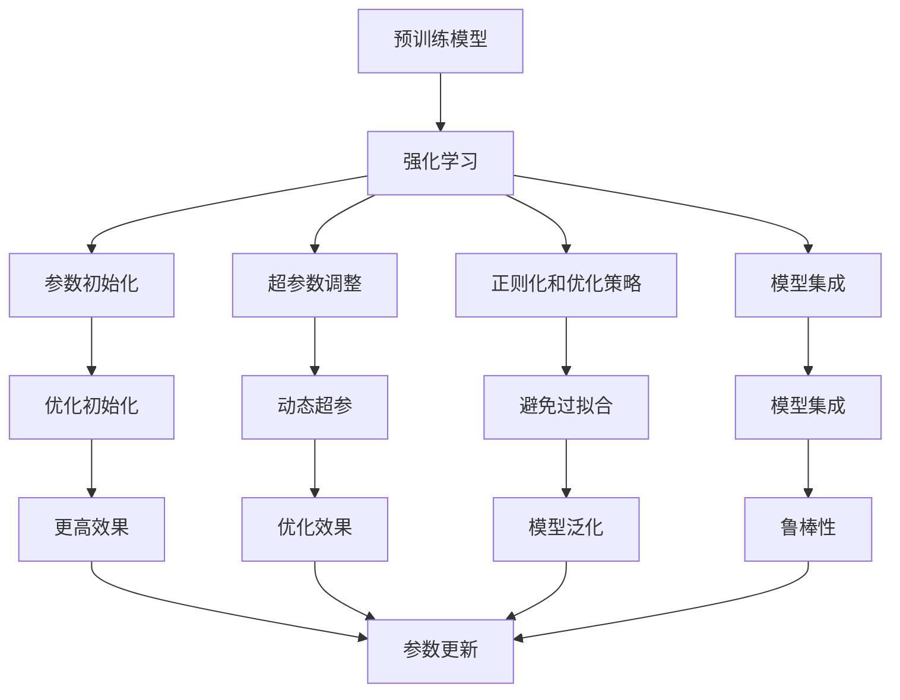

                 

## 1. 背景介绍

随着深度学习技术的不断发展，大规模预训练模型在NLP、CV、音频等领域得到了广泛应用。然而，这些大模型往往拥有数亿甚至数十亿的参数，训练复杂度高，且容易过拟合。强化学习作为一种动态优化技术，通过模型在虚拟环境中的交互和反馈，能够更高效地调整模型参数，提升模型性能。

在当前大模型优化领域，强化学习扮演着越来越重要的角色。借助强化学习，研究人员在参数初始化、超参数调整、正则化技术等方面取得了诸多突破，使得大模型能够以更小的计算成本和更高的效率进行微调。本文将详细介绍强化学习在大模型优化中的应用，包括算法原理、具体操作步骤和实际案例，帮助读者深入理解这一前沿技术。

## 2. 核心概念与联系

### 2.1 核心概念概述

强化学习（Reinforcement Learning, RL）是一种动态优化技术，通过智能体（agent）在环境中与环境的交互，最大化累积奖励（cumulative reward）来实现目标。强化学习由四要素组成：状态（state）、动作（action）、奖励（reward）和策略（policy）。

在大模型优化中，智能体通常为深度学习模型，环境为模型参数空间，动作为参数更新策略，奖励为模型在特定任务上的性能指标。强化学习的目标是找到最优策略，使得模型在特定任务上表现最优。

大模型优化中的强化学习主要应用于以下方面：

1. **参数初始化优化**：通过模拟强化学习过程，优化预训练模型的初始化参数。
2. **超参数调整**：通过动态调整超参数（如学习率、批大小等），提升模型效果。
3. **正则化和优化策略**：设计特定的正则化和优化策略，避免模型过拟合，提高训练效率。
4. **模型集成和优化**：通过强化学习训练多个模型的集成策略，提升模型鲁棒性和泛化能力。

### 2.2 核心概念之间的关系

强化学习与大模型优化之间的联系可以通过以下Mermaid流程图展示：



这个流程图展示了强化学习在大模型优化中的主要应用方向：

1. 预训练模型经过强化学习优化后，在参数初始化和超参数调整方面表现更佳。
2. 正则化和优化策略的设计，使得模型更具泛化能力和鲁棒性。
3. 通过模型集成策略，强化学习训练的多个模型能够协同工作，提升整体性能。

## 3. 核心算法原理 & 具体操作步骤

### 3.1 算法原理概述

强化学习在大模型优化中的应用，主要是通过模型在虚拟环境中的交互和反馈，优化模型的参数和超参数。具体来说，大模型通过模拟实验环境，不断调整参数，在特定任务上获得更高的性能指标，最终找到最优的模型配置。

强化学习的优化过程通常包括以下几个步骤：

1. **定义任务**：明确优化的目标任务，如分类、生成、匹配等。
2. **设计环境**：构建虚拟环境，描述模型参数空间和环境状态。
3. **设定奖励函数**：定义奖励函数，衡量模型在特定任务上的表现。
4. **选择算法**：选择合适的强化学习算法，如Q-learning、Policy Gradient等。
5. **训练模型**：在虚拟环境中运行强化学习算法，优化模型参数。
6. **评估和调整**：根据评估结果，调整模型和算法参数，提升优化效果。

### 3.2 算法步骤详解

#### 3.2.1 任务定义

首先，需要明确优化的具体任务。例如，对于分类任务，可以定义参数 $θ$，将模型在特定数据集上的准确率作为奖励函数 $R(θ)$。

#### 3.2.2 环境设计

构建虚拟环境，描述模型参数空间和环境状态。例如，对于一个具有 $m$ 个参数的模型，可以将参数空间表示为 $\Theta$，每个参数 $\theta_i$ 表示为 $\theta_i \in [0,1]$。

#### 3.2.3 奖励函数

定义奖励函数 $R(θ)$，衡量模型在特定任务上的表现。例如，对于一个分类任务，可以使用准确率作为奖励函数，即 $R(θ) = \frac{1}{N}\sum_{i=1}^N I(y_i, f(x_i; θ))$，其中 $y_i$ 为真实标签，$f(x_i; θ)$ 为模型的预测值。

#### 3.2.4 算法选择

选择合适的强化学习算法。例如，可以使用Q-learning算法，通过估计每个状态的Q值，选择最优的动作。具体步骤包括：

1. 初始化Q表，将每个状态的Q值初始化为0。
2. 对于每个样本 $(x_i, y_i)$，进行一次交互：
   1. 从当前状态 $s_i$ 选择动作 $a_i$，计算Q值。
   2. 执行动作 $a_i$，观察环境状态 $s_{i+1}$ 和奖励 $r_{i+1}$。
   3. 更新Q值，计算 $\epsilon$-greedy策略。
3. 重复步骤2，直至收敛。

#### 3.2.5 训练模型

在虚拟环境中运行强化学习算法，优化模型参数。例如，在Q-learning算法中，通过不断调整模型的权重，使其在特定任务上表现更好。

#### 3.2.6 评估和调整

根据评估结果，调整模型和算法参数，提升优化效果。例如，在Q-learning算法中，可以调整学习率、探索率等参数，进一步优化模型表现。

### 3.3 算法优缺点

强化学习在大模型优化中具有以下优点：

1. **动态优化**：能够动态调整模型参数和超参数，适应不同数据和任务。
2. **泛化能力强**：通过在虚拟环境中训练，能够提升模型泛化能力和鲁棒性。
3. **自动化调整**：自动化调整模型参数和超参数，减少人工干预。

同时，强化学习也存在一些局限性：

1. **计算成本高**：需要大量的计算资源进行模拟训练。
2. **训练过程复杂**：需要设计合适的环境、奖励函数和算法。
3. **收敛速度慢**：在复杂环境中可能存在局部最优解，收敛速度较慢。

### 3.4 算法应用领域

强化学习在大模型优化中的应用，已经覆盖了NLP、CV、音频等多个领域。以下是几个典型应用案例：

#### 3.4.1 NLP领域

在NLP领域，强化学习可以应用于语言模型、句法分析、命名实体识别等任务。例如，通过强化学习优化语言模型的参数，提升其语言理解能力。

#### 3.4.2 CV领域

在CV领域，强化学习可以应用于目标检测、图像分类、图像生成等任务。例如，通过强化学习优化目标检测器的参数，提升其在复杂场景下的检测准确率。

#### 3.4.3 音频领域

在音频领域，强化学习可以应用于语音识别、语音合成等任务。例如，通过强化学习优化语音识别模型的参数，提升其在不同口音和背景噪声下的识别准确率。

## 4. 数学模型和公式 & 详细讲解 & 举例说明

### 4.1 数学模型构建

在大模型优化中，强化学习的数学模型通常包括以下几个部分：

1. **状态空间**：$\mathcal{S}$，描述环境状态。
2. **动作空间**：$\mathcal{A}$，描述模型参数空间。
3. **奖励函数**：$R(s,a)$，衡量模型在特定状态和动作下的表现。
4. **策略**：$\pi$，描述模型的选择策略。

强化学习的目标是最小化预期累计奖励 $J(\pi) = \mathbb{E}[R(s_0,\pi)]$，其中 $s_0$ 为初始状态。

### 4.2 公式推导过程

以Q-learning算法为例，推导其数学公式。

Q-learning算法通过估计每个状态的Q值，选择最优的动作。假设当前状态为 $s_i$，动作为 $a_i$，下一状态为 $s_{i+1}$，奖励为 $r_{i+1}$。则Q值更新公式为：

$$
Q(s_i,a_i) \leftarrow Q(s_i,a_i) + \alpha(r_{i+1} + \gamma \max_{a'} Q(s_{i+1},a')) - Q(s_i,a_i)
$$

其中 $\alpha$ 为学习率，$\gamma$ 为折扣因子。通过不断调整Q值，优化模型参数。

### 4.3 案例分析与讲解

假设我们有一个简单的二分类模型，其参数为 $θ = (w_1, w_2)$，输入为 $x = [x_1, x_2]$，输出为 $y = w_1x_1 + w_2x_2$。定义任务为二分类任务，设定奖励函数为 $R(θ) = \frac{1}{N}\sum_{i=1}^N I(y_i, f(x_i; θ))$。

使用Q-learning算法，构建虚拟环境，定义状态空间为 $\mathcal{S} = \{s_1, s_2, \dots, s_N\}$，动作空间为 $\mathcal{A} = \{w_1, w_2\}$。通过在虚拟环境中训练，优化模型参数，使其在特定任务上表现更好。

## 5. 项目实践：代码实例和详细解释说明

### 5.1 开发环境搭建

在进行强化学习实践前，我们需要准备好开发环境。以下是使用Python进行PyTorch开发的环境配置流程：

1. 安装Anaconda：从官网下载并安装Anaconda，用于创建独立的Python环境。

2. 创建并激活虚拟环境：
```bash
conda create -n pytorch-env python=3.8 
conda activate pytorch-env
```

3. 安装PyTorch：根据CUDA版本，从官网获取对应的安装命令。例如：
```bash
conda install pytorch torchvision torchaudio cudatoolkit=11.1 -c pytorch -c conda-forge
```

4. 安装各类工具包：
```bash
pip install numpy pandas scikit-learn matplotlib tqdm jupyter notebook ipython
```

完成上述步骤后，即可在`pytorch-env`环境中开始强化学习实践。

### 5.2 源代码详细实现

下面我们以简单的二分类模型为例，给出使用PyTorch实现强化学习微调的代码。

```python
import torch
import torch.nn as nn
import torch.optim as optim
from torch.distributions import Categorical

class Model(nn.Module):
    def __init__(self, input_dim, output_dim):
        super(Model, self).__init__()
        self.fc1 = nn.Linear(input_dim, 128)
        self.fc2 = nn.Linear(128, output_dim)
        self.relu = nn.ReLU()

    def forward(self, x):
        x = self.fc1(x)
        x = self.relu(x)
        x = self.fc2(x)
        return x

class ReinforcementLearning(nn.Module):
    def __init__(self, model, input_dim, output_dim):
        super(ReinforcementLearning, self).__init__()
        self.model = model
        self.input_dim = input_dim
        self.output_dim = output_dim
        self.reward_fn = nn.BCEWithLogitsLoss()

    def forward(self, x, y):
        logits = self.model(x)
        loss = self.reward_fn(logits, y)
        return loss

    def train(self, x, y, batch_size):
        optimizer = optim.Adam(self.model.parameters(), lr=0.001)
        for epoch in range(100):
            self.model.train()
            for batch in range(0, len(x), batch_size):
                x_batch = x[batch:batch+batch_size]
                y_batch = y[batch:batch+batch_size]
                loss = self(x_batch, y_batch)
                optimizer.zero_grad()
                loss.backward()
                optimizer.step()
                if (epoch+1) % 10 == 0:
                    print('Epoch [{}/{}], Loss: {:.4f}'.format(epoch+1, 100, loss.item()))

def test(model, x, y):
    with torch.no_grad():
        logits = model(x)
        probs = torch.sigmoid(logits)
        accuracy = (probs >= 0.5).sum().item() / len(y)
        print('Accuracy: {:.4f}'.format(accuracy))

# 设置超参数
input_dim = 10
output_dim = 1
learning_rate = 0.001
batch_size = 32

# 初始化模型和优化器
model = Model(input_dim, output_dim)
optimizer = optim.Adam(model.parameters(), lr=learning_rate)

# 构建强化学习代理
rl = ReinforcementLearning(model, input_dim, output_dim)

# 加载数据集
x_train = torch.randn(1000, input_dim)
y_train = torch.randint(0, 2, (1000,))
x_test = torch.randn(100, input_dim)
y_test = torch.randint(0, 2, (100,))

# 训练模型
rl.train(x_train, y_train, batch_size)

# 测试模型
test(rl.model, x_test, y_test)
```

以上代码实现了基于强化学习的简单二分类模型微调。可以看到，使用PyTorch和Categorical分布，我们可以轻松实现强化学习的训练和评估过程。

### 5.3 代码解读与分析

让我们再详细解读一下关键代码的实现细节：

**Model类**：
- `__init__`方法：定义模型的结构，包括两个全连接层和一个ReLU激活函数。
- `forward`方法：定义模型的前向传播过程。

**ReinforcementLearning类**：
- `__init__`方法：初始化模型和损失函数。
- `forward`方法：定义模型的前向传播过程，计算损失函数。
- `train`方法：实现强化学习的训练过程，通过Adam优化器更新模型参数。
- `test`方法：在测试集上评估模型性能。

**训练流程**：
- 定义模型的超参数，如输入维度、输出维度、学习率等。
- 初始化模型和优化器。
- 构建强化学习代理。
- 加载训练数据集。
- 训练模型，并在每个epoch输出损失。
- 测试模型，输出测试集上的准确率。

可以看到，通过PyTorch框架，我们可以轻松实现强化学习的训练和评估过程。开发者可以将更多精力放在数据处理、模型改进等高层逻辑上，而不必过多关注底层的实现细节。

## 6. 实际应用场景

### 6.1 智能客服系统

在智能客服系统中，强化学习可以用于优化对话模型和推荐系统。通过不断调整模型参数，提升对话系统的理解和回复能力，同时优化推荐系统，提供更个性化的服务。

### 6.2 金融舆情监测

金融舆情监测是强化学习在金融领域的重要应用之一。通过在虚拟环境中训练模型，优化模型参数，提升其在市场舆情分析和风险预警方面的表现。

### 6.3 个性化推荐系统

在个性化推荐系统中，强化学习可以用于优化推荐模型，提升推荐效果。通过在虚拟环境中训练模型，优化推荐策略，提供更准确的个性化推荐服务。

### 6.4 未来应用展望

随着强化学习和大模型优化技术的不断进步，其在更多领域的应用前景将更加广阔。例如，在智慧医疗、智慧城市、智能制造等领域，强化学习将发挥更加重要的作用。未来，通过优化模型的初始化、超参数和正则化策略，强化学习必将在更多场景中得到应用，推动AI技术向更深层次发展。

## 7. 工具和资源推荐

### 7.1 学习资源推荐

为了帮助开发者系统掌握强化学习在大模型优化中的应用，这里推荐一些优质的学习资源：

1. 《Reinforcement Learning: An Introduction》：由Richard S. Sutton和Andrew G. Barto所写，是强化学习领域的经典教材，全面介绍了强化学习的理论和算法。
2. CS294T《强化学习》课程：由UC Berkeley开设的强化学习课程，涵盖了强化学习的基本概念和前沿技术。
3. DeepMind强化学习博客：DeepMind的研究团队定期发布强化学习相关的论文和博客，提供了丰富的学习资源。
4. OpenAI的Gym环境：Gym是OpenAI推出的通用环境库，提供了多种强化学习环境，适合学习和实验。
5. PyTorch官方文档：PyTorch框架提供了丰富的强化学习示例，适合学习和实践。

通过对这些资源的学习实践，相信你一定能够快速掌握强化学习在大模型优化中的应用，并用于解决实际的NLP问题。

### 7.2 开发工具推荐

高效的开发离不开优秀的工具支持。以下是几款用于强化学习开发的常用工具：

1. PyTorch：基于Python的开源深度学习框架，支持动态计算图，适合快速迭代研究。
2. TensorFlow：由Google主导开发的深度学习框架，支持分布式训练，适合大规模工程应用。
3. Gym：OpenAI推出的通用环境库，提供了多种强化学习环境，适合学习和实验。
4. Weights & Biases：模型训练的实验跟踪工具，可以记录和可视化模型训练过程中的各项指标，方便对比和调优。
5. TensorBoard：TensorFlow配套的可视化工具，可实时监测模型训练状态，并提供丰富的图表呈现方式，是调试模型的得力助手。

合理利用这些工具，可以显著提升强化学习模型的开发效率，加快创新迭代的步伐。

### 7.3 相关论文推荐

强化学习和大模型优化技术的发展源于学界的持续研究。以下是几篇奠基性的相关论文，推荐阅读：

1. DeepMind的AlphaGo论文：提出基于强化学习的围棋策略，展示了强化学习在复杂决策问题中的强大能力。
2. OpenAI的GPT-3论文：提出基于强化学习的语言模型，刷新了多项NLP任务SOTA。
3. DeepMind的PPO论文：提出Proximal Policy Optimization算法，提升了强化学习的训练效率和稳定性。
4. OpenAI的BERT论文：提出BERT预训练语言模型，通过自监督学习任务提升了模型的语言理解能力。
5. Google的AutoML论文：提出基于强化学习的模型搜索和优化方法，提升了模型自动化的能力。

这些论文代表了大模型优化技术的发展脉络。通过学习这些前沿成果，可以帮助研究者把握学科前进方向，激发更多的创新灵感。

除上述资源外，还有一些值得关注的前沿资源，帮助开发者紧跟大模型优化技术的最新进展，例如：

1. arXiv论文预印本：人工智能领域最新研究成果的发布平台，包括大量尚未发表的前沿工作，学习前沿技术的必读资源。
2. 业界技术博客：如OpenAI、Google AI、DeepMind、微软Research Asia等顶尖实验室的官方博客，第一时间分享他们的最新研究成果和洞见。
3. 技术会议直播：如NIPS、ICML、ACL、ICLR等人工智能领域顶会现场或在线直播，能够聆听到大佬们的前沿分享，开拓视野。
4. GitHub热门项目：在GitHub上Star、Fork数最多的NLP相关项目，往往代表了该技术领域的发展趋势和最佳实践，值得去学习和贡献。
5. 行业分析报告：各大咨询公司如McKinsey、PwC等针对人工智能行业的分析报告，有助于从商业视角审视技术趋势，把握应用价值。

总之，对于强化学习在大模型优化中的应用，需要开发者保持开放的心态和持续学习的意愿。多关注前沿资讯，多动手实践，多思考总结，必将收获满满的成长收益。

## 8. 总结：未来发展趋势与挑战

### 8.1 总结

本文对强化学习在大模型优化中的应用进行了全面系统的介绍。首先阐述了强化学习的基本原理和在大模型优化中的关键作用，明确了强化学习在参数初始化、超参数调整、正则化技术等方面的独特优势。其次，从原理到实践，详细讲解了强化学习的算法步骤和具体实现，给出了强化学习任务开发的完整代码实例。同时，本文还广泛探讨了强化学习在智能客服、金融舆情、个性化推荐等多个行业领域的应用前景，展示了强化学习范式的巨大潜力。此外，本文精选了强化学习的各类学习资源，力求为读者提供全方位的技术指引。

通过本文的系统梳理，可以看到，强化学习在大模型优化中具有重要的应用价值，通过动态调整模型参数和超参数，提升模型的泛化能力和鲁棒性，为模型优化提供了新的思路和方法。未来，伴随强化学习和大模型优化方法的不断进步，相信在更多领域中，强化学习将发挥更加重要的作用，推动人工智能技术向更加智能化、普适化方向发展。

### 8.2 未来发展趋势

展望未来，强化学习在大模型优化中的发展趋势将呈现以下几个方面：

1. **智能参数搜索**：通过强化学习搜索最优的超参数和正则化策略，进一步提升模型的性能和效率。
2. **多智能体优化**：通过多智能体系统的协同优化，提升模型的稳定性和鲁棒性。
3. **混合优化方法**：结合强化学习和传统的优化算法，进一步提升模型的优化效果和效率。
4. **自适应学习策略**：通过自适应学习策略，动态调整模型参数和超参数，适应复杂多变的数据和任务。
5. **跨模态优化**：结合视觉、语音、文本等多种模态数据，实现多模态信息融合的优化方法。

这些趋势将进一步提升强化学习在大模型优化中的应用效果，推动AI技术向更广泛、更深入的方向发展。

### 8.3 面临的挑战

尽管强化学习在大模型优化中已经取得了瞩目成就，但在迈向更加智能化、普适化应用的过程中，仍面临诸多挑战：

1. **计算资源消耗高**：强化学习训练过程需要大量的计算资源，如何优化训练过程，减少资源消耗，仍需不断探索。
2. **训练过程复杂**：需要设计合适的环境、奖励函数和算法，训练过程复杂，容易陷入局部最优解。
3. **模型鲁棒性不足**：在复杂环境中，模型容易产生过拟合和泛化能力不足的问题，如何提高模型的鲁棒性，还需要更多研究和实践。
4. **模型可解释性差**：强化学习模型通常缺乏可解释性，难以理解和调试模型的内部机制，需要更多研究工作。

### 8.4 研究展望

面对强化学习在大模型优化中所面临的挑战，未来的研究需要在以下几个方面寻求新的突破：

1. **优化算法创新**：开发新的优化算法，提升强化学习的训练效率和稳定性。
2. **模型架构改进**：改进模型的架构设计，提升模型的泛化能力和鲁棒性。
3. **跨领域融合**：结合其他人工智能技术，如知识图谱、因果推理等，实现跨领域的协同优化。
4. **伦理和安全约束**：引入伦理和安全约束，确保强化学习模型的公平性、透明性和安全性。
5. **自监督学习结合**：结合自监督学习技术，提升强化学习模型的性能和效率。

这些研究方向将引领强化学习在大模型优化中的进一步发展，推动AI技术向更智能、更普适、更可靠的方向迈进。

## 9. 附录：常见问题与解答

**Q1：强化学习在大模型优化中的应用有哪些关键步骤？**

A: 强化学习在大模型优化中的关键步骤包括：
1. 定义任务：明确优化的目标任务。
2. 设计环境：构建虚拟环境，描述模型参数空间和环境状态。
3. 设定奖励函数：定义奖励函数，衡量模型在特定任务上的表现。
4. 选择算法：选择合适的强化学习算法。
5. 训练模型：在虚拟环境中运行强化学习算法，优化模型参数。
6. 评估和调整：根据评估结果，调整模型和算法参数，提升优化效果。

**Q2：强化学习在大模型优化中需要注意哪些问题？**

A: 强化学习在大模型优化中需要注意以下问题：
1. 计算资源消耗高，需要优化训练过程，减少资源消耗。
2. 训练过程复杂，需要设计合适的环境、奖励函数和算法，避免陷入局部最优解。
3. 模型鲁棒性不足，需要提高模型的泛化能力和鲁棒性。
4. 模型可解释性差，需要更多研究工作，提升模型的透明性和可解释性。

**Q3：强化学习在大模型优化中如何提高模型性能？**

A: 强化学习在大模型优化中提高模型性能的方法包括：
1. 优化算法创新，提升训练效率和稳定性。
2. 改进模型架构，提升泛化能力和鲁棒性。
3. 结合自监督学习技术，提升模型性能和效率。
4. 引入伦理和安全约束，确保公平性、透明性和安全性。

**Q4：强化学习在大模型优化中的参数高效微调方法有哪些？**

A: 强化学习在大模型优化中的参数高效微调方法包括：
1. 参数冻结方法，只更新少量参数。
2. 自适应学习策略，动态调整模型参数和超参数。
3. 混合优化方法，结合强化学习和传统优化算法。

这些方法可以在保持预训练模型参数不变的情况下，提高模型微调的效率和效果。

**Q5：强化学习在大模型优化中的未来发展方向有哪些？**

A: 强化学习在大模型优化中的未来发展方向包括：
1. 智能参数搜索，通过强化学习搜索最优的超参数和正则化策略。
2. 多智能体优化，通过多智能体系统的协同优化，提升模型的稳定性和鲁棒性。
3. 跨模态优化，结合

