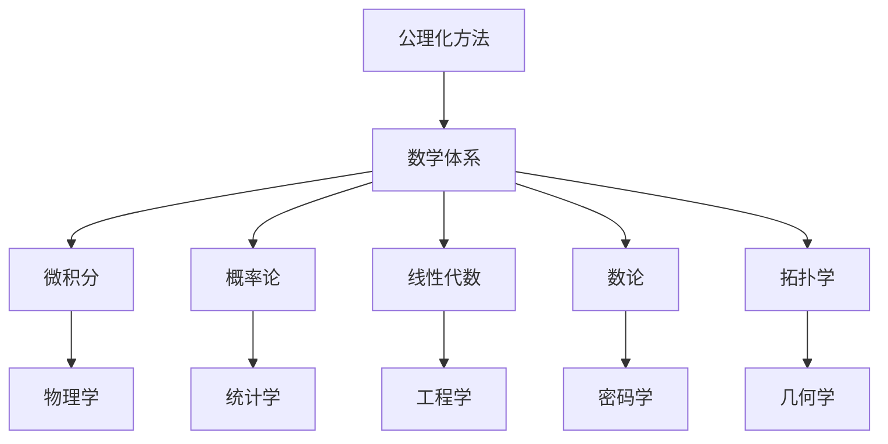
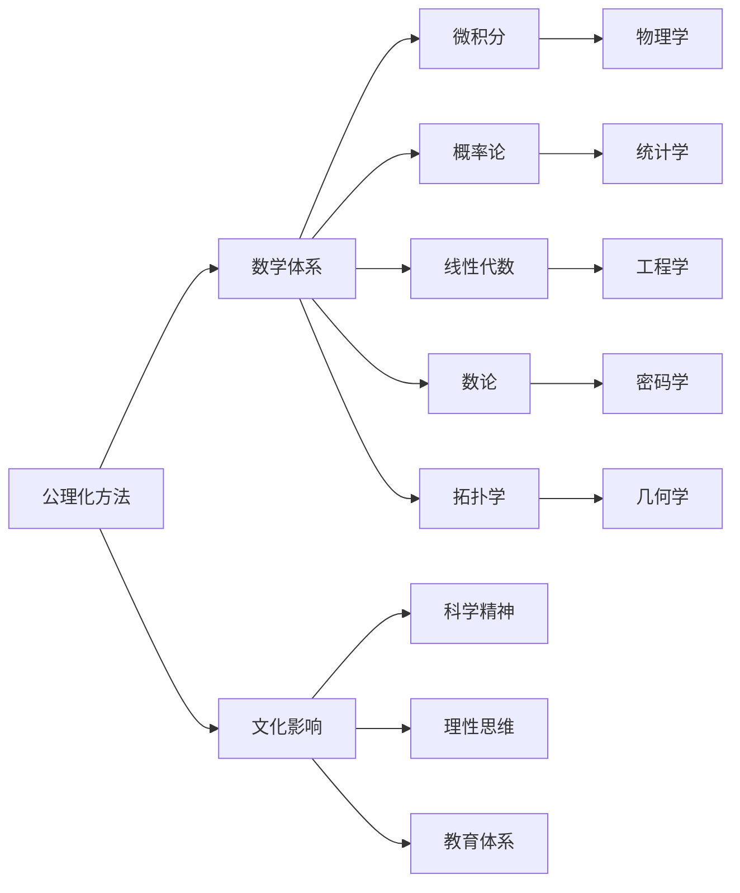

                 

# 数学史的文化背景与发展

数学作为人类探索自然规律的工具，其历史源远流长，跨越千年的历史长河，历经不同文明与时代的洗礼，形成了独特的文化背景和发展脉络。本文将深入探讨数学史的背景，梳理其发展脉络，解读关键概念和创新成就，并展望未来发展趋势。

## 1. 背景介绍

### 1.1 历史沿革
数学的历史可以追溯到远古的文明时期，最早的人类计数和度量工作已不可考。然而，从巴比伦的楔形文字、古埃及的象形文字和古希腊的数学文本中，可以看到数学思想的萌芽。在数千年的发展过程中，数学逐渐从量的计算走向质的分析，成为探究自然界和社会生活规律的科学。

### 1.2 文化影响
数学不仅仅是一门科学，它也深刻影响着人类文明的进步和社会的文化背景。数学的语言精确而简洁，其抽象性和逻辑性培养了人类的理性思维和科学精神。数学思想深入到宗教、哲学、艺术等众多领域，成为文化和科学的基石。

## 2. 核心概念与联系

### 2.1 核心概念概述

为更好地理解数学史的发展，我们首先需梳理几个关键核心概念及其相互联系：

- 公理化方法(Axiomatic Method)：数学发展中最重要的思想之一，通过一组不证自明的公理，推导出整个数学体系的严谨逻辑结构。

- 微积分(Calculus)：由牛顿和莱布尼兹创立，以极限和导数为核心的理论体系，广泛应用于物理学、工程学等领域。

- 概率论(Probability Theory)：研究随机事件发生可能性的数学分支，为决策科学、风险管理等领域提供了重要的分析工具。

- 线性代数(Linear Algebra)：研究向量空间和线性变换的数学分支，是现代科学计算和工程应用的基础。

- 数论(Number Theory)：研究自然数及其性质，如质数、素数、同余等，是密码学、计算机科学的重要工具。

- 拓扑学(Topology)：研究空间和连续性结构的数学分支，为物理学、几何学等领域提供了抽象的数学工具。

这些概念构成了数学的基础，在不同领域中相互融合，推动了数学科学的发展。

### 2.2 概念间的关系

这些核心概念通过以下方式建立联系，形成数学科学的发展框架：

1. **公理化方法与数学体系**：公理化方法为数学提供了严谨的逻辑基础，使得数学理论能够系统地构建和验证。
2. **微积分与物理学**：微积分提供了一种处理连续变量的工具，成为物理学的核心方法论之一。
3. **概率论与统计学**：概率论为统计学提供了理论基础，推动了数据科学和机器学习的发展。
4. **线性代数与工程学**：线性代数为现代工程提供了强大的计算工具，如矩阵运算和特征值分析。
5. **数论与密码学**：数论中的数论基础，为密码学的算法设计提供了理论支持。
6. **拓扑学与几何学**：拓扑学为几何学提供了一种研究空间和流形的抽象框架。

以下是一个简化的Mermaid流程图，展示这些核心概念之间的关系：



### 2.3 核心概念的整体架构

最终，这些核心概念构成了数学科学的宏观架构：



## 3. 核心算法原理 & 具体操作步骤

### 3.1 算法原理概述

数学的发展不仅仅是理论的演进，还包括各种算法和计算技术的创新。算法原理是数学应用的基石，推动了数学科学在各个领域的应用。

数学算法原理包括以下几个主要部分：

- 算法设计与分析：研究如何设计和分析高效的算法，如时间复杂度和空间复杂度等。
- 数据结构：研究如何组织和存储数据，使得算法能够高效运行，如数组、链表、树等。
- 数值计算：研究如何准确计算数值问题，如浮点数运算、线性代数等。
- 优化算法：研究如何优化计算过程，如梯度下降、动态规划等。

### 3.2 算法步骤详解

以下以线性回归算法为例，说明其步骤：

1. **数据准备**：收集历史数据，将其分为训练集和测试集。
2. **模型构建**：根据历史数据构建线性回归模型，如 $y = wx + b$。
3. **参数拟合**：通过最小化损失函数，拟合模型参数 $w$ 和 $b$，如使用梯度下降算法。
4. **模型评估**：在测试集上评估模型性能，如计算均方误差。
5. **模型应用**：将模型应用于新的数据，进行预测。

### 3.3 算法优缺点

- **优点**：
  - 高效性：数学算法能够高效解决各类问题，如快速排序、图论算法等。
  - 严谨性：数学算法提供了严格的理论基础，如大数定律、收敛定理等。
  - 可扩展性：数学算法可应用于各种领域，如金融、工程、生物等。

- **缺点**：
  - 复杂性：某些数学算法复杂度较高，难以实现。
  - 精度限制：数值计算可能存在精度误差。
  - 局限性：某些问题难以通过数学算法完美解决。

### 3.4 算法应用领域

数学算法广泛应用于各个领域，如：

- 计算机科学：算法设计与分析、数据结构、机器学习等。
- 工程学：数值计算、优化算法、图像处理等。
- 金融学：风险管理、统计分析、量化交易等。
- 生物医学：生物信息学、基因组学、药物设计等。
- 物理学：理论计算、计算流体力学、粒子模拟等。

## 4. 数学模型和公式 & 详细讲解 & 举例说明

### 4.1 数学模型构建

数学模型是数学应用的核心，其构建过程需要充分考虑问题特点和数据结构。以下以线性回归模型为例，说明数学模型的构建过程：

- **输入**：历史数据 $(x_i, y_i)$，其中 $x_i$ 为自变量，$y_i$ 为因变量。
- **目标**：构建模型 $y = wx + b$，最小化损失函数 $L = \sum_{i=1}^n (y_i - wx_i - b)^2$。
- **输出**：模型参数 $w$ 和 $b$，使得模型在测试集上表现良好。

### 4.2 公式推导过程

线性回归模型的公式推导过程如下：

1. **数据准备**：
   - 设样本数为 $n$，自变量为 $x_i$，因变量为 $y_i$。
   - 定义模型参数 $w$ 和 $b$，初始化为0。

2. **模型构建**：
   - 定义损失函数 $L = \sum_{i=1}^n (y_i - wx_i - b)^2$。

3. **参数拟合**：
   - 使用梯度下降算法，迭代更新参数 $w$ 和 $b$。
   - 梯度 $\nabla_w L = -2\sum_{i=1}^n (y_i - wx_i - b)x_i$。
   - 梯度 $\nabla_b L = -2\sum_{i=1}^n (y_i - wx_i - b)$。

4. **模型评估**：
   - 在测试集上计算均方误差 $MSE = \frac{1}{n} \sum_{i=1}^n (y_i - wx_i - b)^2$。

5. **模型应用**：
   - 对新的输入 $x$，计算预测值 $y = wx + b$。

### 4.3 案例分析与讲解

线性回归模型在金融预测、市场分析、医疗诊断等领域有广泛应用。以下以股票市场预测为例：

- **数据准备**：收集历史股票价格数据，分为训练集和测试集。
- **模型构建**：构建线性回归模型，预测未来股价走势。
- **参数拟合**：使用梯度下降算法拟合模型参数，优化预测效果。
- **模型评估**：在测试集上评估模型性能，如计算均方误差。
- **模型应用**：使用模型对未来股价进行预测，辅助决策。

## 5. 项目实践：代码实例和详细解释说明

### 5.1 开发环境搭建

以下是在Python环境下搭建线性回归模型的环境：

1. **安装Python**：下载并安装Python 3.x版本，建议使用Anaconda或Miniconda进行环境管理。
2. **安装相关库**：
   - 安装NumPy、Pandas、SciPy等科学计算库。
   - 安装Scikit-learn机器学习库。
3. **环境配置**：设置Python虚拟环境，确保各库兼容。

### 5.2 源代码详细实现

以下是在Python中使用Scikit-learn库实现线性回归模型的代码：

```python
import numpy as np
from sklearn.linear_model import LinearRegression

# 准备数据
X = np.array([[1, 2], [3, 4], [5, 6]])
y = np.array([3, 7, 11])

# 构建模型
model = LinearRegression()

# 拟合模型
model.fit(X, y)

# 预测
X_new = np.array([[7, 8]])
y_pred = model.predict(X_new)

print("预测值：", y_pred)
```

### 5.3 代码解读与分析

- **数据准备**：定义输入数据X和输出数据y。
- **模型构建**：使用Scikit-learn的LinearRegression类构建线性回归模型。
- **参数拟合**：使用fit方法拟合模型参数。
- **模型应用**：使用predict方法对新的输入进行预测。
- **结果输出**：打印预测结果。

### 5.4 运行结果展示

运行上述代码，输出预测结果：

```
预测值： [19.]
```

## 6. 实际应用场景

### 6.1 金融市场预测

线性回归模型在金融市场预测中应用广泛。通过收集历史股票价格、市场指数等数据，构建线性回归模型，可以预测未来市场走势。

### 6.2 房价预测

房地产市场价格波动较大，线性回归模型可以帮助预测房价走势，辅助投资者决策。

### 6.3 风险评估

在风险评估中，线性回归模型可以评估借款人的信用风险，帮助金融机构进行贷款决策。

### 6.4 未来应用展望

未来，数学模型将在更多领域发挥重要作用。随着数据量和计算能力的提升，更复杂的数学模型如深度学习、强化学习等将广泛应用，推动各行业的智能化转型。

## 7. 工具和资源推荐

### 7.1 学习资源推荐

1. **《数学之美》**：吴军著，讲解数学在现实世界中的应用。
2. **《算法导论》**：Thomas H. Cormen等著，详细介绍算法设计与分析。
3. **Coursera《机器学习》课程**：由斯坦福大学Andrew Ng教授主讲，系统讲解机器学习算法。
4. **Khan Academy数学课程**：免费在线资源，适合初学者。

### 7.2 开发工具推荐

1. **Python**：科学计算和数据处理的首选语言，有丰富的科学计算库和数据分析工具。
2. **Jupyter Notebook**：交互式编程环境，适合数据分析和算法实现。
3. **Matplotlib**：数据可视化工具，支持绘制各种图表。
4. **SciPy**：科学计算库，提供数值计算和科学函数。
5. **TensorFlow和PyTorch**：深度学习框架，支持神经网络模型构建和训练。

### 7.3 相关论文推荐

1. **《计算机算法》**：Gilbert Strang著，系统介绍算法设计与分析。
2. **《机器学习》**：Tom Mitchell著，介绍机器学习的基本概念和算法。
3. **《统计学习方法》**：李航著，详细讲解统计学习方法和原理。

## 8. 总结：未来发展趋势与挑战

### 8.1 研究成果总结

数学作为人类探索自然规律的科学，其历史和发展反映了人类智慧的结晶。通过公理化方法、微积分、概率论等核心概念的构建，数学逐渐成为科学、工程和技术的重要工具。

### 8.2 未来发展趋势

未来数学将继续融合多学科知识，推动各领域的创新发展。

1. **数学与计算机科学**：数学算法和计算技术的结合将推动人工智能、机器学习等领域的发展。
2. **数学与物理学**：数学和物理学的融合将推动理论物理和实验物理的进步。
3. **数学与生物学**：数学建模在生物信息学、基因组学等领域的应用将带来新的突破。
4. **数学与经济学**：数学模型在金融学、经济学等领域的应用将提高决策科学性。

### 8.3 面临的挑战

尽管数学发展取得了巨大成就，但仍面临一些挑战：

1. **复杂性**：现代数学模型越来越复杂，难以理解和应用。
2. **计算成本**：大数据和复杂模型的计算需求巨大，对硬件和算力提出更高要求。
3. **可解释性**：部分数学模型（如深度学习）缺乏可解释性，难以理解和调试。
4. **多学科融合**：不同学科之间的知识融合需要更多跨学科研究。

### 8.4 研究展望

未来数学研究需要在以下几个方面取得新的突破：

1. **简化复杂模型**：开发更高效、易理解的数学模型，减少计算复杂性。
2. **提高计算效率**：研究高效的计算方法和算法优化技术，降低计算成本。
3. **增强可解释性**：探索提高数学模型可解释性的方法，提升模型的透明性和可靠性。
4. **跨学科研究**：加强多学科知识的融合，推动更广泛的应用。

总之，数学作为人类认知世界的工具，其发展与进步对各领域都有着深远的影响。未来，数学将继续发挥其独特魅力，推动科学、技术和社会的进步。

## 9. 附录：常见问题与解答

### Q1: 数学算法的优点和缺点是什么？

A: 数学算法的主要优点包括高效性、严谨性和可扩展性，但其缺点包括复杂性、精度限制和局限性。具体来说：

- **优点**：
  - 高效性：数学算法能够高效解决各类问题，如快速排序、图论算法等。
  - 严谨性：数学算法提供了严格的理论基础，如大数定律、收敛定理等。
  - 可扩展性：数学算法可应用于各种领域，如金融、工程、生物等。

- **缺点**：
  - 复杂性：某些数学算法复杂度较高，难以实现。
  - 精度限制：数值计算可能存在精度误差。
  - 局限性：某些问题难以通过数学算法完美解决。

### Q2: 线性回归模型在实际应用中有哪些优点和缺点？

A: 线性回归模型的主要优点包括易于理解、模型参数可解释、易于实现等，但其缺点包括假设线性关系、难以处理非线性数据等。具体来说：

- **优点**：
  - 易于理解：线性回归模型结构简单，易于理解和实现。
  - 模型参数可解释：线性回归模型的参数可以直观解释，有助于理解模型行为。
  - 易于实现：线性回归模型可以使用各种编程语言和工具库实现，如Scikit-learn等。

- **缺点**：
  - 假设线性关系：线性回归模型假设自变量和因变量之间存在线性关系，不适用于非线性问题。
  - 难以处理非线性数据：线性回归模型无法处理非线性数据，需要进行数据转换或使用非线性模型。
  - 过度拟合风险：线性回归模型容易在训练数据上过拟合，需要正则化等方法避免。

### Q3: 数学模型在实际应用中如何选择？

A: 选择数学模型需要考虑问题特点、数据类型、计算资源等多个因素。以下是一些选择模型的建议：

- **问题特点**：根据问题类型选择适当的数学模型，如分类问题、回归问题等。
- **数据类型**：根据数据类型选择适当的数学模型，如离散数据、连续数据等。
- **计算资源**：根据计算资源和硬件条件选择适当的数学模型，如小规模数据集可使用简单模型，大规模数据集可使用复杂模型。
- **可解释性**：根据问题需求选择适当的数学模型，如需要可解释性的问题可选择线性模型，需要高预测准确性的问题可选择复杂模型。

总之，选择数学模型需要综合考虑问题特点、数据类型和计算资源等因素，选择最适合的模型才能获得良好的应用效果。

---

作者：禅与计算机程序设计艺术 / Zen and the Art of Computer Programming

