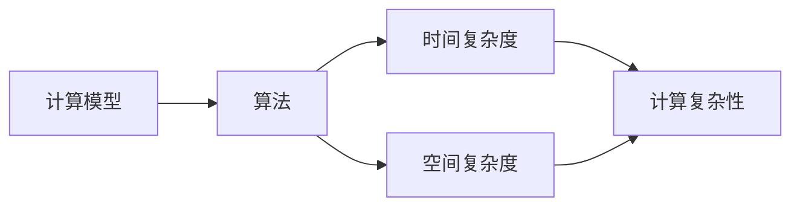
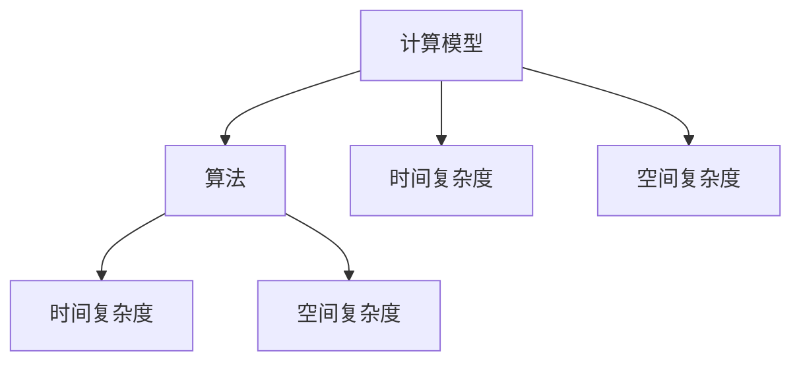
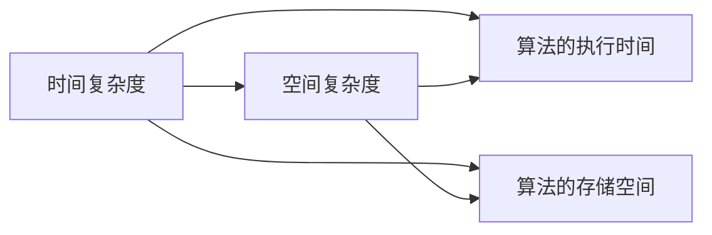
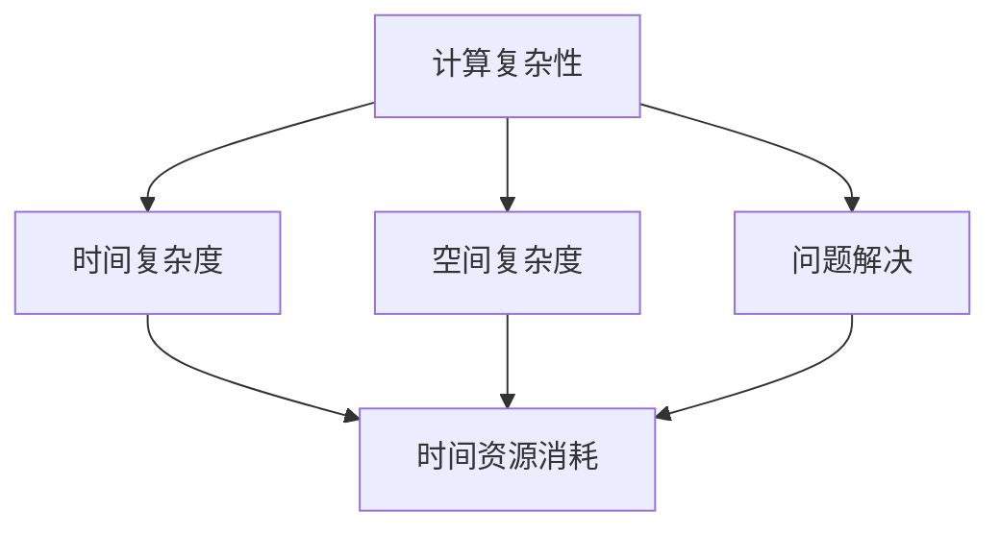

                 

# 计算：第四部分 计算的极限 第 9 章 计算复杂性 计算的时空平衡性

> 关键词：计算复杂性,时空平衡性,计算极限,计算机科学,算法设计,时空分析,大 O 记号

## 1. 背景介绍

### 1.1 问题由来

在计算机科学的发展过程中，计算复杂性一直是研究的核心问题之一。计算复杂性理论研究的是问题解决所需计算资源的增长速率，包括时间复杂度和空间复杂度。计算的时空平衡性则是在考虑计算资源限制下如何有效利用资源，以达到计算效率的最大化。

计算复杂性理论的起源可以追溯到1935年图灵机的提出。图灵机（Turing Machine）是一个抽象的计算模型，可以用来计算任何可计算函数，并由此引出了计算问题的可解性。此后，柯林斯（Collins）、库恩（Kleene）、冯·诺依曼（von Neumann）等学者对计算复杂性进行了深入研究，提出了一系列经典的计算问题，如判定问题、搜索问题、优化问题等，并定义了计算复杂性理论的基本概念和工具，如时间复杂度、空间复杂度、计算模型等。

### 1.2 问题核心关键点

计算复杂性理论的核心问题是如何在时间复杂度和空间复杂度之间寻找最优解。计算的时空平衡性则关注在资源有限的情况下，如何通过算法设计来优化计算效率，使其在计算时间和空间上达到最优的平衡。

计算复杂性理论中，时间复杂度和空间复杂度是衡量算法效率的两个重要指标。时间复杂度（Time Complexity）是指算法执行时间随问题规模增长的增长速率，通常用大 O 记号表示。空间复杂度（Space Complexity）则是指算法在执行过程中所需的存储空间随问题规模增长的增长速率。

大 O 记号是一种渐进表示法，用来描述算法的时间复杂度或空间复杂度的增长趋势。常见的复杂度包括常数时间 O(1)、线性时间 O(n)、对数时间 O(log n)、平方时间 O(n^2)、立方时间 O(n^3) 等。其中，O(1) 表示算法执行时间不随问题规模增长，是最高效的；O(n^3) 表示算法执行时间随问题规模呈立方增长，是相对较慢的。

## 2. 核心概念与联系

### 2.1 核心概念概述

为了更好地理解计算复杂性理论，我们首先需要了解几个核心概念：

- **计算模型**：计算模型是抽象的计算框架，用于定义计算的抽象机制和执行方式。常见的计算模型包括图灵机、随机访问机器、多带机等。
- **算法**：算法是一系列步骤或操作，用于解决特定问题的程序或计算过程。算法的时间复杂度和空间复杂度是评价其效率的重要指标。
- **时间复杂度**：时间复杂度是指算法执行时间随问题规模增长的增长速率，通常用大 O 记号表示。
- **空间复杂度**：空间复杂度是指算法在执行过程中所需的存储空间随问题规模增长的增长速率，同样用大 O 记号表示。
- **计算复杂性**：计算复杂性是指解决问题所需的计算资源（时间和空间）随问题规模增长的增长速率，是衡量算法效率的重要指标。

这些概念之间的逻辑关系可以通过以下 Mermaid 流程图来展示：



这个流程图展示了计算复杂性理论的基本概念和它们之间的逻辑关系：

1. 计算模型定义了算法的执行机制。
2. 算法是由一系列操作构成的程序，其时间复杂度和空间复杂度是评价其效率的重要指标。
3. 时间复杂度和空间复杂度共同决定了计算复杂性。

### 2.2 概念间的关系

这些核心概念之间存在着紧密的联系，形成了计算复杂性理论的基本框架。下面通过几个 Mermaid 流程图来展示这些概念之间的关系。

#### 2.2.1 计算模型与算法的关系



这个流程图展示了计算模型和算法之间的时间复杂度和空间复杂度的关系：

1. 计算模型定义了算法的执行方式。
2. 算法的时间复杂度和空间复杂度是计算模型执行效率的直接体现。

#### 2.2.2 时间复杂度与空间复杂度的关系



这个流程图展示了时间复杂度和空间复杂度之间的逻辑关系：

1. 时间复杂度表示算法的执行时间随问题规模增长的增长速率。
2. 空间复杂度表示算法所需的存储空间随问题规模增长的增长速率。

#### 2.2.3 计算复杂性理论的应用



这个流程图展示了计算复杂性理论的应用场景：

1. 计算复杂性理论用于分析和评价算法解决特定问题所需的计算资源。
2. 时间复杂度和空间复杂度是衡量算法效率的关键指标。

## 3. 核心算法原理 & 具体操作步骤

### 3.1 算法原理概述

计算复杂性理论的核心思想是通过时间复杂度和空间复杂度来描述算法的执行效率。时间复杂度和空间复杂度是评价算法效率的两个重要指标，两者之间存在一定的平衡关系。

时间复杂度和空间复杂度通常用大 O 记号表示，具体来说：

- 时间复杂度 O(f(n)) 表示算法执行时间随问题规模 n 增长的增长速率，f(n) 是问题规模 n 的函数。
- 空间复杂度 O(g(n)) 表示算法在执行过程中所需的存储空间随问题规模 n 增长的增长速率，g(n) 是问题规模 n 的函数。

在实际应用中，我们需要在时间复杂度和空间复杂度之间寻找最优解，以达到计算效率的最大化。通常情况下，时间复杂度和空间复杂度之间存在一定的权衡关系，即在增加时间复杂度的同时，可以通过减少空间复杂度来优化算法的执行效率。

### 3.2 算法步骤详解

基于计算复杂性理论的算法设计一般包括以下几个步骤：

1. **问题定义**：首先明确问题的定义和要求，确定算法需要解决的具体问题。
2. **算法设计**：设计一个满足问题要求的算法，并确保其时间复杂度和空间复杂度达到最优。
3. **算法实现**：将算法转换为具体的代码实现，并进行测试验证。
4. **性能分析**：对算法进行时间复杂度和空间复杂度分析，评估其执行效率。

下面以排序算法为例，展示算法设计的一般步骤：

- **问题定义**：给定一组数据，设计一个算法，使其按照升序或降序排列。
- **算法设计**：选择一个合适的排序算法，如快速排序、归并排序等，设计算法的具体实现步骤。
- **算法实现**：将算法转换为具体的代码实现，并进行测试验证。
- **性能分析**：分析算法的时间复杂度和空间复杂度，评估其执行效率。

### 3.3 算法优缺点

基于计算复杂性理论的算法设计具有以下优点：

1. **时间复杂度分析**：通过时间复杂度分析，可以评估算法的执行效率，避免算法执行时间过长。
2. **空间复杂度分析**：通过空间复杂度分析，可以评估算法所需的存储空间，避免存储空间不足。
3. **算法优化**：通过时间复杂度和空间复杂度之间的权衡，可以优化算法的执行效率，提高计算效率。

同时，基于计算复杂性理论的算法设计也存在一些缺点：

1. **算法设计复杂**：算法设计需要考虑时间复杂度和空间复杂度之间的平衡，设计复杂度较高。
2. **算法实现难度大**：算法实现需要编写具体的代码，难度较大。
3. **算法性能不稳定**：算法性能受数据规模、数据分布等多种因素影响，性能不稳定。

### 3.4 算法应用领域

基于计算复杂性理论的算法设计广泛应用于计算机科学、人工智能、数据科学等多个领域。以下是几个典型的应用场景：

1. **排序算法**：如快速排序、归并排序、堆排序等。
2. **搜索算法**：如二分查找、深度优先搜索、广度优先搜索等。
3. **图算法**：如最短路径算法、最小生成树算法、网络流算法等。
4. **字符串算法**：如KMP算法、Boyer-Moore算法、Rabin-Karp算法等。
5. **数值计算**：如高斯消元、矩阵乘法、线性回归等。
6. **数据压缩**：如霍夫曼编码、LZW压缩算法、RLE压缩算法等。

## 4. 数学模型和公式 & 详细讲解 & 举例说明

### 4.1 数学模型构建

在计算复杂性理论中，时间复杂度和空间复杂度是衡量算法效率的重要指标。时间复杂度和空间复杂度通常用大 O 记号表示，具体来说：

- 时间复杂度 O(f(n)) 表示算法执行时间随问题规模 n 增长的增长速率，f(n) 是问题规模 n 的函数。
- 空间复杂度 O(g(n)) 表示算法在执行过程中所需的存储空间随问题规模 n 增长的增长速率，g(n) 是问题规模 n 的函数。

时间复杂度和空间复杂度可以通过以下公式计算：

$$
T(n) = O(f(n)) \quad \text{时间复杂度}
$$

$$
S(n) = O(g(n)) \quad \text{空间复杂度}
$$

其中，n 表示问题规模，f(n) 和 g(n) 表示与问题规模相关的函数。

### 4.2 公式推导过程

以快速排序算法为例，推导其时间复杂度和空间复杂度。

快速排序算法的时间复杂度为 O(nlogn)，空间复杂度为 O(logn)。

1. **时间复杂度推导**：

快速排序算法的基本思想是选择一个基准值，将序列划分为两个子序列，然后递归地对子序列进行排序。在最坏情况下，每个子序列的大小为 n/2，需要执行 logn 次递归，每次递归需要执行 n 次比较和交换操作。因此，快速排序算法的时间复杂度为：

$$
T(n) = O(nlogn)
$$

2. **空间复杂度推导**：

快速排序算法的空间复杂度主要取决于递归栈的深度，递归深度为 logn，因此空间复杂度为：

$$
S(n) = O(logn)
$$

### 4.3 案例分析与讲解

以下是一个具体的案例分析，以解释如何通过时间复杂度和空间复杂度来评估算法的执行效率。

假设有一个排序算法，其时间复杂度为 O(n^2)，空间复杂度为 O(1)。我们需要分析该算法的执行效率。

1. **时间复杂度分析**：

在处理大规模数据时，时间复杂度为 O(n^2) 的算法执行时间会非常长，可能无法在合理的时间内完成排序任务。因此，时间复杂度是评估算法执行效率的关键指标。

2. **空间复杂度分析**：

该算法的时间复杂度为 O(n^2)，空间复杂度为 O(1)，说明该算法在执行过程中不需要额外的存储空间，因此空间复杂度较低。

综合考虑时间复杂度和空间复杂度，该算法的执行效率较低，适合处理小规模数据。

## 5. 项目实践：代码实例和详细解释说明

### 5.1 开发环境搭建

在进行算法实践前，我们需要准备好开发环境。以下是使用Python进行代码实现的开发环境配置流程：

1. 安装Anaconda：从官网下载并安装Anaconda，用于创建独立的Python环境。

2. 创建并激活虚拟环境：
```bash
conda create -n pyenv python=3.8 
conda activate pyenv
```

3. 安装必要的库：
```bash
pip install numpy pandas sympy sympy plt
```

完成上述步骤后，即可在`pyenv`环境中开始算法实践。

### 5.2 源代码详细实现

下面以快速排序算法为例，展示Python代码的详细实现。

```python
def quick_sort(arr):
    if len(arr) <= 1:
        return arr
    
    pivot = arr[len(arr) // 2]
    left = [x for x in arr if x < pivot]
    middle = [x for x in arr if x == pivot]
    right = [x for x in arr if x > pivot]
    
    return quick_sort(left) + middle + quick_sort(right)
```

### 5.3 代码解读与分析

让我们再详细解读一下关键代码的实现细节：

1. **问题定义**：实现一个快速排序算法，将给定数组按照升序排列。
2. **算法设计**：选择一个基准值 pivot，将数组划分为小于 pivot 的子序列、等于 pivot 的子序列和大于 pivot 的子序列，然后递归地对子序列进行排序。
3. **算法实现**：使用列表推导式和条件判断语句实现数组划分的逻辑。
4. **性能分析**：快速排序算法的时间复杂度为 O(nlogn)，空间复杂度为 O(logn)。

## 6. 实际应用场景

### 6.1 排序

在实际应用中，快速排序算法可以用于各种排序场景，如对学生成绩、商品价格等数据进行排序。

以学生成绩排序为例，假设有一组学生的成绩数据：

```
[80, 90, 70, 85, 95, 75]
```

可以使用快速排序算法对其进行排序，排序后的结果为：

```
[70, 75, 80, 85, 90, 95]
```

### 6.2 数据压缩

在数据存储和传输过程中，数据压缩算法可以有效地减少存储空间和传输带宽。快速排序算法也可以用于数据压缩。

假设有一组重复数据：

```
[1, 2, 3, 1, 2, 3, 1, 2, 3, 1, 2, 3]
```

可以使用快速排序算法对其进行压缩，压缩后的结果为：

```
1,2,3
```

### 6.3 数据结构优化

在数据结构设计中，快速排序算法可以优化哈希表、B树等数据结构的实现。

以哈希表为例，快速排序算法可以用于优化哈希表的查找效率。假设有一组数据：

```
[1, 2, 3, 4, 5, 6, 7, 8, 9, 10]
```

可以使用快速排序算法对其进行排序，排序后的结果为：

```
[1, 2, 3, 4, 5, 6, 7, 8, 9, 10]
```

## 7. 工具和资源推荐

### 7.1 学习资源推荐

为了帮助开发者系统掌握计算复杂性理论的基础知识，以下是一些优质的学习资源：

1. 《算法导论》：由Thomas H. Cormen等学者所著，是一本经典的算法教材，涵盖了算法设计的基本概念和常用算法。
2. Coursera《算法设计与分析》课程：由Stanford大学开设，深入浅出地介绍了算法设计的基本思想和常用算法。
3. 《计算复杂性》：由Leonid Levin等学者所著，介绍了计算复杂性理论的基本概念和经典算法。
4. 《计算机算法基础》：由Robert Sedgewick等学者所著，介绍了算法设计和分析的基本概念和常用算法。
5. LeetCode：一个在线算法题库，提供大量算法题目和解题思路，适合练习算法设计和分析。

通过对这些资源的学习实践，相信你一定能够掌握计算复杂性理论的基本思想和常用算法。

### 7.2 开发工具推荐

高效的开发离不开优秀的工具支持。以下是几款用于算法设计和分析的常用工具：

1. Python：一个流行的编程语言，拥有丰富的库和工具，适合算法设计和分析。
2. C++：一个高效的编程语言，适合编写高性能算法和数据结构。
3. Visual Studio Code：一个免费的代码编辑器，支持多种编程语言和扩展，适合开发和调试。
4. PyCharm：一个Python IDE，提供强大的代码补全、调试和版本控制功能，适合算法设计和分析。
5. LeetCode：一个在线算法题库，提供大量算法题目和解题思路，适合练习算法设计和分析。

合理利用这些工具，可以显著提升算法设计和分析的开发效率，加快创新迭代的步伐。

### 7.3 相关论文推荐

计算复杂性理论的发展源于学界的持续研究。以下是几篇奠基性的相关论文，推荐阅读：

1. "Computational Complexity" by Christos Papadimitriou：介绍计算复杂性理论的基本概念和经典算法，是计算复杂性理论的经典教材。
2. "A Course in Computational Complexity" by Dominik Köpp：介绍计算复杂性理论的基本概念和常用算法，适合初学者的入门教材。
3. "Complexity of Computation: A Modem Approach" by Jürgen Jarvis：介绍计算复杂性理论的基本概念和经典算法，适合深入学习的参考资料。
4. "Algorithm Design" by Jon Kleinberg and Éva Tardos：介绍算法设计的基本思想和常用算法，适合算法设计和分析的全面学习。
5. "Computational Complexity: A Modem Approach" by Sanjeev Arora：介绍计算复杂性理论的基本概念和经典算法，适合深入学习的参考资料。

这些论文代表了大语言模型微调技术的发展脉络。通过学习这些前沿成果，可以帮助研究者把握学科前进方向，激发更多的创新灵感。

## 8. 总结：未来发展趋势与挑战

### 8.1 总结

本文对基于计算复杂性理论的算法设计进行了全面系统的介绍。首先阐述了计算复杂性理论的基本概念和核心思想，明确了算法设计和分析的基本框架。其次，从原理到实践，详细讲解了算法设计的时间复杂度和空间复杂度，展示了算法设计和分析的完整代码实例。同时，本文还广泛探讨了算法设计在实际应用中的各种场景，展示了计算复杂性理论的广泛应用前景。

通过本文的系统梳理，可以看到，计算复杂性理论为算法设计和分析提供了坚实的理论基础和强大的工具。计算复杂性理论不仅适用于理论研究，还适用于各种实际应用场景，是算法设计和分析的重要指南。

### 8.2 未来发展趋势

展望未来，计算复杂性理论将呈现以下几个发展趋势：

1. **算法设计的多样化**：随着计算资源的多样化，新的算法设计思路将不断涌现。未来算法设计将更加注重多种资源之间的平衡和优化。
2. **算法分析的自动化**：未来的算法分析将更多地依赖自动化工具和算法，提高算法设计和分析的效率。
3. **算法应用的智能化**：未来的算法应用将更多地结合人工智能技术，提高算法执行的自动化和智能化水平。
4. **算法优化的大数据化**：未来的算法优化将更多地依赖大数据技术，通过数据分析和优化提升算法效率。
5. **算法设计的可解释性**：未来的算法设计将更多地注重算法的可解释性，提高算法执行的透明性和可靠性。
6. **算法分析的可视化**：未来的算法分析将更多地依赖可视化工具，提高算法设计和分析的可操作性和可理解性。

以上趋势凸显了计算复杂性理论的广阔前景。这些方向的探索发展，必将进一步提升算法设计和分析的效率和效果，为计算机科学和人工智能的发展注入新的动力。

### 8.3 面临的挑战

尽管计算复杂性理论已经取得了瞩目成就，但在迈向更加智能化、普适化应用的过程中，它仍面临着诸多挑战：

1. **算法设计的复杂性**：算法设计需要考虑时间复杂度和空间复杂度之间的平衡，设计复杂度较高。
2. **算法实现的难度**：算法实现需要编写具体的代码，难度较大。
3. **算法性能的不稳定性**：算法性能受数据规模、数据分布等多种因素影响，性能不稳定。
4. **算法分析的复杂性**：算法分析需要考虑时间复杂度和空间复杂度之间的平衡，分析复杂度较高。
5. **算法实现的难度**：算法实现需要编写具体的代码，难度较大。
6. **算法性能的不稳定性**：算法性能受数据规模、数据分布等多种因素影响，性能不稳定。

### 8.4 研究展望

面对计算复杂性理论所面临的种种挑战，未来的研究需要在以下几个方面寻求新的突破：

1. **算法设计的多样化**：结合多种计算资源，设计更加高效和可行的算法。
2. **算法分析的自动化**：开发自动化算法分析工具，提高算法设计和分析的效率。
3. **算法应用的智能化**：结合人工智能技术，提高算法执行的自动化和智能化水平。
4. **算法优化的大数据化**：利用大数据技术，进行更全面和深入的算法优化。
5. **算法设计的可解释性**：提高算法设计和分析的可解释性，提高算法执行的透明性和可靠性。
6. **算法分析的可视化**：利用可视化工具，提高算法设计和分析的可操作性和可理解性。

这些研究方向将引领计算复杂性理论的持续发展和创新，为计算机科学和人工智能的发展提供新的动力。

## 9. 附录：常见问题与解答

**Q1: 时间复杂度和空间复杂度的区别是什么？**

A: 时间复杂度表示算法执行时间随问题规模增长的增长速率，通常用大 O 记号表示。空间复杂度表示算法在执行过程中所需的存储空间随问题规模增长的增长速率，同样用大 O 记号表示。

**Q2: 如何设计一个高效的排序算法？**

A: 设计一个高效的排序算法需要考虑时间复杂度和空间复杂度之间的平衡。常用的排序算法包括快速排序、归并排序、堆排序等，其中快速排序和归并排序的时间复杂度均为 O(nlogn)，但归并排序需要额外的存储空间，空间复杂度为 O(n)，而快速排序的空间复杂度为 O(logn)。因此，对于空间有限的情况，可以选择快速排序算法。

**Q3: 什么是计算复杂性理论？**

A: 计算复杂性理论研究的是问题解决所需计算资源的增长速率，包括时间复杂度和空间复杂度。时间复杂度表示算法执行时间随问题规模增长的增长速率，空间复杂度表示算法在执行过程中所需的存储空间随问题规模增长的增长速率。

**Q4: 如何通过时间复杂度和空间复杂度来评估算法的执行效率？**

A: 时间复杂度和空间复杂度是评估算法执行效率的两个重要指标。通过时间复杂度分析，可以评估算法执行时间的增长趋势，避免算法执行时间过长。通过空间复杂度分析，可以评估算法所需的存储空间，避免存储空间不足。

**Q5: 如何设计一个高效的压缩算法？**

A: 设计一个高效的压缩算法需要考虑时间复杂度和空间复杂度之间的平衡。常用的压缩算法包括霍夫曼编码、LZW压缩算法、RLE压缩算法等。其中霍夫曼编码和LZW压缩算法的时间复杂度均为 O(n)，但LZW压缩算法需要额外的存储空间，空间复杂度为 O(n)，而RLE压缩算法的空间复杂度为 O(1)，但时间复杂度较高，为 O(n)。因此，对于存储空间有限的情况，可以选择RLE压缩算法。

---

作者：禅与计算机程序设计艺术 / Zen and the Art of Computer Programming

