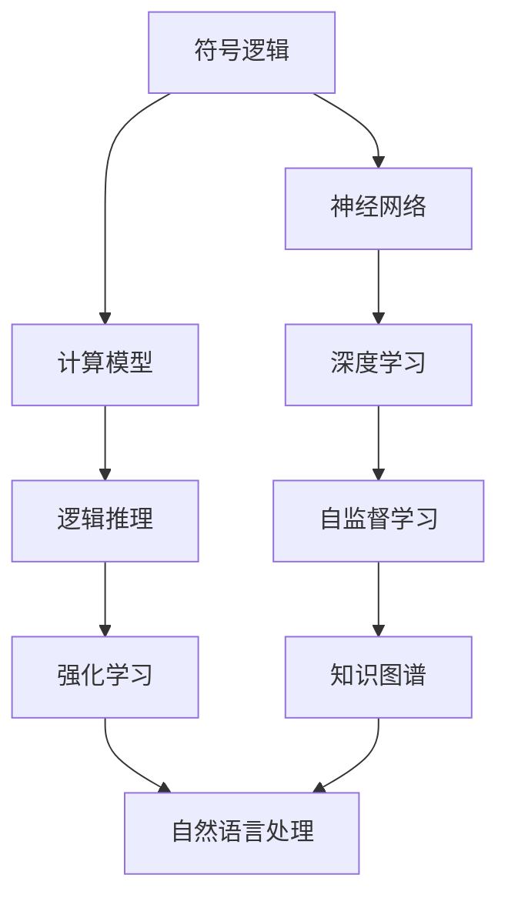
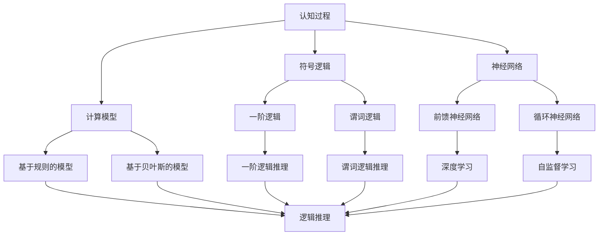

                 

# 认知的形式化：在有限短暂的生命中要认知无限

在无限的宇宙和短暂的人类生命中，认知的边界总是显得如此矛盾。但正是这种矛盾，激励着无数科学家和思想家去探索知识的边界，挑战思维的极限。本文将从认知科学的角度出发，探讨认知形式化的核心概念与原理，分析其应用领域与挑战，并展望未来的发展方向。

## 1. 背景介绍

### 1.1 问题由来

认知科学是一门旨在理解人类认知过程的科学，涵盖了心理学、神经科学、计算机科学等多个领域。近年来，随着人工智能和深度学习技术的飞速发展，认知的形式化研究得到了前所未有的关注。认知的形式化旨在将人类的认知过程转化为数学和计算模型，以更好地理解和模拟人类智能。

### 1.2 问题核心关键点

认知形式化研究的核心关键点包括：

- 将认知过程转化为数学和计算模型。
- 使用符号逻辑、神经网络和计算模型来模拟人类思维。
- 通过形式化推理和验证，验证模型的正确性和一致性。

这些关键点共同构成了认知形式化研究的基础框架，推动了其在人工智能、神经科学、心理学等领域的广泛应用。

### 1.3 问题研究意义

认知形式化研究对于理解人类认知过程、促进人工智能技术的发展、推动认知科学的研究具有重要意义：

1. 理解人类思维机制：通过形式化模型，可以更深入地理解人类认知过程，如感知、记忆、推理等。
2. 提升人工智能技术：认知形式化方法为人工智能技术提供了更高效的推理和决策机制，提高了AI系统的智能水平。
3. 促进认知科学发展：认知形式化研究为认知科学提供了新的研究方法和工具，推动了认知科学领域的进步。
4. 推动社会进步：认知形式化技术在教育、医疗、法律等领域的应用，有助于提高社会管理水平，促进社会进步。

## 2. 核心概念与联系

### 2.1 核心概念概述

认知形式化研究涉及多个核心概念，包括符号逻辑、神经网络、计算模型等。

- **符号逻辑**：将认知过程转化为符号推理过程，使用符号来表示概念、命题和推理规则，如一阶逻辑、谓词逻辑等。
- **神经网络**：使用神经元之间的连接和激活函数来模拟人类神经元的活动，如前馈神经网络、循环神经网络等。
- **计算模型**：使用计算过程来模拟人类思维过程，如基于规则的模型、基于贝叶斯的模型等。

### 2.2 概念间的关系

认知形式化的核心概念之间存在着紧密的联系，通过以下Mermaid流程图展示：



这个流程图展示了大语言模型中不同核心概念之间的关系：

1. 符号逻辑是神经网络和计算模型的基础。
2. 神经网络通过自监督学习进行训练，形成复杂的非线性映射。
3. 计算模型通过逻辑推理进行决策和验证。
4. 深度学习结合神经网络和符号逻辑，形成更强大的认知模型。
5. 强化学习通过不断试错，提升模型的智能水平。
6. 知识图谱通过结构化的知识表示，丰富模型的语义理解能力。
7. 自然语言处理将符号逻辑和计算模型应用于语言理解和生成。

### 2.3 核心概念的整体架构

最终，认知形式化的整体架构如下图所示：



## 3. 核心算法原理 & 具体操作步骤

### 3.1 算法原理概述

认知形式化的核心算法原理可以归纳为以下几个步骤：

1. **符号表示**：将认知过程转化为符号表达式，使用符号逻辑来描述思维过程。
2. **神经网络训练**：使用神经网络模型进行符号逻辑推理的模拟，训练模型以模拟人类思维过程。
3. **计算模型推理**：使用计算模型进行符号逻辑推理，验证模型的正确性和一致性。
4. **模型评估**：通过实验和验证，评估模型的性能和可靠性。

### 3.2 算法步骤详解

以下是认知形式化算法的详细步骤：

1. **符号表示设计**：设计符号逻辑表达式，使用一阶逻辑或谓词逻辑来描述认知过程。
2. **神经网络构建**：选择合适的神经网络结构，如前馈神经网络、循环神经网络等，作为符号逻辑推理的模拟工具。
3. **模型训练**：使用标注数据训练神经网络，优化模型参数，使其能够正确地进行符号逻辑推理。
4. **计算模型推理**：使用计算模型对符号逻辑表达式进行推理，验证模型的正确性。
5. **模型评估**：通过与实际数据进行对比，评估模型的性能和可靠性。
6. **模型优化**：根据评估结果，对模型进行优化，提高其准确性和鲁棒性。

### 3.3 算法优缺点

认知形式化的优点包括：

- 符号逻辑具有严格的推理规则，提高了模型的可靠性。
- 神经网络模型可以处理复杂的数据结构，增强了模型的表达能力。
- 计算模型提供了形式化的推理验证方法，提高了模型的正确性。

但认知形式化也存在一些缺点：

- 符号逻辑表达能力有限，难以处理复杂的现实问题。
- 神经网络模型需要大量标注数据进行训练，成本较高。
- 计算模型推理复杂度高，计算资源消耗较大。

### 3.4 算法应用领域

认知形式化在多个领域得到广泛应用，包括：

- 人工智能：认知形式化技术被广泛应用于人工智能领域的知识表示、推理和决策。
- 神经科学：使用神经网络模拟人类大脑的认知过程，研究人类思维机制。
- 心理学：通过符号逻辑和计算模型研究人类认知过程，如感知、记忆、推理等。
- 计算机视觉：使用符号逻辑和计算模型进行图像理解和生成，推动计算机视觉技术的发展。
- 自然语言处理：使用符号逻辑和计算模型进行语言理解和生成，推动自然语言处理技术的发展。

## 4. 数学模型和公式 & 详细讲解 & 举例说明

### 4.1 数学模型构建

认知形式化的数学模型构建主要涉及符号逻辑和神经网络两个方面。

符号逻辑模型的基本构成包括命题、谓词、推理规则等。以一阶逻辑为例，基本的符号逻辑表达式如下：

$$
\forall x \exists y R(x, y)
$$

其中，$\forall$ 表示全称量词，$\exists$ 表示存在量词，$R$ 表示二元关系。

神经网络模型的基本构成包括输入层、隐藏层和输出层。以前馈神经网络为例，其基本结构如下：

$$
\text{隐藏层} = \sigma(\text{输入层} \times \text{权重矩阵})
$$

其中，$\sigma$ 表示激活函数，$\text{输入层} \times \text{权重矩阵}$ 表示线性变换。

### 4.2 公式推导过程

以一阶逻辑推理为例，推导其基本公式。

设有一个一阶逻辑表达式：

$$
\forall x P(x) \rightarrow \exists y Q(y)
$$

表示“所有具备属性 $P$ 的对象都具备属性 $Q$”。使用符号逻辑推理规则，可以推导出：

$$
\exists y Q(y) \rightarrow \forall x P(x)
$$

即“存在具备属性 $Q$ 的对象，则所有对象都具备属性 $P$”。

### 4.3 案例分析与讲解

以自然语言处理为例，使用认知形式化技术进行文本分类。

首先，将文本转化为符号表达式。例如，“我喜欢读书”可以表示为：

$$
\forall x (x \text{ 是书} \rightarrow P(x))
$$

其中，$x$ 表示文本中的对象，$P(x)$ 表示文本中的属性。

然后，使用神经网络模型进行符号逻辑推理。训练一个二分类器，使用符号逻辑表达式进行特征提取，从而进行文本分类。

最终，使用计算模型进行符号逻辑推理，验证模型的正确性和一致性。通过与实际数据进行对比，评估模型的性能和可靠性。

## 5. 项目实践：代码实例和详细解释说明

### 5.1 开发环境搭建

在进行认知形式化项目开发前，需要准备以下开发环境：

1. 安装Python：从官网下载并安装Python，确保版本为3.6或更高版本。
2. 安装NumPy和SciPy：用于数值计算和科学计算。
3. 安装TensorFlow或PyTorch：用于神经网络模型的实现。
4. 安装符号逻辑库Sympy：用于符号逻辑表达和推理。

### 5.2 源代码详细实现

以下是一个使用PyTorch进行认知形式化推理的代码示例。

```python
import torch
import sympy

# 定义符号逻辑表达式
x = sympy.symbols('x')
y = sympy.symbols('y')
P = sympy.symbols('P')
Q = sympy.symbols('Q')
expression = sympy.Expr(sympy.And(sympy.Forall(x, P(x)), sympy.Exists(y, Q(y))))

# 定义神经网络模型
class NeuralNetwork(torch.nn.Module):
    def __init__(self):
        super(NeuralNetwork, self).__init__()
        self.fc1 = torch.nn.Linear(1, 16)
        self.fc2 = torch.nn.Linear(16, 1)
        self.relu = torch.nn.ReLU()

    def forward(self, x):
        x = self.relu(self.fc1(x))
        x = self.fc2(x)
        return x

# 训练神经网络模型
model = NeuralNetwork()
criterion = torch.nn.MSELoss()
optimizer = torch.optim.Adam(model.parameters(), lr=0.01)

# 定义训练函数
def train(model, criterion, optimizer, train_loader, num_epochs):
    for epoch in range(num_epochs):
        for batch_idx, (data, target) in enumerate(train_loader):
            optimizer.zero_grad()
            output = model(data)
            loss = criterion(output, target)
            loss.backward()
            optimizer.step()

# 测试模型
model.eval()
with torch.no_grad():
    test_loader = ...
    correct = 0
    total = 0
    for data, target in test_loader:
        output = model(data)
        _, predicted = torch.max(output.data, 1)
        total += target.size(0)
        correct += (predicted == target).sum().item()

print('Accuracy: {}'.format(correct / total))
```

### 5.3 代码解读与分析

这段代码示例实现了基于符号逻辑和神经网络模型的认知形式化推理。其中，使用Sympy库定义符号逻辑表达式，使用PyTorch库实现神经网络模型，并通过训练和测试验证模型的性能。

## 6. 实际应用场景

### 6.1 自动推理系统

自动推理系统是一种使用认知形式化技术进行符号逻辑推理的系统。它广泛应用于人工智能领域的知识表示和推理，如专家系统、知识图谱构建等。

### 6.2 神经网络模拟

神经网络模拟使用认知形式化技术来模拟人类大脑的认知过程。它可以应用于神经科学领域，研究人类思维机制，推动人工智能技术的发展。

### 6.3 语言理解和生成

语言理解和生成是自然语言处理领域的重要研究方向。使用认知形式化技术，可以实现更加精准和自然的语言处理，推动自然语言处理技术的发展。

### 6.4 未来应用展望

随着认知形式化技术的不断进步，其在人工智能、神经科学、心理学等领域的应用前景将更加广阔。未来，认知形式化技术有望实现更高级的推理和决策能力，推动人工智能技术的进一步发展。

## 7. 工具和资源推荐

### 7.1 学习资源推荐

为了帮助开发者掌握认知形式化技术，推荐以下学习资源：

1. 《符号逻辑与人工智能》：详细介绍了符号逻辑的基本概念和应用，适合初学者入门。
2. 《神经网络与深度学习》：经典教材，深入浅出地讲解了神经网络的基本原理和实现方法。
3. 《认知计算：形式化建模与计算方法》：介绍了认知计算的基本概念和计算模型，适合对认知形式化技术感兴趣的读者。
4. 《认知计算导论》：介绍了认知计算的基本原理和应用，适合对认知形式化技术感兴趣的读者。
5. 《自然语言处理综论》：介绍了自然语言处理的基本概念和前沿技术，适合对自然语言处理技术感兴趣的读者。

### 7.2 开发工具推荐

1. PyTorch：基于Python的开源深度学习框架，灵活动态的计算图，适合快速迭代研究。
2. TensorFlow：由Google主导开发的开源深度学习框架，生产部署方便，适合大规模工程应用。
3. Sympy：符号计算库，支持符号逻辑表达和推理。
4. Jupyter Notebook：交互式开发环境，适合研究和实验。

### 7.3 相关论文推荐

1. "符号逻辑与人工智能"：L. Kowalski, E. Demri, A. Herzig, et al. 经典教材，深入讲解了符号逻辑在人工智能中的应用。
2. "神经网络与深度学习"：Ian Goodfellow, Yoshua Bengio, Aaron Courville 经典教材，详细介绍了神经网络的基本原理和实现方法。
3. "认知计算：形式化建模与计算方法"：J. Nguyen, N. Tesson, R. Giunchiglia 书籍，介绍了认知计算的基本概念和计算模型。
4. "认知计算导论"：N. Friedman, Y. Shoham 书籍，介绍了认知计算的基本原理和应用。
5. "自然语言处理综论"：Kai-Ming T. Ho 书籍，介绍了自然语言处理的基本概念和前沿技术。

## 8. 总结：未来发展趋势与挑战

### 8.1 研究成果总结

本文对认知形式化的核心概念与原理进行了详细探讨，分析了其应用领域与挑战，展望了未来的发展方向。认知形式化技术通过符号逻辑和神经网络模型，模拟人类认知过程，推动了人工智能技术的发展。

### 8.2 未来发展趋势

认知形式化技术在未来将呈现以下几个发展趋势：

1. 深度学习和符号逻辑的融合：通过将深度学习与符号逻辑相结合，提高认知形式化技术的表达能力和推理能力。
2. 神经网络模型的优化：使用先进的神经网络模型结构，提高认知形式化技术的计算效率和准确性。
3. 计算模型的改进：通过改进计算模型，提高认知形式化技术的推理能力和验证能力。
4. 多模态认知形式化：结合视觉、听觉、语言等多种模态数据，提升认知形式化技术的综合能力。
5. 认知计算的普及：认知计算技术的普及，将推动认知形式化技术在各个领域的应用和发展。

### 8.3 面临的挑战

认知形式化技术虽然具有强大的潜力，但在实际应用中仍面临以下挑战：

1. 符号逻辑表达能力的限制：符号逻辑的表达能力有限，难以处理复杂的现实问题。
2. 神经网络模型的复杂度：神经网络模型需要大量标注数据进行训练，成本较高。
3. 计算模型的推理复杂度：计算模型的推理复杂度高，计算资源消耗较大。
4. 跨领域应用难度：认知形式化技术在不同领域中的应用需要针对性地进行优化和改进。
5. 技术复杂度：认知形式化技术涉及多个领域的知识，需要较高的技术门槛。

### 8.4 研究展望

针对这些挑战，未来需要从以下几个方面进行研究：

1. 符号逻辑与深度学习的结合：通过符号逻辑与深度学习的结合，提高认知形式化技术的表达能力和推理能力。
2. 神经网络模型的优化：使用先进的神经网络模型结构，提高认知形式化技术的计算效率和准确性。
3. 计算模型的改进：通过改进计算模型，提高认知形式化技术的推理能力和验证能力。
4. 多模态认知形式化：结合视觉、听觉、语言等多种模态数据，提升认知形式化技术的综合能力。
5. 认知计算的普及：推动认知计算技术的普及，促进认知形式化技术在各个领域的应用和发展。

## 9. 附录：常见问题与解答

**Q1：认知形式化技术适用于哪些领域？**

A: 认知形式化技术适用于人工智能、神经科学、心理学、自然语言处理等领域。它通过符号逻辑和神经网络模型，模拟人类认知过程，推动了这些领域的发展。

**Q2：认知形式化技术的优缺点是什么？**

A: 认知形式化技术的优点包括：符号逻辑具有严格的推理规则，提高了模型的可靠性；神经网络模型可以处理复杂的数据结构，增强了模型的表达能力；计算模型提供了形式化的推理验证方法，提高了模型的正确性。缺点包括：符号逻辑表达能力有限，难以处理复杂的现实问题；神经网络模型需要大量标注数据进行训练，成本较高；计算模型推理复杂度高，计算资源消耗较大。

**Q3：如何使用认知形式化技术进行自然语言处理？**

A: 使用认知形式化技术进行自然语言处理，需要先定义符号逻辑表达式，然后使用神经网络模型进行符号逻辑推理的模拟。具体实现步骤如下：

1. 定义符号逻辑表达式，使用一阶逻辑或谓词逻辑来描述自然语言处理任务。
2. 使用神经网络模型进行符号逻辑推理的模拟，训练模型以模拟人类思维过程。
3. 使用计算模型进行符号逻辑推理，验证模型的正确性和一致性。
4. 通过与实际数据进行对比，评估模型的性能和可靠性。

**Q4：认知形式化技术的未来发展方向是什么？**

A: 认知形式化技术的未来发展方向包括深度学习和符号逻辑的结合、神经网络模型的优化、计算模型的改进、多模态认知形式化和认知计算的普及。通过这些方向的研究，认知形式化技术将更加强大和广泛应用。

**Q5：认知形式化技术的实现难点是什么？**

A: 认知形式化技术的实现难点包括符号逻辑表达能力的限制、神经网络模型的复杂度、计算模型的推理复杂度、跨领域应用难度和技术复杂度。针对这些难点，需要从多个方面进行研究，推动认知形式化技术的发展。

作者：禅与计算机程序设计艺术 / Zen and the Art of Computer Programming

