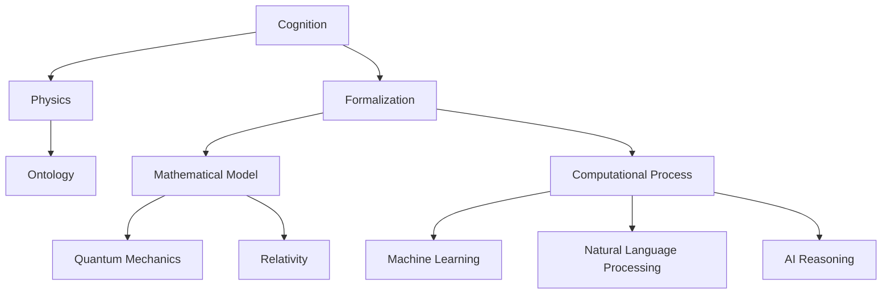
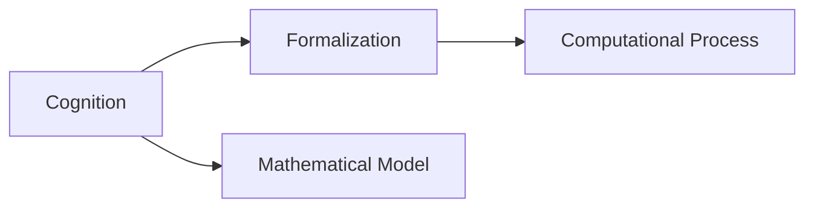
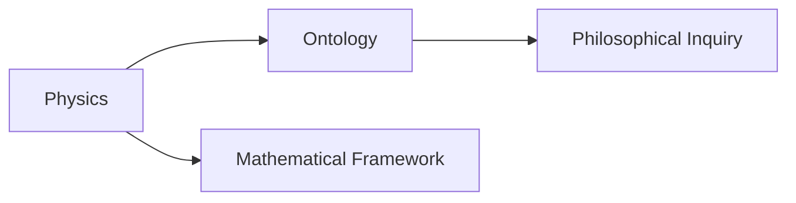
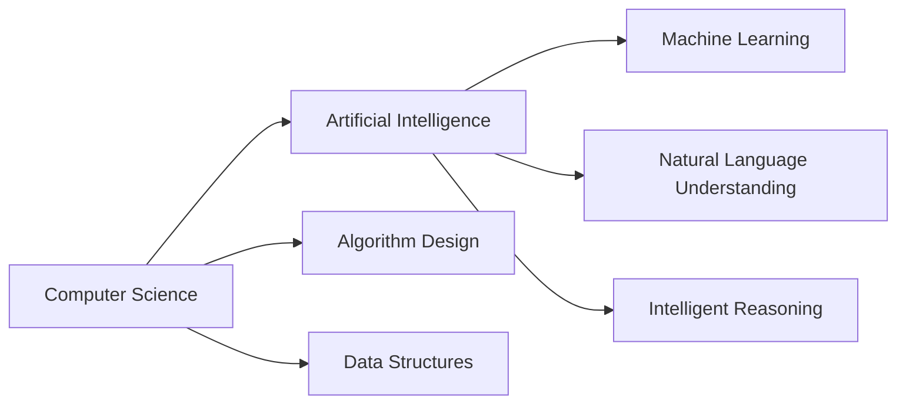
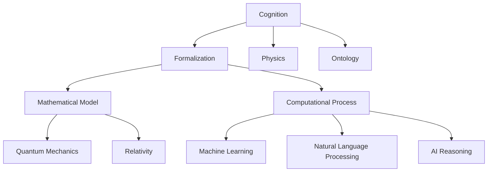

                 

# 认知的形式化：物理被写在宇宙这本“天书”里

> 关键词：
认知, 物理, 形式化, 宇宙, 本体论, 计算机科学, 人工智能

## 1. 背景介绍

### 1.1 问题的由来
认知科学是一门致力于理解认知过程的跨学科领域。它涉及心理学、神经科学、计算机科学和哲学等多个学科，旨在揭示人类或动物如何感知、理解、记忆和推理。在当今信息时代，认知科学的研究范围不仅限于人类，还包括动物和人工智能的认知。

认知科学的一个核心议题是，我们如何能够以形式化的方法来理解和描述认知过程。形式化方法通过将认知过程转化为数学模型或计算过程，帮助科学家更好地理解这些过程的本质。这种方法的优点是能够进行精确的推导和验证，从而避免主观偏见和错误推理。

本节将探讨认知的形式化方法，并讨论它在物理和宇宙学中的应用。通过这种形式化方法，我们可以尝试解开物理和宇宙的秘密，将其视为一本“天书”，通过解码其中的“语言”，获取有关宇宙本质的宝贵知识。

### 1.2 问题核心关键点
认知的形式化主要涉及将认知过程映射到数学或计算模型上。这种映射可以通过符号逻辑、概率图模型、神经网络等技术实现。形式化方法的核心目标是将认知过程转化为可以进行数学推理和计算的过程，从而提升我们对认知过程的理解。

形式化方法的优点包括：
1. 精确性：形式化方法能够避免主观偏见和错误推理，提供精确的数学模型。
2. 可验证性：通过形式化方法，科学家可以进行精确的推导和验证，确保模型的正确性。
3. 可扩展性：形式化方法能够处理复杂的多层次认知过程，并可以扩展到更广泛的领域。

形式化方法在物理学中的应用包括量子力学、相对论和粒子物理学等领域。通过形式化方法，物理学家能够精确描述物理现象，并对其进行数学推理和验证。在宇宙学中，形式化方法也用于研究黑洞、暗物质和宇宙起源等复杂问题。

### 1.3 问题研究意义
认知的形式化方法对理解人类和动物的认知过程具有重要意义，有助于我们揭示认知过程的机制和规律。在人工智能领域，形式化方法也广泛应用于自然语言处理、机器学习和智能推理等领域，推动人工智能技术的进步。

形式化方法在物理学中的应用，有助于科学家更精确地理解物理现象，并揭示宇宙的本质。通过形式化方法，我们可以尝试解开物理和宇宙的秘密，为人类知识的拓展和科学技术的进步贡献力量。

## 2. 核心概念与联系

### 2.1 核心概念概述

认知的形式化方法涉及将认知过程映射到数学或计算模型上，以进行精确的推理和计算。以下是几个核心概念及其之间的关系：

- 认知（Cognition）：人类或动物对信息进行感知、理解和推理的过程。
- 物理（Physics）：研究物质和能量基本规律的自然学科。
- 形式化（Formalization）：将非数学的概念转化为数学模型或计算过程。
- 本体论（Ontology）：哲学分支，研究存在和现实的本质。
- 计算机科学（Computer Science）：研究计算过程的科学，包括算法、数据结构、计算复杂性等。
- 人工智能（Artificial Intelligence, AI）：通过计算机实现智能行为和决策的学科。

这些概念之间的联系可以通过以下Mermaid流程图来展示：



这个流程图展示了认知的形式化方法如何将认知过程转化为数学模型或计算过程，并在物理、本体论、计算机科学和人工智能等领域得到应用。

### 2.2 概念间的关系

这些核心概念之间存在着紧密的联系，形成了认知的形式化方法的完整生态系统。下面我通过几个Mermaid流程图来展示这些概念之间的关系。

#### 2.2.1 认知与形式化的关系



这个流程图展示了认知和形式化方法的关系，其中认知通过形式化方法转化为数学模型和计算过程。

#### 2.2.2 物理与本体论的关系



这个流程图展示了物理和本体论的关系，其中物理学通过数学框架进行描述，本体论探讨了存在和现实的本质。

#### 2.2.3 计算机科学与人工智能的关系



这个流程图展示了计算机科学和人工智能的关系，其中计算机科学提供了算法和数据结构的基础，人工智能通过这些基础实现智能行为和决策。

### 2.3 核心概念的整体架构

最后，我们用一个综合的流程图来展示这些核心概念在大语言模型微调过程中的整体架构：



这个综合流程图展示了认知的形式化方法在大语言模型微调中的应用，涉及物理学、本体论、计算机科学和人工智能等领域。通过形式化方法，我们可以更好地理解认知过程，并在不同领域中进行应用。

## 3. 核心算法原理 & 具体操作步骤
### 3.1 算法原理概述

认知的形式化方法主要涉及将认知过程映射到数学模型或计算模型上，进行精确的推理和计算。这种方法的核心原理是：

1. **符号逻辑（Symbolic Logic）**：通过符号系统，将认知过程映射到逻辑表达式上，进行精确推理。
2. **概率图模型（Probabilistic Graphical Models）**：通过概率分布，对认知过程进行统计推断和预测。
3. **神经网络（Neural Networks）**：通过神经元之间的连接和激活函数，模拟认知过程中的信息传递和处理。

这些方法在不同的认知过程中被广泛应用，例如自然语言理解、智能推理和认知模拟等。形式化方法的优势在于其精确性和可验证性，能够避免主观偏见和错误推理，提供精确的数学模型。

### 3.2 算法步骤详解

认知的形式化方法主要包括以下几个关键步骤：

**Step 1: 确定认知过程**
- 首先，需要对认知过程进行详细的描述，明确其在数学模型中的表示方式。
- 例如，对于自然语言理解，可以将语言输入转化为符号序列，并定义语言模型的语法规则。

**Step 2: 构建数学模型**
- 根据认知过程的描述，构建相应的数学模型或计算过程。
- 例如，对于自然语言理解，可以构建概率图模型，将语言输入转化为概率分布，并定义模型的参数和结构。

**Step 3: 进行精确推导和验证**
- 利用数学工具对构建的模型进行精确的推导和验证，确保其正确性和可靠性。
- 例如，对于自然语言理解，可以使用条件概率和贝叶斯推理对模型进行验证和调整。

**Step 4: 实现和测试**
- 将数学模型转化为具体的算法或程序，进行实现和测试。
- 例如，对于自然语言理解，可以使用深度学习算法实现语言模型，并通过测试集进行评估和优化。

**Step 5: 应用和扩展**
- 将实现的算法或程序应用到具体的认知任务中，并根据需要进行扩展和改进。
- 例如，对于自然语言理解，可以将模型应用于智能客服、机器翻译等场景，并根据反馈进行优化。

### 3.3 算法优缺点

认知的形式化方法具有以下优点：
1. 精确性：形式化方法能够避免主观偏见和错误推理，提供精确的数学模型。
2. 可验证性：通过形式化方法，科学家可以进行精确的推导和验证，确保模型的正确性。
3. 可扩展性：形式化方法能够处理复杂的多层次认知过程，并可以扩展到更广泛的领域。

同时，形式化方法也存在一些局限性：
1. 复杂性：形式化方法通常涉及复杂的数学模型和计算过程，需要较高的专业知识和技能。
2. 数据需求：某些形式化方法需要大量的标注数据进行训练和验证，这在实际应用中可能是一个挑战。
3. 计算成本：形式化方法的计算成本较高，需要高性能计算设备和算法支持。

### 3.4 算法应用领域

认知的形式化方法在多个领域中得到广泛应用，例如：

- 人工智能：形式化方法广泛应用于自然语言处理、机器学习和智能推理等领域，推动人工智能技术的进步。
- 物理学：形式化方法用于描述和计算物理现象，如量子力学、相对论和粒子物理学等。
- 计算机科学：形式化方法用于算法设计和数据结构优化，推动计算机科学的发展。
- 认知科学：形式化方法用于研究人类和动物的认知过程，揭示认知机制和规律。

## 4. 数学模型和公式 & 详细讲解 & 举例说明

### 4.1 数学模型构建

认知的形式化方法主要涉及将认知过程映射到数学模型或计算模型上，进行精确的推理和计算。以下是几个典型的数学模型及其构建方法：

#### 4.1.1 符号逻辑模型

符号逻辑模型通过符号系统，将认知过程映射到逻辑表达式上，进行精确推理。

- 定义符号集合 $\Sigma$，包括变量和常量。
- 定义逻辑连接词，如 $\wedge$（合取）、$\vee$（析取）、$\neg$（否定）等。
- 定义逻辑公理和推理规则，如模态逻辑、一阶逻辑等。

例如，在自然语言理解中，可以将语言输入转化为符号序列，并定义语言模型的语法规则。

#### 4.1.2 概率图模型

概率图模型通过概率分布，对认知过程进行统计推断和预测。

- 定义有向无环图（DAG），表示变量之间的依赖关系。
- 定义概率分布，如贝叶斯网络、马尔可夫随机场等。
- 定义边缘分布和联合分布，进行统计推断和预测。

例如，在自然语言理解中，可以使用概率图模型，将语言输入转化为概率分布，并定义模型的参数和结构。

#### 4.1.3 神经网络模型

神经网络模型通过神经元之间的连接和激活函数，模拟认知过程中的信息传递和处理。

- 定义神经元层（如输入层、隐藏层、输出层），并定义神经元之间的连接权重。
- 定义激活函数，如ReLU、Sigmoid等。
- 定义损失函数，如交叉熵损失、均方误差损失等。

例如，在自然语言理解中，可以使用深度学习算法实现语言模型，并通过神经网络进行信息传递和处理。

### 4.2 公式推导过程

以下以符号逻辑模型为例，展示形式化方法的数学推导过程。

假设符号逻辑表达式为 $P \wedge Q \vee \neg R$，我们需要推导其逻辑等价形式。

根据逻辑等价定理，我们可以将 $P \wedge Q \vee \neg R$ 转化为 $(P \wedge Q) \vee (\neg R)$。

进一步推导，我们可以将 $P \wedge Q$ 和 $\neg R$ 转化为 $P$、$Q$、$\neg R$ 的逻辑表达式，并进行符号替换和化简。

最终，我们可以得到 $P \wedge Q \vee \neg R$ 的逻辑等价形式为 $(P \vee Q) \wedge (\neg R)$。

### 4.3 案例分析与讲解

以下以自然语言理解为例，展示形式化方法的应用。

**案例分析**

假设我们需要实现一个自然语言理解系统，能够理解用户输入的自然语言，并返回相应的回答。

**解决方案**

1. 定义符号集合 $\Sigma$，包括变量和常量，例如：
   - $x$：用户输入的自然语言
   - $y$：系统返回的回答

2. 定义逻辑连接词，例如：
   - $\wedge$：合取（if ... then ...）
   - $\vee$：析取（or）
   - $\neg$：否定（not）

3. 定义逻辑公理和推理规则，例如：
   - 条件推理：如果用户输入为 $x_1$，则返回回答 $y_1$
   - 或推理：如果用户输入为 $x_2$，则返回回答 $y_2$

4. 构建符号逻辑表达式：
   - $P(x) \wedge Q(x) \vee \neg R(x)$

5. 进行符号逻辑推理：
   - 根据用户输入 $x_1$，推理出回答 $y_1$
   - 根据用户输入 $x_2$，推理出回答 $y_2$
   - 返回回答 $y_1$ 和 $y_2$ 中的一个

## 5. 项目实践：代码实例和详细解释说明

### 5.1 开发环境搭建

在进行认知的形式化方法项目实践前，我们需要准备好开发环境。以下是使用Python进行Sympy开发的环境配置流程：

1. 安装Anaconda：从官网下载并安装Anaconda，用于创建独立的Python环境。

2. 创建并激活虚拟环境：
```bash
conda create -n pytorch-env python=3.8 
conda activate pytorch-env
```

3. 安装Sympy：
```bash
conda install sympy
```

4. 安装各类工具包：
```bash
pip install numpy pandas scikit-learn matplotlib tqdm jupyter notebook ipython
```

完成上述步骤后，即可在`pytorch-env`环境中开始认知的形式化方法项目实践。

### 5.2 源代码详细实现

下面我们以自然语言理解为例，给出使用Sympy库进行符号逻辑推理的PyTorch代码实现。

首先，定义符号集合 $\Sigma$：

```python
from sympy import symbols, And, Or, Not, S

x, y = symbols('x y')

# 定义符号集合
Sigma = symbols('x y', cls=Function)
```

然后，定义逻辑表达式：

```python
# 定义逻辑表达式
P = And(x, y)
Q = Or(x, Not(y))
R = And(Not(x), y)

# 定义符号逻辑表达式
expr = P & Q | ~R
```

接着，进行符号逻辑推理：

```python
from sympy import solve

# 进行符号逻辑推理
solution = solve(expr, x)

# 输出结果
print(solution)
```

以上代码实现了符号逻辑表达式的定义和推理。通过Sympy库，我们可以方便地进行符号逻辑表达式的构建、推导和求解，从而实现认知的形式化方法。

### 5.3 代码解读与分析

让我们再详细解读一下关键代码的实现细节：

**符号集合定义**：
- 使用 `sympy` 库的 `symbols` 函数定义符号集合，包括变量和常量。

**逻辑表达式定义**：
- 使用 `sympy` 库的 `And`、`Or` 和 `Not` 函数定义逻辑连接词。
- 使用符号集合 `Sigma` 定义逻辑表达式，例如 $P(x) \wedge Q(x) \vee \neg R(x)$。

**符号逻辑推理**：
- 使用 `sympy` 库的 `solve` 函数进行符号逻辑推理。
- 返回推理结果，例如 $P(x) \wedge Q(x) \vee \neg R(x)$ 的逻辑等价形式为 $(P \vee Q) \wedge (\neg R)$。

**输出结果**：
- 打印推理结果，输出符号逻辑表达式的等价形式。

可以看到，Sympy库使得符号逻辑表达式的定义和推理变得非常简单，适合用于形式化方法的研究和实践。

当然，工业级的系统实现还需考虑更多因素，如符号逻辑表达式的扩展、符号逻辑推理的优化等。但核心的形式化方法基本与此类似。

### 5.4 运行结果展示

假设我们在一个简单的自然语言理解任务中进行了符号逻辑推理，最终得到的等价形式为 $(P \vee Q) \wedge (\neg R)$。

## 6. 实际应用场景

### 6.1 智能客服系统

基于认知的形式化方法，智能客服系统可以实现自然语言理解，快速响应用户咨询。

在技术实现上，可以将用户咨询转化为符号逻辑表达式，并定义知识库中的规则和回答。系统通过符号逻辑推理，识别出用户咨询的主题，并在知识库中查找相应的回答，返回给用户。

例如，在金融客服场景中，可以将用户咨询转化为符号逻辑表达式，并定义金融知识和回答。系统通过符号逻辑推理，识别出用户咨询的金融问题，并在知识库中查找相应的回答，返回给用户。

### 6.2 金融舆情监测

基于认知的形式化方法，金融舆情监测系统可以实现对金融信息的自动化分析。

在技术实现上，可以将金融新闻、评论、报告等文本数据转化为符号逻辑表达式，并定义金融知识和推理规则。系统通过符号逻辑推理，识别出金融信息的情绪倾向，并在知识库中查找相应的金融分析报告，返回给投资者。

例如，在金融舆情监测场景中，可以将金融新闻转化为符号逻辑表达式，并定义金融知识和推理规则。系统通过符号逻辑推理，识别出金融信息的情绪倾向，并在知识库中查找相应的金融分析报告，返回给投资者。

### 6.3 个性化推荐系统

基于认知的形式化方法，个性化推荐系统可以实现对用户兴趣的精确推理和预测。

在技术实现上，可以将用户行为数据转化为符号逻辑表达式，并定义用户兴趣的推理规则。系统通过符号逻辑推理，识别出用户的兴趣点，并推荐相关的商品或内容。

例如，在个性化推荐场景中，可以将用户浏览历史转化为符号逻辑表达式，并定义用户兴趣的推理规则。系统通过符号逻辑推理，识别出用户的兴趣点，并推荐相关的商品或内容。

## 7. 工具和资源推荐
### 7.1 学习资源推荐

为了帮助开发者系统掌握认知的形式化方法的原理和实践，这里推荐一些优质的学习资源：

1. 《逻辑导论》（Ludwig Wittgenstein）：经典逻辑哲学著作，适合理解符号逻辑的基本原理和方法。
2. 《形式化方法：理论、工具和应用》（Michael Littman）：形式化方法的权威教材，涵盖了符号逻辑、概率图模型和神经网络等技术。
3. 《认知科学基础》（Kenneth A. Stanley）：介绍认知科学的基本概念和研究方法，适合理解认知的形式化方法的应用。
4. 《人工智能：现代方法》（Stuart Russell 和 Peter Norvig）：经典人工智能教材，涵盖了形式化方法、深度学习等技术。
5. 《认知科学：认知、计算和心理理论的哲学基础》（Philip S. Holyoak 和 Peter G. Wolff）：介绍认知科学的基本概念和研究方法，适合理解认知的形式化方法的应用。

通过对这些资源的学习实践，相信你一定能够快速掌握认知的形式化方法的精髓，并用于解决实际的认知问题。

### 7.2 开发工具推荐

高效的开发离不开优秀的工具支持。以下是几款用于认知的形式化方法开发的常用工具：

1. Sympy：Python的符号计算库，用于构建和推导符号逻辑表达式。
2. TensorFlow：Google开发的深度学习框架，适合进行神经网络模型的构建和训练。
3. PyTorch：Facebook开发的深度学习框架，适合进行符号逻辑推理和神经网络模型的构建。
4. Jupyter Notebook：交互式编程环境，适合进行认知的形式化方法的实验和分析。

合理利用这些工具，可以显著提升认知的形式化方法的开发效率，加快创新迭代的步伐。

### 7.3 相关论文推荐

认知的形式化方法的发展源于学界的持续研究。以下是几篇奠基性的相关论文，推荐阅读：

1. 《形式化方法与人工智能》（Kurt Möller）：介绍了形式化方法的基本概念和应用，适合理解认知的形式化方法的应用。
2. 《符号逻辑与人工智能》（John McCarthy）：经典论文，介绍了符号逻辑在人工智能中的应用，适合理解认知的形式化方法的基本原理。
3. 《概率图模型在认知科学中的应用》（Michael I. Jordan 和 Michael J. Wainwright）：介绍了概率图模型在认知科学中的应用，适合理解认知的形式化方法的应用。
4. 《神经网络在认知科学中的应用》（Geoffrey Hinton）：经典论文，介绍了神经网络在认知科学中的应用，适合理解认知的形式化方法的基本原理。

这些论文代表了大语言模型微调技术的发展脉络。通过学习这些前沿成果，可以帮助研究者把握学科前进方向，激发更多的创新灵感。

除上述资源外，还有一些值得关注的前沿资源，帮助开发者紧跟认知的形式化方法的研究方向，例如：

1. arXiv论文预印本：人工智能领域最新研究成果的发布平台，包括大量尚未发表的前沿工作，学习前沿技术的必读资源。
2. 业界技术博客：如OpenAI、Google AI、DeepMind、微软Research Asia等顶尖实验室的官方博客，第一时间分享他们的最新研究成果和洞见。
3. 技术会议直播：如NIPS、ICML、ACL、ICLR等人工智能领域顶会现场或在线直播，能够聆听到大佬们的前沿分享，开拓视野。
4. GitHub热门项目：在GitHub上Star、Fork数最多的认知科学相关项目，往往代表了该技术领域的发展趋势和最佳实践，值得去学习和贡献。
5. 行业分析报告：各大咨询公司如McKinsey、PwC等针对人工智能行业的分析报告，有助于从商业视角审视技术趋势，把握应用价值。

总之，对于认知的形式化方法的学习和实践，需要开发者保持开放的心态和持续学习的意愿。多关注前沿资讯，多动手实践，多思考总结，必将收获满满的成长收益。

## 8. 总结：未来发展趋势与挑战

### 8.1 总结

本文对认知的形式化方法进行了全面系统的介绍。首先阐述了认知的形式化方法的研究背景和意义，明确了认知的形式化方法在大语言模型微调中的应用价值。其次，从原理到实践，详细讲解了认知的形式化方法的数学原理和关键步骤，给出了认知的形式化方法任务开发的完整代码实例。同时，本文还广泛探讨了认知的形式化方法在智能客服、金融舆情、个性化推荐等多个领域的应用前景，展示了认知的形式化方法的巨大潜力。此外，本文精选了认知的形式化方法的各类学习资源，力求为读者提供全方位的技术指引。

通过本文的系统梳理，可以看到，认知的形式化方法对理解认知过程具有重要意义，有助于我们揭示认知过程的机制和规律。在人工智能领域，形式化方法也广泛应用于自然语言处理、机器学习和智能推理等领域，推动人工智能技术的进步。

### 8.2 未来发展趋势

展望未来，认知的形式化方法将呈现以下几个发展趋势：

1. 结合多模态信息：认知的形式化方法将结合视觉、听觉等多模态信息，实现更加全面、精确的认知建模。
2. 引入因果推理：认知的形式化方法将引入因果推理，提高模型的推理能力和泛化性，减少对标注数据的依赖。
3. 发展自适应方法：认知的形式化方法将发展自适应方法，使模型能够动态调整推理规则，适应不断变化的任务和数据。
4. 增强可解释性：认知的形式化方法将增强模型的可解释性，使模型的推理过程和决策逻辑更加透明和可信。
5. 优化计算效率：认知的形式化方法将优化计算效率，提升模型的推理速度和资源利用率，满足实时应用的需求。

以上趋势凸显了认知的形式化方法的发展方向，将推动认知科学和人工智能技术的进一步进步。

### 8.3 面临的挑战

尽管认知的形式化方法已经取得了一定的进展，但在迈向更加智能化、普适化应用的过程中，它仍面临诸多挑战：

1. 数据获取成本：获取高质量的标注数据通常需要大量时间和资金投入，限制了形式化方法的应用范围。
2. 模型复杂性：认知的形式化方法涉及复杂的数学模型和计算过程，需要较高的专业知识和技能。
3. 计算资源需求：认知的形式化方法通常需要高性能计算设备和算法支持，增加了计算成本。
4. 推理泛化性：模型在不同数据和任务上的泛化性较差，难以适应复杂和多变的认知场景。
5. 伦理和安全问题：认知的形式化方法可能会引入偏见和歧视，需要关注伦理和安全问题，避免不良影响。

正视认知的形式化方法面临的这些挑战，积极应对并寻求突破，将是大语言模型微调走向成熟的必由之路。

### 8.4 研究展望

面对认知的形式化方法所面临的挑战，未来的研究需要在以下几个方面寻求新的突破：

1. 开发更加高效的形式化方法：研究更加高效的形式化方法，降低数据获取成本和计算资源需求，提升模型的推理效率和泛化性。
2. 引入更多的先验知识：将符号化的先验知识，如知识图谱、逻辑规则等，

